##**Purpose and Scope**:

- Get the latest stock news to improve investment strategy
- Good news -optimistic investors
- Bad news - pessimistic investors e.g. negative impact to the stock market
- Bear vs bull market
- Using different metrics to do a stock comparison
- Identify trends and patterns of stock prices, market data and trading strategies
-  Conducting a comparison analysis of stock prices of the top 5 banks in canada
-  examining macroeconomic variables (e.g. unemployment rate, gdp, CPI, inflation etc)
-  Portfolio optimization - analyzing returns and providing investors with recommendations to improve stock performance and investor's strategy - short, split or long Deep Research Agents
-  Specialize in open-ended, highly complex investigations
-  Requires extensive knowledge gathering, hypothesis testing, and synthesis, literature reviews, scientific discovery or strategic market analysis
-  Combine multiple patterns: a planner -executor phase to chart research work flows; query decomposition to break down big questions into targeted searches; and reach loops to iteratively refine hypotheses based on new findings

##**Deep research agent**:
1.	Plan overall research agenda (e.g. identify subtopics or data sources)
2.	Decompose each unique subtopic into concrete queries ( via self-ask or similar)
3.	Invoke tools  (e.g. Financial News, defeatbeta-api and Open AI APIs to domain specific databases – and reflect on relevance and reliability of each result
4.	Synthesize the insights into an evolving report of a set of recommendations, using LLM -driven summarization and critique at each steps
#Multiagent Scenario
- 	Multiple agents collaborate to achieve shared goals
- 	Approach advantageous when tasks are complex and require varied toolsets, parallel processing, or adaptability to dynamic environments
- 	Benefit of multiagent specialization – each agent can be assigned a specific role or areas of expertise , allowing the system to leverage each agent’s strengths effectively
- 	Narrowing  each agent’s toolset and prompt, reducing selection errors and improve reliability


#**System Prompt and Design**

- Goals:
  1) To improve investment strategy and provide a holistic view of the volality of the top 5 banks of canada by analyzing stock close prices, market data,  of a 5 year period, provide recommendations for portfolio optimization, reduce volatility, and training for an improved automated stock research agent
- Roles and personas
  i. Roles
  ii. Personas
- Instructions:
- Guardrails
  i) Maximum of 30 sources will be used to derive financial sentiments

##**Select LLM**
- gpt-3.5_turbo

##**Tools and Integration**

1. Stock price
2. Market Data
3. Company Information
4. Comparison analysis of banks
5. Analyze 5yr stock performance
6. Stock data plot
7. Plot volatility comparison
8. profitability_analysis
9. plot_correlation_matrix

##**Memory Systems**

- RAG
- FAISS Vector Store

##**Importing Modules and Dependencies**


```python
!pip install langchain langgraph yfinance langchain_openai langchain_core langchain_community langchain_classic faiss-cpu defeatbeta-api
import json
from langgraph.graph import StateGraph, START, END
import os
from sklearn.linear_model import LinearRegression
from datetime import timedelta
import openai
import yfinance as yf
from langchain_core.tools import tool, StructuredTool, Tool
from datetime import datetime
from langchain_openai import ChatOpenAI
from langchain_community.tools import WikipediaQueryRun
from langchain_community.utilities import WikipediaAPIWrapper
from langchain_classic.agents import AgentExecutor, create_tool_calling_agent,  create_react_agent
from langchain_core.prompts import ChatPromptTemplate, MessagesPlaceholder
import requests
import matplotlib.pyplot as plt
import pandas as pd
from inspect import signature
import numpy as np
import seaborn as sns
from langgraph.types import Send
import re
from typing_extensions import TypedDict
import logging
import warnings
warnings.filterwarnings("ignore")
from IPython.display import Image, display
import defeatbeta_api
from matplotlib.colors import ListedColormap
from defeatbeta_api.data.ticker import Ticker
from langchain_community.vectorstores import FAISS
from langchain_openai import OpenAIEmbeddings
from langchain_core.messages import HumanMessage, AIMessage, ToolMessage
from langchain_core.runnables import RunnableConfig
```

    Requirement already satisfied: langchain in /usr/local/lib/python3.12/dist-packages (1.3.1)
    Requirement already satisfied: langgraph in /usr/local/lib/python3.12/dist-packages (1.2.1)
    Requirement already satisfied: yfinance in /usr/local/lib/python3.12/dist-packages (0.2.66)
    Requirement already satisfied: langchain_openai in /usr/local/lib/python3.12/dist-packages (1.2.2)
    Requirement already satisfied: langchain_core in /usr/local/lib/python3.12/dist-packages (1.4.0)
    Requirement already satisfied: langchain_community in /usr/local/lib/python3.12/dist-packages (0.4.2)
    Requirement already satisfied: langchain_classic in /usr/local/lib/python3.12/dist-packages (1.0.7)
    Requirement already satisfied: faiss-cpu in /usr/local/lib/python3.12/dist-packages (1.14.2)
    Requirement already satisfied: defeatbeta-api in /usr/local/lib/python3.12/dist-packages (0.0.59)
    Requirement already satisfied: pydantic<3.0.0,>=2.7.4 in /usr/local/lib/python3.12/dist-packages (from langchain) (2.12.3)
    Requirement already satisfied: langgraph-checkpoint<5.0.0,>=4.1.0 in /usr/local/lib/python3.12/dist-packages (from langgraph) (4.1.0)
    Requirement already satisfied: langgraph-prebuilt<1.2.0,>=1.1.0 in /usr/local/lib/python3.12/dist-packages (from langgraph) (1.1.0)
    Requirement already satisfied: langgraph-sdk<0.4.0,>=0.3.0 in /usr/local/lib/python3.12/dist-packages (from langgraph) (0.3.14)
    Requirement already satisfied: xxhash>=3.5.0 in /usr/local/lib/python3.12/dist-packages (from langgraph) (3.7.0)
    Requirement already satisfied: pandas>=1.3.0 in /usr/local/lib/python3.12/dist-packages (from yfinance) (3.0.3)
    Requirement already satisfied: numpy>=1.16.5 in /usr/local/lib/python3.12/dist-packages (from yfinance) (2.4.6)
    Requirement already satisfied: requests>=2.31 in /usr/local/lib/python3.12/dist-packages (from yfinance) (2.34.2)
    Requirement already satisfied: multitasking>=0.0.7 in /usr/local/lib/python3.12/dist-packages (from yfinance) (0.0.13)
    Requirement already satisfied: platformdirs>=2.0.0 in /usr/local/lib/python3.12/dist-packages (from yfinance) (4.9.6)
    Requirement already satisfied: pytz>=2022.5 in /usr/local/lib/python3.12/dist-packages (from yfinance) (2025.2)
    Requirement already satisfied: frozendict>=2.3.4 in /usr/local/lib/python3.12/dist-packages (from yfinance) (2.4.7)
    Requirement already satisfied: peewee>=3.16.2 in /usr/local/lib/python3.12/dist-packages (from yfinance) (4.0.6)
    Requirement already satisfied: beautifulsoup4>=4.11.1 in /usr/local/lib/python3.12/dist-packages (from yfinance) (4.13.5)
    Requirement already satisfied: curl_cffi>=0.7 in /usr/local/lib/python3.12/dist-packages (from yfinance) (0.15.0)
    Requirement already satisfied: protobuf>=3.19.0 in /usr/local/lib/python3.12/dist-packages (from yfinance) (5.29.6)
    Requirement already satisfied: websockets>=13.0 in /usr/local/lib/python3.12/dist-packages (from yfinance) (15.0.1)
    Requirement already satisfied: openai<3.0.0,>=2.26.0 in /usr/local/lib/python3.12/dist-packages (from langchain_openai) (2.37.0)
    Requirement already satisfied: tiktoken<1.0.0,>=0.7.0 in /usr/local/lib/python3.12/dist-packages (from langchain_openai) (0.13.0)
    Requirement already satisfied: jsonpatch<2.0.0,>=1.33.0 in /usr/local/lib/python3.12/dist-packages (from langchain_core) (1.33)
    Requirement already satisfied: langchain-protocol>=0.0.14 in /usr/local/lib/python3.12/dist-packages (from langchain_core) (0.0.15)
    Requirement already satisfied: langsmith<1.0.0,>=0.3.45 in /usr/local/lib/python3.12/dist-packages (from langchain_core) (0.8.5)
    Requirement already satisfied: packaging>=23.2.0 in /usr/local/lib/python3.12/dist-packages (from langchain_core) (26.2)
    Requirement already satisfied: pyyaml<7.0.0,>=5.3.0 in /usr/local/lib/python3.12/dist-packages (from langchain_core) (6.0.3)
    Requirement already satisfied: tenacity!=8.4.0,<10.0.0,>=8.1.0 in /usr/local/lib/python3.12/dist-packages (from langchain_core) (9.1.4)
    Requirement already satisfied: typing-extensions<5.0.0,>=4.7.0 in /usr/local/lib/python3.12/dist-packages (from langchain_core) (4.15.0)
    Requirement already satisfied: uuid-utils<1.0,>=0.12.0 in /usr/local/lib/python3.12/dist-packages (from langchain_core) (0.16.0)
    Requirement already satisfied: aiohttp<4.0.0,>=3.8.3 in /usr/local/lib/python3.12/dist-packages (from langchain_community) (3.13.5)
    Requirement already satisfied: httpx-sse<1.0.0,>=0.4.0 in /usr/local/lib/python3.12/dist-packages (from langchain_community) (0.4.3)
    Requirement already satisfied: pydantic-settings<3.0.0,>=2.10.1 in /usr/local/lib/python3.12/dist-packages (from langchain_community) (2.14.1)
    Requirement already satisfied: sqlalchemy<3.0.0,>=1.4.0 in /usr/local/lib/python3.12/dist-packages (from langchain_community) (2.0.49)
    Requirement already satisfied: langchain-text-splitters<2.0.0,>=1.1.2 in /usr/local/lib/python3.12/dist-packages (from langchain_classic) (1.1.2)
    Requirement already satisfied: duckdb==1.4.3 in /usr/local/lib/python3.12/dist-packages (from defeatbeta-api) (1.4.3)
    Requirement already satisfied: psutil>=7.0.0 in /usr/local/lib/python3.12/dist-packages (from defeatbeta-api) (7.2.2)
    Requirement already satisfied: pyfiglet>=1.0.2 in /usr/local/lib/python3.12/dist-packages (from defeatbeta-api) (1.0.4)
    Requirement already satisfied: urllib3>=2.6.3 in /usr/local/lib/python3.12/dist-packages (from defeatbeta-api) (2.7.0)
    Requirement already satisfied: tabulate>=0.9.0 in /usr/local/lib/python3.12/dist-packages (from defeatbeta-api) (0.9.0)
    Requirement already satisfied: rich>=14.0.0 in /usr/local/lib/python3.12/dist-packages (from defeatbeta-api) (15.0.0)
    Requirement already satisfied: nltk>=3.9.4 in /usr/local/lib/python3.12/dist-packages (from defeatbeta-api) (3.9.4)
    Requirement already satisfied: ipython<=8.37.0,>=8.0.0 in /usr/local/lib/python3.12/dist-packages (from defeatbeta-api) (8.37.0)
    Requirement already satisfied: matplotlib>=3.10.7 in /usr/local/lib/python3.12/dist-packages (from defeatbeta-api) (3.10.9)
    Requirement already satisfied: openpyxl>=3.1.5 in /usr/local/lib/python3.12/dist-packages (from defeatbeta-api) (3.1.5)
    Requirement already satisfied: aiohappyeyeballs>=2.5.0 in /usr/local/lib/python3.12/dist-packages (from aiohttp<4.0.0,>=3.8.3->langchain_community) (2.6.2)
    Requirement already satisfied: aiosignal>=1.4.0 in /usr/local/lib/python3.12/dist-packages (from aiohttp<4.0.0,>=3.8.3->langchain_community) (1.4.0)
    Requirement already satisfied: attrs>=17.3.0 in /usr/local/lib/python3.12/dist-packages (from aiohttp<4.0.0,>=3.8.3->langchain_community) (26.1.0)
    Requirement already satisfied: frozenlist>=1.1.1 in /usr/local/lib/python3.12/dist-packages (from aiohttp<4.0.0,>=3.8.3->langchain_community) (1.8.0)
    Requirement already satisfied: multidict<7.0,>=4.5 in /usr/local/lib/python3.12/dist-packages (from aiohttp<4.0.0,>=3.8.3->langchain_community) (6.7.1)
    Requirement already satisfied: propcache>=0.2.0 in /usr/local/lib/python3.12/dist-packages (from aiohttp<4.0.0,>=3.8.3->langchain_community) (0.5.2)
    Requirement already satisfied: yarl<2.0,>=1.17.0 in /usr/local/lib/python3.12/dist-packages (from aiohttp<4.0.0,>=3.8.3->langchain_community) (1.24.2)
    Requirement already satisfied: soupsieve>1.2 in /usr/local/lib/python3.12/dist-packages (from beautifulsoup4>=4.11.1->yfinance) (2.8.3)
    Requirement already satisfied: cffi>=2.0.0 in /usr/local/lib/python3.12/dist-packages (from curl_cffi>=0.7->yfinance) (2.0.0)
    Requirement already satisfied: certifi>=2024.2.2 in /usr/local/lib/python3.12/dist-packages (from curl_cffi>=0.7->yfinance) (2026.5.20)
    Requirement already satisfied: decorator in /usr/local/lib/python3.12/dist-packages (from ipython<=8.37.0,>=8.0.0->defeatbeta-api) (4.4.2)
    Requirement already satisfied: jedi>=0.16 in /usr/local/lib/python3.12/dist-packages (from ipython<=8.37.0,>=8.0.0->defeatbeta-api) (0.20.0)
    Requirement already satisfied: matplotlib-inline in /usr/local/lib/python3.12/dist-packages (from ipython<=8.37.0,>=8.0.0->defeatbeta-api) (0.2.2)
    Requirement already satisfied: pexpect>4.3 in /usr/local/lib/python3.12/dist-packages (from ipython<=8.37.0,>=8.0.0->defeatbeta-api) (4.9.0)
    Requirement already satisfied: prompt_toolkit<3.1.0,>=3.0.41 in /usr/local/lib/python3.12/dist-packages (from ipython<=8.37.0,>=8.0.0->defeatbeta-api) (3.0.52)
    Requirement already satisfied: pygments>=2.4.0 in /usr/local/lib/python3.12/dist-packages (from ipython<=8.37.0,>=8.0.0->defeatbeta-api) (2.20.0)
    Requirement already satisfied: stack_data in /usr/local/lib/python3.12/dist-packages (from ipython<=8.37.0,>=8.0.0->defeatbeta-api) (0.6.3)
    Requirement already satisfied: traitlets>=5.13.0 in /usr/local/lib/python3.12/dist-packages (from ipython<=8.37.0,>=8.0.0->defeatbeta-api) (5.15.0)
    Requirement already satisfied: jsonpointer>=1.9 in /usr/local/lib/python3.12/dist-packages (from jsonpatch<2.0.0,>=1.33.0->langchain_core) (3.1.1)
    Requirement already satisfied: ormsgpack>=1.12.0 in /usr/local/lib/python3.12/dist-packages (from langgraph-checkpoint<5.0.0,>=4.1.0->langgraph) (1.12.2)
    Requirement already satisfied: httpx>=0.25.2 in /usr/local/lib/python3.12/dist-packages (from langgraph-sdk<0.4.0,>=0.3.0->langgraph) (0.28.1)
    Requirement already satisfied: orjson>=3.11.5 in /usr/local/lib/python3.12/dist-packages (from langgraph-sdk<0.4.0,>=0.3.0->langgraph) (3.11.9)
    Requirement already satisfied: requests-toolbelt>=1.0.0 in /usr/local/lib/python3.12/dist-packages (from langsmith<1.0.0,>=0.3.45->langchain_core) (1.0.0)
    Requirement already satisfied: zstandard>=0.23.0 in /usr/local/lib/python3.12/dist-packages (from langsmith<1.0.0,>=0.3.45->langchain_core) (0.25.0)
    Requirement already satisfied: contourpy>=1.0.1 in /usr/local/lib/python3.12/dist-packages (from matplotlib>=3.10.7->defeatbeta-api) (1.3.3)
    Requirement already satisfied: cycler>=0.10 in /usr/local/lib/python3.12/dist-packages (from matplotlib>=3.10.7->defeatbeta-api) (0.12.1)
    Requirement already satisfied: fonttools>=4.22.0 in /usr/local/lib/python3.12/dist-packages (from matplotlib>=3.10.7->defeatbeta-api) (4.63.0)
    Requirement already satisfied: kiwisolver>=1.3.1 in /usr/local/lib/python3.12/dist-packages (from matplotlib>=3.10.7->defeatbeta-api) (1.5.0)
    Requirement already satisfied: pillow>=8 in /usr/local/lib/python3.12/dist-packages (from matplotlib>=3.10.7->defeatbeta-api) (11.3.0)
    Requirement already satisfied: pyparsing>=3 in /usr/local/lib/python3.12/dist-packages (from matplotlib>=3.10.7->defeatbeta-api) (3.3.2)
    Requirement already satisfied: python-dateutil>=2.7 in /usr/local/lib/python3.12/dist-packages (from matplotlib>=3.10.7->defeatbeta-api) (2.9.0.post0)
    Requirement already satisfied: click in /usr/local/lib/python3.12/dist-packages (from nltk>=3.9.4->defeatbeta-api) (8.4.0)
    Requirement already satisfied: joblib in /usr/local/lib/python3.12/dist-packages (from nltk>=3.9.4->defeatbeta-api) (1.5.3)
    Requirement already satisfied: regex>=2021.8.3 in /usr/local/lib/python3.12/dist-packages (from nltk>=3.9.4->defeatbeta-api) (2025.11.3)
    Requirement already satisfied: tqdm in /usr/local/lib/python3.12/dist-packages (from nltk>=3.9.4->defeatbeta-api) (4.67.3)
    Requirement already satisfied: anyio<5,>=3.5.0 in /usr/local/lib/python3.12/dist-packages (from openai<3.0.0,>=2.26.0->langchain_openai) (4.13.0)
    Requirement already satisfied: distro<2,>=1.7.0 in /usr/local/lib/python3.12/dist-packages (from openai<3.0.0,>=2.26.0->langchain_openai) (1.9.0)
    Requirement already satisfied: jiter<1,>=0.10.0 in /usr/local/lib/python3.12/dist-packages (from openai<3.0.0,>=2.26.0->langchain_openai) (0.15.0)
    Requirement already satisfied: sniffio in /usr/local/lib/python3.12/dist-packages (from openai<3.0.0,>=2.26.0->langchain_openai) (1.3.1)
    Requirement already satisfied: et-xmlfile in /usr/local/lib/python3.12/dist-packages (from openpyxl>=3.1.5->defeatbeta-api) (2.0.0)
    Requirement already satisfied: annotated-types>=0.6.0 in /usr/local/lib/python3.12/dist-packages (from pydantic<3.0.0,>=2.7.4->langchain) (0.7.0)
    Requirement already satisfied: pydantic-core==2.41.4 in /usr/local/lib/python3.12/dist-packages (from pydantic<3.0.0,>=2.7.4->langchain) (2.41.4)
    Requirement already satisfied: typing-inspection>=0.4.2 in /usr/local/lib/python3.12/dist-packages (from pydantic<3.0.0,>=2.7.4->langchain) (0.4.2)
    Requirement already satisfied: python-dotenv>=0.21.0 in /usr/local/lib/python3.12/dist-packages (from pydantic-settings<3.0.0,>=2.10.1->langchain_community) (1.2.2)
    Requirement already satisfied: charset_normalizer<4,>=2 in /usr/local/lib/python3.12/dist-packages (from requests>=2.31->yfinance) (3.4.7)
    Requirement already satisfied: idna<4,>=2.5 in /usr/local/lib/python3.12/dist-packages (from requests>=2.31->yfinance) (3.15)
    Requirement already satisfied: markdown-it-py>=2.2.0 in /usr/local/lib/python3.12/dist-packages (from rich>=14.0.0->defeatbeta-api) (4.2.0)
    Requirement already satisfied: greenlet>=1 in /usr/local/lib/python3.12/dist-packages (from sqlalchemy<3.0.0,>=1.4.0->langchain_community) (3.5.1)
    Requirement already satisfied: pycparser in /usr/local/lib/python3.12/dist-packages (from cffi>=2.0.0->curl_cffi>=0.7->yfinance) (3.0)
    Requirement already satisfied: httpcore==1.* in /usr/local/lib/python3.12/dist-packages (from httpx>=0.25.2->langgraph-sdk<0.4.0,>=0.3.0->langgraph) (1.0.9)
    Requirement already satisfied: h11>=0.16 in /usr/local/lib/python3.12/dist-packages (from httpcore==1.*->httpx>=0.25.2->langgraph-sdk<0.4.0,>=0.3.0->langgraph) (0.16.0)
    Requirement already satisfied: parso<0.9.0,>=0.8.6 in /usr/local/lib/python3.12/dist-packages (from jedi>=0.16->ipython<=8.37.0,>=8.0.0->defeatbeta-api) (0.8.7)
    Requirement already satisfied: mdurl~=0.1 in /usr/local/lib/python3.12/dist-packages (from markdown-it-py>=2.2.0->rich>=14.0.0->defeatbeta-api) (0.1.2)
    Requirement already satisfied: ptyprocess>=0.5 in /usr/local/lib/python3.12/dist-packages (from pexpect>4.3->ipython<=8.37.0,>=8.0.0->defeatbeta-api) (0.7.0)
    Requirement already satisfied: wcwidth in /usr/local/lib/python3.12/dist-packages (from prompt_toolkit<3.1.0,>=3.0.41->ipython<=8.37.0,>=8.0.0->defeatbeta-api) (0.7.0)
    Requirement already satisfied: six>=1.5 in /usr/local/lib/python3.12/dist-packages (from python-dateutil>=2.7->matplotlib>=3.10.7->defeatbeta-api) (1.17.0)
    Requirement already satisfied: executing>=1.2.0 in /usr/local/lib/python3.12/dist-packages (from stack_data->ipython<=8.37.0,>=8.0.0->defeatbeta-api) (2.2.1)
    Requirement already satisfied: asttokens>=2.1.0 in /usr/local/lib/python3.12/dist-packages (from stack_data->ipython<=8.37.0,>=8.0.0->defeatbeta-api) (3.0.1)
    Requirement already satisfied: pure-eval in /usr/local/lib/python3.12/dist-packages (from stack_data->ipython<=8.37.0,>=8.0.0->defeatbeta-api) (0.2.3)
    

    /tmp/ipykernel_2107/3855537908.py:12: DeprecationWarning: `langchain-community` is being sunset and is no longer actively maintained. See https://github.com/langchain-ai/langchain-community/issues/674 for details and migration guidance toward standalone integration packages.
      from langchain_community.tools import WikipediaQueryRun
    [nltk_data] Downloading package punkt_tab to /tmp/defeatbeta/nltk...
    [nltk_data]   Unzipping tokenizers/punkt_tab.zip.
    

    ______      __           _    ______      _        
    |  _  \    / _|         | |   | ___ \    | |       
    | | | |___| |_ ___  __ _| |_  | |_/ / ___| |_ __ _ 
    | | | / _ \  _/ _ \/ _` | __| | ___ \/ _ \ __/ _` |
    | |/ /  __/ ||  __/ (_| | |_  | |_/ /  __/ || (_| |
    |___/ \___|_| \___|\__,_|\__| \____/ \___|\__\__,_|
    📈:: Data Update Time ::	2026-05-30T04:36:03Z ::
    📈:: Software Version ::	0.0.59      ::
    

##**Orchestration**


```python
class State(TypedDict, total=False):
    research_topic: str
    brainstorm: list
    plan: list
    sub_sections: list
    final_report: str
```


```python
def planner_node(state: State) -> State:
    prompt = f"""
    For the topic "{state['research_topic']}", create a JSON plan with 3–7 sections.
    Each section should include:
      - name of stocks
      - summary of market research
      - visualization of market volatility
      - description of stocks
      - order index
    Your response MUST be a JSON list of objects, where each object represents a section.
    Example:
    [
      {{
        "name": "Section 1 Name",
        "summary": "Summary of market research for section 1",
        "visualization": "description of visualization for section 1",
        "description": "Detailed description for section 1",
        "order": 1
      }},
      {{
        "name": "Section 2 Name",
        "summary": "Summary of market research for section 2",
        "visualization": "description of visualization for section 2",
        "description": "Detailed description for section 2",
        "order": 2
      }}
    ]
    """
    plan_message = llm_planner.invoke([prompt])
    plan_content_str = plan_message.content
    print(f"Raw LLM Planner Output: {plan_content_str}") #
    try:
        subtasks = json.loads(plan_content_str)
    except json.JSONDecodeError as e:
        print(f"Error parsing JSON from LLM: {e}")
        print(f"LLM output (failed parse): {plan_content_str}")
        subtasks = []
    return {"plan": subtasks}

```


```python
# Node to dispatch subtasks to workers using Send API
def dispatch_subtasks_node(state: State):
    print(f"Dispatch node received state: {state}")
    subtasks = state.get("plan", [])
    all_completed_sub_sections = []

    if not subtasks:
        print("Dispatch: Planner returned an empty plan. Returning empty sub_sections for synthesizer.")
        return {"sub_sections": []}
    else:
        for sub in subtasks:
            worker_input_state = {"subtask": sub}
            worker_result = worker_node(worker_input_state)
            all_completed_sub_sections.extend(worker_result.get("sub_sections", []))

        print(f"Dispatch: Completed processing {len(subtasks)} subtasks. Returning collected results.")
        return {"sub_sections": all_completed_sub_sections}
```


```python
#worker node
def worker_node(state: State) -> State:
    sub = state.get("subtask")
    name, desc = sub["name"], sub["description"]

    prompt = (
        f"Write a clear section titled '{name}'.\n"
        f"Description: {desc}\n"
        f"Keep it 500 words, technical, and concise."
    )
    response = llm.invoke(prompt)
    text = response.content.strip()

    return {"sub_sections": [
        {"name": name, "order": sub["order"], "text": text}
    ]}
```


```python
#Synthesizer Node
def synthesizer_node(state: State) -> State:
    completed = state.get("sub_sections", [])
    ordered = sorted(completed, key=lambda x: x["order"])

    lines = [f"# {state.get('research_topic', 'financial_report')}\n\n", "## Table of Contents\n"]
    for sec in ordered:
        lines.append(f"- [{sec['name']}(#{sec['name'].lower().replace(' ', '-')})\n")
    lines.append("\n")

    for sec in ordered:
        lines.append(f"## {sec['name']}\n\n{sec['text']}\n\n")

    return {"final_report": "".join(lines)}
```


```python
workflow = StateGraph(State)

workflow.add_node("planner", planner_node)
workflow.add_node("dispatch_subtasks", dispatch_subtasks_node)
workflow.add_node("worker", worker_node)
workflow.add_node("synthesizer", synthesizer_node)

# Flow: START → Planner → Dispatcher (sends to Workers) → Synthesizer → END
workflow.add_edge(START, "planner")
workflow.add_edge("planner", "dispatch_subtasks")
workflow.add_edge("dispatch_subtasks", "synthesizer")
workflow.add_edge("synthesizer", END)

graph = workflow.compile()
```


```python
def planner_node(state: State) -> State:
    prompt = f"""
    For the topic "{state['research_topic']}", create a JSON plan with 3–7 sections.
    Each section should include:
      - name of stocks
      - summary of market research
      - visualization of market volatility
      - description of stocks
      - order index
    Your response MUST be a JSON list of objects, where each object represents a section.
    If you only generate one section, still wrap it in a list.
    Example:
    [
      {{
        "name": "Section 1 Name",
        "summary": "Summary of market research for section 1",
        "visualization": "description of visualization for section 1",
        "description": "Detailed description for section 1",
        "order": 1
      }},
      {{
        "name": "Section 2 Name",
        "summary": "Summary of market research for section 2",
        "visualization": "description of visualization for section 2",
        "description": "Detailed description for section 2",
        "order": 2
      }}
    ]
    """
    plan_message = llm_planner.invoke([prompt])
    plan_content_str = plan_message.content
    print(f"Planner Node: Raw LLM Output: {plan_content_str}")
    subtasks = []
    try:
        parsed_content = json.loads(plan_content_str)
        if isinstance(parsed_content, dict):
            subtasks = [parsed_content]
        elif isinstance(parsed_content, list):
            subtasks = parsed_content
        else:
            print(f"Planner Node: LLM output is not a dictionary or a list, treating as empty: {plan_content_str}")
            subtasks = []
    except json.JSONDecodeError as e:
        print(f"Planner Node: Error parsing JSON from LLM: {e}")
        print(f"Planner Node: LLM output (failed parse): {plan_content_str}")
        subtasks = []

    updated_state = state.copy()
    updated_state["plan"] = subtasks
    print(f"Planner Node: Returning full updated state: {updated_state}")
    return updated_state
```


```python
class State(TypedDict, total=False):
    research_topic: str
    brainstorm: list
    plan: list
    sub_sections: list
    final_report: str

def dispatch_subtasks_node(state: State):
    print(f"Dispatch node received state: {state}")
    subtasks = state.get("plan", [])

    if not subtasks:
        print("Dispatch: Planner returned an empty plan. Returning empty sub_sections for synthesizer.")
        return {"sub_sections": []}
    else:
        sends = []
        for sub in subtasks:
            sends.append(Send("worker", {"subtask": sub}))
        print(f"Dispatch: Returning {len(sends)} sends to workers.")
        return {}
```


```python
os.environ["OPENAI_API_KEY"] = "Enter API Key"
llm = ChatOpenAI(model="gpt-3.5-turbo", temperature =0)
```


```python
llm_planner = ChatOpenAI(model="gpt-3.5-turbo", temperature=0)
```


```python
embeddings = OpenAIEmbeddings(openai_api_key = os.environ["OPENAI_API_KEY"])
```


```python
result = graph.invoke({"research_topic": "portfolio optimization of the top 5 banks in Canada"})

if "final_report" in result:
    print(result["final_report"])
else:
    print("Final report could not be generated. The graph completed with the following state:")
    print(result)
    print("This might be due to the planner not generating any subtasks or an issue with state merging.")
```

    Raw LLM Planner Output: [
        {
            "name": "Royal Bank of Canada (RY)",
            "summary": "RY is one of the largest banks in Canada with a strong presence in retail and commercial banking. Market research shows steady growth in revenue and profitability.",
            "visualization": "Line chart showing RY's stock price over the past year with volatility indicators.",
            "description": "RY is known for its stable dividend payments and consistent performance. It has a diversified business model that includes wealth management and capital markets.",
            "order": 1
        },
        {
            "name": "Toronto-Dominion Bank (TD)",
            "summary": "TD is a leading bank in Canada with a focus on retail banking and wealth management. Market research indicates strong customer loyalty and growth in digital banking services.",
            "visualization": "Candlestick chart displaying TD's stock price movements and trading volume.",
            "description": "TD has a strong presence in the US market through its TD Bank subsidiary. It is known for its customer-centric approach and innovative products.",
            "order": 2
        },
        {
            "name": "Bank of Nova Scotia (BNS)",
            "summary": "BNS is a global bank with a significant presence in Latin America and Asia. Market research suggests growth opportunities in emerging markets.",
            "visualization": "Bar chart illustrating BNS's revenue breakdown by geographic region.",
            "description": "BNS has a strong international presence and is focused on expanding its footprint in high-growth markets. It offers a wide range of financial products and services.",
            "order": 3
        },
        {
            "name": "Bank of Montreal (BMO)",
            "summary": "BMO is one of the oldest banks in Canada with a diversified business model. Market research shows a focus on cost efficiency and digital transformation.",
            "visualization": "Area chart depicting BMO's net interest margin and loan portfolio composition.",
            "description": "BMO has a strong presence in commercial banking and wealth management. It is known for its conservative risk management practices.",
            "order": 4
        },
        {
            "name": "Canadian Imperial Bank of Commerce (CM)",
            "summary": "CM is a leading bank in Canada with a focus on retail and business banking. Market research indicates a strong capital position and growth in mortgage lending.",
            "visualization": "Scatter plot showing CM's return on equity compared to industry peers.",
            "description": "CM has a competitive advantage in mortgage lending and a strong presence in the Canadian market. It is focused on digital innovation and customer experience.",
            "order": 5
        }
    ]
    Dispatch node received state: {'research_topic': 'portfolio optimization of the top 5 banks in Canada', 'plan': [{'name': 'Royal Bank of Canada (RY)', 'summary': 'RY is one of the largest banks in Canada with a strong presence in retail and commercial banking. Market research shows steady growth in revenue and profitability.', 'visualization': "Line chart showing RY's stock price over the past year with volatility indicators.", 'description': 'RY is known for its stable dividend payments and consistent performance. It has a diversified business model that includes wealth management and capital markets.', 'order': 1}, {'name': 'Toronto-Dominion Bank (TD)', 'summary': 'TD is a leading bank in Canada with a focus on retail banking and wealth management. Market research indicates strong customer loyalty and growth in digital banking services.', 'visualization': "Candlestick chart displaying TD's stock price movements and trading volume.", 'description': 'TD has a strong presence in the US market through its TD Bank subsidiary. It is known for its customer-centric approach and innovative products.', 'order': 2}, {'name': 'Bank of Nova Scotia (BNS)', 'summary': 'BNS is a global bank with a significant presence in Latin America and Asia. Market research suggests growth opportunities in emerging markets.', 'visualization': "Bar chart illustrating BNS's revenue breakdown by geographic region.", 'description': 'BNS has a strong international presence and is focused on expanding its footprint in high-growth markets. It offers a wide range of financial products and services.', 'order': 3}, {'name': 'Bank of Montreal (BMO)', 'summary': 'BMO is one of the oldest banks in Canada with a diversified business model. Market research shows a focus on cost efficiency and digital transformation.', 'visualization': "Area chart depicting BMO's net interest margin and loan portfolio composition.", 'description': 'BMO has a strong presence in commercial banking and wealth management. It is known for its conservative risk management practices.', 'order': 4}, {'name': 'Canadian Imperial Bank of Commerce (CM)', 'summary': 'CM is a leading bank in Canada with a focus on retail and business banking. Market research indicates a strong capital position and growth in mortgage lending.', 'visualization': "Scatter plot showing CM's return on equity compared to industry peers.", 'description': 'CM has a competitive advantage in mortgage lending and a strong presence in the Canadian market. It is focused on digital innovation and customer experience.', 'order': 5}]}
    Dispatch: Completed processing 5 subtasks. Returning collected results.
    # portfolio optimization of the top 5 banks in Canada
    
    ## Table of Contents
    - [Royal Bank of Canada (RY)(#royal-bank-of-canada-(ry))
    - [Toronto-Dominion Bank (TD)(#toronto-dominion-bank-(td))
    - [Bank of Nova Scotia (BNS)(#bank-of-nova-scotia-(bns))
    - [Bank of Montreal (BMO)(#bank-of-montreal-(bmo))
    - [Canadian Imperial Bank of Commerce (CM)(#canadian-imperial-bank-of-commerce-(cm))
    
    ## Royal Bank of Canada (RY)
    
    Royal Bank of Canada (RY) is one of the largest banks in Canada and is known for its stable dividend payments and consistent performance. With a market capitalization of over $100 billion, RY is a key player in the Canadian financial sector.
    
    RY has a diversified business model that includes retail banking, wealth management, capital markets, and insurance. This diversification helps to mitigate risks and provides stability to the bank's earnings. The retail banking segment is the largest contributor to RY's revenue, accounting for a significant portion of its total earnings. RY has a strong presence in Canada, with a large network of branches and ATMs across the country.
    
    In addition to its retail banking operations, RY also has a strong presence in wealth management. The bank offers a wide range of investment products and services to its clients, including mutual funds, ETFs, and managed accounts. RY's wealth management business has been a key driver of growth for the bank in recent years, as more Canadians seek professional advice and guidance on their investments.
    
    RY also has a strong presence in the capital markets, with a leading position in investment banking, trading, and corporate finance. The bank's capital markets division provides a wide range of services to corporate clients, including underwriting, advisory services, and risk management. RY's capital markets business has been a key source of revenue for the bank, particularly during periods of market volatility.
    
    One of the key strengths of RY is its strong balance sheet and capital position. The bank has a solid credit rating and a conservative approach to risk management, which has helped to protect its earnings during times of economic uncertainty. RY's strong capital position also allows the bank to invest in growth opportunities and return capital to shareholders through dividends and share buybacks.
    
    RY is known for its stable dividend payments, which have been a key attraction for investors over the years. The bank has a long track record of increasing its dividend, and its dividend yield is among the highest in the Canadian banking sector. RY's consistent performance and strong dividend payments have made it a popular choice for income-oriented investors.
    
    In conclusion, Royal Bank of Canada (RY) is a leading Canadian bank with a diversified business model that includes retail banking, wealth management, and capital markets. The bank's stable dividend payments, consistent performance, and strong balance sheet make it a top choice for investors seeking exposure to the Canadian financial sector. With a strong presence in Canada and a growing international footprint, RY is well-positioned for continued growth and success in the years to come.
    
    ## Toronto-Dominion Bank (TD)
    
    Toronto-Dominion Bank (TD) is a leading Canadian financial institution with a strong presence in the US market through its subsidiary, TD Bank. With over 26 million customers worldwide, TD is known for its customer-centric approach and innovative products.
    
    TD Bank offers a wide range of financial products and services, including personal and commercial banking, wealth management, and insurance. The bank has a network of over 1,200 branches and 2,800 ATMs across the US, making it one of the largest banks in the country.
    
    TD's customer-centric approach is evident in its commitment to providing personalized service and tailored solutions to meet the unique needs of each customer. The bank offers a variety of banking options, including checking and savings accounts, credit cards, mortgages, and loans, all designed to help customers achieve their financial goals.
    
    In addition to traditional banking services, TD is also known for its innovative products and digital banking capabilities. The bank has invested heavily in technology to provide customers with a seamless and convenient banking experience. This includes online and mobile banking platforms that allow customers to manage their accounts, pay bills, transfer funds, and more, all from the comfort of their own home.
    
    TD is also committed to sustainability and corporate social responsibility. The bank has implemented various initiatives to reduce its environmental impact, support local communities, and promote diversity and inclusion within the organization. TD has been recognized for its efforts in these areas, including being named one of the World's Most Ethical Companies by Ethisphere Institute.
    
    Overall, TD Bank is a trusted and reliable financial institution that is dedicated to providing exceptional service and innovative products to its customers. With its strong presence in the US market and commitment to sustainability, TD is well-positioned for continued success in the future.
    
    ## Bank of Nova Scotia (BNS)
    
    Bank of Nova Scotia (BNS) is a leading financial institution with a strong international presence. Founded in 1832, BNS has grown to become one of Canada's largest banks and has established a significant presence in key international markets. The bank's strategic focus is on expanding its footprint in high-growth markets, particularly in Latin America and Asia.
    
    BNS offers a wide range of financial products and services to its customers, including personal and commercial banking, wealth management, and investment banking. The bank's retail banking operations serve millions of customers across Canada, the United States, and select international markets. BNS is known for its innovative products and services, including digital banking solutions that make it easier for customers to manage their finances.
    
    In addition to its retail banking operations, BNS has a strong presence in the commercial banking sector. The bank provides a comprehensive suite of financial services to businesses of all sizes, including lending, cash management, and trade finance. BNS is committed to helping businesses grow and succeed by providing them with the financial tools and expertise they need to thrive in today's competitive marketplace.
    
    BNS is also a leader in the wealth management industry, offering a range of investment products and services to help individuals and families achieve their financial goals. The bank's wealth management division provides personalized advice and guidance to clients, helping them navigate the complexities of the financial markets and make informed investment decisions.
    
    In the investment banking sector, BNS is known for its expertise in mergers and acquisitions, capital markets, and corporate finance. The bank's team of experienced professionals works closely with clients to provide strategic advice and execution services that help them achieve their business objectives. BNS has a strong track record of success in the investment banking sector, with a reputation for delivering innovative solutions and superior results for its clients.
    
    BNS is committed to upholding the highest standards of corporate governance and ethical conduct. The bank has a robust risk management framework in place to ensure the safety and soundness of its operations. BNS is also committed to being a responsible corporate citizen, supporting initiatives that promote environmental sustainability, diversity and inclusion, and community development.
    
    In conclusion, Bank of Nova Scotia (BNS) is a leading financial institution with a strong international presence and a focus on expanding its footprint in high-growth markets. The bank offers a wide range of financial products and services to its customers, including personal and commercial banking, wealth management, and investment banking. BNS is known for its innovative products and services, commitment to corporate governance, and dedication to being a responsible corporate citizen.
    
    ## Bank of Montreal (BMO)
    
    Bank of Montreal (BMO) is one of the largest banks in Canada, with a strong presence in commercial banking and wealth management. Founded in 1817, BMO has a long history of providing financial services to individuals, businesses, and institutions. The bank is known for its conservative risk management practices, which have helped it weather economic downturns and maintain a strong financial position.
    
    In the commercial banking sector, BMO offers a wide range of products and services to businesses of all sizes. These include traditional banking services such as loans, lines of credit, and cash management solutions, as well as more specialized offerings like foreign exchange services and trade finance. BMO has a dedicated team of commercial banking professionals who work closely with clients to understand their unique needs and provide tailored solutions to help them achieve their financial goals.
    
    BMO's wealth management division is another key part of its business, offering a comprehensive suite of investment and financial planning services to individuals and families. These services include investment advisory, retirement planning, estate planning, and trust services. BMO's wealth management team is made up of experienced professionals who work closely with clients to develop personalized investment strategies that align with their financial goals and risk tolerance.
    
    One of the key strengths of BMO is its conservative risk management practices. The bank has a robust risk management framework in place that is designed to identify, assess, and mitigate risks across its business lines. This includes credit risk, market risk, operational risk, and compliance risk. BMO's risk management team works closely with business units to ensure that risks are properly managed and that the bank remains in compliance with regulatory requirements.
    
    In addition to its strong risk management practices, BMO is also known for its strong capital position. The bank maintains a healthy capital ratio, which provides a buffer against unexpected losses and helps to protect the bank's financial stability. BMO's strong capital position has been recognized by rating agencies, which have consistently given the bank high credit ratings.
    
    Overall, BMO is a well-established and reputable financial institution with a strong presence in commercial banking and wealth management. The bank's conservative risk management practices, strong capital position, and dedicated team of professionals make it a trusted partner for businesses and individuals looking for financial services. Whether you are a small business looking for a loan or an individual looking for investment advice, BMO has the expertise and resources to help you achieve your financial goals.
    
    ## Canadian Imperial Bank of Commerce (CM)
    
    Canadian Imperial Bank of Commerce (CM) is one of the largest banks in Canada, with a strong presence in the Canadian market. The bank has a competitive advantage in mortgage lending, offering a wide range of mortgage products to meet the needs of its customers. CM has a strong track record in the mortgage market, with a significant market share and a reputation for providing competitive rates and excellent customer service.
    
    One of CM's key strengths is its focus on digital innovation and customer experience. The bank has invested heavily in technology to improve its digital banking capabilities and enhance the customer experience. CM offers a range of digital banking services, including online and mobile banking, to make it easier for customers to manage their finances and access banking services.
    
    CM's digital banking platform is user-friendly and intuitive, making it easy for customers to navigate and perform transactions. The bank has also introduced innovative features such as mobile cheque deposit and e-transfers, to make banking more convenient for its customers. CM's commitment to digital innovation has helped it attract and retain customers, and has positioned the bank as a leader in the Canadian banking industry.
    
    In addition to its focus on digital innovation, CM is also committed to providing excellent customer service. The bank has a dedicated team of customer service representatives who are available to assist customers with their banking needs. CM's customer service team is knowledgeable and responsive, and is committed to providing a positive banking experience for all customers.
    
    CM's strong presence in the Canadian market and its competitive advantage in mortgage lending have helped the bank maintain a strong financial position. The bank has a solid track record of profitability and has consistently delivered strong financial results. CM's strong financial performance has helped it attract investors and maintain a strong stock price.
    
    Overall, Canadian Imperial Bank of Commerce (CM) is a leading bank in Canada with a competitive advantage in mortgage lending and a strong focus on digital innovation and customer experience. The bank's commitment to providing excellent customer service and its strong financial performance have helped it maintain a strong position in the Canadian banking industry. CM is well-positioned to continue to grow and succeed in the future, and is a solid choice for investors looking for exposure to the Canadian banking sector.
    
    
    


```python
planner_node({'research_topic': 'portfolio optimization of the top 5 banks in Canada'})
```

    Planner Node: Raw LLM Output: [
        {
            "name": "Royal Bank of Canada (RY)",
            "summary": "Royal Bank of Canada is one of the largest banks in Canada with a strong presence in retail banking, wealth management, and capital markets. The bank has a solid track record of financial performance and dividend payments.",
            "visualization": "A line chart showing the historical volatility of RY stock compared to the overall market.",
            "description": "RY stock is known for its stability and consistent growth over the years. The bank's diversified business model and strong balance sheet make it a reliable investment option for long-term investors.",
            "order": 1
        },
        {
            "name": "Toronto-Dominion Bank (TD)",
            "summary": "Toronto-Dominion Bank is another major player in the Canadian banking sector, known for its retail banking operations and strong presence in the United States. The bank has a history of delivering solid financial results and shareholder returns.",
            "visualization": "A bar chart illustrating the volatility of TD stock compared to its peers in the banking sector.",
            "description": "TD stock is considered a defensive investment due to the bank's conservative risk management practices and diversified revenue streams. Investors value TD for its stability and consistent dividend payments.",
            "order": 2
        },
        {
            "name": "Bank of Nova Scotia (BNS)",
            "summary": "Bank of Nova Scotia, also known as Scotiabank, is a leading international bank with a strong presence in Latin America and the Caribbean. The bank is focused on growth in emerging markets and has a solid track record of financial performance.",
            "visualization": "A scatter plot showing the correlation between BNS stock and key economic indicators in Latin America.",
            "description": "BNS stock offers investors exposure to high-growth markets outside of Canada, making it an attractive option for those seeking international diversification. The bank's strong capital position and prudent risk management practices are key strengths.",
            "order": 3
        },
        {
            "name": "Bank of Montreal (BMO)",
            "summary": "Bank of Montreal is one of the oldest banks in Canada with a diversified business model that includes retail banking, wealth management, and capital markets. The bank has a history of delivering stable financial results and dividend growth.",
            "visualization": "A heat map showing the sector-wise performance of BMO stock compared to its industry peers.",
            "description": "BMO stock is valued for its conservative approach to risk management and focus on long-term value creation. The bank's strong presence in the Canadian market and growing international footprint make it a reliable investment option.",
            "order": 4
        },
        {
            "name": "Canadian Imperial Bank of Commerce (CM)",
            "summary": "Canadian Imperial Bank of Commerce is a leading Canadian bank with a strong focus on retail and business banking. The bank has a reputation for innovation and customer service excellence.",
            "visualization": "A pie chart illustrating the market share of CM stock in the Canadian banking sector.",
            "description": "CM stock is known for its strong dividend yield and attractive valuation metrics. The bank's strategic initiatives to drive digital transformation and expand its market presence position it well for future growth.",
            "order": 5
        }
    ]
    Planner Node: Returning full updated state: {'research_topic': 'portfolio optimization of the top 5 banks in Canada', 'plan': [{'name': 'Royal Bank of Canada (RY)', 'summary': 'Royal Bank of Canada is one of the largest banks in Canada with a strong presence in retail banking, wealth management, and capital markets. The bank has a solid track record of financial performance and dividend payments.', 'visualization': 'A line chart showing the historical volatility of RY stock compared to the overall market.', 'description': "RY stock is known for its stability and consistent growth over the years. The bank's diversified business model and strong balance sheet make it a reliable investment option for long-term investors.", 'order': 1}, {'name': 'Toronto-Dominion Bank (TD)', 'summary': 'Toronto-Dominion Bank is another major player in the Canadian banking sector, known for its retail banking operations and strong presence in the United States. The bank has a history of delivering solid financial results and shareholder returns.', 'visualization': 'A bar chart illustrating the volatility of TD stock compared to its peers in the banking sector.', 'description': "TD stock is considered a defensive investment due to the bank's conservative risk management practices and diversified revenue streams. Investors value TD for its stability and consistent dividend payments.", 'order': 2}, {'name': 'Bank of Nova Scotia (BNS)', 'summary': 'Bank of Nova Scotia, also known as Scotiabank, is a leading international bank with a strong presence in Latin America and the Caribbean. The bank is focused on growth in emerging markets and has a solid track record of financial performance.', 'visualization': 'A scatter plot showing the correlation between BNS stock and key economic indicators in Latin America.', 'description': "BNS stock offers investors exposure to high-growth markets outside of Canada, making it an attractive option for those seeking international diversification. The bank's strong capital position and prudent risk management practices are key strengths.", 'order': 3}, {'name': 'Bank of Montreal (BMO)', 'summary': 'Bank of Montreal is one of the oldest banks in Canada with a diversified business model that includes retail banking, wealth management, and capital markets. The bank has a history of delivering stable financial results and dividend growth.', 'visualization': 'A heat map showing the sector-wise performance of BMO stock compared to its industry peers.', 'description': "BMO stock is valued for its conservative approach to risk management and focus on long-term value creation. The bank's strong presence in the Canadian market and growing international footprint make it a reliable investment option.", 'order': 4}, {'name': 'Canadian Imperial Bank of Commerce (CM)', 'summary': 'Canadian Imperial Bank of Commerce is a leading Canadian bank with a strong focus on retail and business banking. The bank has a reputation for innovation and customer service excellence.', 'visualization': 'A pie chart illustrating the market share of CM stock in the Canadian banking sector.', 'description': "CM stock is known for its strong dividend yield and attractive valuation metrics. The bank's strategic initiatives to drive digital transformation and expand its market presence position it well for future growth.", 'order': 5}]}
    


    {'research_topic': 'portfolio optimization of the top 5 banks in Canada',
     'plan': [{'name': 'Royal Bank of Canada (RY)',
       'summary': 'Royal Bank of Canada is one of the largest banks in Canada with a strong presence in retail banking, wealth management, and capital markets. The bank has a solid track record of financial performance and dividend payments.',
       'visualization': 'A line chart showing the historical volatility of RY stock compared to the overall market.',
       'description': "RY stock is known for its stability and consistent growth over the years. The bank's diversified business model and strong balance sheet make it a reliable investment option for long-term investors.",
       'order': 1},
      {'name': 'Toronto-Dominion Bank (TD)',
       'summary': 'Toronto-Dominion Bank is another major player in the Canadian banking sector, known for its retail banking operations and strong presence in the United States. The bank has a history of delivering solid financial results and shareholder returns.',
       'visualization': 'A bar chart illustrating the volatility of TD stock compared to its peers in the banking sector.',
       'description': "TD stock is considered a defensive investment due to the bank's conservative risk management practices and diversified revenue streams. Investors value TD for its stability and consistent dividend payments.",
       'order': 2},
      {'name': 'Bank of Nova Scotia (BNS)',
       'summary': 'Bank of Nova Scotia, also known as Scotiabank, is a leading international bank with a strong presence in Latin America and the Caribbean. The bank is focused on growth in emerging markets and has a solid track record of financial performance.',
       'visualization': 'A scatter plot showing the correlation between BNS stock and key economic indicators in Latin America.',
       'description': "BNS stock offers investors exposure to high-growth markets outside of Canada, making it an attractive option for those seeking international diversification. The bank's strong capital position and prudent risk management practices are key strengths.",
       'order': 3},
      {'name': 'Bank of Montreal (BMO)',
       'summary': 'Bank of Montreal is one of the oldest banks in Canada with a diversified business model that includes retail banking, wealth management, and capital markets. The bank has a history of delivering stable financial results and dividend growth.',
       'visualization': 'A heat map showing the sector-wise performance of BMO stock compared to its industry peers.',
       'description': "BMO stock is valued for its conservative approach to risk management and focus on long-term value creation. The bank's strong presence in the Canadian market and growing international footprint make it a reliable investment option.",
       'order': 4},
      {'name': 'Canadian Imperial Bank of Commerce (CM)',
       'summary': 'Canadian Imperial Bank of Commerce is a leading Canadian bank with a strong focus on retail and business banking. The bank has a reputation for innovation and customer service excellence.',
       'visualization': 'A pie chart illustrating the market share of CM stock in the Canadian banking sector.',
       'description': "CM stock is known for its strong dividend yield and attractive valuation metrics. The bank's strategic initiatives to drive digital transformation and expand its market presence position it well for future growth.",
       'order': 5}]}


##**RBC**


```python
rbc_ticker = Ticker("RY")
rbc_ticker.price()
```


<div>
<style scoped>
    .dataframe tbody tr th:only-of-type {
        vertical-align: middle;
    }

    .dataframe tbody tr th {
        vertical-align: top;
    }

    .dataframe thead th {
        text-align: right;
    }
</style>
<table border="1" class="dataframe">
  <thead>
    <tr style="text-align: right;">
      <th></th>
      <th>symbol</th>
      <th>report_date</th>
      <th>open</th>
      <th>close</th>
      <th>high</th>
      <th>low</th>
      <th>volume</th>
    </tr>
  </thead>
  <tbody>
    <tr>
      <th>0</th>
      <td>RY</td>
      <td>1995-10-16</td>
      <td>5.7500</td>
      <td>5.8125</td>
      <td>5.8125</td>
      <td>5.7500</td>
      <td>62000</td>
    </tr>
    <tr>
      <th>1</th>
      <td>RY</td>
      <td>1995-10-17</td>
      <td>5.8125</td>
      <td>5.8125</td>
      <td>5.8125</td>
      <td>5.8125</td>
      <td>53200</td>
    </tr>
    <tr>
      <th>2</th>
      <td>RY</td>
      <td>1995-10-18</td>
      <td>5.7812</td>
      <td>5.8125</td>
      <td>5.8438</td>
      <td>5.7812</td>
      <td>72000</td>
    </tr>
    <tr>
      <th>3</th>
      <td>RY</td>
      <td>1995-10-19</td>
      <td>5.8438</td>
      <td>5.8125</td>
      <td>5.8438</td>
      <td>5.8125</td>
      <td>5200</td>
    </tr>
    <tr>
      <th>4</th>
      <td>RY</td>
      <td>1995-10-20</td>
      <td>5.7188</td>
      <td>5.6562</td>
      <td>5.7188</td>
      <td>5.6562</td>
      <td>16400</td>
    </tr>
    <tr>
      <th>...</th>
      <td>...</td>
      <td>...</td>
      <td>...</td>
      <td>...</td>
      <td>...</td>
      <td>...</td>
      <td>...</td>
    </tr>
    <tr>
      <th>7700</th>
      <td>RY</td>
      <td>2026-05-22</td>
      <td>190.0000</td>
      <td>189.7100</td>
      <td>190.3600</td>
      <td>189.1400</td>
      <td>677800</td>
    </tr>
    <tr>
      <th>7701</th>
      <td>RY</td>
      <td>2026-05-26</td>
      <td>190.5400</td>
      <td>189.9700</td>
      <td>191.5100</td>
      <td>188.5200</td>
      <td>994900</td>
    </tr>
    <tr>
      <th>7702</th>
      <td>RY</td>
      <td>2026-05-27</td>
      <td>189.4400</td>
      <td>189.1300</td>
      <td>190.9700</td>
      <td>188.4600</td>
      <td>1237900</td>
    </tr>
    <tr>
      <th>7703</th>
      <td>RY</td>
      <td>2026-05-28</td>
      <td>187.7100</td>
      <td>188.8900</td>
      <td>190.1300</td>
      <td>186.4200</td>
      <td>1448200</td>
    </tr>
    <tr>
      <th>7704</th>
      <td>RY</td>
      <td>2026-05-29</td>
      <td>189.4400</td>
      <td>189.5300</td>
      <td>190.8000</td>
      <td>186.9500</td>
      <td>1590551</td>
    </tr>
  </tbody>
</table>
<p>7705 rows × 7 columns</p>
</div>


```python
statement = rbc_ticker.quarterly_income_statement()
print(statement.print_pretty_table())
```

    |-----------------------------------------------------------------------------------------------+-------------+------------+------------+------------+------------+------------+------------+------------+------------+------------+------------+------------+------------+------------+------------+------------+------------+------------|
    |                                           Breakdown                                           |     TTM     | 2026-04-30 | 2026-01-31 | 2025-10-31 | 2025-07-31 | 2025-04-30 | 2025-01-31 | 2024-10-31 | 2024-07-31 | 2024-04-30 | 2024-01-31 | 2023-10-31 | 2023-07-31 | 2023-04-30 | 2023-01-31 | 2022-10-31 | 2022-07-31 | 2022-04-30 |
    |-----------------------------------------------------------------------------------------------+-------------+------------+------------+------------+------------+------------+------------+------------+------------+------------+------------+------------+------------+------------+------------+------------+------------+------------|
    | +Total Revenue                                                                                | 69,508,000  | 17,429,000 | 17,923,000 | 17,196,000 | 16,960,000 | 15,656,000 | 16,720,000 | 15,063,000 | 14,688,000 | 13,980,000 | 13,755,000 | 13,249,000 | 12,922,000 | *          | *          | *          | 12,088,000 | 11,107,000 |
    |  +Net Interest Income                                                                         | 34,087,000  | 8,506,000  | 8,585,000  | 8,645,000  | 8,351,000  | 8,056,000  | 7,948,000  | 7,671,000  | 7,327,000  | 6,623,000  | 6,332,000  | 6,542,000  | 6,286,000  | *          | *          | *          | 5,890,000  | 5,274,000  |
    |   +Interest Income                                                                            | 103,526,000 | 25,022,000 | 26,104,000 | 26,290,000 | 26,110,000 | 24,970,000 | 26,455,000 | 26,498,000 | 27,090,000 | 25,754,000 | 25,609,000 | 24,502,000 | 22,834,000 | *          | *          | *          | 10,737,000 | 7,758,000  |
    |    +Interest Income from Loans And Lease                                                      | 55,758,000  | 13,620,000 | 13,910,000 | 14,195,000 | 14,033,000 | 13,484,000 | 14,330,000 | 14,405,000 | 14,433,000 | 12,933,000 | 12,269,000 | 11,863,000 | 11,219,000 | *          | *          | *          | *          | *          |
    |     Interest Income from Loans                                                                | 55,758,000  | 13,620,000 | 13,910,000 | 14,195,000 | 14,033,000 | 13,484,000 | 14,330,000 | 14,405,000 | 14,433,000 | 12,933,000 | 12,269,000 | 11,863,000 | 11,219,000 | *          | *          | *          | *          | *          |
    |    Interest Income from Securities                                                            | 21,025,000  | 5,273,000  | 5,374,000  | 5,321,000  | 5,057,000  | 4,845,000  | 4,832,000  | 4,438,000  | 4,482,000  | 4,194,000  | 4,554,000  | 4,580,000  | 3,751,000  | *          | *          | *          | *          | *          |
    |    Interest Income from Deposits                                                              | 4,574,000   | 924,000    | 987,000    | 1,167,000  | 1,496,000  | 1,329,000  | 1,369,000  | 1,398,000  | 1,543,000  | 1,616,000  | 1,565,000  | *          | *          | *          | *          | *          | *          | *          |
    |    Interest Income from Federal Funds Sold And Securities Purchase Under Agreements To Resell | 22,169,000  | 5,205,000  | 5,833,000  | 5,607,000  | 5,524,000  | 5,312,000  | 5,924,000  | 6,257,000  | 6,632,000  | 7,011,000  | 7,221,000  | 6,428,000  | 6,063,000  | *          | *          | *          | *          | *          |
    |   +Interest Expense                                                                           | 69,439,000  | 16,516,000 | 17,519,000 | 17,645,000 | 17,759,000 | 16,914,000 | 18,507,000 | 18,827,000 | 19,763,000 | 19,131,000 | 19,277,000 | 17,960,000 | 16,548,000 | *          | *          | *          | 4,847,000  | 2,484,000  |
    |    Interest Expense for Deposit                                                               | 43,091,000  | 10,195,000 | 10,611,000 | 11,058,000 | 11,227,000 | 10,716,000 | 11,816,000 | 12,031,000 | 12,432,000 | 11,488,000 | 11,305,000 | 10,476,000 | 9,775,000  | *          | *          | *          | *          | *          |
    |    Interest Expense for Long Term Debt And Capital Securities                                 | 578,000     | 113,000    | 149,000    | 161,000    | 155,000    | 156,000    | 165,000    | 193,000    | 207,000    | 189,000    | 186,000    | 185,000    | 174,000    | *          | *          | *          | *          | *          |
    |    Other Interest Expense                                                                     | 25,770,000  | 6,208,000  | 6,759,000  | 6,426,000  | 6,377,000  | 6,042,000  | 6,526,000  | 6,603,000  | 7,124,000  | 7,454,000  | 7,786,000  | 7,299,000  | 6,599,000  | *          | *          | *          | *          | *          |
    |  +Non Interest Income                                                                         | 35,421,000  | 8,923,000  | 9,338,000  | 8,551,000  | 8,609,000  | 7,600,000  | 8,772,000  | 7,392,000  | 7,361,000  | 7,357,000  | 7,423,000  | 6,707,000  | 6,636,000  | *          | *          | *          | *          | *          |
    |   Total Premiums Earned                                                                       | 1,089,000   | 309,000    | 299,000    | 154,000    | 327,000    | 302,000    | 368,000    | 239,000    | 242,000    | 262,000    | 328,000    | 589,000    | 300,000    | *          | *          | *          | *          | *          |
    |   +Fees And Commissions                                                                       | 24,172,000  | 6,195,000  | 6,197,000  | 6,089,000  | 5,691,000  | 5,546,000  | 5,738,000  | 5,404,000  | 5,262,000  | 5,037,000  | 4,878,000  | 4,744,000  | 4,700,000  | *          | *          | *          | *          | *          |
    |    +Fees & Commission Income                                                                  | 24,172,000  | 6,195,000  | 6,197,000  | 6,089,000  | 5,691,000  | 5,546,000  | 5,738,000  | 5,404,000  | 5,262,000  | 5,037,000  | 4,878,000  | 4,744,000  | 4,700,000  | *          | *          | *          | *          | *          |
    |     Service Charge on Depositor Accounts                                                      | 4,109,000   | 1,022,000  | 1,016,000  | 1,078,000  | 993,000    | 977,000    | 1,047,000  | 954,000    | 992,000    | 991,000    | 949,000    | 959,000    | 871,000    | *          | *          | *          | *          | *          |
    |     Trust Fees by Commissions                                                                 | 16,729,000  | 4,318,000  | 4,338,000  | 4,158,000  | 3,915,000  | 3,755,000  | 3,903,000  | 3,690,000  | 3,533,000  | 3,324,000  | 3,215,000  | 3,120,000  | 3,133,000  | *          | *          | *          | *          | *          |
    |     Securities Activities                                                                     | 2,006,000   | 550,000    | 508,000    | 504,000    | 444,000    | 486,000    | 471,000    | 428,000    | 413,000    | 431,000    | 388,000    | 363,000    | 362,000    | *          | *          | *          | *          | *          |
    |     Credit Card                                                                               | 1,328,000   | 305,000    | 335,000    | 349,000    | 339,000    | 328,000    | 317,000    | 332,000    | 324,000    | 291,000    | 326,000    | 302,000    | 334,000    | *          | *          | *          | *          | *          |
    |   Investment Banking Profit                                                                   | 3,230,000   | 878,000    | 742,000    | 760,000    | 850,000    | 615,000    | 674,000    | 656,000    | 676,000    | 734,000    | 606,000    | 563,000    | 472,000    | *          | *          | *          | *          | *          |
    |   Trading Gain Loss                                                                           | 3,078,000   | 609,000    | 1,180,000  | 604,000    | 685,000    | 641,000    | 1,195,000  | 383,000    | 507,000    | 633,000    | 804,000    | 408,000    | 485,000    | *          | *          | *          | *          | *          |
    |   Foreign Exchange Trading Gains                                                              | 1,370,000   | 345,000    | 380,000    | 334,000    | 311,000    | 338,000    | 318,000    | 301,000    | 292,000    | 287,000    | 262,000    | 248,000    | 289,000    | *          | *          | *          | *          | *          |
    |   +Gain Losson Saleof Assets                                                                  | 198,000     | 102,000    | 76,000     | 2,000      | 18,000     | 45,000     | 55,000     | 13,000     | 28,000     | 59,000     | 70,000     | 2,000      | 27,000     | *          | *          | *          | *          | *          |
    |    Gain on Sale of Security                                                                   | 198,000     | 102,000    | 76,000     | 2,000      | 18,000     | 45,000     | 55,000     | 13,000     | 28,000     | 59,000     | 70,000     | 2,000      | 27,000     | *          | *          | *          | 28,000     | 23,000     |
    |   Other Non Interest Income                                                                   | 2,284,000   | 485,000    | 464,000    | 608,000    | 727,000    | 113,000    | 424,000    | 396,000    | 354,000    | 345,000    | 475,000    | 153,000    | 363,000    | *          | *          | *          | *          | *          |
    | Credit Losses Provision                                                                       | -3,890,000  | -912,000   | -1,090,000 | -1,007,000 | -881,000   | -1,424,000 | -1,050,000 | -840,000   | -659,000   | -920,000   | -813,000   | -720,000   | -616,000   | *          | *          | *          | *          | *          |
    | +Non Interest Expense                                                                         | 37,472,000  | 9,437,000  | 9,463,000  | 9,340,000  | 9,232,000  | 8,699,000  | 9,244,000  | 8,774,000  | 8,405,000  | 7,950,000  | 8,059,000  | 7,926,000  | 7,655,000  | *          | *          | *          | *          | *          |
    |  +Occupancy And Equipment                                                                     | 4,555,000   | 1,180,000  | 1,148,000  | 1,133,000  | 1,094,000  | 1,132,000  | 1,110,000  | 1,188,000  | 1,072,000  | 1,056,000  | 1,026,000  | 1,016,000  | 1,020,000  | *          | *          | *          | *          | *          |
    |   Net Occupancy Expense                                                                       | 1,689,000   | 447,000    | 420,000    | 412,000    | 410,000    | 428,000    | 429,000    | 514,000    | 443,000    | 441,000    | 407,000    | 404,000    | 409,000    | *          | *          | *          | *          | *          |
    |   Equipment                                                                                   | 2,866,000   | 733,000    | 728,000    | 721,000    | 684,000    | 704,000    | 681,000    | 674,000    | 629,000    | 615,000    | 619,000    | 612,000    | 611,000    | *          | *          | *          | *          | *          |
    |  Professional Expense And Contract Services Expense                                           | 2,121,000   | 513,000    | 471,000    | 609,000    | 528,000    | 538,000    | 502,000    | 657,000    | 547,000    | 697,000    | 624,000    | 706,000    | 591,000    | *          | *          | *          | *          | *          |
    |  +Selling General and Administrative                                                          | 23,957,000  | 6,011,000  | 6,289,000  | 5,788,000  | 5,869,000  | 5,478,000  | 5,987,000  | 5,423,000  | 5,406,000  | 5,091,000  | 5,163,000  | 4,793,000  | 4,764,000  | *          | *          | *          | 4,708,000  | 3,822,000  |
    |   +General & Administrative Expense                                                           | 23,957,000  | 6,011,000  | 6,289,000  | 5,788,000  | 5,869,000  | 5,478,000  | 5,987,000  | 5,423,000  | 5,406,000  | 5,091,000  | 5,163,000  | 4,793,000  | 4,764,000  | *          | *          | *          | 4,708,000  | 3,822,000  |
    |    Salaries and Wages                                                                         | 23,957,000  | 6,011,000  | 6,289,000  | 5,788,000  | 5,869,000  | 5,478,000  | 5,987,000  | 5,423,000  | 5,406,000  | 5,091,000  | 5,163,000  | 4,701,000  | 4,764,000  | *          | *          | *          | 3,858,000  | 4,002,000  |
    |    Insurance & Claims                                                                         | *           | *          | *          | *          | *          | *          | *          | *          | *          | *          | *          | 92,000     | 1,379,000  | 1,006,000  | 1,545,000  | 116,000    | 850,000    | -180,000   |
    |  +Depreciation Amortization Depletion                                                         | 1,640,000   | 387,000    | 386,000    | 431,000    | 436,000    | 457,000    | 435,000    | 398,000    | 426,000    | 373,000    | 352,000    | 369,000    | 369,000    | *          | *          | *          | 342,000    | 336,000    |
    |   +Depreciation & Amortization                                                                | 1,640,000   | 387,000    | 386,000    | 431,000    | 436,000    | 457,000    | 435,000    | 398,000    | 426,000    | 373,000    | 352,000    | 369,000    | 369,000    | *          | *          | *          | 342,000    | 336,000    |
    |    +Amortization                                                                              | 1,640,000   | 387,000    | 386,000    | 431,000    | 436,000    | 457,000    | 435,000    | 398,000    | 426,000    | 373,000    | 352,000    | 369,000    | 369,000    | *          | *          | *          | 342,000    | 336,000    |
    |     Amortization of Intangibles                                                               | 1,640,000   | 387,000    | 386,000    | 431,000    | 436,000    | 457,000    | 435,000    | 398,000    | 426,000    | 373,000    | 352,000    | 369,000    | 369,000    | *          | *          | *          | 342,000    | 336,000    |
    |  Other Non Interest Expense                                                                   | 5,199,000   | 1,346,000  | 1,169,000  | 1,379,000  | 1,305,000  | 1,094,000  | 1,210,000  | 1,108,000  | 954,000    | 733,000    | 894,000    | 1,042,000  | 911,000    | *          | *          | *          | *          | *          |
    | Income from Associates & Other Participating Interests                                        | 99,000      | 24,000     | 37,000     | 13,000     | 25,000     | 16,000     | 19,000     | 12,000     | -57,000    | 18,000     | 12,000     | *          | *          | *          | *          | *          | *          | *          |
    | +Special Income Charges                                                                       | -34,000     | 0.0        | 0.0        | -34,000    | 0.0        | -31,000    | -12,000    | -245,000   | -194,000   | -202,000   | -547,000   | -309,000   | -18,000    | *          | *          | *          | 11,000     | 89,000     |
    |  Gain on Sale of Business                                                                     | 0.0         | *          | *          | 0.0        | 0.0        | 0.0        | 0.0        | 0.0        | -34,000    | 1,000      | 4,000      | 0.0        | 92,000     | *          | *          | *          | 11,000     | 89,000     |
    |  Restructuring & Mergers Acquisition                                                          | 0.0         | 0.0        | 0.0        | 0.0        | 0.0        | 31,000     | 12,000     | 177,000    | 160,000    | 203,000    | 551,000    | 203,000    | 110,000    | *          | *          | *          | *          | *          |
    |  Impairment of Capital Assets                                                                 | 34,000      | *          | *          | *          | *          | *          | *          | *          | *          | *          | *          | *          | *          | *          | *          | *          | *          | *          |
    | Pretax Income                                                                                 | 28,211,000  | 7,104,000  | 7,407,000  | 6,828,000  | 6,872,000  | 5,518,000  | 6,433,000  | 5,215,000  | 5,373,000  | 4,926,000  | 4,348,000  | 4,071,000  | 4,596,000  | *          | *          | *          | 4,556,000  | 5,308,000  |
    | Tax Provision                                                                                 | 6,069,000   | 1,595,000  | 1,622,000  | 1,394,000  | 1,458,000  | 1,128,000  | 1,302,000  | 993,000    | 887,000    | 976,000    | 766,000    | -60,000    | 736,000    | *          | *          | *          | 979,000    | 1,055,000  |
    | +Net Income Common Stockholders                                                               | 21,598,000  | 5,372,000  | 5,643,000  | 5,293,000  | 5,290,000  | 4,274,000  | 5,011,000  | 4,128,000  | 4,377,000  | 3,881,000  | 3,522,000  | 4,062,000  | 3,800,000  | *          | *          | *          | 3,517,000  | 4,182,000  |
    |  +Net Income(Attributable to Parent Company Shareholders)                                     | 22,138,000  | 5,507,000  | 5,784,000  | 5,432,000  | 5,415,000  | 4,386,000  | 5,129,000  | 4,219,000  | 4,483,000  | 3,948,000  | 3,580,000  | 4,129,000  | 3,858,000  | *          | *          | *          | 3,575,000  | 4,250,000  |
    |   +Net Income Including Non-Controlling Interests                                             | 22,142,000  | 5,509,000  | 5,785,000  | 5,434,000  | 5,414,000  | 4,390,000  | 5,131,000  | 4,222,000  | 4,486,000  | 3,950,000  | 3,582,000  | 4,131,000  | 3,860,000  | *          | *          | *          | 3,577,000  | 4,253,000  |
    |    Net Income Continuous Operations                                                           | 22,142,000  | 5,509,000  | 5,785,000  | 5,434,000  | 5,414,000  | 4,390,000  | 5,131,000  | 4,222,000  | 4,486,000  | 3,950,000  | 3,582,000  | 4,131,000  | 3,860,000  | *          | *          | *          | 3,577,000  | 4,253,000  |
    |   Minority Interests                                                                          | -4,000      | -2,000     | -1,000     | -2,000     | 1,000      | -4,000     | -2,000     | -3,000     | -3,000     | -2,000     | -2,000     | -2,000     | -2,000     | *          | *          | *          | -2,000     | -3,000     |
    |  Preferred Stock Dividends                                                                    | 540,000     | 135,000    | 141,000    | 139,000    | 125,000    | 112,000    | 118,000    | 91,000     | 106,000    | 67,000     | 58,000     | 67,000     | 58,000     | *          | *          | *          | 58,000     | 68,000     |
    | Diluted NI Available to Com Stockholders                                                      | 21,598,000  | 5,372,000  | 5,643,000  | 5,293,000  | 5,290,000  | 4,274,000  | 5,011,000  | 4,128,000  | 4,377,000  | 3,881,000  | 3,522,000  | 4,062,000  | 3,800,000  | *          | *          | *          | 3,517,000  | 4,182,000  |
    | Basic EPS                                                                                     | 15.42       | 3.86       | 4.03       | 3.77       | 3.76       | 3.03       | 3.54       | 2.92       | 3.09       | 2.75       | 2.5        | *          | 2.73       | 2.6        | *          | *          | 2.52       | 2.97       |
    | Diluted EPS                                                                                   | 15.38       | 3.85       | 4.03       | 3.76       | 3.75       | 3.02       | 3.54       | 2.91       | 3.09       | 2.74       | 2.5        | *          | 2.73       | 2.6        | *          | *          | 2.51       | 2.96       |
    | Basic Average Shares                                                                          | 1,400,736   | 1,393,332  | 1,398,580  | 1,403,726  | 1,407,280  | 1,411,362  | 1,413,937  | 1,414,480  | 1,414,194  | 1,412,651  | 1,406,324  | *          | 1,393,515  | 1,388,388  | *          | *          | 1,396,381  | 1,409,702  |
    | Diluted Average Shares                                                                        | 1,403,701   | 1,396,548  | 1,401,884  | 1,406,651  | 1,409,680  | 1,413,517  | 1,416,502  | 1,417,088  | 1,416,149  | 1,414,166  | 1,407,641  | *          | 1,394,939  | 1,390,149  | *          | *          | 1,398,667  | 1,412,552  |
    | Interest Income after Provision for Loan Loss                                                 | 30,197,000  | 7,594,000  | 7,495,000  | 7,638,000  | 7,470,000  | 6,632,000  | 6,898,000  | 6,831,000  | 6,668,000  | 5,703,000  | 5,519,000  | 5,822,000  | 5,670,000  | *          | *          | *          | *          | *          |
    | Net Income from Continuing & Discontinued Operation                                           | 22,138,000  | 5,507,000  | 5,784,000  | 5,432,000  | 5,415,000  | 4,386,000  | 5,129,000  | 4,219,000  | 4,483,000  | 3,948,000  | 3,580,000  | 4,129,000  | 3,858,000  | *          | *          | *          | 3,575,000  | 4,250,000  |
    | Normalized Income                                                                             | 22,164,685  | 5,507,000  | 5,784,000  | 5,459,058  | 5,415,000  | 4,410,662  | 5,138,576  | 4,417,348  | 4,644,973  | 4,110,004  | 4,030,728  | 4,314,400  | 3,873,120  | *          | *          | *          | 3,566,365  | 4,178,711  |
    | Total Money Market Investments                                                                | 26,743,000  | 6,129,000  | 6,820,000  | 6,774,000  | 7,020,000  | 6,641,000  | 7,293,000  | 7,655,000  | 8,175,000  | 8,627,000  | 8,786,000  | 8,059,000  | 7,864,000  | *          | *          | *          | *          | *          |
    | Reconciled Depreciation                                                                       | 2,957,000   | 722,000    | 710,000    | 757,000    | 768,000    | 780,000    | 774,000    | 821,000    | 763,000    | 723,000    | 674,000    | 763,000    | 707,000    | *          | *          | *          | 657,000    | 654,000    |
    | Net Income from Continuing Operation Net Minority Interest                                    | 22,138,000  | 5,507,000  | 5,784,000  | 5,432,000  | 5,415,000  | 4,386,000  | 5,129,000  | 4,219,000  | 4,483,000  | 3,948,000  | 3,580,000  | 4,129,000  | 3,858,000  | *          | *          | *          | 3,575,000  | 4,250,000  |
    | Total Unusual Items Excluding Goodwill                                                        | -34,000     | 0.0        | 0.0        | -34,000    | 0.0        | -31,000    | -12,000    | -245,000   | -194,000   | -202,000   | -547,000   | -309,000   | -18,000    | *          | *          | *          | 11,000     | 89,000     |
    | Total Unusual Items                                                                           | -34,000     | 0.0        | 0.0        | -34,000    | 0.0        | -31,000    | -12,000    | -245,000   | -194,000   | -202,000   | -547,000   | -309,000   | -18,000    | *          | *          | *          | 11,000     | 89,000     |
    | Tax Rate for Calcs                                                                            | 0.22        | 0.23       | 0.22       | 0.2        | 0.21       | 0.2        | 0.2        | 0.19       | 0.17       | 0.2        | 0.18       | 0.4        | 0.16       | *          | *          | *          | 0.22       | 0.2        |
    | Tax Effect of Unusual Items                                                                   | -7,314      | 0.0        | 0.0        | -6,941     | 0.0        | -6,337     | -2,424     | -46,651    | -32,026    | -39,996    | -96,272    | -123,600   | -2,880     | *          | *          | *          | 2,365      | 17,711     |
    | Operating Revenue                                                                             | 69,508,000  | 17,429,000 | 17,923,000 | 17,196,000 | 16,960,000 | 15,656,000 | 16,720,000 | 15,063,000 | 14,688,000 | 13,980,000 | 13,755,000 | 13,249,000 | 12,922,000 | *          | *          | *          | 12,088,000 | 11,107,000 |
    |-----------------------------------------------------------------------------------------------+-------------+------------+------------+------------+------------+------------+------------+------------+------------+------------+------------+------------+------------+------------+------------+------------+------------+------------|
    None
    


```python
transcripts = rbc_ticker.earning_call_transcripts()
transcripts.get_transcripts_list()
```


<div>
<style scoped>
    .dataframe tbody tr th:only-of-type {
        vertical-align: middle;
    }

    .dataframe tbody tr th {
        vertical-align: top;
    }

    .dataframe thead th {
        text-align: right;
    }
</style>
<table border="1" class="dataframe">
  <thead>
    <tr style="text-align: right;">
      <th></th>
      <th>symbol</th>
      <th>fiscal_year</th>
      <th>fiscal_quarter</th>
      <th>report_date</th>
    </tr>
  </thead>
  <tbody>
    <tr>
      <th>0</th>
      <td>RY</td>
      <td>2007</td>
      <td>3</td>
      <td>2007-09-18</td>
    </tr>
    <tr>
      <th>1</th>
      <td>RY</td>
      <td>2007</td>
      <td>4</td>
      <td>2007-11-30</td>
    </tr>
    <tr>
      <th>2</th>
      <td>RY</td>
      <td>2008</td>
      <td>3</td>
      <td>2008-08-28</td>
    </tr>
    <tr>
      <th>3</th>
      <td>RY</td>
      <td>2012</td>
      <td>3</td>
      <td>2012-08-30</td>
    </tr>
    <tr>
      <th>4</th>
      <td>RY</td>
      <td>2012</td>
      <td>4</td>
      <td>2012-11-29</td>
    </tr>
    <tr>
      <th>5</th>
      <td>RY</td>
      <td>2013</td>
      <td>1</td>
      <td>2013-02-28</td>
    </tr>
    <tr>
      <th>6</th>
      <td>RY</td>
      <td>2013</td>
      <td>2</td>
      <td>2013-05-30</td>
    </tr>
    <tr>
      <th>7</th>
      <td>RY</td>
      <td>2013</td>
      <td>3</td>
      <td>2013-08-29</td>
    </tr>
    <tr>
      <th>8</th>
      <td>RY</td>
      <td>2013</td>
      <td>4</td>
      <td>2013-12-05</td>
    </tr>
    <tr>
      <th>9</th>
      <td>RY</td>
      <td>2014</td>
      <td>1</td>
      <td>2014-02-26</td>
    </tr>
    <tr>
      <th>10</th>
      <td>RY</td>
      <td>2014</td>
      <td>2</td>
      <td>2014-05-22</td>
    </tr>
    <tr>
      <th>11</th>
      <td>RY</td>
      <td>2014</td>
      <td>3</td>
      <td>2014-08-22</td>
    </tr>
    <tr>
      <th>12</th>
      <td>RY</td>
      <td>2014</td>
      <td>4</td>
      <td>2014-12-03</td>
    </tr>
    <tr>
      <th>13</th>
      <td>RY</td>
      <td>2015</td>
      <td>1</td>
      <td>2015-02-25</td>
    </tr>
    <tr>
      <th>14</th>
      <td>RY</td>
      <td>2015</td>
      <td>2</td>
      <td>2015-05-28</td>
    </tr>
    <tr>
      <th>15</th>
      <td>RY</td>
      <td>2015</td>
      <td>3</td>
      <td>2015-08-26</td>
    </tr>
    <tr>
      <th>16</th>
      <td>RY</td>
      <td>2015</td>
      <td>4</td>
      <td>2015-12-02</td>
    </tr>
    <tr>
      <th>17</th>
      <td>RY</td>
      <td>2016</td>
      <td>1</td>
      <td>2016-02-24</td>
    </tr>
    <tr>
      <th>18</th>
      <td>RY</td>
      <td>2016</td>
      <td>2</td>
      <td>2016-05-26</td>
    </tr>
    <tr>
      <th>19</th>
      <td>RY</td>
      <td>2016</td>
      <td>3</td>
      <td>2016-08-24</td>
    </tr>
    <tr>
      <th>20</th>
      <td>RY</td>
      <td>2016</td>
      <td>4</td>
      <td>2016-11-30</td>
    </tr>
    <tr>
      <th>21</th>
      <td>RY</td>
      <td>2017</td>
      <td>1</td>
      <td>2017-02-24</td>
    </tr>
    <tr>
      <th>22</th>
      <td>RY</td>
      <td>2017</td>
      <td>2</td>
      <td>2017-05-25</td>
    </tr>
    <tr>
      <th>23</th>
      <td>RY</td>
      <td>2017</td>
      <td>3</td>
      <td>2017-08-23</td>
    </tr>
    <tr>
      <th>24</th>
      <td>RY</td>
      <td>2017</td>
      <td>4</td>
      <td>2017-11-29</td>
    </tr>
    <tr>
      <th>25</th>
      <td>RY</td>
      <td>2018</td>
      <td>2</td>
      <td>2018-05-24</td>
    </tr>
    <tr>
      <th>26</th>
      <td>RY</td>
      <td>2018</td>
      <td>3</td>
      <td>2018-08-22</td>
    </tr>
    <tr>
      <th>27</th>
      <td>RY</td>
      <td>2018</td>
      <td>4</td>
      <td>2018-11-28</td>
    </tr>
    <tr>
      <th>28</th>
      <td>RY</td>
      <td>2019</td>
      <td>1</td>
      <td>2019-02-22</td>
    </tr>
    <tr>
      <th>29</th>
      <td>RY</td>
      <td>2019</td>
      <td>2</td>
      <td>2019-05-23</td>
    </tr>
    <tr>
      <th>30</th>
      <td>RY</td>
      <td>2019</td>
      <td>3</td>
      <td>2019-08-21</td>
    </tr>
    <tr>
      <th>31</th>
      <td>RY</td>
      <td>2019</td>
      <td>4</td>
      <td>2019-12-04</td>
    </tr>
    <tr>
      <th>32</th>
      <td>RY</td>
      <td>2020</td>
      <td>1</td>
      <td>2020-02-21</td>
    </tr>
    <tr>
      <th>33</th>
      <td>RY</td>
      <td>2020</td>
      <td>2</td>
      <td>2020-05-27</td>
    </tr>
    <tr>
      <th>34</th>
      <td>RY</td>
      <td>2020</td>
      <td>3</td>
      <td>2020-08-26</td>
    </tr>
    <tr>
      <th>35</th>
      <td>RY</td>
      <td>2020</td>
      <td>4</td>
      <td>2020-12-02</td>
    </tr>
    <tr>
      <th>36</th>
      <td>RY</td>
      <td>2021</td>
      <td>1</td>
      <td>2021-02-24</td>
    </tr>
    <tr>
      <th>37</th>
      <td>RY</td>
      <td>2021</td>
      <td>2</td>
      <td>2021-05-27</td>
    </tr>
    <tr>
      <th>38</th>
      <td>RY</td>
      <td>2021</td>
      <td>3</td>
      <td>2021-08-25</td>
    </tr>
    <tr>
      <th>39</th>
      <td>RY</td>
      <td>2021</td>
      <td>4</td>
      <td>2021-12-01</td>
    </tr>
    <tr>
      <th>40</th>
      <td>RY</td>
      <td>2022</td>
      <td>1</td>
      <td>2022-02-24</td>
    </tr>
    <tr>
      <th>41</th>
      <td>RY</td>
      <td>2022</td>
      <td>2</td>
      <td>2022-05-26</td>
    </tr>
    <tr>
      <th>42</th>
      <td>RY</td>
      <td>2022</td>
      <td>3</td>
      <td>2022-08-24</td>
    </tr>
    <tr>
      <th>43</th>
      <td>RY</td>
      <td>2022</td>
      <td>4</td>
      <td>2022-11-30</td>
    </tr>
    <tr>
      <th>44</th>
      <td>RY</td>
      <td>2023</td>
      <td>1</td>
      <td>2023-03-01</td>
    </tr>
    <tr>
      <th>45</th>
      <td>RY</td>
      <td>2023</td>
      <td>2</td>
      <td>2023-05-25</td>
    </tr>
    <tr>
      <th>46</th>
      <td>RY</td>
      <td>2023</td>
      <td>3</td>
      <td>2023-08-24</td>
    </tr>
    <tr>
      <th>47</th>
      <td>RY</td>
      <td>2023</td>
      <td>4</td>
      <td>2023-11-30</td>
    </tr>
    <tr>
      <th>48</th>
      <td>RY</td>
      <td>2024</td>
      <td>1</td>
      <td>2024-02-28</td>
    </tr>
    <tr>
      <th>49</th>
      <td>RY</td>
      <td>2024</td>
      <td>2</td>
      <td>2024-05-30</td>
    </tr>
    <tr>
      <th>50</th>
      <td>RY</td>
      <td>2024</td>
      <td>3</td>
      <td>2024-08-28</td>
    </tr>
    <tr>
      <th>51</th>
      <td>RY</td>
      <td>2024</td>
      <td>4</td>
      <td>2024-12-04</td>
    </tr>
    <tr>
      <th>52</th>
      <td>RY</td>
      <td>2025</td>
      <td>1</td>
      <td>2025-02-27</td>
    </tr>
    <tr>
      <th>53</th>
      <td>RY</td>
      <td>2025</td>
      <td>2</td>
      <td>2025-05-29</td>
    </tr>
    <tr>
      <th>54</th>
      <td>RY</td>
      <td>2025</td>
      <td>3</td>
      <td>2025-08-27</td>
    </tr>
    <tr>
      <th>55</th>
      <td>RY</td>
      <td>2025</td>
      <td>4</td>
      <td>2025-12-03</td>
    </tr>
    <tr>
      <th>56</th>
      <td>RY</td>
      <td>2026</td>
      <td>1</td>
      <td>2026-02-26</td>
    </tr>
    <tr>
      <th>57</th>
      <td>RY</td>
      <td>2026</td>
      <td>2</td>
      <td>2026-05-28</td>
    </tr>
  </tbody>
</table>
</div>


```python
transcripts = rbc_ticker.earning_call_transcripts()
transcripts.get_transcript(2025, 4)
```


<div>
<style scoped>
    .dataframe tbody tr th:only-of-type {
        vertical-align: middle;
    }

    .dataframe tbody tr th {
        vertical-align: top;
    }

    .dataframe thead th {
        text-align: right;
    }
</style>
<table border="1" class="dataframe">
  <thead>
    <tr style="text-align: right;">
      <th></th>
      <th>paragraph_number</th>
      <th>speaker</th>
      <th>content</th>
    </tr>
  </thead>
  <tbody>
    <tr>
      <th>0</th>
      <td>1</td>
      <td>Operator</td>
      <td>Good morning, ladies and gentlemen. Welcome to...</td>
    </tr>
    <tr>
      <th>1</th>
      <td>2</td>
      <td>Asim Imran</td>
      <td>Thank you, and good morning, everyone. Speakin...</td>
    </tr>
    <tr>
      <th>2</th>
      <td>3</td>
      <td>David McKay</td>
      <td>Thanks, Asim. Good morning, everyone, and than...</td>
    </tr>
    <tr>
      <th>3</th>
      <td>4</td>
      <td>Katherine Gibson</td>
      <td>Thanks, Dave, and good morning, everyone. Star...</td>
    </tr>
    <tr>
      <th>4</th>
      <td>5</td>
      <td>Graeme Hepworth</td>
      <td>Thank you, Katherine, and good morning, everyo...</td>
    </tr>
    <tr>
      <th>...</th>
      <td>...</td>
      <td>...</td>
      <td>...</td>
    </tr>
    <tr>
      <th>68</th>
      <td>69</td>
      <td>Katherine Gibson</td>
      <td>I would guide you for RWA to be in line with t...</td>
    </tr>
    <tr>
      <th>69</th>
      <td>70</td>
      <td>Sohrab Movahedi</td>
      <td>So no reason why RWA growth may be higher than...</td>
    </tr>
    <tr>
      <th>70</th>
      <td>71</td>
      <td>Katherine Gibson</td>
      <td>No.</td>
    </tr>
    <tr>
      <th>71</th>
      <td>72</td>
      <td>David McKay</td>
      <td>Okay. I think that's the end of our questions ...</td>
    </tr>
    <tr>
      <th>72</th>
      <td>73</td>
      <td>Operator</td>
      <td>Ladies and gentlemen, that concludes today's c...</td>
    </tr>
  </tbody>
</table>
<p>73 rows × 3 columns</p>
</div>


```python
news_object = rbc_ticker.news()
print(news_object)
```

                                         uuid                                                                                                                                                                                                    title                     publisher report_date   type                                                                                                                                                  link
    0    790fa800-a80b-3ce1-8be5-4e0795cade6a                                                                                                                                     Methanex Price Target Cut to US$50 from US$55 at RBC Capital Markets                  MT Newswires  2025-05-02  STORY                                                                            https://finance.yahoo.com/news/methanex-price-target-cut-us-125736572.html
    1    dd549ce8-c2ff-397d-a22f-2332977f3d31                                                                                                                                     Royal Bank of Canada price target raised to C$194 from C$190 at BofA                      TipRanks  2025-05-18  STORY                                                                          https://finance.yahoo.com/news/royal-bank-canada-price-target-172511602.html
    2    28deb7de-8bbe-3905-a439-9d725a84c8db                                                                                                                                                 TD Plans to Cut About 2% of Workforce Amid Restructuring                     Bloomberg  2025-05-22  STORY                                                                                https://finance.yahoo.com/news/td-plans-cut-2-workforce-153043644.html
    3    f385ebf8-4b4d-3f64-ab07-de8602c73d22                                                                                                                                                                  Royal Bank of Canada declares dividends                     CNW Group  2025-05-29  STORY                                                                    https://finance.yahoo.com/news/royal-bank-canada-declares-dividends-100100320.html
    4    376e36dd-ea21-33ba-9de6-09832b8a7fea                                                                                                                                     Royal Bank of Canada's Fiscal Q2 Adjusted Earnings, Revenue Increase                  MT Newswires  2025-05-29  STORY                                                                           https://finance.yahoo.com/news/royal-bank-canada-apos-fiscal-102432017.html
    5    d43f25e9-1cf6-35fa-a80a-0a25bc82af8b                                                                                                           RBC Lodges Lower-Than-Expected Q2 Adjusted Earnings and Revenue as PCLs Weigh; Dividend Raised                  MT Newswires  2025-05-29  STORY                                                                            https://finance.yahoo.com/news/rbc-lodges-lower-expected-q2-103052951.html
    6    6393933f-f847-3878-8b89-b5931fb3c972                                                                                                                                       Dive Deposits: RBC has its eyes on the end of summer with RTO push                  Banking Dive  2025-05-30  STORY                                                    https://finance.yahoo.com/m/6393933f-f847-3878-8b89-b5931fb3c972/dive-deposits%3A-rbc-has-its.html
    7    4739dde9-6ef7-3e03-b59e-47aa51c70be0                                                                                                       Royal Bank of Canada (RY) Q2 2025 Earnings Call Highlights: Strong Earnings and Dividend Boost ...                 GuruFocus.com  2025-05-30  STORY                                                                                 https://finance.yahoo.com/news/royal-bank-canada-ry-q2-070334172.html
    8    d000e308-b130-3fee-9efc-e9b7f3dc55a5                                                                                                                            Royal Bank of Canada (TSX:RY) Reports Strong Q2 Earnings and Raises Dividends               Simply Wall St.  2025-05-30  STORY                                                                                https://finance.yahoo.com/news/royal-bank-canada-tsx-ry-173421948.html
    9    9cd4cbf0-f79b-3710-87d8-395f04c66077                                                                                                                                                RBC braces for rocky economy, boosts loan-loss provisions               American Banker  2025-05-30  STORY                                                 https://finance.yahoo.com/m/9cd4cbf0-f79b-3710-87d8-395f04c66077/rbc-braces-for-rocky-economy%2C.html
    10   4474ab9c-09cf-3867-93c1-3328c03197c3                                                                                                                                      Royal Bank of Canada (TSE:RY) Is Increasing Its Dividend To CA$1.54               Simply Wall St.  2025-06-01  STORY                                                                                https://finance.yahoo.com/news/royal-bank-canada-tse-ry-124744107.html
    11   f635e7b8-d847-35b2-9bb8-379249fbc84b                                                                               RBC and Pattison Food Group expand partnership to bring added convenience and everyday value to shoppers in Western Canada                     CNW Group  2025-06-02  STORY                                                                          https://finance.yahoo.com/news/rbc-pattison-food-group-expand-140100682.html
    12   26b69693-60c2-30c1-9844-4e0cf119081f                                                                                                                                          Royal Bank of Canada Q2 Earnings Improve Y/Y on Higher Revenues                         Zacks  2025-06-02  STORY                                                                           https://finance.yahoo.com/news/royal-bank-canada-q2-earnings-145700399.html
    13   cc84adb4-33ba-3ce0-965f-6b729a94f2b6                                                                                                                      Royal Bank of Canada Expands Partnership With Pattison Food Group in Western Canada                  MT Newswires  2025-06-02  STORY                                                                   https://finance.yahoo.com/news/royal-bank-canada-expands-partnership-155328652.html
    14   fb3f8a7a-c433-3e47-a0a5-245c6964e266                                                                                                                                              JPMorgan Banker Warns of Silicon Valley Trap for Clean Tech                     Bloomberg  2025-06-03  STORY                                                                    https://finance.yahoo.com/news/jpmorgan-banker-warns-silicon-valley-100000537.html
    15   9a15294b-fbfa-309a-b5eb-c6bcb07a657f                                                                                                                RBC Capital Adjusts B2Gold Price Target to $4.50 From $4, Maintains Sector Perform Rating                  MT Newswires  2025-06-04  STORY                                                                        https://finance.yahoo.com/news/rbc-capital-adjusts-b2gold-price-114514638.html
    16   f1bb744c-2fd0-3000-ad7e-baef8e7fddba                                                                                                             RBC Capital Adjusts SSR Mining Price Target to $13 From $11, Maintains Sector Perform Rating                  MT Newswires  2025-06-04  STORY                                                                          https://finance.yahoo.com/news/rbc-capital-adjusts-ssr-mining-120711092.html
    17   c56e97bb-ce3f-325b-b4ab-ff01e703145e                                                                                                                             Royal Bank of Canada announces NVCC AT1 Limited Recourse Capital Notes issue                     CNW Group  2025-06-05  STORY                                                                        https://finance.yahoo.com/news/royal-bank-canada-announces-nvcc-220000090.html
    18   bbbf3126-0fc6-31d1-b828-9414edb72720                                                                                                                                         Barclays Cuts More Than 200 Investment Bank Jobs to Reduce Costs                     Bloomberg  2025-06-09  STORY                                                                       https://finance.yahoo.com/news/barclays-cuts-more-200-investment-143037110.html
    19   b743c1a0-cf8c-31fb-8aad-d645f9be87d9                                                                                                           RBC helps to address food insecurity as part of $2 billion toward community investment by 2035                     CNW Group  2025-06-09  STORY                                                                       https://finance.yahoo.com/news/rbc-helps-address-food-insecurity-100100419.html
    20   73313120-7b88-3598-855d-c14f0089f72d                                                                                                                     RBC Up 0.7% in U.S. Pre-market as Moves to Repurchase Up to 35 Million Common Shares                  MT Newswires  2025-06-10  STORY                                                                                           https://finance.yahoo.com/news/rbc-0-7-u-pre-114435309.html
    21   23ab71f5-eb13-38f9-8b5e-60417e43d0ce                                                                                                                                      LPLA, SF & Others to Face Penalty for Overcharging Retail Investors                         Zacks  2025-06-10  STORY                                                                             https://finance.yahoo.com/news/lpla-sf-others-face-penalty-141400208.html
    22   fe0a5df3-296c-3f9e-86c3-92ca34fe489f                                                                                                                                 Royal Bank of Canada to repurchase up to 35 million of its common shares                     CNW Group  2025-06-10  STORY                                                                         https://finance.yahoo.com/news/royal-bank-canada-repurchase-35-113100226.html
    23   2e9d04a0-03bc-3ca9-b0ba-a39d9450c5ac                                                                                                                                    Royal Bank of Canada (TSX:RY) Announces 35 Million Share Buyback Plan               Simply Wall St.  2025-06-11  STORY                                                                                https://finance.yahoo.com/news/royal-bank-canada-tsx-ry-172423985.html
    24   9d78437f-1de9-3be4-830c-48a9b32b146a                                                                                                                                          RBC elevates US investment bankers Chawhan, Monga to unit heads                       Reuters  2025-06-13  STORY                                                                      https://finance.yahoo.com/news/rbc-elevates-us-investment-bankers-204534157.html
    25   4d9d2258-b37a-37af-b43e-654be1ceaa82                                                                                                 RBC Global Asset Management Inc. announces May sales results for RBC Funds, PH&N Funds and BlueBay Funds                     CNW Group  2025-06-13  STORY                                                                         https://finance.yahoo.com/news/rbc-global-asset-management-inc-130500118.html
    26   f13c215c-ca8d-3a72-a3dd-c6c3656af5f8                                                                                                                            RBC Capital Markets promotes two investment bankers to lead US advisory units  Private Banker International  2025-06-13  STORY                                                    https://finance.yahoo.com/m/f13c215c-ca8d-3a72-a3dd-c6c3656af5f8/rbc-capital-markets-promotes.html
    27   6560cd5d-0153-3a1b-8d2b-7f49e3d7cac8                                                                                                                                    Royal Bank of Canada's (TSE:RY) Dividend Will Be Increased To CA$1.54               Simply Wall St.  2025-06-15  STORY                                                                               https://finance.yahoo.com/news/royal-bank-canadas-tse-ry-125624825.html
    28   4609ff4f-8cd7-3868-b37b-394eaba42eba                                                                                                                       Royal Bank of Canada (RY) Returning Value by Repurchasing 35 Million Common Shares                Insider Monkey  2025-06-16  STORY                                                                          https://finance.yahoo.com/news/royal-bank-canada-ry-returning-145022736.html
    29   092b6afc-d8fb-31f5-8979-f6941c46cd35                                                                                                                                                                3 TSX Dividend Stocks Yielding Up To 6.3%               Simply Wall St.  2025-06-16  STORY                                                                          https://finance.yahoo.com/news/3-tsx-dividend-stocks-yielding-123151950.html
    30   ffc06607-6bb2-3579-aa04-0dd0e27a7af7                                                                                                                                Reeflex Solutions Announces Credit Facility With the Royal Bank of Canada                  MT Newswires  2025-06-17  STORY                                                             https://finance.yahoo.com/news/reeflex-solutions-announces-credit-facility-173025147.html
    31   ee6eccb1-699b-3cb0-807e-4c916d35f4f5                                                                      RBC deepens its commitment to advancing reconciliation and human rights with the launch of its inaugural Reconciliation Action Plan                     CNW Group  2025-06-20  STORY                                                         https://finance.yahoo.com/news/rbc-deepens-commitment-advancing-reconciliation-110100065.html
    32   0816ae49-ef65-34b3-8147-8795cf5f6bcd                                                                                                                                         Are Finance Stocks Lagging  Royal Bank Of Canada (RY) This Year?                         Zacks  2025-06-23  STORY                                                                       https://finance.yahoo.com/news/finance-stocks-lagging-royal-bank-134004394.html
    33   fd64d501-2688-3c3a-98a6-66d40352aa10                                                                                                                                                              Royal Bank (RY) Upgraded to Buy: Here's Why                         Zacks  2025-06-24  STORY                                                                              https://finance.yahoo.com/news/royal-bank-ry-upgraded-buy-160003368.html
    34   10cdca20-a7d0-3395-a502-34a564735710                                                                                                                                          Companies Look to Borrow Before Yields Rise on Iran Retaliation                     Bloomberg  2025-06-24  STORY                                                                         https://finance.yahoo.com/news/firms-wary-market-chaos-selling-095737596.html
    35   4ed01bec-a16f-34b6-8fe3-db3c7f9b3bd4                                                                                                                                              Australia’s Monthly CPI Cools, Cementing July Rate-Cut Case                     Bloomberg  2025-06-25  STORY                                                                   https://finance.yahoo.com/news/australia-monthly-cpi-cools-cementing-044312517.html
    36   c503ccec-f6de-3a34-bdbc-59c6e9385e2c                                                                                                                                         Royal Bank of Canada announces NVCC subordinated debenture issue                     CNW Group  2025-06-26  STORY                                                                        https://finance.yahoo.com/news/royal-bank-canada-announces-nvcc-225000858.html
    37   883569f5-d1d5-3947-88d0-c1d8a693c6d7                                                                                                                                    Royal Bank of Canada (TSX:RY) Announces $1 Billion NVCC Note Offering               Simply Wall St.  2025-06-27  STORY                                                                                https://finance.yahoo.com/news/royal-bank-canada-tsx-ry-173323335.html
    38   bb899f2c-d5a4-3977-a314-374158ecfa2f                                                                                                                                       Why Investors Need to Take Advantage of These 2 Finance Stocks Now                         Zacks  2025-07-09  STORY                                                                       https://finance.yahoo.com/news/why-investors-advantage-2-finance-130008214.html
    39   ba4a0779-bdc0-326a-a27e-0aca11a116dc                                                                                                                                                DNB Bank Scheduled to Report Q2 Earnings: What to Expect?                         Zacks  2025-07-10  STORY                                                                            https://finance.yahoo.com/news/dnb-bank-scheduled-report-q2-141200155.html
    40   473e7c1a-6d1b-38ce-a93f-0664c1900987                                                                                                                            Royal Bank of Canada announces Japanese Yen NVCC subordinated debenture issue                     CNW Group  2025-07-11  STORY                                                                    https://finance.yahoo.com/news/royal-bank-canada-announces-japanese-220000144.html
    41   c9efe7eb-e894-3abf-b1f1-ce2fe8e1666d                                                                                                                                                               Top TSX Dividend Stocks For Your Portfolio               Simply Wall St.  2025-07-15  STORY                                                                       https://finance.yahoo.com/news/top-tsx-dividend-stocks-portfolio-123142865.html
    42   f9264a4b-8544-3693-94ae-1ae92388da23                                                                                                                                  RBC and BDC collaborate to expand access to financing for entrepreneurs                     CNW Group  2025-07-17  STORY                                                                       https://finance.yahoo.com/news/rbc-bdc-collaborate-expand-access-120100444.html
    43   99eb1c43-db7d-3ba1-a161-1e45da92320a                                                                                                                         Should You Buy Royal Bank of Canada (RY) for Income in 2025? Here’s What to Know                Insider Monkey  2025-07-17  STORY                                                                                https://finance.yahoo.com/news/buy-royal-bank-canada-ry-002254387.html
    44   9a3932d6-86bc-3126-b3c9-348fbd636ac1                                                                     RBC joins Massachusetts Institute of Technology's (MIT) CSAIL fintech research initiative on the role of AI in the future of finance                     CNW Group  2025-07-18  STORY                                                           https://finance.yahoo.com/news/rbc-joins-massachusetts-institute-technologys-130100007.html
    45   68bd1579-f4b9-37d0-8ef4-fd246d49f959                                                                                                                                    Sevasti Balafas Recounts Her ‘Scary’ Career Gamble That Is Paying Off                   Barrons.com  2025-07-18  STORY                                                    https://finance.yahoo.com/m/68bd1579-f4b9-37d0-8ef4-fd246d49f959/sevasti-balafas-recounts-her.html
    46   42799528-4e6d-33bf-8f77-e8906852958b                                                                                                                                                                  Royal Bank (RY) Could Be a Great Choice                         Zacks  2025-07-25  STORY                                                                               https://finance.yahoo.com/news/royal-bank-ry-could-great-154503180.html
    47   ee0f9b41-7151-325f-80c3-7278912b7275                                                                                              RBC's proprietary AI foundation model for financial services aims to enhance personalized client experience                     CNW Group  2025-07-29  STORY                                                                    https://finance.yahoo.com/news/rbcs-proprietary-ai-foundation-model-140100158.html
    48   eb19e704-6814-348f-866c-e68a2185c56e                                                                                                                           Bank of NT Butterfield & Son (NTB) Surpasses Q2 Earnings and Revenue Estimates                         Zacks  2025-07-29  STORY                                                                             https://finance.yahoo.com/news/bank-nt-butterfield-son-ntb-214502478.html
    49   bee9f7b3-4cf4-3770-a9a0-8f1b6fada597                                                                                                                                                    BNS or RY: Which Is the Better Value Stock Right Now?                         Zacks  2025-07-30  STORY                                                                               https://finance.yahoo.com/news/bns-ry-better-value-stock-154003966.html
    50   86f648b5-f9ab-3cb5-98a1-e97100f851ae                                                                                                                                       Royal Bank of Canada (RY) Shines with 11% Earnings Rise in Q2 2025                Insider Monkey  2025-08-01  STORY                                                                             https://finance.yahoo.com/news/royal-bank-canada-ry-shines-151607742.html
    51   7da4a9c6-675d-3f7b-9c5a-d77e5d4ef5a1                                                                                                                                                 RBC to announce third quarter results on August 27, 2025                     CNW Group  2025-08-05  STORY                                                                      https://finance.yahoo.com/news/rbc-announce-third-quarter-results-130100531.html
    52   eb6b29d0-f289-38ee-9d1b-70b89a986e5b                                                                                                             UBS Adjusts Price Target on Royal Bank of Canada to CA$200 From CA$196, Maintains Buy Rating                  MT Newswires  2025-08-07  STORY                                                                          https://finance.yahoo.com/news/ubs-adjusts-price-target-royal-150331553.html
    53   f3c49380-5a4c-3124-864b-3cf5843643d3                                                                                                                                   Ambac Financial Group (AMBC) Reports Q2 Loss, Misses Revenue Estimates                         Zacks  2025-08-08  STORY                                                                      https://finance.yahoo.com/news/ambac-financial-group-ambc-reports-225001131.html
    54   12026aae-dace-321a-a558-ad68c4e98766                                                                                                 Investors in Royal Bank of Canada (TSE:RY) have seen impressive returns of 127% over the past five years               Simply Wall St.  2025-08-11  STORY                                                                         https://finance.yahoo.com/news/investors-royal-bank-canada-tse-135551820.html
    55   4f9c2466-525b-3949-845e-1940fa92b03a                                                                                                                                                  Why Royal Bank (RY) is a Great Dividend Stock Right Now                         Zacks  2025-08-12  STORY                                                                                 https://finance.yahoo.com/news/why-royal-bank-ry-great-154503663.html
    56   67291b04-babe-3a57-a9d1-bee68692e212                                                                                                                                                RBC welcomes Summer McIntosh to the RBC Olympians program                     CNW Group  2025-08-12  STORY                                                                        https://finance.yahoo.com/news/rbc-welcomes-summer-mcintosh-rbc-110100155.html
    57   b38c7a6b-6007-31cf-afb6-60156d5592c7                                                                                                                                                       Top TSX Dividend Stocks To Consider In August 2025               Simply Wall St.  2025-08-13  STORY                                                                        https://finance.yahoo.com/news/top-tsx-dividend-stocks-consider-123149416.html
    58   06104758-0003-31de-89e3-f8b3553dc8d2                                                                                                                          WestJet and RBC introduce the WestJet RBC® World Elite Mastercard‡ for Business                     CNW Group  2025-08-14  STORY                                                                       https://finance.yahoo.com/news/westjet-rbc-introduce-westjet-rbc-151100107.html
    59   17dc0b3e-e578-3c7d-83fa-d992faafa202                                                                                                                          RBC, BMO explore sale of $2 billion payments processor Moneris, Reuters reports                 Investing.com  2025-08-15  STORY                                                                                  https://finance.yahoo.com/news/rbc-bmo-explore-sale-2-173212445.html
    60   82eac850-921a-3122-832e-26bdf73d4f70                                                                                                                                                                             /C O R R E C T I O N -- RBC/                     CNW Group  2025-08-18  STORY                                                                         https://finance.yahoo.com/news/mydoh-study-reveals-back-school-110100813.html
    61   92dba5b3-b0b9-37c3-a2c2-4d9e7b9265c0                                                                                                                                 First Guaranty Bancshares (FGBI) Reports Q2 Loss, Lags Revenue Estimates                         Zacks  2025-08-19  STORY                                                                  https://finance.yahoo.com/news/first-guaranty-bancshares-fgbi-reports-184502209.html
    62   3661451f-4789-351c-9656-92ed01911e6b                                                                                                                                            RY & BMO Consider the Sale of Canada Payments Venture Moneris                         Zacks  2025-08-19  STORY                                                                             https://finance.yahoo.com/news/ry-bmo-consider-sale-canada-140000064.html
    63   51295239-33ee-3639-83c3-32fa69b8b6cc                                                                                                                          Royal Bank (RY) Expected to Beat Earnings Estimates: Can the Stock Move Higher?                         Zacks  2025-08-20  STORY                                                                             https://finance.yahoo.com/news/royal-bank-ry-expected-beat-140001579.html
    64   8589b214-a60a-37de-a356-fa1c95563879                                                 RBC creating greater access to banking services for Indigenous Peoples with no monthly fee bank account now available for First Nations, Inuit and Métis                     CNW Group  2025-08-21  STORY                                                                     https://finance.yahoo.com/news/rbc-creating-greater-access-banking-101100577.html
    65   7b829cc1-b53c-340c-93ae-58559720dba9                                                                                                         Canadian Imperial Bank (CM) Earnings Expected to Grow: What to Know Ahead of Next Week's Release                         Zacks  2025-08-21  STORY                                                                      https://finance.yahoo.com/news/canadian-imperial-bank-cm-earnings-140003666.html
    66   684ec77e-8504-30bd-ba53-ac51037b8958                                                                                                            Royal Bank of Canada (TSX:RY) Introduces No Fee Accounts For Indigenous Clients Across Canada               Simply Wall St.  2025-08-23  STORY                                                                                https://finance.yahoo.com/news/royal-bank-canada-tsx-ry-173013118.html
    67   8907c1de-47ae-33f7-81f4-c283bcb95875                                                                                                                                     Royal Bank of Canada's Fiscal Q3 Adjusted Earnings, Revenue Increase                  MT Newswires  2025-08-27  STORY                                                                           https://finance.yahoo.com/news/royal-bank-canada-apos-fiscal-102137181.html
    68   871a342d-bb32-321d-894d-f68f4e9855f5                                                                                                                                              Royal Bank (RY) Surpasses Q3 Earnings and Revenue Estimates                         Zacks  2025-08-27  STORY                                                                              https://finance.yahoo.com/news/royal-bank-ry-surpasses-q3-111501526.html
    69   ff3bbe66-a2c9-353d-9c4c-2f2ab890bff9                                                                                                                           Royal Bank of Canada Third-Quarter Results Buoyed by Lower Loan-Loss Provision       The Wall Street Journal  2025-08-27  STORY                                                            https://finance.yahoo.com/m/ff3bbe66-a2c9-353d-9c4c-2f2ab890bff9/royal-bank-of-canada.html
    70   1e8fc24b-ddb4-31af-b8c1-784042811255                                                                                                                                                     Canada Goose, RBC, Williams-Sonoma: Trending Tickers           Yahoo Finance Video  2025-08-27  VIDEO                                                                       https://finance.yahoo.com/video/canada-goose-rbc-williams-sonoma-150322675.html
    71   3165baaf-d250-37f1-8851-f839a5986436                                                                                                                                               Stocks to Watch Recap: Nvidia, Cracker Barrel, RBC, Kohl's       The Wall Street Journal  2025-08-28  STORY                                                        https://finance.yahoo.com/m/3165baaf-d250-37f1-8851-f839a5986436/stocks-to-watch-recap%3A.html
    72   913b73b0-30fe-3076-b886-4c366f0a2c2c                                                                                                                                     Royal Bank of Canada Third Quarter 2025 Earnings: Beats Expectations               Simply Wall St.  2025-08-28  STORY                                                                         https://finance.yahoo.com/news/royal-bank-canada-third-quarter-104340238.html
    73   e1c0b039-2e36-3394-8ce5-ed442e320948                                                                                                                                                RBC shares pop on strong beat as big bank rally continues                 Investing.com  2025-08-28  STORY                                                                              https://finance.yahoo.com/news/rbc-shares-pop-strong-beat-173607118.html
    74   96b16f50-49d5-34cd-a194-61da779c7968                                                                                                                                            RBC’s Stock Rises After Earnings Beat. CEO Cautious on Trade.                   Barrons.com  2025-08-28  STORY                                                 https://finance.yahoo.com/m/96b16f50-49d5-34cd-a194-61da779c7968/rbc%E2%80%99s-stock-rises-after.html
    75   114ee01d-c8a9-3204-9952-2346dc46f556                                                                                                          Royal Bank of Canada (RY) Q3 2025 Earnings Call Highlights: Record Profits and Strategic Growth                 GuruFocus.com  2025-08-28  STORY                                                                                 https://finance.yahoo.com/news/royal-bank-canada-ry-q3-070313598.html
    76   ad526943-be45-38e3-8e37-2e48b770ae4a                                                                                                                                                                    Market Digest: RY, AAP, BJ, HPQ, NTAP                Argus Research  2025-08-29  STORY                                             https://finance.yahoo.com/m/ad526943-be45-38e3-8e37-2e48b770ae4a/market-digest%3A-ry%2C-aap%2C-bj%2C.html
    77   7ec3cc74-6129-3143-8996-7c96174700ad                                                                                                                                                                     Analyst Report: Royal Bank of Canada                Argus Research  2025-08-29  STORY                                                 https://finance.yahoo.com/m/7ec3cc74-6129-3143-8996-7c96174700ad/analyst-report%3A-royal-bank-of.html
    78   66067c63-376a-3208-96c2-1881462a4d88                                                                                                                     Barclays Sees Stronger Q3 Results, Raises Price Target for Royal Bank of Canada (RY)                Insider Monkey  2025-08-29  STORY                                                                       https://finance.yahoo.com/news/barclays-sees-stronger-q3-results-042040865.html
    79   72b45a4f-f098-3dce-9dad-ab34af56ccdb                                                                                                           Scotia Canadian Dividend Fund Exits Honeywell International Inc, Impacting Portfolio by -1.43%                 GuruFocus.com  2025-08-30  STORY                                                                     https://finance.yahoo.com/news/scotia-canadian-dividend-fund-exits-170525616.html
    80   4a961914-8dfb-303b-b2e6-c25fa5fbb27a                                                                                                             RBC Canadian Equity Income Fund's Strategic Moves: Spotlight on Alimentation Couche-Tard Inc                 GuruFocus.com  2025-08-30  STORY                                                                        https://finance.yahoo.com/news/rbc-canadian-equity-income-funds-170343444.html
    81   418edaf2-6ca0-3999-9d89-0b369fca4e7c                                                                                                      Mawer Canadian Equity Fund's Strategic Move: Significant Addition of Fairfax Financial Holdings Ltd                 GuruFocus.com  2025-08-30  STORY                                                                   https://finance.yahoo.com/news/mawer-canadian-equity-funds-strategic-170034389.html
    82   876f9cf5-1ff9-3a80-bae9-35aa4991cf0f                                                                                                                   PH&N Vintage Fund's Strategic Moves: Canadian Natural Resources Ltd Takes Center Stage                 GuruFocus.com  2025-08-30  STORY                                                                            https://finance.yahoo.com/news/ph-n-vintage-funds-strategic-170616230.html
    83   da6d3b0b-b417-3ad8-a101-64d11c3d8d7a                                                                                                                                  Are Finance Stocks Lagging  The Bank of New York Mellon (BK) This Year?                         Zacks  2025-09-02  STORY                                                                        https://finance.yahoo.com/news/finance-stocks-lagging-bank-york-134003093.html
    84   be9aab0a-4228-31fe-9d2d-6de42a78e1f7                                                                                                                           Are You Looking for a Top Momentum Pick? Why Royal Bank (RY) is a Great Choice                         Zacks  2025-09-03  STORY                                                                           https://finance.yahoo.com/news/looking-top-momentum-pick-why-160003110.html
    85   e599ae5b-aa3c-348d-8596-a0b34a061fb0                                                                                                                                                Week’s Best: Insurance Costs, Like Sea Levels, Are Rising                   Barrons.com  2025-09-06  STORY                                       https://finance.yahoo.com/m/e599ae5b-aa3c-348d-8596-a0b34a061fb0/week%E2%80%99s-best%3A-insurance-costs%2C.html
    86   50001fb3-5ee5-3631-bdf5-3cf2bde67309                                                                                                   Royal Bank of Canada to redeem NVCC Non-Cumulative 5-Year Rate Reset First Preferred Shares, Series BF                     CNW Group  2025-09-09  STORY                                                                           https://finance.yahoo.com/news/royal-bank-canada-redeem-nvcc-214500909.html
    87   8a8e3429-7fbb-32fc-84db-b464f68b2061                                       Royal Bank of Canada to redeem NVCC Non-Cumulative 5-Year Fixed Rate Reset First Preferred Shares, Series BQ and NVCC AT1 Limited Recourse Capital Notes, Series 1                     CNW Group  2025-09-09  STORY                                                                           https://finance.yahoo.com/news/royal-bank-canada-redeem-nvcc-213700242.html
    88   a4ddbb45-7254-3da5-bfa8-d9a40b4279b6                                                            RBC and WestJet deliver enhanced flexibility and points earning potential with refreshed suite of co-branded Mastercard personal credit cards                     CNW Group  2025-09-10  STORY                                                                https://finance.yahoo.com/news/rbc-westjet-deliver-enhanced-flexibility-130100818.html
    89   6332f0a3-03c7-3f76-9e69-a71c64cf077a                                                                                                                                                             TSX's Top Dividend Stocks For September 2025               Simply Wall St.  2025-09-11  STORY                                                                      https://finance.yahoo.com/news/tsxs-top-dividend-stocks-september-123148964.html
    90   5ec2ddb5-3005-3b5a-a622-ba5750c301ab                                                                                                                                       CIBC Downgrades Royal Bank of Canada (RY) To Neutral, Keeps the PT                Insider Monkey  2025-09-12  STORY                                                                       https://finance.yahoo.com/news/cibc-downgrades-royal-bank-canada-050259803.html
    91   c4434ac3-66a2-3066-8037-e8fa675ba5a4                                                                                                                                     CIBC Downgrades Royal Bank of Canada (RY) to Neutral From Outperform                Insider Monkey  2025-09-14  STORY                                                                       https://finance.yahoo.com/news/cibc-downgrades-royal-bank-canada-051722915.html
    92   60e7de42-f7d2-3f96-894f-6ad05c0391d5                                                                                                                                   Canadian entrepreneurship aspirations hit an eight-year high: RBC Poll                     CNW Group  2025-09-16  STORY                                                         https://finance.yahoo.com/news/canadian-entrepreneurship-aspirations-hit-eight-110100907.html
    93   8a815527-0bee-38ca-baee-f0fff66a1cdf                                                                                                                             Royal Bank of Canada announces NVCC AT1 Limited Recourse Capital Notes issue                     CNW Group  2025-09-16  STORY                                                                        https://finance.yahoo.com/news/royal-bank-canada-announces-nvcc-220200045.html
    94   eb7040da-30e1-3020-a351-5a66b7b5a72e                                                                                                                                                Royal Bank of Canada Launches $1.35 Billion Debt Offering                  MT Newswires  2025-09-16  STORY                                                                            https://finance.yahoo.com/news/royal-bank-canada-launches-1-100216204.html
    95   94cb6814-bbe5-3830-9ad1-e140d4e10bb7                                                                                                                                                            RBC Royal Bank announces change to prime rate                     CNW Group  2025-09-18  STORY                                                                         https://finance.yahoo.com/news/rbc-royal-bank-announces-change-184800049.html
    96   587b6029-31a1-3581-a510-ca83e8a2819c                                                                                                                                       Why Investors Need to Take Advantage of These 2 Finance Stocks Now                         Zacks  2025-09-19  STORY                                                                       https://finance.yahoo.com/news/why-investors-advantage-2-finance-130002285.html
    97   d68953f7-2472-39e1-a2a7-7426bf8e1d14                                                                                                                                  Royal Bank of Canada: Strong Industry, Solid Earnings Estimate Revision                         Zacks  2025-09-19  STORY                                                                       https://finance.yahoo.com/news/royal-bank-canada-strong-industry-125200218.html
    98   7fbdcbfc-89be-35a2-8296-85e997903cf0                                                                                                                          RBC urges Canadians to protect their digital persona in a new era of cyber risk                     CNW Group  2025-09-24  STORY                                                                     https://finance.yahoo.com/news/rbc-urges-canadians-protect-digital-110100800.html
    99   e9393ff2-780d-3f44-87fd-5e3e1f3d2e36                                                                                                                            Dividend Reliability and Global Reach: The Case for Royal Bank of Canada (RY)                Insider Monkey  2025-09-28  STORY                                                                  https://finance.yahoo.com/news/dividend-reliability-global-reach-case-011316019.html
    100  7b5f75a6-ccf6-3ca3-9962-c9912b56a332                                                                                                                                                 BMO Capital Raises Royal Bank of Canada (RY) PT to C$203                Insider Monkey  2025-10-02  STORY                                                                           https://finance.yahoo.com/news/bmo-capital-raises-royal-bank-181717972.html
    101  5dd39bf4-5d24-3e42-9633-bdfb2292288b                                                                                                    RBC ranks #1 in Canada and #3 globally for AI maturity in financial services for fourth straight year                     CNW Group  2025-10-08  STORY                                                                                    https://finance.yahoo.com/news/rbc-ranks-1-canada-3-110100538.html
    102  26c732ff-9429-3a65-bdb7-2757586fadf5                                                                            While institutions own 48% of Royal Bank of Canada (TSE:RY), retail investors are its largest shareholders with 52% ownership               Simply Wall St.  2025-10-08  STORY                                                                         https://finance.yahoo.com/news/while-institutions-own-48-royal-133753901.html
    103  9a82ecd8-5f3e-394e-870d-7779c7cd6df6                                                                                                              Does RBC’s Strong 2024 Rally Still Leave Room for Upside After Laurentian Bank Acquisition?               Simply Wall St.  2025-10-09  STORY                                                                              https://finance.yahoo.com/news/does-rbc-strong-2024-rally-181052676.html
    104  0fd3f6fc-cedc-31e6-bd91-5653ec663873                                                                                                                              RBC (TSX:RY) Valuation: Is This Canadian Bank Trading Below Its True Worth?               Simply Wall St.  2025-10-09  STORY                                                                           https://finance.yahoo.com/news/rbc-tsx-ry-valuation-canadian-071213739.html
    105  f7f6c12c-d30e-3855-9db6-5f632d82739f                                                                                                                           Ownr recognizes Small Business Month by supporting entrepreneurs on-the-ground                     CNW Group  2025-10-09  STORY                                                                    https://finance.yahoo.com/news/ownr-recognizes-small-business-month-100100636.html
    106  510ccf94-1f89-3133-b057-94f4278dc3ae                                      RBC launches investment initiative to help cultivate the next generation of Canadian farming with the goal of positioning agriculture as a growth driver for Canada                     CNW Group  2025-10-10  STORY                                                                 https://finance.yahoo.com/news/rbc-launches-investment-initiative-help-190100595.html
    107  a7251164-8c64-36be-89e9-bb441c90d9b2                                                                                                                                             3 TSX Dividend Stocks Yielding Up To 4.3% For Your Portfolio               Simply Wall St.  2025-10-10  STORY                                                                          https://finance.yahoo.com/news/3-tsx-dividend-stocks-yielding-123211132.html
    108  65e68e26-4220-366d-b63d-98bae598d019                                                                           RBC Recognized with Top Honours in the Annual 2025 Ipsos Financial Service Excellence Awards for Outstanding Client Experience                     CNW Group  2025-10-15  STORY                                                                       https://finance.yahoo.com/news/rbc-recognized-top-honours-annual-120100080.html
    109  69928875-b567-355b-846e-ab36440c893c                                                                                                                              Is Brookfield Corporation (BN) Stock Outpacing Its Finance Peers This Year?                         Zacks  2025-10-15  STORY                                                               https://finance.yahoo.com/news/brookfield-corporation-bn-stock-outpacing-134003936.html
    110  4a251320-ae77-3e99-8b11-74ceca00c24d                                                                                                                      RBC leads Big Five Canadian banks in customer satisfaction for second straight year                     CNW Group  2025-10-17  STORY                                                                             https://finance.yahoo.com/news/rbc-leads-big-five-canadian-120100189.html
    111  4cec519f-5f13-315b-ad11-0daf1f3aea31                                                                                                               How Might RBC’s (TSX:RY) Awards Success Shape the Future of Its Digital Banking Ambitions?               Simply Wall St.  2025-10-17  STORY                                                                                 https://finance.yahoo.com/news/might-rbc-tsx-ry-awards-211307540.html
    112  c53b7d42-790b-31c4-8ea0-c5089d807c3b                                                                                                                                                                    Best Income Stocks to Buy for Oct. 21                         Zacks  2025-10-21  STORY                                                                              https://finance.yahoo.com/news/best-income-stocks-buy-oct-085000601.html
    113  386af3e6-8a35-3c2b-b236-ef39d3974f27                                                                                                                                                      New Strong Buy Stocks for Oct. 21: NEM, AS and More                         Zacks  2025-10-21  STORY                                                                                https://finance.yahoo.com/news/strong-buy-stocks-oct-21-103900979.html
    114  7ce75292-af81-3f1f-88ab-5b54700584e0                                                                                                                             New study exposes impact of non-clinical administration on physician burnout                     CNW Group  2025-10-22  STORY                                                                       https://finance.yahoo.com/news/study-exposes-impact-non-clinical-110100528.html
    115  04e90112-0dc4-3cb5-b528-289b3fd5ae37                                                                                                           Royal Bank of Canada (TSX:RY): Assessing Valuation After 14% Share Price Surge in Three Months               Simply Wall St.  2025-10-23  STORY                                                                                https://finance.yahoo.com/news/royal-bank-canada-tsx-ry-151206120.html
    116  88774df2-7e6c-3c5c-a996-7b77f5f35b8b                                                                                                                                                                    Best Income Stocks to Buy for Oct. 24                         Zacks  2025-10-24  STORY                                                                              https://finance.yahoo.com/news/best-income-stocks-buy-oct-073200047.html
    117  1ccd7e5e-61db-36e0-855e-0baed00edc09                                                                                                                                                                  Best Momentum Stocks to Buy for Oct. 24                         Zacks  2025-10-24  STORY                                                                            https://finance.yahoo.com/news/best-momentum-stocks-buy-oct-140000013.html
    118  887afbb5-b4be-343d-ab02-e19b33526f6b                                                                                                                         Looking at the Narrative for RBC as Analyst Views Shift with Recent Developments               Simply Wall St.  2025-10-24  STORY                                                                     https://finance.yahoo.com/news/looking-narrative-rbc-analyst-views-191112936.html
    119  43770133-c8c6-3dee-b2b0-17a115aa6a0f                                                                                                       Royal Bank of Canada to redeem NVCC Non-Cumulative First Preferred Shares, Series BH and Series BI                     CNW Group  2025-10-24  STORY                                                                           https://finance.yahoo.com/news/royal-bank-canada-redeem-nvcc-114600601.html
    120  f0a3deb9-a269-323c-88d6-89d33d8509fc                                                                                                                                              Here is Why Growth Investors Should Buy Royal Bank (RY) Now                         Zacks  2025-10-24  STORY                                                                          https://finance.yahoo.com/news/why-growth-investors-buy-royal-164501226.html
    121  910d5931-5c19-325c-95ec-13fe14c8e4c7                                                                                                                                                     New Strong Buy Stocks for Oct. 24: IGC, ASM and More                         Zacks  2025-10-24  STORY                                                                                https://finance.yahoo.com/news/strong-buy-stocks-oct-24-091700896.html
    122  366fc9fe-1c16-3812-be90-f5e44847d679                                                                                                                                  All You Need to Know About Royal Bank (RY) Rating Upgrade to Strong Buy                         Zacks  2025-10-25  STORY                                                                               https://finance.yahoo.com/news/know-royal-bank-ry-rating-160003986.html
    123  422d0a54-7c42-360f-8578-cbc909e0fa9f                                                                                                                                                   Is RBC Still a Smart Pick After a 24.7% Rally in 2024?               Simply Wall St.  2025-10-26  STORY                                                                                 https://finance.yahoo.com/news/rbc-still-smart-pick-24-150934899.html
    124  2821455b-c17b-33da-b86a-38a6fef2b242                                                                                                          Live Nation Canada announces RBC as naming rights partner for Toronto's waterfront amphitheatre                     CNW Group  2025-10-28  STORY                                                                        https://finance.yahoo.com/news/live-nation-canada-announces-rbc-141600130.html
    125  bcbb48da-8ba2-335f-92ab-fe14023c2c5d                                                                                                                                                            RBC Royal Bank announces change to prime rate                     CNW Group  2025-10-30  STORY                                                                         https://finance.yahoo.com/news/rbc-royal-bank-announces-change-180000641.html
    126  d02e0d93-868d-3681-8a58-dce866aa1517                                                                                                                                             Does a Weak Jobs Market Mean the US Economy is in Recession?                         Zacks  2025-10-31  STORY                                                                              https://finance.yahoo.com/news/does-weak-jobs-market-mean-192000002.html
    127  04bd6f2f-d561-3c89-bcc4-2d1149c0435f                                                                                                                                                 BBVA vs. RY: Which Stock Should Value Investors Buy Now?                         Zacks  2025-11-06  STORY                                                                                  https://finance.yahoo.com/news/bbva-vs-ry-stock-value-164002181.html
    128  b2665a20-2463-3ba1-8d52-5b94b87e1030                                                                                                                                                                  Money talks. Just not at home: RBC Poll                     CNW Group  2025-11-06  STORY                                                                               https://finance.yahoo.com/news/money-talks-just-not-home-111100851.html
    129  f682e4e7-e704-3fb2-86f9-d8618b145be0                                                                                                                                      Brighthouse Financial (BHF) Q3 Earnings and Revenues Miss Estimates                         Zacks  2025-11-07  STORY                                                                   https://finance.yahoo.com/news/brighthouse-financial-bhf-q3-earnings-015502535.html
    130  3e1afde7-5c67-3694-ae02-4e3adb779157                                                                                                                        Royal Bank of Canada (TSX:RY): Exploring Valuation as Shares Trend Higher in 2024               Simply Wall St.  2025-11-08  STORY                                                                                https://finance.yahoo.com/news/royal-bank-canada-tsx-ry-210931370.html
    131  9f9e12c7-0cc0-3a56-a8ff-81acf427525e                                                                                                                                                         TSX Dividend Stocks To Consider In November 2025               Simply Wall St.  2025-11-10  STORY                                                                   https://finance.yahoo.com/news/tsx-dividend-stocks-consider-november-123155427.html
    132  fc45044a-d30b-3224-bd72-5fb3c5b42f40                                                                                                                  RBC Global Asset Management Inc. announces RBC ETF cash distributions for November 2025                     CNW Group  2025-11-14  STORY                                                                         https://finance.yahoo.com/news/rbc-global-asset-management-inc-140500972.html
    133  0d44dfae-c83b-31d1-ae71-ccf17775abf9                                                                                                                      RBC and DoorDash extend program to deliver new and greater value for more Canadians                     CNW Group  2025-11-17  STORY                                                                     https://finance.yahoo.com/news/rbc-doordash-extend-program-deliver-130100962.html
    134  87164311-6d1a-3b24-a16c-175101672d5a                                                                                                                                                   RBC to announce fourth quarter and fiscal 2025 results                     CNW Group  2025-11-17  STORY                                                                      https://finance.yahoo.com/news/rbc-announce-fourth-quarter-fiscal-140100729.html
    135  b7c5a041-0a65-3cf5-9f07-b3a927b8975c                                                                                                                       Is RBC’s Rally Justified After Recent Expansion and Strong 2025 Share Price Surge?               Simply Wall St.  2025-11-19  STORY                                                                    https://finance.yahoo.com/news/rbc-rally-justified-recent-expansion-101539632.html
    136  0445464e-797c-3f38-a554-6b80fca94ad4                                                                                         What's keeping Canadians up at night? Round-up of 2025's top financial anxieties & actions, with advice from RBC                     CNW Group  2025-11-20  STORY                                                                     https://finance.yahoo.com/news/whats-keeping-canadians-night-round-111100077.html
    137  b4d67977-9eea-3521-869f-b99e65d73ea6                                                                                                         Checking it Twice: Overconfidence in Spotting Scams May Cost Canadian Holiday Shoppers, RBC Poll                     CNW Group  2025-11-25  STORY                                                            https://finance.yahoo.com/news/checking-twice-overconfidence-spotting-scams-111100240.html
    138  13f783fa-f6a7-352c-b978-d0dcc9af80da                                                                                                                           Canadian banks fully valued ahead of Q4, says Jefferies downgrading RBC and TD                 Investing.com  2025-11-26  STORY                                                                       https://finance.yahoo.com/news/canadian-banks-fully-valued-ahead-165213976.html
    139  f0aca3e1-13a9-3d21-a461-9f11b3c6b316                                                                                                                    Why The Narrative Around RBC Is Shifting After Recent Analyst and Market Developments               Simply Wall St.  2025-11-27  STORY                                                                       https://finance.yahoo.com/news/why-narrative-around-rbc-shifting-051325129.html
    140  5ae7708e-2fea-3769-beb6-f1036491df74                                                                                                  RBC Global Asset Management Inc. announces November 2025 cash distributions for ETF Series of RBC Funds                     CNW Group  2025-11-28  STORY                                                                         https://finance.yahoo.com/news/rbc-global-asset-management-inc-140500232.html
    141  5824c69d-e718-4602-abf2-626ee5d6fcbf                                                                                                  Stocks drift back toward record highs as the final month of 2025 gets underway: What to watch this week                 Yahoo Finance  2025-11-30  STORY  https://finance.yahoo.com/news/stocks-drift-back-toward-record-highs-as-the-final-month-of-2025-gets-underway-what-to-watch-this-week-122743521.html
    142  01a7f4d9-cd44-3375-a4af-eb4528873780                                                                                                                                         Is RBC Still Attractive After Its Strong 2025 Share Price Rally?               Simply Wall St.  2025-12-04  STORY                                                                        https://finance.yahoo.com/news/rbc-still-attractive-strong-2025-121207243.html
    143  9ecd4b87-d0bc-3e90-af0b-58e2c4b7229a                                                                                                                                                RBC lifts its return target, downplays interest in US M&A               American Banker  2025-12-04  STORY                                                  https://finance.yahoo.com/m/9ecd4b87-d0bc-3e90-af0b-58e2c4b7229a/rbc-lifts-its-return-target%2C.html
    144  b52e3239-c5e1-3f7a-93a3-67ed292b9e76                                                                                                                                                                             Company News for Dec 4, 2025                         Zacks  2025-12-04  STORY                                                                                 https://finance.yahoo.com/news/company-news-dec-4-2025-131700709.html
    145  62c5d1d1-4f89-393c-bcd2-bc1f6bb8f561                                                                                                                                                  Royal Bank of Canada Shares Rise After TD Cowen Upgrade                  MT Newswires  2025-12-05  STORY                                                                           https://finance.yahoo.com/news/royal-bank-canada-shares-rise-195135672.html
    146  a72feb8b-a183-3db5-a7fa-50a99659b579                                                                                                                                             Canadian Big Bank Earnings Top Expectations, Raise Dividends     Investor's Business Daily  2025-12-05  STORY                                                      https://finance.yahoo.com/m/a72feb8b-a183-3db5-a7fa-50a99659b579/canadian-big-bank-earnings.html
    147  134d93c9-d2ec-3854-a016-1939066aaaea                                       Royal Bank of Canada to redeem NVCC Non-Cumulative 5-Year Fixed Rate Reset First Preferred Shares, Series BR and NVCC AT1 Limited Recourse Capital Notes, Series 2                     CNW Group  2025-12-05  STORY                                                                           https://finance.yahoo.com/news/royal-bank-canada-redeem-nvcc-231100652.html
    148  e3d201f5-c204-3c75-9c97-c8c3e5e1cd4c                                                                                                          Royal Bank of Canada (RY) Q4 2025 Earnings Call Highlights: Record Profits and Strategic Growth                 GuruFocus.com  2025-12-05  STORY                                                                                 https://finance.yahoo.com/news/royal-bank-canada-ry-q4-230552315.html
    149  7044b184-392b-3c1d-a687-3e76da2fc868                                                                                                                       Royal Bank of Canada (TSE:RY) Will Pay A Larger Dividend Than Last Year At CA$1.64               Simply Wall St.  2025-12-06  STORY                                                                                https://finance.yahoo.com/news/royal-bank-canada-tse-ry-124223747.html
    150  edcbce33-6b4d-3ac3-8c41-e96d95c332c8                                                                                                                                     Barclays Explores Evelyn Partners Deal in Push into Affluent Clients                         Zacks  2025-12-08  STORY                                                                  https://finance.yahoo.com/news/barclays-explores-evelyn-partners-deal-155500033.html
    151  b69fadf4-f100-34bd-9dd7-d2c2e32fe42d                                                                  Parental pressure-cooker: Family budgets overheating as parents grapple with high costs and now face holiday season expenses - RBC poll                     CNW Group  2025-12-09  STORY                                                                 https://finance.yahoo.com/news/parental-pressure-cooker-family-budgets-111100805.html
    152  077289b6-c2fc-3c9b-bc2a-266a863533ff                                                                                                                                                       Royal Bank of Canada (RY) Releases FY 2025 Results                Insider Monkey  2025-12-10  STORY                                                                           https://finance.yahoo.com/news/royal-bank-canada-ry-releases-161953938.html
    153  25478cf9-6c45-34a6-b6ca-a3ce4ac895d5                                                                                                                                                  Rayonier Announces Results of Special Dividend Election                 Business Wire  2025-12-10  STORY                                                             https://finance.yahoo.com/news/rayonier-announces-results-special-dividend-110000565.html
    154  9a3defa8-daf8-3e2c-8545-4d672516ba01                                                                                                         Why The Narrative Around Royal Bank of Canada Is Shifting After Analyst Upgrades And New Targets               Simply Wall St.  2025-12-11  STORY                                                                         https://finance.yahoo.com/news/why-narrative-around-royal-bank-151634134.html
    155  298c21bc-b0ad-3441-9fe6-8c7391596cc9                                                                                                                                              City National joins crowded field of banks in the Carolinas               American Banker  2025-12-16  STORY                                                     https://finance.yahoo.com/m/298c21bc-b0ad-3441-9fe6-8c7391596cc9/city-national-joins-crowded.html
    156  4a4cdbc3-a061-33e8-a321-c72ce118cd5f                                                                                                                      Dave McKay of RBC to Speak at RBC Capital Markets 2026 Canadian Bank CEO Conference                     CNW Group  2025-12-18  STORY                                                                                https://finance.yahoo.com/news/dave-mckay-rbc-speak-rbc-140100584.html
    157  4926b6a6-bce4-3964-abc9-a743a0594b09                                                                                                                                        Royal Bank of Canada (RY) Outlook Strengthens in Canaccord Update                Insider Monkey  2025-12-29  STORY                                                                            https://finance.yahoo.com/news/royal-bank-canada-ry-outlook-080827366.html
    158  ab17356d-0fbe-33cb-8337-946b12eec4ab                                                                                                                                                        Are You Looking for a High-Growth Dividend Stock?                         Zacks  2025-12-30  STORY                                                                      https://finance.yahoo.com/news/looking-high-growth-dividend-stock-164502101.html
    159  9dada216-c7a3-3051-aabb-77a1ded7a981                                                                                                                                             Royal Bank (RY) Upgraded to Buy: Here's What You Should Know                         Zacks  2025-12-30  STORY                                                                              https://finance.yahoo.com/news/royal-bank-ry-upgraded-buy-170004585.html
    160  3e2cf109-0fb0-36db-ae84-db930400409c                                                                                                                            Is Royal Bank of Canada (TSX:RY) Pricing Reflect Its Recent 39% One Year Gain               Simply Wall St.  2026-01-05  STORY                                                                                https://finance.yahoo.com/news/royal-bank-canada-tsx-ry-120938141.html
    161  78e0fa10-9182-369f-a6c8-9435893a5aa0                                                                                                                               RBC welcomes professional golfer Shane Lowry as newest Team RBC ambassador                   PR Newswire  2026-01-06  STORY                                                                  https://finance.yahoo.com/news/rbc-welcomes-professional-golfer-shane-150100713.html
    162  d6ea5894-1e74-354a-adce-b1dba0edc380                                                                                                         Market Chatter: Royal Bank of Canada, Deutsche Bank Line Up $1.8 Billion Debt for TreeHouse Deal                  MT Newswires  2026-01-09  STORY                                                                        https://finance.yahoo.com/news/market-chatter-royal-bank-canada-185333947.html
    163  6e903061-feef-3f32-b9d1-c5971f27d1cf                                                                                                   Eurasia Group and Royal Bank of Canada Team Up to Reset the Conversation on the US-Canada Relationship                     CNW Group  2026-01-09  STORY                                                                         https://finance.yahoo.com/news/eurasia-group-royal-bank-canada-203500803.html
    164  44f04a92-cf2b-3ffa-bd41-481c24760dbb                                                                                                                Assessing Royal Bank of Canada (TSX:RY) Valuation After Strong Recent Shareholder Returns               Simply Wall St.  2026-01-10  STORY                                                                         https://finance.yahoo.com/news/assessing-royal-bank-canada-tsx-181154147.html
    165  12b88bb4-be3f-377f-9f17-c2495bdfda67                                                                                                           RBC Global Asset Management Inc. seeks new sub-advisor for RBC Private U.S. Growth Equity Pool                     CNW Group  2026-01-10  STORY                                                                         https://finance.yahoo.com/news/rbc-global-asset-management-inc-213500355.html
    166  77aa5ee1-1fe1-3b54-aff9-5672824c3f01                                                                                                                                                           RBC, Canadian Tire, Launch Loyalty Partnership                  MT Newswires  2026-01-13  STORY                                                                        https://finance.yahoo.com/news/rbc-canadian-tire-launch-loyalty-125725629.html
    167  8917e0c7-ed48-352f-b2e6-ba5e7c2da088                                                                                 RBC and Canadian Tire Corporation launch loyalty partnership, unlocking more rewards and value for millions of Canadians                     CNW Group  2026-01-13  STORY                                                                    https://finance.yahoo.com/news/rbc-canadian-tire-corporation-launch-120100994.html
    168  e028b005-52ff-31a1-9fe3-61eea874c82e                                                                                                                                       Nu Holdings Gains 34% in 6 Months: Should Investors Buy the Stock?                         Zacks  2026-01-13  STORY                                                                                  https://finance.yahoo.com/news/nu-holdings-gains-34-6-175000158.html
    169  ee039fdb-670d-3bd2-9c1d-ec113aeddea4                                                                            RBC Climate Action Institute 2026 Report: Climate Action Barometer falls--but tech, innovation and capital build new momentum                     CNW Group  2026-01-13  STORY                                                                       https://finance.yahoo.com/news/rbc-climate-action-institute-2026-154500871.html
    170  3dc92fdb-3ec3-3a22-a616-7f721a68fca9                                                                                                                        Looking At The Narrative For Royal Bank Of Canada (TSX:RY) After Analyst Upgrades               Simply Wall St.  2026-01-14  STORY                                                                     https://finance.yahoo.com/news/looking-narrative-royal-bank-canada-150800748.html
    171  9e9c8a87-4030-3ba4-80fc-10a947c08eea                                                                                                       New year, new business? 46% of Canadians want to start a business in 2026; 31% stuck on next steps                     CNW Group  2026-01-14  STORY                                                                        https://finance.yahoo.com/news/business-46-canadians-want-start-120100039.html
    172  22a27b59-fe44-31a0-a9be-c397d128e35a                                                                                                                                                                  Royal Bank (RY) Could Be a Great Choice                         Zacks  2026-01-15  STORY                                                                               https://finance.yahoo.com/news/royal-bank-ry-could-great-164502045.html
    173  6316097f-f14c-3d7c-ad62-52ba8eb6908a                                                                                                                   RBC Global Asset Management Inc. announces RBC ETF cash distributions for January 2026                     CNW Group  2026-01-16  STORY                                                                         https://finance.yahoo.com/news/rbc-global-asset-management-inc-140500697.html
    174  2c50808e-b4b7-3b96-b4da-7516befa1317                                                                                                                                             Canadian Banc Completes Overnight Offering of $103.2 Million                  MT Newswires  2026-01-16  STORY                                                              https://finance.yahoo.com/news/canadian-banc-completes-overnight-offering-144949248.html
    175  5ad0c9b2-81a7-3d37-826a-085c81671296                                                                                                                                                       Rayonier Announces Tax Treatment of 2025 Dividends                 Business Wire  2026-01-16  STORY                                                                   https://finance.yahoo.com/news/rayonier-announces-tax-treatment-2025-211500563.html
    176  a35f8af3-1b75-3584-93df-2dee1e6cfa69                                                                                                                                    Dividend 15 Split Raises C$142.6 Million in Preferred Shares Offering                  MT Newswires  2026-01-16  STORY                                                                              https://finance.yahoo.com/news/dividend-15-split-raises-c-145129754.html
    177  b88ace70-6f49-376d-975f-21e56477a01a                                                                                                       RBC Recommends Shareholders Reject TRC Capital Investment's "Below-market" and 'Mini Tender' Offer                  MT Newswires  2026-01-22  STORY                                                                  https://finance.yahoo.com/news/rbc-recommends-shareholders-reject-trc-132036354.html
    178  394566d1-f621-3c8b-bd0c-a0b47de63cb1                                                                                                                      Has Royal Bank of Canada (TSX:RY) Peaked After Strong Multi Year Share Price Gains?               Simply Wall St.  2026-01-22  STORY                                                                                https://finance.yahoo.com/news/royal-bank-canada-tsx-ry-021340165.html
    179  c5087cd1-2075-3467-a1db-74ec24ff04f4                                                                                           RBC recommends shareholders reject TRC Capital Investment's below-market "mini tender" offer for common shares                   PR Newswire  2026-01-22  STORY                                                                  https://finance.yahoo.com/news/rbc-recommends-shareholders-reject-trc-130000786.html
    180  cf88facd-20f6-36e2-bc99-8b406ab6a68b                                                                                                                                     Rayonier Scheduled to Release Fourth Quarter Earnings on February 11                 Business Wire  2026-01-22  STORY                                                               https://finance.yahoo.com/news/rayonier-scheduled-release-fourth-quarter-211900869.html
    181  5456df01-19b4-3dd6-86bf-ad5f3baa9626                                                                                                                       Royal Bank of Canada Recommends Shareholders Reject TRC Capital's Offer for Shares                  MT Newswires  2026-01-22  STORY                                                               https://finance.yahoo.com/news/royal-bank-canada-recommends-shareholders-133235123.html
    182  fc37a094-d013-3e9d-b68e-64bcb07c94e1                                                                         Market Chatter: Royal Bank of Canada, Others Set $1.8 Billion Debt Package for Investindustrial's Acquisition of TreeHouse Foods                  MT Newswires  2026-01-22  STORY                                                                        https://finance.yahoo.com/news/market-chatter-royal-bank-canada-160431281.html
    183  f57f4201-160b-376a-a4fe-bb37437dee2c                                                                                                                                                     Canada Retail Sales Pull Back After Rise in November       The Wall Street Journal  2026-01-24  STORY                                                   https://finance.yahoo.com/m/f57f4201-160b-376a-a4fe-bb37437dee2c/canada-retail-sales-pull-back.html
    184  e9e559bb-2d76-3c55-9d60-3ff73c1bf94c                                                                                                                                    Rayonier and PotlatchDeltic Announce Stockholder Approvals for Merger                 Business Wire  2026-01-28  STORY                                                  https://finance.yahoo.com/news/rayonier-potlatchdeltic-announce-stockholder-approvals-210500824.html
    185  ff261ff4-a3e1-34f0-b932-2f83eab882c2                                                       TTM Technologies, Dutch Bros, Advanced Energy Industries, and American Healthcare REIT Set to Join S&P MidCap 400; Others to Join S&P SmallCap 600                   PR Newswire  2026-01-28  STORY                                                                    https://finance.yahoo.com/news/ttm-technologies-dutch-bros-advanced-230200727.html
    186  d2cbe3b6-a52a-3dbe-b9bf-d2d0efc9dd23                                                                                                                              RBC poll reveals Great Divide: Canadians split on 2026 financial confidence                     CNW Group  2026-01-29  STORY                                                                           https://finance.yahoo.com/news/rbc-poll-reveals-great-divide-111100451.html
    187  1624fada-1428-3c1e-87fe-77dcc59e52f8                                                                                                                           RBC and REALTOR.ca team up to simplify the path to homeownership for Canadians                     CNW Group  2026-01-29  STORY                                                                            https://finance.yahoo.com/news/rbc-realtor-ca-team-simplify-121100939.html
    188  99039220-2af5-3fb1-98cf-7de7322dca88                                                                                                                            How New Price Targets Are Shaping The Story For Royal Bank Of Canada (TSX:RY)               Simply Wall St.  2026-01-29  STORY                                                                       https://finance.yahoo.com/news/price-targets-shaping-story-royal-043533463.html
    189  dd9bd36d-613a-3a9d-bb6e-39876ca3da6d                                                                                                                                                  /UPDATE FROM SOURCE - RBC GLOBAL ASSET MANAGEMENT INC./                     CNW Group  2026-01-29  STORY                                                                         https://finance.yahoo.com/news/rbc-global-asset-management-inc-213500936.html
    190  27cae233-f22f-38b8-bb9f-deeff549dfeb                                                                                                                   Potlatch Stockholders OK Rayonier Merger Plan, Reject Executive Pay in Special Meeting                    MarketBeat  2026-01-30  STORY                                                        https://finance.yahoo.com/m/27cae233-f22f-38b8-bb9f-deeff549dfeb/potlatch-stockholders-ok.html
    191  93c27d5b-5570-39e5-8af6-65dea13f1e88                                                                                                   RBC Global Asset Management Inc. announces January 2026 cash distributions for ETF Series of RBC Funds                     CNW Group  2026-01-30  STORY                                                                         https://finance.yahoo.com/news/rbc-global-asset-management-inc-140500895.html
    192  dd023a27-ba66-3d28-bfd0-110939fa7094                                                                                                      Canadian pensions rode commodity boom and emerging markets surged to outpace global indices in 2025                     CNW Group  2026-01-30  STORY                                                                   https://finance.yahoo.com/news/canadian-pensions-rode-commodity-boom-150500756.html
    193  622fc97b-9a1d-3421-bc8c-19b9c0ec65e3                                                                                                                                                        Are You Looking for a High-Growth Dividend Stock?                         Zacks  2026-01-31  STORY                                                                      https://finance.yahoo.com/news/looking-high-growth-dividend-stock-164503497.html
    194  7fb0c1fe-99d1-39c8-9100-f4e6df04bbad                                                                                                                               RBC REALTOR.ca Alliance Links Home Search Mortgage Tools And Valuation Gap               Simply Wall St.  2026-01-31  STORY                                                                           https://finance.yahoo.com/news/rbc-realtor-ca-alliance-links-070606879.html
    195  718d6c1e-477c-307e-9ef7-96da637c25ae                                                                                                                                         Rayonier and PotlatchDeltic Announce Closing of Merger of Equals                 Business Wire  2026-01-31  STORY                                                         https://finance.yahoo.com/news/rayonier-potlatchdeltic-announce-closing-merger-223000184.html
    196  7fe89bed-64ea-39f1-8072-7d3553492f79                                                                                                                                               RBC to announce first quarter results on February 26, 2026                     CNW Group  2026-02-02  STORY                                                                      https://finance.yahoo.com/news/rbc-announce-first-quarter-results-140100095.html
    197  3358e839-1c79-3b3e-affe-8a6367eba28b                                                                                                                                       MercadoLibre Stock Is Up 12%, But This Fund Just Dumped $6 Million                   Motley Fool  2026-02-03  STORY                                               https://finance.yahoo.com/m/3358e839-1c79-3b3e-affe-8a6367eba28b/mercadolibre-stock-is-up-12%25%2C.html
    198  a7d39207-e130-38c2-b2ed-0492e14f0e96                                                                                               Is RBC’s New GoSmart Platform Quietly Reframing Royal Bank of Canada’s (TSX:RY) Retail Investing Strategy?               Simply Wall St.  2026-02-10  STORY                                                                  https://finance.yahoo.com/news/rbc-gosmart-platform-quietly-reframing-140729477.html
    199  076bbc2b-c773-31fa-86ce-6c1dc31a481c                                                                                                               RBC Wealth Management expands lifestyle services platform for ultra-high-net-worth clients                   PR Newswire  2026-02-11  STORY                                                                 https://finance.yahoo.com/news/rbc-wealth-management-expands-lifestyle-140100569.html
    200  6ea8cc13-facb-3786-b01b-f210367dc1e7                                                                                                                               Royal Bank Of Canada, IBD Stock Of The Day, Breaking Out After Strong 2025     Investor's Business Daily  2026-02-11  STORY                                                     https://finance.yahoo.com/m/6ea8cc13-facb-3786-b01b-f210367dc1e7/royal-bank-of-canada%2C-ibd.html
    201  38f0c9fe-dbbe-3911-996a-04e0acbe9fac                                                                                                                                                  Why Royal Bank (RY) Could Beat Earnings Estimates Again                         Zacks  2026-02-11  STORY                                                                                 https://finance.yahoo.com/news/why-royal-bank-ry-could-171004399.html
    202  d59bb164-8551-3548-b194-bd50472714a8                                                                                                                                                                           Rayonier: Q4 Earnings Snapshot      Associated Press Finance  2026-02-12  STORY                                                                           https://finance.yahoo.com/news/rayonier-q4-earnings-snapshot-220022474.html
    203  8a2b695e-be68-3382-9c41-fc60ade006e9                                                                                                                                                              Rayonier Inc. Q4 2025 Earnings Call Summary                          Moby  2026-02-12  STORY                                                           https://finance.yahoo.com/m/8a2b695e-be68-3382-9c41-fc60ade006e9/rayonier-inc.-q4-2025.html
    204  04b65b97-8307-31ce-8c0b-c3412175bca2                                                                                                                                                             Rayonier Reports Fourth Quarter 2025 Results                 Business Wire  2026-02-12  STORY                                                                    https://finance.yahoo.com/news/rayonier-reports-fourth-quarter-2025-211200542.html
    205  9bd184c6-6e92-3d09-a107-19632ef4b097                                                                                                     Assessing Royal Bank of Canada (TSX:RY) Valuation After Strong 1 Year And 3 Year Shareholder Returns               Simply Wall St.  2026-02-12  STORY                                                                         https://finance.yahoo.com/news/assessing-royal-bank-canada-tsx-002521800.html
    206  feffa75a-7b48-3b1f-903a-c9431b0a6b7f                                                                                                                                              BGC Group (BGC) Surpasses Q4 Earnings and Revenue Estimates                         Zacks  2026-02-12  STORY                                                                              https://finance.yahoo.com/news/bgc-group-bgc-surpasses-q4-142507327.html
    207  5af48332-c1eb-34db-96a0-a91ae84f54c8                                                                                                                  RBC Global Asset Management Inc. announces RBC ETF cash distributions for February 2026                     CNW Group  2026-02-12  STORY                                                                         https://finance.yahoo.com/news/rbc-global-asset-management-inc-140500078.html
    208  5a2bcff6-640a-3a19-94f6-10d5c83c761c                                                                                                        Rayonier Inc (RYN) Q4 2025 Earnings Call Highlights: Strong Financial Performance Amid Market ...                 GuruFocus.com  2026-02-13  STORY                                                                                https://finance.yahoo.com/news/rayonier-inc-ryn-q4-2025-211205357.html
    209  fca0a01f-c89c-3d8b-9f34-56f0bd99ac53                                                                                                                          RBC Global Asset Management Inc. announces approval of fund changes and mergers                     CNW Group  2026-02-14  STORY                                                                         https://finance.yahoo.com/news/rbc-global-asset-management-inc-194500425.html
    210  284601ee-1ca4-3778-afb9-eb3818559ef4                                                                                                                                      Canada’s bank regulator defends capital levels as ‘Goldilocks Zone’                 Investing.com  2026-02-14  STORY                                                                   https://finance.yahoo.com/news/canada-bank-regulator-defends-capital-164210872.html
    211  fb00f0e2-1a96-32a0-9cce-a4a672ff7ac3                                                                                                                               RBC Deepens Agricultural Ties While Expanding Ultra Wealth Client Services               Simply Wall St.  2026-02-15  STORY                                                                     https://finance.yahoo.com/news/rbc-deepens-agricultural-ties-while-210751918.html
    212  cfd964e6-8464-3c3b-89c1-b4221c19a556                                                                                                                           Rayonier Inc. (RYN) Closes PotlatchDeltic Merger, Expands Timberland Footprint                Insider Monkey  2026-02-16  STORY                                                                  https://finance.yahoo.com/news/rayonier-inc-ryn-closes-potlatchdeltic-121512039.html
    213  acc3a24e-6173-34ab-9e75-5df0f5097177                                                                                                                                                     Rayonier to Present at Upcoming Investor Conferences                 Business Wire  2026-02-18  STORY                                                          https://finance.yahoo.com/news/rayonier-present-upcoming-investor-conferences-211500270.html
    214  78302786-52c6-339e-a2c9-0c3c3ea98f3a                                                                                                                                                                Royal Bank Of Canada Creates New AI Group                  MT Newswires  2026-02-18  STORY                                                                            https://finance.yahoo.com/news/royal-bank-canada-creates-ai-154506544.html
    215  03c0f672-db39-336f-ae62-a70962db351a                                                                                                                                    RBC creates new AI Group to help bring top AI opportunities to market                     CNW Group  2026-02-18  STORY                                                                               https://finance.yahoo.com/news/rbc-creates-ai-group-help-140100667.html
    216  1ea71742-98ca-3f28-9a09-dfd666527888                                                                                                                                   Royal Bank (RY) Reports Next Week: Wall Street Expects Earnings Growth                         Zacks  2026-02-19  STORY                                                                              https://finance.yahoo.com/news/royal-bank-ry-reports-next-150007042.html
    217  090840ff-2446-339d-9fe2-986a0fbe4574                                                                                                                                          Royal Bank Of Canada Elevates AI To Drive Future Bankwide Value               Simply Wall St.  2026-02-19  STORY                                                                           https://finance.yahoo.com/news/royal-bank-canada-elevates-ai-070834314.html
    218  029a16c4-ee78-333f-97cf-817e2170d208                                                                                                                                  An AI Productivity Boost? That Isn’t a 2026 Story, This Economist Says.                   Barrons.com  2026-02-20  STORY                                                     https://finance.yahoo.com/m/029a16c4-ee78-333f-97cf-817e2170d208/an-ai-productivity-boost%3F.html
    219  e5dc3be1-7f62-37d1-ae2c-63482893bd9c                                                                                                                                    After the Gold Rush: This Investment Manager Bets Even Bigger on Gold                   Motley Fool  2026-02-24  STORY                                                     https://finance.yahoo.com/m/e5dc3be1-7f62-37d1-ae2c-63482893bd9c/after-the-gold-rush%3A-this.html
    220  a266be32-febf-3ab8-b408-8bf2ae141b6f                                                                                                                                                                      RBC Q1 Adjusted EPS Beats Estimates                  MT Newswires  2026-02-26  STORY                                                                               https://finance.yahoo.com/news/rbc-q1-adjusted-eps-beats-112602684.html
    221  e81f20b4-ace8-3c3b-9970-4b625092d630                                                                                                                                           Royal Bank of Canada Fiscal Q1 Adjusted Earnings, Revenue Rise                  MT Newswires  2026-02-26  STORY                                                                             https://finance.yahoo.com/news/royal-bank-canada-fiscal-q1-111553337.html
    222  c3f3039e-d132-34c6-b78e-3586502ac520                                                                                                                                                              Update: RBC Q1 Adjusted EPS Beats Estimates                  MT Newswires  2026-02-26  STORY                                                                               https://finance.yahoo.com/news/rbc-q1-adjusted-eps-beats-114358223.html
    223  5a05652b-31ff-3d39-ac90-0ef2e04bbcb8                                                                                                                                                  Royal Bank (RY) Beats Q1 Earnings and Revenue Estimates                         Zacks  2026-02-26  STORY                                                                                  https://finance.yahoo.com/news/royal-bank-ry-beats-q1-131507427.html
    224  dedba98e-86b4-3122-a759-152524e0d57c                                                                                                                                                                     The Argus High-Yield Model Portfolio                Argus Research  2026-02-27  STORY                                                      https://finance.yahoo.com/m/dedba98e-86b4-3122-a759-152524e0d57c/the-argus-high-yield-model.html
    225  5ffbd187-c1c4-35e1-b093-35462241e55e                                                                                                                    How The Investment Story For Royal Bank of Canada (TSX:RY) Is Quietly Shifting Higher               Simply Wall St.  2026-02-27  STORY                                                                      https://finance.yahoo.com/news/investment-story-royal-bank-canada-002634113.html
    226  91d5f57a-ac23-362e-ae60-162126538915                                                                                                                                 Royal Bank of Canada Earnings Lifted by Personal Banking, Markets Growth       The Wall Street Journal  2026-02-27  STORY                                                   https://finance.yahoo.com/m/91d5f57a-ac23-362e-ae60-162126538915/royal-bank-of-canada-earnings.html
    227  f7e4089a-2ac5-3a57-88e5-ce83f8ead4be                                                                                                  RBC Global Asset Management Inc. announces February 2026 cash distributions for ETF Series of RBC Funds                     CNW Group  2026-02-27  STORY                                                                         https://finance.yahoo.com/news/rbc-global-asset-management-inc-140500927.html
    228  b2cb43f8-dae9-3c07-90c5-3268f7b56125                                                                                                            Royal Bank of Canada (RY) Q1 2026 Earnings Call Highlights: Record Earnings and Strategic ...                 GuruFocus.com  2026-02-27  STORY                                                                                 https://finance.yahoo.com/news/royal-bank-canada-ry-q1-211100419.html
    229  c8d2b5d3-924f-35a0-9fb6-4945eb1acdc7                                                                                                                              RBC Earnings Beat Estimates, Boosted by Personal Banking, Wealth Management                   Barrons.com  2026-02-27  STORY                                                  https://finance.yahoo.com/m/c8d2b5d3-924f-35a0-9fb6-4945eb1acdc7/rbc-earnings-beat-estimates%2C.html
    230  ae97b2e6-9682-3741-9747-95dd21a8c07e                                                                                                                                                         Royal Bank Of Canada Q1 Earnings Call Highlights                    MarketBeat  2026-03-01  STORY                                                         https://finance.yahoo.com/m/ae97b2e6-9682-3741-9747-95dd21a8c07e/royal-bank-of-canada-q1.html
    231  3b96577f-6af1-379a-84da-44837f25d5e4                                                                                                           Fact or fiction? RBC Poll shows Canadians struggle with more frequent and harder-to-spot scams                     CNW Group  2026-03-02  STORY                                                                             https://finance.yahoo.com/news/fact-fiction-rbc-poll-shows-111100063.html
    232  2fa36fae-7b82-3ea1-b387-9da88c3ea521                                                                                                             Dave McKay of RBC to speak at the 2026 RBC Capital Markets Financial Institutions Conference                     CNW Group  2026-03-02  STORY                                                                               https://finance.yahoo.com/news/dave-mckay-rbc-speak-2026-140100342.html
    233  de41d2ba-d55c-31b3-9623-47bc9465016e                                                                                                                          RBC Wealth Management Survey Finds Women's Economic Power Rising to New Heights                   PR Newswire  2026-03-03  STORY                                                                      https://finance.yahoo.com/news/rbc-wealth-management-survey-finds-130100535.html
    234  f85f8df6-9e4a-341c-8d00-b0c6c747ee73                                                                                                                                    Rayonier Resets Dividend As Undervalued Shares Raise Income Questions               Simply Wall St.  2026-03-03  STORY                                                             https://finance.yahoo.com/news/rayonier-resets-dividend-undervalued-shares-221354614.html
    235  fc4db3b6-cfdc-38cb-9df2-f4aa5623688a                                                                                             RBC Training Ground launches its 11th season calling for young Canadians to discover their Olympic potential                     CNW Group  2026-03-04  STORY                                                                       https://finance.yahoo.com/news/rbc-training-ground-launches-11th-140100017.html
    236  84530437-9a53-3c26-81d2-956900564331                                                                                                                                                 RBC's 2025 Public Accountability Statement now available                     CNW Group  2026-03-05  STORY                                                               https://finance.yahoo.com/news/rbcs-2025-public-accountability-statement-140200749.html
    237  0151e087-e5c6-3caa-a39f-1b00eea40852                                                                                                                                             Royal Bank of Canada Management Proxy Circular Now Available                     CNW Group  2026-03-06  STORY                                                                      https://finance.yahoo.com/news/royal-bank-canada-management-proxy-175500722.html
    238  57f255d6-ddb0-38d0-b11a-879ba8e1a4a1                                                                                                                    A Look At Royal Bank of Canada’s Valuation After Mixed Recent Share Price Performance               Simply Wall St.  2026-03-06  STORY                                                                        https://finance.yahoo.com/news/look-royal-bank-canada-valuation-221302763.html
    239  c339c013-71c7-3cad-87f4-1ae811411264                                                                                                                                            Guardian Capital LP Initiates Position in Boyd Group Services                   Motley Fool  2026-03-06  STORY                                                   https://finance.yahoo.com/m/c339c013-71c7-3cad-87f4-1ae811411264/guardian-capital-lp-initiates.html
    240  e1c2c687-745d-3fb5-a0bb-3342bc3c7b04                                                                                               Royal Bank of Canada (RY) Posts Record Q1 Earnings Driven by Wealth Management and Personal Banking Growth                Insider Monkey  2026-03-06  STORY                                                                              https://finance.yahoo.com/news/royal-bank-canada-ry-posts-211054329.html
    241  62613070-2867-3af3-8774-a32b625b1d11                                                                                                                                                        Is Royal Bank of Canada (RY) a Buy Post Earnings?                Insider Monkey  2026-03-09  STORY                                                                                https://finance.yahoo.com/news/royal-bank-canada-ry-buy-082248181.html
    242  52ba5d22-d3ae-3cc4-af4e-ad9bb3eeb4f0                                                                                                        RBC to accelerate digital mortgage qualification capabilities with acquisition of Pinch Financial                     CNW Group  2026-03-11  STORY                                                           https://finance.yahoo.com/news/rbc-accelerate-digital-mortgage-qualification-111100175.html
    243  bd35e5ec-36c0-3220-9b55-4d9fd3715a7a                                                                                                                                                      Royal Bank Acquires Fintech Company Pinch Financial                  MT Newswires  2026-03-11  STORY                                                                     https://finance.yahoo.com/news/royal-bank-acquires-fintech-company-114843670.html
    244  5673d495-4d7e-376f-a8b4-02e8d1cc41ad                                                                                                                                 Are Options Traders Betting on a Big Move in Royal Bank of Canada Stock?                         Zacks  2026-03-11  STORY                                                                        https://finance.yahoo.com/news/options-traders-betting-big-move-152300176.html
    245  0bb260fb-2980-3b36-ab90-6567c890eb5e                                                                                                                                                                  Royal Bank (RY) Could Be a Great Choice                         Zacks  2026-03-12  STORY                                                                               https://finance.yahoo.com/news/royal-bank-ry-could-great-154502370.html
    246  98b4a384-78a8-373f-859c-5689b6682fdc                                                                                                              Is Royal Bank of Canada (TSX:RY) Still Attractive After Strong Multi Year Share Price Gains               Simply Wall St.  2026-03-12  STORY                                                                                https://finance.yahoo.com/news/royal-bank-canada-tsx-ry-190947831.html
    247  47c94589-c595-3347-9d60-ad7f83311fff                                                                                                                                     PNC Signals Stable 2026 Outlook as Lending and Fee Businesses Expand                         Zacks  2026-03-12  STORY                                                                         https://finance.yahoo.com/news/pnc-signals-stable-2026-outlook-174400527.html
    248  228aa3d3-2563-3188-9286-5e15e21e8eca                                                                                                        RBC Global Asset Management Inc. appoints new sub-advisor for RBC Private U.S. Growth Equity Pool                     CNW Group  2026-03-13  STORY                                                                         https://finance.yahoo.com/news/rbc-global-asset-management-inc-203500891.html
    249  5686e014-7273-3767-b0a8-6ba9752d1ddf                                                                                                     Erica Nielsen of RBC to speak at National Bank Financial's 24th Annual Financial Services Conference                     CNW Group  2026-03-16  STORY                                                                        https://finance.yahoo.com/news/erica-nielsen-rbc-speak-national-130100027.html
    250  99984c02-537f-3517-9df8-b4f39cdb606e                                                 RBC Global Asset Management Inc. announces a risk rating change to RBC Target 2030 U.S. Corporate Bond ETF and RBC ETF cash distributions for March 2026                     CNW Group  2026-03-17  STORY                                                                         https://finance.yahoo.com/news/rbc-global-asset-management-inc-130500122.html
    251  abc437ed-f311-3a32-8b87-e04728da003f                                                                                               Despite an uncertain market, Canadians still want a home to call their own: RBC Spring Home Ownership Poll                     CNW Group  2026-03-17  STORY                                                                https://finance.yahoo.com/news/despite-uncertain-market-canadians-still-101100436.html
    252  b586cd08-3612-37c2-85d3-0c4baf22df18                                                                                               Despite an uncertain market, Quebecers still want a home to call their own: RBC Spring Home Ownership Poll                     CNW Group  2026-03-17  STORY                                                                https://finance.yahoo.com/news/despite-uncertain-market-quebecers-still-101300161.html
    253  3d43e022-f3de-390a-badd-e4bfed56fc2e                                                                                                                                         Royal Bank Of Canada Flags S&P 500 Risk As Valuation Gap Emerges               Simply Wall St.  2026-03-17  STORY                                                                               https://finance.yahoo.com/news/royal-bank-canada-flags-p-011305322.html
    254  9c22f511-f60c-38b4-b080-eb77037bca91                                                                                                                             Is Rayonier (RYN) Now Attractively Priced After A 20% One Year Share Decline               Simply Wall St.  2026-03-19  STORY                                                 https://finance.yahoo.com/markets/stocks/articles/rayonier-ryn-now-attractively-priced-050545098.html
    255  1a07a817-4824-3c54-a795-38d4710f1d00                                                                      RBC Wealth Management recognized for high-net-worth client service and succession planning at Euromoney Private Banking Awards 2026                     CNW Group  2026-03-23  STORY                                                https://finance.yahoo.com/markets/stocks/articles/rbc-wealth-management-recognized-high-120100652.html
    256  d6dc1a6e-0a02-34a0-904b-c48ed1e03dac                                                                                                                               RBC Wealth Awards Highlight Wealth Management Role In Growth And Valuation               Simply Wall St.  2026-03-24  STORY                                                   https://finance.yahoo.com/markets/stocks/articles/rbc-wealth-awards-highlight-wealth-120409025.html
    257  e9b9ab49-f0fa-34cc-840b-378806f2d12f                                                                                                                                          Trump’s Wild, 5-Minute Rally Sends Clear Message to Wall Street                     Bloomberg  2026-03-24  STORY                                                                               https://finance.yahoo.com/news/trump-wild-5-minute-rally-200248163.html
    258  ee4ca6f4-ac5c-3035-ba2c-ffc1f45cadd9                                                                                                                                            Oil Advances on Troop Plans, Fears of Extended Hormuz Closure                     Bloomberg  2026-03-25  STORY                                                                              https://finance.yahoo.com/news/oil-holds-hefty-drop-trump-232733718.html
    259  e328ef76-f1a5-3f74-a553-86e02542c01e                                                                                                                A Look At Rayonier (RYN) Valuation As Analyst Targets Diverge From Current Market Pricing               Simply Wall St.  2026-03-25  STORY                                                  https://finance.yahoo.com/markets/stocks/articles/look-rayonier-ryn-valuation-analyst-200643973.html
    260  785eb83b-aa05-377b-afd7-6605f51a1e68  RBC Global Asset Management Inc. announces maturity date of RBC Target 2026 Canadian Government Bond ETF, RBC Target 2026 Canadian Corporate Bond Index ETF and RBC Target 2026 U.S. Corporate Bond ETF                     CNW Group  2026-03-26  STORY                                                     https://finance.yahoo.com/markets/options/articles/rbc-global-asset-management-inc-130500614.html
    261  9893aabb-1cbf-3bec-bc1c-cc24555b8cb8                                                                                                                      Assessing Royal Bank of Canada (TSX:RY) Valuation After Recent Share Price Pullback               Simply Wall St.  2026-03-27  STORY                                                      https://finance.yahoo.com/markets/stocks/articles/assessing-royal-bank-canada-tsx-010822871.html
    262  34e5d3b7-8aac-3a26-878f-faa6a993b76b                                                                                                                                             SpaceX Plans April Investor Briefings as IPO Questions Swirl                     Bloomberg  2026-03-27  STORY                                                                   https://finance.yahoo.com/news/spacex-lines-april-investor-briefings-190907625.html
    263  281ef2f8-b531-3819-88b4-48d001d39a95                                                                                                                                                       Saputo Appoints Linda Mantia to Board of Directors                  MT Newswires  2026-03-27  STORY                                                   https://finance.yahoo.com/markets/stocks/articles/saputo-appoints-linda-mantia-board-161544040.html
    264  a478485a-ad0c-358c-81a6-e7706f902d3a                                                                                                                                               3 Dividend Stocks To Consider With Yields As High As 12.2%               Simply Wall St.  2026-03-30  STORY                                                    https://finance.yahoo.com/markets/stocks/articles/3-dividend-stocks-consider-yields-113209130.html
    265  79520be2-15b1-34d7-a1a4-5b52235983be                                                                                                                                                                   Canada's Stocks Are Clobbering S&P 500     Investor's Business Daily  2026-03-31  STORY                                                           https://finance.yahoo.com/m/79520be2-15b1-34d7-a1a4-5b52235983be/canada%27s-stocks-are.html
    266  85856141-352d-3586-9e85-2cd20bfb5d62                                                                                                                  Mawer Canadian Equity Fund's Strategic Moves: Agnico Eagle Mines Ltd Takes Center Stage                 GuruFocus.com  2026-04-01  STORY                                                https://finance.yahoo.com/markets/stocks/articles/mawer-canadian-equity-funds-strategic-170022411.html
    267  76d5a7a2-a9b0-35a6-955e-c30e262acba3                                                                                                                                             McCormick Acquires Unilever Food Arm in $44.8 Billion Merger                     Bloomberg  2026-04-01  STORY                                                                    https://finance.yahoo.com/news/mccormick-acquires-unilever-food-arm-161851553.html
    268  df2f318a-0fbb-35ad-b3e6-6bb052761e5d                                                                                                                                   Rayonier Maintains Current Name and Ticker Symbol, Introduces New Logo                 Business Wire  2026-04-01  STORY                                               https://finance.yahoo.com/markets/stocks/articles/rayonier-maintains-current-name-ticker-201200121.html
    269  d6d8dce7-83ab-3a7a-b191-d37b1ec33e5a                                                                                              RBC Global Asset Management Broadens U.S. Fixed Income Solutions with Launch of New Multi-Asset Credit Fund                   PR Newswire  2026-04-01  STORY                                                 https://finance.yahoo.com/markets/stocks/articles/rbc-global-asset-management-broadens-140100423.html
    270  369fb1a5-1579-3343-8cd8-1c09f3af8ca8                                                                                                                                    Update: Market Chatter: SpaceX Taps at Least 21 Banks for Planned IPO                  MT Newswires  2026-04-01  STORY                                                     https://finance.yahoo.com/markets/stocks/articles/market-chatter-spacex-taps-least-124031510.html
    271  4d173a63-120f-38d7-b9b4-110bc61f3db3                                                                                                                                Leith Wheeler Canadian Equity Reduces Stake in Bank of Montreal by 28.74%                 GuruFocus.com  2026-04-01  STORY                                                https://finance.yahoo.com/markets/stocks/articles/leith-wheeler-canadian-equity-reduces-180116516.html
    272  ecd5358f-8617-3c72-93a6-cc310228f7c0                                                                                                                                                            Rayonier Keeps Current Name and Ticker Symbol                  MT Newswires  2026-04-01  STORY                                                   https://finance.yahoo.com/markets/stocks/articles/rayonier-keeps-current-name-ticker-212517765.html
    273  ec48ca30-efbd-37f9-9848-87ec58c764c2                                                                                                                                            Market Chatter: SpaceX Taps at Least 21 Banks for Planned IPO                  MT Newswires  2026-04-01  STORY                                                     https://finance.yahoo.com/markets/stocks/articles/market-chatter-spacex-taps-least-090705361.html
    274  7b7cc454-564a-3185-b977-bc769af92042                                                                    Quantum BioPharma Up 1.8% In US Premarket As Says NY Court Denies CIBC World Markets, RBC Dominion Securities Move to Dismiss Lawsuit                  MT Newswires  2026-04-02  STORY                                                         https://finance.yahoo.com/sectors/healthcare/articles/quantum-biopharma-1-8-us-130503329.html
    275  d32b0558-9199-3175-93a5-76d061cdeb81                                                                                                                                               Lilly’s Obesity Pill Gets US Approval in Challenge to Novo                     Bloomberg  2026-04-02  STORY                                                                              https://finance.yahoo.com/news/lilly-obesity-pill-gets-us-160547795.html
    276  7abf32c2-abf8-304e-9ee0-902b206a2c51                                                                                                                           Is Rayonier (RYN) Pricing Fair After 4.7% Weekly Gain And 12.8% Annual Decline               Simply Wall St.  2026-04-03  STORY                                                          https://finance.yahoo.com/markets/stocks/articles/rayonier-ryn-pricing-fair-4-221958753.html
    277  2b1823cb-02f4-339b-8d15-8bf091c11c18                                                                                                                                    Rayonier Name Stays After Merger As Investors Weigh Brand And Returns               Simply Wall St.  2026-04-03  STORY                                                 https://finance.yahoo.com/markets/stocks/articles/rayonier-name-stays-merger-investors-130924507.html
    278  00eaf21b-bb38-3b61-91fd-ea2fc2b51437                                                                                                                                                 5 Low-Leverage Stocks to Buy as Investors Hope for Truce                         Zacks  2026-04-08  STORY                                                            https://finance.yahoo.com/markets/stocks/articles/5-low-leverage-stocks-buy-182200571.html
    279  745dd7c4-dc8a-3078-a5d2-393c36ee12eb                                                                                                                                                     3 Wood Stocks Holding Ground in a Challenging Market                         Zacks  2026-04-08  STORY                                                         https://finance.yahoo.com/markets/stocks/articles/3-wood-stocks-holding-ground-150800916.html
    280  e56ea3ee-ab53-3119-9eb3-cf03803a77b0                                                                                                                        RBC Leads $1.1 Billion Financing for EnergySolutions Buyout Amid Volatile Markets                 GuruFocus.com  2026-04-09  STORY                                                                https://finance.yahoo.com/sectors/energy/articles/rbc-leads-1-1-billion-204839042.html
    281  a342faa3-0518-3193-a844-43dddb4acc5f                                                                                                                                      Yahoo Explores $1.6 Billion Loan Refinancing Amid Investor Meetings                 GuruFocus.com  2026-04-09  STORY                                                           https://finance.yahoo.com/markets/stocks/articles/yahoo-explores-1-6-billion-180533579.html
    282  a43130d4-35d1-31ef-b807-d92b0df11e46                                                                                                           Market Chatter: Royal Bank to Launch Canadian Growth Fund, Seeking to Deploy Up to C$1 Billion                  MT Newswires  2026-04-09  STORY                                                     https://finance.yahoo.com/economy/policy/articles/market-chatter-royal-bank-launch-141333405.html
    283  3ed26a70-1cd8-351b-b9df-a0a722f2e87b                                                                                                                     Zacks Industry Outlook Highlights Weyerhaeuser, Rayonier and Worthington Enterprises                         Zacks  2026-04-09  STORY                                       https://finance.yahoo.com/markets/stocks/articles/zacks-industry-outlook-highlights-weyerhaeuser-124200894.html
    284  e605eb10-7829-3a9e-ad2c-ef7bcb944ab8                                                                       The Bull Case For Royal Bank of Canada (TSX:RY) Could Change Following Earnings, Product Expansion And New Growth Fund - Learn Why               Simply Wall St.  2026-04-10  STORY                                                          https://finance.yahoo.com/markets/stocks/articles/bull-case-royal-bank-canada-231035407.html
    285  76f8f378-7deb-3fcf-a293-44cedd0ebebf                                                                                                                           Are You Looking for a Top Momentum Pick? Why Royal Bank (RY) is a Great Choice                         Zacks  2026-04-10  STORY                                                        https://finance.yahoo.com/markets/stocks/articles/looking-top-momentum-pick-why-160003645.html
    286  fc648979-b31c-319a-848f-c88b9112c4b6                                                                                                                                                     Royal Bank of Canada announces election of directors                     CNW Group  2026-04-10  STORY                                                 https://finance.yahoo.com/markets/stocks/articles/royal-bank-canada-announces-election-183500533.html
    287  046d50f9-3957-37de-8199-198c58e3c844                                                                                                                                              Oil-Rich Latin America Lures Traders Navigating War Jitters                     Bloomberg  2026-04-12  STORY                                                    https://finance.yahoo.com/markets/commodities/articles/oil-rich-latin-america-lures-123000176.html
    288  00ed5fd4-3dee-3be8-bffd-a8d65bc019d8                                                                                                                                             Treasuries Gain With Stocks as Oil Falls in Wake of PPI Data                     Bloomberg  2026-04-15  STORY                                                     https://finance.yahoo.com/economy/policy/articles/treasuries-climb-oil-prices-drop-090556340.html
    289  f82b39e2-e4fd-377e-9fac-cddcfe59a092                                                                                                                                            Rayonier Scheduled to Release First Quarter Earnings on May 6                 Business Wire  2026-04-16  STORY                                             https://finance.yahoo.com/markets/stocks/articles/rayonier-scheduled-release-first-quarter-201200619.html
    290  18d53461-f9dc-3f38-8262-43396c5524f8                                                                                                                           RBC Cuts Price Target on Rayonier to $24 From $26, Keeps Sector Perform Rating                  MT Newswires  2026-04-16  STORY                                                       https://finance.yahoo.com/markets/stocks/articles/rbc-cuts-price-target-rayonier-104244982.html
    291  974d1cb4-a4bc-3fd4-87a5-882b2b285ae8                                                                                                                                           SpaceX Plans Site Visits for Large Investors as Mega-IPO Nears                     Bloomberg  2026-04-16  STORY                                                  https://finance.yahoo.com/markets/stocks/articles/spacex-plans-visits-large-investors-200506448.html
    292  bd67636c-a7c3-3796-ab69-77c1057b7a40                                                                                                                                                           RBC's 2025 Sustainability Report now available                     CNW Group  2026-04-16  STORY                                                  https://finance.yahoo.com/sectors/energy/articles/rbcs-2025-sustainability-report-now-120900690.html
    293  b8601d4b-1442-3f96-9750-b5036c0ae880                                                                                                                         Is It Too Late To Reassess Royal Bank of Canada (TSX:RY) After Its 1-Year Rally?               Simply Wall St.  2026-04-17  STORY                                                       https://finance.yahoo.com/markets/stocks/articles/too-reassess-royal-bank-canada-180641409.html
    294  86bef912-0f20-3795-b26c-7d800e018b80                                                                                                                                             Yield Bets Pay Off for Traders Willing to Tune Out War Risks                     Bloomberg  2026-04-17  STORY                                                          https://finance.yahoo.com/markets/options/articles/yield-bets-pay-off-traders-111832066.html
    295  42291996-ba3f-3432-a681-354d9a516ec2                                                                                                                                   Geothermal developer Fervo Energy files for Nasdaq IPO as losses widen                 Investing.com  2026-04-18  STORY                                              https://finance.yahoo.com/markets/stocks/articles/geothermal-developer-fervo-energy-files-235939282.html
    296  d9504585-ca40-39b3-9f08-fff6be61cf0d                                                                                                                                                        Traders Ready to Put War Behind Them Dial Up Risk                     Bloomberg  2026-04-19  STORY                                                         https://finance.yahoo.com/markets/stocks/articles/traders-ready-put-war-behind-190000645.html
    297  cbff39e9-f292-3e42-9630-1d13bd37b6ad                                                                                                                    US Supreme Court Lets Muni Bond Price-Fixing Class Action Proceed Against Major Banks                  MT Newswires  2026-04-20  STORY                                                           https://finance.yahoo.com/markets/stocks/articles/us-supreme-court-lets-muni-150319326.html
    298  7679c67a-8fc9-3785-b75e-676b5892e053                                                                                                                                               Canada Inflation Jumps to 2.4% as War Drives Up Gas Prices                     Bloomberg  2026-04-20  STORY                                                                              https://finance.yahoo.com/news/canada-inflation-jumps-2-4-145911254.html
    299  09dd0fce-5bd4-343b-bbc7-c9597e007f08                                                                                                            Royal Bank Of Canada (TSX:RY) Valuation Check As Fresh Bond Issuances Draw Investor Attention               Simply Wall St.  2026-04-21  STORY                                                             https://finance.yahoo.com/markets/stocks/articles/royal-bank-canada-tsx-ry-001701010.html
    300  d928d103-3b52-3629-9a27-6ab0cdc22445                                                                                                                                         Royal Bank of Canada announces NVCC subordinated debenture issue                     CNW Group  2026-04-23  STORY                                                     https://finance.yahoo.com/markets/stocks/articles/royal-bank-canada-announces-nvcc-212500947.html
    301  283fcf33-90d5-3f7f-9f6e-ded9ff7643a0                                                                                                                                               Collapsing Volatility Turbocharges Returns in Carry Trades                     Bloomberg  2026-04-24  STORY                                https://finance.yahoo.com/markets/currencies/articles/collapsing-volatility-turbocharges-returns-across-002007083.html
    302  bcd3af0f-dae8-399d-8cb4-4e8ad7bb516f                                                                                                                                             Lilly’s New Obesity Pill Off to Slow Start in Race With Novo                     Bloomberg  2026-04-24  STORY                                                      https://finance.yahoo.com/sectors/healthcare/articles/lilly-obesity-pill-off-slow-133723144.html
    303  89fd123a-446a-336c-8701-14195df634e9                                                                                                                 RBC Wealth Management wins dual recognition for its use of AI to better empower advisors                     CNW Group  2026-04-27  STORY                                                  https://finance.yahoo.com/sectors/technology/articles/rbc-wealth-management-wins-dual-120100239.html
    304  cc8c9d58-e326-3312-b23d-b2e22da841fd                                                                                                                                                    BP Profit Jumps as Oil Trading Boomed During Iran War                     Bloomberg  2026-04-28  STORY                                                          https://finance.yahoo.com/sectors/energy/articles/bp-profit-jumps-oil-trading-082414524.html
    305  f315533b-4106-3a16-afe5-e5fccdd7b5fc                                                                                                                               RBC Wealth Tech Awards Spotlight AI Push And Funding Choices For Investors               Simply Wall St.  2026-04-28  STORY                                                 https://finance.yahoo.com/sectors/technology/articles/rbc-wealth-tech-awards-spotlight-042946149.html
    306  a729c0a6-c61d-3e78-bdcf-2c419e606848                                                                                                                      Rayonier (RYN) Earnings Expected to Grow: What to Know Ahead of Next Week's Release                         Zacks  2026-04-29  STORY                                                  https://finance.yahoo.com/markets/stocks/articles/rayonier-ryn-earnings-expected-grow-140024383.html
    307  78a87252-0c9e-37f1-9605-ec31e10f9495                                                                                                                    Canadian pension plans gained 0.4% in Q1 as energy surge cushioned technology selloff                     CNW Group  2026-04-29  STORY                                                      https://finance.yahoo.com/markets/stocks/articles/canadian-pension-plans-gained-0-130100661.html
    308  b984a566-b380-3bff-a33a-509df3efd528                                                                                                                                      US Has More Natural Gas Than It Can Use as War Chokes Global Supply                     Bloomberg  2026-04-29  STORY                                                              https://finance.yahoo.com/sectors/energy/articles/us-more-natural-gas-war-100020059.html
    309  475e6d1d-61b0-314b-955d-e2fc734010d4                                                                                                              RBC announces specialized practice to serve Indigenous-owned major projects and investments                     CNW Group  2026-04-30  STORY                                             https://finance.yahoo.com/economy/policy/articles/rbc-announces-specialized-practice-serve-145000920.html
    310  eb7dd49a-55c5-3114-bc69-baf45cd1b6f6                                                                                                     RBC Global Asset Management Inc. announces April 2026 cash distributions for ETF Series of RBC Funds                     CNW Group  2026-04-30  STORY                                                      https://finance.yahoo.com/markets/stocks/articles/rbc-global-asset-management-inc-130500336.html
    311  f0151446-51f3-3b43-b784-ebfb1bc2c12f                                                                                                Taking care of those who take care of us: Dr.Bill addresses physician burnout on National Physician's Day                     CNW Group  2026-05-01  STORY                                                        https://finance.yahoo.com/sectors/healthcare/articles/taking-care-those-care-us-130100819.html
    312  0d074a71-1944-3217-8d29-0580fd3a944d                                                                                                                      Green Rise Foods Announces Fiscal 2025 Financial Results and Provides a Crop Update                  TMX Newsfile  2026-05-01  STORY                                                    https://finance.yahoo.com/markets/stocks/articles/green-rise-foods-announces-fiscal-021500650.html
    313  bd7d3ead-d523-3913-b100-f837a2bf62a0                                                                                                                          Is It Too Late To Consider Royal Bank of Canada (TSX:RY) After 1-Year 50% Gain?               Simply Wall St.  2026-05-04  STORY                                                       https://finance.yahoo.com/markets/stocks/articles/too-consider-royal-bank-canada-180655568.html
    314  530ca1fa-00a0-3007-b9ab-7030619df763                                                                                                                                                   RBC to announce second quarter results on May 28, 2026                     CNW Group  2026-05-04  STORY                                                  https://finance.yahoo.com/markets/stocks/articles/rbc-announce-second-quarter-results-130100514.html
    315  3fb569b3-7196-32c6-a028-3da650e45c4d                                                                                                                                                 Sector Update: Financial Stocks Decline Premarket Monday                  MT Newswires  2026-05-04  STORY                                            https://finance.yahoo.com/markets/stocks/articles/sector-financial-stocks-decline-premarket-132313150.html
    316  d26336a7-2bf4-3938-8f8d-51c9ad2d144d                                                                                                                                                                                 Sector Update: Financial                  MT Newswires  2026-05-04  STORY                                                                     https://finance.yahoo.com/markets/stocks/articles/sector-financial-130359890.html
    317  64846db1-1661-3ace-abd1-85403b19662f                                                                               Market Chatter: Royal Bank of Canada, Bank of Montreal in Talks to Sell Financial Technology Venture to Francisco Partners                  MT Newswires  2026-05-04  STORY                                                     https://finance.yahoo.com/markets/stocks/articles/market-chatter-royal-bank-canada-085254636.html
    318  32956446-c6a7-31c6-91ab-de62eb58ff1f                                                                                                                                          Blackstone Data Center REIT Seeks to Raise $1.75 Billion in IPO                     Bloomberg  2026-05-04  STORY                                                    https://finance.yahoo.com/markets/stocks/articles/blackstone-data-center-reit-seeks-112811573.html
    319  23681e4a-f264-31e7-b10d-ee0475b3e80b                                                                                 East Side Games Group Raising Up To $3.5M In Non-brokered Private Placement; Shares Fell 18% To 52 Week Lows Last Friday                  MT Newswires  2026-05-04  STORY                                                        https://finance.yahoo.com/markets/stocks/articles/east-side-games-group-raising-104916704.html
    320  04478061-e77e-30b3-817c-a81d19ebdd26                                                                                                                                                                                        Weekly Stock List                Argus Research  2026-05-04  STORY                                                               https://finance.yahoo.com/m/04478061-e77e-30b3-817c-a81d19ebdd26/weekly-stock-list.html
    321  c288ea9f-a1de-30c3-93e2-a25946bb7a0e                                                                                                                                                   UK Elections Threaten to End the Pound’s Resilient Run                     Bloomberg  2026-05-06  STORY                                                  https://finance.yahoo.com/markets/currencies/articles/uk-elections-threaten-end-pound-135625532.html
    322  1d5cf384-47ac-3ca1-8345-03c6871fbd0d                                                                                                                                         Alphabet Returns to Euro Debt Market for Latest AI Megabond Deal                     Bloomberg  2026-05-06  STORY                                                          https://finance.yahoo.com/markets/stocks/articles/alphabet-kicks-off-six-part-063629225.html
    323  532b2dbf-9308-318d-8f58-beafc0fb6b31                                                                                                                                                                           Rayonier: Q1 Earnings Snapshot              Associated Press  2026-05-07  STORY                                                        https://finance.yahoo.com/markets/stocks/articles/rayonier-q1-earnings-snapshot-205057514.html
    324  aabd8397-df46-36b3-b3c1-0494e4d19e31                                                                                                                                                              Rayonier Swings to Q1 Profit, Revenue Rises                  MT Newswires  2026-05-07  STORY                                                    https://finance.yahoo.com/markets/stocks/articles/rayonier-swings-q1-profit-revenue-213535028.html
    325  16b68e4f-1c8a-3eff-8e56-edbf1ddc39d9                                                                                                                                                               Rayonier (RYN) Beats Q1 Earnings Estimates                         Zacks  2026-05-07  STORY                                                       https://finance.yahoo.com/markets/stocks/articles/rayonier-ryn-beats-q1-earnings-223006452.html
    326  bf2f2aeb-94d2-3665-bead-59bcc7fa25c5                                                                                                    RBC's Avion Rewards Named Global Loyalty Program of the Year at the 2026 International Loyalty Awards                     CNW Group  2026-05-07  STORY                                                      https://finance.yahoo.com/markets/stocks/articles/rbcs-avion-rewards-named-global-110100057.html
    327  04e2d556-56d3-30b4-9160-34d97b9cc8a0                                                                                                                                           Why Royal Bank (RY) is a Top Dividend Stock for Your Portfolio                         Zacks  2026-05-08  STORY                                                                https://finance.yahoo.com/markets/stocks/articles/why-royal-bank-ry-top-154505510.html
    328  c5ff9783-c1d2-3a2f-97c9-7f4873abd482                                                                                                                                Runway Growth Finance Corp. (RWAY) Q1 Earnings and Revenues Lag Estimates                         Zacks  2026-05-08  STORY                                                      https://finance.yahoo.com/markets/stocks/articles/runway-growth-finance-corp-rway-230508900.html
    329  cd9b8c6d-06a5-3942-844d-7e575ea61709                                                                                                                         Rayonier Seen Positioned for Cash-Flow Growth as Lumber Prices Recover, RBC Says                  MT Newswires  2026-05-09  STORY                                                   https://finance.yahoo.com/markets/stocks/articles/rayonier-seen-positioned-cash-flow-183828847.html
    330  70a087da-b969-36eb-8659-54db6c4435c9                                                                                                                                     3 Stocks That May Be Trading Below Their Estimated Value In May 2026               Simply Wall St.  2026-05-12  STORY                                                           https://finance.yahoo.com/markets/stocks/articles/3-stocks-may-trading-below-113751276.html
    331  20a81a30-c8b5-3ea0-8378-3ced0dabcaf5                                                                                                                                         PCJ Investment Counsel Cashes Out of $10.5 Million MEOH Position                   Motley Fool  2026-05-12  STORY                                                   https://finance.yahoo.com/m/20a81a30-c8b5-3ea0-8378-3ced0dabcaf5/pcj-investment-counsel-cashes.html
    332  fa38aa83-b4ff-3c47-9b57-c2c8604f2dd6                                                                                                                                                 TD Bank Upgraded, Royal Bank Downgraded at Raymond James                  MT Newswires  2026-05-13  STORY                                                                             https://finance.yahoo.com/news/td-bank-upgraded-royal-bank-114222703.html
    333  ea146ede-0a1a-39b3-b4a8-fb18bac8a845                                                                                                                                                          3 Stocks Possibly Trading Below Estimated Value               Simply Wall St.  2026-05-13  STORY                                                                         https://finance.yahoo.com/news/3-stocks-possibly-trading-below-113804950.html
    334  53b2f272-dc42-3764-9e8d-c4657e40f03e                                                                                                                                      3 Stocks That May Be Priced Below Their Estimated Value In May 2026               Simply Wall St.  2026-05-13  STORY                                                            https://finance.yahoo.com/markets/stocks/articles/3-stocks-may-priced-below-173804472.html
    335  5574e49c-06cd-3021-ab8b-697a24b12b84                                                                                                                                     ARKO Petroleum And 2 Other Value Stocks Priced Below Estimated Worth               Simply Wall St.  2026-05-14  STORY                                                                            https://finance.yahoo.com/news/arko-petroleum-2-other-value-173827187.html
    336  fadb93b2-a99f-3e7c-9cd0-2de42ec2f243                                                                                                                                             $300 Billion AI Debt Binge Spreads From Wall Street to Tokyo                     Bloomberg  2026-05-14  STORY                                                    https://finance.yahoo.com/markets/currencies/articles/ai-bond-binge-overwhelms-wall-070748648.html
    337  28895f63-56e7-388e-9e71-a8aa07657e7a                                                                                                                       RBC Global Asset Management Inc. announces RBC ETF cash distributions for May 2026                     CNW Group  2026-05-14  STORY                                                     https://finance.yahoo.com/markets/options/articles/rbc-global-asset-management-inc-130500355.html
    338  042f3997-8b4c-31d1-9b57-94825e9921fd                                                                                                           How Investors May Respond To Royal Bank of Canada (TSX:RY) Bond Issuance And Analyst Downgrade               Simply Wall St.  2026-05-15  STORY                                                     https://finance.yahoo.com/markets/stocks/articles/investors-may-respond-royal-bank-081243403.html
    339  1f23b19c-fd44-3f7a-8137-f88e095f99bc                                                                                                               Canadian Banks Still Priced For Positive EPS Surprises, National Bank Says in a Q2 Preview                  MT Newswires  2026-05-15  STORY                                                 https://finance.yahoo.com/markets/stocks/articles/canadian-banks-still-priced-positive-151243686.html
    340  094282ff-f306-325e-8170-369d29b52d51                                                                                                                                       3 Stocks That May Be Undervalued According To Analysts In May 2026               Simply Wall St.  2026-05-15  STORY                                                   https://finance.yahoo.com/markets/stocks/articles/3-stocks-may-undervalued-according-113759001.html
    341  2e572834-4e10-3526-8100-c712b675bdba                                                                                                                                             RBC’s Calvasina Says 5% Yield Would Challenge US Stock Bulls                     Bloomberg  2026-05-15  STORY                                                           https://finance.yahoo.com/markets/stocks/articles/rbc-calvasina-says-5-yield-101318039.html
    342  470acabe-7ffc-3e7a-a00c-662ee87d3454                                                                                                                                             Clipper Realty Inc. (CLPR) Q1 FFO and Revenues Lag Estimates                         Zacks  2026-05-15  STORY                                                           https://finance.yahoo.com/markets/stocks/articles/clipper-realty-inc-clpr-q1-212002620.html
    343  02cdc1fd-871c-312c-b608-ce1abd3b757c                                                                                                                                              Dollar Notches Best Week Since Early March on Fed Hike View                     Bloomberg  2026-05-16  STORY                                                  https://finance.yahoo.com/markets/currencies/articles/dollar-rallies-toward-best-week-104919294.html
    344  3ebe41bf-b662-3967-bd8d-fb99cee4b7cd                                                                                                                                                          Rayonier Announces Second Quarter 2026 Dividend                 Business Wire  2026-05-16  STORY                                               https://finance.yahoo.com/markets/stocks/articles/rayonier-announces-second-quarter-2026-201200391.html
    345  81ff70b1-c254-39ab-af64-f0af522faad3                                                                                                                           Upstart Holdings Leads These 3 Stocks Estimated To Be Trading Below Fair Value               Simply Wall St.  2026-05-16  STORY                                                      https://finance.yahoo.com/markets/stocks/articles/upstart-holdings-leads-3-stocks-173805404.html
    346  dc18987b-1b45-3f57-aef6-a02c7326decb                                                                                                                                                 What Makes Rayonier (RYN) an Inflation Hedge Investment?                Insider Monkey  2026-05-18  STORY                                                   https://finance.yahoo.com/markets/stocks/articles/makes-rayonier-ryn-inflation-hedge-130637853.html
    347  5afdcc7c-474f-3b37-8ed2-9f3446d9d926                                                                                                                                              Emerging Carry Trade Rebounds, Top Picks Include Real, Rand                     Bloomberg  2026-05-18  STORY                                               https://finance.yahoo.com/markets/currencies/articles/emerging-carry-trade-rebounds-real-120000534.html
    348  4c6d2324-6212-3cf8-b481-2c6eaa333400                                                                                                              Is Royal Bank of Canada (TSX:RY) Still Attractively Priced After Its Strong Share Price Run               Simply Wall St.  2026-05-19  STORY                                                             https://finance.yahoo.com/markets/stocks/articles/royal-bank-canada-tsx-ry-011447018.html
    349  ea46c2b1-45c5-302b-bfd5-30d16aa47be6                                                                                                                                                The AI Boom Is Making Warsh’s Bond-Market Bind Even Worse                     Bloomberg  2026-05-20  STORY                                                           https://finance.yahoo.com/economy/policy/articles/bond-market-sees-ai-making-144846934.html
    350  58573121-30a9-320e-9d4d-40a5346aef09                                                                                                                                               Royal Bank (RY) Earnings Expected to Grow: Should You Buy?                         Zacks  2026-05-21  STORY                                                      https://finance.yahoo.com/markets/stocks/articles/royal-bank-ry-earnings-expected-140002710.html
    351  b244f3b9-171f-35fb-828e-5ab4d4de6964                                                                                                                                                   Update: SpaceX Files for US IPO, Reports Wider Q1 Loss                  MT Newswires  2026-05-21  STORY                                                          https://finance.yahoo.com/markets/stocks/articles/spacex-files-us-ipo-reports-080548183.html
    352  56ede7f3-3a36-389a-9098-d6cd56ebb8e7                                                                                                                                  Fifth Third Bancorp And 2 Stocks Possibly Undervalued For Consideration               Simply Wall St.  2026-05-21  STORY                                                         https://finance.yahoo.com/markets/stocks/articles/fifth-third-bancorp-2-stocks-113904017.html
    353  426c4076-531f-3542-aca6-7fe0bd3a0361                                                                                                                                               3 Stocks That May Be Undervalued By The Market In May 2026               Simply Wall St.  2026-05-21  STORY                                                      https://finance.yahoo.com/markets/stocks/articles/3-stocks-may-undervalued-market-173830408.html
    354  ae320de1-3d49-3174-b57a-966883dba5ed                                                                                                                                     3 Stocks That May Be Trading Below Their Estimated Value In May 2026               Simply Wall St.  2026-05-22  STORY                                                           https://finance.yahoo.com/markets/stocks/articles/3-stocks-may-trading-below-113801234.html
    355  9d555748-ccab-3699-81f7-0828a01f6c00                                                                                                                                RBC Global Asset Management Inc. recognized with 15 TopGun Awards in 2026                     CNW Group  2026-05-22  STORY                                                      https://finance.yahoo.com/markets/stocks/articles/rbc-global-asset-management-inc-130500288.html
    356  d42803b5-5a2f-3b56-a159-355d79db3f60                                                                                                                                                  Why Royal Bank (RY) is a Great Dividend Stock Right Now                         Zacks  2026-05-25  STORY                                                              https://finance.yahoo.com/markets/stocks/articles/why-royal-bank-ry-great-154504265.html
    357  6e458487-8677-3d18-afdf-f713a333ef0e                                                                                                                                   May 2026's Top Stocks That Could Be Trading Below Estimated Fair Value               Simply Wall St.  2026-05-25  STORY                                                           https://finance.yahoo.com/markets/stocks/articles/may-2026s-top-stocks-could-113817401.html
    358  76c988b2-f574-3574-af51-61ae67c08b23                                                                                                                                 Three Stocks That May Be Trading Below Their Estimated Value In May 2026               Simply Wall St.  2026-05-25  STORY                                                       https://finance.yahoo.com/markets/stocks/articles/three-stocks-may-trading-below-173803907.html
    359  b26abc9d-f94f-3f6c-9480-29009e197598                                                                                                                                                               Rayonier Executives to Present at REITweek                 Business Wire  2026-05-26  STORY                                                 https://finance.yahoo.com/markets/stocks/articles/rayonier-executives-present-reitweek-210000407.html
    360  0982ab0d-28b3-300f-88a3-436cb2c4edf0                                                 RBC Foundation announces recipients of the 2026 Community Spaces Grant to advance environmental sustainability and accessibility in buildings and spaces                     CNW Group  2026-05-26  STORY                                             https://finance.yahoo.com/sectors/energy/articles/rbc-foundation-announces-recipients-2026-130100319.html
    361  4d9d9207-78f2-3a8a-9b65-ef47ca0ef6f7                                                                                                          Canada’s Big Banks Expected to Post Solid Second Quarter, But Outlook in Focus on Soft Backdrop       The Wall Street Journal  2026-05-26  STORY                                             https://finance.yahoo.com/m/4d9d9207-78f2-3a8a-9b65-ef47ca0ef6f7/canada%E2%80%99s-big-banks-expected.html
    362  a53674d8-b6b2-322f-8d26-9c2f8584c47e                                                                                                                                       3 Stocks Estimated To Be Trading Up To 44.8% Below Intrinsic Value               Simply Wall St.  2026-05-26  STORY                                                        https://finance.yahoo.com/markets/stocks/articles/3-stocks-estimated-trading-44-173840315.html
    363  e31abf7d-8d8c-3e29-bfba-1893b345bfa3                                                                                                                                             3 Stocks Estimated To Be Trading At Discounts Of Up To 44.1%               Simply Wall St.  2026-05-26  STORY                                                 https://finance.yahoo.com/markets/stocks/articles/3-stocks-estimated-trading-discounts-113816331.html
    364  b262983b-4ea7-39ee-ab46-880c2b61d584                                                                                                                                        Discover 3 Stocks That May Be Trading Below Their Estimated Value               Simply Wall St.  2026-05-27  STORY                                                        https://finance.yahoo.com/markets/stocks/articles/discover-3-stocks-may-trading-173829330.html
    365  0ee208e2-aab1-3c62-ac88-c08444bdef8c                                                                                                                                                              RYN: What does Argus have to say about RYN?                Argus Research  2026-05-27  STORY                                                  https://finance.yahoo.com/m/0ee208e2-aab1-3c62-ac88-c08444bdef8c/ryn%3A-what-does-argus-have-to.html
    366  957d4fbd-9584-31e5-a091-e55960f12071                                                                                                                              Fresh Military Strikes Between US, Iran Weigh on US Equity Futures Pre-Bell                  MT Newswires  2026-05-28  STORY                                                    https://finance.yahoo.com/markets/stocks/articles/fresh-military-strikes-between-us-115854532.html
    367  f8bebc87-23ab-3aba-a6a7-fa4cea6d38b7                                                                                                                          3 Prominent Stocks Estimated To Be Trading At Least 14.6% Below Intrinsic Value               Simply Wall St.  2026-05-28  STORY                                                 https://finance.yahoo.com/markets/stocks/articles/3-prominent-stocks-estimated-trading-113755743.html
    368  3056f917-6a10-3cfe-a45c-df54be6233c8                                                                                                                                  Canada's big banks post broad-based earnings beats as credit fears ease                     Proactive  2026-05-28  STORY                                                       https://finance.yahoo.com/m/3056f917-6a10-3cfe-a45c-df54be6233c8/canada%27s-big-banks-post.html
    369  d70075e8-6d27-3538-b375-532f840ab60a                                                                                                                                   3 Stocks That Could Be Trading Below Their Estimated Value In May 2026               Simply Wall St.  2026-05-28  STORY                                                         https://finance.yahoo.com/markets/stocks/articles/3-stocks-could-trading-below-173803500.html
    370  321dbe62-bf94-3b26-83a5-e496ed7ee657                                                                                                                                             US Funding Markets Are Flooded With Cash That’s Here to Stay                     Bloomberg  2026-05-28  STORY                                                      https://finance.yahoo.com/economy/policy/articles/us-funding-markets-flooded-cash-130034524.html
    371  92781b52-af25-3c5d-a9c9-7d1ec1f41f28                                                                                                                          Royal Bank of Canada shares rise after quarterly earnings top expectations (RY)                  InvestorsHub  2026-05-28  STORY                                                     https://finance.yahoo.com/m/92781b52-af25-3c5d-a9c9-7d1ec1f41f28/royal-bank-of-canada-shares.html
    372  da0eca41-2752-3a9f-b2f7-af8f1454fd4b                                                                                                                                                         Royal Bank Of Canada Q2 Earnings Call Highlights                    MarketBeat  2026-05-28  STORY                                                         https://finance.yahoo.com/m/da0eca41-2752-3a9f-b2f7-af8f1454fd4b/royal-bank-of-canada-q2.html
    373  9c0003f6-7875-3584-91b9-ad07a3476f8e                                                                                                             Royal Bank of Canada (RY) Q2 2026 Earnings Call Highlights: Record Net Income and Robust ...                 GuruFocus.com  2026-05-28  STORY                                                              https://finance.yahoo.com/markets/stocks/articles/royal-bank-canada-ry-q2-230227543.html
    374  c45fa88c-3d5f-33c9-a7a5-56277a35332d                                                                                                                                        RBC Profit Spikes in Second Quarter. The Dividend Is Rising, Too.                   Barrons.com  2026-05-28  STORY                                                     https://finance.yahoo.com/m/c45fa88c-3d5f-33c9-a7a5-56277a35332d/rbc-profit-spikes-in-second.html
    375  ca5f513f-fe2b-32b5-a606-801ceefe74ce                                                                                                                                  Fresh Military Strikes Between US, Iran Drag US Equity Futures Pre-Bell                  MT Newswires  2026-05-28  STORY                                                    https://finance.yahoo.com/markets/stocks/articles/fresh-military-strikes-between-us-130009504.html
    376  c991a8ec-097b-363a-b08f-920eaeb04ea7                                                                                                       RBC Global Asset Management Inc. announces May 2026 cash distributions for ETF Series of RBC Funds                     CNW Group  2026-05-29  STORY                                                      https://finance.yahoo.com/markets/stocks/articles/rbc-global-asset-management-inc-130500744.html
    377  5b759e02-7470-32b2-9668-d6ccba8c32a3                                                                                                                           Canadian Banks Extend Earnings Beat Streak As Capital Markets Profit Jumps 27%                 GuruFocus.com  2026-05-29  STORY                                                  https://finance.yahoo.com/markets/stocks/articles/canadian-banks-extend-earnings-beat-142213045.html
    378  ba1c437b-7e97-389f-bf58-f8e744e792b8                                                                                                                                          RBC announces expansion of Vancouver banking and innovation hub                     CNW Group  2026-05-29  STORY                                        https://finance.yahoo.com/sectors/technology/articles/rbc-announces-expansion-vancouver-banking-130100621.html
    379  4a834326-ccc7-34ee-9fd9-7074e846f63a                                                                                                                                                  TD Price Target Raised $13 at CIBC, But Kept at Neutral                  MT Newswires  2026-05-29  STORY                                                            https://finance.yahoo.com/markets/stocks/articles/td-price-target-raised-13-135025431.html
    


```python
# Inspect quarterly_financials for RY.TO
ry_ticker = yf.Ticker("RY.TO")
ry_quarterly_financials = ry_ticker.quarterly_financials

print("--- RY.TO Quarterly Financials Index ---")
print(ry_quarterly_financials.index)

print("\n--- RY.TO Quarterly Financials Head ---")
print(ry_quarterly_financials.head())
```

    --- RY.TO Quarterly Financials Index ---
    Index(['Tax Effect Of Unusual Items', 'Tax Rate For Calcs',
           'Total Unusual Items', 'Total Unusual Items Excluding Goodwill',
           'Net Income From Continuing Operation Net Minority Interest',
           'Reconciled Depreciation', 'Net Interest Income', 'Interest Expense',
           'Interest Income', 'Normalized Income',
           'Net Income From Continuing And Discontinued Operation',
           'Diluted Average Shares', 'Basic Average Shares', 'Diluted EPS',
           'Basic EPS', 'Diluted NI Availto Com Stockholders',
           'Net Income Common Stockholders', 'Preferred Stock Dividends',
           'Net Income', 'Minority Interests',
           'Net Income Including Noncontrolling Interests',
           'Net Income Continuous Operations', 'Tax Provision', 'Pretax Income',
           'Special Income Charges', 'Gain On Sale Of Business',
           'Restructuring And Mergern Acquisition', 'Gain On Sale Of Security',
           'Depreciation Amortization Depletion Income Statement',
           'Depreciation And Amortization In Income Statement', 'Amortization',
           'Amortization Of Intangibles Income Statement',
           'Selling General And Administration',
           'General And Administrative Expense', 'Salaries And Wages',
           'Total Revenue', 'Operating Revenue', 'Occupancy And Equipment',
           'Professional Expense And Contract Services Expense',
           'Other Non Interest Expense'],
          dtype='str')
    
    --- RY.TO Quarterly Financials Head ---
                                                          2026-04-30  \
    Tax Effect Of Unusual Items                         0.000000e+00   
    Tax Rate For Calcs                                  2.250000e-01   
    Total Unusual Items                                 0.000000e+00   
    Total Unusual Items Excluding Goodwill              0.000000e+00   
    Net Income From Continuing Operation Net Minori...  5.507000e+09   
    
                                                          2026-01-31  \
    Tax Effect Of Unusual Items                         0.000000e+00   
    Tax Rate For Calcs                                  2.190000e-01   
    Total Unusual Items                                 0.000000e+00   
    Total Unusual Items Excluding Goodwill              0.000000e+00   
    Net Income From Continuing Operation Net Minori...  5.784000e+09   
    
                                                          2025-10-31  \
    Tax Effect Of Unusual Items                        -6.941418e+06   
    Tax Rate For Calcs                                  2.041590e-01   
    Total Unusual Items                                -3.400000e+07   
    Total Unusual Items Excluding Goodwill             -3.400000e+07   
    Net Income From Continuing Operation Net Minori...  5.432000e+09   
    
                                                          2025-07-31  \
    Tax Effect Of Unusual Items                         0.000000e+00   
    Tax Rate For Calcs                                  2.120000e-01   
    Total Unusual Items                                 0.000000e+00   
    Total Unusual Items Excluding Goodwill              0.000000e+00   
    Net Income From Continuing Operation Net Minori...  5.415000e+09   
    
                                                          2025-04-30  2025-01-31  \
    Tax Effect Of Unusual Items                        -6.337079e+06         NaN   
    Tax Rate For Calcs                                  2.044220e-01         NaN   
    Total Unusual Items                                -3.100000e+07         NaN   
    Total Unusual Items Excluding Goodwill             -3.100000e+07         NaN   
    Net Income From Continuing Operation Net Minori...  4.386000e+09         NaN   
    
                                                        2024-10-31  
    Tax Effect Of Unusual Items                                NaN  
    Tax Rate For Calcs                                         NaN  
    Total Unusual Items                                        NaN  
    Total Unusual Items Excluding Goodwill                     NaN  
    Net Income From Continuing Operation Net Minori...         NaN  
    


```python
#RBC Sentiment Analysis
news_object = rbc_ticker.news()
news_items = news_object.get_news_list()
# Guardrail: Limit to a maximum of 30 financial news citations for processing
news_df = pd.DataFrame(news_items[:30])

def classify_sentiment(title: str) -> int:
    """Classifies a news title based on sentiment: 1 for positive, 0 for neutral, -1 for negative."""
    title_lower = title.lower()
    positive_keywords = ['gain', 'rise', 'growth', 'strong', 'bullish', 'increase', 'profit', 'expansion', 'good', 'success', 'outperform', 'up', 'boost']
    negative_keywords = ['loss', 'fall', 'decline', 'weak', 'bearish', 'drop', 'cut', 'down', 'miss', 'slump', 'underperform', 'slow', 'crisis']

    for keyword in negative_keywords:
        if re.search(r'\b' + re.escape(keyword) + r'\b', title_lower):
            return -1
    for keyword in positive_keywords:
        if re.search(r'\b' + re.escape(keyword) + r'\b', title_lower):
            return 1
    return 0

news_df['sentiment'] = news_df['title'].apply(classify_sentiment)
print("News Data with Sentiment Scores:")
print(news_df[['title', 'sentiment']].head())

plt.figure(figsize=(8, 5))
ax = sns.countplot(x='sentiment', data=news_df, palette='viridis')
plt.title('Distribution of News Sentiment for RBC')
plt.xlabel('Sentiment (1: Positive, 0: Neutral, -1: Negative)')
plt.ylabel('Number of Articles')
plt.xticks(ticks=[-1, 0, 1], labels=['Negative', 'Neutral', 'Positive'])
plt.grid(axis='y', linestyle='--', alpha=0.7)

for container in ax.containers:
    ax.bar_label(container, fmt='%d')

plt.tight_layout()
plot_filename = 'rbc_news_sentiment_distribution.png'
plt.savefig(plot_filename)
plt.close()
print(f"\nA sentiment distribution chart has been generated and saved as '{plot_filename}'.")
display(Image(plot_filename))
```

    News Data with Sentiment Scores:
                                                   title  sentiment
    0  Methanex Price Target Cut to US$50 from US$55 ...         -1
    1  Royal Bank of Canada price target raised to C$...          0
    2  TD Plans to Cut About 2% of Workforce Amid Res...         -1
    3            Royal Bank of Canada declares dividends          0
    4  Royal Bank of Canada's Fiscal Q2 Adjusted Earn...          1
    
    A sentiment distribution chart has been generated and saved as 'rbc_news_sentiment_distribution.png'.
    


    
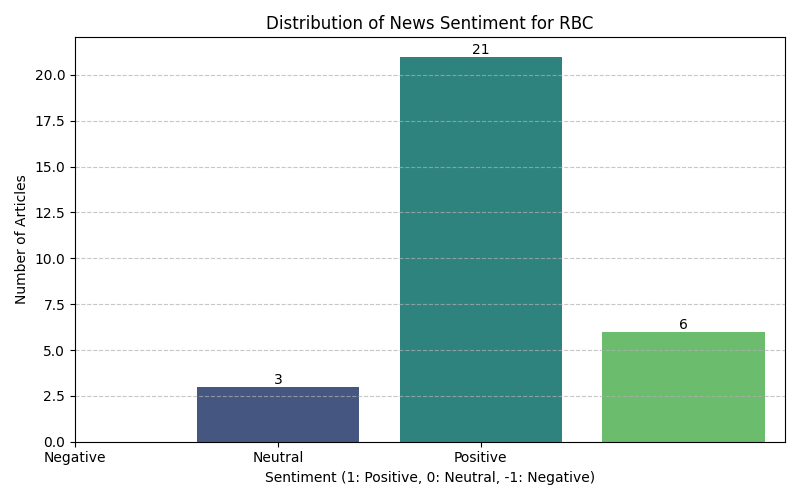
    


##**TD**


```python
td_ticker = Ticker("TD")
td_ticker.price()
```


<div>
<style scoped>
    .dataframe tbody tr th:only-of-type {
        vertical-align: middle;
    }

    .dataframe tbody tr th {
        vertical-align: top;
    }

    .dataframe thead th {
        text-align: right;
    }
</style>
<table border="1" class="dataframe">
  <thead>
    <tr style="text-align: right;">
      <th></th>
      <th>symbol</th>
      <th>report_date</th>
      <th>open</th>
      <th>close</th>
      <th>high</th>
      <th>low</th>
      <th>volume</th>
    </tr>
  </thead>
  <tbody>
    <tr>
      <th>0</th>
      <td>TD</td>
      <td>1996-08-30</td>
      <td>4.8438</td>
      <td>4.8125</td>
      <td>4.8438</td>
      <td>4.8125</td>
      <td>46800</td>
    </tr>
    <tr>
      <th>1</th>
      <td>TD</td>
      <td>1996-09-03</td>
      <td>4.7500</td>
      <td>4.7500</td>
      <td>4.7500</td>
      <td>4.7188</td>
      <td>20000</td>
    </tr>
    <tr>
      <th>2</th>
      <td>TD</td>
      <td>1996-09-04</td>
      <td>4.7812</td>
      <td>4.7812</td>
      <td>4.7812</td>
      <td>4.7812</td>
      <td>2000</td>
    </tr>
    <tr>
      <th>3</th>
      <td>TD</td>
      <td>1996-09-05</td>
      <td>4.7812</td>
      <td>4.7188</td>
      <td>4.7812</td>
      <td>4.7188</td>
      <td>24800</td>
    </tr>
    <tr>
      <th>4</th>
      <td>TD</td>
      <td>1996-09-06</td>
      <td>4.7500</td>
      <td>4.7500</td>
      <td>4.7812</td>
      <td>4.7500</td>
      <td>9600</td>
    </tr>
    <tr>
      <th>...</th>
      <td>...</td>
      <td>...</td>
      <td>...</td>
      <td>...</td>
      <td>...</td>
      <td>...</td>
      <td>...</td>
    </tr>
    <tr>
      <th>7478</th>
      <td>TD</td>
      <td>2026-05-22</td>
      <td>111.5600</td>
      <td>111.8700</td>
      <td>112.3200</td>
      <td>111.5600</td>
      <td>1136500</td>
    </tr>
    <tr>
      <th>7479</th>
      <td>TD</td>
      <td>2026-05-26</td>
      <td>112.8400</td>
      <td>112.5600</td>
      <td>113.5100</td>
      <td>111.8600</td>
      <td>1684700</td>
    </tr>
    <tr>
      <th>7480</th>
      <td>TD</td>
      <td>2026-05-27</td>
      <td>112.0000</td>
      <td>112.2000</td>
      <td>113.1100</td>
      <td>111.8800</td>
      <td>3371900</td>
    </tr>
    <tr>
      <th>7481</th>
      <td>TD</td>
      <td>2026-05-28</td>
      <td>112.4700</td>
      <td>113.3400</td>
      <td>113.4200</td>
      <td>111.2700</td>
      <td>3276400</td>
    </tr>
    <tr>
      <th>7482</th>
      <td>TD</td>
      <td>2026-05-29</td>
      <td>113.4000</td>
      <td>113.5800</td>
      <td>114.2300</td>
      <td>111.3800</td>
      <td>2080258</td>
    </tr>
  </tbody>
</table>
<p>7483 rows × 7 columns</p>
</div>


```python
statement2 = td_ticker.quarterly_income_statement()
print(statement2.print_pretty_table())
```

    |-----------------------------------------------------------------------------------------------+------------+------------+------------+------------+------------+------------+------------+------------+------------+------------+------------+------------+------------+------------+------------+------------+------------+------------|
    |                                           Breakdown                                           |    TTM     | 2026-04-30 | 2026-01-31 | 2025-10-31 | 2025-07-31 | 2025-04-30 | 2025-01-31 | 2024-10-31 | 2024-07-31 | 2024-04-30 | 2024-01-31 | 2023-10-31 | 2023-07-31 | 2023-04-30 | 2023-01-31 | 2022-10-31 | 2022-07-31 | 2022-04-30 |
    |-----------------------------------------------------------------------------------------------+------------+------------+------------+------------+------------+------------+------------+------------+------------+------------+------------+------------+------------+------------+------------+------------+------------+------------|
    | +Total Revenue                                                                                | 63,777,000 | 15,900,000 | 16,501,000 | 15,894,000 | 15,482,000 | 15,004,000 | 14,901,000 | 14,743,000 | 14,113,000 | 13,759,000 | 13,641,000 | 14,762,000 | 12,966,000 | *          | *          | *          | 11,503,000 | 11,165,000 |
    |  +Net Interest Income                                                                         | 34,721,000 | 8,861,000  | 8,789,000  | 8,545,000  | 8,526,000  | 8,125,000  | 7,866,000  | 7,940,000  | 7,579,000  | 7,465,000  | 7,488,000  | 7,494,000  | 7,289,000  | *          | *          | *          | 7,044,000  | 6,377,000  |
    |   +Interest Income                                                                            | 83,844,000 | 19,981,000 | 20,696,000 | 21,423,000 | 21,744,000 | 21,582,000 | 22,872,000 | 23,774,000 | 23,806,000 | 22,996,000 | 22,813,000 | 22,376,000 | 20,935,000 | *          | *          | *          | 10,782,000 | 8,029,000  |
    |    +Interest Income from Loans And Lease                                                      | 50,696,000 | 12,316,000 | 12,719,000 | 12,790,000 | 12,871,000 | 12,602,000 | 13,467,000 | 13,706,000 | 13,821,000 | 13,154,000 | 12,995,000 | 5,889,000  | 11,517,000 | *          | *          | *          | *          | *          |
    |     Interest Income from Loans                                                                | 50,696,000 | 12,316,000 | 12,719,000 | 12,790,000 | 12,871,000 | 12,602,000 | 13,467,000 | 13,706,000 | 13,821,000 | 13,154,000 | 12,995,000 | 5,889,000  | 11,517,000 | *          | *          | *          | *          | *          |
    |    Interest Income from Securities                                                            | 20,258,000 | 4,981,000  | 4,891,000  | 5,202,000  | 5,184,000  | 5,246,000  | 5,225,000  | 5,364,000  | 5,676,000  | 5,802,000  | 5,824,000  | 5,789,000  | 5,578,000  | *          | *          | *          | *          | *          |
    |    Interest Income from Deposits                                                              | 3,902,000  | 798,000    | 869,000    | 1,012,000  | 1,223,000  | 1,366,000  | 1,574,000  | 1,895,000  | 1,349,000  | 1,126,000  | *          | *          | *          | *          | *          | *          | *          | *          |
    |    Interest Income from Federal Funds Sold And Securities Purchase Under Agreements To Resell | 8,988,000  | 1,886,000  | 2,217,000  | 2,419,000  | 2,466,000  | 2,368,000  | 2,606,000  | 2,809,000  | 2,960,000  | 2,914,000  | 2,938,000  | *          | 2,660,000  | *          | *          | *          | *          | *          |
    |   +Interest Expense                                                                           | 49,123,000 | 11,120,000 | 11,907,000 | 12,878,000 | 13,218,000 | 13,457,000 | 15,006,000 | 15,834,000 | 16,227,000 | 15,531,000 | 15,325,000 | 14,882,000 | 13,646,000 | *          | *          | *          | 3,738,000  | 1,652,000  |
    |    Interest Expense for Deposit                                                               | 35,598,000 | 8,119,000  | 8,586,000  | 9,316,000  | 9,577,000  | 9,923,000  | 11,223,000 | 11,814,000 | 12,072,000 | 11,490,000 | 11,484,000 | 11,257,000 | 10,257,000 | *          | *          | *          | *          | *          |
    |    Interest Expense for Long Term Debt And Capital Securities                                 | 1,396,000  | 351,000    | 353,000    | 346,000    | 346,000    | 350,000    | 363,000    | 345,000    | 384,000    | 358,000    | 351,000    | 356,000    | 349,000    | *          | *          | *          | *          | *          |
    |    Interest Expense for Federal Funds Sold And Securities Purchase Under Agreements To Resell | 11,065,000 | 2,447,000  | 2,752,000  | 3,002,000  | 2,864,000  | 2,746,000  | 2,990,000  | 3,280,000  | 3,447,000  | 3,390,000  | 3,205,000  | *          | 2,790,000  | *          | *          | *          | *          | *          |
    |    Other Interest Expense                                                                     | 1,064,000  | 203,000    | 216,000    | 214,000    | 431,000    | 438,000    | 430,000    | 395,000    | 324,000    | 293,000    | 285,000    | -6,814,000 | 250,000    | *          | *          | *          | *          | *          |
    |  +Non Interest Income                                                                         | 29,056,000 | 7,039,000  | 7,712,000  | 7,349,000  | 6,956,000  | 6,879,000  | 7,035,000  | 6,803,000  | 6,534,000  | 6,294,000  | 6,153,000  | 7,268,000  | 5,677,000  | *          | *          | *          | *          | *          |
    |   Total Premiums Earned                                                                       | 7,937,000  | 1,945,000  | 2,001,000  | 2,012,000  | 1,979,000  | 1,876,000  | 1,870,000  | 1,829,000  | 1,782,000  | 1,665,000  | 1,676,000  | 1,491,000  | 1,611,000  | *          | *          | *          | *          | *          |
    |   +Fees And Commissions                                                                       | 14,288,000 | 4,032,000  | 4,065,000  | 2,384,000  | 3,807,000  | 3,676,000  | 3,763,000  | 2,150,000  | 3,586,000  | 3,601,000  | 3,600,000  | 2,401,000  | 3,373,000  | *          | *          | *          | *          | *          |
    |    +Fees & Commission Income                                                                  | 14,818,000 | 4,168,000  | 4,193,000  | 2,517,000  | 3,940,000  | 3,809,000  | 3,892,000  | 2,269,000  | 3,710,000  | 3,726,000  | 3,730,000  | 2,529,000  | 3,498,000  | *          | *          | *          | *          | *          |
    |     Service Charge on Depositor Accounts                                                      | 5,242,000  | 3,563,000  | 3,465,000  | -5,002,000 | 3,216,000  | 3,105,000  | 3,119,000  | -4,425,000 | 2,958,000  | 3,023,000  | 2,968,000  | -3,648,000 | 2,801,000  | *          | *          | *          | *          | *          |
    |     Trust Fees by Commissions                                                                 | 2,947,000  | *          | *          | *          | *          | *          | *          | *          | *          | *          | *          | *          | *          | *          | *          | *          | *          | *          |
    |     Securities Activities                                                                     | 3,868,000  | *          | *          | *          | *          | *          | *          | *          | *          | *          | *          | *          | *          | *          | *          | *          | *          | *          |
    |     Credit Card                                                                               | 2,761,000  | 605,000    | 728,000    | 704,000    | 724,000    | 704,000    | 773,000    | 730,000    | 752,000    | 703,000    | 762,000    | 754,000    | 697,000    | *          | *          | *          | *          | *          |
    |    Fees & Commission Expense                                                                  | 530,000    | 136,000    | 128,000    | 133,000    | 133,000    | 133,000    | 129,000    | 119,000    | 124,000    | 125,000    | 130,000    | 128,000    | 125,000    | *          | *          | *          | *          | *          |
    |   Investment Banking Profit                                                                   | 1,707,000  | *          | *          | *          | *          | *          | *          | *          | *          | *          | *          | *          | *          | *          | *          | *          | *          | *          |
    |   Trading Gain Loss                                                                           | 4,725,000  | 921,000    | 1,499,000  | 1,318,000  | 987,000    | 992,000    | 1,305,000  | 835,000    | 1,124,000  | 744,000    | 925,000    | 750,000    | 700,000    | *          | *          | *          | *          | *          |
    |   +Gain Losson Saleof Assets                                                                  | -1,000     | -1,000     | 0.0        | -1,000     | 1,000      | -1,000     | 0.0        | 0.0        | -1,000     | 1,000      | 0.0        | 0.0        | 0.0        | *          | *          | *          | *          | *          |
    |    Gain on Sale of Security                                                                   | -1,000     | -1,000     | 0.0        | -1,000     | 1,000      | -1,000     | 0.0        | 0.0        | -1,000     | 1,000      | 0.0        | 0.0        | 0.0        | *          | *          | *          | 0.0        | 0.0        |
    |   Other Non Interest Income                                                                   | 400,000    | 142,000    | 147,000    | -71,000    | 182,000    | 336,000    | 97,000     | 553,000    | 43,000     | 283,000    | -48,000    | 1,629,000  | -7,000     | *          | *          | *          | *          | *          |
    | Credit Losses Provision                                                                       | -3,992,000 | -1,000,000 | -1,039,000 | -981,000   | -972,000   | -1,340,000 | -1,212,000 | -1,109,000 | -1,071,000 | -1,072,000 | -1,001,000 | -878,000   | -766,000   | *          | *          | *          | *          | *          |
    | +Non Interest Expense                                                                         | 39,332,000 | 9,640,000  | 10,091,000 | 10,014,000 | 9,587,000  | 9,226,000  | 9,396,000  | 10,179,000 | 8,782,000  | 8,244,000  | 8,366,000  | 10,597,000 | 8,033,000  | *          | *          | *          | *          | *          |
    |  +Occupancy And Equipment                                                                     | 4,930,000  | 1,272,000  | 1,224,000  | 1,241,000  | 1,193,000  | 1,198,000  | 1,201,000  | 1,283,000  | 1,135,000  | 1,090,000  | 1,106,000  | 1,080,000  | 1,065,000  | *          | *          | *          | *          | *          |
    |   Net Occupancy Expense                                                                       | 1,996,000  | 529,000    | 517,000    | 495,000    | 455,000    | 499,000    | 512,000    | 553,000    | 463,000    | 474,000    | 468,000    | 460,000    | 460,000    | *          | *          | *          | *          | *          |
    |   Equipment                                                                                   | 2,934,000  | 743,000    | 707,000    | 746,000    | 738,000    | 699,000    | 689,000    | 730,000    | 672,000    | 616,000    | 638,000    | 620,000    | 605,000    | *          | *          | *          | *          | *          |
    |  Professional Expense And Contract Services Expense                                           | 4,494,000  | 1,010,000  | 1,046,000  | 1,329,000  | 1,109,000  | 957,000    | 893,000    | 1,079,000  | 765,000    | 655,000    | 565,000    | 703,000    | 589,000    | *          | *          | *          | *          | *          |
    |  +Selling General and Administrative                                                          | 26,703,000 | 6,637,000  | 6,934,000  | 6,682,000  | 6,450,000  | 6,329,000  | 6,498,000  | 6,875,000  | 6,124,000  | 5,892,000  | 6,005,000  | 5,527,000  | 5,726,000  | *          | *          | *          | 4,156,000  | 3,874,000  |
    |   +General & Administrative Expense                                                           | 25,029,000 | 6,193,000  | 6,579,000  | 6,198,000  | 6,059,000  | 5,902,000  | 6,157,000  | 6,444,000  | 5,758,000  | 5,498,000  | 5,680,000  | 5,109,000  | 5,391,000  | *          | *          | *          | 4,156,000  | 3,874,000  |
    |    Salaries and Wages                                                                         | 18,844,000 | 4,795,000  | 4,957,000  | 4,596,000  | 4,496,000  | 4,485,000  | 4,650,000  | 4,080,000  | 4,089,000  | 4,250,000  | 4,314,000  | 4,107,000  | 4,005,000  | *          | *          | *          | 3,327,000  | 3,282,000  |
    |    Insurance & Claims                                                                         | 6,185,000  | 1,398,000  | 1,622,000  | 1,602,000  | 1,563,000  | 1,417,000  | 1,507,000  | 2,364,000  | 1,669,000  | 1,248,000  | 1,366,000  | 1,002,000  | 1,386,000  | *          | *          | *          | 829,000    | 592,000    |
    |    Other G and A                                                                              | *          | *          | *          | *          | *          | *          | *          | *          | *          | *          | *          | *          | *          | *          | *          | *          | 329,000    | 336,000    |
    |   Selling & Marketing Expense                                                                 | 1,674,000  | 444,000    | 355,000    | 484,000    | 391,000    | 427,000    | 341,000    | 431,000    | 366,000    | 394,000    | 325,000    | 418,000    | 335,000    | *          | *          | *          | 329,000    | 336,000    |
    |  +Depreciation Amortization Depletion                                                         | 822,000    | 215,000    | 208,000    | 198,000    | 201,000    | 194,000    | 187,000    | 176,000    | 173,000    | 168,000    | 185,000    | 185,000    | 175,000    | *          | *          | *          | 145,000    | 147,000    |
    |   +Depreciation & Amortization                                                                | 822,000    | 215,000    | 208,000    | 198,000    | 201,000    | 194,000    | 187,000    | 176,000    | 173,000    | 168,000    | 185,000    | 185,000    | 175,000    | *          | *          | *          | 145,000    | 147,000    |
    |    +Amortization                                                                              | 822,000    | 215,000    | 208,000    | 198,000    | 201,000    | 194,000    | 187,000    | 176,000    | 173,000    | 168,000    | 185,000    | 185,000    | 175,000    | *          | *          | *          | 145,000    | 147,000    |
    |     Amortization of Intangibles                                                               | 822,000    | 215,000    | 208,000    | 198,000    | 201,000    | 194,000    | 187,000    | 176,000    | 173,000    | 168,000    | 185,000    | 185,000    | 175,000    | *          | *          | *          | 145,000    | 147,000    |
    |  Other Non Interest Expense                                                                   | 2,383,000  | 506,000    | 679,000    | 564,000    | 634,000    | 548,000    | 617,000    | 766,000    | 585,000    | 439,000    | 505,000    | 3,102,000  | 478,000    | *          | *          | *          | *          | *          |
    | +Special Income Charges                                                                       | -1,913,000 | -234,000   | -200,000   | -797,000   | -682,000   | 7,602,000  | -1,033,000 | 536,000    | -3,837,000 | -1,344,000 | -957,000   | 71,000     | -764,000   | *          | *          | *          | -730,000   | 204,000    |
    |  Gain on Sale of Business                                                                     | 0.0        | 0.0        | *          | 0.0        | 0.0        | 8,975,000  | *          | *          | 0.0        | 0.0        | *          | *          | *          | *          | *          | *          | *          | *          |
    |  Restructuring & Mergers Acquisition                                                          | 1,731,000  | 37,000     | 244,000    | 768,000    | 682,000    | 1,373,000  | 1,033,000  | 487,000    | 271,000    | 352,000    | 546,000    | -71,000    | 764,000    | *          | *          | *          | 730,000    | 20,000     |
    |  Impairment of Capital Assets                                                                 | 29,000     | *          | *          | *          | *          | *          | *          | *          | *          | *          | *          | *          | *          | *          | *          | *          | *          | *          |
    |  Other Special Charges                                                                        | 4,949,000  | 197,000    | -44,000    | *          | *          | *          | *          | -20,000    | 3,566,000  | 992,000    | 411,000    | 0.0        | *          | 39,000     | 1,603,000  | 0.0        | *          | -224,000   |
    | Pretax Income                                                                                 | 18,540,000 | 5,026,000  | 5,171,000  | 4,102,000  | 4,241,000  | 12,040,000 | 3,260,000  | 3,991,000  | 423,000    | 3,099,000  | 3,317,000  | 3,358,000  | 3,403,000  | *          | *          | *          | 3,649,000  | 4,611,000  |
    | Tax Provision                                                                                 | 3,630,000  | 775,000    | 1,128,000  | 822,000    | 905,000    | 985,000    | 698,000    | 534,000    | 794,000    | 729,000    | 634,000    | 628,000    | 704,000    | *          | *          | *          | 703,000    | 1,002,000  |
    | Earnings from Equity Interest Net of Tax                                                      | 0.0        | 0.0        | 0.0        | 0.0        | 0.0        | 74,000     | 231,000    | 178,000    | 190,000    | 194,000    | 141,000    | 156,000    | 182,000    | *          | *          | *          | 268,000    | 202,000    |
    | +Net Income Common Stockholders                                                               | 14,328,000 | 4,049,000  | 3,942,000  | 3,089,000  | 3,248,000  | 10,929,000 | 2,707,000  | 3,442,000  | -250,000   | 2,374,000  | 2,750,000  | 2,690,000  | 2,807,000  | *          | *          | *          | 3,171,000  | 3,745,000  |
    |  +Net Income(Attributable to Parent Company Shareholders)                                     | 14,910,000 | 4,251,000  | 4,043,000  | 3,280,000  | 3,336,000  | 11,129,000 | 2,793,000  | 3,635,000  | -181,000   | 2,564,000  | 2,824,000  | 2,886,000  | 2,881,000  | *          | *          | *          | 3,214,000  | 3,811,000  |
    |   +Net Income Including Non-Controlling Interests                                             | 14,910,000 | 4,251,000  | 4,043,000  | 3,280,000  | 3,336,000  | 11,129,000 | 2,793,000  | 3,635,000  | -181,000   | 2,564,000  | 2,824,000  | 2,886,000  | 2,881,000  | *          | *          | *          | 3,214,000  | 3,811,000  |
    |    Net Income Continuous Operations                                                           | 14,910,000 | 4,251,000  | 4,043,000  | 3,280,000  | 3,336,000  | 11,129,000 | 2,793,000  | 3,635,000  | -181,000   | 2,564,000  | 2,824,000  | 2,886,000  | 2,881,000  | *          | *          | *          | 3,214,000  | 3,811,000  |
    |  Preferred Stock Dividends                                                                    | 582,000    | 202,000    | 101,000    | 191,000    | 88,000     | 200,000    | 86,000     | 193,000    | 69,000     | 190,000    | 74,000     | 196,000    | 74,000     | *          | *          | *          | 43,000     | 66,000     |
    | Diluted NI Available to Com Stockholders                                                      | 14,328,000 | 4,049,000  | 3,942,000  | 3,089,000  | 3,248,000  | 10,929,000 | 2,707,000  | 3,442,000  | -250,000   | 2,374,000  | 2,750,000  | 2,690,000  | 2,807,000  | *          | *          | *          | 3,171,000  | 3,745,000  |
    | Basic EPS                                                                                     | 8.54       | 2.44       | 2.35       | *          | 1.89       | 6.28       | 1.55       | *          | -0.14      | 1.35       | 1.55       | *          | 1.53       | 1.69       | 0.82       | *          | 1.76       | 2.08       |
    | Diluted EPS                                                                                   | 8.52       | 2.43       | 2.34       | *          | 1.89       | 6.27       | 1.55       | *          | -0.14      | 1.35       | 1.55       | *          | 1.53       | 1.69       | 0.82       | *          | 1.75       | 2.07       |
    | Basic Average Shares                                                                          | 1,688,950  | 1,660,700  | 1,680,300  | *          | 1,716,700  | 1,740,500  | 1,749,900  | *          | 1,747,800  | 1,762,800  | 1,776,700  | *          | 1,834,800  | 1,828,300  | 1,820,700  | *          | 1,804,500  | 1,804,700  |
    | Diluted Average Shares                                                                        | 1,692,550  | 1,665,500  | 1,684,700  | *          | 1,718,900  | 1,741,700  | 1,750,700  | *          | 1,747,800  | 1,764,100  | 1,778,200  | *          | 1,836,300  | 1,830,300  | 1,823,100  | *          | 1,807,100  | 1,808,300  |
    | Interest Income after Provision for Loan Loss                                                 | 30,729,000 | 7,861,000  | 7,750,000  | 7,564,000  | 7,554,000  | 6,785,000  | 6,654,000  | 6,831,000  | 6,508,000  | 6,393,000  | 6,487,000  | 6,616,000  | 6,523,000  | *          | *          | *          | *          | *          |
    | Net Income from Continuing & Discontinued Operation                                           | 14,910,000 | 4,251,000  | 4,043,000  | 3,280,000  | 3,336,000  | 11,129,000 | 2,793,000  | 3,635,000  | -181,000   | 2,564,000  | 2,824,000  | 2,886,000  | 2,881,000  | *          | *          | *          | 3,214,000  | 3,811,000  |
    | Normalized Income                                                                             | 16,448,448 | 4,448,917  | 4,199,372  | 3,917,289  | 3,872,734  | 4,148,924  | 3,604,823  | 3,170,717  | 3,080,450  | 3,592,160  | 3,598,213  | 2,828,278  | 3,486,852  | *          | *          | *          | 3,803,110  | 3,651,268  |
    | Total Money Market Investments                                                                | 12,890,000 | 2,684,000  | 3,086,000  | 3,431,000  | 3,689,000  | 3,734,000  | 4,180,000  | 4,704,000  | 4,309,000  | 4,040,000  | 3,994,000  | 10,698,000 | 3,840,000  | *          | *          | *          | *          | *          |
    | Reconciled Depreciation                                                                       | 2,207,000  | 561,000    | 546,000    | 572,000    | 528,000    | 534,000    | 532,000    | 544,000    | 492,000    | 492,000    | 499,000    | 505,000    | 496,000    | *          | *          | *          | 430,000    | 438,000    |
    | Net Income from Continuing Operation Net Minority Interest                                    | 14,910,000 | 4,251,000  | 4,043,000  | 3,280,000  | 3,336,000  | 11,129,000 | 2,793,000  | 3,635,000  | -181,000   | 2,564,000  | 2,824,000  | 2,886,000  | 2,881,000  | *          | *          | *          | 3,214,000  | 3,811,000  |
    | Total Unusual Items Excluding Goodwill                                                        | -1,913,000 | -234,000   | -200,000   | -797,000   | -682,000   | 7,602,000  | -1,033,000 | 536,000    | -3,837,000 | -1,344,000 | -957,000   | 71,000     | -764,000   | *          | *          | *          | -730,000   | 204,000    |
    | Total Unusual Items                                                                           | -1,913,000 | -234,000   | -200,000   | -797,000   | -682,000   | 7,602,000  | -1,033,000 | 536,000    | -3,837,000 | -1,344,000 | -957,000   | 71,000     | -764,000   | *          | *          | *          | -730,000   | 204,000    |
    | Tax Rate for Calcs                                                                            | 0.2        | 0.15       | 0.22       | 0.2        | 0.21       | 0.08       | 0.21       | 0.13       | 0.15       | 0.24       | 0.19       | 0.19       | 0.21       | *          | *          | *          | 0.19       | 0.22       |
    | Tax Effect of Unusual Items                                                                   | -374,551   | -36,082    | -43,627    | -159,710   | -145,266   | 621,924    | -221,176   | 71,717     | -575,550   | -315,840   | -182,787   | 13,278     | -158,148   | *          | *          | *          | -140,890   | 44,268     |
    | Operating Revenue                                                                             | 63,777,000 | 15,900,000 | 16,501,000 | 15,894,000 | 15,482,000 | 15,004,000 | 14,901,000 | 14,743,000 | 14,113,000 | 13,759,000 | 13,641,000 | 14,762,000 | 12,966,000 | *          | *          | *          | 11,503,000 | 11,165,000 |
    |-----------------------------------------------------------------------------------------------+------------+------------+------------+------------+------------+------------+------------+------------+------------+------------+------------+------------+------------+------------+------------+------------+------------+------------|
    None
    


```python
transcripts2 = td_ticker.earning_call_transcripts()
transcripts2.get_transcripts_list()
```


<div>
<style scoped>
    .dataframe tbody tr th:only-of-type {
        vertical-align: middle;
    }

    .dataframe tbody tr th {
        vertical-align: top;
    }

    .dataframe thead th {
        text-align: right;
    }
</style>
<table border="1" class="dataframe">
  <thead>
    <tr style="text-align: right;">
      <th></th>
      <th>symbol</th>
      <th>fiscal_year</th>
      <th>fiscal_quarter</th>
      <th>report_date</th>
    </tr>
  </thead>
  <tbody>
    <tr>
      <th>0</th>
      <td>TD</td>
      <td>2007</td>
      <td>3</td>
      <td>2007-08-24</td>
    </tr>
    <tr>
      <th>1</th>
      <td>TD</td>
      <td>2007</td>
      <td>4</td>
      <td>2008-03-17</td>
    </tr>
    <tr>
      <th>2</th>
      <td>TD</td>
      <td>2008</td>
      <td>3</td>
      <td>2008-08-28</td>
    </tr>
    <tr>
      <th>3</th>
      <td>TD</td>
      <td>2008</td>
      <td>4</td>
      <td>2009-02-18</td>
    </tr>
    <tr>
      <th>4</th>
      <td>TD</td>
      <td>2009</td>
      <td>4</td>
      <td>2010-03-02</td>
    </tr>
    <tr>
      <th>...</th>
      <td>...</td>
      <td>...</td>
      <td>...</td>
      <td>...</td>
    </tr>
    <tr>
      <th>63</th>
      <td>TD</td>
      <td>2025</td>
      <td>2</td>
      <td>2025-05-22</td>
    </tr>
    <tr>
      <th>64</th>
      <td>TD</td>
      <td>2025</td>
      <td>3</td>
      <td>2025-08-28</td>
    </tr>
    <tr>
      <th>65</th>
      <td>TD</td>
      <td>2025</td>
      <td>4</td>
      <td>2025-12-04</td>
    </tr>
    <tr>
      <th>66</th>
      <td>TD</td>
      <td>2026</td>
      <td>1</td>
      <td>2026-02-26</td>
    </tr>
    <tr>
      <th>67</th>
      <td>TD</td>
      <td>2026</td>
      <td>2</td>
      <td>2026-05-28</td>
    </tr>
  </tbody>
</table>
<p>68 rows × 4 columns</p>
</div>


```python
transcripts2 = td_ticker.earning_call_transcripts()
transcripts2.get_transcript(2024, 4)
```


<div>
<style scoped>
    .dataframe tbody tr th:only-of-type {
        vertical-align: middle;
    }

    .dataframe tbody tr th {
        vertical-align: top;
    }

    .dataframe thead th {
        text-align: right;
    }
</style>
<table border="1" class="dataframe">
  <thead>
    <tr style="text-align: right;">
      <th></th>
      <th>paragraph_number</th>
      <th>speaker</th>
      <th>content</th>
    </tr>
  </thead>
  <tbody>
    <tr>
      <th>0</th>
      <td>1</td>
      <td>Operator</td>
      <td>Good morning, everyone. Welcome to the TD Bank...</td>
    </tr>
    <tr>
      <th>1</th>
      <td>2</td>
      <td>Brooke Hales</td>
      <td>Thank you, operator. Good morning, and welcome...</td>
    </tr>
    <tr>
      <th>2</th>
      <td>3</td>
      <td>Bharat Masrani</td>
      <td>Thank you, Brooke, and thank you, everyone, fo...</td>
    </tr>
    <tr>
      <th>3</th>
      <td>4</td>
      <td>Raymond Chun</td>
      <td>Thank you, Bharat, and good morning, everyone....</td>
    </tr>
    <tr>
      <th>4</th>
      <td>5</td>
      <td>Kelvin Vi Tran</td>
      <td>Thank you, Ray. Good morning, everyone. Please...</td>
    </tr>
    <tr>
      <th>5</th>
      <td>6</td>
      <td>Ajai Bambawale</td>
      <td>Okay. Thank you, Kelvin, and good afternoon, e...</td>
    </tr>
    <tr>
      <th>6</th>
      <td>7</td>
      <td>Operator</td>
      <td>[Operator Instructions] The first question is ...</td>
    </tr>
    <tr>
      <th>7</th>
      <td>8</td>
      <td>Gabriel Dechaine</td>
      <td>Just a quick one. Like there's a lot of moving...</td>
    </tr>
    <tr>
      <th>8</th>
      <td>9</td>
      <td>Kelvin Vi Tran</td>
      <td>It's Kelvin. I can take that. It's not every b...</td>
    </tr>
    <tr>
      <th>9</th>
      <td>10</td>
      <td>Gabriel Dechaine</td>
      <td>Okay. So it's just a matter of the nature of w...</td>
    </tr>
    <tr>
      <th>10</th>
      <td>11</td>
      <td>Kelvin Vi Tran</td>
      <td>It's Kelvin. So if you're looking at the outlo...</td>
    </tr>
    <tr>
      <th>11</th>
      <td>12</td>
      <td>Gabriel Dechaine</td>
      <td>Okay. So this increase that I saw, they went o...</td>
    </tr>
    <tr>
      <th>12</th>
      <td>13</td>
      <td>Kelvin Vi Tran</td>
      <td>Yes. So I think the $1 billion that you see th...</td>
    </tr>
    <tr>
      <th>13</th>
      <td>14</td>
      <td>Gabriel Dechaine</td>
      <td>Okay. And a quick one, just on the securities ...</td>
    </tr>
    <tr>
      <th>14</th>
      <td>15</td>
      <td>Kelvin Vi Tran</td>
      <td>Correct. Yes.</td>
    </tr>
    <tr>
      <th>15</th>
      <td>16</td>
      <td>Operator</td>
      <td>The next question is from Meny Grauman from Sc...</td>
    </tr>
    <tr>
      <th>16</th>
      <td>17</td>
      <td>Meny Grauman</td>
      <td>A few questions on the strategic review. First...</td>
    </tr>
    <tr>
      <th>17</th>
      <td>18</td>
      <td>Raymond Chun</td>
      <td>Meny, it's Raymond. Let me take that. So we've...</td>
    </tr>
    <tr>
      <th>18</th>
      <td>19</td>
      <td>Meny Grauman</td>
      <td>Understood. I guess the reason I'm asking is t...</td>
    </tr>
    <tr>
      <th>19</th>
      <td>20</td>
      <td>Raymond Chun</td>
      <td>If I look at it more in the sense of as the in...</td>
    </tr>
    <tr>
      <th>20</th>
      <td>21</td>
      <td>Meny Grauman</td>
      <td>And then, when you talk about everything is on...</td>
    </tr>
    <tr>
      <th>21</th>
      <td>22</td>
      <td>Raymond Chun</td>
      <td>As I said, we're going to be a thorough compre...</td>
    </tr>
    <tr>
      <th>22</th>
      <td>23</td>
      <td>Operator</td>
      <td>The next question is from Ebrahim Poonawala fr...</td>
    </tr>
    <tr>
      <th>23</th>
      <td>24</td>
      <td>Ebrahim Poonawala</td>
      <td>I guess maybe just following up on the strateg...</td>
    </tr>
    <tr>
      <th>24</th>
      <td>25</td>
      <td>Raymond Chun</td>
      <td>Thanks for the question, Ebrahim. I'd say, aga...</td>
    </tr>
    <tr>
      <th>25</th>
      <td>26</td>
      <td>Ebrahim Poonawala</td>
      <td>That's fair. And I guess, maybe, Kelvin, just ...</td>
    </tr>
    <tr>
      <th>26</th>
      <td>27</td>
      <td>Kelvin Vi Tran</td>
      <td>Yes.</td>
    </tr>
    <tr>
      <th>27</th>
      <td>28</td>
      <td>Ebrahim Poonawala</td>
      <td>Got it. And just similarly on NII, to the exte...</td>
    </tr>
    <tr>
      <th>28</th>
      <td>29</td>
      <td>Kelvin Vi Tran</td>
      <td>We don't provide NII outlook for that long. I ...</td>
    </tr>
    <tr>
      <th>29</th>
      <td>30</td>
      <td>Operator</td>
      <td>The next question is from Paul Holden from CIBC.</td>
    </tr>
    <tr>
      <th>30</th>
      <td>31</td>
      <td>Paul Holden</td>
      <td>Sorry, I might have missed a little bit of tha...</td>
    </tr>
    <tr>
      <th>31</th>
      <td>32</td>
      <td>Raymond Chun</td>
      <td>Paul, thanks for the question. Maybe I'll have...</td>
    </tr>
    <tr>
      <th>32</th>
      <td>33</td>
      <td>Sona Mehta</td>
      <td>Yes. Thanks very much, Ray, and thanks for the...</td>
    </tr>
    <tr>
      <th>33</th>
      <td>34</td>
      <td>Paul Holden</td>
      <td>Okay. Good to hear. And then last question for...</td>
    </tr>
    <tr>
      <th>34</th>
      <td>35</td>
      <td>Kelvin Vi Tran</td>
      <td>It's Kelvin. I'll take that. So absolutely, we...</td>
    </tr>
    <tr>
      <th>35</th>
      <td>36</td>
      <td>Operator</td>
      <td>The next question is from Darko Mihelic from R...</td>
    </tr>
    <tr>
      <th>36</th>
      <td>37</td>
      <td>Darko Mihelic</td>
      <td>A couple of questions. The first a mechanical ...</td>
    </tr>
    <tr>
      <th>37</th>
      <td>38</td>
      <td>Bharat Masrani</td>
      <td>Darko, this is Bharat. The main entity we have...</td>
    </tr>
    <tr>
      <th>38</th>
      <td>39</td>
      <td>Darko Mihelic</td>
      <td>So there's nothing preventing the OCC from say...</td>
    </tr>
    <tr>
      <th>39</th>
      <td>40</td>
      <td>Bharat Masrani</td>
      <td>Well, it's hard to predict what the future wou...</td>
    </tr>
    <tr>
      <th>40</th>
      <td>41</td>
      <td>Darko Mihelic</td>
      <td>Okay. And my second question relates to the Sc...</td>
    </tr>
    <tr>
      <th>41</th>
      <td>42</td>
      <td>Leo Salom</td>
      <td>Darko, thanks for the question. And I think yo...</td>
    </tr>
    <tr>
      <th>42</th>
      <td>43</td>
      <td>Bharat Masrani</td>
      <td>Darko, this is Bharat. Just to add, Schwab can...</td>
    </tr>
    <tr>
      <th>43</th>
      <td>44</td>
      <td>Operator</td>
      <td>The next question is from Sohrab Movahedi from...</td>
    </tr>
    <tr>
      <th>44</th>
      <td>45</td>
      <td>Sohrab Movahedi</td>
      <td>Okay. I just wanted to clarify, as you do this...</td>
    </tr>
    <tr>
      <th>45</th>
      <td>46</td>
      <td>Raymond Chun</td>
      <td>I think until we go through the strategic revi...</td>
    </tr>
    <tr>
      <th>46</th>
      <td>47</td>
      <td>Sohrab Movahedi</td>
      <td>And so you have -- I mean you yourself are the...</td>
    </tr>
    <tr>
      <th>47</th>
      <td>48</td>
      <td>Tim Wiggan</td>
      <td>Sohrab, it's Tim Wiggan calling, and thanks fo...</td>
    </tr>
    <tr>
      <th>48</th>
      <td>49</td>
      <td>Sohrab Movahedi</td>
      <td>So Tim, you're not worried that as that 2-year...</td>
    </tr>
    <tr>
      <th>49</th>
      <td>50</td>
      <td>Tim Wiggan</td>
      <td>People are always our primary concern in any b...</td>
    </tr>
    <tr>
      <th>50</th>
      <td>51</td>
      <td>Operator</td>
      <td>The next question is from Darko Mihelic from R...</td>
    </tr>
    <tr>
      <th>51</th>
      <td>52</td>
      <td>Darko Mihelic</td>
      <td>All right. My last question is for Leo. Leo, c...</td>
    </tr>
    <tr>
      <th>52</th>
      <td>53</td>
      <td>Leo Salom</td>
      <td>Darko, I think -- I think in a previous quarte...</td>
    </tr>
    <tr>
      <th>53</th>
      <td>54</td>
      <td>Operator</td>
      <td>There are no further questions registered at t...</td>
    </tr>
    <tr>
      <th>54</th>
      <td>55</td>
      <td>Bharat Masrani</td>
      <td>Thank you very much, operator, and great quest...</td>
    </tr>
    <tr>
      <th>55</th>
      <td>56</td>
      <td>Operator</td>
      <td>Thank you. The conference has now ended. Pleas...</td>
    </tr>
  </tbody>
</table>
</div>


```python
news_object2 = td_ticker.news()
print(news_object2)
```

                                         uuid                                                                                                                                                                    title                    publisher report_date   type                                                                                                                                                  link
    0    77d555b4-e5ec-3f03-a071-0e3c0534e5ac                                                                                                 How to Boost Your Portfolio with Top Finance Stocks Set to Beat Earnings                        Zacks  2025-05-07  STORY                                                                      https://finance.yahoo.com/news/boost-portfolio-top-finance-stocks-130004695.html
    1    28deb7de-8bbe-3905-a439-9d725a84c8db                                                                                                                 TD Plans to Cut About 2% of Workforce Amid Restructuring                    Bloomberg  2025-05-22  STORY                                                                                https://finance.yahoo.com/news/td-plans-cut-2-workforce-153043644.html
    2    b7e7da70-9197-39d9-9e3e-55b23b78ca26                                                                                                    TD Bank Up 0.3% in U.S. Premarket Following Q2 Adjusted Earnings Beat                 MT Newswires  2025-05-22  STORY                                                                                           https://finance.yahoo.com/news/td-bank-0-3-u-102912943.html
    3    8888d440-8258-35a1-bdbc-e3be3ef261b2                                                                                                             Canada's TD Bank to lay off 2% of workforce in restructuring                      Reuters  2025-05-22  STORY                                                                            https://finance.yahoo.com/news/canadas-td-bank-profit-falls-101403955.html
    4    06d1444e-b766-3a02-a4ab-bbb55bbbc47c                                                                                         Update On TD Bank; Up 0.6% in U.S. Premarket Following Q2 Adjusted Earnings Beat                 MT Newswires  2025-05-22  STORY                                                                                           https://finance.yahoo.com/news/td-bank-0-6-u-121826487.html
    5    55850a15-58e4-37d9-8fbb-42d6dfddc03b                                                                                                                TD Bank Quarterly Earnings Buoyed by Sale of Schwab Stake      The Wall Street Journal  2025-05-22  STORY                                                      https://finance.yahoo.com/m/55850a15-58e4-37d9-8fbb-42d6dfddc03b/td-bank-quarterly-earnings.html
    6    7c42aff3-c0b0-33b8-bbaf-339d01799898                                                                                                                  TD Bank to reduce workforce size by 2% in restructuring  Retail Banker International  2025-05-23  STORY                                                     https://finance.yahoo.com/m/7c42aff3-c0b0-33b8-bbaf-339d01799898/td-bank-to-reduce-workforce.html
    7    fa83752c-58b6-333a-9570-7111a28ff710                                                                                                                       TD to spend $1B in 2-year span on compliance fixes              American Banker  2025-05-23  STORY                                                     https://finance.yahoo.com/m/fa83752c-58b6-333a-9570-7111a28ff710/td-to-spend-%241b-in-2-year.html
    8    f5d2bbd9-8338-3adc-8126-65443afc8be8                                                                                                         Fannie, Freddie Shares Surge as Trump Again Floats Privatization                    Bloomberg  2025-05-23  STORY                                                                       https://finance.yahoo.com/news/fannie-freddie-shares-surge-trump-201309272.html
    9    f34bb21d-c0e0-3ee9-8319-ff9e73d1d543                                                                                        Toronto-Dominion Bank (TSX:TD) Declares Dividends; Reports Strong Earnings Growth              Simply Wall St.  2025-05-23  STORY                                                                            https://finance.yahoo.com/news/toronto-dominion-bank-tsx-td-172011298.html
    10   d775f25f-d3b2-3d6e-a8b7-3becbba935c8                                                                                               The Toronto-Dominion Bank (TD) to Slash 2% of Workforce Amid Restructuring               Insider Monkey  2025-05-23  STORY                                                                          https://finance.yahoo.com/news/toronto-dominion-bank-td-slash-050319418.html
    11   a771ed6a-a371-37ce-b871-d33bff912008                                                                                                               Walmart joins layoff wave amid economic and global strains          Yahoo Finance Video  2025-05-23  VIDEO                                                                         https://finance.yahoo.com/video/walmart-joins-layoff-wave-amid-202227902.html
    12   e9ef4394-1975-3edc-9b6a-0a27ae4c27a1                                                                                                      Stocks to Watch Recap: Hinge Health, TD Bank, Snowflake, Fannie Mae      The Wall Street Journal  2025-05-23  STORY                                                  https://finance.yahoo.com/m/e9ef4394-1975-3edc-9b6a-0a27ae4c27a1/stocks-to-watch-recap%3A-hinge.html
    13   353280ff-77a6-3fce-b7ec-31675c8c80c3                                                                                                                                                      BMO on TD Bank's Q2                 MT Newswires  2025-05-24  STORY                                                                                     https://finance.yahoo.com/news/bmo-td-bank-apos-q2-163524036.html
    14   ec1cc499-49da-3645-9331-45057906fb4c                                                                                                                TD marks 30 years championing Canada's young changemakers                    CNW Group  2025-05-27  STORY                                                                           https://finance.yahoo.com/news/td-marks-30-years-championing-100000693.html
    15   d2dd16ad-3abc-31bd-a33d-0009df7dbeb8                                                                                                                   TD Bank Named the Official Bank of the Connecticut Sun                Business Wire  2025-05-28  STORY                                                                             https://finance.yahoo.com/news/td-bank-named-official-bank-133300194.html
    16   635bb43c-97f3-3c52-890e-e4c06a571bb0                                                   The Zacks Analyst Blog Highlights Toronto-Dominion Bank, Marriott International, Lennox International and Ralph Lauren                        Zacks  2025-05-29  STORY                                                                   https://finance.yahoo.com/news/zacks-analyst-blog-highlights-toronto-104200821.html
    17   e96a3f27-3b87-31bd-9cf3-5675f91b7a89                                                                                                         Microsoft Shares Go From Laggard to Leader as AI Growth Improves                    Bloomberg  2025-05-29  STORY                                                                      https://finance.yahoo.com/news/microsoft-shares-laggard-leader-ai-084844191.html
    18   43e6ad50-b976-3900-a063-41e31d4e7627                                                                                                         TD Asset Management Inc. Announces Notional TD ETF Distributions                    CNW Group  2025-06-05  STORY                                                                       https://finance.yahoo.com/news/td-asset-management-inc-announces-120000645.html
    19   26e37945-2e2d-333e-a2cf-942e93ea75cb                                                 Nearly three quarters of impacted Canadian mortgage renewers plan to tighten pocketbooks to keep up with higher payments                    CNW Group  2025-06-05  STORY                                                                 https://finance.yahoo.com/news/nearly-three-quarters-impacted-canadian-120000994.html
    20   7bea0637-1382-38f8-84e2-29e68d13e8f8                                                                                                Jim Chanos Sees Big Short in Saylor’s Strategy, But Others Aren’t So Sure                    Bloomberg  2025-06-05  STORY                                                                               https://finance.yahoo.com/news/jim-chanos-sees-big-short-133100364.html
    21   114f0634-448b-3364-92a7-af5e1570a5a1                                Summer Plans? Stay Local, Spend Local: Majority of Canadians Intend to Support Small Businesses While Travelling Domestically this Summer                    CNW Group  2025-06-11  STORY                                                                           https://finance.yahoo.com/news/summer-plans-stay-local-spend-110000182.html
    22   1e2ca993-f76b-3473-809d-e96870e4c98a                                                                                                        TD Announces Launch of Groundbreaking Predictive Foundation Model                    CNW Group  2025-06-11  STORY                                                           https://finance.yahoo.com/news/td-announces-launch-groundbreaking-predictive-110000202.html
    23   9c2c8b41-6774-3d36-bcfe-528e2cddacd9                                                                                                                                 TD Bank Launches New AI Foundation Model                 MT Newswires  2025-06-11  STORY                                                                          https://finance.yahoo.com/news/td-bank-launches-ai-foundation-120803773.html
    24   3d84c660-40ad-3b22-87cd-d885bd2206d8                                                                                                                        Norway Wealth Fund Puts TD Bank Under Observation      The Wall Street Journal  2025-06-12  STORY                                                      https://finance.yahoo.com/m/3d84c660-40ad-3b22-87cd-d885bd2206d8/norway-wealth-fund-puts-td.html
    25   fefe6bb9-d998-3f12-999d-f5462df9de34                                                                                                      Norway’s soviergn wealth fund puts TD Bank on watch over crime risk                Investing.com  2025-06-12  STORY                                                                        https://finance.yahoo.com/news/norway-soviergn-wealth-fund-puts-132607856.html
    26   ecd3f471-a7ba-347c-bf13-9f09fb1e7269                                                                                                              SoftBank Sells T-Mobile Stake for $4.8 Billion to Bet on AI                    Bloomberg  2025-06-17  STORY                                                                           https://finance.yahoo.com/news/softbank-sells-t-mobile-stake-022837180.html
    27   57c98ac1-1e46-31ec-a4a6-63ab822df0ff                                                                        TD Bank Survey Finds Americans are Ready to Embrace AI, but Have Yet to Unlock Its Full Potential                Business Wire  2025-06-17  STORY                                                                          https://finance.yahoo.com/news/td-bank-survey-finds-americans-110000883.html
    28   f2c3f9a7-0065-3f64-bf05-d8881cf59162                                                                                        Canadians grade themselves a 'C' in AI knowledge and proficiency, TD survey finds                    CNW Group  2025-06-17  STORY                                                                         https://finance.yahoo.com/news/canadians-grade-themselves-c-ai-110000778.html
    29   225c43bd-f87e-3f08-bc54-a4effb713d32                                                                                                                  TD Asset Management Inc. Announces TD ETF Distributions                    CNW Group  2025-06-18  STORY                                                                       https://finance.yahoo.com/news/td-asset-management-inc-announces-120000523.html
    30   225c43bd-f87e-3f08-bc54-a4effb713d32                                                                                                                  TD Asset Management Inc. Announces TD ETF Distributions                    CNW Group  2025-06-18  STORY                                                                       https://finance.yahoo.com/news/td-asset-management-inc-announces-120000523.html
    31   3a5dc82c-8fb7-3cff-a98b-7f2aed74481b                                                                                 Close to Home, Far from Covered: Travel Insurance Misconceptions Persist Among Canadians                    CNW Group  2025-06-19  STORY                                                                           https://finance.yahoo.com/news/close-home-far-covered-travel-100100380.html
    32   3a5dc82c-8fb7-3cff-a98b-7f2aed74481b                                                                                 Close to Home, Far from Covered: Travel Insurance Misconceptions Persist Among Canadians                    CNW Group  2025-06-19  STORY                                                                           https://finance.yahoo.com/news/close-home-far-covered-travel-100100380.html
    33   4b7459ec-f061-3c8a-85b7-a2a64e65d88b                                                                                                            Dollar Gains as the World Awaits Iran’s Response to US Attack                    Bloomberg  2025-06-23  STORY                                                                        https://finance.yahoo.com/news/investors-set-flock-safety-world-141501667.html
    34   04a6cdfb-b037-3350-ad89-85cffef8b882                                                                                                           Alphabet Lacks Tesla’s Stock Buzz in Race for Driverless Rides                    Bloomberg  2025-06-24  STORY                                                                         https://finance.yahoo.com/news/alphabet-lacks-tesla-stock-buzz-101252621.html
    35   ec723236-e946-3b93-8522-f829fe54dc79                                                                                                                      LYG vs. TD: Which Stock Is the Better Value Option?                        Zacks  2025-06-24  STORY                                                                                  https://finance.yahoo.com/news/lyg-vs-td-stock-better-154001765.html
    36   e1ec5049-f152-3c36-bd64-0654dd1ea1f7                                                         TD Bank Announces Redemption of Non-Cumulative 5-Year Rate Reset Class A First Preferred Shares, Series 7 (NVCC)                    CNW Group  2025-06-24  STORY                                                                        https://finance.yahoo.com/news/td-bank-announces-redemption-non-002400537.html
    37   bb7b1b9c-7306-326c-8b1a-5f724f16ee94                                                                                         Toronto-Dominion Bank (TSX:TD) Announces $350 Million Preferred Stock Redemption              Simply Wall St.  2025-06-26  STORY                                                                            https://finance.yahoo.com/news/toronto-dominion-bank-tsx-td-172522104.html
    38   81d6eaa2-3922-35b5-a4c3-641519687274                                                                                                       Is CaixaBank (CAIXY) Outperforming Other Finance Stocks This Year?                        Zacks  2025-06-26  STORY                                                             https://finance.yahoo.com/news/caixabank-caixy-outperforming-other-finance-134004901.html
    39   69bf7ef4-d7cf-3c14-b32e-bc2afbb3bd18                                                                                                           Euro Poised for Best Run Since 2017 as Dollar’s Slump Picks Up                    Bloomberg  2025-06-28  STORY                                                                              https://finance.yahoo.com/news/euro-poised-best-run-since-101529437.html
    40   6a22072a-c0ae-35ae-be28-2be310dbe8f2                                                                                                    Toronto-Dominion Bank (TD) is a Great Momentum Stock: Should You Buy?                        Zacks  2025-07-01  STORY                                                                          https://finance.yahoo.com/news/toronto-dominion-bank-td-great-160006486.html
    41   d29a5f4f-0e9e-3344-816e-76a7597134ba                                                                                                                      Media Advisory - TD Bank Group to host Investor Day                    CNW Group  2025-07-07  STORY                                                                            https://finance.yahoo.com/news/media-advisory-td-bank-group-153000317.html
    42   d8507e3a-4363-3844-ba23-5b3db1924916                                                                                                                                       New Strong Buy Stocks for July 7th                        Zacks  2025-07-07  STORY                                                                              https://finance.yahoo.com/news/strong-buy-stocks-july-7th-102100427.html
    43   1c390fe0-f6f6-36dc-a6a9-b5fcda3de71f                                                                                                      Deutsche Bank Revamps German Wealth Management Unit to Boost Growth                        Zacks  2025-07-08  STORY                                                                     https://finance.yahoo.com/news/deutsche-bank-revamps-german-wealth-150600522.html
    44   032ea988-d617-31fb-a5e9-ce71098390bb                                                                                                                         Virtual AI Assistant To Help Power TD Securities                    CNW Group  2025-07-08  STORY                                                                         https://finance.yahoo.com/news/virtual-ai-assistant-help-power-110000810.html
    45   cf76265b-cf3e-327a-b4a3-f8482110071b                                                                                                         Trump Says He’ll Set 50% Copper Tariff, Wait Year on Drug Levies                    Bloomberg  2025-07-09  STORY                                                                                    https://finance.yahoo.com/news/trump-says-ll-set-50-181833132.html
    46   e6c2e725-de4c-3bcd-8832-fd93718327bf                                                                                                                             Ferrero Nears $3 Billion Deal for WK Kellogg                    Bloomberg  2025-07-10  STORY                                                                            https://finance.yahoo.com/news/ferrero-nears-3-billion-deal-084359131.html
    47   5b610ee8-69bc-32ba-9cb4-0e5b67758b26                                                                                                    TD Bank Group to Issue Australian Dollar NVCC Subordinated Debentures                    CNW Group  2025-07-11  STORY                                                                          https://finance.yahoo.com/news/td-bank-group-issue-australian-233300236.html
    48   b9121e9b-8daa-36ba-910d-d5d855a223bc                                                                                           Is The Toronto Dominion Bank (TD) Stock Outpacing Its Finance Peers This Year?                        Zacks  2025-07-14  STORY                                                                          https://finance.yahoo.com/news/toronto-dominion-bank-td-stock-134004604.html
    49   b36a8305-a8b8-3006-b951-36d1f725692b                                                                                                          BlackRock’s ‘Bumpier’ Quarter Fuels Worst Earnings Day in Years                    Bloomberg  2025-07-16  STORY                                                                              https://finance.yahoo.com/news/blackrock-hits-record-12-5-100013673.html
    50   cf8bfeab-d303-3964-8796-a4f1cd8e14b8                                                                                                       Toronto-Dominion Bank: A Top Dividend Play in the Financial Sector               Insider Monkey  2025-07-17  STORY                                                                      https://finance.yahoo.com/news/toronto-dominion-bank-top-dividend-002814062.html
    51   59485386-fb58-31ff-8aff-46f57d89fa97                                                                              TD Asset Management Inc. Announces the Termination of the TD Global Carbon Credit Index ETF                    CNW Group  2025-07-18  STORY                                                                       https://finance.yahoo.com/news/td-asset-management-inc-announces-110000929.html
    52   222b0594-a716-3fcd-8682-9c2889bda41d                                                                               TD Asset Management Inc. announces mergers and terminations to its investment fund line-up                    CNW Group  2025-07-18  STORY                                                                       https://finance.yahoo.com/news/td-asset-management-inc-announces-110000695.html
    53   7074171d-dd86-30c5-ae39-4a964c951d6f                                                                                                                      Value Investors: Don't Skip the International Banks                        Zacks  2025-07-18  STORY                                                                 https://finance.yahoo.com/news/value-investors-dont-skip-international-155500842.html
    54   4485188a-c0ef-3682-9e85-a234d92d9fdb                                                                                                              Trump Tariffs Spell Trouble for Hawaii’s Few Coffee Farmers                    Bloomberg  2025-07-19  STORY                                                                      https://finance.yahoo.com/news/trump-tariffs-spell-trouble-hawaii-140000557.html
    55   67f022c2-5081-3506-a578-e2c29cd11eb1                                                                                                           Zacks Value Investor Highlights: BSAC, TD, CIB, ISNPY and BSRR                        Zacks  2025-07-21  STORY                                                                    https://finance.yahoo.com/news/zacks-value-investor-highlights-bsac-085400420.html
    56   fed7bccf-9f5c-3832-951a-c377f817935d                                                                                                                  TD Asset Management Inc. Announces TD ETF Distributions                    CNW Group  2025-07-21  STORY                                                                       https://finance.yahoo.com/news/td-asset-management-inc-announces-120000268.html
    57   b2c09557-8211-3c87-b06d-a053ca1a3efb                                                                                                                  TD vs. IBN: Which Stock Should Value Investors Buy Now?                        Zacks  2025-07-22  STORY                                                                                   https://finance.yahoo.com/news/td-vs-ibn-stock-value-154002361.html
    58   c5d277f9-afe9-3aa1-9ded-c1320a5a0c5c                                                                                       Toronto-Dominion Bank (TD) Beats Stock Market Upswing: What Investors Need to Know                        Zacks  2025-07-22  STORY                                                                          https://finance.yahoo.com/news/toronto-dominion-bank-td-beats-221503107.html
    59   15d8e02e-bd63-358b-82cf-c47bca664630                                                                      TD Announces Strategic Relationship with Fiserv to Enhance TD Merchant Solutions Offering in Canada                    CNW Group  2025-07-23  STORY                                                              https://finance.yahoo.com/news/td-announces-strategic-relationship-fiserv-113500715.html
    60   8dfa548d-694b-3b24-a67d-645c5a40b409                                                                                          Those who invested in Toronto-Dominion Bank (TSE:TD) five years ago are up 113%              Simply Wall St.  2025-07-23  STORY                                                                    https://finance.yahoo.com/news/those-invested-toronto-dominion-bank-191612024.html
    61   da988328-a55e-3359-a95e-62bdfdcabc57                                                                                                              Invesco’s QQQ Gambit Seen Unlocking $150 Million in Revenue                    Bloomberg  2025-07-23  STORY                                                                       https://finance.yahoo.com/news/invesco-qqq-gambit-seen-unlocking-141902154.html
    62   d739bb72-1b92-321d-af9f-63175709e3bf                                                                                                          Fiserv Stock Is the Worst Performer in the S&P 500. Here’s Why.                  Barrons.com  2025-07-23  STORY                                                       https://finance.yahoo.com/m/d739bb72-1b92-321d-af9f-63175709e3bf/fiserv-stock-is-the-worst.html
    63   aca6b0b3-16ec-30ea-b684-6dbbd3747620                                                                                       TD Asset Management Inc. announces risk rating changes for certain TD Mutual Funds                    CNW Group  2025-07-24  STORY                                                                       https://finance.yahoo.com/news/td-asset-management-inc-announces-110000143.html
    64   c328377a-5781-3b04-8293-e558dc890cac                                                                                                                        Rising Fiscal Deficits Drive Billions Into Credit                    Bloomberg  2025-07-27  STORY                                                                   https://finance.yahoo.com/news/rising-fiscal-deficits-drive-billions-190000703.html
    65   3b888c97-0814-39c1-bea8-6517d7c51210                                                                                                                           TD Bank Group Appoints John MacIntyre as Chair                 MT Newswires  2025-07-28  STORY                                                                             https://finance.yahoo.com/news/td-bank-group-appoints-john-113238747.html
    66   696f75ba-2f2f-3ff0-b6c0-8c2bda78c757                                                                                                                                      TD Bank Group Names New Board Chair                    CNW Group  2025-07-28  STORY                                                                               https://finance.yahoo.com/news/td-bank-group-names-board-110000593.html
    67   81106318-87b6-37fe-b3c2-74c8c3765dd1                                                                                             NEW TD SURVEY REVEALS 76% OF NEWCOMERS POLLED FEAR MAKING FINANCIAL MISTAKES                    CNW Group  2025-07-28  STORY                                                                          https://finance.yahoo.com/news/td-survey-reveals-76-newcomers-100000953.html
    68   e3ffb650-6660-3ab4-880d-3d57b656bb51                                                                                     Toronto-Dominion Bank (TD) Stock Drops Despite Market Gains: Important Facts to Note                        Zacks  2025-07-29  STORY                                                                          https://finance.yahoo.com/news/toronto-dominion-bank-td-stock-221502670.html
    69   68137279-b8a1-362d-91f2-082e96549f97                                                                                                  TD Bank Has Shut Down Dozens of Branches in 2025 So Far: Is Yours Next?               GOBankingRates  2025-07-30  STORY                                                                                https://finance.yahoo.com/news/td-bank-shut-down-dozens-183707270.html
    70   144a78db-fe69-3e1b-b402-0ba85e1f1e11                                                                                                                For US Companies, Europe Is Hard to Resist: Credit Weekly                    Bloomberg  2025-08-03  STORY                                                                         https://finance.yahoo.com/news/us-companies-europe-hard-resist-160021167.html
    71   e67e2bad-95fc-3762-951c-1fdf98924f08                                                                                                   Toronto-Dominion Bank (TD) Gains But Lags Market: What You Should Know                        Zacks  2025-08-05  STORY                                                                          https://finance.yahoo.com/news/toronto-dominion-bank-td-gains-221502303.html
    72   8a162b24-42cb-3805-9853-36e5a352be30                                                                                             If You'd Invested $1,000 in TD 5 Years Ago, Here's How Much You'd Have Today                  Motley Fool  2025-08-05  STORY                                               https://finance.yahoo.com/m/8a162b24-42cb-3805-9853-36e5a352be30/if-you%27d-invested-%241%2C000-in.html
    73   1c267580-a362-3bc5-bd7f-fef1d9b7bbe8                                                                                                       TD Bank Appoints Chris Ward as Head of U.S. Small Business Banking                Business Wire  2025-08-06  STORY                                                                             https://finance.yahoo.com/news/td-bank-appoints-chris-ward-120000806.html
    74   c8458ad9-eecd-3cff-85fe-1af9e034e00f                                                                                                Media Advisory - TD Bank Group to release third-quarter financial results                    CNW Group  2025-08-07  STORY                                                                            https://finance.yahoo.com/news/media-advisory-td-bank-group-150000972.html
    75   6e97aad2-981b-326c-a9c8-fc2a9b5d6a2f                                                                                                                 TD Bank Group provides insurance catastrophe information                    CNW Group  2025-08-07  STORY                                                                        https://finance.yahoo.com/news/td-bank-group-provides-insurance-213000297.html
    76   2f3c3637-e089-3514-beb6-549954e0eb8b                                                         Fifty-nine per cent of new Canadians say better access to credit would improve their living experience, finds TD                    CNW Group  2025-08-12  STORY                                                                           https://finance.yahoo.com/news/fifty-nine-per-cent-canadians-100000508.html
    77   699dce28-f48a-3808-9160-0930b32c56ca                                                                                       Toronto-Dominion Bank (TD) Beats Stock Market Upswing: What Investors Need to Know                        Zacks  2025-08-14  STORY                                                                          https://finance.yahoo.com/news/toronto-dominion-bank-td-beats-221501312.html
    78   f2b89083-1859-340f-b882-beea993c8f8c                                                                                                    Majority of Canadian workers are optimistic about AI but aren't ready                    CNW Group  2025-08-14  STORY                                                                 https://finance.yahoo.com/news/majority-canadian-workers-optimistic-ai-110000826.html
    79   c03c9d0e-64f7-3448-8b14-782466a0561a                                                                                                       Why Investors Need to Take Advantage of These 2 Finance Stocks Now                        Zacks  2025-08-14  STORY                                                                       https://finance.yahoo.com/news/why-investors-advantage-2-finance-130002022.html
    80   f1d8247a-0d86-3f83-8335-585a5ff1a9de                                                          TD Auto Finance Ranks Highest in National Non-Captive Prime Credit Dealer Satisfaction, according to J.D. Power                Business Wire  2025-08-14  STORY                                                                           https://finance.yahoo.com/news/td-auto-finance-ranks-highest-133300819.html
    81   395d5aba-7bf2-3811-9eb9-fe12ae77e2c8                                                                                                          Toronto-Dominion Bank Shares Rise After Upgrade From Desjardins                 MT Newswires  2025-08-14  STORY                                                                       https://finance.yahoo.com/news/toronto-dominion-bank-shares-rise-185148761.html
    82   3a482ff4-9c28-32f8-a715-e06f123adfc2                                                                                             Will Toronto-Dominion (TD) Beat Estimates Again in Its Next Earnings Report?                        Zacks  2025-08-15  STORY                                                                      https://finance.yahoo.com/news/toronto-dominion-td-beat-estimates-161002178.html
    83   6fcc4327-cbc3-38a5-94e6-9dc00ad5cf43                                                                                               Toronto-Dominion Bank (TD) Announced its Strategic Partnership with Fiserv               Insider Monkey  2025-08-15  STORY                                                                      https://finance.yahoo.com/news/toronto-dominion-bank-td-announced-135720145.html
    84   27062d4a-f8c8-3578-97b1-bc2c40c1d687                                                                                                                                                    FRN Variable Rate Fix                Business Wire  2025-08-15  STORY                                                                                   https://finance.yahoo.com/news/frn-variable-rate-fix-172200132.html
    85   f98b1407-1b13-347f-b83b-1f3acb114612                                                                                  TD Bank Appoints Laura Nitti to Retail Market President for Metro PA & South New Jersey                Business Wire  2025-08-15  STORY                                                                            https://finance.yahoo.com/news/td-bank-appoints-laura-nitti-180400006.html
    86   d7063fb5-b8ae-3e04-a07c-bc8360018e61                                                                                                Why Toronto-Dominion Bank (TD) is a Top Dividend Stock for Your Portfolio                        Zacks  2025-08-19  STORY                                                                            https://finance.yahoo.com/news/why-toronto-dominion-bank-td-154502288.html
    87   3661451f-4789-351c-9656-92ed01911e6b                                                                                                            RY & BMO Consider the Sale of Canada Payments Venture Moneris                        Zacks  2025-08-19  STORY                                                                             https://finance.yahoo.com/news/ry-bmo-consider-sale-canada-140000064.html
    88   70463814-bc7b-3ac0-8be5-df8543f73ae4                                                       Market uncertainty leaves Canadians divided, expert advice becomes a key resource in navigating mortgage decisions                    CNW Group  2025-08-20  STORY                                                             https://finance.yahoo.com/news/market-uncertainty-leaves-canadians-divided-100000455.html
    89   9ef5b3f3-8433-3c29-8498-384618e89bcd                                                                                                                     HSBC vs. TD: Which Stock Is the Better Value Option?                        Zacks  2025-08-20  STORY                                                                                 https://finance.yahoo.com/news/hsbc-vs-td-stock-better-154003156.html
    90   c3963659-6c87-33a7-b942-08a6cc077641                                                                                                                  TD Asset Management Inc. Announces TD ETF Distributions                    CNW Group  2025-08-20  STORY                                                                       https://finance.yahoo.com/news/td-asset-management-inc-announces-120000201.html
    91   81c77fe5-1aa4-3f40-9b6e-9cff69a1cb84                                                                                  MEDIA ADVISORY - TD Bank Group Executive to Present at the Scotiabank Financials Summit                    CNW Group  2025-08-21  STORY                                                                            https://finance.yahoo.com/news/media-advisory-td-bank-group-170000928.html
    92   62a487e7-4af6-3cbe-94eb-e0f20d18089e                                                                                                  Stock Market Week Ahead: Nvidia, Dollar Stores And Canada's Big 5 Banks    Investor's Business Daily  2025-08-23  STORY                                                      https://finance.yahoo.com/m/62a487e7-4af6-3cbe-94eb-e0f20d18089e/stock-market-week-ahead%3A.html
    93   b6b4cdb0-8555-3652-bc6a-9f7d56006a09                                                                                        Toronto-Dominion Bank (TD) Rises Yet Lags Behind Market: Some Facts Worth Knowing                        Zacks  2025-08-23  STORY                                                                          https://finance.yahoo.com/news/toronto-dominion-bank-td-rises-221502856.html
    94   e6e158f5-09d7-35c5-b243-e118460d59f5                                                                               /R E P E A T -- Media Advisory - TD Bank Group to release third-quarter financial results/                    CNW Group  2025-08-26  STORY                                                                                               https://finance.yahoo.com/news/r-e-p-e-t-150000430.html
    95   263f5430-ddad-32d4-9ab8-9a08cd19aeac                                                                                                  Back-to-School Adds Extra Financial Stress to Students, TD Survey Finds                    CNW Group  2025-08-26  STORY                                                                        https://finance.yahoo.com/news/back-school-adds-extra-financial-120100561.html
    96   886ec170-1fd1-3564-8969-ee710d8bc370                                                                 MEDIA ADVISORY - TD Bank Group Executive to Present at the Barclays Global Financial Services Conference                    CNW Group  2025-08-26  STORY                                                                            https://finance.yahoo.com/news/media-advisory-td-bank-group-181500612.html
    97   6f4c1600-8f2f-3816-b59c-1bf0704e322e                                                                                The Toronto-Dominion Bank (TSX:TD) Q3 2025: Everything You Need to Know Ahead of Earnings                GuruFocus.com  2025-08-27  STORY                                                                            https://finance.yahoo.com/news/toronto-dominion-bank-tsx-td-131651018.html
    98   b86ee2b4-18d5-3754-bf70-b51475a47906                                                                                                                                         TD BANK GROUP DECLARES DIVIDENDS                    CNW Group  2025-08-28  STORY                                                                        https://finance.yahoo.com/news/td-bank-group-declares-dividends-100100242.html
    99   5c38e846-b9ad-3af4-9fd4-2c0fc9737b5d                                                                                                        Bank of Montreal Q3 Earnings Rise on Higher NII, Lower Provisions                        Zacks  2025-08-28  STORY                                                                          https://finance.yahoo.com/news/bank-montreal-q3-earnings-rise-154800385.html
    100  32c687d6-4990-3b9f-9598-20aaef4f0bd4                                                                                                          Toronto-Dominion Bank Fiscal Q3 Adjusted Earnings, Revenue Rise                 MT Newswires  2025-08-28  STORY                                                                         https://finance.yahoo.com/news/toronto-dominion-bank-fiscal-q3-103227714.html
    101  6d7b4573-34c8-3c63-af14-dfb2dfb838ab                                                                                                                         TD Bank Group Reports Third Quarter 2025 Results                    CNW Group  2025-08-28  STORY                                                                             https://finance.yahoo.com/news/td-bank-group-reports-third-100000231.html
    102  68115897-d349-3eec-9ea0-9344826bf077                                                                 /R E P E A T -- MEDIA ADVISORY - TD Bank Group Executive to Present at the Scotiabank Financials Summit/                    CNW Group  2025-08-29  STORY                                                                                               https://finance.yahoo.com/news/r-e-p-e-t-150000188.html
    103  20bb6af2-caea-318d-8ee5-511863603f9a                                                                                    Desjardins Upgrades TD Bank (TD), Cites Strong Canadian P&C Business and Deposit Base               Insider Monkey  2025-08-29  STORY                                                                          https://finance.yahoo.com/news/desjardins-upgrades-td-bank-td-042037909.html
    104  5f53f7df-d908-3a30-ac01-33f155aa8e29                                                                                                  TD Bank, CIBC Results Echo Peers Buoyed by Lower Credit-Loss Provisions      The Wall Street Journal  2025-08-29  STORY                                                    https://finance.yahoo.com/m/5f53f7df-d908-3a30-ac01-33f155aa8e29/td-bank%2C-cibc-results-echo.html
    105  b6847734-bc6f-341f-aee7-04c1616cd8f8                                                                       The Toronto-Dominion Bank (TD) Q3 2025 Earnings Call Highlights: Strong Earnings and Strategic ...                GuruFocus.com  2025-08-29  STORY                                                                             https://finance.yahoo.com/news/toronto-dominion-bank-td-q3-070510112.html
    106  78427536-1959-3787-8af7-42da0c8094e9                                                                                                     Does Recent 35% Rally Leave Room for TD Bank Shares to Grow in 2025?              Simply Wall St.  2025-08-30  STORY                                                                              https://finance.yahoo.com/news/does-recent-35-rally-leave-100929731.html
    107  4edcc3fb-b6d8-3526-9320-64f4a35cfa84  Preparing to Pay: TD Insurance survey finds more than half of small business owners turning to costly financing options in emergencies, even though they have insurance                    CNW Group  2025-09-03  STORY                                                                       https://finance.yahoo.com/news/preparing-pay-td-insurance-survey-110000829.html
    108  4a145e7d-e8ee-3153-a1bb-456c90321c1c                                                /R E P E A T -- MEDIA ADVISORY - TD Bank Group Executive to Present at the Barclays Global Financial Services Conference/                    CNW Group  2025-09-04  STORY                                                                                               https://finance.yahoo.com/news/r-e-p-e-t-150000191.html
    109  7f0d9ffb-cf42-3834-9cf2-b1decdeffcf0                                                                                                                                                    FRN Variable Rate Fix                Business Wire  2025-09-06  STORY                                                                                   https://finance.yahoo.com/news/frn-variable-rate-fix-172600283.html
    110  b0c22638-f4a7-36aa-9575-44f4c4b754b2                                                                                             Toronto-Dominion Bank (TD) Discloses Prospectus for $40B Global Note Program               Insider Monkey  2025-09-11  STORY                                                                      https://finance.yahoo.com/news/toronto-dominion-bank-td-discloses-153306911.html
    111  95492357-a9d6-3fee-8b72-ee0e197c012a                                                     TD Asset Management Inc. Announces Details Regarding the Maturity of the 2025 TD Target Maturity Bond Funds and ETFs                    CNW Group  2025-09-11  STORY                                                                       https://finance.yahoo.com/news/td-asset-management-inc-announces-163400285.html
    112  187c4c5f-6973-369d-921a-a77eeeeb9296                                                        TD Bank Group Announces New Executive Appointments to Drive Execution Excellence and Client Experience Leadership                    CNW Group  2025-09-11  STORY                                                                       https://finance.yahoo.com/news/td-bank-group-announces-executive-183000319.html
    113  429e4c28-71de-3d62-9b4c-783eab50c463                                                                          TD Announces Pricing of USD Non-Viability Contingent Capital AT1 Limited Recourse Capital Notes                    CNW Group  2025-09-13  STORY                                                                            https://finance.yahoo.com/news/td-announces-pricing-usd-non-222600428.html
    114  d6555f7a-0bd2-399b-a56f-28392ab4b2bc                                                        -- TD Bank Brief: Priced USD Non-Viability Contingent Capital AT1 Limited Recourse Capital Notes Over the Weekend                 MT Newswires  2025-09-15  STORY                                                                                https://finance.yahoo.com/news/td-bank-brief-priced-usd-095838893.html
    115  46e8049d-5d5f-3fbb-940d-e3535f392248                TD Asset Management Inc. Expands Investment Lineup with Launch of TD North American Dividend Fund - ETF Series and four new TD Target Maturity Bond Funds                    CNW Group  2025-09-16  STORY                                                                         https://finance.yahoo.com/news/td-asset-management-inc-expands-110000515.html
    116  9376389e-3a70-316b-9ebf-2b13b95eee28                                                                                      TD Bank Announces Marc Womack as Head of U.S. Consumer Deposit and Payment Products                Business Wire  2025-09-16  STORY                                                                           https://finance.yahoo.com/news/td-bank-announces-marc-womack-130200416.html
    117  804cdb57-3a6f-3c01-9a10-6ded852a9459                                                                                                                      MFG vs. TD: Which Stock Is the Better Value Option?                        Zacks  2025-09-17  STORY                                                                                  https://finance.yahoo.com/news/mfg-vs-td-stock-better-154002342.html
    118  97a727ce-e98d-3020-8306-547ef5774feb                                                                                                        TD Announces Pricing of Japanese Yen NVCC Subordinated Debentures                    CNW Group  2025-09-17  STORY                                                                       https://finance.yahoo.com/news/td-announces-pricing-japanese-yen-223600254.html
    119  6e500bf5-4ffa-3ef5-ac1a-8ff06a651285                                                                                                                  TD Asset Management Inc. Announces TD ETF Distributions                    CNW Group  2025-09-18  STORY                                                                       https://finance.yahoo.com/news/td-asset-management-inc-announces-130000383.html
    120  ff835cc4-cc04-3676-a6f0-5c3057a61198                                                                                                                        TD Canada Trust announces change to TD Prime Rate                    CNW Group  2025-09-18  STORY                                                                        https://finance.yahoo.com/news/td-canada-trust-announces-change-190600233.html
    121  eab507a3-08c2-3c48-b929-793c33edbf27                                                                                                        Wall Street is Bullish on Toronto-Dominion Bank (TD), Here’s Why?               Insider Monkey  2025-09-18  STORY                                                                    https://finance.yahoo.com/news/wall-street-bullish-toronto-dominion-181831102.html
    122  fa6523f7-1690-3b3b-a426-57be82b4a186                                                                                                                                       TD Bank Group To Host Investor Day                    CNW Group  2025-09-22  STORY                                                                             https://finance.yahoo.com/news/td-bank-group-host-investor-153000648.html
    123  056ffb27-a125-3aab-828e-28c3d7856292                                                         TD Bank Announces Redemption of Non-Cumulative 5-Year Rate Reset Class A First Preferred Shares, Series 9 (NVCC)                    CNW Group  2025-09-23  STORY                                                                        https://finance.yahoo.com/news/td-bank-announces-redemption-non-213100084.html
    124  3cc849b6-e32b-3c68-8934-c84678835df8                                                                                   Toronto-Dominion Bank Plans to Slash Costs With AI, Revives Medium-Term Growth Targets                 MT Newswires  2025-09-30  STORY                                                                       https://finance.yahoo.com/news/toronto-dominion-bank-plans-slash-194447348.html
    125  6cb766f0-8f38-37d4-9629-a3786f6dd012                                                                                          TD Bank Brings Back Financial Targets, Looks to Return Billions to Shareholders      The Wall Street Journal  2025-09-30  STORY                                                   https://finance.yahoo.com/m/6cb766f0-8f38-37d4-9629-a3786f6dd012/td-bank-brings-back-financial.html
    126  39558032-601c-3096-a023-e605ebb6d88b                                                                                             TD Bank Group Presents Strategy to Accelerate Growth and Enhance Performance                    CNW Group  2025-09-30  STORY                                                                         https://finance.yahoo.com/news/td-bank-group-presents-strategy-163400817.html
    127  48d91e42-3a61-37a8-b309-6ab99069a55c                                                                                                               TD Bank unveils cost-saving measures, sets revenue targets  Retail Banker International  2025-09-30  STORY                                                     https://finance.yahoo.com/m/48d91e42-3a61-37a8-b309-6ab99069a55c/td-bank-unveils-cost-saving.html
    128  2b78a042-2296-3602-807b-325a0a4eda5d                                                                                     TD Bank Enhances Corporate Presence in Charlotte with New Office Space in Ballantyne                Business Wire  2025-09-30  STORY                                                                     https://finance.yahoo.com/news/td-bank-enhances-corporate-presence-132500172.html
    129  7e3853e2-b2b5-3158-b4de-6b42138a4688                                                                                 Ongoing Inflation Concerns Are Reshaping Spending Habits of U.S., TD Bank Survey Reveals                Business Wire  2025-10-01  STORY                                                           https://finance.yahoo.com/news/ongoing-inflation-concerns-reshaping-spending-135500814.html
    130  88845408-6d8a-377c-9002-100069dc3d87                                                                                                  The Wall Street Firms That Kept Ties With Jeffrey Epstein Until the End      The Wall Street Journal  2025-10-01  STORY                                                      https://finance.yahoo.com/m/88845408-6d8a-377c-9002-100069dc3d87/the-wall-street-firms-that.html
    131  c98f1187-f0a1-31ad-a70c-763f5542c924                                                                            Canada's Future Economic Engine: TD Survey Finds 3 in 4 Gen Zs Want to Run Their Own Business                    CNW Group  2025-10-01  STORY                                                                       https://finance.yahoo.com/news/canadas-future-economic-engine-td-110000808.html
    132  a0e88eb0-1c21-3801-95c6-56a1feac6c66                                                                                                                 Toronto-Dominion Bank (TD) Upgraded to Buy at Desjardins               Insider Monkey  2025-10-02  STORY                                                                       https://finance.yahoo.com/news/toronto-dominion-bank-td-upgraded-181848479.html
    133  47381f17-eb2c-3701-af73-812a832997d0                                                                                                 How to Boost Your Portfolio with Top Finance Stocks Set to Beat Earnings                        Zacks  2025-10-02  STORY                                                                      https://finance.yahoo.com/news/boost-portfolio-top-finance-stocks-130002611.html
    134  7d4288a0-8d53-3802-a3aa-1ae609a34410                                                   TD Bank Offers Assistance to Federal Employees, Contractors, and other TD Clients Impacted by U.S. Government Shutdown                Business Wire  2025-10-02  STORY                                                                       https://finance.yahoo.com/news/td-bank-offers-assistance-federal-163600565.html
    135  9b4d575f-fe54-33fc-aeb3-ca658f4581f0                                                                                  How TD Bank's New AI-Driven Cost Savings Plan Has Changed Its Investment Story (TSX:TD)              Simply Wall St.  2025-10-03  STORY                                                                                 https://finance.yahoo.com/news/td-banks-ai-driven-cost-170200930.html
    136  9178ea2e-94c7-375a-861d-f14729a2d805                                                                                                                    EBKDY vs. TD: Which Stock Is the Better Value Option?                        Zacks  2025-10-06  STORY                                                                                https://finance.yahoo.com/news/ebkdy-vs-td-stock-better-154002168.html
    137  a72ab804-e0de-36f5-83d0-ce1d13131c5b                                                                                          Here are the Elements that Build The Toronto-Dominion Bank’s (TD) Enduring Moat               Insider Monkey  2025-10-07  STORY                                                                    https://finance.yahoo.com/news/elements-build-toronto-dominion-bank-125305135.html
    138  5f0e9fdd-af9f-332c-b6ea-6c972e22d896                                   Homeowners are Staying Put and Tapping Equity Products for Greater Stability Amid Unpredictable Interest Rates, TD Bank Survey Reveals                Business Wire  2025-10-14  STORY                                                                   https://finance.yahoo.com/news/homeowners-staying-put-tapping-equity-130300122.html
    139  84ef74a8-d68f-3ece-93a1-636e9bec1d10                                                                                More than Half of Gen Z Canadians Feel Pressured to 'Fake' Financial Stability: TD Survey                    CNW Group  2025-10-14  STORY                                                                               https://finance.yahoo.com/news/more-half-gen-z-canadians-120100735.html
    140  f7bb0cc4-af99-399a-91fb-f5fb98dbe2c3                                                                                                                TD Bank Protected Against Flood Damage With Custom Panels                Business Wire  2025-10-14  STORY                                                                         https://finance.yahoo.com/news/td-bank-protected-against-flood-120000429.html
    141  10ad10e7-4f59-3a24-b2b2-007f66253035                                                            Toronto-Dominion Bank (TSX:TD) Valuation: Fresh Investor Confidence and Sector Outperformance Drive New Focus              Simply Wall St.  2025-10-16  STORY                                                                            https://finance.yahoo.com/news/toronto-dominion-bank-tsx-td-211014815.html
    142  141cdb5c-84de-3b03-b69b-9c0c042ac5ec                                                                                                                     TD Bank Announces Key Executive Appointments in U.S.                Business Wire  2025-10-16  STORY                                                                         https://finance.yahoo.com/news/td-bank-announces-key-executive-133000120.html
    143  88f51fe4-4a97-3082-a1eb-26505743102c                                                                                                                                                    FRN Variable Rate Fix                Business Wire  2025-10-17  STORY                                                                                   https://finance.yahoo.com/news/frn-variable-rate-fix-171500082.html
    144  1bc6bbab-fb49-3418-8b27-970c1f4984a6                                                                                       New TD Wealth Virtual Assistant Set to Enhance the Colleague and Client Experience                    CNW Group  2025-10-20  STORY                                                                         https://finance.yahoo.com/news/td-wealth-virtual-assistant-set-120000250.html
    145  cdedd9a8-4314-3a77-af89-e2839d9bfe52                                                                                                                  TD Asset Management Inc. Announces TD ETF Distributions                    CNW Group  2025-10-20  STORY                                                                       https://finance.yahoo.com/news/td-asset-management-inc-announces-120000905.html
    146  3c995191-321f-3ad4-a465-1ead4c340d93                                                                                       TD Asset Management Inc. Announces Risk Rating Changes for Certain TD Mutual Funds                    CNW Group  2025-10-23  STORY                                                                       https://finance.yahoo.com/news/td-asset-management-inc-announces-110000172.html
    147  63e6d6d3-36ab-3e10-a89c-5b3070906723                                                                                                                    SAN or TD: Which Is the Better Value Stock Right Now?                        Zacks  2025-10-24  STORY                                                                               https://finance.yahoo.com/news/san-td-better-value-stock-154002328.html
    148  1ec12a9d-9d9b-3199-9aa1-d6d29e8e25b5                                                                                   TD Asset Management Announces the Final Valuation of TD Global Carbon Credit Index ETF                    CNW Group  2025-10-25  STORY                                                                     https://finance.yahoo.com/news/td-asset-management-announces-final-172600609.html
    149  5a3f14a0-c9bd-310d-9bfa-28be7bb1b54c                                                                                     Does TD’s Strong 2025 Rally Signal Room for More Gains After Digital Expansion News?              Simply Wall St.  2025-10-26  STORY                                                                               https://finance.yahoo.com/news/does-td-strong-2025-rally-060729657.html
    150  183745a9-d2ac-33b1-b32a-2bfe88434d3a                                                                                    Canadian Parents Cite Social Media As Key Influence - And Concern - On Kids' Spending                    CNW Group  2025-10-27  STORY                                                                      https://finance.yahoo.com/news/canadian-parents-cite-social-media-120100717.html
    151  8698fc15-6217-3ad2-97a9-5323f25d2074                                                            TD joins the Massachusetts Institute of Technology's Media Lab to Explore AI Innovation in Financial Services                    CNW Group  2025-10-28  STORY                                                            https://finance.yahoo.com/news/td-joins-massachusetts-institute-technologys-110000137.html
    152  e209f7f1-0d47-3a62-b05f-13d74c1934fd                                                                            TD Asset Management Inc. Announces Risk Rating Change for TD U.S. Long Term Treasury Bond ETF                    CNW Group  2025-10-29  STORY                                                                       https://finance.yahoo.com/news/td-asset-management-inc-announces-110000860.html
    153  87429e5f-11cf-389d-b9f4-d1b8fed138b1                                                                                                           Toronto-Dominion Bank (TD) Rises Higher Than Market: Key Facts                        Zacks  2025-10-29  STORY                                                                          https://finance.yahoo.com/news/toronto-dominion-bank-td-rises-221504942.html
    154  9b127fbf-4d45-37f8-a46e-aa0cb08477c0                                                                TD Charitable Foundation Opens Applications for $10M in Grants for Nonprofits Helping Renters Stay Housed                Business Wire  2025-10-30  STORY                                                             https://finance.yahoo.com/news/td-charitable-foundation-opens-applications-123000906.html
    155  bc35b478-73a7-3ba5-b5fa-ea90b2678e67                                                                                                                        TD Canada Trust announces change to TD Prime Rate                    CNW Group  2025-10-30  STORY                                                                        https://finance.yahoo.com/news/td-canada-trust-announces-change-181700079.html
    156  5478589f-e18d-3448-8e4c-4417a2ff6908                                                                                               What Recent Developments Mean for TD Bank’s Evolving Outlook and Valuation              Simply Wall St.  2025-11-01  STORY                                                                        https://finance.yahoo.com/news/recent-developments-mean-td-bank-052235034.html
    157  3d47d1b2-a9b4-3090-bffd-e46d0400b37c                                                                                                                 TD Bank Ranks No. 1 in SBA Lending for 9th Straight Year                Business Wire  2025-11-04  STORY                                                                                      https://finance.yahoo.com/news/td-bank-ranks-no-1-133000903.html
    158  2ae0705f-f798-3a9e-acdd-213d21f4cace                                                                                                      Here's Why Toronto-Dominion Bank (TD) Fell More Than Broader Market                        Zacks  2025-11-05  STORY                                                                         https://finance.yahoo.com/news/heres-why-toronto-dominion-bank-231504657.html
    159  2daf7a51-1def-3e5a-b1a0-fd8bcc5d3b27                                                                                                 TD Bank Appoints Mike Phillips North Florida Commercial Market President                Business Wire  2025-11-05  STORY                                                                          https://finance.yahoo.com/news/td-bank-appoints-mike-phillips-140000407.html
    160  ecf08b48-251a-34ef-88d2-4f6440835f25                                                                      TD Bank is closing more branches in 2025: See the full list of 51 doomed locations across 13 states                  FastCompany  2025-11-06  STORY                                                         https://finance.yahoo.com/m/ecf08b48-251a-34ef-88d2-4f6440835f25/td-bank-is-closing-more.html
    161  08e47046-c9c7-3716-b948-5c8e7df2e541                                                                 TD Asset Management Inc. Funds Recognized in Seven Categories at the 2025 Canada LSEG Lipper Fund Awards                    CNW Group  2025-11-06  STORY                                                                           https://finance.yahoo.com/news/td-asset-management-inc-funds-143000431.html
    162  13171ee5-c69a-3c1b-84f7-9637de520179                                                                                                                 TD Bank Group Provides Insurance Catastrophe Information                    CNW Group  2025-11-07  STORY                                                                        https://finance.yahoo.com/news/td-bank-group-provides-insurance-223000729.html
    163  129f424e-1ad6-388a-b89d-bfd401f5f7fd                                                                                           Toronto-Dominion Bank (TSX:TD): Is the Stock Fairly Priced After Recent Gains?              Simply Wall St.  2025-11-08  STORY                                                                            https://finance.yahoo.com/news/toronto-dominion-bank-tsx-td-200730188.html
    164  db507fd7-4d2e-3447-9fb5-638cef6e2be9                                                                                             TD Bank to close 8 more NJ locations in January amid corporate restructuring            The Bergen Record  2025-11-11  STORY                                                      https://finance.yahoo.com/m/db507fd7-4d2e-3447-9fb5-638cef6e2be9/td-bank-to-close-8-more-nj.html
    165  1e8a0fb2-c569-3978-b5f8-7b2a18eff69a                                                                                                             TD Bank to Close Eight Branches Amid Corporate Restructuring                        Zacks  2025-11-11  STORY                                                                            https://finance.yahoo.com/news/td-bank-close-eight-branches-151500571.html
    166  1f337200-bc3d-3080-bc53-9e368c63037f                                                                   Costs and Policy Shifts Challenge Affordable Housing But Growth Expected in 2026, TD Bank Survey Finds                Business Wire  2025-11-12  STORY                                                                https://finance.yahoo.com/news/costs-policy-shifts-challenge-affordable-140000200.html
    167  57e2f325-45ac-3d51-9139-efe4757ad4ce                                                                                                             TD meets loss with care, not complexity--introducing Empathy                    CNW Group  2025-11-12  STORY                                                                                  https://finance.yahoo.com/news/td-meets-loss-care-not-120000335.html
    168  1e47f60e-2746-37dc-9c52-a36033a67407                                                                                        Risking No Returns? 4 in 10 Young Canadians Missing Out on TFSA Growth: TD Survey                    CNW Group  2025-11-12  STORY                                                                                 https://finance.yahoo.com/news/risking-no-returns-4-10-110100323.html
    169  0d8f0165-1ac6-35bf-8063-f7e76fcc4c62                                                                                                  Is Toronto-Dominion Bank Still a Bargain After 54% Price Surge in 2025?              Simply Wall St.  2025-11-13  STORY                                                                     https://finance.yahoo.com/news/toronto-dominion-bank-still-bargain-111349845.html
    170  2f99a586-ee2f-32f1-86df-fa0e6aa0ec1d                                                                         TD invests $1 million to local organizations to help break down barriers for newcomers to Canada                    CNW Group  2025-11-13  STORY                                                                              https://finance.yahoo.com/news/td-invests-1-million-local-110000455.html
    171  5911f249-8eb8-3823-98be-997cea85c258                                                                                                           Why Toronto-Dominion Bank (TD) Outpaced the Stock Market Today                        Zacks  2025-11-13  STORY                                                                            https://finance.yahoo.com/news/why-toronto-dominion-bank-td-231502321.html
    172  609ea562-49f4-3f98-bf7b-600d193179c5                                                                                                    Media Advisory - TD Bank Group to Release Fourth Quarter 2025 Results                    CNW Group  2025-11-14  STORY                                                                            https://finance.yahoo.com/news/media-advisory-td-bank-group-160000600.html
    173  f02ed8ff-ebc5-3b9c-8fac-c0e86df83af9                                                                                                                                                    FRN Variable Rate Fix                Business Wire  2025-11-15  STORY                                                                                   https://finance.yahoo.com/news/frn-variable-rate-fix-182200883.html
    174  4afb9b46-11be-3446-ba9b-ede720e738bc                                                                                                                                   /C O R R E C T I O N -- TD Bank Group/                    CNW Group  2025-11-18  STORY                                                                            https://finance.yahoo.com/news/td-giving-eligible-td-credit-120000790.html
    175  aa05cc14-0765-31c4-b628-1eb6c482fb4e                                                                                                   JPMorgan to Shut Mobility Payment Platform Amid Profitability Concerns                        Zacks  2025-11-19  STORY                                                                 https://finance.yahoo.com/news/jpmorgan-shut-mobility-payment-platform-155000668.html
    176  54333b94-4b6e-30fe-921d-8d25a8276adc                                                                 TD Bank Launches Amazon Shop with Points in the U.S., Expanding Rewards Benefits Ahead of Holiday Season                Business Wire  2025-11-19  STORY                                                                            https://finance.yahoo.com/news/td-bank-launches-amazon-shop-140500565.html
    177  8bf6d332-3c80-3e12-a2ef-42c3ec307b3b                                                                                                                  TD Asset Management Inc. Announces TD ETF Distributions                    CNW Group  2025-11-19  STORY                                                                       https://finance.yahoo.com/news/td-asset-management-inc-announces-190000521.html
    178  20f48bf4-0370-3f65-9965-1e032d107216                                                                                                                 Gen Z Shoppers Top the List of Savviest Holiday Spenders                Business Wire  2025-11-20  STORY                                                                                 https://finance.yahoo.com/news/gen-z-shoppers-top-list-144600991.html
    179  3b0ed09a-8aba-3ee8-a196-dcbe18074153                                                                                 TD Asset Management Inc. announces management fee reductions for certain TD Mutual Funds                    CNW Group  2025-11-20  STORY                                                                       https://finance.yahoo.com/news/td-asset-management-inc-announces-140000917.html
    180  3b180843-3e68-3ce8-b208-fe6fcf1673f6                                                                                 TD Asset Management Inc. Announces Estimated Annual Reinvested Distributions for TD ETFs                    CNW Group  2025-11-20  STORY                                                                       https://finance.yahoo.com/news/td-asset-management-inc-announces-120000326.html
    181  08fe671d-e0a8-3c17-bd9f-f7e9d208a15f                                                                                                            3 Dividend Stocks Warren Buffett Would Love in Today’s Market                24/7 Wall St.  2025-11-21  STORY                                                        https://finance.yahoo.com/m/08fe671d-e0a8-3c17-bd9f-f7e9d208a15f/3-dividend-stocks-warren.html
    182  33ef25f6-a057-3e23-b674-c3cb798693e4                                                                                                       TD Asset Management Announces the Final Valuation of Maturing ETFs                    CNW Group  2025-11-22  STORY                                                                     https://finance.yahoo.com/news/td-asset-management-announces-final-175600715.html
    183  87b31b31-2bd7-340a-b6fe-837d49da0f4a                                                                                                       TD Bank (TSX:TD) Valuation Insights After Recent Share Price Rally              Simply Wall St.  2025-11-22  STORY                                                                                https://finance.yahoo.com/news/td-bank-tsx-td-valuation-010951648.html
    184  16ac639c-2cf9-3df3-9d83-480fc0d75366                                               TD Asset Management Inc. Launches Advisor Series for TD Managed Assets Program (MAP) Exchange-Traded Fund (ETF) Portfolios                    CNW Group  2025-11-25  STORY                                                                        https://finance.yahoo.com/news/td-asset-management-inc-launches-120000184.html
    185  6c1b0995-0097-3836-89b1-76cc15fcce10                                                                                                  TD Expands Access to Affordable Everyday Banking for Indigenous Peoples                    CNW Group  2025-11-25  STORY                                                                   https://finance.yahoo.com/news/td-expands-access-affordable-everyday-120000251.html
    186  13f783fa-f6a7-352c-b978-d0dcc9af80da                                                                                           Canadian banks fully valued ahead of Q4, says Jefferies downgrading RBC and TD                Investing.com  2025-11-26  STORY                                                                       https://finance.yahoo.com/news/canadian-banks-fully-valued-ahead-165213976.html
    187  49ad76f5-40d6-33a3-9632-a57c251114d6                                                                                                              Is TD Stock Still Worth a Look After Its 54.5% Price Surge?              Simply Wall St.  2025-11-28  STORY                                                                               https://finance.yahoo.com/news/td-stock-still-worth-look-071006171.html
    188  5824c69d-e718-4602-abf2-626ee5d6fcbf                                                                  Stocks drift back toward record highs as the final month of 2025 gets underway: What to watch this week                Yahoo Finance  2025-11-30  STORY  https://finance.yahoo.com/news/stocks-drift-back-toward-record-highs-as-the-final-month-of-2025-gets-underway-what-to-watch-this-week-122743521.html
    189  f7bb1f4f-dd41-3e42-ad82-c896373aafde                                                                                                       Toronto-Dominion Bank (TD) Beats Q4 Earnings and Revenue Estimates                        Zacks  2025-12-04  STORY                                                                          https://finance.yahoo.com/news/toronto-dominion-bank-td-beats-125502764.html
    190  330186fa-42a7-356b-a8a7-bcd0d695e7d5                                                                                                       Netflix in lead for WBD bid, Canadian banks top earnings estimates          Yahoo Finance Video  2025-12-04  VIDEO                                                                          https://finance.yahoo.com/video/netflix-lead-wbd-bid-canadian-153413033.html
    191  81a95884-7753-3082-8454-3fb485576e00                                                                                          TD Bank Pushes Up Dividend After Underlying Earnings, Revenue Beat Expectations      The Wall Street Journal  2025-12-05  STORY                                                      https://finance.yahoo.com/m/81a95884-7753-3082-8454-3fb485576e00/td-bank-pushes-up-dividend.html
    192  a72feb8b-a183-3db5-a7fa-50a99659b579                                                                                                             Canadian Big Bank Earnings Top Expectations, Raise Dividends    Investor's Business Daily  2025-12-05  STORY                                                      https://finance.yahoo.com/m/a72feb8b-a183-3db5-a7fa-50a99659b579/canadian-big-bank-earnings.html
    193  1eb6de0d-50ab-38a5-94da-26872c316c61                                                                                                                                             Company News for Dec 5, 2025                        Zacks  2025-12-05  STORY                                                                                 https://finance.yahoo.com/news/company-news-dec-5-2025-125800583.html
    194  61e7a132-b6d5-3560-87b9-f4a4232ade42                                                                       The Toronto-Dominion Bank (TD) Q4 2025 Earnings Call Highlights: Record Earnings and Strategic ...                GuruFocus.com  2025-12-05  STORY                                                                             https://finance.yahoo.com/news/toronto-dominion-bank-td-q4-230112007.html
    195  adf569e8-c174-3721-bb42-310e979511cc                                                                         Assessing TD Bank’s (TSX:TD) Valuation After Strong Earnings, Dividend Hike, and Strategy Update              Simply Wall St.  2025-12-06  STORY                                                                                https://finance.yahoo.com/news/assessing-td-bank-tsx-td-031005196.html
    196  c4322a68-6778-3dae-a096-4fb95b61c9a9                                                                                                                                                    FRN Variable Rate Fix                Business Wire  2025-12-06  STORY                                                                                   https://finance.yahoo.com/news/frn-variable-rate-fix-165100634.html
    197  27d63239-ed99-3dfa-aee0-650b87ee1e51                                                                                                                        3 TSX Dividend Stocks For Your Canadian Portfolio              Simply Wall St.  2025-12-08  STORY                                                                          https://finance.yahoo.com/news/3-tsx-dividend-stocks-canadian-123150434.html
    198  c3451a31-35a3-3103-8af2-60659d41dbbf                                                         Smaller Budgets with Bigger Impact: Canadians Plan to Slash Holiday Spending, But Mostly Buying Local: TD Survey                    CNW Group  2025-12-08  STORY                                                                 https://finance.yahoo.com/news/smaller-budgets-bigger-impact-canadians-130000663.html
    199  d7bfe70a-7776-37da-ad09-cac50ffb392f                                                                    TD Asset Management Inc. Expands its Lineup with the Introduction of a Global Private Credit Strategy                    CNW Group  2025-12-09  STORY                                                                         https://finance.yahoo.com/news/td-asset-management-inc-expands-120000883.html
    200  a42e4163-bf38-303e-adab-ea0729916d5d                                                                                                Toronto Dominion Bank (The) (TD) Soars to 52-Week High, Time to Cash Out?                        Zacks  2025-12-09  STORY                                                                          https://finance.yahoo.com/news/toronto-dominion-bank-td-soars-141501783.html
    201  f4acbfa1-935d-3b54-ad6d-c105b8cdd2f6                                                                                                       Why Toronto-Dominion Bank (TD) is a Great Dividend Stock Right Now                        Zacks  2025-12-10  STORY                                                                            https://finance.yahoo.com/news/why-toronto-dominion-bank-td-164502081.html
    202  d27d3b92-923e-309d-88b0-3d816f7c9457                                                                                                                      TD vs. IBN: Which Stock Is the Better Value Option?                        Zacks  2025-12-10  STORY                                                                                  https://finance.yahoo.com/news/td-vs-ibn-stock-better-164002938.html
    203  9d919d4f-b408-37c8-93ea-91ec8e279d6f                                                                                         Wall Street Bullish on ​The Toronto-Dominion Bank (TD) After its Q4 2025 Results               Insider Monkey  2025-12-11  STORY                                                                    https://finance.yahoo.com/news/wall-street-bullish-toronto-dominion-123249165.html
    204  b02d623b-ac7b-37ec-82b4-b77fb2b8ac54                                                                                        Is TD Stock Still Attractive After Its 74% Surge And Strong Excess Returns Score?              Simply Wall St.  2025-12-12  STORY                                                                            https://finance.yahoo.com/news/td-stock-still-attractive-74-141425787.html
    205  94b883ed-c662-37a4-8b4a-484123ca6c65                                                                              TD Bank Streamlines Regional Structure to Accelerate Growth and Strengthen Market Alignment                Business Wire  2025-12-17  STORY                                                                  https://finance.yahoo.com/news/td-bank-streamlines-regional-structure-123000076.html
    206  131e573a-e62d-3300-8675-056304ff2739                                                         MEDIA ADVISORY - TD Bank Group Executive to Present at the RBC Capital Markets 2026 Canadian Bank CEO Conference                    CNW Group  2025-12-17  STORY                                                                            https://finance.yahoo.com/news/media-advisory-td-bank-group-190000907.html
    207  69f3b7d7-b343-3043-b695-821f1f117d43                                                                                                           3 Top TSX Dividend Stocks To Consider With At Least 3.3% Yield              Simply Wall St.  2025-12-19  STORY                                                                               https://finance.yahoo.com/news/3-top-tsx-dividend-stocks-123152302.html
    208  e776859b-0600-301f-95bb-8595b83315ad                                                                                                                  TD Asset Management Inc. Announces TD ETF Distributions                    CNW Group  2025-12-23  STORY                                                                       https://finance.yahoo.com/news/td-asset-management-inc-announces-180000536.html
    209  de8bad43-fc6a-3a27-877b-036b9fcf0411                                                                                     TD Asset Management Inc. Announces Final Annual Reinvested Distributions for TD ETFs                    CNW Group  2025-12-23  STORY                                                                       https://finance.yahoo.com/news/td-asset-management-inc-announces-180000600.html
    210  dae7be12-e405-3e15-ab1b-22372422c6c0                                                                                                                        Are You Looking for a High-Growth Dividend Stock?                        Zacks  2025-12-27  STORY                                                                      https://finance.yahoo.com/news/looking-high-growth-dividend-stock-164501763.html
    211  c22001e1-4915-3dd0-a4f2-d78ed8e480a6                                                                                                                    TD or IBN: Which Is the Better Value Stock Right Now?                        Zacks  2025-12-27  STORY                                                                               https://finance.yahoo.com/news/td-ibn-better-value-stock-164003602.html
    212  557d7574-a018-3e16-949e-5515ca5f3ca1                                                                                 TSX Dividend Stocks Canadian Imperial Bank of Commerce Plus 2 Reliable Income Generators              Simply Wall St.  2025-12-29  STORY                                                                   https://finance.yahoo.com/news/tsx-dividend-stocks-canadian-imperial-123152897.html
    213  3a3ad7f0-c188-3203-9217-30a471da7d6f                                                                                                          National Bank Turns More Positive on Toronto-Dominion Bank (TD)               Insider Monkey  2025-12-29  STORY                                                                       https://finance.yahoo.com/news/national-bank-turns-more-positive-080407689.html
    214  de9a41d9-f031-3c78-af0c-221aabc2b761                                                                                               Toronto Dominion Bank (The) (TD) Hit a 52 Week High, Can the Run Continue?                        Zacks  2025-12-30  STORY                                                                            https://finance.yahoo.com/news/toronto-dominion-bank-td-hit-141503734.html
    215  6eed7618-8d43-3eb5-b645-aed2bc7db82c                                                                                                                             CIBC and TD Bank Price Targets Raised at RBC                 MT Newswires  2026-01-05  STORY                                                                              https://finance.yahoo.com/news/cibc-td-bank-price-targets-114222708.html
    216  06d13b9f-d8a8-30e5-b8a2-8882713fc901                                                                                                    TSX Dividend Stocks Transcontinental And 2 Others For Reliable Income              Simply Wall St.  2026-01-06  STORY                                                                  https://finance.yahoo.com/news/tsx-dividend-stocks-transcontinental-2-123157506.html
    217  57ee86a8-40d4-3348-91d9-9cd928464adb                                        /R E P E A T -- MEDIA ADVISORY - TD Bank Group Executive to Present at the RBC Capital Markets 2026 Canadian Bank CEO Conference/                    CNW Group  2026-01-06  STORY                                                                                               https://finance.yahoo.com/news/r-e-p-e-t-190000242.html
    218  05919ae8-6ee8-30e8-85c6-d029f6ae08f6                                                                                                                         Top TSX Dividend Stocks To Watch In January 2026              Simply Wall St.  2026-01-07  STORY                                                                           https://finance.yahoo.com/news/top-tsx-dividend-stocks-watch-123159511.html
    219  7d87e192-0ca1-35f9-9511-74bd9d0c9f4a                                                                                                               3 Canadian Dividend Stocks On The TSX Yielding Up To 13.8%              Simply Wall St.  2026-01-08  STORY                                                                          https://finance.yahoo.com/news/3-canadian-dividend-stocks-tsx-123213603.html
    220  718c770c-107f-31f6-be1f-3116d6f48b6f                                                                                                        MT Newswires Canada Stocks To Watch: TD Bank; Boyd Group Services                 MT Newswires  2026-01-08  STORY                                                                        https://finance.yahoo.com/news/mt-newswires-canada-stocks-watch-010032644.html
    221  86b068a7-1f7a-356f-8b18-c5ea49019c54                                                                                                                  Telus Engages Advisors to Support Telus Health Business                 MT Newswires  2026-01-08  STORY                                                                    https://finance.yahoo.com/news/telus-engages-advisors-support-telus-122716181.html
    222  8820f870-d9b9-390f-a8da-3144ca9d725a                                                                     TD Bank Group Announces Intention to Purchase for Cancellation up to 61 Million of its Common Shares                    CNW Group  2026-01-08  STORY                                                                       https://finance.yahoo.com/news/td-bank-group-announces-intention-000000008.html
    223  21e88beb-0a82-304c-bf74-cbaebd9920f8                                                                                     TD Asset Management Inc. Announces Final Annual Reinvested Distributions for TD ETFs                    CNW Group  2026-01-10  STORY                                                                       https://finance.yahoo.com/news/td-asset-management-inc-announces-190000804.html
    224  b6d94911-079a-3137-8e36-db95676c8e8f                                                                                                                  TD vs. IBN: Which Stock Should Value Investors Buy Now?                        Zacks  2026-01-13  STORY                                                                                   https://finance.yahoo.com/news/td-vs-ibn-stock-value-164002838.html
    225  1f577532-7c81-39ea-8805-9729307dafa2                                                                             Why The Story On Toronto Dominion Bank (TSX:TD) Is Shifting With New Targets And Regulations              Simply Wall St.  2026-01-14  STORY                                                                         https://finance.yahoo.com/news/why-story-toronto-dominion-bank-233951815.html
    226  3da9a308-3aff-30e6-8b13-533b01419f7e                                                                       Is Toronto Dominion Bank (TSX:TD) Pricing Look Compelling After Strong Five Year Share Performance              Simply Wall St.  2026-01-14  STORY                                                                            https://finance.yahoo.com/news/toronto-dominion-bank-tsx-td-110757783.html
    227  d6c5d032-9b81-31da-997e-9aca97e2562c                                                                    TD Delivers Eligible TD Credit Card and Visa Debit Customers More Value with a New Rewards Experience                    CNW Group  2026-01-15  STORY                                                                          https://finance.yahoo.com/news/td-delivers-eligible-td-credit-120000110.html
    228  35eb5a63-e4bf-3f4c-98dc-a3f901d5b625                                                            AM Best Maintains Under Review With Negative Implications Status for Credit Ratings of Cowen Reinsurance S.A.                Business Wire  2026-01-15  STORY                                                                          https://finance.yahoo.com/news/am-best-maintains-under-review-151700407.html
    229  01fa9451-57e4-3ef4-a05e-0fc998764a80                                                                                                              TD Bank Receives OSFI Approval For Normal Course Issuer Bid                 MT Newswires  2026-01-16  STORY                                                                          https://finance.yahoo.com/news/td-bank-receives-osfi-approval-135400624.html
    230  2c50808e-b4b7-3b96-b4da-7516befa1317                                                                                                             Canadian Banc Completes Overnight Offering of $103.2 Million                 MT Newswires  2026-01-16  STORY                                                              https://finance.yahoo.com/news/canadian-banc-completes-overnight-offering-144949248.html
    231  5c94666c-c56e-327f-8c6c-9444adeecef7                                                                                      The Toronto-Dominion Bank Receives Regulatory Approval for Normal Course Issuer Bid                    CNW Group  2026-01-16  STORY                                                               https://finance.yahoo.com/news/toronto-dominion-bank-receives-regulatory-130000257.html
    232  9c5cd7c1-e85f-3236-84bd-3c1a2fd5afd1                                                                                                                                                    FRN Variable Rate Fix                Business Wire  2026-01-16  STORY                                                                                   https://finance.yahoo.com/news/frn-variable-rate-fix-070000174.html
    233  a35f8af3-1b75-3584-93df-2dee1e6cfa69                                                                                                    Dividend 15 Split Raises C$142.6 Million in Preferred Shares Offering                 MT Newswires  2026-01-16  STORY                                                                              https://finance.yahoo.com/news/dividend-15-split-raises-c-145129754.html
    234  5cdc85ff-20ba-3db0-8136-9269d3ddcf69                                                                                                                 TD wins BIG Innovation Awards for fifth consecutive year                    CNW Group  2026-01-16  STORY                                                                           https://finance.yahoo.com/news/td-wins-big-innovation-awards-145200720.html
    235  254c65d6-8be6-3ea0-b10a-5020b6e8a7d4                                                                                                                             TSX Dividend Stocks To Watch In January 2026              Simply Wall St.  2026-01-19  STORY                                                                       https://finance.yahoo.com/news/tsx-dividend-stocks-watch-january-123214050.html
    236  a61a1315-b727-3f53-a623-35082822f99f                                                                                                                  TD Asset Management Inc. Announces TD ETF Distributions                    CNW Group  2026-01-20  STORY                                                                       https://finance.yahoo.com/news/td-asset-management-inc-announces-140000655.html
    237  2bfc2861-23be-3b3f-8bd9-af01c70b2ea2                                           TD Bank Announces Redemption of 4.859% Medium Term Notes (Non-Viability Contingent Capital (NVCC)) (Subordinated Indebtedness)                    CNW Group  2026-01-21  STORY                                                                          https://finance.yahoo.com/news/td-bank-announces-redemption-4-232100953.html
    238  958823f0-1d53-30bc-862f-0f8a17fe0533                                                                                                     Drink up: Restaurants will spend more on beverage innovation in 2026              Restaurant Dive  2026-01-21  STORY                                                    https://finance.yahoo.com/m/958823f0-1d53-30bc-862f-0f8a17fe0533/drink-up%3A-restaurants-will.html
    239  4dddf4bf-e830-36a3-95b4-8b405832b100                                                                                                                      Charm Industrial inks CO2 removal deal with TD Bank                     ESG Dive  2026-01-23  STORY                                                       https://finance.yahoo.com/m/4dddf4bf-e830-36a3-95b4-8b405832b100/charm-industrial-inks-co2.html
    240  dc1f0844-ca04-37de-8619-68f0a0d7c8a5                                                                                                                                3 TSX Dividend Stocks Yielding Up To 5.4%              Simply Wall St.  2026-01-27  STORY                                                                          https://finance.yahoo.com/news/3-tsx-dividend-stocks-yielding-123159422.html
    241  3358e839-1c79-3b3e-affe-8a6367eba28b                                                                                                       MercadoLibre Stock Is Up 12%, But This Fund Just Dumped $6 Million                  Motley Fool  2026-02-03  STORY                                               https://finance.yahoo.com/m/3358e839-1c79-3b3e-affe-8a6367eba28b/mercadolibre-stock-is-up-12%25%2C.html
    242  4fc8dd85-bcd1-35fa-bd39-b84bfa67e86b                                                                                                                  3 TSX Dividend Stocks To Consider With Up To 4.7% Yield              Simply Wall St.  2026-02-04  STORY                                                                          https://finance.yahoo.com/news/3-tsx-dividend-stocks-consider-123209867.html
    243  46437728-0893-3126-8d62-e484fd5482dc                                                                                 Is Toronto-Dominion Bank (TSX:TD) Still Attractive After A 63% One-Year Share Price Gain              Simply Wall St.  2026-02-04  STORY                                                                            https://finance.yahoo.com/news/toronto-dominion-bank-tsx-td-191018544.html
    244  da8fa329-9771-398e-a440-7f797cb9ed1b                                                                                                                      3 TSX Dividend Stocks To Consider In Your Portfolio              Simply Wall St.  2026-02-05  STORY                                                                          https://finance.yahoo.com/news/3-tsx-dividend-stocks-consider-123159734.html
    245  fb9a7852-ca64-3b31-89b0-5aa8504f3dcb                                                                                                                 TD Bank Group Provides Insurance Catastrophe Information                    CNW Group  2026-02-06  STORY                                                                        https://finance.yahoo.com/news/td-bank-group-provides-insurance-220000657.html
    246  28032a6b-0f63-3fba-91f7-470c7a870f43                                                                                                                            TSX Dividend Stocks To Watch In February 2026              Simply Wall St.  2026-02-06  STORY                                                                      https://finance.yahoo.com/news/tsx-dividend-stocks-watch-february-123146232.html
    247  c88c5fd7-eec4-3102-933a-9ca71f285872                                                                                      TD Latest Big Bank To Confirm Support For the Defence, Security and Resilience Bank                 MT Newswires  2026-02-06  STORY                                                                              https://finance.yahoo.com/news/td-latest-big-bank-confirm-204256240.html
    248  135d000d-fd46-3af5-9fa9-5f9c84d2a707                                                              24 mutual funds and ETFs managed by TD Asset Management Inc. recognized at the Fundata FundGrade A+® Awards                    CNW Group  2026-02-06  STORY                                                                            https://finance.yahoo.com/news/24-mutual-funds-etfs-managed-120000541.html
    249  91c7b3fe-a5b9-3aed-8ae8-9003bcc0509f                                                                                                     Media Advisory - TD Bank Group to Release First Quarter 2026 Results                    CNW Group  2026-02-06  STORY                                                                            https://finance.yahoo.com/news/media-advisory-td-bank-group-160000449.html
    250  07dde72a-e4c7-306a-9e7c-a528dc11880d                                                                                                        TD confirms support for the Defence, Security and Resilience Bank                    CNW Group  2026-02-06  STORY                                                                    https://finance.yahoo.com/news/td-confirms-support-defence-security-184500166.html
    251  843e6388-2c07-39f7-8605-fccbb898fb8b                                                                                                              TD Bank Taps NATO Defence Financing To Broaden Earnings Mix              Simply Wall St.  2026-02-06  STORY                                                                               https://finance.yahoo.com/news/td-bank-taps-nato-defence-130659300.html
    252  9cab9ee8-788d-3066-8c9a-9067d6788ad0                                                                                     Is Grupo Aval Acciones y Valores (AVAL) Stock Outpacing Its Finance Peers This Year?                        Zacks  2026-02-12  STORY                                                                           https://finance.yahoo.com/news/grupo-aval-acciones-y-valores-144003717.html
    253  c3c9ce9f-5b9e-3ab5-a00f-d1a2e392986c                                                                                                           TD Bank Rebuilds Trust With More Human Brand As Valuation Lags              Simply Wall St.  2026-02-12  STORY                                                                             https://finance.yahoo.com/news/td-bank-rebuilds-trust-more-031549506.html
    254  49556639-4693-34da-9e1a-3ca9b4364427                                                                                                                               Credicorp (BAP) Lags Q4 Earnings Estimates                        Zacks  2026-02-13  STORY                                                                          https://finance.yahoo.com/news/credicorp-bap-lags-q4-earnings-001001361.html
    255  fa7aabe5-908d-32f8-b762-038175b9052e                                                             CIBC Downgrades Toronto-Dominion Bank to Neutral From Outperform, Adjusts Price Target to CA$136 From CA$129                 MT Newswires  2026-02-13  STORY                                                                   https://finance.yahoo.com/news/cibc-downgrades-toronto-dominion-bank-130747190.html
    256  35149f67-572f-3e14-af33-ad9dcade5ead                                                                                                                             3 Top TSX Dividend Stocks Yielding Over 3.8%              Simply Wall St.  2026-02-13  STORY                                                                               https://finance.yahoo.com/news/3-top-tsx-dividend-stocks-123218101.html
    257  84e5d6d3-9cc1-3e4d-a485-577590f7c645                                                                                             TD announces $250,000 donation in response to tragic events in Tumbler Ridge                    CNW Group  2026-02-14  STORY                                                                           https://finance.yahoo.com/news/td-announces-250-000-donation-180000919.html
    258  ce91e796-e564-32a2-9433-99b00056e5ad                                                                                TD Asset Management Inc. Announces Additional Annual Reinvested Distributions for TD ETFs                    CNW Group  2026-02-14  STORY                                                                       https://finance.yahoo.com/news/td-asset-management-inc-announces-193000125.html
    259  284601ee-1ca4-3778-afb9-eb3818559ef4                                                                                                      Canada’s bank regulator defends capital levels as ‘Goldilocks Zone’                Investing.com  2026-02-14  STORY                                                                   https://finance.yahoo.com/news/canada-bank-regulator-defends-capital-164210872.html
    260  fe2e8570-65c0-3675-8cc8-5b8df5b55df3                                                                                                                       Toronto-Dominion Bank (TD) Could Be a Great Choice                        Zacks  2026-02-14  STORY                                                                          https://finance.yahoo.com/news/toronto-dominion-bank-td-could-164502008.html
    261  6ad6a527-6776-322d-96b8-30c35b2663c1                                                                                                           Lemonade Gears Up to Report Q4 Earnings: Here's What to Expect                        Zacks  2026-02-16  STORY                                                                       https://finance.yahoo.com/news/lemonade-gears-report-q4-earnings-151400288.html
    262  46e1433f-b912-384a-9240-e44ffa023b36                                                                                                                       Top Dividend Stocks On The TSX For Reliable Income              Simply Wall St.  2026-02-17  STORY                                                                        https://finance.yahoo.com/news/top-dividend-stocks-tsx-reliable-123149597.html
    263  b0bcbc97-1da9-38f9-8c04-adb352e08353                                                                                  TD Wealth Launches Unified Discretionary Management Platform for High-Net-Worth Clients                    CNW Group  2026-02-19  STORY                                                                https://finance.yahoo.com/news/td-wealth-launches-unified-discretionary-120000988.html
    264  76f95998-0085-38b7-8fdf-4d3e6b5373ce                                                                                                              Toronto-Dominion Bank Could Soar If These 3 Things Go Right                  Motley Fool  2026-02-20  STORY                                                     https://finance.yahoo.com/m/76f95998-0085-38b7-8fdf-4d3e6b5373ce/toronto-dominion-bank-could.html
    265  9d1b077f-0639-36ce-af0c-390cf8744115                                                                           Is TD’s Wealth Platform Consolidation a Quiet Shift in Strategy for Toronto-Dominion (TSX:TD)?              Simply Wall St.  2026-02-20  STORY                                                                  https://finance.yahoo.com/news/td-wealth-platform-consolidation-quiet-181116659.html
    266  e5dc3be1-7f62-37d1-ae2c-63482893bd9c                                                                                                    After the Gold Rush: This Investment Manager Bets Even Bigger on Gold                  Motley Fool  2026-02-24  STORY                                                     https://finance.yahoo.com/m/e5dc3be1-7f62-37d1-ae2c-63482893bd9c/after-the-gold-rush%3A-this.html
    267  ce090130-41d7-31c5-84cb-34159202d34f                                                                           Is Hiring Ex‑TD Bank Strategist as CFO Rewriting the Investment Case for Atlantic Union (AUB)?              Simply Wall St.  2026-02-26  STORY                                                                            https://finance.yahoo.com/news/hiring-ex-td-bank-strategist-111247054.html
    268  2ab8eba8-e75b-3f61-b54c-4c1aca0977f3                                                                                     Is It Too Late To Consider Toronto-Dominion Bank (TSX:TD) After A 63% One-Year Gain?              Simply Wall St.  2026-02-27  STORY                                                                      https://finance.yahoo.com/news/too-consider-toronto-dominion-bank-031516351.html
    269  5f86b982-6ae0-3e81-acd8-aea11dc4d0b5                                                                                               Toronto Dominion Bank (The) (TD) Hit a 52 Week High, Can the Run Continue?                        Zacks  2026-02-27  STORY                                                                            https://finance.yahoo.com/news/toronto-dominion-bank-td-hit-141502347.html
    270  cb3c584e-4bb8-333c-a2bd-ae8c5a566ac8                                                                                                  Toronto Dominion Bank Earnings Strength And Wealth Shift Test Valuation              Simply Wall St.  2026-02-27  STORY                                                                 https://finance.yahoo.com/news/toronto-dominion-bank-earnings-strength-081206549.html
    271  fe16209e-2b82-35fb-893e-305b17cc40b6                                                                                           Assessing TD Bank (TSX:TD) Valuation After Record Q1 Earnings And New Dividend              Simply Wall St.  2026-02-27  STORY                                                                                https://finance.yahoo.com/news/assessing-td-bank-tsx-td-051249382.html
    272  b854b0dc-4d47-3323-8b17-cda62d2e14f4                                                                                                                              TD Bank Price Target Raised to $140 at CIBC                 MT Newswires  2026-02-27  STORY                                                                             https://finance.yahoo.com/news/td-bank-price-target-raised-132437760.html
    273  bf321261-1d42-3b66-9233-b4978baa9d8f                                                                     RBC Adjusts Price Target on Toronto-Dominion Bank to CA$148 From CA$133, Maintains Outperform Rating                 MT Newswires  2026-02-28  STORY                                                                        https://finance.yahoo.com/news/rbc-adjusts-price-target-toronto-163308496.html
    274  e0b068ad-9906-3cba-a0ab-43c48b8eb8f0                                                                                                                    RBC Hikes TD Bank Price Target to $148, on Q1 Results                 MT Newswires  2026-02-28  STORY                                                                                 https://finance.yahoo.com/news/rbc-hikes-td-bank-price-161700681.html
    275  8f5ea0fd-b8f8-34ca-a6c2-287ae38c2200                                                                                                                   BBVA or TD: Which Is the Better Value Stock Right Now?                        Zacks  2026-02-28  STORY                                                                              https://finance.yahoo.com/news/bbva-td-better-value-stock-164002663.html
    276  4bf4ffbf-6a7b-351b-979f-11b67225dad6                                                                                                                                                    FRN Variable Rate Fix                Business Wire  2026-02-28  STORY                                                                                   https://finance.yahoo.com/news/frn-variable-rate-fix-174700485.html
    277  66648166-a34a-3d18-8453-6efd40ddd87f                                                                                                                        Toronto Dominion Bank Q1 Earnings Call Highlights                   MarketBeat  2026-03-01  STORY                                                        https://finance.yahoo.com/m/66648166-a34a-3d18-8453-6efd40ddd87f/toronto-dominion-bank-q1.html
    278  6b8114df-3606-34c1-b33f-d1e3e6d81955                                                                                                      TD’s Record Profit Tests Balance Between AI Growth And Cash Returns              Simply Wall St.  2026-03-03  STORY                                                                          https://finance.yahoo.com/news/td-record-profit-tests-balance-191250380.html
    279  7fb154c5-7619-3c27-88b7-499eef676243                                                                   MEDIA ADVISORY - TD Bank Group Executive to Present at the National Bank Financial Services Conference                    CNW Group  2026-03-04  STORY                                                                            https://finance.yahoo.com/news/media-advisory-td-bank-group-160000626.html
    280  c9aa2bc9-a5c6-32a6-b508-a4ac0af413c4                                                                                                                       Toronto-Dominion Bank (TD) Could Be a Great Choice                        Zacks  2026-03-04  STORY                                                                          https://finance.yahoo.com/news/toronto-dominion-bank-td-could-164502951.html
    281  1da7e4f3-eee1-3fd0-905b-edb5c7d090a9                                                                     The Toronto-Dominion Bank (TD) Reports Record Q1 Earnings Fueled by Strong Revenue and Volume Growth               Insider Monkey  2026-03-06  STORY                                                                        https://finance.yahoo.com/news/toronto-dominion-bank-td-reports-211115851.html
    282  6390dfda-952a-386f-b6a0-ea509635cf86                                                                                                              CIBC and BMO Capital Raises PT on The Toronto-Dominion (TD)               Insider Monkey  2026-03-06  STORY                                                                              https://finance.yahoo.com/news/cibc-bmo-capital-raises-pt-084435555.html
    283  c339c013-71c7-3cad-87f4-1ae811411264                                                                                                            Guardian Capital LP Initiates Position in Boyd Group Services                  Motley Fool  2026-03-06  STORY                                                   https://finance.yahoo.com/m/c339c013-71c7-3cad-87f4-1ae811411264/guardian-capital-lp-initiates.html
    284  39b9c9e6-8971-32e7-8725-4e50c057ff86                                                                                                  Toronto Dominion Record Q1, Buyback And AI Spend Test Dividend Strength              Simply Wall St.  2026-03-07  STORY                                                                      https://finance.yahoo.com/news/toronto-dominion-record-q1-buyback-211249406.html
    285  41f65798-002c-34b5-ba6e-b650d1381f9a                                                                                                                                                    FRN Variable Rate Fix                Business Wire  2026-03-07  STORY                                                                                   https://finance.yahoo.com/news/frn-variable-rate-fix-175600231.html
    286  9decb30f-19f6-3f97-99c7-cd686608aaf7                                 /R E P E A T -- MEDIA ADVISORY - TD Bank Group Executive to Present at the RBC Capital Markets Global Financial Institutions Conference/                    CNW Group  2026-03-09  STORY                                                                                               https://finance.yahoo.com/news/r-e-p-e-t-150000122.html
    287  606c2eb6-b13a-354b-a52b-9feea37fe48a                                                                                                Scotiabank Lifts PT on The Toronto-Dominion Bank (TD) to C$142 From C$132               Insider Monkey  2026-03-09  STORY                                                                    https://finance.yahoo.com/news/scotiabank-lifts-pt-toronto-dominion-081952805.html
    288  df3703a9-6c3e-3b4c-af83-5195cc33e564                                                                                                TD Advances Embedded Banking for U.S. Businesses with Workday Integration                Business Wire  2026-03-10  STORY                                                                          https://finance.yahoo.com/news/td-advances-embedded-banking-u-130000955.html
    289  fc82c55b-e7ea-3605-b498-5736d326ca28                                                                                 How The Narrative On Toronto Dominion Bank (TSX:TD) Is Shifting With New Analyst Targets              Simply Wall St.  2026-03-11  STORY                                                                     https://finance.yahoo.com/news/narrative-toronto-dominion-bank-tsx-231451469.html
    290  b8443e41-f52b-31d7-801e-5d2e5e379a41                                                                                                                    TD Bank Group Management Proxy Circular Now Available                    CNW Group  2026-03-11  STORY                                                                          https://finance.yahoo.com/news/td-bank-group-management-proxy-210000137.html
    291  7ea98329-6d35-3794-b4a9-2fec36441dea                                                                                                       TD Focused on Growing Mortgage Originations, Credit Cards Business                 MT Newswires  2026-03-13  STORY                                                                https://finance.yahoo.com/news/td-focused-growing-mortgage-originations-172451014.html
    292  ee174fa8-937f-3594-b11c-20de323e8199                                                                                               TSX Down 188 Points at Midday With Miners, Info Tech, The Worst Performers                 MT Newswires  2026-03-14  STORY                                                                              https://finance.yahoo.com/news/tsx-down-188-points-midday-162423952.html
    293  d96a3fa3-84a3-30f4-8b44-f611c666e5df                                                  /R E P E A T -- MEDIA ADVISORY - TD Bank Group Executive to Present at the National Bank Financial Services Conference/                    CNW Group  2026-03-19  STORY                                                                            https://finance.yahoo.com/markets/stocks/articles/r-e-p-e-t-150000313.html
    294  18bcb86b-87fe-3ea5-8baf-19dca6f735ea                                                                                                                  TD Asset Management Inc. Announces TD ETF Distributions                    CNW Group  2026-03-19  STORY                                                    https://finance.yahoo.com/markets/stocks/articles/td-asset-management-inc-announces-140000853.html
    295  6e1233fb-1995-3938-b00f-e299e0c4e1d2                                                                                                       Why Toronto-Dominion Bank (TD) is a Great Dividend Stock Right Now                        Zacks  2026-03-19  STORY                                                         https://finance.yahoo.com/markets/stocks/articles/why-toronto-dominion-bank-td-154502690.html
    296  4deb68bd-1376-38e3-bfe7-9597a3a557ef                                                               Could You Spot Insurance Fraud? Many Canadians Don't Recognize Common Scenarios, TD Insurance Survey Finds                    CNW Group  2026-03-19  STORY                                                  https://finance.yahoo.com/sectors/healthcare/articles/could-spot-insurance-fraud-many-120000377.html
    297  245e4ad8-2429-328b-9690-a57384e14aab                                                                                            Assessing Toronto-Dominion Bank’s Valuation After Recent Share Price Pullback              Simply Wall St.  2026-03-21  STORY                                            https://finance.yahoo.com/markets/stocks/articles/assessing-toronto-dominion-bank-valuation-020450633.html
    298  58e06f68-4921-3fd5-9661-4386b94d37cb                                                                            RBC Cuts Price Target on Toronto-Dominion Bank to CA$138 From CA$148, Keeps Outperform Rating                 MT Newswires  2026-03-25  STORY                                                        https://finance.yahoo.com/markets/stocks/articles/rbc-cuts-price-target-toronto-111832072.html
    299  147f200f-9af2-3642-abd4-2860679ad91a                                                                                                                           TD Bank Group Issuing C$1.5 Billion Green Bond                 MT Newswires  2026-03-25  STORY                                                              https://finance.yahoo.com/sectors/energy/articles/td-bank-group-issuing-c-183810839.html
    300  fd02fede-f5f4-39fa-a7f7-b43d06fe1396                                                                                                                          RBC Lowers Price Targets on Five Canadian Banks                 MT Newswires  2026-03-25  STORY                                                        https://finance.yahoo.com/markets/stocks/articles/rbc-lowers-price-targets-five-120620014.html
    301  ecfb6966-e2e1-302f-9071-2107aded5737                                                                                                                                3 TSX Dividend Stocks Yielding Up To 5.9%              Simply Wall St.  2026-03-25  STORY                                                       https://finance.yahoo.com/markets/stocks/articles/3-tsx-dividend-stocks-yielding-123202229.html
    302  571b7b0b-17fc-30a5-94b7-592b91a3fbb3                                                                                EQB Announces Appointment of Daniel Rethazy as Executive Vice President, Personal Banking                 MT Newswires  2026-03-25  STORY                                             https://finance.yahoo.com/markets/stocks/articles/eqb-announces-appointment-daniel-rethazy-141413567.html
    303  a7b19ebe-a40f-3345-b21d-fa8a80f2b766                                                                                                                         TD Bank Group Issues CAD $1.5 Billion Green Bond                    CNW Group  2026-03-25  STORY                                                             https://finance.yahoo.com/markets/stocks/articles/td-bank-group-issues-cad-171700790.html
    304  13d4d012-6db8-3891-8cec-166019556afe                                                                                                                             Top Dividend Stocks On The TSX In March 2026              Simply Wall St.  2026-03-26  STORY                                                        https://finance.yahoo.com/markets/stocks/articles/top-dividend-stocks-tsx-march-123215248.html
    305  3fe5c668-bf90-3759-9b76-7f25584d8341                                                                                                             TSX Dividend Stocks Spotlight Featuring Three Canadian Picks              Simply Wall St.  2026-03-27  STORY                                              https://finance.yahoo.com/markets/stocks/articles/tsx-dividend-stocks-spotlight-featuring-123204419.html
    306  a746710a-3ae8-3ab8-9140-a5c69ad0943c                                                                                                                        TD Celebrates 15 Years Supporting The JUNO Awards                    CNW Group  2026-03-30  STORY                                                https://finance.yahoo.com/sectors/technology/articles/td-celebrates-15-years-supporting-110300934.html
    307  35cb6d36-5f85-3acd-8cc4-5a6d00ae4d3a                                                                                                                            3 Top TSX Dividend Stocks Yielding Up To 7.4%              Simply Wall St.  2026-03-30  STORY                                                            https://finance.yahoo.com/markets/stocks/articles/3-top-tsx-dividend-stocks-123231834.html
    308  79520be2-15b1-34d7-a1a4-5b52235983be                                                                                                                                   Canada's Stocks Are Clobbering S&P 500    Investor's Business Daily  2026-03-31  STORY                                                           https://finance.yahoo.com/m/79520be2-15b1-34d7-a1a4-5b52235983be/canada%27s-stocks-are.html
    309  0d85740c-97f1-3d41-b144-d4f87579fde3                                                              Nearly 80% of Americans use AI Tools but Most Still Want Humans Making Financial Decisions, TD Survey Finds                Business Wire  2026-03-31  STORY                                                     https://finance.yahoo.com/sectors/technology/articles/nearly-80-americans-ai-tools-120400121.html
    310  7c7c012c-3ada-3870-9e7f-1e5050708d61                                                                                             TD Launches New TD Easy Trade™ App, Making DIY Investing Refreshingly Simple                    CNW Group  2026-03-31  STORY                                                            https://finance.yahoo.com/markets/stocks/articles/td-launches-td-easy-trade-100000631.html
    311  104fa1ae-3ce4-3b42-85ca-c452e5bb6c2d                                                                                                         Oracle Data Center Nears $16 Billion Financing After Twisty Path                    Bloomberg  2026-04-02  STORY                                                          https://finance.yahoo.com/markets/stocks/articles/oracle-data-center-nears-16-172044204.html
    312  d3e2cf4a-3ce5-3bab-bb70-5cc031cde359                                                                              Canadian Banks Including Toronto-Dominion (TD) Among Leaders in AI Adoption, Says Jefferies               Insider Monkey  2026-04-02  STORY                                        https://finance.yahoo.com/sectors/technology/articles/canadian-banks-including-toronto-dominion-134235279.html
    313  17a75801-ea31-3cb3-8fc9-d9cb322e723a                                                                  How Investors May Respond To Toronto-Dominion Bank (TSX:TD) Targeting CA$500 Million From AI Automation              Simply Wall St.  2026-04-04  STORY                                               https://finance.yahoo.com/markets/stocks/articles/investors-may-respond-toronto-dominion-042334807.html
    314  1664ee7d-7a13-3c13-b370-53481ede8849                                                                                                                        Are You Looking for a High-Growth Dividend Stock?                        Zacks  2026-04-06  STORY                                                   https://finance.yahoo.com/markets/stocks/articles/looking-high-growth-dividend-stock-154503505.html
    315  e42e97fa-af16-3ad0-83f7-28c8e7d87533                                                                                                 US Shale Drillers Seen Lifting Crude Output on Hormuz-Driven Price Rally                    Bloomberg  2026-04-08  STORY                                                       https://finance.yahoo.com/sectors/energy/articles/us-shale-drillers-seen-lifting-170758143.html
    316  68a836d8-3593-3564-96c7-10a134be18c2                                                                                                 Toronto-Dominion Bank (TD) Is Up 4.21% in One Week: What You Should Know                        Zacks  2026-04-08  STORY                                                           https://finance.yahoo.com/markets/stocks/articles/toronto-dominion-bank-td-4-160004820.html
    317  0e1c1177-6061-3b69-9231-4e780191a474                                                           A Look At Toronto Dominion Bank (TSX:TD) Valuation After Upward Earnings Revisions And Strong Momentum Signals              Simply Wall St.  2026-04-09  STORY                                                       https://finance.yahoo.com/markets/stocks/articles/look-toronto-dominion-bank-tsx-231050109.html
    318  477dd630-e829-32cc-b109-2a099045e916                                                                                                           Treasuries Rise on Oil Pullback as Trump Flags Iran Deal Talks                    Bloomberg  2026-04-14  STORY                                                     https://finance.yahoo.com/economy/policy/articles/global-bonds-slide-failure-talks-005641160.html
    319  9b597763-c31b-346c-9560-790fa8e1d6b2                                                                                                       Toronto-Dominion Joins SAIL To Shape AI Patents And Banking Future              Simply Wall St.  2026-04-15  STORY                                                https://finance.yahoo.com/sectors/technology/articles/toronto-dominion-joins-sail-shape-230421062.html
    320  e37ee049-b88d-3530-a6f8-6d9d9c6316e4                                                                                                                                                    FRN Variable Rate Fix                Business Wire  2026-04-17  STORY                                                            https://finance.yahoo.com/markets/currencies/articles/frn-variable-rate-fix-160300534.html
    321  fdc8170a-3e23-333b-bb88-19d9464df627                                                                                                                            TD Bank Group Announces Election of Directors                    CNW Group  2026-04-17  STORY                                                     https://finance.yahoo.com/markets/stocks/articles/td-bank-group-announces-election-211100161.html
    322  a9164a82-97b9-3b32-ad92-7708db37f12e                                                                                                                  TD Asset Management Inc. Announces TD ETF Distributions                    CNW Group  2026-04-20  STORY                                                    https://finance.yahoo.com/markets/stocks/articles/td-asset-management-inc-announces-141500466.html
    323  120321af-5bdb-3eb1-ad22-6f4cf79d3176                                                                              Is It Too Late To Consider Toronto Dominion Bank (TSX:TD) After Its Strong Share Price Run?              Simply Wall St.  2026-04-22  STORY                                                   https://finance.yahoo.com/markets/stocks/articles/too-consider-toronto-dominion-bank-170523957.html
    324  b253df05-82e1-3c85-afd3-011bdb9e3b61                                                                                                                  TSX Dividend Stocks Featuring 3 Income Generating Picks              Simply Wall St.  2026-04-23  STORY                                                      https://finance.yahoo.com/markets/stocks/articles/tsx-dividend-stocks-featuring-3-123206316.html
    325  771449bd-9700-3de2-beb5-34bcd227cacd                                                                                                                      TD Bank Group to Issue NVCC Subordinated Debentures                    CNW Group  2026-04-24  STORY                                                             https://finance.yahoo.com/markets/stocks/articles/td-bank-group-issue-nvcc-221700031.html
    326  03e04448-9074-3b09-999a-5059c49e2866                                                                                                                 3 Top TSX Dividend Stocks To Watch With Up To 5.6% Yield              Simply Wall St.  2026-04-24  STORY                                                            https://finance.yahoo.com/markets/stocks/articles/3-top-tsx-dividend-stocks-123213406.html
    327  0f362054-e318-3698-88ac-06984f3d139a                                                                                                                                                    FRN Variable Rate Fix                Business Wire  2026-04-25  STORY                                                            https://finance.yahoo.com/markets/currencies/articles/frn-variable-rate-fix-165500922.html
    328  eb85c9c6-ac15-3282-9201-9c031d3d02eb                                                                                                                   TSX Dividend Stocks Spotlighting 3 Yield Opportunities              Simply Wall St.  2026-04-27  STORY                                                   https://finance.yahoo.com/markets/stocks/articles/tsx-dividend-stocks-spotlighting-3-123213461.html
    329  382317a0-1cb4-3757-833a-a1666b4f27a8                                    Confident but Cautious: TD Survey Finds Small Business Owners Optimistic About the Future, Yet Many Still Lack a Financial Safety Net                Business Wire  2026-04-28  STORY                                                   https://finance.yahoo.com/economy/policy/articles/confident-cautious-td-survey-finds-130000038.html
    330  2d9ffb48-a969-34de-b879-7c4868fa82db                                                                           You should pick your credit card perks like Warren Buffett picks his stocks, TD Bank exec says                      Fortune  2026-04-28  STORY                                                       https://finance.yahoo.com/markets/options/articles/pick-credit-card-perks-warren-201531164.html
    331  94b1eae2-c7e5-3d84-85c3-9dd623ef3ca5                                                                                                                 TD Bank Group Issues 150 Million Swiss francs Green Bond                 MT Newswires  2026-05-01  STORY                                                             https://finance.yahoo.com/markets/stocks/articles/td-bank-group-issues-150-210036715.html
    332  4811ff15-2a57-3464-8e3b-f5bd43c36133                                                                                                                          TD Bank Group Issues CHF 150 Million Green Bond                    CNW Group  2026-05-01  STORY                                                             https://finance.yahoo.com/markets/stocks/articles/td-bank-group-issues-chf-203800387.html
    333  b518a00a-2764-34ec-826e-44723cf87251                                           Scotiabank Upgrades Toronto-Dominion Bank to Sector Outperform From Sector Perform, Adjusts Price Target to CA$150 From CA$142                 MT Newswires  2026-05-04  STORY                                            https://finance.yahoo.com/markets/stocks/articles/scotiabank-upgrades-toronto-dominion-bank-115504143.html
    334  108045cf-a899-36a1-960f-780655945c88                                                                                                    More Canadians Set to Save or Invest Tax Refunds This Year: TD Survey                    CNW Group  2026-05-04  STORY                                                       https://finance.yahoo.com/markets/stocks/articles/more-canadians-set-save-invest-120000114.html
    335  f048b14b-b87e-3ff1-bde8-8c67990227ae                                                                                                             GameStop Makes $56 Billion Bid for eBay, Four Times Its Size                    Bloomberg  2026-05-05  STORY                                                 https://finance.yahoo.com/news/meme-stock-gamestop-pitches-56-billion-takeover-of-ebay-005212314.html
    336  4387035c-5888-3f3b-9793-7ef466baf1b5                                                                                                                 Canada Swings to Trade Surplus as Oil, Gold Exports Jump                    Bloomberg  2026-05-05  STORY                                                             https://finance.yahoo.com/economy/articles/canada-swings-trade-surplus-oil-125418024.html
    337  a9f960cd-6a46-3846-ba1c-305bd08aad20                                                                                                                 TD Bank Group Provides Insurance Catastrophe Information                    CNW Group  2026-05-05  STORY                                                     https://finance.yahoo.com/markets/stocks/articles/td-bank-group-provides-insurance-151300918.html
    338  1d5cf384-47ac-3ca1-8345-03c6871fbd0d                                                                                                         Alphabet Returns to Euro Debt Market for Latest AI Megabond Deal                    Bloomberg  2026-05-06  STORY                                                          https://finance.yahoo.com/markets/stocks/articles/alphabet-kicks-off-six-part-063629225.html
    339  c42733f3-6cb6-3e06-981d-61165e24ecea                                                                                                         TD Bank’s Virtual Card Push And What It Could Mean For Investors              Simply Wall St.  2026-05-06  STORY                                                            https://finance.yahoo.com/markets/stocks/articles/td-bank-virtual-card-push-221145407.html
    340  9658b429-aa50-3e50-b88c-b052007c17c2                                                                                                       Toronto-Dominion (TD) Upgraded to Buy: Here's What You Should Know                        Zacks  2026-05-06  STORY                                                     https://finance.yahoo.com/markets/stocks/articles/toronto-dominion-td-upgraded-buy-160005560.html
    341  daf2b0f6-9a9b-34ac-ad1b-32963bf8b344                                                                                                              Planet Fitness Slumps Most on Record as Outlook Disappoints                    Bloomberg  2026-05-07  STORY                                                                       https://finance.yahoo.com/news/planet-fitness-slumps-most-record-140124495.html
    342  76a53e83-596a-3a6d-bdd6-fef8d74ab31e                                                                                                    Media Advisory - TD Bank Group to Release Second Quarter 2026 Results                    CNW Group  2026-05-07  STORY                                                         https://finance.yahoo.com/markets/stocks/articles/media-advisory-td-bank-group-150000629.html
    343  32d6c063-beea-325d-a048-455c59ea46fb                                                                                            Toronto-Dominion Bank (TD) is a Top Dividend Stock Right Now: Should You Buy?                        Zacks  2026-05-08  STORY                                                         https://finance.yahoo.com/markets/stocks/articles/toronto-dominion-bank-td-top-154504146.html
    344  50292ca0-3fab-390a-9615-d0db0da0fd91                                                             Assessing Toronto-Dominion Bank (TSX:TD) Valuation After Fresh Analyst Upgrades And Rising Earnings Optimism              Simply Wall St.  2026-05-08  STORY                                                  https://finance.yahoo.com/markets/stocks/articles/assessing-toronto-dominion-bank-tsx-211922504.html
    345  cf17204e-d2ef-3ade-bf2a-5e7badb2b26d                                                                                                                 Shake Shack Sinks Most Ever After Miss on Weather, Costs                    Bloomberg  2026-05-08  STORY                                                          https://finance.yahoo.com/markets/stocks/articles/shake-shack-sinks-most-ever-192944497.html
    346  d538a519-8515-3522-99f9-0c8c45c568d8                                                                                                                          Banks Win More Business as Private Debt Shrinks                    Bloomberg  2026-05-10  STORY                                                      https://finance.yahoo.com/economy/policy/articles/banks-win-more-business-private-161301265.html
    347  85ae9e7c-1044-3a18-8393-271f53f82ca5                                                                                                        Circle Q1 Earnings Beat Estimates, Revenues Miss but Increase Y/Y                        Zacks  2026-05-12  STORY                                                    https://finance.yahoo.com/markets/stocks/articles/circle-q1-earnings-beat-estimates-144100086.html
    348  6fba4094-5deb-3f19-a263-d9ebb071cc98                                                                                                             Carney’s Pivot From US Is Dependent on High Gold, Oil Prices                    Bloomberg  2026-05-13  STORY                                                                             https://finance.yahoo.com/news/carney-trade-push-beyond-us-100002681.html
    349  eeb2a217-f33a-3659-abb7-70864aa9e0e7                                                                             How The Toronto Dominion Bank (TSX:TD) Narrative Is Shifting With New Targets And Cost Focus              Simply Wall St.  2026-05-13  STORY                                                                            https://finance.yahoo.com/news/toronto-dominion-bank-tsx-td-061639594.html
    350  fa38aa83-b4ff-3c47-9b57-c2c8604f2dd6                                                                                                                 TD Bank Upgraded, Royal Bank Downgraded at Raymond James                 MT Newswires  2026-05-13  STORY                                                                             https://finance.yahoo.com/news/td-bank-upgraded-royal-bank-114222703.html
    351  fd3d8e54-6855-3b90-be70-6c73c3a7e77f                                                                                               TD Bank Survey 94% of Small Biz Owners Feel Prepared for Next 12-18 Months                         NYSE  2026-05-14  VIDEO                                                                                https://finance.yahoo.com/video/td-bank-survey-94-small-145852298.html
    352  9cdd2d9c-d801-3406-887e-c494b2feaab4                                                                            ‘Optimistic’ First-Time Homebuyers Open to New Paths to Homeownership, According to TD Survey                Business Wire  2026-05-14  STORY                                                https://finance.yahoo.com/economy/policy/articles/optimistic-first-time-homebuyers-open-130100253.html
    353  076bc0f7-80f2-3c2b-a7cb-b64a3dc66f4a                                                                                                                                                    FRN Variable Rate Fix                Business Wire  2026-05-15  STORY                                                               https://finance.yahoo.com/markets/options/articles/frn-variable-rate-fix-163800049.html
    354  f1515a81-fd15-352b-b64b-40c48ea9de87                                                                                                                  TD Asset Management Inc. Announces TD ETF Distributions                    CNW Group  2026-05-15  STORY                                                    https://finance.yahoo.com/markets/stocks/articles/td-asset-management-inc-announces-130000623.html
    355  1a8df94a-6319-3e04-acc3-6e0333aa390b                                                     Does TD’s New Fixed-Income Deals, Structured Notes And ETFs Change The Bull Case For Toronto-Dominion Bank (TSX:TD)?              Simply Wall St.  2026-05-15  STORY                                                           https://finance.yahoo.com/markets/stocks/articles/does-td-fixed-income-deals-142043067.html
    356  1f23b19c-fd44-3f7a-8137-f88e095f99bc                                                                               Canadian Banks Still Priced For Positive EPS Surprises, National Bank Says in a Q2 Preview                 MT Newswires  2026-05-15  STORY                                                 https://finance.yahoo.com/markets/stocks/articles/canadian-banks-still-priced-positive-151243686.html
    357  807e7e98-9594-3a23-af97-35a96f87bf04                                                                                                                              TD Cowen Sees 140% Upside In Strategy Stock                  CryptoProwl  2026-05-19  STORY                                                  https://finance.yahoo.com/m/807e7e98-9594-3a23-af97-35a96f87bf04/td-cowen-sees-140%25-upside-in.html
    358  c59ccf6e-43ec-3367-9eaf-244dec52af5a                                                                                      TD Survey: Middle-Market Dealmakers Ready to Pursue M&A, but Valuation Gaps Persist                Business Wire  2026-05-19  STORY                                                   https://finance.yahoo.com/markets/stocks/articles/td-survey-middle-market-dealmakers-130000324.html
    359  4383604e-9c62-3ebf-b0fd-17543e8a22f5                                                                                                       Can Toronto-Dominion (TD) Keep the Earnings Surprise Streak Alive?                        Zacks  2026-05-20  STORY                                                    https://finance.yahoo.com/markets/stocks/articles/toronto-dominion-td-keep-earnings-161002025.html
    360  b3efaba6-944a-391b-a8be-fb48dbfad903                                                                                             These 2 Finance Stocks Could Beat Earnings: Why They Should Be on Your Radar                        Zacks  2026-05-20  STORY                                                          https://finance.yahoo.com/markets/stocks/articles/2-finance-stocks-could-beat-130002776.html
    361  2f837290-cf19-345b-855a-742c2231a805                                                                                          TD Launches Agentic AI to Transform Real Estate Secured Lending from End to End                    CNW Group  2026-05-21  STORY                                                 https://finance.yahoo.com/sectors/technology/articles/td-launches-agentic-ai-transform-105800191.html
    362  528555a9-e73f-3ac5-ac39-f534079e7832                                                                                       TD Launching Agentic AI to "Transform Real Estate Secured Lending from End to End"                 MT Newswires  2026-05-21  STORY                                                https://finance.yahoo.com/sectors/technology/articles/td-launching-agentic-ai-transform-114012371.html
    363  4ce69efd-788e-3563-ac22-8d8439f78300                                                                                    Is It Too Late To Consider Toronto-Dominion Bank (TSX:TD) After A 71% One-Year Surge?              Simply Wall St.  2026-05-21  STORY                                                   https://finance.yahoo.com/markets/stocks/articles/too-consider-toronto-dominion-bank-221341203.html
    364  adb6b4a5-848f-30ff-b752-3a7d9730777e                                                                                         Dell Stock Cruises To New Highs; Earnings In Focus As AI Servers Reignite Growth    Investor's Business Daily  2026-05-22  STORY                                                       https://finance.yahoo.com/m/adb6b4a5-848f-30ff-b752-3a7d9730777e/dell-stock-cruises-to-new.html
    365  20a9bfc5-ceec-3be2-bf72-a37c475f91bf                                                                                                                        Weekly Wrap: Bitcoin Treads Water As Stocks Rally                  CryptoProwl  2026-05-22  STORY                                                   https://finance.yahoo.com/m/20a9bfc5-ceec-3be2-bf72-a37c475f91bf/weekly-wrap%3A-bitcoin-treads.html
    366  8fdd13ad-cc2d-3229-bfcd-9b49f6a98cfe                                                                          Assessing Toronto-Dominion Bank (TSX:TD) Valuation After A Strong Multi‑Month Share Price Rally              Simply Wall St.  2026-05-26  STORY                                                  https://finance.yahoo.com/markets/stocks/articles/assessing-toronto-dominion-bank-tsx-170854120.html
    367  2f9cf59f-8d54-3d1b-a9d3-e33ce23f0406                                                                                                Why Toronto-Dominion Bank (TD) is a Top Dividend Stock for Your Portfolio                        Zacks  2026-05-26  STORY                                                         https://finance.yahoo.com/markets/stocks/articles/why-toronto-dominion-bank-td-154501290.html
    368  51d2125c-3877-3bdf-83d2-8ece9cd77780                                                                                   /R E P E A T -- Media Advisory - TD Bank Group to Release Second Quarter 2026 Results/                    CNW Group  2026-05-26  STORY                                                                            https://finance.yahoo.com/markets/stocks/articles/r-e-p-e-t-150000165.html
    369  a803554b-218b-3649-bf70-a9bc0c95bf76                                                                   TD champions the next generation of community leaders through TD Scholarships for Community Leadership                    CNW Group  2026-05-26  STORY                                           https://finance.yahoo.com/sectors/healthcare/articles/td-champions-next-generation-community-120000438.html
    370  bc28bdf2-9754-3a8d-9390-09dbec312b7b                                                                                                 Canadians cool down summer spending as cost pressures heat up: TD survey                    CNW Group  2026-05-26  STORY                                                         https://finance.yahoo.com/economy/articles/canadians-cool-down-summer-spending-120000177.html
    371  4d9d9207-78f2-3a8a-9b65-ef47ca0ef6f7                                                                          Canada’s Big Banks Expected to Post Solid Second Quarter, But Outlook in Focus on Soft Backdrop      The Wall Street Journal  2026-05-26  STORY                                             https://finance.yahoo.com/m/4d9d9207-78f2-3a8a-9b65-ef47ca0ef6f7/canada%E2%80%99s-big-banks-expected.html
    372  b4494244-5a55-35f9-b864-69548ac4bddd                                                                                                                        TD Bank explores tie-up with private credit firms                    Pitchbook  2026-05-27  STORY                                                         https://finance.yahoo.com/markets/stocks/articles/td-bank-explores-tie-private-200140343.html
    373  99343d1f-8931-32b2-b795-c7a69f9213e8                                                                                                                                      TD: Raising target price to $124.00               Argus Research  2026-05-27  STORY                                                   https://finance.yahoo.com/m/99343d1f-8931-32b2-b795-c7a69f9213e8/td%3A-raising-target-price-to.html
    374  e802ad73-55ff-3573-bd73-7da104022322                                                                                                                  BP’s Ousted Chair Says He Was Fired Without Explanation                    Bloomberg  2026-05-27  STORY                                                 https://finance.yahoo.com/sectors/energy/articles/bp-ousted-chairman-manifold-disputes-004755996.html
    375  60396ae9-efa4-3534-bbd4-a23f1391734f                                                                               The Toronto-Dominion Bank (TD) Q2 2026 Earnings Call Highlights: Strong EPS Growth and ...                GuruFocus.com  2026-05-28  STORY                                                          https://finance.yahoo.com/markets/stocks/articles/toronto-dominion-bank-td-q2-230111589.html
    376  d94822fe-8545-33b7-a24d-0ef10521f8ae                                                                                                                        Toronto Dominion Bank Q2 Earnings Call Highlights                   MarketBeat  2026-05-28  STORY                                                        https://finance.yahoo.com/m/d94822fe-8545-33b7-a24d-0ef10521f8ae/toronto-dominion-bank-q2.html
    377  ff0b5ce0-6102-3a37-942a-527c4fe13d56                                                                           TD Bank Reports Q2 Adjusted Earnings Beat With Canada Ops Buoyed By Lower PCLs; Lifts Dividend                 MT Newswires  2026-05-28  STORY                                                          https://finance.yahoo.com/markets/stocks/articles/td-bank-reports-q2-adjusted-105930388.html
    378  13098901-afce-3f03-90cd-d44ec4fcc6d2                                                                                                               TD Bank Lifts Dividend After Strong Quarter for Operations      The Wall Street Journal  2026-05-28  STORY                                                    https://finance.yahoo.com/m/13098901-afce-3f03-90cd-d44ec4fcc6d2/td-bank-lifts-dividend-after.html
    379  7a6dfc58-0ec7-3ac8-ad4a-25a034a2f644                                                                                                            Sector Update: Financial Stocks Lean Lower Premarket Thursday                 MT Newswires  2026-05-28  STORY                                                   https://finance.yahoo.com/markets/stocks/articles/sector-financial-stocks-lean-lower-132227806.html
    380  957d4fbd-9584-31e5-a091-e55960f12071                                                                                              Fresh Military Strikes Between US, Iran Weigh on US Equity Futures Pre-Bell                 MT Newswires  2026-05-28  STORY                                                    https://finance.yahoo.com/markets/stocks/articles/fresh-military-strikes-between-us-115854532.html
    381  ca5f513f-fe2b-32b5-a606-801ceefe74ce                                                                                                  Fresh Military Strikes Between US, Iran Drag US Equity Futures Pre-Bell                 MT Newswires  2026-05-28  STORY                                                    https://finance.yahoo.com/markets/stocks/articles/fresh-military-strikes-between-us-130009504.html
    382  12f949ce-8fce-33a3-865a-492855ec8e2e                                                                                                    Toronto-Dominion Bank Fiscal Q2 Adjusted Earnings Rise, Revenue Falls                 MT Newswires  2026-05-28  STORY                                                      https://finance.yahoo.com/markets/stocks/articles/toronto-dominion-bank-fiscal-q2-104933290.html
    383  48f8d6a0-7f0c-371b-8e6a-b688d9c988c5                                                                   Update: TD Bank Reports Q2 Adjusted Earnings Beat With Canada Ops Buoyed By Lower PCLs; Lifts Dividend                 MT Newswires  2026-05-28  STORY                                                          https://finance.yahoo.com/markets/stocks/articles/td-bank-reports-q2-adjusted-111023095.html
    384  3056f917-6a10-3cfe-a45c-df54be6233c8                                                                                                  Canada's big banks post broad-based earnings beats as credit fears ease                    Proactive  2026-05-28  STORY                                                       https://finance.yahoo.com/m/3056f917-6a10-3cfe-a45c-df54be6233c8/canada%27s-big-banks-post.html
    385  4a834326-ccc7-34ee-9fd9-7074e846f63a                                                                                                                  TD Price Target Raised $13 at CIBC, But Kept at Neutral                 MT Newswires  2026-05-29  STORY                                                            https://finance.yahoo.com/markets/stocks/articles/td-price-target-raised-13-135025431.html
    386  26066ad6-8876-3a76-aad4-ab8795faa247                                                                                                                 TD Bank Puts Agentic AI To Work In Core Mortgage Lending              Simply Wall St.  2026-05-29  STORY                                                              https://finance.yahoo.com/markets/stocks/articles/td-bank-puts-agentic-ai-100500163.html
    387  5b759e02-7470-32b2-9668-d6ccba8c32a3                                                                                           Canadian Banks Extend Earnings Beat Streak As Capital Markets Profit Jumps 27%                GuruFocus.com  2026-05-29  STORY                                                  https://finance.yahoo.com/markets/stocks/articles/canadian-banks-extend-earnings-beat-142213045.html
    


```python
# Inspect quarterly_financials for TD.TO
td_ticker = yf.Ticker("TD.TO")
td_quarterly_financials = td_ticker.quarterly_financials

print("--- TD.TO Quarterly Financials Index ---")
print(td_quarterly_financials.index)

print("\n--- TD.TO Quarterly Financials Head ---")
print(td_quarterly_financials.head())
```

    --- TD.TO Quarterly Financials Index ---
    Index(['Tax Effect Of Unusual Items', 'Tax Rate For Calcs',
           'Total Unusual Items', 'Total Unusual Items Excluding Goodwill',
           'Net Income From Continuing Operation Net Minority Interest',
           'Reconciled Depreciation', 'Net Interest Income', 'Interest Expense',
           'Interest Income', 'Normalized Income',
           'Net Income From Continuing And Discontinued Operation',
           'Diluted Average Shares', 'Basic Average Shares', 'Diluted EPS',
           'Basic EPS', 'Diluted NI Availto Com Stockholders',
           'Net Income Common Stockholders', 'Preferred Stock Dividends',
           'Net Income', 'Net Income Including Noncontrolling Interests',
           'Net Income Continuous Operations',
           'Earnings From Equity Interest Net Of Tax', 'Tax Provision',
           'Pretax Income', 'Special Income Charges', 'Gain On Sale Of Business',
           'Other Special Charges', 'Restructuring And Mergern Acquisition',
           'Gain On Sale Of Security',
           'Depreciation Amortization Depletion Income Statement',
           'Depreciation And Amortization In Income Statement', 'Amortization',
           'Amortization Of Intangibles Income Statement',
           'Selling General And Administration', 'Selling And Marketing Expense',
           'General And Administrative Expense', 'Insurance And Claims',
           'Salaries And Wages', 'Total Revenue', 'Operating Revenue',
           'Occupancy And Equipment',
           'Professional Expense And Contract Services Expense',
           'Other Non Interest Expense'],
          dtype='str')
    
    --- TD.TO Quarterly Financials Head ---
                                                          2026-04-30  \
    Tax Effect Of Unusual Items                        -3.608237e+07   
    Tax Rate For Calcs                                  1.541980e-01   
    Total Unusual Items                                -2.340000e+08   
    Total Unusual Items Excluding Goodwill             -2.340000e+08   
    Net Income From Continuing Operation Net Minori...  4.251000e+09   
    
                                                          2026-01-31  \
    Tax Effect Of Unusual Items                        -4.362792e+07   
    Tax Rate For Calcs                                  2.181400e-01   
    Total Unusual Items                                -2.000000e+08   
    Total Unusual Items Excluding Goodwill             -2.000000e+08   
    Net Income From Continuing Operation Net Minori...  4.043000e+09   
    
                                                          2025-10-31  \
    Tax Effect Of Unusual Items                        -1.597109e+08   
    Tax Rate For Calcs                                  2.003900e-01   
    Total Unusual Items                                -7.970000e+08   
    Total Unusual Items Excluding Goodwill             -7.970000e+08   
    Net Income From Continuing Operation Net Minori...  3.280000e+09   
    
                                                          2025-07-31  \
    Tax Effect Of Unusual Items                        -1.452660e+08   
    Tax Rate For Calcs                                  2.130000e-01   
    Total Unusual Items                                -6.820000e+08   
    Total Unusual Items Excluding Goodwill             -6.820000e+08   
    Net Income From Continuing Operation Net Minori...  3.336000e+09   
    
                                                          2025-04-30  2025-01-31  \
    Tax Effect Of Unusual Items                         6.219244e+08         NaN   
    Tax Rate For Calcs                                  8.181100e-02         NaN   
    Total Unusual Items                                 7.602000e+09         NaN   
    Total Unusual Items Excluding Goodwill              7.602000e+09         NaN   
    Net Income From Continuing Operation Net Minori...  1.112900e+10         NaN   
    
                                                        2024-10-31  
    Tax Effect Of Unusual Items                                NaN  
    Tax Rate For Calcs                                         NaN  
    Total Unusual Items                                        NaN  
    Total Unusual Items Excluding Goodwill                     NaN  
    Net Income From Continuing Operation Net Minori...         NaN  
    


```python
#TD Sentiment Analysis
td_ticker = Ticker("TD")
news_object2 = td_ticker.news()
# Guardrail: Limit to a maximum of 30 financial news citations for processing
news_df2 = pd.DataFrame(news_object2.get_news_list()[:30])

def classify_sentiment(title: str) -> int:
    """Classifies a news title based on sentiment: 1 for positive, 0 for neutral, -1 for negative."""
    title_lower = title.lower()
    positive_keywords = ['gain', 'rise', 'growth', 'strong', 'bullish', 'increase', 'profit', 'expansion', 'good', 'success', 'outperform', 'up', 'boost']
    negative_keywords = ['loss', 'fall', 'decline', 'weak', 'bearish', 'drop', 'cut', 'down', 'miss', 'slump', 'underperform', 'slow', 'crisis']

    for keyword in negative_keywords:
        if re.search(r'\b' + re.escape(keyword) + r'\b', title_lower):
            return -1
    for keyword in positive_keywords:
        if re.search(r'\b' + re.escape(keyword) + r'\b', title_lower):
            return 1
    return 0

news_df2['sentiment'] = news_df2['title'].apply(classify_sentiment)
print("News Data with Sentiment Scores:")
print(news_df2[['title', 'sentiment']].head())

plt.figure(figsize=(8, 5))
ax = sns.countplot(x='sentiment', data=news_df2, palette='viridis')
plt.title('Distribution of News Sentiment for TD')
plt.xlabel('Sentiment (1: Positive, 0: Neutral, -1: Negative)')
plt.ylabel('Number of Articles')
plt.xticks(ticks=[-1, 0, 1], labels=['Negative', 'Neutral', 'Positive'])
plt.grid(axis='y', linestyle='--', alpha=0.7)

for container in ax.containers:
    ax.bar_label(container, fmt='%d')

plt.tight_layout()
plot_filename = 'td_news_sentiment_distribution.png'
plt.savefig(plot_filename)
plt.close()
print(f"\nA sentiment distribution chart has been generated and saved as '{plot_filename}'.")
display(Image(plot_filename))
```

    News Data with Sentiment Scores:
                                                   title  sentiment
    0  How to Boost Your Portfolio with Top Finance S...          1
    1  TD Plans to Cut About 2% of Workforce Amid Res...         -1
    2  TD Bank Up 0.3% in U.S. Premarket Following Q2...          1
    3  Canada's TD Bank to lay off 2% of workforce in...          0
    4  Update On TD Bank; Up 0.6% in U.S. Premarket F...          1
    
    A sentiment distribution chart has been generated and saved as 'td_news_sentiment_distribution.png'.
    


    
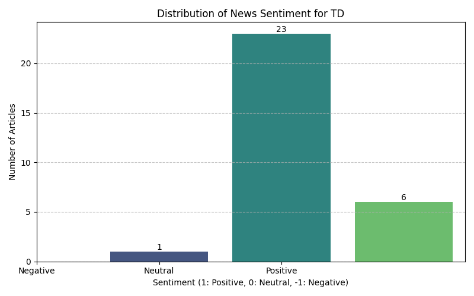
    


#**BMO**


```python
bmo_ticker = Ticker("BMO")
bmo_ticker.price()
```


<div>
<style scoped>
    .dataframe tbody tr th:only-of-type {
        vertical-align: middle;
    }

    .dataframe tbody tr th {
        vertical-align: top;
    }

    .dataframe thead th {
        text-align: right;
    }
</style>
<table border="1" class="dataframe">
  <thead>
    <tr style="text-align: right;">
      <th></th>
      <th>symbol</th>
      <th>report_date</th>
      <th>open</th>
      <th>close</th>
      <th>high</th>
      <th>low</th>
      <th>volume</th>
    </tr>
  </thead>
  <tbody>
    <tr>
      <th>0</th>
      <td>BMO</td>
      <td>1994-11-30</td>
      <td>9.2500</td>
      <td>9.2500</td>
      <td>9.3125</td>
      <td>9.1875</td>
      <td>89400</td>
    </tr>
    <tr>
      <th>1</th>
      <td>BMO</td>
      <td>1994-12-01</td>
      <td>9.2500</td>
      <td>9.1875</td>
      <td>9.2500</td>
      <td>9.1250</td>
      <td>35200</td>
    </tr>
    <tr>
      <th>2</th>
      <td>BMO</td>
      <td>1994-12-02</td>
      <td>9.1250</td>
      <td>9.2500</td>
      <td>9.2500</td>
      <td>9.1250</td>
      <td>26400</td>
    </tr>
    <tr>
      <th>3</th>
      <td>BMO</td>
      <td>1994-12-05</td>
      <td>9.3125</td>
      <td>9.4375</td>
      <td>9.5625</td>
      <td>9.3125</td>
      <td>32000</td>
    </tr>
    <tr>
      <th>4</th>
      <td>BMO</td>
      <td>1994-12-06</td>
      <td>9.4375</td>
      <td>9.2500</td>
      <td>9.4375</td>
      <td>9.2500</td>
      <td>88400</td>
    </tr>
    <tr>
      <th>...</th>
      <td>...</td>
      <td>...</td>
      <td>...</td>
      <td>...</td>
      <td>...</td>
      <td>...</td>
      <td>...</td>
    </tr>
    <tr>
      <th>7921</th>
      <td>BMO</td>
      <td>2026-05-22</td>
      <td>161.1800</td>
      <td>160.9300</td>
      <td>161.5500</td>
      <td>160.0600</td>
      <td>635100</td>
    </tr>
    <tr>
      <th>7922</th>
      <td>BMO</td>
      <td>2026-05-26</td>
      <td>162.9600</td>
      <td>161.8400</td>
      <td>163.1200</td>
      <td>160.9100</td>
      <td>849600</td>
    </tr>
    <tr>
      <th>7923</th>
      <td>BMO</td>
      <td>2026-05-27</td>
      <td>160.7200</td>
      <td>163.1300</td>
      <td>163.4400</td>
      <td>160.7200</td>
      <td>966400</td>
    </tr>
    <tr>
      <th>7924</th>
      <td>BMO</td>
      <td>2026-05-28</td>
      <td>162.4800</td>
      <td>161.8400</td>
      <td>162.8500</td>
      <td>160.3900</td>
      <td>802900</td>
    </tr>
    <tr>
      <th>7925</th>
      <td>BMO</td>
      <td>2026-05-29</td>
      <td>162.5500</td>
      <td>162.0100</td>
      <td>163.7500</td>
      <td>160.5500</td>
      <td>497795</td>
    </tr>
  </tbody>
</table>
<p>7926 rows × 7 columns</p>
</div>


```python
statement3 = bmo_ticker.quarterly_income_statement()
print(statement3.print_pretty_table())
```

    |-----------------------------------------------------------------------------------------------+------------+------------+------------+------------+------------+------------+------------+------------+------------+------------+------------+------------+------------+------------+------------+------------+------------+------------|
    |                                           Breakdown                                           |    TTM     | 2026-04-30 | 2026-01-31 | 2025-10-31 | 2025-07-31 | 2025-04-30 | 2025-01-31 | 2024-10-31 | 2024-07-31 | 2024-04-30 | 2024-01-31 | 2023-10-31 | 2023-07-31 | 2023-04-30 | 2023-01-31 | 2022-10-31 | 2022-07-31 | 2022-04-30 |
    |-----------------------------------------------------------------------------------------------+------------+------------+------------+------------+------------+------------+------------+------------+------------+------------+------------+------------+------------+------------+------------+------------+------------+------------|
    | +Total Revenue                                                                                | 37,537,000 | 9,537,000  | 9,799,000  | 9,258,000  | 8,943,000  | 8,681,000  | 9,217,000  | 8,318,000  | 8,154,000  | 7,921,000  | 7,648,000  | 8,322,000  | 8,057,000  | *          | *          | *          | 6,945,000  | 5,705,000  |
    |  +Net Interest Income                                                                         | 21,903,000 | 5,268,000  | 5,643,000  | 5,496,000  | 5,496,000  | 5,097,000  | 5,398,000  | 5,438,000  | 4,794,000  | 4,515,000  | 4,721,000  | 4,941,000  | 4,905,000  | *          | *          | *          | 4,197,000  | 3,902,000  |
    |   +Interest Income                                                                            | 61,437,000 | 15,014,000 | 15,163,000 | 15,518,000 | 15,742,000 | 15,654,000 | 16,623,000 | 16,864,000 | 17,103,000 | 16,164,000 | 15,854,000 | 15,600,000 | 14,821,000 | *          | *          | *          | 7,044,000  | 5,523,000  |
    |    +Interest Income from Loans And Lease                                                      | 37,236,000 | 8,868,000  | 9,243,000  | 9,531,000  | 9,594,000  | 9,501,000  | 10,121,000 | 10,223,000 | 10,269,000 | 9,745,000  | 9,832,000  | 11,277,000 | 9,130,000  | *          | *          | *          | *          | *          |
    |     Interest Income from Loans                                                                | 37,236,000 | 8,868,000  | 9,243,000  | 9,531,000  | 9,594,000  | 9,501,000  | 10,121,000 | 10,223,000 | 10,269,000 | 9,745,000  | 9,832,000  | 11,277,000 | 9,130,000  | *          | *          | *          | *          | *          |
    |    Interest Income from Securities                                                            | 15,966,000 | 4,251,000  | 3,951,000  | 3,835,000  | 3,929,000  | 3,978,000  | 4,120,000  | 3,966,000  | 3,917,000  | 3,716,000  | 3,439,000  | 3,260,000  | 3,099,000  | *          | *          | *          | *          | *          |
    |    Interest Income from Deposits                                                              | 2,472,000  | 574,000    | 586,000    | 633,000    | 679,000    | 727,000    | 817,000    | 900,000    | 1,078,000  | 1,031,000  | *          | *          | *          | *          | *          | *          | *          | *          |
    |    Interest Income from Federal Funds Sold And Securities Purchase Under Agreements To Resell | 5,763,000  | 1,321,000  | 1,383,000  | 1,519,000  | 1,540,000  | 1,448,000  | 1,565,000  | 1,775,000  | 1,839,000  | 1,672,000  | 1,557,000  | *          | 1,563,000  | *          | *          | *          | *          | *          |
    |   +Interest Expense                                                                           | 39,534,000 | 9,746,000  | 9,520,000  | 10,022,000 | 10,246,000 | 10,557,000 | 11,225,000 | 11,426,000 | 12,309,000 | 11,649,000 | 11,133,000 | 10,659,000 | 9,916,000  | *          | *          | *          | 2,847,000  | 1,621,000  |
    |    Interest Expense for Deposit                                                               | 26,049,000 | 5,938,000  | 6,248,000  | 6,855,000  | 7,008,000  | 7,268,000  | 8,124,000  | 8,768,000  | 8,974,000  | 8,454,000  | 8,384,000  | 7,900,000  | 7,102,000  | *          | *          | *          | *          | *          |
    |    Interest Expense for Long Term Debt And Capital Securities                                 | 444,000    | 105,000    | 109,000    | 112,000    | 118,000    | 115,000    | 111,000    | 118,000    | 116,000    | 111,000    | 111,000    | 117,000    | 109,000    | *          | *          | *          | *          | *          |
    |    Interest Expense for Federal Funds Sold And Securities Purchase Under Agreements To Resell | 9,428,000  | 2,657,000  | 2,270,000  | 2,274,000  | 2,227,000  | 2,374,000  | 2,189,000  | 2,344,000  | 2,405,000  | 2,282,000  | 1,876,000  | *          | 1,985,000  | *          | *          | *          | *          | *          |
    |    Other Interest Expense                                                                     | 3,613,000  | 1,046,000  | 893,000    | 781,000    | 893,000    | 800,000    | 801,000    | 196,000    | 814,000    | 802,000    | 762,000    | 2,642,000  | 720,000    | *          | *          | *          | *          | *          |
    |  +Non Interest Income                                                                         | 15,634,000 | 4,269,000  | 4,156,000  | 3,762,000  | 3,447,000  | 3,584,000  | 3,819,000  | 2,880,000  | 3,360,000  | 3,406,000  | 2,927,000  | 3,381,000  | 3,152,000  | *          | *          | *          | *          | *          |
    |   Total Premiums Earned                                                                       | 571,000    | 151,000    | 145,000    | 157,000    | 118,000    | 119,000    | 151,000    | 114,000    | 117,000    | 124,000    | 90,000     | 275,000    | 289,000    | *          | *          | *          | *          | *          |
    |   +Fees And Commissions                                                                       | 9,459,000  | 2,440,000  | 2,465,000  | 2,322,000  | 2,232,000  | 2,165,000  | 2,248,000  | 2,138,000  | 2,130,000  | 2,093,000  | 2,062,000  | 2,084,000  | 1,963,000  | *          | *          | *          | *          | *          |
    |    +Fees & Commission Income                                                                  | 9,459,000  | 2,440,000  | 2,465,000  | 2,322,000  | 2,232,000  | 2,165,000  | 2,248,000  | 2,138,000  | 2,130,000  | 2,093,000  | 2,062,000  | 2,084,000  | 1,963,000  | *          | *          | *          | *          | *          |
    |     Service Charge on Depositor Accounts                                                      | 3,114,000  | 776,000    | 789,000    | 775,000    | 774,000    | 780,000    | 804,000    | 758,000    | 765,000    | 786,000    | 781,000    | 797,000    | 792,000    | *          | *          | *          | *          | *          |
    |     Trust Fees by Commissions                                                                 | 4,183,000  | 1,096,000  | 1,099,000  | 1,023,000  | 965,000    | 909,000    | 937,000    | 891,000    | 867,000    | 824,000    | 798,000    | 782,000    | 792,000    | *          | *          | *          | *          | *          |
    |     Securities Activities                                                                     | 1,245,000  | 323,000    | 316,000    | 320,000    | 286,000    | 275,000    | 288,000    | 288,000    | 278,000    | 271,000    | 269,000    | 251,000    | 253,000    | *          | *          | *          | *          | *          |
    |     Credit Card                                                                               | 917,000    | 245,000    | 261,000    | 204,000    | 207,000    | 201,000    | 219,000    | 201,000    | 220,000    | 212,000    | 214,000    | 254,000    | 126,000    | *          | *          | *          | *          | *          |
    |   Investment Banking Profit                                                                   | 1,838,000  | 504,000    | 426,000    | 455,000    | 453,000    | 415,000    | 380,000    | 352,000    | 332,000    | 371,000    | 344,000    | 377,000    | 253,000    | *          | *          | *          | *          | *          |
    |   Trading Gain Loss                                                                           | 2,712,000  | 883,000    | 866,000    | 557,000    | 406,000    | 819,000    | 802,000    | 696,000    | 622,000    | 599,000    | 460,000    | 327,000    | 400,000    | *          | *          | *          | *          | *          |
    |   Foreign Exchange Trading Gains                                                              | 295,000    | 86,000     | 76,000     | 68,000     | 65,000     | 62,000     | 76,000     | 67,000     | 67,000     | 65,000     | 64,000     | 55,000     | 67,000     | *          | *          | *          | *          | *          |
    |   +Gain Losson Saleof Assets                                                                  | 334,000    | 86,000     | 85,000     | 114,000    | 49,000     | 66,000     | 58,000     | 57,000     | 49,000     | 81,000     | 13,000     | 34,000     | 36,000     | *          | *          | *          | *          | *          |
    |    Gain on Sale of Security                                                                   | 334,000    | 86,000     | 85,000     | 114,000    | 49,000     | 66,000     | 58,000     | 57,000     | 49,000     | 81,000     | 13,000     | 34,000     | 36,000     | *          | *          | *          | 85,000     | 86,000     |
    |   Other Non Interest Income                                                                   | 425,000    | 119,000    | 93,000     | 89,000     | 124,000    | -62,000    | 104,000    | -544,000   | 43,000     | 73,000     | -106,000   | 229,000    | 144,000    | *          | *          | *          | *          | *          |
    | Credit Losses Provision                                                                       | -3,037,000 | -739,000   | -746,000   | -755,000   | -797,000   | -1,054,000 | -1,011,000 | -1,523,000 | -906,000   | -705,000   | -627,000   | -446,000   | -492,000   | *          | *          | *          | *          | *          |
    | +Non Interest Expense                                                                         | 21,553,000 | 5,301,000  | 5,787,000  | 5,370,000  | 5,105,000  | 5,016,000  | 5,424,000  | 5,000,000  | 4,804,000  | 4,740,000  | 4,895,000  | 5,154,000  | 5,082,000  | *          | *          | *          | *          | *          |
    |  Occupancy And Equipment                                                                      | 4,576,000  | 1,140,000  | 1,140,000  | 1,215,000  | 1,081,000  | 1,086,000  | 1,086,000  | 1,062,000  | 1,047,000  | 1,032,000  | 976,000    | 1,447,000  | 1,215,000  | *          | *          | *          | *          | *          |
    |  Professional Expense And Contract Services Expense                                           | 711,000    | 152,000    | 168,000    | 219,000    | 172,000    | 141,000    | 146,000    | -41,000    | 136,000    | 132,000    | 138,000    | 323,000    | 276,000    | *          | *          | *          | *          | *          |
    |  +Selling General and Administrative                                                          | 13,364,000 | 3,277,000  | 3,732,000  | 3,202,000  | 3,153,000  | 3,060,000  | 3,409,000  | 2,921,000  | 2,906,000  | 2,821,000  | 3,061,000  | 3,320,000  | 3,269,000  | *          | *          | *          | 2,683,000  | 1,394,000  |
    |   +General & Administrative Expense                                                           | 12,568,000 | 3,083,000  | 3,552,000  | 2,978,000  | 2,955,000  | 2,850,000  | 3,235,000  | 2,694,000  | 2,689,000  | 2,619,000  | 2,870,000  | 3,060,000  | 3,051,000  | *          | *          | *          | 2,548,000  | 1,279,000  |
    |    Salaries and Wages                                                                         | 12,568,000 | 3,083,000  | 3,552,000  | 2,978,000  | 2,955,000  | 2,850,000  | 3,235,000  | 2,694,000  | 2,689,000  | 2,619,000  | 2,870,000  | 2,909,000  | 3,051,000  | *          | *          | *          | 2,135,000  | 2,087,000  |
    |    Insurance & Claims                                                                         | *          | *          | *          | *          | *          | *          | *          | *          | *          | *          | *          | 151,000    | 4,000      | 591,000    | 1,193,000  | -369,000   | 413,000    | -808,000   |
    |   Selling & Marketing Expense                                                                 | 796,000    | 194,000    | 180,000    | 224,000    | 198,000    | 210,000    | 174,000    | 227,000    | 217,000    | 202,000    | 191,000    | 260,000    | 218,000    | *          | *          | *          | 135,000    | 115,000    |
    |  +Depreciation Amortization Depletion                                                         | 1,158,000  | 296,000    | 294,000    | 290,000    | 278,000    | 296,000    | 288,000    | 280,000    | 277,000    | 276,000    | 279,000    | 286,000    | 284,000    | *          | *          | *          | 151,000    | 147,000    |
    |   +Depreciation & Amortization                                                                | 1,158,000  | 296,000    | 294,000    | 290,000    | 278,000    | 296,000    | 288,000    | 280,000    | 277,000    | 276,000    | 279,000    | 286,000    | 284,000    | *          | *          | *          | 151,000    | 147,000    |
    |    +Amortization                                                                              | 1,158,000  | 296,000    | 294,000    | 290,000    | 278,000    | 296,000    | 288,000    | 280,000    | 277,000    | 276,000    | 279,000    | 286,000    | 284,000    | *          | *          | *          | 151,000    | 147,000    |
    |     Amortization of Intangibles                                                               | 1,158,000  | 296,000    | 294,000    | 290,000    | 278,000    | 296,000    | 288,000    | 280,000    | 277,000    | 276,000    | 279,000    | 286,000    | 284,000    | *          | *          | *          | 151,000    | 147,000    |
    |  Other Non Interest Expense                                                                   | 1,744,000  | 436,000    | 453,000    | 444,000    | 421,000    | 433,000    | 495,000    | 778,000    | 438,000    | 479,000    | 441,000    | -222,000   | 38,000     | *          | *          | *          | *          | *          |
    | Income from Associates & Other Participating Interests                                        | 206,000    | 37,000     | 41,000     | 83,000     | 45,000     | -2,000     | 49,000     | 50,000     | 52,000     | 67,000     | 38,000     | *          | *          | *          | *          | *          | *          | *          |
    | +Special Income Charges                                                                       | -214,000   | -36,000    | 18,000     | -186,000   | 0.0        | -3,000     | -3,000     | 1,162,000  | -49,000    | -118,000   | -508,000   | -598,000   | -493,000   | *          | *          | *          | -1,036,000 | 3,508,000  |
    |  Gain on Sale of Business                                                                     | -132,000   | -26,000    | -4,000     | *          | *          | 0.0        | 0.0        | *          | *          | *          | *          | 0.0        | 0.0        | 0.0        | 0.0        | 6,000      | -7,000     | -10,000    |
    |  Restructuring & Mergers Acquisition                                                          | 44,000     | 10,000     | 25,000     | 4,000      | 5,000      | -2,000     | 10,000     | 35,000     | 25,000     | 36,000     | 76,000     | 582,000    | 497,000    | *          | *          | *          | 1,029,000  | -3,518,000 |
    |  Impairment of Capital Assets                                                                 | 102,000    | 0.0        | *          | *          | *          | 0.0        | *          | *          | *          | *          | *          | *          | *          | *          | *          | *          | *          | *          |
    |  Other Special Charges                                                                        | -64,000    | *          | -47,000    | -12,000    | -5,000     | 5,000      | -7,000     | -1,197,000 | 24,000     | 82,000     | 432,000    | 16,000     | -4,000     | *          | *          | *          | *          | *          |
    | Pretax Income                                                                                 | 12,939,000 | 3,498,000  | 3,325,000  | 3,030,000  | 3,086,000  | 2,606,000  | 2,828,000  | 3,007,000  | 2,447,000  | 2,425,000  | 1,656,000  | 2,176,000  | 1,988,000  | *          | *          | *          | 1,691,000  | 6,363,000  |
    | Tax Provision                                                                                 | 3,195,000  | 868,000    | 836,000    | 735,000    | 756,000    | 644,000    | 690,000    | 703,000    | 582,000    | 559,000    | 364,000    | 559,000    | 423,000    | *          | *          | *          | 326,000    | 1,607,000  |
    | +Net Income Common Stockholders                                                               | 9,282,000  | 2,487,000  | 2,409,000  | 2,125,000  | 2,261,000  | 1,818,000  | 2,069,000  | 2,149,000  | 1,814,000  | 1,719,000  | 1,250,000  | 1,485,000  | 1,522,000  | *          | *          | *          | 1,318,000  | 4,704,000  |
    |  +Net Income(Attributable to Parent Company Shareholders)                                     | 9,731,000  | 2,626,000  | 2,490,000  | 2,288,000  | 2,327,000  | 1,960,000  | 2,134,000  | 2,301,000  | 1,865,000  | 1,862,000  | 1,290,000  | 1,610,000  | 1,563,000  | *          | *          | *          | 1,365,000  | 4,756,000  |
    |   +Net Income Including Non-Controlling Interests                                             | 9,744,000  | 2,630,000  | 2,489,000  | 2,295,000  | 2,330,000  | 1,962,000  | 2,138,000  | 2,304,000  | 1,865,000  | 1,866,000  | 1,292,000  | 1,617,000  | 1,565,000  | *          | *          | *          | 1,365,000  | 4,756,000  |
    |    Net Income Continuous Operations                                                           | 9,744,000  | 2,630,000  | 2,489,000  | 2,295,000  | 2,330,000  | 1,962,000  | 2,138,000  | 2,304,000  | 1,865,000  | 1,866,000  | 1,292,000  | 1,617,000  | 1,565,000  | *          | *          | *          | 1,365,000  | 4,756,000  |
    |   Minority Interests                                                                          | -13,000    | -4,000     | 1,000      | -7,000     | -3,000     | -2,000     | -4,000     | -3,000     | 0.0        | -4,000     | -2,000     | -7,000     | -2,000     | *          | *          | *          | *          | *          |
    |  Preferred Stock Dividends                                                                    | 449,000    | 139,000    | 81,000     | 163,000    | 66,000     | 142,000    | 65,000     | 152,000    | 51,000     | 143,000    | 40,000     | 125,000    | 41,000     | *          | *          | *          | 47,000     | 52,000     |
    | Diluted NI Available to Com Stockholders                                                      | 9,282,000  | 2,487,000  | 2,409,000  | 2,125,000  | 2,261,000  | 1,818,000  | 2,069,000  | 2,149,000  | 1,814,000  | 1,719,000  | 1,250,000  | 1,485,000  | 1,522,000  | *          | *          | *          | 1,318,000  | 4,704,000  |
    | Basic EPS                                                                                     | 13.06      | 3.54       | 3.4        | *          | 3.14       | 2.51       | 2.84       | *          | 2.49       | 2.36       | 1.73       | *          | 2.13       | 1.27       | *          | *          | 1.96       | 7.15       |
    | Diluted EPS                                                                                   | 13.02      | 3.53       | 3.39       | *          | 3.14       | 2.5        | 2.83       | *          | 2.48       | 2.36       | 1.73       | *          | 2.12       | 1.26       | *          | *          | 1.95       | 7.13       |
    | Basic Average Shares                                                                          | 710,958    | 702,670    | 708,402    | *          | 719,514    | 725,402    | 729,564    | *          | 729,449    | 728,348    | 723,751    | *          | 715,432    | 711,624    | *          | *          | 673,301    | 658,005    |
    | Diluted Average Shares                                                                        | 712,645    | 704,586    | 710,166    | *          | 720,793    | 726,440    | 730,690    | *          | 730,192    | 729,279    | 724,586    | *          | 716,377    | 712,812    | *          | *          | 674,804    | 660,026    |
    | Interest Income after Provision for Loan Loss                                                 | 18,866,000 | 4,529,000  | 4,897,000  | 4,741,000  | 4,699,000  | 4,043,000  | 4,387,000  | 3,915,000  | 3,888,000  | 3,810,000  | 4,094,000  | 4,495,000  | 4,413,000  | *          | *          | *          | *          | *          |
    | Net Income from Continuing & Discontinued Operation                                           | 9,731,000  | 2,626,000  | 2,490,000  | 2,288,000  | 2,327,000  | 1,960,000  | 2,134,000  | 2,301,000  | 1,865,000  | 1,862,000  | 1,290,000  | 1,610,000  | 1,563,000  | *          | *          | *          | 1,365,000  | 4,756,000  |
    | Normalized Income                                                                             | 9,892,157  | 2,653,072  | 2,476,536  | 2,428,881  | 2,327,000  | 1,962,259  | 2,136,268  | 1,410,661  | 1,902,338  | 1,952,799  | 1,686,494  | 2,054,377  | 1,950,941  | *          | *          | *          | 2,201,052  | 2,132,016  |
    | Total Money Market Investments                                                                | 8,235,000  | 1,895,000  | 1,969,000  | 2,152,000  | 2,219,000  | 2,175,000  | 2,382,000  | 2,675,000  | 2,917,000  | 2,703,000  | 2,583,000  | 1,063,000  | 2,592,000  | *          | *          | *          | *          | *          |
    | Reconciled Depreciation                                                                       | 2,183,000  | 545,000    | 547,000    | 558,000    | 533,000    | 544,000    | 545,000    | 524,000    | 530,000    | 524,000    | 532,000    | 596,000    | 550,000    | *          | *          | *          | 343,000    | 339,000    |
    | Net Income from Continuing Operation Net Minority Interest                                    | 9,731,000  | 2,626,000  | 2,490,000  | 2,288,000  | 2,327,000  | 1,960,000  | 2,134,000  | 2,301,000  | 1,865,000  | 1,862,000  | 1,290,000  | 1,610,000  | 1,563,000  | *          | *          | *          | 1,365,000  | 4,756,000  |
    | Total Unusual Items Excluding Goodwill                                                        | -214,000   | -36,000    | 18,000     | -186,000   | 0.0        | -3,000     | -3,000     | 1,162,000  | -49,000    | -118,000   | -508,000   | -598,000   | -493,000   | *          | *          | *          | -1,036,000 | 3,508,000  |
    | Total Unusual Items                                                                           | -214,000   | -36,000    | 18,000     | -186,000   | 0.0        | -3,000     | -3,000     | 1,162,000  | -49,000    | -118,000   | -508,000   | -598,000   | -493,000   | *          | *          | *          | -1,036,000 | 3,508,000  |
    | Tax Rate for Calcs                                                                            | 0.25       | 0.25       | 0.25       | 0.24       | 0.25       | 0.25       | 0.24       | 0.23       | 0.24       | 0.23       | 0.22       | 0.26       | 0.21       | *          | *          | *          | 0.19       | 0.25       |
    | Tax Effect of Unusual Items                                                                   | -52,842    | -8,928     | 4,536      | -45,118    | 0.0        | -741       | -732       | 271,661    | -11,662    | -27,200    | -111,506   | -153,622   | -105,058   | *          | *          | *          | -199,948   | 884,016    |
    | Operating Revenue                                                                             | 37,537,000 | 9,537,000  | 9,799,000  | 9,258,000  | 8,943,000  | 8,681,000  | 9,217,000  | 8,318,000  | 8,154,000  | 7,921,000  | 7,648,000  | 8,322,000  | 8,057,000  | *          | *          | *          | 6,945,000  | 5,705,000  |
    |-----------------------------------------------------------------------------------------------+------------+------------+------------+------------+------------+------------+------------+------------+------------+------------+------------+------------+------------+------------+------------+------------+------------+------------|
    None
    


```python
transcripts3 = bmo_ticker.earning_call_transcripts()
transcripts3.get_transcripts_list()
```


<div>
<style scoped>
    .dataframe tbody tr th:only-of-type {
        vertical-align: middle;
    }

    .dataframe tbody tr th {
        vertical-align: top;
    }

    .dataframe thead th {
        text-align: right;
    }
</style>
<table border="1" class="dataframe">
  <thead>
    <tr style="text-align: right;">
      <th></th>
      <th>symbol</th>
      <th>fiscal_year</th>
      <th>fiscal_quarter</th>
      <th>report_date</th>
    </tr>
  </thead>
  <tbody>
    <tr>
      <th>0</th>
      <td>BMO</td>
      <td>2007</td>
      <td>3</td>
      <td>2007-09-09</td>
    </tr>
    <tr>
      <th>1</th>
      <td>BMO</td>
      <td>2007</td>
      <td>4</td>
      <td>2007-11-27</td>
    </tr>
    <tr>
      <th>2</th>
      <td>BMO</td>
      <td>2008</td>
      <td>1</td>
      <td>2008-03-04</td>
    </tr>
    <tr>
      <th>3</th>
      <td>BMO</td>
      <td>2009</td>
      <td>1</td>
      <td>2009-03-03</td>
    </tr>
    <tr>
      <th>4</th>
      <td>BMO</td>
      <td>2009</td>
      <td>2</td>
      <td>2009-05-26</td>
    </tr>
    <tr>
      <th>...</th>
      <td>...</td>
      <td>...</td>
      <td>...</td>
      <td>...</td>
    </tr>
    <tr>
      <th>68</th>
      <td>BMO</td>
      <td>2025</td>
      <td>2</td>
      <td>2025-05-28</td>
    </tr>
    <tr>
      <th>69</th>
      <td>BMO</td>
      <td>2025</td>
      <td>3</td>
      <td>2025-08-26</td>
    </tr>
    <tr>
      <th>70</th>
      <td>BMO</td>
      <td>2025</td>
      <td>4</td>
      <td>2025-12-04</td>
    </tr>
    <tr>
      <th>71</th>
      <td>BMO</td>
      <td>2026</td>
      <td>1</td>
      <td>2026-02-25</td>
    </tr>
    <tr>
      <th>72</th>
      <td>BMO</td>
      <td>2026</td>
      <td>2</td>
      <td>2026-05-27</td>
    </tr>
  </tbody>
</table>
<p>73 rows × 4 columns</p>
</div>


```python
transcripts3 = bmo_ticker.earning_call_transcripts()
transcripts3.get_transcript(2025, 4)
```


<div>
<style scoped>
    .dataframe tbody tr th:only-of-type {
        vertical-align: middle;
    }

    .dataframe tbody tr th {
        vertical-align: top;
    }

    .dataframe thead th {
        text-align: right;
    }
</style>
<table border="1" class="dataframe">
  <thead>
    <tr style="text-align: right;">
      <th></th>
      <th>paragraph_number</th>
      <th>speaker</th>
      <th>content</th>
    </tr>
  </thead>
  <tbody>
    <tr>
      <th>0</th>
      <td>1</td>
      <td>Operator</td>
      <td>Good morning, and welcome to the BMO Financial...</td>
    </tr>
    <tr>
      <th>1</th>
      <td>2</td>
      <td>Christine Viau</td>
      <td>Thank you, and good morning. We will begin the...</td>
    </tr>
    <tr>
      <th>2</th>
      <td>3</td>
      <td>Darryl White</td>
      <td>Thank you, Christine, and good morning, everyo...</td>
    </tr>
    <tr>
      <th>3</th>
      <td>4</td>
      <td>Tayfun Tuzun</td>
      <td>Thank you, Darryl. Good morning, and thank you...</td>
    </tr>
    <tr>
      <th>4</th>
      <td>5</td>
      <td>Piyush Agrawal</td>
      <td>Thank you, Tayfun, and good morning, everyone....</td>
    </tr>
    <tr>
      <th>5</th>
      <td>6</td>
      <td>Operator</td>
      <td>[Operator Instructions] Our first question com...</td>
    </tr>
    <tr>
      <th>6</th>
      <td>7</td>
      <td>Paul Holden</td>
      <td>A question on ROE. Now given the 11.3% in '25,...</td>
    </tr>
    <tr>
      <th>7</th>
      <td>8</td>
      <td>Darryl White</td>
      <td>Paul, it's Darryl. So the 15% is still absolut...</td>
    </tr>
    <tr>
      <th>8</th>
      <td>9</td>
      <td>Operator</td>
      <td>Our next question comes from John Aiken from J...</td>
    </tr>
    <tr>
      <th>9</th>
      <td>10</td>
      <td>John Aiken</td>
      <td>Tayfun, you reiterated your preference for a C...</td>
    </tr>
    <tr>
      <th>10</th>
      <td>11</td>
      <td>Tayfun Tuzun</td>
      <td>So John, good question. I will reiterate how w...</td>
    </tr>
    <tr>
      <th>11</th>
      <td>12</td>
      <td>Operator</td>
      <td>Our next question comes from Ebrahim Poonawala...</td>
    </tr>
    <tr>
      <th>12</th>
      <td>13</td>
      <td>Ebrahim Poonawala</td>
      <td>I guess just 2 questions -- one or 2-part ques...</td>
    </tr>
    <tr>
      <th>13</th>
      <td>14</td>
      <td>Aron Levine</td>
      <td>Ebrahim, thanks for the question. It's Aron. S...</td>
    </tr>
    <tr>
      <th>14</th>
      <td>15</td>
      <td>Ebrahim Poonawala</td>
      <td>Got it. [indiscernible] on Canada.</td>
    </tr>
    <tr>
      <th>15</th>
      <td>16</td>
      <td>Aron Levine</td>
      <td>Yes. Here it comes.</td>
    </tr>
    <tr>
      <th>16</th>
      <td>17</td>
      <td>Sharon Haward-Laird</td>
      <td>Thank you. Here it comes. It's Sharon. Thanks ...</td>
    </tr>
    <tr>
      <th>17</th>
      <td>18</td>
      <td>Operator</td>
      <td>Our next question comes from Gabriel Dechaine ...</td>
    </tr>
    <tr>
      <th>18</th>
      <td>19</td>
      <td>Gabriel Dechaine</td>
      <td>I know the impaired PCL discussion over the pa...</td>
    </tr>
    <tr>
      <th>19</th>
      <td>20</td>
      <td>Mathew Mehrotra</td>
      <td>Thanks for the question, Gabe. It's Matt speak...</td>
    </tr>
    <tr>
      <th>20</th>
      <td>21</td>
      <td>Operator</td>
      <td>Our next question comes from Mario Mendonca fr...</td>
    </tr>
    <tr>
      <th>21</th>
      <td>22</td>
      <td>Mario Mendonca</td>
      <td>Sort of similar question to what Gabe just ask...</td>
    </tr>
    <tr>
      <th>22</th>
      <td>23</td>
      <td>Darryl White</td>
      <td>Yes. Okay. So it's Darryl, Mario. Thanks, Gabe...</td>
    </tr>
    <tr>
      <th>23</th>
      <td>24</td>
      <td>Mario Mendonca</td>
      <td>Okay. And I need one quick clarification on th...</td>
    </tr>
    <tr>
      <th>24</th>
      <td>25</td>
      <td>Tayfun Tuzun</td>
      <td>Yes. We are leaving it in. We've always -- yes...</td>
    </tr>
    <tr>
      <th>25</th>
      <td>26</td>
      <td>Operator</td>
      <td>Our last question comes from Darko Mihelic fro...</td>
    </tr>
    <tr>
      <th>26</th>
      <td>27</td>
      <td>Darko Mihelic</td>
      <td>I have a 2-part question. Just the first part ...</td>
    </tr>
    <tr>
      <th>27</th>
      <td>28</td>
      <td>Tayfun Tuzun</td>
      <td>So I'll begin with the first question, Darko. ...</td>
    </tr>
    <tr>
      <th>28</th>
      <td>29</td>
      <td>Piyush Agrawal</td>
      <td>Okay. Let me Darko -- it's Piyush, let me talk...</td>
    </tr>
    <tr>
      <th>29</th>
      <td>30</td>
      <td>Operator</td>
      <td>Our next question comes from Ebrahim Poonawala...</td>
    </tr>
    <tr>
      <th>30</th>
      <td>31</td>
      <td>Ebrahim Poonawala</td>
      <td>So I guess, Tayfun for you, as we think about ...</td>
    </tr>
    <tr>
      <th>31</th>
      <td>32</td>
      <td>Tayfun Tuzun</td>
      <td>Yes. Good question. Our capital position in th...</td>
    </tr>
    <tr>
      <th>32</th>
      <td>33</td>
      <td>Ebrahim Poonawala</td>
      <td>Got it. And if I could follow up, maybe, Darry...</td>
    </tr>
    <tr>
      <th>33</th>
      <td>34</td>
      <td>Darryl White</td>
      <td>Okay. Ebrahim, thanks for the question. Look, ...</td>
    </tr>
    <tr>
      <th>34</th>
      <td>35</td>
      <td>Operator</td>
      <td>We have no further questions. I would like to ...</td>
    </tr>
    <tr>
      <th>35</th>
      <td>36</td>
      <td>Darryl White</td>
      <td>Okay. Thanks, everyone, for your questions thi...</td>
    </tr>
    <tr>
      <th>36</th>
      <td>37</td>
      <td>Operator</td>
      <td>This concludes the BMO Financial Group's Q4 20...</td>
    </tr>
  </tbody>
</table>
</div>


```python
news_object3 = bmo_ticker.news()
print(news_object3)
```

                                         uuid                                                                                                                                                                                                                                                                               title                     publisher report_date   type                                                                                                                                                  link
    0    2b7e1576-1cf5-3eb0-a980-8f7442485a16                                                                                                                                                                                                                    Pharmaceutical Stocks Tumble on Trump Plan to Cut US Drug Prices                     Bloomberg  2025-05-12  STORY                                                                           https://finance.yahoo.com/news/asia-pharma-stocks-drop-trump-024422723.html
    1    1e3e4d2d-2068-3417-a299-dbebdf29a973                                                                                                                                                                                                                     A Trade Made for Buffett: Energy Stocks Priced Below Book Value                     Bloomberg  2025-05-15  STORY                                                                        https://finance.yahoo.com/news/trade-made-buffett-energy-stocks-135505294.html
    2    079b4d41-d94c-3274-8150-ebbc3e964725                                                                                                                                                                                                             BMO’s Q2 earnings show no improvement in credit conditions for trucking                  FreightWaves  2025-05-28  STORY                                                                                 https://finance.yahoo.com/news/bmo-q2-earnings-show-no-144245168.html
    3    f7b47512-7d8e-34b6-9e61-f0650cec94f3                                                                                                                                                                                                      Morning Movers: Abercrombie & Fitch skyrockets following first quarter results                      TipRanks  2025-05-29  STORY                                                             https://finance.yahoo.com/news/morning-movers-abercrombie-fitch-skyrockets-125519446.html
    4    03aaf3f8-bdf6-35fe-a1b5-de3610cc4bb5                                                                                                                                                                                                                        Box Q1 beat, Bank of Montreal earnings, Instacart's next CEO           Yahoo Finance Video  2025-05-29  VIDEO                                                                              https://finance.yahoo.com/video/box-q1-beat-bank-montreal-160802905.html
    5    04c0e5e5-0ee7-3025-9222-e13c10e9ef36                                                                                                                                                                                                       Bank of Montreal (TSX:BMO) Reports Dividend Hike and Positive Earnings Growth               Simply Wall St.  2025-05-29  STORY                                                                           https://finance.yahoo.com/news/bank-montreal-tsx-bmo-reports-171748899.html
    6    107c85f7-4dbb-316a-a00a-a71ac9c2b003                                                                                                                                                                                Bank of Montreal (BMO) Q2 2025 Earnings Call Highlights: Strong Performance Amid Economic Challenges                 GuruFocus.com  2025-05-29  STORY                                                                               https://finance.yahoo.com/news/bank-montreal-bmo-q2-2025-070254030.html
    7    d01378e1-f2a5-35cd-983a-d477d4cf41fc                                                                                                                                                                                                                     Farmers Press Trump for Biofuels Boost to Counter Tariff Losses                     Bloomberg  2025-05-29  STORY                                                                      https://finance.yahoo.com/news/farmers-press-trump-biofuels-boost-090000271.html
    8    3a08ca81-b2bd-38f7-a59c-c367ee243006                                                                                                                                                                                                                                                 TSX Flat at Midday on Mixed Sectors                  MT Newswires  2025-05-29  STORY                                                                           https://finance.yahoo.com/news/tsx-flat-midday-mixed-sectors-161322000.html
    9    d60ae5da-ccd9-3bf5-bc53-c9494fa8e98c                                                                                                                                                                                                                       BMO Recognized for Digital Innovation and Customer Experience                     CNW Group  2025-05-30  STORY                                                              https://finance.yahoo.com/news/bmo-recognized-digital-innovation-customer-120000241.html
    10   121b0235-541b-301b-938f-b832663ff1ac                                                                                                                                                                                                           Bank of Montreal (TSE:BMO) Is Paying Out A Larger Dividend Than Last Year               Simply Wall St.  2025-06-01  STORY                                                                            https://finance.yahoo.com/news/bank-montreal-tse-bmo-paying-131719857.html
    11   0e2484d1-a89f-30ae-b855-c7db105bf7e3                                                                                                                                                                                   BMO Walks for Good: BMO Employees Step Up, Raising almost $2.4 million for Mental Health Services                   PR Newswire  2025-06-02  STORY                                                                            https://finance.yahoo.com/news/bmo-walks-good-bmo-employees-120000372.html
    12   43151764-4e04-37e1-8673-b44ac5693a31                                                                                                                                                                                              BMO Announces Upcoming Ticker Symbol Change for MicroSectors™ FANG+™ 3× Leveraged ETNs                   PR Newswire  2025-06-03  STORY                                                                    https://finance.yahoo.com/news/bmo-announces-upcoming-ticker-symbol-200000251.html
    13   9560c072-a4df-3588-a844-5dfcb01fb635                                                                                                                                                                                                BMO Survey: Personal Finance Concerns Rose Significantly Between March to April 2025                     CNW Group  2025-06-04  STORY                                                                    https://finance.yahoo.com/news/bmo-survey-personal-finance-concerns-100000319.html
    14   3154691e-dbee-3517-b8ef-80d3acdc5c6c                                                                                                                                                                                                                                BMO Financial Group Announces Executive Appointments                   PR Newswire  2025-06-05  STORY                                                                 https://finance.yahoo.com/news/bmo-financial-group-announces-executive-115900092.html
    15   f89cbdb4-6d71-39b3-bdf8-c24891ced82f                                                                                                                                                                                                                                       BMO Announcing Several Executive Appointments                  MT Newswires  2025-06-05  STORY                                                           https://finance.yahoo.com/news/bmo-announcing-several-executive-appointments-121309318.html
    16   3762829b-8eda-3573-a8e0-da189f367428                                                                                                                                                                                                                                                      BMO on The Day Ahead in Canada                  MT Newswires  2025-06-05  STORY                                                                                    https://finance.yahoo.com/news/bmo-day-ahead-canada-113557330.html
    17   9eb0584b-dbb2-32c6-8770-1a0c344f5f45                                                                                                                                                                                                                                                           BMO hires BofA vet Levine                  Banking Dive  2025-06-05  STORY                                                       https://finance.yahoo.com/m/9eb0584b-dbb2-32c6-8770-1a0c344f5f45/bmo-hires-bofa-vet-levine.html
    18   bbf033b7-c212-31fc-b6ff-504eae980f33                                                                                                                                                                                                                             BMO Says Tariffs Hit New Vehicle Sales in North America                  MT Newswires  2025-06-05  STORY                                                                            https://finance.yahoo.com/news/bmo-says-tariffs-hit-vehicle-122225444.html
    19   e3fe807d-f3fd-340e-86a0-7a2715e7a16d                                                                                                                                                                                                                               BMO hires former BofA exec to oversee U.S. businesses               American Banker  2025-06-06  STORY                                                   https://finance.yahoo.com/m/e3fe807d-f3fd-340e-86a0-7a2715e7a16d/bmo-hires-former-bofa-exec-to.html
    20   17d62809-bc97-3a2d-bd8e-85e63dbd66e4                                                                                                                                                                                         Bank of Montreal (TSX:BMO) Announces Leadership Changes to Enhance U.S. and Canadian Growth               Simply Wall St.  2025-06-07  STORY                                                                         https://finance.yahoo.com/news/bank-montreal-tsx-bmo-announces-171735650.html
    21   5c42b397-66f8-3f1c-9841-543178b086dc                                                                                                                                                                                                                                                     BMO on The Week Ahead in Canada                  MT Newswires  2025-06-09  STORY                                                                                   https://finance.yahoo.com/news/bmo-week-ahead-canada-112759902.html
    22   e62ead91-2c23-3cbb-9d80-508f3083b9b0                                                                                                                                                                                                                                                      BMO on The Day Ahead in Canada                  MT Newswires  2025-06-10  STORY                                                                                    https://finance.yahoo.com/news/bmo-day-ahead-canada-112505655.html
    23   88ade65d-62e1-32ea-9eda-3c0795eab112                                                                                                                                                                                                                                       Ontario's Jobless Rate on the Rise, Notes BMO                  MT Newswires  2025-06-10  STORY                                                                          https://finance.yahoo.com/news/ontario-apos-jobless-rate-rise-133424220.html
    24   15beac90-52e8-3cc0-80a7-376bb4fb7862                                                                                                                                                                                                                             Canada's Economic Outlook Brightens "Somewhat" Says BMO                  MT Newswires  2025-06-11  STORY                                                                  https://finance.yahoo.com/news/canada-apos-economic-outlook-brightens-152718546.html
    25   9932387a-4566-3593-8b9d-0d3918fd006f                                                                                                                                                                                                                                  Canadians Continue to Avoid U.S. Travel, Notes BMO                  MT Newswires  2025-06-11  STORY                                                                       https://finance.yahoo.com/news/canadians-continue-avoid-u-travel-112043843.html
    26   90e65cd0-3a59-328c-8429-5bac956aead4                                                                                                                                                                                                                       Gold Rises on Bets of Fed Interest Rate Cuts; Platinum Surges                     Bloomberg  2025-06-11  STORY                                                                             https://finance.yahoo.com/news/gold-advances-even-us-china-045443119.html
    27   0af6ca78-5ee9-35bb-95b2-00af73a635b1                                                                                                                                                                                                                                        TSX Dividend Stocks To Consider In June 2025               Simply Wall St.  2025-06-12  STORY                                                                       https://finance.yahoo.com/news/tsx-dividend-stocks-consider-june-123152880.html
    28   2fa3d1b0-bd6c-3b4e-8906-faa257023fbf                                                                                                                                                                                                                                     BMO Launches Human Capital Factor US Equity ETF                     CNW Group  2025-06-12  STORY                                                                       https://finance.yahoo.com/news/bmo-launches-human-capital-factor-113000996.html
    29   6f948c38-7c25-37be-96eb-694685b409e9                                                                                                                                                                                                                                 Debts at Households in Canada Rise in Q1, Notes BMO                  MT Newswires  2025-06-12  STORY                                                                         https://finance.yahoo.com/news/debts-households-canada-rise-q1-144613020.html
    30   2925c487-4673-3558-8b93-3d91b6493ee0                                                                                                                                                                                                                    US 30-Year Bond Sale Spurs ‘Sigh of Relief’ After Weeks of Angst                     Bloomberg  2025-06-13  STORY                                                                                   https://finance.yahoo.com/news/us-30-bond-sale-spurs-184410930.html
    31   53c6cda5-aecf-3864-ab69-907cb55b55bc                                                                                                                                                                                                                                                      BMO on The Day Ahead in Canada                  MT Newswires  2025-06-13  STORY                                                                                    https://finance.yahoo.com/news/bmo-day-ahead-canada-115359490.html
    32   4637aa13-626d-3af3-9c3a-df624be5df50                                                                                                                                                                                                                         Tariff-Hit Factory, Wholesale Sales in Canada Fell in April                     Bloomberg  2025-06-13  STORY                                                                      https://finance.yahoo.com/news/tariff-hit-factory-wholesale-sales-130737200.html
    33   0c11a2d5-5e6d-3a6d-a06b-ddf418f16185                                                                                                                                                                                                                     A $60 billion Visa, Mastercard slump seen as buying opportunity                     Bloomberg  2025-06-14  STORY                                                                        https://finance.yahoo.com/news/60-billion-visa-mastercard-slump-184854735.html
    34   0b4ca384-f2d4-3229-b190-22a3785b31b8                                                                                                                                                                                                                Bank of Montreal (BMO) Strengthens Leadership Group in North America                Insider Monkey  2025-06-16  STORY                                                                https://finance.yahoo.com/news/bank-montreal-bmo-strengthens-leadership-145010710.html
    35   a4594ade-d0b2-34a4-86c4-3ef2b8be8e1f                                                                                                                                                                                                                   BMO's AI-Powered Lumi Assistant Recognized for Digital Innovation                     CNW Group  2025-06-17  STORY                                                                          https://finance.yahoo.com/news/bmos-ai-powered-lumi-assistant-120000451.html
    36   3815df1b-5515-3359-a3b4-3442e865c1dc                                                                                                                                                                                                                                            BMO to Acquire Burgundy Asset Management                     CNW Group  2025-06-19  STORY                                                                   https://finance.yahoo.com/news/bmo-acquire-burgundy-asset-management-114500539.html
    37   3815df1b-5515-3359-a3b4-3442e865c1dc                                                                                                                                                                                                                                            BMO to Acquire Burgundy Asset Management                     CNW Group  2025-06-19  STORY                                                                   https://finance.yahoo.com/news/bmo-acquire-burgundy-asset-management-114500539.html
    38   8b553a85-7ba2-31c4-97cc-aa372b5c7cd8                                                                                                                                                                                                 Bank of Montreal Agrees to Buy Burgundy Asset Management for $456 Million in Shares       The Wall Street Journal  2025-06-19  STORY                                                      https://finance.yahoo.com/m/8b553a85-7ba2-31c4-97cc-aa372b5c7cd8/bank-of-montreal-agrees-to.html
    39   4f1da8ba-e4c5-3b5d-b10a-d53628c8b72f                                                                                                                                                                                                                                            BMO to Acquire Burgundy Asset Management                   PR Newswire  2025-06-19  STORY                                                                   https://finance.yahoo.com/news/bmo-acquire-burgundy-asset-management-114500561.html
    40   71f662e1-5be5-3376-bffc-923342315595                                                                                                                                                 BMO Releases ᐑᒋᐦᐃᑐᐏᐣ wîcihitowin - 5th Annual Indigenous Partnerships and Progress Report and Launches New Office of Reconciliation                     CNW Group  2025-06-20  STORY                                                                            https://finance.yahoo.com/news/bmo-releases-w-cihitowin-5th-170000764.html
    41   70cf3fe9-3409-321a-8324-035af1aeb691                                                                                                                                                                                                                                  BMO to acquire Burgundy Asset Management for $456m  Private Banker International  2025-06-20  STORY                                                   https://finance.yahoo.com/m/70cf3fe9-3409-321a-8324-035af1aeb691/bmo-to-acquire-burgundy-asset.html
    42   26fe4c4f-aa5e-3154-9e1f-f069174e7fde                                                                                                                                                                                                            BMO Recognized with 2025 Celent Model Bank Award for Payments Innovation                     CNW Group  2025-06-20  STORY                                                                        https://finance.yahoo.com/news/bmo-recognized-2025-celent-model-183000694.html
    43   26fe4c4f-aa5e-3154-9e1f-f069174e7fde                                                                                                                                                                                                            BMO Recognized with 2025 Celent Model Bank Award for Payments Innovation                     CNW Group  2025-06-20  STORY                                                                        https://finance.yahoo.com/news/bmo-recognized-2025-celent-model-183000694.html
    44   71f662e1-5be5-3376-bffc-923342315595                                                                                                                                                 BMO Releases ᐑᒋᐦᐃᑐᐏᐣ wîcihitowin - 5th Annual Indigenous Partnerships and Progress Report and Launches New Office of Reconciliation                     CNW Group  2025-06-20  STORY                                                                            https://finance.yahoo.com/news/bmo-releases-w-cihitowin-5th-170000764.html
    45   b62fa7ad-af13-34b5-bb76-eae78328216c                                                                                                                                                                                                     Bank of Montreal (TSE:BMO) Will Pay A Larger Dividend Than Last Year At CA$1.63               Simply Wall St.  2025-06-20  STORY                                                                               https://finance.yahoo.com/news/bank-montreal-tse-bmo-pay-184143331.html
    46   8e400569-4451-3e4c-8a5e-2324499f08ea                                                                                                                                                                                                                                                      BMO on The Day Ahead in Canada                  MT Newswires  2025-06-20  STORY                                                                                    https://finance.yahoo.com/news/bmo-day-ahead-canada-113436708.html
    47   7a708d95-43be-3f19-b310-e757c39d3dc2                                                                                                                                                               BMO Announces Cash and Reinvested Distributions for Certain BMO ETFs and ETF Series of BMO Mutual Funds for June 2025                     CNW Group  2025-06-20  STORY                                                             https://finance.yahoo.com/news/bmo-announces-cash-reinvested-distributions-123000263.html
    48   9d279a4d-c06a-31a5-9775-d5ed2ea1c473                                                                                                                                                                                                                       BMO to acquire Burgundy Asset Management for C$625M in shares                      TipRanks  2025-06-20  STORY                                                                   https://finance.yahoo.com/news/bmo-acquire-burgundy-asset-management-115509958.html
    49   2018bb72-6692-36c9-8f07-e17a712d1a30                                                                                                                                                                                           BMO Recognized as Best Private Bank in Canada and Best Commercial Bank in U.S. and Canada                     CNW Group  2025-06-23  STORY                                                                        https://finance.yahoo.com/news/bmo-recognized-best-private-bank-120000483.html
    50   74d67f07-8b12-3cfe-bfd8-6c89b67d8508                                                                                                                                                                                                                        Treasuries Gain as Powell Says Fed Has ‘Many Paths’ on Rates                     Bloomberg  2025-06-25  STORY                                                                       https://finance.yahoo.com/news/treasuries-climb-oil-slump-boosts-092241109.html
    51   17a77b4c-2dff-37e1-8b8e-3be6fdaa88fe                                                                                                                                                                                                                     /C O R R E C T I O N from Source -- BMO Financial Group - ETFs/                     CNW Group  2025-06-26  STORY                                                                                               https://finance.yahoo.com/news/c-o-r-r-e-180000838.html
    52   34365fc2-545c-3b94-ae54-ca0efa4275a8                                                                                                                                                                                                                  Why Investors Need to Take Advantage of These 2 Finance Stocks Now                         Zacks  2025-06-30  STORY                                                                       https://finance.yahoo.com/news/why-investors-advantage-2-finance-130002442.html
    53   62ff310f-c942-35f5-9ea6-e12f7187a87c                                                                                                                                                                                                                           Gold Helps Canada’s Stocks Benchmark Outshine the S&P 500                     Bloomberg  2025-07-01  STORY                                                                      https://finance.yahoo.com/news/gold-helps-canada-stocks-benchmark-090000885.html
    54   ded4f5a9-17c5-349f-8b16-879ec543e2a9                                                                                                                                                                                                                         Are Finance Stocks Lagging  Banco Bradesco (BBD) This Year?                         Zacks  2025-07-02  STORY                                                                   https://finance.yahoo.com/news/finance-stocks-lagging-banco-bradesco-134003134.html
    55   2faf98ee-5519-3f55-836f-83cff87b7ad3                                                                                                                                                                                                               BMO Survey: Summer Travel Spending Heats Up Despite Economic Concerns                     CNW Group  2025-07-03  STORY                                                                       https://finance.yahoo.com/news/bmo-survey-summer-travel-spending-100000563.html
    56   1c390fe0-f6f6-36dc-a6a9-b5fcda3de71f                                                                                                                                                                                                                 Deutsche Bank Revamps German Wealth Management Unit to Boost Growth                         Zacks  2025-07-08  STORY                                                                     https://finance.yahoo.com/news/deutsche-bank-revamps-german-wealth-150600522.html
    57   189d6065-fefc-3905-9ba6-cb553ea190ab                                                                                                                                                        BMO to Redeem Non-Cumulative 5-Year Rate Reset Class B Preferred Shares, Series 33 (Non-Viability Contingent Capital (NVCC))                     CNW Group  2025-07-09  STORY                                                                             https://finance.yahoo.com/news/bmo-redeem-non-cumulative-5-210000464.html
    58   5a88d58b-82ac-391e-834a-afcd7a698004                                                                                                                                                                                                                         US Treasuries Jump as Strong Auction Calms Investor Jitters                     Bloomberg  2025-07-10  STORY                                                                         https://finance.yahoo.com/news/treasuries-stem-run-losses-debt-084150051.html
    59   7142fd50-c766-3338-9aaa-84d4379da9f9                                                                                                                                                                          BMO's My Financial Progress Digital Platform Empowers Canadians with Personalized Goal Planning Experience                     CNW Group  2025-07-10  STORY                                                                https://finance.yahoo.com/news/bmos-financial-progress-digital-platform-120000201.html
    60   6b56e814-97a2-3328-b0cc-ab38c982726c                                                                                                                                                                                                                      Trump Tax Law Quietly Takes Aim at Popular Perk: Office Snacks                     Bloomberg  2025-07-12  STORY                                                                             https://finance.yahoo.com/news/trump-tax-law-quietly-takes-140000965.html
    61   7aff8335-db8b-36c4-aebc-6f67e060aa8c                                                                                                                                                                                                                                   Worst Spate of Downgrades Since 2021 Signals Pain                     Bloomberg  2025-07-13  STORY                                                                       https://finance.yahoo.com/news/worst-spate-downgrades-since-2021-190000465.html
    62   a4452da2-a9ce-32cc-9ab6-51f0dd4b6157                                                                                                                                                                                                                      3 TSX Dividend Stocks With Up To 4.1% Yield For Your Portfolio               Simply Wall St.  2025-07-14  STORY                                                                                 https://finance.yahoo.com/news/3-tsx-dividend-stocks-4-123145894.html
    63   3f4d84ca-485f-3cdf-80e7-b32a84313018                                                                                                                                                                                                      Alterra IOS Secures $343 Million Loan Commitment from Truist, Bank of Montreal                 GlobeNewswire  2025-07-16  STORY                                                                         https://finance.yahoo.com/news/alterra-ios-secures-343-million-133000800.html
    64   d7bb3aa7-8390-38f9-b6a7-99948f964b03                                                                                                                                                                                                              Is Bank Of Montreal (BMO) Stock Outpacing Its Finance Peers This Year?                         Zacks  2025-07-18  STORY                                                                       https://finance.yahoo.com/news/bank-montreal-bmo-stock-outpacing-134003549.html
    65   340d1002-5f2e-3f4e-8abe-ef9c04865910                                                                                                                                                                                                                          FDA Rejects Replimune’s Skin Cancer Treatment, Shares Sink                     Bloomberg  2025-07-22  STORY                                                                       https://finance.yahoo.com/news/fda-rejects-replimune-skin-cancer-125946023.html
    66   25e018b0-f394-3b55-b199-4d22251142d3                                                                                                                                                                                                                 Bank of Montreal Announces AT1 Limited Recourse Capital Notes Issue                     CNW Group  2025-07-22  STORY                                                                     https://finance.yahoo.com/news/bank-montreal-announces-at1-limited-210000805.html
    67   ec0041f0-2f1f-3de0-9b76-bda82135395b                                                                                                                                                                                                                      Wall Street Is Stubbornly Bullish on Downtrodden Energy Stocks                     Bloomberg  2025-07-22  STORY                                                              https://finance.yahoo.com/news/wall-street-stubbornly-bullish-downtrodden-093000978.html
    68   5950cf59-b9a8-3286-a625-6cf475cefe5b                                                                                                                                                                              BMO Announces Cash Distributions for Certain BMO ETFs and ETF Series of BMO Mutual Funds for July 2025                     CNW Group  2025-07-23  STORY                                                                https://finance.yahoo.com/news/bmo-announces-cash-distributions-certain-123000457.html
    69   43a4a918-011e-3a4e-9755-6e53bbe844ae                                                                                                                                                                                                                         US Treasuries Gain for Fifth Day as Bessent Supports Powell                     Bloomberg  2025-07-23  STORY                                                                          https://finance.yahoo.com/news/treasuries-slip-fed-powell-set-104758557.html
    70   e3f71cff-1e92-3d60-a7bb-c8a5dc289c18                                                                                                                                                              BMO Asset Management Inc. Announces Unit Splits, Enhancing Accessibility to BMO Asset Allocation Exchange Traded Funds                     CNW Group  2025-08-01  STORY                                                                      https://finance.yahoo.com/news/bmo-asset-management-inc-announces-141700957.html
    71   144a78db-fe69-3e1b-b402-0ba85e1f1e11                                                                                                                                                                                                                           For US Companies, Europe Is Hard to Resist: Credit Weekly                     Bloomberg  2025-08-03  STORY                                                                         https://finance.yahoo.com/news/us-companies-europe-hard-resist-160021167.html
    72   74b55cb4-365b-3720-9f1b-6be1ff232236                                                                                                                                                                                                     Lilly’s Push to $1 Trillion Derailed by Trade Risks and Obesity Drug Speedbumps                     Bloomberg  2025-08-04  STORY                                                                          https://finance.yahoo.com/news/lilly-push-1-trillion-derailed-110001886.html
    73   9ebfdf82-9d80-3fa5-99e8-e31a8eb2edb4                                                                                                                                                                                                                       Are Finance Stocks Lagging  Bank Of Montreal (BMO) This Year?                         Zacks  2025-08-04  STORY                                                                    https://finance.yahoo.com/news/finance-stocks-lagging-bank-montreal-134002917.html
    74   c1fa0aef-23bb-36d8-8189-c9d688ae1dbb                                                                                                                                                                                                     Media Advisory - BMO Financial Group to Announce its Third Quarter 2025 Results                     CNW Group  2025-08-05  STORY                                                                      https://finance.yahoo.com/news/media-advisory-bmo-financial-group-120000809.html
    75   2bbc38dc-895b-34e0-952b-1ebaffe29f12                                                                                                                                                                                    BMO Announces Special Cash Distribution for BMO MSCI Europe High Quality Hedged to CAD Index ETF                     CNW Group  2025-08-06  STORY                                                                 https://finance.yahoo.com/news/bmo-announces-special-cash-distribution-144600937.html
    76   8134e839-5d89-3566-9a0d-2c8192484c31                                                                                                                                                                   BMO Launches 2025 BMO Celebrating Women Grant Program to Advance Real Financial Progress for Women-Led Businesses                     CNW Group  2025-08-11  STORY                                                                       https://finance.yahoo.com/news/bmo-launches-2025-bmo-celebrating-120000825.html
    77   a4124022-2fbb-3377-bd0d-269308ab9686                                                                                                                                                                                                                                    3 TSX Dividend Stocks Offering Yields Up To 6.3%               Simply Wall St.  2025-08-12  STORY                                                                          https://finance.yahoo.com/news/3-tsx-dividend-stocks-offering-123142117.html
    78   6dd9a0de-ba0d-3474-9c0b-6fa05987f0ed                                                                                                                                                                                  BMO Survey: Gen Z and Millennials Face Challenges Raising a Family Amid Rising Financial Pressures                     CNW Group  2025-08-13  STORY                                                                            https://finance.yahoo.com/news/bmo-survey-gen-z-millennials-100000212.html
    79   17dc0b3e-e578-3c7d-83fa-d992faafa202                                                                                                                                                                                                     RBC, BMO explore sale of $2 billion payments processor Moneris, Reuters reports                 Investing.com  2025-08-15  STORY                                                                                  https://finance.yahoo.com/news/rbc-bmo-explore-sale-2-173212445.html
    80   c556efbf-9d32-31c0-9ef4-ccf106198cd2                                                                                                                                                                                                                   Bank of Montreal May Sell Transport Finance Arm Amid Market Shift                         Zacks  2025-08-15  STORY                                                                        https://finance.yahoo.com/news/bank-montreal-may-sell-transport-151400210.html
    81   3661451f-4789-351c-9656-92ed01911e6b                                                                                                                                                                                                                       RY & BMO Consider the Sale of Canada Payments Venture Moneris                         Zacks  2025-08-19  STORY                                                                             https://finance.yahoo.com/news/ry-bmo-consider-sale-canada-140000064.html
    82   03bcf530-c251-3fd0-983d-f94f967e9d54                                                                                                                                                                            BMO Announces Cash Distributions for Certain BMO ETFs and ETF Series of BMO Mutual Funds for August 2025                     CNW Group  2025-08-21  STORY                                                                https://finance.yahoo.com/news/bmo-announces-cash-distributions-certain-123000036.html
    83   62a487e7-4af6-3cbe-94eb-e0f20d18089e                                                                                                                                                                                                             Stock Market Week Ahead: Nvidia, Dollar Stores And Canada's Big 5 Banks     Investor's Business Daily  2025-08-23  STORY                                                      https://finance.yahoo.com/m/62a487e7-4af6-3cbe-94eb-e0f20d18089e/stock-market-week-ahead%3A.html
    84   044b257f-fd45-3ce1-a305-b24284127d84                                                                                                                                                                          BMO Financial Group Announces Intention to Purchase for Cancellation Up to 30 Million of its Common Shares                     CNW Group  2025-08-26  STORY                                                                 https://finance.yahoo.com/news/bmo-financial-group-announces-intention-093200685.html
    85   d4162a68-3f66-3ac2-a799-e23adaab091b                                                                                                                                                                                                                                   Durable Goods Orders Decreased Less Than Expected                         Zacks  2025-08-26  STORY                                                                     https://finance.yahoo.com/news/durable-goods-orders-decreased-less-151700322.html
    86   97b63274-ead0-349f-9b6a-14a7505b2fd5                                                                                                                                                                          BMO Financial Group Announces Intention to Purchase for Cancellation Up to 30 Million of its Common Shares                   PR Newswire  2025-08-26  STORY                                                                 https://finance.yahoo.com/news/bmo-financial-group-announces-intention-093200053.html
    87   9d6a4efe-a6c7-3419-adc0-39be25dbcf5b                                                                                                                                                                                                                              BMO Financial Group Reports Third Quarter 2025 Results                   PR Newswire  2025-08-26  STORY                                                                       https://finance.yahoo.com/news/bmo-financial-group-reports-third-093000959.html
    88   3a2ab32c-beb4-34b2-8ea5-76d123d6f7b3                                                                                                                                                                                                                                              BMO Financial Group Declares Dividends                   PR Newswire  2025-08-26  STORY                                                                  https://finance.yahoo.com/news/bmo-financial-group-declares-dividends-093100784.html
    89   5b61d724-4ebf-38a1-9c07-f39384ff85fb                                                                                                                                                                                                                                        Pre-Markets in Red but Improving on New Data                         Zacks  2025-08-26  STORY                                                                          https://finance.yahoo.com/news/pre-markets-red-improving-data-143200199.html
    90   ccf92ce3-8276-3bda-acff-c9f52a66b293                                                                                                                                                                                                  Media Advisory - BMO CEO Darryl White to Speak at the Scotiabank Financials Summit                     CNW Group  2025-08-27  STORY                                                                           https://finance.yahoo.com/news/media-advisory-bmo-ceo-darryl-120000883.html
    91   2ad738c7-12ee-37b5-9547-e90dd487a581                                                                                                                                                                                                                        Canadian Banks Beat: What BMO and Scotiabank Earnings Reveal                 Investing.com  2025-08-27  STORY                                                                      https://finance.yahoo.com/news/canadian-banks-beat-bmo-scotiabank-160806981.html
    92   a25246bf-e0e3-3e36-b6ce-c8b961495f7e                                                                                                                                                                                Bank of Montreal (BMO) Q3 2025 Earnings Call Highlights: Record Net Income and Strong Revenue Growth                 GuruFocus.com  2025-08-27  STORY                                                                               https://finance.yahoo.com/news/bank-montreal-bmo-q3-2025-070303711.html
    93   5c38e846-b9ad-3af4-9fd4-2c0fc9737b5d                                                                                                                                                                                                                   Bank of Montreal Q3 Earnings Rise on Higher NII, Lower Provisions                         Zacks  2025-08-28  STORY                                                                          https://finance.yahoo.com/news/bank-montreal-q3-earnings-rise-154800385.html
    94   1074b170-ebd0-32ee-84a6-69a822a79a5d                                                                                                                                                                                                                            The BMO Nations' Cup Returns To Spruce Meadows 'Masters'                     CNW Group  2025-08-29  STORY                                                                          https://finance.yahoo.com/news/bmo-nations-cup-returns-spruce-184600541.html
    95   ddc6362f-de79-38b8-970a-699d78fcb78c                                                                                                                                                                                                        Bank of Montreal (BMO) Stock Target Raised as Dividend Strengthens Stability                Insider Monkey  2025-08-29  STORY                                                                          https://finance.yahoo.com/news/bank-montreal-bmo-stock-target-042046570.html
    96   dfd7691f-e35c-3641-96be-0e8de9375e6d                                                                                                                                                                                 Media Advisory - BMO CFO Tayfun Tuzun to Speak at the Barclays Global Financial Services Conference                     CNW Group  2025-08-29  STORY                                                                           https://finance.yahoo.com/news/media-advisory-bmo-cfo-tayfun-120000399.html
    97   a73bf93b-28a0-3488-9c36-305c17455acd                                                                                                                                                                                                                           Barclays to Exit Entercard JV With $273M Sale to Swedbank                         Zacks  2025-08-30  STORY                                                                         https://finance.yahoo.com/news/barclays-exit-entercard-jv-273m-164000600.html
    98   79972af6-bbcc-39bc-bb02-52bb6eeaa2e4                                                                                                                                                                             How Investors Are Reacting To Bank of Montreal (TSX:BMO) Strong Earnings and Share Buyback Announcement               Simply Wall St.  2025-08-31  STORY                                                                    https://finance.yahoo.com/news/investors-reacting-bank-montreal-tsx-100846553.html
    99   285e314f-a90a-3dcc-a127-7040305e5ef3                                                                                                                                                                                                         Bank of Montreal Receives Regulatory Approvals for Normal Course Issuer Bid                     CNW Group  2025-09-03  STORY                                                             https://finance.yahoo.com/news/bank-montreal-receives-regulatory-approvals-210000554.html
    100  121276c7-d329-354b-9fdc-bc47a56ce1b1                                                                                                                                                                           Bank of Montreal (TSX:BMO): Valuation in Focus After Q3 Earnings, Dividend Boost, and New Buyback Program               Simply Wall St.  2025-09-06  STORY                                                                         https://finance.yahoo.com/news/bank-montreal-tsx-bmo-valuation-112821660.html
    101  38752710-6ade-3fc6-b165-d6dfd458a200                                                                                                                                                                                                Team Great Britain Triumphs at 2025 BMO Nations' Cup During Spruce Meadows 'Masters'                     CNW Group  2025-09-08  STORY                                                                        https://finance.yahoo.com/news/team-great-britain-triumphs-2025-130000761.html
    102  3b8ab67a-fe12-36fa-bd2f-25503b34d9a9                                                                                                                                                                                                                                    3 Dividend Stocks On The TSX Yielding Up To 8.1%               Simply Wall St.  2025-09-10  STORY                                                                          https://finance.yahoo.com/news/3-dividend-stocks-tsx-yielding-123207101.html
    103  950a6915-b85e-3868-a67e-ab2b39ff9045                                                                                                                                                                                BMO Announces Special Reinvested Distribution for Certain Exchange-Traded Series of BMO Mutual Funds                     CNW Group  2025-09-11  STORY                                                           https://finance.yahoo.com/news/bmo-announces-special-reinvested-distribution-201000206.html
    104  f0f4a5b7-9e26-3df2-a802-221a9ba80077                                                                                                                                                                                                                                        BMO BBB CLO ETF Launches on Cboe Canada Inc.                     CNW Group  2025-09-12  STORY                                                                                https://finance.yahoo.com/news/bmo-bbb-clo-etf-launches-113000383.html
    105  9d8a95df-a9d9-3ca7-ac03-97ef4bb195ec                                                                                                                                                                                            BMO Announces Retirement of Tayfun Tuzun, Names Rahul Nalgirkar CFO, BMO Financial Group                     CNW Group  2025-09-18  STORY                                                                   https://finance.yahoo.com/news/bmo-announces-retirement-tayfun-tuzun-210000986.html
    106  2caa393e-2772-3eb6-aff6-b44add673dae                                                                                                                                                                                                                              BMO Decreases CDN$ Prime Lending Rate to 4.70 Per Cent                     CNW Group  2025-09-18  STORY                                                                         https://finance.yahoo.com/news/bmo-decreases-cdn-prime-lending-191700337.html
    107  bf58cc43-15e8-360a-99c2-1cfc9ec8af65                                                                                                                                                          BMO Announces Cash and Reinvested Distributions for Certain BMO ETFs and ETF Series of BMO Mutual Funds for September 2025                     CNW Group  2025-09-22  STORY                                                             https://finance.yahoo.com/news/bmo-announces-cash-reinvested-distributions-123000132.html
    108  fb9cd6db-825e-375e-b392-82f76f7e4699                                                                                                                                                                                                            BMO Announces Addition of New Leaders to its Indigenous Advisory Council                     CNW Group  2025-09-22  STORY                                                               https://finance.yahoo.com/news/bmo-announces-addition-leaders-indigenous-130000057.html
    109  8e1cfd83-ab69-3cbc-abd5-d10b94d02609                                                                                                                                                                                                                        Bank of Montreal Explores Selling a Cluster of U.S. Branches       The Wall Street Journal  2025-09-24  STORY                                                       https://finance.yahoo.com/m/8e1cfd83-ab69-3cbc-abd5-d10b94d02609/bank-of-montreal-explores.html
    110  d5936f8d-8ce0-3ee8-8ea2-e5f57c29e32d                                                                                                                                                                                                                    Bank of Montreal Considers U.S. Branch Sale With $6B in Deposits                         Zacks  2025-09-25  STORY                                                                        https://finance.yahoo.com/news/bank-montreal-considers-u-branch-171800220.html
    111  491cd76f-45f9-3383-b797-4d2145bd0fe0                                                                                                                                                                                             BMO Survey: Parents are Stepping in as a Financial Safety Net for Gen Z and Millennials                     CNW Group  2025-09-26  STORY                                                                   https://finance.yahoo.com/news/bmo-survey-parents-stepping-financial-100000914.html
    112  defd3585-ab72-3234-8115-4f3eaa5bd291                                                                                                                                                                                   BMO's Annual Equity Through Education Trading Day Raises C$1.5 Million to Support Student Success                     CNW Group  2025-09-26  STORY                                                                    https://finance.yahoo.com/news/bmos-annual-equity-education-trading-182400505.html
    113  0c4d17aa-d78d-349b-9b9c-046bff96c9e0                                                                                                                                                                                                              HSBC to Divest Sri Lanka Retail Banking Business to Nations Trust Bank                         Zacks  2025-09-26  STORY                                                                            https://finance.yahoo.com/news/hsbc-divest-sri-lanka-retail-142000216.html
    114  5cd4130d-4461-33a4-9eaa-f054aad1f3ec                                                                                                                                                                                                        Is Bank of Montreal (TSX:BMO) Overvalued After Its Recent Share Price Rally?               Simply Wall St.  2025-10-03  STORY                                                                        https://finance.yahoo.com/news/bank-montreal-tsx-bmo-overvalued-170528081.html
    115  e983d8d7-6592-3c38-8844-e641b651f33b                                                                                                                                                                                                                     HSBC Considers Delisting of Hang Seng Bank Amid Strategic Shift                         Zacks  2025-10-09  STORY                                                                      https://finance.yahoo.com/news/hsbc-considers-delisting-hang-seng-142200578.html
    116  a7251164-8c64-36be-89e9-bb441c90d9b2                                                                                                                                                                                                                        3 TSX Dividend Stocks Yielding Up To 4.3% For Your Portfolio               Simply Wall St.  2025-10-10  STORY                                                                          https://finance.yahoo.com/news/3-tsx-dividend-stocks-yielding-123211132.html
    117  2ca4bcc1-f246-3af5-821f-2e1ee5e44734                                                                                                                                                                 Zacks Investment Ideas feature highlights: First Solar, BMO Capital, Jefferies Financial and JPMorgan and Citigroup                         Zacks  2025-10-17  STORY                                                               https://finance.yahoo.com/news/zacks-investment-ideas-feature-highlights-091700172.html
    118  a1183cab-7940-34d2-9334-ebe70d61e97a                                                                                                                                                                                                                            Buy the Surge in First Solar Stock Before It's Too Late?                         Zacks  2025-10-17  STORY                                                                             https://finance.yahoo.com/news/buy-surge-first-solar-stock-205600987.html
    119  7ce8b6fb-5039-3c98-8466-ed11bcc9acb3                                                                                                                                                                                                       A Fresh Look at BMO (TSX:BMO) Valuation Following a Modest Pullback in Shares               Simply Wall St.  2025-10-17  STORY                                                                                  https://finance.yahoo.com/news/fresh-look-bmo-tsx-bmo-001621491.html
    120  493d9012-841a-3596-ad60-551470ad0e0b  BMO to Redeem $1,250 million Limited Recourse Capital Notes, Series 1 (Non-Viability Contingent Capital (NVCC)) (Subordinated Indebtedness) and, 1.25 million Non-Cumulative 5-Year Fixed Rate Reset Class B Preferred Shares, Series 48 (Non-Viability Contingent Capital (NVCC))                     CNW Group  2025-10-24  STORY                                                                                https://finance.yahoo.com/news/bmo-redeem-1-250-million-210100211.html
    121  5d4af7c7-838e-30d8-a34a-8eb81fe3af70                                                                                                                                                                              BMO Launches Broad Commodity ETF with Diversified Exposure to Energy, Metals, and Agricultural Markets                     CNW Group  2025-10-24  STORY                                                                        https://finance.yahoo.com/news/bmo-launches-broad-commodity-etf-113000263.html
    122  a461a728-3cb8-36fb-8750-afc6e1c133a0                                                                                                                                                BMO First North American Bank to Issue Labelled Indigenous Bond in Support of Indigenous-Owned Businesses and Indigenous Communities                     CNW Group  2025-10-24  STORY                                                                           https://finance.yahoo.com/news/bmo-first-north-american-bank-202500941.html
    123  6017d145-6eca-3427-bf8e-98ee9cf77207                                                                                                                                                                                                        BMO Partners with Instacart to Deliver Convenience and Savings for Canadians                     CNW Group  2025-10-29  STORY                                                              https://finance.yahoo.com/news/bmo-partners-instacart-deliver-convenience-155600972.html
    124  61ca2f51-f0b5-35f9-af19-4835efabd321                                                                                                                                                                                                                                   BMO Wins 11 Honours for AI and Digital Innovation                     CNW Group  2025-10-30  STORY                                                                                  https://finance.yahoo.com/news/bmo-wins-11-honours-ai-120000686.html
    125  c558a23b-8d91-30f8-912e-a9a71fa76323                                                                                                                                                                                  2025 BMO Celebrating Women Grant Program Recipients Announced to Support Canadian Small Businesses                     CNW Group  2025-10-30  STORY                                                                        https://finance.yahoo.com/news/2025-bmo-celebrating-women-grant-120000231.html
    126  437cad16-c896-3971-8082-67b036ff3140                                                                                                                                                                                       BMO Announces Special Reinvested Distribution for BMO SPDR Financials Select Sector Index ETF                     CNW Group  2025-10-31  STORY                                                           https://finance.yahoo.com/news/bmo-announces-special-reinvested-distribution-123000916.html
    127  efd7e43c-1a44-3763-a95f-d6fa26d155cb                                                                                                                                                                                                         Bank of Montreal (TSX:BMO): How Prime Rate Cuts Shape Its Current Valuation               Simply Wall St.  2025-10-31  STORY                                                                             https://finance.yahoo.com/news/bank-montreal-tsx-bmo-prime-020940641.html
    128  8358b709-7e2d-360a-91ad-06500d9de30a                                                                                                                                                                                    BMO Insurance and Trupanion Join Forces to Bring Simple, Trusted Pet Insurance to More Canadians                     CNW Group  2025-11-07  STORY                                                                     https://finance.yahoo.com/news/bmo-insurance-trupanion-join-forces-210100978.html
    129  f382f529-fb00-3ffc-b6b4-f318084b5c2d                                                                                                                                                                                                            Fidelity National Financial (FNF) Q3 Earnings and Revenues Top Estimates                         Zacks  2025-11-07  STORY                                                                      https://finance.yahoo.com/news/fidelity-national-financial-fnf-q3-224503735.html
    130  9f9e12c7-0cc0-3a56-a8ff-81acf427525e                                                                                                                                                                                                                                    TSX Dividend Stocks To Consider In November 2025               Simply Wall St.  2025-11-10  STORY                                                                   https://finance.yahoo.com/news/tsx-dividend-stocks-consider-november-123155427.html
    131  f9494a96-0a55-3aa7-8ded-23c26dbe5b73                                                                                                                                                                                                                           Citigroup Gets Approval to Sell Russia-Based Banking Unit                         Zacks  2025-11-14  STORY                                                                     https://finance.yahoo.com/news/citigroup-gets-approval-sell-russia-142600932.html
    132  d916c2b1-53f3-3cd1-95ca-6c18d55068f2                                                                                                                                                                            BMO Increases the Financing Spread for its MicroSectors™ Gold Miners 3X Leveraged ETNs (NYSE Arca: GDXU)                   PR Newswire  2025-11-15  STORY                                                             https://finance.yahoo.com/news/bmo-increases-financing-spread-microsectors-213000212.html
    133  6d32c1f2-7a3f-3979-a5e4-d027c5cbaa74                                                                                                                                                                                                                      Goldman Advances Overhaul With Sale of Polish TFI Stake to ING                         Zacks  2025-11-19  STORY                                                                   https://finance.yahoo.com/news/goldman-advances-overhaul-sale-polish-154100958.html
    134  fd8d4558-bb97-3d41-9cef-aaaaa5de2f6c                                                                                                                                                                                                              HSBC Restructures Trading Operations to Strengthen Debt Financing Push                         Zacks  2025-11-21  STORY                                                         https://finance.yahoo.com/news/hsbc-restructures-trading-operations-strengthen-154000947.html
    135  fd197b22-f277-3c0f-8121-bf4625334c0f                                                                                                                                                                                                                Financial 15 Split Corp. Completes Overnight Offering of $92,220,000                 GlobeNewswire  2025-11-25  STORY                                                                       https://finance.yahoo.com/news/financial-15-split-corp-completes-150200157.html
    136  13f783fa-f6a7-352c-b978-d0dcc9af80da                                                                                                                                                                                                      Canadian banks fully valued ahead of Q4, says Jefferies downgrading RBC and TD                 Investing.com  2025-11-26  STORY                                                                       https://finance.yahoo.com/news/canadian-banks-fully-valued-ahead-165213976.html
    137  f13bd846-4a02-3e9c-9fb9-1503bfa92b62                                                                                                                                                                GOLD ROYALTY ANNOUNCES AMENDED AND UPSIZED REVOLVING CREDIT FACILITY OF UP TO US$100 MILLION AND ELIMINATION OF DEBT                     CNW Group  2025-11-26  STORY                                                                  https://finance.yahoo.com/news/gold-royalty-announces-amended-upsized-013000418.html
    138  bdb5dbf8-49bd-3305-a6e7-bdde3ff366d4                                                                                                                                                                                                              BMO Notes Very Rare Case of Bank of Canada Easing While Equities Surge                  MT Newswires  2025-11-27  STORY                                                                                https://finance.yahoo.com/news/bmo-notes-very-rare-case-143639547.html
    139  0ca5ca10-79a1-3162-81cd-0d1c01579138                                                                                                                                                                                                                         BMO and Roth MKM Reaffirm Buy Ratings on Coeur Mining (CDE)                Insider Monkey  2025-11-27  STORY                                                                               https://finance.yahoo.com/news/bmo-roth-mkm-reaffirm-buy-105213218.html
    140  100b50e6-c799-3633-b32b-5f0893754fe1                                                                                                                                                                                   Canada's Current Account Deficit Improves in Q3 But Key Will Be U.S. Trade Negotiations, Says BMO                  MT Newswires  2025-11-27  STORY                                                                     https://finance.yahoo.com/news/canada-apos-current-account-deficit-152039858.html
    141  188a49da-742d-3f74-9ef5-0abf73bf8c06                                                                                                                                                                                                                                      BMO Lifts Eldorado Gold's Price Target to C$53                  MT Newswires  2025-11-27  STORY                                                                            https://finance.yahoo.com/news/bmo-lifts-eldorado-gold-apos-152238570.html
    142  7b0fcaaf-0dcb-37d5-8b04-262b1f133b26                                                                                                                                                                                       TSX Dividend Stocks Including Canadian Imperial Bank of Commerce And 2 More Income Generators               Simply Wall St.  2025-11-28  STORY                                                                  https://finance.yahoo.com/news/tsx-dividend-stocks-including-canadian-123153626.html
    143  e0618f9b-70cd-3351-9d31-75b6370e378e                                                                                                                                                                                                               BMO Sees Upside GDP Risk As Canada's Current Account Stays In The Red                  MT Newswires  2025-11-28  STORY                                                                                https://finance.yahoo.com/news/bmo-sees-upside-gdp-risk-110255476.html
    144  26eb9918-61cd-35f0-a700-af53ded13974                                                                                                                                                                                                                               Canada's Payrolls Report Has Good, Bad News, Says BMO                  MT Newswires  2025-11-28  STORY                                                                        https://finance.yahoo.com/news/canada-apos-payrolls-report-good-120102150.html
    145  65d3f3d9-c86d-3024-be9a-4416fa2cd6a7                                                                                                                                                                                                                                                      BMO on The Day Ahead in Canada                  MT Newswires  2025-11-28  STORY                                                                                    https://finance.yahoo.com/news/bmo-day-ahead-canada-124254007.html
    146  954e5548-217c-3701-9f80-b795f45a80a6                                                                                                                                                                                      A Look at Bank of Montreal’s (TSX:BMO) Valuation After New CDRs Launch and Leadership Addition               Simply Wall St.  2025-11-28  STORY                                                                              https://finance.yahoo.com/news/look-bank-montreal-tsx-bmo-051100572.html
    147  bc8dc9d6-e63f-3c04-804e-1eee6c2e3a3e                                                                                                                                                                                          BMO's Wrap the Good Returns to Support and Celebrate Small Businesses Across North America                     CNW Group  2025-11-28  STORY                                                                          https://finance.yahoo.com/news/bmos-wrap-good-returns-support-130000281.html
    148  5824c69d-e718-4602-abf2-626ee5d6fcbf                                                                                                                                                                             Stocks drift back toward record highs as the final month of 2025 gets underway: What to watch this week                 Yahoo Finance  2025-11-30  STORY  https://finance.yahoo.com/news/stocks-drift-back-toward-record-highs-as-the-final-month-of-2025-gets-underway-what-to-watch-this-week-122743521.html
    149  80006426-c9c6-3f2c-ba97-a02afb24ff95                                                                                                                                                                                                                    TSX Down 140 Points at Midday With Info Tech The Worst Performer                  MT Newswires  2025-12-02  STORY                                                                              https://finance.yahoo.com/news/tsx-down-140-points-midday-171609792.html
    150  6bd28f48-7fa5-3ec7-b4c9-4d18d52b71ca                                                                                                                                                                                                       Intuit (INTU) Sees Sustained Analyst Bullishness as November Comes to a Close                Insider Monkey  2025-12-02  STORY                                                                      https://finance.yahoo.com/news/intuit-intu-sees-sustained-analyst-174849283.html
    151  712429c2-02a2-3e28-b613-c96dfb3c243b                                                                                                                                                                                                              Down 41% From Its Highs, Should You Buy the Dip in MP Materials Stock?                      Barchart  2025-12-03  STORY                                                    https://finance.yahoo.com/m/712429c2-02a2-3e28-b613-c96dfb3c243b/down-41%25-from-its-highs%2C.html
    152  bad2b13d-0538-37e0-bb21-e5a992f76948                                                                                                                                                                                                                             BMO Keeps AltaGas' Outperform Rating, C$46 Price Target                  MT Newswires  2025-12-04  STORY                                                                       https://finance.yahoo.com/news/bmo-keeps-altagas-apos-outperform-160835880.html
    153  5d637f34-1129-3031-b660-f91036c077d3                                                                                                                                                                                                                                  Jobless Claims Puzzlingly Light, Lowest in 3 Years                         Zacks  2025-12-04  STORY                                                                  https://finance.yahoo.com/news/jobless-claims-puzzlingly-light-lowest-153800371.html
    154  330186fa-42a7-356b-a8a7-bcd0d695e7d5                                                                                                                                                                                                                  Netflix in lead for WBD bid, Canadian banks top earnings estimates           Yahoo Finance Video  2025-12-04  VIDEO                                                                          https://finance.yahoo.com/video/netflix-lead-wbd-bid-canadian-153413033.html
    155  0d225dad-3742-3f5d-a4df-b103e1f52ada                                                                                                                                                                                                           Gold Royalty Corp (GROY) is One of the Best Up and Coming Canadian Stocks                Insider Monkey  2025-12-05  STORY                                                                              https://finance.yahoo.com/news/gold-royalty-corp-groy-one-030947137.html
    156  d17f216d-3303-350c-b4fb-dcfbd23a2b9e                                                                                                                                                                                                                 Is It Too Late To Consider BMO After Its Strong 37% One Year Rally?               Simply Wall St.  2025-12-05  STORY                                                                              https://finance.yahoo.com/news/too-consider-bmo-strong-37-210618239.html
    157  34b2cf00-95fc-3311-b260-ee7ce0f788ac                                                                                                                                                                                         Does BMO’s Upgrade Reveal Old Dominion (ODFL) Has More Durable Pricing Power Than Believed?               Simply Wall St.  2025-12-05  STORY                                                                             https://finance.yahoo.com/news/does-bmo-upgrade-reveal-old-221042659.html
    158  bd528302-e170-3f07-a293-84c10973ebd9                                                                                                                                                                                                       BMO Expects Canada to Shed Jobs in November, Sees BoC Holding Rates Next Week                  MT Newswires  2025-12-05  STORY                                                                            https://finance.yahoo.com/news/bmo-expects-canada-shed-jobs-125951737.html
    159  a24ee96d-3ad1-30be-a789-af44e57d7ad5                                                                                                                                                                                                                           BMO repayment risk hits new peak for transportation loans                 Trucking Dive  2025-12-05  STORY                                                https://finance.yahoo.com/m/a24ee96d-3ad1-30be-a789-af44e57d7ad5/bmo%C2%A0repayment-risk-hits-new.html
    160  46cb5a0b-9f91-35c5-9b35-95b90c780589                                                                                                                                      BMO Launches New CDRs With Exposure to U.S. Stocks Including Apollo Global Management, ConocoPhillips, Northrop Grumman, Home Depot and Vistra                     CNW Group  2025-12-05  STORY                                                                            https://finance.yahoo.com/news/bmo-launches-cdrs-exposure-u-123000429.html
    161  a72feb8b-a183-3db5-a7fa-50a99659b579                                                                                                                                                                                                                        Canadian Big Bank Earnings Top Expectations, Raise Dividends     Investor's Business Daily  2025-12-05  STORY                                                      https://finance.yahoo.com/m/a72feb8b-a183-3db5-a7fa-50a99659b579/canadian-big-bank-earnings.html
    162  7fbd55e4-b2b3-3025-b2d4-ef882d5b2324                                                                                                                                                                                 Bank of Montreal (BMO) Q4 2025 Earnings Call Highlights: Record Net Income and Strategic Growth ...                 GuruFocus.com  2025-12-05  STORY                                                                               https://finance.yahoo.com/news/bank-montreal-bmo-q4-2025-230410528.html
    163  f781ab51-155e-3c8b-8897-9156cb0f598f                                                                                                                                                                                                                                    BMO details strategy to improve US profitability               American Banker  2025-12-05  STORY                                                         https://finance.yahoo.com/m/f781ab51-155e-3c8b-8897-9156cb0f598f/bmo-details-strategy-to.html
    164  5b442dfc-0167-3b76-bcee-0ac950e17995                                                                                                                                                                                              What Analysts Think Is Changing The Albemarle Story After Recent Lithium Market Shifts               Simply Wall St.  2025-12-06  STORY                                                                 https://finance.yahoo.com/news/analysts-think-changing-albemarle-story-091015084.html
    165  d6b9e349-e596-32dd-ba3f-0e887a351461                                                                                                                                                                                                                                             Financial Services Roundup: Market Talk       The Wall Street Journal  2025-12-06  STORY                                                   https://finance.yahoo.com/m/d6b9e349-e596-32dd-ba3f-0e887a351461/financial-services-roundup%3A.html
    166  27d63239-ed99-3dfa-aee0-650b87ee1e51                                                                                                                                                                                                                                   3 TSX Dividend Stocks For Your Canadian Portfolio               Simply Wall St.  2025-12-08  STORY                                                                          https://finance.yahoo.com/news/3-tsx-dividend-stocks-canadian-123150434.html
    167  4c847f31-4911-3a62-bf38-4b22e65c8a55                                                                                                                                                                                                                                                   BCE Upgraded to Outperform at BMO                  MT Newswires  2025-12-11  STORY                                                                             https://finance.yahoo.com/news/bce-upgraded-outperform-bmo-150435345.html
    168  a15d75fb-a2b6-3cd5-a82d-1993e9643912                                                                                                                                                                                    Electrovaya Inc (ELVA) Q4 2025 Earnings Call Highlights: Record Revenue Growth and Strategic ...                 GuruFocus.com  2025-12-11  STORY                                                                            https://finance.yahoo.com/news/electrovaya-inc-elva-q4-2025-050120251.html
    169  ae4bf3cb-fea3-3ac7-8433-2efb0fe299f4                                                                                                                                                                                                                                     Scotiabank Previews Monday's CPI Data in Canada                  MT Newswires  2025-12-15  STORY                                                                     https://finance.yahoo.com/news/scotiabank-previews-monday-apos-cpi-130050796.html
    170  2b932073-6600-3213-b40e-b87b436b3a09                                                                                                                                                                                                          Ford Upgraded, Amazon Downgraded: Updated Rankings on Top Blue-Chip Stocks                 InvestorPlace  2025-12-15  STORY                                                                 https://finance.yahoo.com/news/ford-upgraded-amazon-downgraded-updated-144257218.html
    171  abb229c5-a8c1-3039-af56-da37360c3c97                                                                                                                                                                                     Imperial Oil Downgraded to Market Perform at BMO on Valuation; Price Target Lowered to C$129.00                  MT Newswires  2025-12-15  STORY                                                                  https://finance.yahoo.com/news/imperial-oil-downgraded-market-perform-144830955.html
    172  6bca6f5d-8b69-3035-9086-9e632da4b218                                                                                                                                                                                                                           LyondellBasell Industries Shares Fall After BMO Downgrade                  MT Newswires  2025-12-16  STORY                                                               https://finance.yahoo.com/news/lyondellbasell-industries-shares-fall-bmo-194816087.html
    173  222fbdc9-6be3-32c2-95b6-39be388e8e40                                                                                                                                                                                                                         No Bull Market Without Banks. 3 Stocks With Bullish Charts.                   Barrons.com  2025-12-16  STORY                                                   https://finance.yahoo.com/m/222fbdc9-6be3-32c2-95b6-39be388e8e40/no-bull-market-without-banks..html
    174  d39d4479-eecf-3e33-86f4-b66ea8dc2563                                                                                                                                                                                                      Birchcliff Energy Upgraded to Outperform at BMO; Price Target Raised to C$8.85                  MT Newswires  2025-12-16  STORY                                                               https://finance.yahoo.com/news/birchcliff-energy-upgraded-outperform-bmo-161231582.html
    175  21033c07-fbc5-3fb7-904d-e7f85fd1d08a                                                                                                                                                                                                                                   BMO Cuts Pembina's Price Target to C$58 from C$59                  MT Newswires  2025-12-17  STORY                                                                             https://finance.yahoo.com/news/bmo-cuts-pembina-apos-price-163545451.html
    176  1831d6ac-5da9-3a75-b292-d0d29c6d58e4                                                                                                                                                                                               Dividend 15 Split Corp. II Monthly Dividend Declaration for Class A & Preferred Share                 GlobeNewswire  2025-12-18  STORY                                                                               https://finance.yahoo.com/news/dividend-15-split-corp-ii-140000661.html
    177  6b68f997-a7c9-3383-a809-af357ce86ae6                                                                                                                                                                                                 Financial 15 Split Corp. Monthly Dividend Declaration for Class A & Preferred Share                 GlobeNewswire  2025-12-18  STORY                                                                         https://finance.yahoo.com/news/financial-15-split-corp-monthly-140000315.html
    178  ab0d3ced-27e7-32d2-a9e1-24646b121ff5                                                                                                                                                                                                                             Desjardins Raises Price Targets on Seven Canadian Banks                  MT Newswires  2025-12-18  STORY                                                                   https://finance.yahoo.com/news/desjardins-raises-price-targets-seven-132250670.html
    179  ef9a87a3-b202-3be5-98ed-da4d81ff4f10                                                                                                                                                                                                  Dividend 15 Split Corp. Monthly Dividend Declaration for Class A & Preferred Share                 GlobeNewswire  2025-12-18  STORY                                                                          https://finance.yahoo.com/news/dividend-15-split-corp-monthly-140000335.html
    180  fbcfbbfe-7caa-3d54-bda7-8eac32f18f61                                                                                                                                                                                  North American Financial 15 Split Corp. Monthly Dividend Declaration for Class A & Preferred Share                 GlobeNewswire  2025-12-18  STORY                                                                       https://finance.yahoo.com/news/north-american-financial-15-split-140000622.html
    181  bcea69a9-cb76-3484-8cce-ba5c1264aceb                                                                                                                                                                                                                                                      BMO on The Day Ahead in Canada                  MT Newswires  2025-12-19  STORY                                                                                    https://finance.yahoo.com/news/bmo-day-ahead-canada-125718723.html
    182  0af1b75c-9eea-3956-aef4-353ca72f6589                                                                                                                                                                                                                                                   Why Shopify Stock Jumped Thursday                 GuruFocus.com  2025-12-19  STORY                                                                          https://finance.yahoo.com/news/shopify-stock-jumps-wave-price-180854234.html
    183  58244eb7-bd30-33a2-ac6a-f525023da72d                                                                                                                                                                                                                          BMO Says Job Vacancies Point to Ongoing Softness in Canada                  MT Newswires  2025-12-19  STORY                                                                            https://finance.yahoo.com/news/bmo-says-job-vacancies-point-121339668.html
    184  3fc52133-7973-3efe-b6fe-fda0e6d4e75c                                                                                                                                                                                                                            BMO Notes Canada's Diverging Job Reports; Both Are Valid                  MT Newswires  2025-12-19  STORY                                                                         https://finance.yahoo.com/news/bmo-notes-canada-apos-diverging-110704233.html
    185  785262cc-ec3b-3452-9352-976ab1c99ebc                                                                                                                                                                                    BMO Says Retail Sales Data Adds To Generally Soft Bag of Recent Indicators, Weighing on Real GDP                  MT Newswires  2025-12-19  STORY                                                                              https://finance.yahoo.com/news/bmo-says-retail-sales-data-141647233.html
    186  69f3b7d7-b343-3043-b695-821f1f117d43                                                                                                                                                                                                                      3 Top TSX Dividend Stocks To Consider With At Least 3.3% Yield               Simply Wall St.  2025-12-19  STORY                                                                               https://finance.yahoo.com/news/3-top-tsx-dividend-stocks-123152302.html
    187  9fb9b2f8-bc5a-368d-a6a4-253294220e08                                                                                                                                                                                                                                Here’s What Wall Street Thinks About Linde plc (LIN)                Insider Monkey  2025-12-20  STORY                                                                            https://finance.yahoo.com/news/wall-street-thinks-linde-plc-195255737.html
    188  2c144e2e-f756-3c3e-85db-880d664b6fec                                                                                                                                                                      BMO Announces Annual Reinvested Distributions for BMO Exchange Traded Funds and ETF Series of BMO Mutual Funds                     CNW Group  2025-12-20  STORY                                                           https://finance.yahoo.com/news/bmo-announces-annual-reinvested-distributions-205400433.html
    189  93f45c5b-48b4-3696-96cc-4f05415ebbf1                                                                                                                                                                                                BMO Retains North American Construction Group's Outperform Rating, C$25 Price Target                  MT Newswires  2025-12-20  STORY                                                                 https://finance.yahoo.com/news/bmo-retains-north-american-construction-162746745.html
    190  2c179b29-693a-36e4-b87b-756746f0cf52                                                                                                                                                         BMO Announces Cash Distributions for Certain BMO Exchange Traded Funds and ETF Series of BMO Mutual Funds for December 2025                     CNW Group  2025-12-20  STORY                                                                https://finance.yahoo.com/news/bmo-announces-cash-distributions-certain-205300427.html
    191  06720758-cb61-3d4c-ab46-f0e855e8914e                                                                                                                                                                                                              How Recent Developments Are Reshaping The Xcel Energy Investment Story               Simply Wall St.  2025-12-21  STORY                                                               https://finance.yahoo.com/news/recent-developments-reshaping-xcel-energy-220909657.html
    192  2094b876-8abb-3a9d-be98-479a574126cb                                                                                                                                                                                BMO Announces a Special Cash Distribution for Active ETF Series Units of BMO Global Health Care Fund                     CNW Group  2025-12-22  STORY                                                                 https://finance.yahoo.com/news/bmo-announces-special-cash-distribution-123000475.html
    193  8222dfbc-d4ef-32f0-870a-f433810f29c1                                                                                                                                                                                                                          BMO, BTIG Reaffirm Bullish Outlook on NextEra Energy (NEE)                Insider Monkey  2025-12-22  STORY                                                                       https://finance.yahoo.com/news/bmo-btig-reaffirm-bullish-outlook-145341944.html
    194  31839744-76d2-3245-9b50-2e65a5f96e1a                                                                                                                                                                                  Media Advisory - BMO CEO Darryl White to Speak at RBC Capital Markets Canadian Bank CEO Conference                     CNW Group  2025-12-22  STORY                                                                           https://finance.yahoo.com/news/media-advisory-bmo-ceo-darryl-130000747.html
    195  c63e29d1-ce1c-32a7-b4f9-632057455b21                                                                                                                                                                               BMO Employees Personally Donate more than $36 Million - and Counting - to Charitable Partners in 2025                     CNW Group  2025-12-23  STORY                                                                    https://finance.yahoo.com/news/bmo-employees-personally-donate-more-120800153.html
    196  f5108085-682b-3bb2-be98-3bf35fddfda6                                                                                                                                                                                                                BMO Reiterates Cenovus Energy's Outperform Rating, C$28 Price Target                  MT Newswires  2025-12-23  STORY                                                                      https://finance.yahoo.com/news/bmo-reiterates-cenovus-energy-apos-165231551.html
    197  a7c1c564-7610-39fa-80e5-df90104e8926                                                                                                                                                                                                               BMO Stays Outperform on Adobe (ADBE) Despite Competitive AI Pressures                Insider Monkey  2025-12-23  STORY                                                                         https://finance.yahoo.com/news/bmo-stays-outperform-adobe-adbe-075633923.html
    198  d7a58ddf-cb1c-3587-89cf-d420d8488b10                                                                                                                                                                                        Canada Real GDP For October In Line With StatsCan's Flash Estimate, But Above BMO's Forecast                  MT Newswires  2025-12-23  STORY                                                                            https://finance.yahoo.com/news/canada-real-gdp-october-line-134047998.html
    199  f224fda1-484e-3bb6-9eaf-25a35f94d04e                                                                                                                                                   Update: StatsCan on Canada Real GDP For October and Flash Estimate For November; Also Provides Early Indicator On Wholesale Trade                  MT Newswires  2025-12-23  STORY                                                                        https://finance.yahoo.com/news/statscan-canada-real-gdp-october-134559738.html
    200  e1a58857-3751-39da-908e-95e7431a2bc0                                                                                                                                                                                                                        Amazon Looks Stuck—So Why Do Analysts Keep Calling for $300?                    MarketBeat  2025-12-24  STORY                                            https://finance.yahoo.com/m/e1a58857-3751-39da-908e-95e7431a2bc0/amazon-looks-stuck%E2%80%94so-why-do.html
    201  cc19140c-7f29-343c-96bc-719765676217                                                                                                                                                                                                               BMO Keeps Market Perform Rating on WildBrain After Peanuts Stake Sale                  MT Newswires  2025-12-24  STORY                                                                         https://finance.yahoo.com/news/bmo-keeps-market-perform-rating-182305831.html
    202  557d7574-a018-3e16-949e-5515ca5f3ca1                                                                                                                                                                                            TSX Dividend Stocks Canadian Imperial Bank of Commerce Plus 2 Reliable Income Generators               Simply Wall St.  2025-12-29  STORY                                                                   https://finance.yahoo.com/news/tsx-dividend-stocks-canadian-imperial-123152897.html
    203  1e6a69f7-fd16-3b58-a04b-d2c9d4578398                                                                                                                                                                                              TD Securities Lifts Price Target on Bank of Montreal (BMO) while Holding Rating Steady                Insider Monkey  2025-12-29  STORY                                                                        https://finance.yahoo.com/news/td-securities-lifts-price-target-075330100.html
    204  6d7a29b5-4ff8-3b6c-9481-c0718728a6e8                                                                                                                                                                                        BMO Says Canada's Q4 GDP Will Need "Very Strong" November, December Reading to Stay Positive                  MT Newswires  2025-12-29  STORY                                                                                 https://finance.yahoo.com/news/bmo-says-canada-apos-q4-110522431.html
    205  4c8ead91-6a73-3273-bca2-ce31d35ef395                                                                                                                                                                                                                                  Are Finance Stocks Lagging  ACNB (ACNB) This Year?                         Zacks  2025-12-29  STORY                                                                        https://finance.yahoo.com/news/finance-stocks-lagging-acnb-acnb-144003940.html
    206  0476c1d1-25d9-39d9-976b-7b8a3c756780                                                                                                                                                                                         World City Press Expands California Consumer Banking Coverage With Two New Story Spotlights                   PR Newswire  2025-12-30  STORY                                                                     https://finance.yahoo.com/news/world-city-press-expands-california-143200217.html
    207  e4bd5d6d-ccb5-3dbe-a272-dac42543605d                                                                                                                                                                                                                                      Bank of Montreal (BMO) Could Be a Great Choice                         Zacks  2025-12-30  STORY                                                                           https://finance.yahoo.com/news/bank-montreal-bmo-could-great-164503216.html
    208  06d13b9f-d8a8-30e5-b8a2-8882713fc901                                                                                                                                                                                                               TSX Dividend Stocks Transcontinental And 2 Others For Reliable Income               Simply Wall St.  2026-01-06  STORY                                                                  https://finance.yahoo.com/news/tsx-dividend-stocks-transcontinental-2-123157506.html
    209  05919ae8-6ee8-30e8-85c6-d029f6ae08f6                                                                                                                                                                                                                                    Top TSX Dividend Stocks To Watch In January 2026               Simply Wall St.  2026-01-07  STORY                                                                           https://finance.yahoo.com/news/top-tsx-dividend-stocks-watch-123159511.html
    210  7d87e192-0ca1-35f9-9511-74bd9d0c9f4a                                                                                                                                                                                                                          3 Canadian Dividend Stocks On The TSX Yielding Up To 13.8%               Simply Wall St.  2026-01-08  STORY                                                                          https://finance.yahoo.com/news/3-canadian-dividend-stocks-tsx-123213603.html
    211  6622d4ee-e742-30c4-93b7-e07f432c0b95                                                                                                                                                                                                     Canadian Banc Corp. Announces Successful Overnight Offering of Preferred Shares                 GlobeNewswire  2026-01-09  STORY                                                                 https://finance.yahoo.com/news/canadian-banc-corp-announces-successful-140700324.html
    212  b6800024-1143-3456-aaaa-bacf892c96e5                                                                                                                                                                                                       BMO Says Canada's Trade Data Deficit Weakens Moderately on Trade Restrictions                  MT Newswires  2026-01-09  STORY                                                                              https://finance.yahoo.com/news/bmo-says-canada-apos-trade-122651514.html
    213  115ab0f2-a16e-3795-b3b1-9c55bcb8022b                                                                                                                                                                                                                     Canadian Banc Completes Overnight Marketing of Preferred Shares                  MT Newswires  2026-01-09  STORY                                                             https://finance.yahoo.com/news/canadian-banc-completes-overnight-marketing-153618362.html
    214  1fd39925-2b99-3076-b0e1-45e777ffb359                                                                                                                                                                                                                                                      BMO on The Day Ahead in Canada                  MT Newswires  2026-01-09  STORY                                                                                    https://finance.yahoo.com/news/bmo-day-ahead-canada-124524370.html
    215  66713c8f-8f9f-373b-8a44-b42b3718b65f                                                                                                                                                                                                                                     Aritzia Momentum Continuing into Q4, Writes BMO                  MT Newswires  2026-01-09  STORY                                                                   https://finance.yahoo.com/news/aritzia-momentum-continuing-q4-writes-153905253.html
    216  c4f53ccd-2f5d-3f39-8b66-33ddab34889d                                                                                                                                                                                                                                     ’No clear catalyst:’ BMO downgrades Adobe stock                 Investing.com  2026-01-09  STORY                                                                        https://finance.yahoo.com/news/no-clear-catalyst-bmo-downgrades-120845845.html
    217  eb625b9f-1c38-38c2-ae32-29100d529bb8                                                                                                                                                                                                                 Airbnb upgraded, Zillow downgraded: Wall Street's top analyst calls                       The Fly  2026-01-09  STORY                                                                  https://finance.yahoo.com/news/airbnb-upgraded-zillow-downgraded-wall-144754327.html
    218  39eacbdf-3afb-3ae9-be20-1bfd7a1b98e4                                                                                                                                                                                                                                          Adobe's Competitive Moat Looks Less Secure                 GuruFocus.com  2026-01-10  STORY                                                                      https://finance.yahoo.com/news/adobes-competitive-moat-looks-less-165439983.html
    219  467d158e-d423-3651-bfac-34eb26d30b4c                                                                                                                                                                                                                          BMO Keeps Keyera's Outperform Rating, Top Pick Designation                  MT Newswires  2026-01-10  STORY                                                                        https://finance.yahoo.com/news/bmo-keeps-keyera-apos-outperform-164917224.html
    220  682e35f4-ef5c-34d1-bf2f-1aac2e39f6ec                                                                                                                                                                                                                           Chemtrade Logistics Price Target Lowered to $18.50 at BMO                  MT Newswires  2026-01-10  STORY                                                                https://finance.yahoo.com/news/chemtrade-logistics-price-target-lowered-160552443.html
    221  42ec815d-8717-3c69-8d07-5e192d75a717                                                                                                                                                                                       Is Bank of Montreal’s (TSX:BMO) Unsecured Note Flurry Reframing Its Capital Deployment Story?               Simply Wall St.  2026-01-10  STORY                                                                         https://finance.yahoo.com/news/bank-montreal-tsx-bmo-unsecured-211248089.html
    222  fe2f2f42-4e1f-38ac-9796-8a53d9f250bf                                                                                                                                                                             BMO Capital Maintains Positive Long-Term Outlook for Vital Farms (VITL) Despite Temporary 2025 Revision                Insider Monkey  2026-01-11  STORY                                                                     https://finance.yahoo.com/news/bmo-capital-maintains-positive-long-192110536.html
    223  0fd5f233-13b3-383a-b131-0a4f8c18f6ec                                                                                                                                                                                                         Backstageplay Announces Appointment of Bruce Kerr to Its Board of Directors                  TMX Newsfile  2026-01-14  STORY                                                          https://finance.yahoo.com/news/backstageplay-announces-appointment-bruce-kerr-155000893.html
    224  8e4da795-312b-3503-8990-4189e3926ce6                                                                                                                                                                                                                                      Five US Banks BMO Could Acquire: Raymond James                  MT Newswires  2026-01-15  STORY                                                                                 https://finance.yahoo.com/news/five-us-banks-bmo-could-131139439.html
    225  8cce419b-c7e4-371b-9593-ea643a310863                                                                                                                                                                                    BMO Lifts Triple Flag Precious Metals' Price Target to C$51.00 from C$50.00 Following Q4 Results                  MT Newswires  2026-01-16  STORY                                                                          https://finance.yahoo.com/news/bmo-lifts-triple-flag-precious-162331159.html
    226  22db7f0c-6d6e-3c3f-a20f-60d275953705                                                                                                                                                                                                                                                      BMO on The Day Ahead in Canada                  MT Newswires  2026-01-16  STORY                                                                                    https://finance.yahoo.com/news/bmo-day-ahead-canada-125345278.html
    227  76490370-7896-3b3a-a228-1dc0f30dcbed                                                                                                                                                                                                BMO Says Canadian Home Prices Drifting Lower as Affordability, Rates Weigh on Demand                  MT Newswires  2026-01-16  STORY                                                                           https://finance.yahoo.com/news/bmo-says-canadian-home-prices-115313345.html
    228  4562395f-e8b0-3ef8-bca4-946cef9de175                                                                                                                                                                                                                                               BMO Adjusts Q4 Estimates For Cargojet                  MT Newswires  2026-01-16  STORY                                                                       https://finance.yahoo.com/news/bmo-adjusts-q4-estimates-cargojet-174747619.html
    229  2c50808e-b4b7-3b96-b4da-7516befa1317                                                                                                                                                                                                                        Canadian Banc Completes Overnight Offering of $103.2 Million                  MT Newswires  2026-01-16  STORY                                                              https://finance.yahoo.com/news/canadian-banc-completes-overnight-offering-144949248.html
    230  a35f8af3-1b75-3584-93df-2dee1e6cfa69                                                                                                                                                                                                               Dividend 15 Split Raises C$142.6 Million in Preferred Shares Offering                  MT Newswires  2026-01-16  STORY                                                                              https://finance.yahoo.com/news/dividend-15-split-raises-c-145129754.html
    231  82287cdb-1037-32ca-beae-93010fde8d18                                                                                                                                                                                                      BMO Sees Canadian Dollar Appreciation Vs. US Dollar by Almost 3.5% by End Year                  MT Newswires  2026-01-16  STORY                                                                   https://finance.yahoo.com/news/bmo-sees-canadian-dollar-appreciation-135954291.html
    232  8cbbf7ba-f12f-375d-956d-cae2b6695218                                                                                                                                                                                                                    Canadian Banc Corp. Completes Overnight Offering of $103,200,000                 GlobeNewswire  2026-01-16  STORY                                                                  https://finance.yahoo.com/news/canadian-banc-corp-completes-overnight-132700641.html
    233  c6bc20a8-cedf-3c70-a37d-ecf2d5f73d88                                                                                                                                                                                                                            BMO Notes Some Areas in Canada Still Seeing Housing Boom                  MT Newswires  2026-01-16  STORY                                                                            https://finance.yahoo.com/news/bmo-notes-areas-canada-still-122113814.html
    234  4f33ef60-2ea8-3615-b41e-4aa8b5bf82c7                                                                                                                                                                                                                                          Cogeco Communications Q1 in-Line, Says BMO                  MT Newswires  2026-01-17  STORY                                                                      https://finance.yahoo.com/news/cogeco-communications-q1-line-says-181538606.html
    235  254c65d6-8be6-3ea0-b10a-5020b6e8a7d4                                                                                                                                                                                                                                        TSX Dividend Stocks To Watch In January 2026               Simply Wall St.  2026-01-19  STORY                                                                       https://finance.yahoo.com/news/tsx-dividend-stocks-watch-january-123214050.html
    236  b7d6fb42-1538-3429-8067-762938d3c3d5                                                                                                                                                                                                 Financial 15 Split Corp. Monthly Dividend Declaration for Class A & Preferred Share                 GlobeNewswire  2026-01-20  STORY                                                                         https://finance.yahoo.com/news/financial-15-split-corp-monthly-140000518.html
    237  12f909c6-3825-37b3-aeeb-9e5027de9bfa                                                                                                                                                               Trilogy Metals Expanding its Advisory and Leadership Teams Following US Federal Investment to Advance Alaska Projects                  MT Newswires  2026-01-20  STORY                                                            https://finance.yahoo.com/news/trilogy-metals-expanding-advisory-leadership-133552270.html
    238  27886d9a-e641-399d-b8bc-6862c870a50f                                                                                                                                                                                               Dividend 15 Split Corp. II Monthly Dividend Declaration for Class A & Preferred Share                 GlobeNewswire  2026-01-20  STORY                                                                               https://finance.yahoo.com/news/dividend-15-split-corp-ii-140000330.html
    239  d795aa38-917a-3111-9eb0-5834cc3f150f                                                                                                                                                                                 North American Financial 15 Split Corp. Monthly Dividend Declaration for Class A &  Preferred Share                 GlobeNewswire  2026-01-20  STORY                                                                       https://finance.yahoo.com/news/north-american-financial-15-split-140000571.html
    240  c937a20b-2dba-31e1-8c8c-94833f05b17a                                                                                                                                                                                                                BMO Keeps Endeavour Silver's Outperform Rating, C$17.00 Price Target                  MT Newswires  2026-01-20  STORY                                                                         https://finance.yahoo.com/news/bmo-keeps-endeavour-silver-apos-162033865.html
    241  8633a6a7-4c10-32a3-b8f2-7fcffca9725f                                                                                                                                                                                                  Dividend 15 Split Corp. Monthly Dividend Declaration for Class A & Preferred Share                 GlobeNewswire  2026-01-20  STORY                                                                          https://finance.yahoo.com/news/dividend-15-split-corp-monthly-140000669.html
    242  37795762-98c8-3cbf-9d8e-6333c2b55f33                                                                                                                                                                                              Premium Income Corporation Announces Successful Overnight Offering of Preferred Shares                 GlobeNewswire  2026-01-22  STORY                                                         https://finance.yahoo.com/news/premium-income-corporation-announces-successful-143700548.html
    243  672c6183-70ee-3fc1-b37a-4dbb1b016390                                                                                                                                                                                                BMO Says Canada's Shelter Cost Inflation Should Stay Muted, Keeping Pressure Off CPI                  MT Newswires  2026-01-23  STORY                                                                            https://finance.yahoo.com/news/bmo-says-canada-apos-shelter-141944559.html
    244  1b98c7d6-afd4-32dc-bba1-dd185492fbbb                                                                                                                                                                                                                Dividend 15 Split Corp. Completes Overnight Offering of $142,642,500                 GlobeNewswire  2026-01-23  STORY                                                                        https://finance.yahoo.com/news/dividend-15-split-corp-completes-132800518.html
    245  c30bec19-53be-3ac3-a35f-38d7897cfdf9                                                                                                                                                                                                                      Fairfax Financial Holdings Downgraded to Market Perform at BMO                  MT Newswires  2026-01-23  STORY                                                            https://finance.yahoo.com/news/fairfax-financial-holdings-downgraded-market-184309714.html
    246  e51a0706-68a7-3a4f-9029-24bcb8d04162                                                                                                                                                                                                                          BMO Notes Missing Investors in Canada's Real Estate Market                  MT Newswires  2026-01-23  STORY                                                                      https://finance.yahoo.com/news/bmo-notes-missing-investors-canada-113647008.html
    247  e77b7c30-71d9-3699-9dc6-04575c6f9621                                                                                                                                                                                                                                                      BMO on The Day Ahead in Canada                  MT Newswires  2026-01-23  STORY                                                                                    https://finance.yahoo.com/news/bmo-day-ahead-canada-123622663.html
    248  85de3848-5e63-3e0b-8b0e-3d46c78d7a12                                                                                                                                                                                                                       BMO Lifts Aris Mining's Price Target, Keeps Outperform Rating                  MT Newswires  2026-01-23  STORY                                                                              https://finance.yahoo.com/news/bmo-lifts-aris-mining-apos-155042918.html
    249  20525dbd-cd92-3add-97be-7ce28c6bc7d4                                                                                                                                                                                                          BMO Reiterates Wesdome Gold Mines' Outperform Rating, C$30.00 Price Target                  MT Newswires  2026-01-23  STORY                                                                       https://finance.yahoo.com/news/bmo-reiterates-wesdome-gold-mines-165429761.html
    250  67a82cf9-b2ef-350d-a2f7-5b516131ae62                                                                                                                                                                                                                            BMO Reduces Fees on Select ETFs and Updates Risk Ratings                     CNW Group  2026-01-24  STORY                                                                            https://finance.yahoo.com/news/bmo-reduces-fees-select-etfs-223300447.html
    251  d7a680c4-5985-3784-841b-10d3a41744c5                                                                                                                                                                                                      Is It Too Late To Consider Bank Of Montreal (TSX:BMO) After A 1-Year 39% Gain?               Simply Wall St.  2026-01-24  STORY                                                                          https://finance.yahoo.com/news/too-consider-bank-montreal-tsx-171325407.html
    252  dc1f0844-ca04-37de-8619-68f0a0d7c8a5                                                                                                                                                                                                                                           3 TSX Dividend Stocks Yielding Up To 5.4%               Simply Wall St.  2026-01-27  STORY                                                                          https://finance.yahoo.com/news/3-tsx-dividend-stocks-yielding-123159422.html
    253  c40a51a8-75a1-3c5c-b221-0ef1a306ead9                                                                                                                                                                         BMO Announces Upcoming Reverse Splits of Two Series of its Exchange Traded Notes (NYSE Arca: GDXD and FNGD)                   PR Newswire  2026-01-29  STORY                                                                   https://finance.yahoo.com/news/bmo-announces-upcoming-reverse-splits-210000678.html
    254  49327a82-f3b2-35ca-9ce0-e6f05b3ed5ae                                                                                                                                                      BMO Announces Upcoming Increase to the Financing Spread for its MicroSectorsTM Gold Miners 3X Leveraged ETNs (NYSE Arca: GDXU)                   PR Newswire  2026-01-31  STORY                                                               https://finance.yahoo.com/news/bmo-announces-upcoming-increase-financing-210000801.html
    255  3cd2ebdf-c3df-31d0-9eab-500f9e18c4a9                                                                                                                                                                                                                   BMO Capital Maintained a Hold Rating on Brown & Brown, Inc. (BRO)                Insider Monkey  2026-02-01  STORY                                                                      https://finance.yahoo.com/news/bmo-capital-maintained-hold-rating-205136347.html
    256  c259faa1-25b7-3754-9bbd-31f6ecf1ee8a                                                                                                                                                                                               BMO Stays Bullish on Primo Brands Corporation (PRMB) Despite Near-Term Estimate Reset                Insider Monkey  2026-02-02  STORY                                                                          https://finance.yahoo.com/news/bmo-stays-bullish-primo-brands-150143451.html
    257  4fc8dd85-bcd1-35fa-bd39-b84bfa67e86b                                                                                                                                                                                                                             3 TSX Dividend Stocks To Consider With Up To 4.7% Yield               Simply Wall St.  2026-02-04  STORY                                                                          https://finance.yahoo.com/news/3-tsx-dividend-stocks-consider-123209867.html
    258  6f36c7bf-edf2-3309-8bed-16b24281627d                                                                                                                                                                                                                                  BMO sets 2026 year-end target of 7,380 for S&P 500                 Investing.com  2026-02-05  STORY                                                                                https://finance.yahoo.com/news/bmo-sets-2026-end-target-141122855.html
    259  da8fa329-9771-398e-a440-7f797cb9ed1b                                                                                                                                                                                                                                 3 TSX Dividend Stocks To Consider In Your Portfolio               Simply Wall St.  2026-02-05  STORY                                                                          https://finance.yahoo.com/news/3-tsx-dividend-stocks-consider-123159734.html
    260  214a99fb-bf6c-3120-9e4c-75f3de06d945                                                                                                                                                                                                                     BMO upgrades Verisk as valuation and AI fears misprice its moat                 Investing.com  2026-02-05  STORY                                                                        https://finance.yahoo.com/news/bmo-upgrades-verisk-valuation-ai-165246393.html
    261  28032a6b-0f63-3fba-91f7-470c7a870f43                                                                                                                                                                                                                                       TSX Dividend Stocks To Watch In February 2026               Simply Wall St.  2026-02-06  STORY                                                                      https://finance.yahoo.com/news/tsx-dividend-stocks-watch-february-123146232.html
    262  e2cac699-1571-3537-be6b-68f28a09e8b9                                                                                                                                                                                                                       BMO Recognized for Excellence at Fundata FundGrade A+® Awards                     CNW Group  2026-02-06  STORY                                                             https://finance.yahoo.com/news/bmo-recognized-excellence-fundata-fundgrade-133000537.html
    263  618e9d32-a63e-3e41-ac08-213cfd0d0a31                                                                                                                                                                           BMO Notes Toronto's Average Price Increase in the Last Six Years Is the Lowest Since the Start of Century                  MT Newswires  2026-02-06  STORY                                                                          https://finance.yahoo.com/news/bmo-notes-toronto-apos-average-165339257.html
    264  11a1b7e5-eb48-3982-997a-60e68c55fafa                                                                                                                                                                                                                                               BMO Launches New ETF Index Strategies                     CNW Group  2026-02-06  STORY                                                                       https://finance.yahoo.com/news/bmo-launches-etf-index-strategies-123000350.html
    265  0e798188-b08b-39de-a68e-8deab1950f44                                                                                                                                                                                                       BMO Notes Higher Mortgage Arrears in Canada; Sees It Climbing Further in 2026                  MT Newswires  2026-02-06  STORY                                                                       https://finance.yahoo.com/news/bmo-notes-higher-mortgage-arrears-114847510.html
    266  1f2b1086-f885-3546-8bb3-6679ba0994ee                                                                                                                                                                                                               BMO Notes Canada's Plans to Reignite Demand in Zero-Emission Vehicles                  MT Newswires  2026-02-06  STORY                                                                             https://finance.yahoo.com/news/bmo-notes-canada-apos-plans-130722121.html
    267  757c03ff-a061-37ec-a552-74f4766067dc                                                                                                                                                                                 BMO Increases Cardinal Energy's Price Target to C$9.50 as It Closes a $104.7-Million Share Offering                  MT Newswires  2026-02-06  STORY                                                                      https://finance.yahoo.com/news/bmo-increases-cardinal-energy-apos-163229646.html
    268  2d09f1f4-12e6-3d9e-82de-30386b6af17e                                                                                                                                                                                                                                                      BMO on The Day Ahead in Canada                  MT Newswires  2026-02-06  STORY                                                                                    https://finance.yahoo.com/news/bmo-day-ahead-canada-123406493.html
    269  90d3c8df-c3de-35e8-9ab4-7e0a24089785                                                                                                                                                                                                                                                               FRN Variable Rate Fix                 Business Wire  2026-02-07  STORY                                                                                   https://finance.yahoo.com/news/frn-variable-rate-fix-181200757.html
    270  71685df1-d9e0-3aff-a747-bc5464096afd                                                                                                                                                                                                           Bank of NT Butterfield & Son (NTB) Tops Q4 Earnings and Revenue Estimates                         Zacks  2026-02-10  STORY                                                                             https://finance.yahoo.com/news/bank-nt-butterfield-son-ntb-230002111.html
    271  6566bb13-1ed2-3f3d-a218-f5bf4c80e7da                                                                                                                                                                                                          BMO Has Paid Dividends for 27 Years but Rising Leverage Deserves Attention                 24/7 Wall St.  2026-02-11  STORY                                                   https://finance.yahoo.com/m/6566bb13-1ed2-3f3d-a218-f5bf4c80e7da/bmo-has-paid-dividends-for-27.html
    272  276db8fa-f91a-3005-9e46-df49e41abcec                                                                                                                                                                                                      BMO Raises Saputo's Price Target Raised to $42.00; Keeps Market-Perform Rating                  MT Newswires  2026-02-11  STORY                                                                            https://finance.yahoo.com/news/bmo-raises-saputo-apos-price-183728145.html
    273  21ebb34b-6385-384c-be94-435e794f2f15                                                                                                                                                                                         BMO Capital Cuts Murphy Oil (MUR) Price Target to $35, Cites Softer 2026 Production Outlook                Insider Monkey  2026-02-11  STORY                                                                             https://finance.yahoo.com/news/bmo-capital-cuts-murphy-oil-150924070.html
    274  9795422c-922d-3f09-abfb-b5a0d2cc1919                                                                                                                                                                                                           BMO Reiterates Silvercorp Metals' Outperform Rating, C$21.00 Price Target                  MT Newswires  2026-02-11  STORY                                                                   https://finance.yahoo.com/news/bmo-reiterates-silvercorp-metals-apos-170556969.html
    275  35149f67-572f-3e14-af33-ad9dcade5ead                                                                                                                                                                                                                                        3 Top TSX Dividend Stocks Yielding Over 3.8%               Simply Wall St.  2026-02-13  STORY                                                                               https://finance.yahoo.com/news/3-top-tsx-dividend-stocks-123218101.html
    276  b19e0507-11c4-33bc-89d1-477914b9175a                                                                                                                                                 BMO Announces Upcoming Reverse Splits of Six Series of its Exchange Traded Notes (NYSE Arca: BERZ, BNKD, DULL, FLYD, NRGD and OILD)                   PR Newswire  2026-02-13  STORY                                                                   https://finance.yahoo.com/news/bmo-announces-upcoming-reverse-splits-210000304.html
    277  47e7c82b-4af6-3beb-9dfb-f272543a3bad                                                                                                                                                                                               How Recent Analyst Moves Are Shaping The Story For Alimentation Couche-Tard (TSX:ATD)               Simply Wall St.  2026-02-13  STORY                                                                      https://finance.yahoo.com/news/recent-analyst-moves-shaping-story-121456235.html
    278  7bf37ded-5cc7-3549-9625-5efa391c504a                                                                                                                                                                         BMO Announces Upcoming Splits of Three Series of its Exchange Traded Notes (NYSE Arca: BULZ, SHNY and SPYU)                   PR Newswire  2026-02-13  STORY                                                                     https://finance.yahoo.com/news/bmo-announces-upcoming-splits-three-210000249.html
    279  6ae311d2-8dc4-3b2b-b219-f7ae697d67f7                                                                                                                                                                                            BMO Lifts Archer-Daniels-Midland (ADM) Target After Q4, Says EPS Still Needs to Catch Up                Insider Monkey  2026-02-13  STORY                                                                        https://finance.yahoo.com/news/bmo-lifts-archer-daniels-midland-133504339.html
    280  f5d4eeb0-7c42-39de-b395-6f1146696212                                                                                                                                                                                                                                                      BMO on The Day Ahead in Canada                  MT Newswires  2026-02-13  STORY                                                                                    https://finance.yahoo.com/news/bmo-day-ahead-canada-121840997.html
    281  41427df9-9a12-3db8-a67c-ddcb16699948                                                                                                                                                                                                                                            BMO Notes Canada's Productivity Paradigm                  MT Newswires  2026-02-13  STORY                                                                      https://finance.yahoo.com/news/bmo-notes-canada-apos-productivity-114751789.html
    282  989b65f6-ef29-3bca-8c8f-935f1ce3d8de                                                                                                                                                                                                                  BMO downgrades Dollar Tree citing digital gaps and risks on margin                 Investing.com  2026-02-13  STORY                                                                       https://finance.yahoo.com/news/bmo-downgrades-dollar-tree-citing-144646511.html
    283  5e50f5c0-c6e5-3d18-afac-50f7e79d332f                                                                                                                                                                                                 BMO Lifts Chubb (CB) Target After Q4, Flags Reserve and Investment Income Tailwinds                Insider Monkey  2026-02-13  STORY                                                                               https://finance.yahoo.com/news/bmo-lifts-chubb-cb-target-142344636.html
    284  5c761324-fc21-3752-833e-a553501e1bfc                                                                                                                                                                                                              BMO Says Canada's Provincial Bond Yield Spreads Tighten "Dramatically"                  MT Newswires  2026-02-13  STORY                                                                         https://finance.yahoo.com/news/bmo-says-canada-apos-provincial-123933225.html
    285  b9976e50-13e0-3621-a95c-7c3a530ddf7e                                                                                                                                                                                                           Raymond James Upgrades Bank of Montreal to Outperform From Market Perform                  MT Newswires  2026-02-14  STORY                                                                    https://finance.yahoo.com/news/raymond-james-upgrades-bank-montreal-193953097.html
    286  81f51c53-b02f-3326-b3df-35aea3deec54                                                                                                                                                                                                                       BMO Weighs Higher Dividend Against New Defence Financing Role               Simply Wall St.  2026-02-14  STORY                                                                      https://finance.yahoo.com/news/bmo-weighs-higher-dividend-against-021012821.html
    287  46e1433f-b912-384a-9240-e44ffa023b36                                                                                                                                                                                                                                  Top Dividend Stocks On The TSX For Reliable Income               Simply Wall St.  2026-02-17  STORY                                                                        https://finance.yahoo.com/news/top-dividend-stocks-tsx-reliable-123149597.html
    288  ce0ef9fa-0030-34c9-a9e1-ec6e23a07518                                                                                                                                                                                                 FINANCIAL 15 SPLIT CORP. Monthly Dividend Declaration for Class A & Preferred Share                 GlobeNewswire  2026-02-19  STORY                                                                         https://finance.yahoo.com/news/financial-15-split-corp-monthly-140000040.html
    289  76d7a2a6-b218-3b4c-ba79-5fd78c1c4ca0                                                                                                                                                                                                                SmartStop Announces the Recast of its Multi-Currency Credit Facility                 Business Wire  2026-02-19  STORY                                                               https://finance.yahoo.com/news/smartstop-announces-recast-multi-currency-000900723.html
    290  f39283f0-1cae-3a4a-80c5-12b2de14c2db                                                                                                                                                                                                  Dividend 15 Split Corp. Monthly Dividend Declaration for Class A & Preferred Share                 GlobeNewswire  2026-02-19  STORY                                                                          https://finance.yahoo.com/news/dividend-15-split-corp-monthly-140000265.html
    291  0d1fc5be-03ce-3bd7-98e2-a27112736094                                                                                                                                                                                               Dividend 15 Split Corp. II Monthly Dividend Declaration for Class A & Preferred Share                 GlobeNewswire  2026-02-19  STORY                                                                               https://finance.yahoo.com/news/dividend-15-split-corp-ii-140000221.html
    292  d04b97b4-156c-3938-a51f-228f2856df20                                                                                                                                                                                                                        BMO Sees Loonie Appreciation Despite U.S. Trade Policy Risks                  MT Newswires  2026-02-19  STORY                                                                    https://finance.yahoo.com/news/bmo-sees-loonie-appreciation-despite-155239139.html
    293  d56b1e53-fade-317f-90dc-ce30f8376757                                                                                                                                                                                                                          Fortinet, Inc. (FTNT) Gets Price Target Boosts, Here’s Why                Insider Monkey  2026-02-19  STORY                                                                            https://finance.yahoo.com/news/fortinet-inc-ftnt-gets-price-054330518.html
    294  1757b705-0da0-37d3-9689-a9f73f342e3d                                                                                                                                                                                  North American Financial 15 Split Corp. Monthly Dividend Declaration for Class A & Preferred Share                 GlobeNewswire  2026-02-19  STORY                                                                       https://finance.yahoo.com/news/north-american-financial-15-split-140000148.html
    295  b058bebc-bbc4-3eb5-8a87-582856e44bf6                                                                                                                                                                                                                         BMO Says Gold Partially Masks A Worsening in Canada's Trade                  MT Newswires  2026-02-20  STORY                                                                           https://finance.yahoo.com/news/bmo-says-gold-partially-masks-165101934.html
    296  d9f6e379-5ffc-30e1-ba7c-e8d9f243ce0b                                                                                                                                                                                                                              BMO Says Gold Prices Help Canada Trade Figures in 2025                  MT Newswires  2026-02-20  STORY                                                                               https://finance.yahoo.com/news/bmo-says-gold-prices-help-132031994.html
    297  8fc5c50a-d2be-3042-b3f5-72d37f2f82b4                                                                                                                                                                                                                                     iA Financial Price Target Cut to $175.00 at BMO                  MT Newswires  2026-02-20  STORY                                                                           https://finance.yahoo.com/news/ia-financial-price-target-cut-162834980.html
    298  85806f16-c546-397f-90b1-4b2693bb292b                                                                                                                                                                                                                                                      BMO on The Day Ahead in Canada                  MT Newswires  2026-02-20  STORY                                                                                    https://finance.yahoo.com/news/bmo-day-ahead-canada-124542165.html
    299  e28eb332-f87e-369a-9f81-7b244ac55443                                                                                                                                                                                                                                         Best Income Stocks to Buy for February 20th                         Zacks  2026-02-20  STORY                                                                         https://finance.yahoo.com/news/best-income-stocks-buy-february-103200804.html
    300  258a04a0-3804-37b3-871d-7647f20d7e6e                                                                                                                                                                                                                    BMO Says Lower Home Prices in Canada Can Make A Mark in CPI Data                  MT Newswires  2026-02-20  STORY                                                                              https://finance.yahoo.com/news/bmo-says-lower-home-prices-114241415.html
    301  288f54a5-6ab4-3c41-a65e-90093d49769c                                                                                                           Gold Royalty Announces Amended and Upsized Revolving Credit Facility of up to US$150 Million at Reduced Interest Cost and Provides an Update on Selected Portfolio Assets                     CNW Group  2026-02-20  STORY                                                                  https://finance.yahoo.com/news/gold-royalty-announces-amended-upsized-220000931.html
    302  02ab1497-2dc8-3315-a330-6b353be2449a                                                                                                                                                                                                       Will Bank of Montreal (BMO) Beat Estimates Again in Its Next Earnings Report?                         Zacks  2026-02-20  STORY                                                                        https://finance.yahoo.com/news/bank-montreal-bmo-beat-estimates-171002047.html
    303  b5442d2a-2ad9-38a8-aff7-8cdb17416fc7                                                                                                                                                                                                              BMO Raises Osisko Gold Royalties' Price Target to C$67.00 from C$66.00                  MT Newswires  2026-02-20  STORY                                                                        https://finance.yahoo.com/news/bmo-raises-osisko-gold-royalties-160556643.html
    304  1e57c88e-02cc-3e73-9040-e48fe2ca8869                                                                                                                                                                                                    BMO Reaffirms Bullish View on Equinix (EQIX) amid Strong Operational Performance                Insider Monkey  2026-02-21  STORY                                                                      https://finance.yahoo.com/news/bmo-reaffirms-bullish-view-equinix-142012757.html
    305  ae21f74c-fb62-3add-b266-7d8fbb5c12ba                                                                                                                                                                                                                               Here’s What Analysts Think About Bunge Global SA (BG)                Insider Monkey  2026-02-22  STORY                                                                          https://finance.yahoo.com/news/analysts-think-bunge-global-sa-122313620.html
    306  74cdafc8-a009-385f-9277-8ab42919b6dd                                                                                                                                                                                                                BMO Capital Raises CSX Price Target, Sees Continued Freight Recovery                Insider Monkey  2026-02-23  STORY                                                                            https://finance.yahoo.com/news/bmo-capital-raises-csx-price-023317007.html
    307  73d649f5-946d-3a16-a5ec-1c2261f41eab                                                                                                                                                                                                       BMO Says Snowed-In Supply Chains Drag Canada's Manufacturing Lower in January                  MT Newswires  2026-02-25  STORY                                                                           https://finance.yahoo.com/news/bmo-says-snowed-supply-chains-122056607.html
    308  d82aa67c-598c-3644-9eb7-4b0cd1f8491f                                                                                                                                                                                              Emera Maintained at Outperform at BMO After Q4 Results; Price Target Raised to C$74.00                  MT Newswires  2026-02-25  STORY                                                                      https://finance.yahoo.com/news/emera-maintained-outperform-bmo-q4-162805053.html
    309  a685279c-8efe-379b-82fe-4f2e01cb52ae                                                                                                                                                                                                                      Marathon Petroleum (MPC): Growth, Guidance, and Market Outlook                Insider Monkey  2026-02-25  STORY                                                                  https://finance.yahoo.com/news/marathon-petroleum-mpc-growth-guidance-090553052.html
    310  efc7b254-f6fe-38d6-a2a0-b0f23e979e69                                                                                                                                                                                            How The Palo Alto Networks (PANW) Story Is Shifting As Valuation Cools And AI Deals Grow               Simply Wall St.  2026-02-26  STORY                                                                           https://finance.yahoo.com/news/palo-alto-networks-panw-story-043214520.html
    311  ec841444-2113-387a-a447-76f84128564c                                                                                                                                                                                                               While Gold And Copper Grab Headlines, This Forgotten Metal Is Up 500%                      Benzinga  2026-02-27  STORY                                                                        https://finance.yahoo.com/news/while-gold-copper-grab-headlines-133023495.html
    312  50652c09-284d-3326-9921-59e6fd0d65e9                                                                                                                                                                          National Bank Maintained at Outperform at BMO Following Fiscal Q1 Results; Price Target Raised to C$195.00                  MT Newswires  2026-02-27  STORY                                                                 https://finance.yahoo.com/news/national-bank-maintained-outperform-bmo-164334910.html
    313  c5fc3194-770c-35a5-923f-c68a62c825fa                                                                                                                                                                                           National Bank Raises Bank of Montreal (BMO) Price Target While Maintaining Sector Perform                Insider Monkey  2026-02-27  STORY                                                                      https://finance.yahoo.com/news/national-bank-raises-bank-montreal-061028638.html
    314  5dcb5712-f5a9-3223-860a-df6e706cd40a                                                                                                                                                                                                Exchange Income Maintained at Market Perform at BMO; Price Target Raised to C$100.00                  MT Newswires  2026-02-27  STORY                                                               https://finance.yahoo.com/news/exchange-income-maintained-market-perform-163033031.html
    315  588cdea1-bf1d-3844-a1d9-7708dcaa6b89                                                                                                                                                                                                                                                      BMO on The Day Ahead in Canada                  MT Newswires  2026-02-27  STORY                                                                                    https://finance.yahoo.com/news/bmo-day-ahead-canada-125201992.html
    316  efe9b40d-43bc-31ad-a7a5-6b8fcce3ec18                                                                                                                                                                                                                                   BMO Notes Canada's Labor Pains From Payrolls Data                  MT Newswires  2026-02-27  STORY                                                                             https://finance.yahoo.com/news/bmo-notes-canada-apos-labor-121549991.html
    317  4ab8ffe8-0005-3135-9085-ea5cae0a1a7d                                                                                                                                                                                                             Bank Of Montreal’s U.S. Growth And Digital Shift Underpin Valuation Gap               Simply Wall St.  2026-02-27  STORY                                                                          https://finance.yahoo.com/news/bank-montreal-u-growth-digital-131241531.html
    318  f71be4f7-952b-3e26-a4c7-6efef289683b                                                                                                                                                                                                                               Why Wall Street Is Reassessing McGraw Hill, Inc. (MH)                Insider Monkey  2026-02-27  STORY                                                                      https://finance.yahoo.com/news/why-wall-street-reassessing-mcgraw-025442473.html
    319  5d643888-662e-3d3e-9f65-bb81c990a722                                                                                                                                                                                   Nextpower (NXT) Q3 Performance Highlights Accelerated U.S. Operations, BMO Retains Market Perform                Insider Monkey  2026-02-28  STORY                                                                 https://finance.yahoo.com/news/nextpower-nxt-q3-performance-highlights-035741908.html
    320  2f1c4a8d-5c66-32a6-b7ca-837a22b189eb                                                                                                                                                                                                                                        Bank Of Montreal Q1 Earnings Call Highlights                    MarketBeat  2026-02-28  STORY                                                    https://finance.yahoo.com/m/2f1c4a8d-5c66-32a6-b7ca-837a22b189eb/bank-of-montreal-q1-earnings.html
    321  3ffba3e5-6158-3722-8c06-118954ce1452                                                                                                                                                                                                                                             Best Income Stocks to Buy for March 3rd                         Zacks  2026-03-03  STORY                                                                            https://finance.yahoo.com/news/best-income-stocks-buy-march-143400813.html
    322  efebea30-c499-36ca-afe0-4622ad78ea7d                                                                                                                                                                                                Gold Royalty Corp. (GROY) Expands Credit Facility and Delivers Record Revenue Growth                Insider Monkey  2026-03-03  STORY                                                                          https://finance.yahoo.com/news/gold-royalty-corp-groy-expands-064716478.html
    323  176cdec1-bbd8-3dc0-8f98-1aa9d10023e0                                                                                                                                                                            Paramount Resources Maintained at Outperform at BMO Following Q4 Results; Price Target Raised to C$32.00                  MT Newswires  2026-03-05  STORY                                                           https://finance.yahoo.com/news/paramount-resources-maintained-outperform-bmo-171234094.html
    324  a08345dd-f650-33fb-86c5-2ed701eaf3d3                                                                                                                                                                                           BMO Market+ ETF Strategies Combine Broad Market Exposure with Active Management Expertise                     CNW Group  2026-03-05  STORY                                                                       https://finance.yahoo.com/news/bmo-market-etf-strategies-combine-123000338.html
    325  d1058a3d-5d3b-3674-b50b-50d74b328df6                                                                                                                                                                                                                 BMO Says Canada's Long Provincial Bond Returns Struggle in February                  MT Newswires  2026-03-05  STORY                                                                               https://finance.yahoo.com/news/bmo-says-canada-apos-long-154106517.html
    326  f3c61c01-e1ea-3558-9874-548724f72b47                                                                                                                                                                                                                          BMO Says Canada's Auto Sales Are "Respectable" in February                  MT Newswires  2026-03-05  STORY                                                                               https://finance.yahoo.com/news/bmo-says-canada-apos-auto-144017804.html
    327  bba56d5b-419a-31d6-82a4-f2473bc11620                                                                                                                                                                                          Mulvihill Capital Management Inc. Announces Special Meeting for Premium Income Corporation                 GlobeNewswire  2026-03-06  STORY                                                              https://finance.yahoo.com/news/mulvihill-capital-management-inc-announces-220000416.html
    328  3840be4b-04e8-397a-a552-7124bd6d4220                                                                                                                                                                                                           Purebread Brands Inc. Announces Debt Restructuring and Leadership Changes                  TMX Newsfile  2026-03-06  STORY                                                                     https://finance.yahoo.com/news/purebread-brands-inc-announces-debt-235400822.html
    329  3cd5fd2d-21e8-3560-a56b-37d58c2ca02d                                                                                                                                                                                  TSX Closer: Index Falls As Middle East Tensions Weigh On Risk Sentiment, Fuel Global Uncertainties                  MT Newswires  2026-03-06  STORY                                                                           https://finance.yahoo.com/news/tsx-closer-index-falls-middle-212718059.html
    330  a40e036d-caf4-3427-9cb7-0f465a80ecc9                                                                                                                                                                                Bank of Montreal (BMO) Achieves Record Q1 Results Driven by Strong Revenue Across All Business Lines                Insider Monkey  2026-03-06  STORY                                                                       https://finance.yahoo.com/news/bank-montreal-bmo-achieves-record-211224710.html
    331  8e9e4364-56bc-36e7-892c-d48e754532c9                                                                                                                                                                                                                       BMO Doesn't See Toronto's Housing Market Picking Up in Spring                  MT Newswires  2026-03-06  STORY                                                                                    https://finance.yahoo.com/news/bmo-doesn-apos-t-see-114340058.html
    332  f9151d9a-6af6-388b-a93e-2c26b404d854                                                                                                                                                                                                                 Eversource Energy (ES) Target Lifted to $79 at BMO After Q4 Results                Insider Monkey  2026-03-07  STORY                                                                      https://finance.yahoo.com/news/eversource-energy-es-target-lifted-201141095.html
    333  0bc0d9ca-9791-3858-a899-e76b83cec090                                                                                                                                                                                                                              Brompton Split Banc Completes Preferred Share Offering                  MT Newswires  2026-03-07  STORY                                                                 https://finance.yahoo.com/news/brompton-split-banc-completes-preferred-171226069.html
    334  7041b16a-78b9-32d5-8c99-57f2c16af6e3                                                                                                                                                                                                              BMO Earnings Reach Record As US Shift And Market Plus ETFs Reshape Mix               Simply Wall St.  2026-03-07  STORY                                                                            https://finance.yahoo.com/news/bmo-earnings-reach-record-us-110732212.html
    335  9b488985-899d-38d2-8511-3c32e78380be                                                                                                                                                                                                     BMO Raises Alliant Energy Corporation (LNT) Target to $78, Maintains Outperform                Insider Monkey  2026-03-08  STORY                                                                   https://finance.yahoo.com/news/bmo-raises-alliant-energy-corporation-153142523.html
    336  fcdeda24-1157-32ef-92b2-78248c85cbb3                                                                                                                                                                                        Methanex Maintained at Outperform at BMO Following Q4 Results; Price Target Kept at US$65.00                  MT Newswires  2026-03-09  STORY                                                            https://finance.yahoo.com/news/methanex-maintained-outperform-bmo-following-153239878.html
    337  e20dbb10-183e-3f03-9236-22ccb840424a                                                                                                                                                                                                                       Here's Why You Should Retain SOFI Stock in Your Portfolio Now                         Zacks  2026-03-12  STORY                                                                             https://finance.yahoo.com/news/heres-why-retain-sofi-stock-150900053.html
    338  aef60946-0d37-340f-88dd-4def227c0a35                                                                                                                                                                                                         BMO Reiterates Dorel Industries' Market Perform Rating, C$2.25 Price Target                  MT Newswires  2026-03-12  STORY                                                                    https://finance.yahoo.com/news/bmo-reiterates-dorel-industries-apos-154532125.html
    339  793e224e-15d1-39d0-82b5-f6308730f59b                                                                                                                                                                                                                         B. Riley Keeps Ur-Energy's Buy Rating, US$2.50 Price Target                  MT Newswires  2026-03-12  STORY                                                                                 https://finance.yahoo.com/news/b-riley-keeps-ur-energy-144919904.html
    340  77adb345-1d8c-32f4-ac81-19295cb02300                                                                                                                                                                                                                       BMO Raises Bird Construction's Price Target To C$38 From C$35                  MT Newswires  2026-03-12  STORY                                                                       https://finance.yahoo.com/news/bmo-raises-bird-construction-apos-150130701.html
    341  454512eb-42b3-39d5-9ac5-1fa348ac6c32                                                                                                                                                                                           BMO Says Canada's Trade Flows to Remain Under Pressure Until Reaches A Deal With The U.S.                  MT Newswires  2026-03-12  STORY                                                                              https://finance.yahoo.com/news/bmo-says-canada-apos-trade-155811130.html
    342  fcf1a3b2-609a-34da-888e-37c8255870a1                                                                                                                                                                                                Assessing Bank of Montreal’s (TSX:BMO) Valuation After Recent Share Price Volatility               Simply Wall St.  2026-03-13  STORY                                                                         https://finance.yahoo.com/news/assessing-bank-montreal-tsx-bmo-101126695.html
    343  eb97a406-f4c4-3df8-befd-682266fe92c0                                                                                                                                                                                                                        BMO Says Canada's 10-Year Government Bond Yields Head Higher                  MT Newswires  2026-03-13  STORY                                                                                 https://finance.yahoo.com/news/bmo-says-canada-apos-10-103339595.html
    344  5a90ca1b-f463-3d5e-aefe-04065cd16623                                                                                                                                                                                                           BMO Notes Stronger Canadian Dollar But Key Risk Remains U.S. Trade Policy                  MT Newswires  2026-03-13  STORY                                                                      https://finance.yahoo.com/news/bmo-notes-stronger-canadian-dollar-122035824.html
    345  643b70b7-4b6a-35d4-b307-27d433ac703c                                                                                                                                                                                      BMO Sees Alternative Fuel Vehicles Market In Neutral, While Major Shifts Happen Under the Hood                  MT Newswires  2026-03-13  STORY                                                                      https://finance.yahoo.com/news/bmo-sees-alternative-fuel-vehicles-112215243.html
    346  5da60586-b3cb-3834-8be2-3e6084b57acb                                                                                                                                                                                                                                                      BMO on The Day Ahead in Canada                  MT Newswires  2026-03-13  STORY                                                                                    https://finance.yahoo.com/news/bmo-day-ahead-canada-114135071.html
    347  7b8a2a9f-de29-3da7-8ca0-ac1517f22c6a                                                                                                                                                                                               DIVIDEND 15 SPLIT CORP. II Monthly Dividend Declaration for Class A & Preferred Share                 GlobeNewswire  2026-03-18  STORY                                                                               https://finance.yahoo.com/news/dividend-15-split-corp-ii-130000780.html
    348  b1a427b7-3f34-36ba-adfc-50248d5dff5c                                                                                                                                                                                  North American Financial 15 Split Corp. Monthly Dividend Declaration for Class A & Preferred Share                 GlobeNewswire  2026-03-18  STORY                                                                       https://finance.yahoo.com/news/north-american-financial-15-split-130000504.html
    349  6e1bada1-3b81-343d-a67e-4aa79397d301                                                                                                                                                                                                  DIVIDEND 15 SPLIT CORP. Monthly Dividend Declaration for Class A & Preferred Share                 GlobeNewswire  2026-03-18  STORY                                                                          https://finance.yahoo.com/news/dividend-15-split-corp-monthly-130000739.html
    350  fe1eac82-7ff9-3f21-a9e8-c720fc15870a                                                                                                                                                                                                                                         BMO and BofA Stay Bullish on Dynatrace (DT)                Insider Monkey  2026-03-19  STORY                                                                         https://finance.yahoo.com/news/bmo-bofa-stay-bullish-dynatrace-162308414.html
    351  82815ed0-cc69-30b0-b2a4-da6ff95400ae                                                                                                                                                                                                                BMO Says Bank of Canada On Hold Until Inflation Risks Become Clearer                  MT Newswires  2026-03-19  STORY                                                                               https://finance.yahoo.com/news/bmo-says-bank-canada-hold-163256812.html
    352  cb111883-db53-3a46-a54f-2c8000ae520c                                                                                                                                                                                                                      Why Bank of Montreal (BMO) is a Great Dividend Stock Right Now                         Zacks  2026-03-20  STORY                                                          https://finance.yahoo.com/markets/stocks/articles/why-bank-montreal-bmo-great-154503629.html
    353  a05c59bd-db1d-34eb-b46e-0ee9a988828c                                                                                                                                                                                                         BMO’s Western U.S. Expansion Raises Questions On Valuation And Earnings Mix               Simply Wall St.  2026-03-20  STORY                                                       https://finance.yahoo.com/markets/stocks/articles/bmo-western-u-expansion-raises-200433776.html
    354  6a5a9b7f-f527-356a-ab41-d64e158024ad                                                                                                                                                                      BMO Says "Meaningful" Economy Rebound in Canada Needs Clarity on CUSMA Trade Review, Business Investment Boost                  MT Newswires  2026-03-20  STORY                                                  https://finance.yahoo.com/sectors/energy/articles/bmo-says-meaningful-economy-rebound-160751306.html
    355  355f486c-fb4b-3b81-8fde-ad7f98ebcb7c                                                                                                                                                                                                                                                      BMO On The Day Ahead In Canada                  MT Newswires  2026-03-20  STORY                                                             https://finance.yahoo.com/markets/currencies/articles/bmo-day-ahead-canada-113748943.html
    356  4cc86e2a-827e-3fd9-92f0-a63905abface                                                                                                                                                                                                                           BMO Says Canadian Small Business Confidence Faces New War                  MT Newswires  2026-03-20  STORY                                                     https://finance.yahoo.com/markets/stocks/articles/bmo-says-canadian-small-business-104804712.html
    357  4eb49678-097b-3954-9387-a30592257121                                                                                                                                                                                                                    BMO Capital Lowers IBM Target but Highlights Stable Business Mix                Insider Monkey  2026-03-20  STORY                                                        https://finance.yahoo.com/markets/stocks/articles/bmo-capital-lowers-ibm-target-041912648.html
    358  3a701a51-3793-3182-9fc7-59b0cc177e6a                                                                                                                                                                                                                     Accenture price target lowered to $230 from $300 at BMO Capital                      TipRanks  2026-03-21  STORY                                                   https://finance.yahoo.com/markets/stocks/articles/accenture-price-target-lowered-230-113544600.html
    359  5e0decc6-9d62-3bd7-82f9-3d9b79230762                                                                                                                                                                                                                          FedEx price target raised to $410 from $400 at BMO Capital                      TipRanks  2026-03-21  STORY                                                        https://finance.yahoo.com/markets/stocks/articles/fedex-price-target-raised-410-113626813.html
    360  e6167a3e-5dcf-35bc-b7c0-2d915274dc99                                                                                                                                                              BMO Announces Cash and Reinvested Distributions for Certain BMO ETFs and ETF Series of BMO Mutual Funds for March 2026                     CNW Group  2026-03-23  STORY                                          https://finance.yahoo.com/markets/stocks/articles/bmo-announces-cash-reinvested-distributions-123000212.html
    361  21b52448-d37c-3c03-91f0-b029c09a6ba4                                                                                                                                                                                      Bank of Montreal Collaborates With CME, Google Cloud to Offer Tokenized Cash, Deposit Platform                  MT Newswires  2026-03-24  STORY                                                https://finance.yahoo.com/markets/crypto/articles/bank-montreal-collaborates-cme-google-134413778.html
    362  c28c1f40-f5e3-3d63-86ac-92fd03ffcf73                                                                                                                                                                                                                                BMO to Introduce Tokenized Cash And Deposit Platform                  MT Newswires  2026-03-24  STORY                                                 https://finance.yahoo.com/markets/crypto/articles/bmo-introduce-tokenized-cash-deposit-145645428.html
    363  b47fcedc-cfa4-3299-9a55-93e23950c6f1                                                                                                                                                                                                                        HBT Financial, Inc. Announces Addition to Board of Directors                 GlobeNewswire  2026-03-25  STORY                                                 https://finance.yahoo.com/markets/stocks/articles/hbt-financial-inc-announces-addition-110500334.html
    364  c16838d6-e21d-3ae6-abe6-5b3c7c15481d                                                                                                                                                                                                        BofA Raises its Price Target on CF Industries Holdings (CF) to $103 from $86                Insider Monkey  2026-03-25  STORY                                                          https://finance.yahoo.com/markets/stocks/articles/bofa-raises-price-target-cf-110152743.html
    365  fd02fede-f5f4-39fa-a7f7-b43d06fe1396                                                                                                                                                                                                                                     RBC Lowers Price Targets on Five Canadian Banks                  MT Newswires  2026-03-25  STORY                                                        https://finance.yahoo.com/markets/stocks/articles/rbc-lowers-price-targets-five-120620014.html
    366  0c02363c-6d27-34d4-8610-d5f46e987787                                                                                                                                                                                                                            Bank of Montreal Reaffirms Medium-Term Targets, RBC Says                  MT Newswires  2026-03-27  STORY                                                  https://finance.yahoo.com/markets/stocks/articles/bank-montreal-reaffirms-medium-term-153008896.html
    367  8df0f1f1-761e-36c8-a541-6b15ba707580                                                                                                                                                                                                             Analysts Remain Mixed on BlackLine (BL) Amid Company’s Agentic AI Plans                Insider Monkey  2026-03-27  STORY                                                   https://finance.yahoo.com/markets/stocks/articles/analysts-remain-mixed-blackline-bl-032909974.html
    368  12c2af12-651f-32df-a511-a35736c3a39d                                                                                                                                                                                                        Canada's Labor Market "In a Rut, No Matter Which Way You Slice It", Says BMO                  MT Newswires  2026-03-27  STORY                                                                https://finance.yahoo.com/economy/articles/canada-apos-labor-market-rut-114603848.html
    369  97836d03-3d1a-315b-89a3-2fdf914a3020                                                                                                                                                                                                How The Investment Story For Bank Of Montreal (TSX:BMO) Is Quietly Shifting After Q1               Simply Wall St.  2026-03-27  STORY                                                   https://finance.yahoo.com/markets/stocks/articles/investment-story-bank-montreal-tsx-030947515.html
    370  04651efc-f059-3391-861c-9ce8cb613e86                                                                                                                                                                                                                    Ontario Joins The Deficit Parade of Canada's Provinces, Says BMO                  MT Newswires  2026-03-27  STORY                                                  https://finance.yahoo.com/economy/policy/articles/ontario-joins-deficit-parade-canada-125052666.html
    371  871d76aa-b049-36cb-8420-fa80888df6ef                                                                                                                                                                                                                                                      BMO on The Day Ahead in Canada                  MT Newswires  2026-03-27  STORY                                                                 https://finance.yahoo.com/economy/policy/articles/bmo-day-ahead-canada-115857261.html
    372  86f37dde-2946-3a32-9e22-8ad1ba418640                                                                                                                                                                                                    Assessing Bank Of Montreal (TSX:BMO) Valuation After Recent Share Price Weakness               Simply Wall St.  2026-03-28  STORY                                                      https://finance.yahoo.com/markets/stocks/articles/assessing-bank-montreal-tsx-bmo-090620334.html
    373  8aba0d39-8d05-3473-829a-c78b45eef625                                                                                                                                                                                                               Mulvihill Canadian Bank Enhanced Yield ETF Announces Year End Results                 GlobeNewswire  2026-03-28  STORY                                               https://finance.yahoo.com/markets/stocks/articles/mulvihill-canadian-bank-enhanced-yield-155800702.html
    374  1e515a97-e767-3ca3-88c5-463ec0757b6e                                                                                                                                                                                                               BMO Reiterates Equinox Gold's Outperform Rating, C$26.00 Price Target                  MT Newswires  2026-03-31  STORY                                                     https://finance.yahoo.com/markets/stocks/articles/bmo-reiterates-equinox-gold-apos-155504194.html
    375  bcea1c4b-fe84-3336-b14c-fa3d0cd85139                                                                                                                                                                                                       BMO Maintains MDA Space Outperform Rating, $50.00 Price Target After U.S. IPO                  MT Newswires  2026-04-01  STORY                                                   https://finance.yahoo.com/markets/stocks/articles/bmo-maintains-mda-space-outperform-171321119.html
    376  c4e424b0-270a-3c28-b03e-94959c4aafdb                                                                                                                                                                                                                                                      BMO on The Day Ahead in Canada                  MT Newswires  2026-04-01  STORY                                                                 https://finance.yahoo.com/economy/policy/articles/bmo-day-ahead-canada-114208889.html
    377  4d173a63-120f-38d7-b9b4-110bc61f3db3                                                                                                                                                                                                           Leith Wheeler Canadian Equity Reduces Stake in Bank of Montreal by 28.74%                 GuruFocus.com  2026-04-01  STORY                                                https://finance.yahoo.com/markets/stocks/articles/leith-wheeler-canadian-equity-reduces-180116516.html
    378  8539dd67-917e-3e69-8f9c-08829a1d751e                                                                                                                                                                                                                       There's Some Growth Below The GDP Surface in Canada, Says BMO                  MT Newswires  2026-04-01  STORY                                                               https://finance.yahoo.com/economy/articles/apos-growth-below-gdp-surface-115855856.html
    379  04c44339-c517-3cf7-bb67-ae39c14e5d21                                                                                                                                                                                            BMO named one of the 2026 World's Most Ethical Companies® for the ninth consecutive year                     CNW Group  2026-04-01  STORY                                                        https://finance.yahoo.com/sectors/healthcare/articles/bmo-named-one-2026-worlds-110000471.html
    380  3ac24446-4bd1-389b-a9d7-e14131c98f3b                                                                                                                                            Diamond Estates Wines & Spirits Inc. Enters into Eighth Amendment to its Second Amended and Restated Credit Agreement and Issues Q4 DSUs                  TMX Newsfile  2026-04-01  STORY                                                    https://finance.yahoo.com/markets/stocks/articles/diamond-estates-wines-spirits-inc-120000234.html
    381  af42a374-f801-36e8-bc98-5af188cdc0cf                                                                                                                                                                                                                                    BMO Boosts Suncor Energy's Price Target to C$100                  MT Newswires  2026-04-01  STORY                                                        https://finance.yahoo.com/sectors/energy/articles/bmo-boosts-suncor-energy-apos-155907027.html
    382  d32b0558-9199-3175-93a5-76d061cdeb81                                                                                                                                                                                                                          Lilly’s Obesity Pill Gets US Approval in Challenge to Novo                     Bloomberg  2026-04-02  STORY                                                                              https://finance.yahoo.com/news/lilly-obesity-pill-gets-us-160547795.html
    383  9158c53d-d24f-33f4-b721-bd16db112a21                                                                                                                                                                                                        BMO Capital Turns Neutral on Emerson Electric (EMR) Despite Automation Shift                Insider Monkey  2026-04-02  STORY                                                    https://finance.yahoo.com/markets/stocks/articles/bmo-capital-turns-neutral-emerson-005558972.html
    384  9828ce94-5d6c-343a-93c2-c2811ece62ce                                                                                                                                                                                                                           BMO Capital Maintains a Hold Rating on Novo Nordisk (NVO)                Insider Monkey  2026-04-02  STORY                                                    https://finance.yahoo.com/markets/stocks/articles/bmo-capital-maintains-hold-rating-134032033.html
    385  1028a30c-ed97-3389-9463-86d3a046efe8                                                                                                                                                                                                             BMO Capital Sees AMETEK (AME) Rebounding After Lagging 2025 Performance                Insider Monkey  2026-04-02  STORY                                                          https://finance.yahoo.com/markets/stocks/articles/bmo-capital-sees-ametek-ame-011753749.html
    386  17dfc488-75d7-316e-ba5a-718ce9a596fb                                                                                                                                                                                        CME Group (CME) Valuation Check After Record Volumes And New Digital Settlement Partnerships               Simply Wall St.  2026-04-03  STORY                                                        https://finance.yahoo.com/markets/stocks/articles/cme-group-cme-valuation-check-071150841.html
    387  ec720341-8ee0-3fe9-bdde-f443c12ef741                                                                                                                                                                                                                                        BMO Initiates Coverage of Versamet Royalties                  MT Newswires  2026-04-06  STORY                                            https://finance.yahoo.com/markets/stocks/articles/bmo-initiates-coverage-versamet-royalties-145315372.html
    388  7eb5497e-b68a-34e4-833c-eac6ea572d70                                                                                                                                                                                                                        Versamet to acquire 3.52% gold stream at Eskay Creek project             Mining Technology  2026-04-07  STORY                                                     https://finance.yahoo.com/m/7eb5497e-b68a-34e4-833c-eac6ea572d70/versamet-to-acquire-3.52%25.html
    389  b8f3f66c-582f-31f3-8e2c-4a601a27ad3b                                                                                                                                                                                                                           Canada's Office Market Is Getting Off The Floor, Says BMO                  MT Newswires  2026-04-08  STORY                                                    https://finance.yahoo.com/markets/stocks/articles/canada-apos-office-market-getting-151025408.html
    390  5201cc34-34a9-3cc4-8865-25cf505bc207                                                                                                                                                                                                                  BMO Tokenized Cash Move Meets Valuation Upside And Modest Momentum               Simply Wall St.  2026-04-09  STORY                                                        https://finance.yahoo.com/markets/crypto/articles/bmo-tokenized-cash-move-meets-121116722.html
    391  762dc7fd-70a4-3f7b-9a1f-a12893005d43                                                                                                                                                                                              Bank of Montreal Partners with CME Group and Google Cloud on Tokenized Cash Initiative                Insider Monkey  2026-04-09  STORY                                                     https://finance.yahoo.com/markets/crypto/articles/bank-montreal-partners-cme-group-022615179.html
    392  d121092d-3bc1-367a-9736-a7ca1b17ef64                                                                                                                                                                                                                          Sector Update: Financial Stocks Decline Premarket Thursday                  MT Newswires  2026-04-09  STORY                                            https://finance.yahoo.com/markets/stocks/articles/sector-financial-stocks-decline-premarket-132058894.html
    393  f62cd095-5e25-34b7-b504-f7b576f95fe5                                                                                                                                                                                      Streamex Corp (STEX) Q1 2026 Earnings Call Highlights: Strategic Advances Amidst Financial ...                 GuruFocus.com  2026-04-09  STORY                                                           https://finance.yahoo.com/markets/crypto/articles/streamex-corp-stex-q1-2026-030031902.html
    394  79f1db9c-76e0-3b87-a046-889bd0ef435b                                                                                                                                                                                             Wages "Seemingly Popped" In March and Bank of Canada Will Keep An Eye On That, says BMO                  MT Newswires  2026-04-10  STORY                                                    https://finance.yahoo.com/economy/policy/articles/wages-seemingly-popped-march-bank-135921233.html
    395  095acbc7-2194-3ce7-82a3-d9ddd0516401                                                                                                                                                                                                               BMO Capital Raises APA Outlook as Oil Hinges on Iran Conflict Outcome                Insider Monkey  2026-04-10  STORY                                                       https://finance.yahoo.com/sectors/energy/articles/bmo-capital-raises-apa-outlook-033454431.html
    396  94459c97-b867-3c0d-b197-1efee79db1d9                                                                                                                                                                                        Canadian Dollar Prospects Should Improve, Follow An Appreciating Trend To Year End, says BMO                  MT Newswires  2026-04-10  STORY                                   https://finance.yahoo.com/markets/currencies/articles/canadian-dollar-prospects-improve-appreciating-112513979.html
    397  add20566-1457-377d-aaee-d8a826aba587                                                                                                                                                                                                 BMO Maintains Keyera at Outperform, Raises its Price Target to C$55.00 from C$54.00                  MT Newswires  2026-04-10  STORY                                               https://finance.yahoo.com/markets/stocks/articles/bmo-maintains-keyera-outperform-raises-154801603.html
    398  1d3a019f-d544-358e-a750-b6f13e3e5965                                                                                                                                                                                                                                                      BMO On The Day Ahead In Canada                  MT Newswires  2026-04-10  STORY                                                                        https://finance.yahoo.com/economy/articles/bmo-day-ahead-canada-113203929.html
    399  0b7e0f2e-69f6-3634-95a1-4ecb2d1569bf                                                                                                                                                                                                       BMO Capital Trims ADP Target to $234, Cites Cyclical and Structural Pressures                Insider Monkey  2026-04-10  STORY                                                         https://finance.yahoo.com/markets/stocks/articles/bmo-capital-trims-adp-target-034003908.html
    400  2e882e60-c853-309c-965c-970454172b36                                                                                                                                                                               Is Ategrity Specialty Insurance Company Holdings (ASIC) Outperforming Other Finance Stocks This Year?                         Zacks  2026-04-10  STORY                                        https://finance.yahoo.com/markets/stocks/articles/ategrity-specialty-insurance-company-holdings-134004257.html
    401  93801274-1327-3df7-beec-c2a82ef61030                                                                                                                                                                               Did BMO's Tokenized Cash and AI Push Just Redefine Bank of Montreal's (TSX:BMO) Investment Narrative?               Simply Wall St.  2026-04-10  STORY                                                           https://finance.yahoo.com/markets/stocks/articles/did-bmos-tokenized-cash-ai-031156529.html
    402  1b04db37-7f42-365c-9475-0ac0c6e68265                                                                                                                                                                                          BMO Sees $20 Billion Fiscal Upside For Oil Provinces On $100 WTI, Flags Wider Regional Gap                  MT Newswires  2026-04-10  STORY                                                           https://finance.yahoo.com/economy/policy/articles/bmo-sees-20-billion-fiscal-103834180.html
    403  b8fff080-ff3b-35d5-983a-9252b39545ba                                                                                                                                                                                              How The Rubrik (RBRK) Story Is Evolving As Targets Reset And Growth Drivers Gain Focus               Simply Wall St.  2026-04-11  STORY                                                   https://finance.yahoo.com/markets/stocks/articles/rubrik-rbrk-story-evolving-targets-101312786.html
    404  4b743a7f-b36d-37d6-b618-8dcfb4cb0321                                                                                                                                                                                                                              Versamet finalises Eskay Creek gold stream acquisition             Mining Technology  2026-04-13  STORY                                                        https://finance.yahoo.com/m/4b743a7f-b36d-37d6-b618-8dcfb4cb0321/versamet-finalises-eskay.html
    405  e4835289-093f-356e-a98c-28451b4e8823                                                                                                                                                                                                   What Makes EQT Corporation (EQT) One of the Best AI Energy Stocks to Buy in 2026?                Insider Monkey  2026-04-15  STORY                                                        https://finance.yahoo.com/sectors/energy/articles/makes-eqt-corporation-eqt-one-203144805.html
    406  26589d61-f821-3498-b8a7-36ab28500563                                                                                                                                                                                                                           There's No Spring In Canada's Home Sales Market, Says BMO                  MT Newswires  2026-04-16  STORY                                                           https://finance.yahoo.com/markets/stocks/articles/apos-no-spring-canada-apos-151432850.html
    407  772ddb28-8d27-38f9-aaf8-4897e5877646                                                                                                                                                                                                            BMO Continues To See Major Regional Variation In Canada's Housing Market                  MT Newswires  2026-04-16  STORY                                                            https://finance.yahoo.com/economy/articles/bmo-continues-see-major-regional-115604322.html
    408  616ef0a6-73a2-3790-937a-90b7c0c82f92                                                                                                                                                                                                                                        BMO Announces Election of Board of Directors                     CNW Group  2026-04-16  STORY                                               https://finance.yahoo.com/markets/stocks/articles/bmo-announces-election-board-directors-203000065.html
    409  2a057de0-4417-3e2a-8e69-b35495487d8c                                                                                                                                                                                                   Manufacturing, Wholesale Sales Improved Canada's Data Flow for February, said BMO                  MT Newswires  2026-04-16  STORY                                               https://finance.yahoo.com/economy/articles/manufacturing-wholesale-sales-improved-canada-112443005.html
    410  d12cf29f-25e5-3855-a6de-73d7b1345191                                                                                                                                                             Exelon Gets Hit With a Triple Downgrade From Barclays, BMO and Mizuho: Three Firms Agree the Regulatory Tide Has Turned                 24/7 Wall St.  2026-04-17  STORY                                                   https://finance.yahoo.com/m/d12cf29f-25e5-3855-a6de-73d7b1345191/exelon-gets-hit-with-a-triple.html
    411  1ea3a947-a7ff-3cf9-9fca-7fd15a4edf5e                                                                                                                                                                                      BMO Cites "More Grim News" For Ontario Homeowners With "Massive Overhang of Unsold New Condos"                  MT Newswires  2026-04-17  STORY                                                             https://finance.yahoo.com/markets/stocks/articles/bmo-cites-more-grim-news-121832521.html
    412  fbcb092f-e276-35b1-8c9a-231390846bd3                                                                                                                                                                                                                    London Metals Index at Record High on Aluminum ‘Black Hole’ Fear                     Bloomberg  2026-04-17  STORY                                                 https://finance.yahoo.com/markets/commodities/articles/london-metals-index-record-high-082313100.html
    413  4fff72f8-d222-330a-bcb9-b44461722c2b                                                                                                                                                                                                               Incentives Drive Canada's Rebound in Electric Vehicle Sales, Says BMO                  MT Newswires  2026-04-17  STORY                                                 https://finance.yahoo.com/sectors/energy/articles/incentives-drive-canada-apos-rebound-102111206.html
    414  1ffc17af-9281-37b5-afad-62380cffc3e5                                                                                                                                                                                                                                              BMO Awaits Trio of Data Releases Today                  MT Newswires  2026-04-17  STORY                                                               https://finance.yahoo.com/economy/articles/bmo-awaits-trio-data-releases-113101375.html
    415  d9504585-ca40-39b3-9f08-fff6be61cf0d                                                                                                                                                                                                                                   Traders Ready to Put War Behind Them Dial Up Risk                     Bloomberg  2026-04-19  STORY                                                         https://finance.yahoo.com/markets/stocks/articles/traders-ready-put-war-behind-190000645.html
    416  7f0b5bb3-2c4a-300d-97fe-d0df197bf245                                                                                                                                                                                                  DIVIDEND 15 SPLIT CORP. Monthly Dividend Declaration for Class A & Preferred Share                 GlobeNewswire  2026-04-20  STORY                                                       https://finance.yahoo.com/markets/stocks/articles/dividend-15-split-corp-monthly-130000023.html
    417  c1a95922-e6da-3598-add1-0972dc57a99f                                                                                                                                                                                                              SPLIT CORP. Monthly Dividend Declaration for Class A & Preferred Share                 GlobeNewswire  2026-04-20  STORY                                              https://finance.yahoo.com/markets/stocks/articles/split-corp-monthly-dividend-declaration-130000426.html
    418  5ad8034a-2cca-3cd4-a8a5-490e92360180                                                                                                                                                                                               Dividend 15 Split Corp. II Monthly Dividend Declaration for Class A & Preferred Share                 GlobeNewswire  2026-04-20  STORY                                                            https://finance.yahoo.com/markets/stocks/articles/dividend-15-split-corp-ii-130000413.html
    419  db7033ed-cf00-35b2-8d20-62ab9e8d3928                                                                                                                                                                                                             Canada's Housing Market Still Under Pressure as Prices Weaken, Says BMO                  MT Newswires  2026-04-23  STORY                                                     https://finance.yahoo.com/economy/policy/articles/canada-apos-housing-market-still-101732273.html
    420  86a1fc21-5bbb-376a-808e-61657f4c508b                                                                                                                                                                                                                    Gold Recovers After Two-Day Drop as Trump Extends Iran Ceasefire                     Bloomberg  2026-04-23  STORY                                                      https://finance.yahoo.com/markets/commodities/articles/gold-recovers-two-day-drop-055855723.html
    421  7eb52b40-21b7-35df-845d-a8c2b2e548ea                                                                                                                                                                                                                          WesBanco, Inc. Appoints Nathan Jones as Chief Risk Officer                   PR Newswire  2026-04-24  STORY                                                   https://finance.yahoo.com/markets/stocks/articles/wesbanco-inc-appoints-nathan-jones-131500825.html
    422  e8a69e99-0fc2-3be5-92cf-b6ac451829c7                                                                                                                                                                                                       Canada's Industrial Product Prices "Well Behaved," Excluding Energy, Says BMO                  MT Newswires  2026-04-24  STORY                                                https://finance.yahoo.com/economy/policy/articles/canada-apos-industrial-product-prices-101307323.html
    423  b9282ae3-1943-3299-a682-3ddcbc775a4a                                                                                                                                                                                                                          Canada's Food Prices Seen Steady or Cooler Ahead, Says BMO                  MT Newswires  2026-04-24  STORY                                                                https://finance.yahoo.com/economy/articles/canada-apos-food-prices-seen-111319572.html
    424  a8b6ce3d-ca02-3677-87ad-dc30ba3bd419                                                                                                                                                                                                                                                      BMO on The Day Ahead in Canada                  MT Newswires  2026-04-24  STORY                                                                 https://finance.yahoo.com/economy/policy/articles/bmo-day-ahead-canada-114238821.html
    425  5cec53bc-7423-3b6b-b532-b0764636968d                                                                                                                                                                                     BMO Launches Return on Intelligence Podcast - AI, Quantum, and the New Rules of Decision-Making                     CNW Group  2026-04-25  STORY                                         https://finance.yahoo.com/sectors/technology/articles/bmo-launches-return-intelligence-podcast-163100969.html
    426  999cef58-b86f-3d7b-8088-e179bbeb0f55                                                                                                                                                                                                        How The Investment Story Is Shifting For Neo Performance Materials (TSX:NEO)               Simply Wall St.  2026-04-25  STORY                                            https://finance.yahoo.com/markets/stocks/articles/investment-story-shifting-neo-performance-011005573.html
    427  7bfc3ca4-8ac6-38b6-85a5-828465e6c448                                                                                                                                                                                                How The Bright Horizons (BFAM) Narrative Is Shifting As Analysts Temper Expectations               Simply Wall St.  2026-04-25  STORY                                              https://finance.yahoo.com/markets/stocks/articles/bright-horizons-bfam-narrative-shifting-080428565.html
    428  5d5b687e-de0f-3097-a608-df448d4658a1                                                                                                                                                                                                              Is Bank Of Montreal (BMO) Stock Outpacing Its Finance Peers This Year?                         Zacks  2026-04-27  STORY                                                    https://finance.yahoo.com/markets/stocks/articles/bank-montreal-bmo-stock-outpacing-134004691.html
    429  97d7ecda-c618-3b55-9d50-179a4b8166a4                                                                                                                                                                                   PALISADES ANNOUNCES LOAN FACILITY WITH BANK OF MONTREAL AND CONVERSION OF NOTE INTO COMMON SHARES                     CNW Group  2026-04-28  STORY                                               https://finance.yahoo.com/markets/stocks/articles/palisades-announces-loan-facility-bank-222800970.html
    430  e670473e-0827-303b-82a7-9fd35fe68672                                                                                                                                                                                                  BMO Coverage Highlights Global Payments Reset After Worldpay Deal And Divestitures               Simply Wall St.  2026-04-29  STORY                                              https://finance.yahoo.com/markets/stocks/articles/bmo-coverage-highlights-global-payments-130552579.html
    431  11ecbe07-d50f-32bc-b339-a13385d25d9b                                                                                                                                                                                        Canada's Economy Continues "Hanging in There", Likely Keeping Central Bank on Hold, Says BMO                  MT Newswires  2026-04-30  STORY                                                       https://finance.yahoo.com/economy/articles/canada-apos-economy-continues-hanging-151801501.html
    432  a3d7611f-71da-3460-a4f3-ed8af4eaebe0                                                                                                                                                                       BMO Initiates Block (XYZ) With “Market Perform” Rating and $74 PT, Cites Materially Improving Operating Model                Insider Monkey  2026-04-30  STORY                                                       https://finance.yahoo.com/markets/stocks/articles/bmo-initiates-block-xyz-market-160333087.html
    433  58be8d55-2407-3f51-b17a-768d1f6b0677                                                                                                                                                                                                                                BMO Launches Hedged Units of BMO Broad Commodity ETF                     CNW Group  2026-04-30  STORY                                                   https://finance.yahoo.com/markets/commodities/articles/bmo-launches-hedged-units-bmo-113000814.html
    434  644b811e-ab36-3070-a7cf-34b9bfcb081f                                                                                                                                                                                                   How The Enbridge (TSX:ENB) Investment Story Is Shifting As Analyst Views Converge               Simply Wall St.  2026-04-30  STORY                                                    https://finance.yahoo.com/markets/stocks/articles/enbridge-tsx-enb-investment-story-001552701.html
    435  d5d428b0-86f8-3bb7-8a69-ca594f4bd4d0                                                                                                                                                                                                                                                      BMO on The Day Ahead in Canada                  MT Newswires  2026-04-30  STORY                                                                        https://finance.yahoo.com/economy/articles/bmo-day-ahead-canada-114853100.html
    436  aef0ea0d-2435-3b69-a12d-cfad25ce87ec                                                                                                                                                                                    Bank of Canada Keeps Neutral Rate Unchanged and Looks Likely to Stay on Hold This Year, Says BMO                  MT Newswires  2026-04-30  STORY                                                       https://finance.yahoo.com/economy/policy/articles/bank-canada-keeps-neutral-rate-101439964.html
    437  57a5b83b-44e8-3b1b-b0ac-a382b4512867                                                                                                                                                                                                                    Microsoft Price Target Raised as Azure Growth Beats Expectations                 GuruFocus.com  2026-05-01  STORY                                                  https://finance.yahoo.com/markets/stocks/articles/microsoft-price-target-raised-azure-171554475.html
    438  aed64182-38e8-3385-bd25-67f973cb8d69                                                                                                                                                                                                BMO Raises Bombardier Price Target to $320.00 After Q1 Beat, 2026 FCF Guidance Raise                  MT Newswires  2026-05-01  STORY                                                   https://finance.yahoo.com/markets/stocks/articles/bmo-raises-bombardier-price-target-151043285.html
    439  d4c4b6c9-048b-3a10-a413-e0a5e5026135                                                                                                                                                                                                                            BMO Raises AltaGas' Price Target to C$54.00 from C$49.00                  MT Newswires  2026-05-01  STORY                                                        https://finance.yahoo.com/markets/stocks/articles/bmo-raises-altagas-apos-price-155720896.html
    440  36477349-d9fb-31be-8ce4-6114906018bc                                                                                                                                                                                                         Microsoft (MSFT) – Among the 10 Innovative Dividend Stocks to Buy Right Now                Insider Monkey  2026-05-01  STORY                                                   https://finance.yahoo.com/markets/stocks/articles/microsoft-msft-among-10-innovative-224320892.html
    441  99c588ec-7051-3c7a-81bd-da323e0d2b4c                                                                                                                                                                                             Assessing Bank Of Montreal (TSX:BMO) Valuation After Strong Recent Share Price Momentum               Simply Wall St.  2026-05-03  STORY                                                      https://finance.yahoo.com/markets/stocks/articles/assessing-bank-montreal-tsx-bmo-070834179.html
    442  d26336a7-2bf4-3938-8f8d-51c9ad2d144d                                                                                                                                                                                                                                                            Sector Update: Financial                  MT Newswires  2026-05-04  STORY                                                                     https://finance.yahoo.com/markets/stocks/articles/sector-financial-130359890.html
    443  3fb569b3-7196-32c6-a028-3da650e45c4d                                                                                                                                                                                                                            Sector Update: Financial Stocks Decline Premarket Monday                  MT Newswires  2026-05-04  STORY                                            https://finance.yahoo.com/markets/stocks/articles/sector-financial-stocks-decline-premarket-132313150.html
    444  64846db1-1661-3ace-abd1-85403b19662f                                                                                                                                                          Market Chatter: Royal Bank of Canada, Bank of Montreal in Talks to Sell Financial Technology Venture to Francisco Partners                  MT Newswires  2026-05-04  STORY                                                     https://finance.yahoo.com/markets/stocks/articles/market-chatter-royal-bank-canada-085254636.html
    445  37f512ed-b667-3f0d-a185-4b6cac496955                                                                                                                                                                                                    Anthropic and FIS Are Building an AI Agent to Help Banks Police Financial Crimes       The Wall Street Journal  2026-05-05  STORY                                                           https://finance.yahoo.com/m/37f512ed-b667-3f0d-a185-4b6cac496955/anthropic-and-fis-are.html
    446  a905b7e5-da9a-3854-b999-a2e7bf3b51d1                                                                                                                                                                                                                                            BMO on Provincial Bond Returns in Canada                  MT Newswires  2026-05-05  STORY                                               https://finance.yahoo.com/markets/currencies/articles/bmo-provincial-bond-returns-canada-154037716.html
    447  9af5e194-f47a-34a4-9afa-b368a5165cad                                                                                                                                                                                                        Francisco Partners in discussions to buy payments processor Moneris – report           Electronic Payments  2026-05-05  STORY                                                           https://finance.yahoo.com/m/9af5e194-f47a-34a4-9afa-b368a5165cad/francisco-partners-in.html
    448  b7d1fd1b-f93d-39e7-a53f-6bd172a56c52                                                                                                                                                                                                                                                      BMO on The Day Ahead in Canada                  MT Newswires  2026-05-05  STORY                                                                 https://finance.yahoo.com/economy/policy/articles/bmo-day-ahead-canada-113754843.html
    449  7ec10c17-3535-3f00-8320-bfa696890b37                                                                                                                                                                                                                           Auto Sales Demand Is Holding Up in Canada, U.S., Says BMO                  MT Newswires  2026-05-05  STORY                                                     https://finance.yahoo.com/markets/stocks/articles/auto-sales-demand-holding-canada-103107796.html
    450  c7dde989-383c-3a36-89a7-c47368ed77ad                                                                                                                                                                                                    Media Advisory - BMO Financial Group to Announce its Second Quarter 2026 Results                   PR Newswire  2026-05-06  STORY                                                   https://finance.yahoo.com/markets/stocks/articles/media-advisory-bmo-financial-group-120000729.html
    451  8b6d2c96-c33e-3f00-a463-4dc9c00347df                                                                                                                                                                                       How The Williams Companies (WMB) Story Is Shifting With Higher Targets And Growth Assumptions               Simply Wall St.  2026-05-06  STORY                                                https://finance.yahoo.com/markets/stocks/articles/williams-companies-wmb-story-shifting-081229017.html
    452  eed7dc3c-4ab7-3558-b74a-682b8f441310                                                                                                                                                                                                         Premium Income Corporation Announces Overnight Offering of Preferred Shares                 GlobeNewswire  2026-05-06  STORY                                       https://finance.yahoo.com/markets/stocks/articles/premium-income-corporation-announces-overnight-194500416.html
    453  b755eaae-4856-3a90-9ab9-d7d45c3ecd49                                                                                                                                                                             Tourmaline Oil Downgraded to Market Perform at BMO Following Q1 Results; Price Target Raised to C$70.00                  MT Newswires  2026-05-07  STORY                                             https://finance.yahoo.com/markets/stocks/articles/tourmaline-oil-downgraded-market-perform-134027483.html
    454  b94422e1-5a63-3907-8f3c-de95b464c70f                                                                                                                                                                                                                   BMO Announces a Notional Distribution for BMO Broad Commodity ETF                     CNW Group  2026-05-07  STORY                                         https://finance.yahoo.com/markets/commodities/articles/bmo-announces-notional-distribution-bmo-210500926.html
    455  a8d9bddf-4eb8-3dd8-9351-94c15a309ac8                                                                                                                                                                                                                        AutoCanada Appoints Mike Woodward as Chief Financial Officer                  MT Newswires  2026-05-07  STORY                                              https://finance.yahoo.com/markets/stocks/articles/autocanada-appoints-mike-woodward-chief-140030545.html
    456  18356e05-6b81-3462-bac0-fb3d751615d5                                                                                                                                                                                                                  BMO Notes U.S. Swaps Trade Deficit With Canada for Other Countries                  MT Newswires  2026-05-07  STORY                                                              https://finance.yahoo.com/economy/policy/articles/bmo-notes-u-swaps-trade-101937350.html
    457  68cbfc83-30e3-3c3f-8378-1ed8dc41c8bb                                                                                                                                                                                                                                                      BMO on The Day Ahead in Canada                  MT Newswires  2026-05-08  STORY                                                                 https://finance.yahoo.com/economy/policy/articles/bmo-day-ahead-canada-114447847.html
    458  b33ca403-872a-3a24-943a-0a8f0fe8a2e7                                                                                                                                                                                                                                  Jim Cramer Makes Threat Regarding Alphabet (GOOGL)                Insider Monkey  2026-05-08  STORY                                                    https://finance.yahoo.com/markets/stocks/articles/jim-cramer-makes-threat-regarding-122511337.html
    459  8d145061-0dbb-3d70-8dcd-b0d39d20923b                                                                                                                                                                                                                       US Yields at 5% Tug Traders Between Dip-Buying Greed and Fear                     Bloomberg  2026-05-08  STORY                                            https://finance.yahoo.com/news/us-yields-at-5-tug-traders-between-dip-buying-greed-and-fear-011934865.html
    460  a3315624-a1d2-3050-887d-f16f3c1c38bd                                                                                                                                                                                                             Diamond Estates Wines & Spirits Inc. Receives $1M Advance from Lassonde                  TMX Newsfile  2026-05-09  STORY                                                    https://finance.yahoo.com/markets/stocks/articles/diamond-estates-wines-spirits-inc-222900461.html
    461  75102067-5cf0-3354-ba1e-1c254f86ce52                                                                                                                                                                                                                     Treasuries Gain to End Choppy Week as Focus Shifts to Inflation                     Bloomberg  2026-05-09  STORY                                                    https://finance.yahoo.com/economy/policy/articles/treasuries-gain-ahead-us-payrolls-105328276.html
    462  fa38aa83-b4ff-3c47-9b57-c2c8604f2dd6                                                                                                                                                                                                                            TD Bank Upgraded, Royal Bank Downgraded at Raymond James                  MT Newswires  2026-05-13  STORY                                                                             https://finance.yahoo.com/news/td-bank-upgraded-royal-bank-114222703.html
    463  bb3a1e21-2951-3cdb-a8c8-2d6ed53069d0                                                                                                                                                                                                            How to Find Strong Finance Stocks Slated for Positive Earnings Surprises                         Zacks  2026-05-14  STORY                                                https://finance.yahoo.com/markets/stocks/articles/strong-finance-stocks-slated-positive-130002642.html
    464  b630d5fd-5a79-3501-a95a-fa897a1f86b4                                                                                                                                                                                                Bird Construction Downgraded to Market Perform, Price Target Raised to $55.00 at BMO                  MT Newswires  2026-05-14  STORY                                          https://finance.yahoo.com/markets/stocks/articles/bird-construction-downgraded-market-perform-144226893.html
    465  027d08f4-5aa6-303a-b1ed-6237d702fd6e                                                                                                                                                                                                                       BMO Notes A "Late Thaw" in Canada's April Existing Home Sales                  MT Newswires  2026-05-14  STORY                                                           https://finance.yahoo.com/economy/policy/articles/bmo-notes-thaw-canada-apos-135020865.html
    466  aaeb34a7-2ba5-355a-af0e-302214b5fcb2                                                                                                                                                                                                       BMO Refocuses On Core Banking With Stonepeak Finance Sale And Stake Retention               Simply Wall St.  2026-05-14  STORY                                                 https://finance.yahoo.com/markets/stocks/articles/bmo-refocuses-core-banking-stonepeak-141142839.html
    467  edaf0838-e637-3950-a276-5f36d20ca11a                                                                                                                                                                                                                                BMO Notes Leaders in Artificial Intelligence Exports                  MT Newswires  2026-05-15  STORY                                                   https://finance.yahoo.com/economy/articles/bmo-notes-leaders-artificial-intelligence-161502924.html
    468  595dbc70-67c7-372f-972e-1d235f213de9                                                                                                                                                                                                       Will Bank of Montreal (BMO) Beat Estimates Again in Its Next Earnings Report?                         Zacks  2026-05-15  STORY                                                     https://finance.yahoo.com/markets/stocks/articles/bank-montreal-bmo-beat-estimates-161002406.html
    469  1f23b19c-fd44-3f7a-8137-f88e095f99bc                                                                                                                                                                                          Canadian Banks Still Priced For Positive EPS Surprises, National Bank Says in a Q2 Preview                  MT Newswires  2026-05-15  STORY                                                 https://finance.yahoo.com/markets/stocks/articles/canadian-banks-still-priced-positive-151243686.html
    470  f10729bc-b699-3060-a47d-3e9b046d71ad                                                                                                                                                                                                                 Canada's Sales of Zero-Emission Vehicles Continue to Rise, Says BMO                  MT Newswires  2026-05-15  STORY                                                      https://finance.yahoo.com/sectors/energy/articles/canada-apos-sales-zero-emission-114808765.html
    471  0a2f68c7-766a-3bef-9415-be64e45ce2f5                                                                                                                                                                                                                 BMO Expects "Tick Up" In April Housing Starts, Due Out This Morning                  MT Newswires  2026-05-15  STORY                                                              https://finance.yahoo.com/economy/articles/bmo-expects-tick-april-housing-113341372.html
    472  aed44d1a-5613-3204-8780-3e16fa361323                                                                                                                                                                                                                     Canada's Housing Market Is Still Facing "A Big Chill", Says BMO                  MT Newswires  2026-05-15  STORY                                                            https://finance.yahoo.com/economy/articles/canada-apos-housing-market-still-102039017.html
    473  9258af1f-0c7d-3c49-a976-12a6a614d88c                                                                                                                                                                                                          BMO Targets Climate Smart Agriculture And Digital Assets For Future Growth               Simply Wall St.  2026-05-16  STORY                                                https://finance.yahoo.com/markets/stocks/articles/bmo-targets-climate-smart-agriculture-050709948.html
    474  8ba89b07-4f92-326f-aa0a-2fbddaa4e310                                                                                                                                                                                                                                   Hanover Insurance Shares Fall After BMO Downgrade                  MT Newswires  2026-05-19  STORY                                                    https://finance.yahoo.com/markets/stocks/articles/hanover-insurance-shares-fall-bmo-185745257.html
    475  006619bd-bca3-3803-bf11-67852e842fbb                                                                                                                                                                                                     BMO Partners with Best Buy Canada to Help Students Make Real Financial Progress                     CNW Group  2026-05-20  STORY                                                         https://finance.yahoo.com/economy/policy/articles/bmo-partners-best-buy-canada-120000057.html
    476  13d6355c-4553-3b74-8e67-6245bcbddc35                                                                                                                                                                                               DIVIDEND 15 SPLIT CORP. II Monthly Dividend Declaration for Class A & Preferred Share                 GlobeNewswire  2026-05-21  STORY                                                            https://finance.yahoo.com/markets/stocks/articles/dividend-15-split-corp-ii-130000082.html
    477  8d733ab4-f172-3d80-b658-2eb4f311ed4d                                                                                                                                                                                                  Dividend 15 Split Corp. Monthly Dividend Declaration for Class A & Preferred Share                 GlobeNewswire  2026-05-21  STORY                                                       https://finance.yahoo.com/markets/stocks/articles/dividend-15-split-corp-monthly-130000616.html
    478  ca25dc4d-1b39-3ed6-bbf4-a8dab66ef12e                                                                                                                                                                                  North American Financial 15 Split Corp. Monthly Dividend Declaration for Class A & Preferred Share                 GlobeNewswire  2026-05-21  STORY                                                    https://finance.yahoo.com/markets/stocks/articles/north-american-financial-15-split-130000525.html
    479  6d49b1a5-759b-3554-8a3c-41102dae9b64                                                                                                                                                                                                                          Bond Traders Bet Fed Under Warsh Will Hike Rates This Year                     Bloomberg  2026-05-22  STORY                                                           https://finance.yahoo.com/economy/policy/articles/bond-traders-bet-fed-under-161158990.html
    480  f2464f93-ed4a-376e-a5c8-819fb483c691                                                                                                                                                                                                                            Interest in FMC Corp (FMC) Stock? Check Out 2026 Outlook                Insider Monkey  2026-05-22  STORY                                                          https://finance.yahoo.com/markets/stocks/articles/interest-fmc-corp-fmc-stock-123527762.html
    481  3dbadf04-365b-3c8b-a7d7-389d2b418e34                                                                                                                                                                                                                 BMO Sees Canada's Variable Mortgage Rates Below 4% for Rest of Year                  MT Newswires  2026-05-22  STORY                                                        https://finance.yahoo.com/economy/policy/articles/bmo-sees-canada-apos-variable-111516939.html
    482  14cd5f63-27da-3007-8542-1a12ca997485                                                                                                                                                                                                                                                      BMO on The Day Ahead in Canada                  MT Newswires  2026-05-22  STORY                                                                 https://finance.yahoo.com/economy/policy/articles/bmo-day-ahead-canada-112843591.html
    483  72b584a4-1a89-3cbf-bbc8-7fdcf9d2a8bc                                                                                                                                                                       Travel Flows Between Canada and the U.S. Expected To Stay Restrained While Gas Prices Stay Elevated, says BMO                  MT Newswires  2026-05-22  STORY                                                        https://finance.yahoo.com/sectors/energy/articles/travel-flows-between-canada-u-121224147.html
    484  0b323c06-40f1-384a-9f82-7c801932a70b                                                                                                                                                                                        Is Best Buy’s (BBY) Student Tech Perks Masking Deeper Supply Chain And Leadership Questions?               Simply Wall St.  2026-05-23  STORY                                                            https://finance.yahoo.com/markets/stocks/articles/best-buy-bby-student-tech-002321178.html
    485  cd1eb8dc-3f7e-3dc8-abd0-b3775e15b567                                                                                                                                                                                  Here’s Why TFI International (TFII) is Among the 10 Best Performing Canadian Stocks So Far in 2026                Insider Monkey  2026-05-23  STORY                                                     https://finance.yahoo.com/markets/stocks/articles/why-tfi-international-tfii-among-023117454.html
    486  2dbd9b1c-c618-3a0e-94e1-d5ec2bd4a472                                                                                                                                                                                BMO Keeps Outperform, US$12.00 Price Target on Lightspeed Commerce Shares After Q4 Earnings, Outlook                  MT Newswires  2026-05-25  STORY                                                           https://finance.yahoo.com/markets/stocks/articles/bmo-keeps-outperform-us-12-180332167.html
    487  4d9d9207-78f2-3a8a-9b65-ef47ca0ef6f7                                                                                                                                                                                     Canada’s Big Banks Expected to Post Solid Second Quarter, But Outlook in Focus on Soft Backdrop       The Wall Street Journal  2026-05-26  STORY                                             https://finance.yahoo.com/m/4d9d9207-78f2-3a8a-9b65-ef47ca0ef6f7/canada%E2%80%99s-big-banks-expected.html
    488  96cd4991-ebc0-3ef5-bafd-905c83294835                                                                                                                                                                                                                     S&P 500 Hits Record High as Iran Peace Hopes Hold: Markets Wrap                     Bloomberg  2026-05-26  STORY                                                        https://finance.yahoo.com/markets/stocks/articles/us-stock-futures-extend-gains-085825269.html
    489  a3f2ffdb-fe16-3602-bb5f-24453cdedbd1                                                                                                                                                                                                                        PCE Inflation Data, Retail Earnings: What to Watch This Week       The Wall Street Journal  2026-05-26  STORY                                                    https://finance.yahoo.com/m/a3f2ffdb-fe16-3602-bb5f-24453cdedbd1/pce-inflation-data%2C-retail.html
    490  fed0f5f8-d779-3917-b75d-3495ec8eb566                                                                                                                                                                                                               BMO Waiting For Update on Foreign Direct Investment Flows on Thursday                  MT Newswires  2026-05-27  STORY                                                https://finance.yahoo.com/economy/policy/articles/bmo-waiting-foreign-direct-investment-111156572.html
    491  c39cbb4c-4419-3616-b023-3b5c9f769438                                                                                                                                                                                                                          Bank of Montreal Fiscal Q2 Adjusted Earnings, Revenue Rise                  MT Newswires  2026-05-27  STORY                                                     https://finance.yahoo.com/markets/stocks/articles/bank-montreal-fiscal-q2-adjusted-102837875.html
    492  c61c8aac-4d4b-33b3-ae46-99dc61f1b2cd                                                                                                                                                             BMO Financial Group Increases Common Share Dividend by 4 cents from the prior quarter, up 5 percent from the prior year                     CNW Group  2026-05-27  STORY                                                 https://finance.yahoo.com/markets/stocks/articles/bmo-financial-group-increases-common-100100290.html
    493  47ebf60b-5849-304c-b2ce-35b532a5fe85                                                                                                                                                                                                        Bank of Montreal and Rival Lenders Lift Dividends on Back of Earnings Growth       The Wall Street Journal  2026-05-27  STORY                                                      https://finance.yahoo.com/m/47ebf60b-5849-304c-b2ce-35b532a5fe85/bank-of-montreal-and-rival.html
    494  dd752a00-076f-3644-9e69-b14218ad9a47                                                                                                                                                                                                                             Bank of Canada Cannot Fix Youth Unemployment, Notes BMO                  MT Newswires  2026-05-27  STORY                                                         https://finance.yahoo.com/economy/policy/articles/bank-canada-cannot-fix-youth-151555004.html
    495  455dff50-f1a9-3e7e-b7ee-577171406b1b                                                                                                                                                                                 Update: BMO Jumps Premarket After Q2 Adjusted Earnings Beat, Lower Credit Losses, Dividend Increase                  MT Newswires  2026-05-27  STORY                                                      https://finance.yahoo.com/markets/stocks/articles/bmo-jumps-premarket-q2-adjusted-103457378.html
    496  c5b1f3df-3069-39cd-9431-c0e6c9c8e7d9                                                                                                                                                                        TSX Closer: The Index Falls for a Second Day After Monday's Record Close Amid Rise In Canadian Credit Stress                  MT Newswires  2026-05-27  STORY                                                        https://finance.yahoo.com/markets/stocks/articles/tsx-closer-index-falls-second-201754261.html
    497  1fd69be8-3e17-33b2-ae35-b4b8a45598d9                                                                                                                                                                                                                                TSX Down 100 Points With Energy The Biggest Decliner                  MT Newswires  2026-05-27  STORY                                                           https://finance.yahoo.com/markets/stocks/articles/tsx-down-100-points-energy-162743667.html
    498  c99c2276-1305-3f11-a33f-f56ea5c98781                                                                                                                                                                                                                                        Bank Of Montreal Q2 Earnings Call Highlights                    MarketBeat  2026-05-27  STORY                                                    https://finance.yahoo.com/m/c99c2276-1305-3f11-a33f-f56ea5c98781/bank-of-montreal-q2-earnings.html
    499  a06eb755-3e8e-32f7-b963-9a2a416ea59e                                                                                                                                                                                                   BMO Sees Canada's Current Account in "Substantial" Improvement in Coming Quarters                  MT Newswires  2026-05-27  STORY                                                                https://finance.yahoo.com/economy/articles/bmo-sees-canada-apos-current-101834099.html
    500  af674ca7-abdb-3c61-8e2e-fb4036266e89                                                                                                                                                                                                          BMO’s credit data shows little improvement despite stronger freight market                  FreightWaves  2026-05-27  STORY                                                         https://finance.yahoo.com/markets/stocks/articles/bmo-credit-data-shows-little-175937190.html
    501  187c6871-5667-319d-afc5-75ecb5417dc3                                                                                                                                                                                                                          BMO, Scotiabank and National Bank all beat estimates in Q2                     Proactive  2026-05-27  STORY                                                  https://finance.yahoo.com/m/187c6871-5667-319d-afc5-75ecb5417dc3/bmo%2C-scotiabank-and-national.html
    502  6f774e52-8638-378d-8d99-5615633887b5                                                                                                                                                                                                   US Futures Advance Premarket Wednesday, Extending Tech-Led Gains From AI Optimism                  MT Newswires  2026-05-27  STORY                                               https://finance.yahoo.com/markets/stocks/articles/us-futures-advance-premarket-wednesday-110040839.html
    503  ef0d1d89-8977-30b8-bf1b-a62b22093cd6                                                                                                                                                                                                                       Sector Update: Financial Stocks Lean Lower Pre-Bell Wednesday                  MT Newswires  2026-05-27  STORY                                                   https://finance.yahoo.com/markets/stocks/articles/sector-financial-stocks-lean-lower-132022351.html
    504  2b728f26-9b2f-3011-9a8a-26c5999fbcf0                                                                                                                                                                                                                                       Bank of Montreal: Fiscal Q2 Earnings Snapshot              Associated Press  2026-05-27  STORY                                                     https://finance.yahoo.com/markets/stocks/articles/bank-montreal-fiscal-q2-earnings-101310988.html
    505  a9c23d47-7d0c-323e-8f5d-89d7b6abf54d                                                                                                                                                                                 BMO Jumps Near 5% Premarket After Q2 Adjusted Earnings Beat, Lower Credit Losses, Dividend Increase                  MT Newswires  2026-05-27  STORY                                                           https://finance.yahoo.com/markets/stocks/articles/bmo-jumps-near-5-premarket-102617697.html
    506  2ebab5ab-7c6d-3bf6-b8f9-a6ed434575cf                                                                                                                                                                                    Bank of Montreal (BMO) Q2 2026 Earnings Call Highlights: Record Net Income and Strong Wealth ...                 GuruFocus.com  2026-05-27  STORY                                                            https://finance.yahoo.com/markets/stocks/articles/bank-montreal-bmo-q2-2026-210045511.html
    507  e412b1c9-109c-3c5e-b64c-407a0c5ab1bf                                                                                                                                                                                                                              BMO says it's finished reconfiguration of U.S. segment               American Banker  2026-05-27  STORY                                                        https://finance.yahoo.com/m/e412b1c9-109c-3c5e-b64c-407a0c5ab1bf/bmo-says-it%27s-finished.html
    508  7aab70d9-8196-3b23-895c-f35798fbc5fd                                                                                                                                                                                           Exchange-Traded Funds, Equity Futures Lower Pre-Bell Thursday Amid New US Attacks on Iran                  MT Newswires  2026-05-28  STORY                                                 https://finance.yahoo.com/markets/stocks/articles/exchange-traded-funds-equity-futures-132232793.html
    509  518c8d77-40ff-3609-8607-fa15f7481877                                                                                                                                                                           Surge In Population Between 2022 and 2024 Has Led To Recent Rise In Canadian Youth Unemployment, says BMO                  MT Newswires  2026-05-28  STORY                                                          https://finance.yahoo.com/economy/articles/surge-population-between-2022-2024-101819327.html
    510  b480855d-fbbf-3a5e-a4c4-d3dd44395e04                                                                                                                                                                                                     Canadian Banc Corp. Announces Successful Overnight Offering of Preferred Shares                 GlobeNewswire  2026-05-28  STORY                                              https://finance.yahoo.com/markets/stocks/articles/canadian-banc-corp-announces-successful-134600962.html
    511  5211a76a-756b-3761-af33-2075fd66d81e                                                                                                                                                                                                    BMO Renews Five-Year Partnership with Vector Institute to Advance Responsible AI                     CNW Group  2026-05-28  STORY                                               https://finance.yahoo.com/sectors/technology/articles/bmo-renews-five-partnership-vector-145200430.html
    512  394cfc54-2a78-3896-9b39-0e3c6996f565                                                                                                                                                                                      RBC Raises Price Target on Bank of Montreal To CA$230 From CA$205, Keeps Sector Perform Rating                  MT Newswires  2026-05-28  STORY                                                         https://finance.yahoo.com/markets/stocks/articles/rbc-raises-price-target-bank-112225497.html
    513  868d029b-0712-35c0-9093-1a19b9157272                                                                                                                                                                                                                                                      BMO on The Day Ahead in Canada                  MT Newswires  2026-05-28  STORY                                                                 https://finance.yahoo.com/economy/policy/articles/bmo-day-ahead-canada-114819517.html
    514  1b002a49-559a-325c-8637-bd408a727eda                                                                                                                                                                                                                                 Bank of Montreal Price Target Raised to $230 at RBC                  MT Newswires  2026-05-28  STORY                                                    https://finance.yahoo.com/markets/stocks/articles/bank-montreal-price-target-raised-115633022.html
    515  1af04ade-9991-3b04-9c91-d4f00ebdebfd                                                                                                                                                                                                                                Bank of Montreal Price Target Raised to $244 at CIBC                  MT Newswires  2026-05-28  STORY                                                    https://finance.yahoo.com/markets/stocks/articles/bank-montreal-price-target-raised-121811791.html
    516  3a3de387-edbb-3644-8a70-348284542084                                                                                                                                                                                                Canada's Current Account Remains Under Pressure Despite High Energy Prices, says BMO                  MT Newswires  2026-05-28  STORY                                                         https://finance.yahoo.com/economy/articles/canada-apos-current-account-remains-135205281.html
    517  9aa00fa8-969e-300e-bcd9-b12a05699d14                                                                                                                                                                                                                                                      BMO on The Day Ahead in Canada                  MT Newswires  2026-05-29  STORY                                                                        https://finance.yahoo.com/economy/articles/bmo-day-ahead-canada-115623633.html
    518  87a7d3bd-384a-3150-84bd-721908594711                                                                                                                                                                                                                                    Bank of Montreal BMO Q2 2026 Earnings Transcript                   Motley Fool  2026-05-29  STORY                                                    https://finance.yahoo.com/m/87a7d3bd-384a-3150-84bd-721908594711/bank-of-montreal-bmo-q2-2026.html
    519  f076ef86-c346-3ebc-a998-851777c87aa5                                                                                                                                                                                                          Analysts Remain Bullish On NIQ Global (NIQ) Despite 50%+ Loss Year-To-Date                Insider Monkey  2026-05-29  STORY                                                   https://finance.yahoo.com/markets/stocks/articles/analysts-remain-bullish-niq-global-103118657.html
    520  8361b136-e6cc-3745-9b79-8459593c344e                                                                                                                                                                                                                 Canada's Payrolls Data Shows "No Hire, No Fire" Situation, Says BMO                  MT Newswires  2026-05-29  STORY                                                             https://finance.yahoo.com/economy/articles/canada-apos-payrolls-data-shows-110226021.html
    521  5e17d91e-3add-3d8e-b44a-654a38936ec0                                                                                                                                                                                                         Foreign Direct Investments in Canada Returns to An Outflow in Q1, Notes BMO                  MT Newswires  2026-05-29  STORY                                            https://finance.yahoo.com/economy/policy/articles/foreign-direct-investments-canada-returns-101412901.html
    522  c13155ff-969c-3641-8bb6-b89c78736ba6                                                                                                                                                                                                                Northland Trims Salesforce (CRM) Valuation Following Earnings Report                Insider Monkey  2026-05-30  STORY                                             https://finance.yahoo.com/markets/stocks/articles/northland-trims-salesforce-crm-valuation-013849252.html
    


```python
# Inspect quarterly_financials for BMO.TO
bmo_ticker = yf.Ticker("BMO.TO")
bmo_quarterly_financials = bmo_ticker.quarterly_financials

print("--- BMO.TO Quarterly Financials Index ---")
print(bmo_quarterly_financials.index)

print("\n--- BMO.TO Quarterly Financials Head ---")
print(bmo_quarterly_financials.head())
```

    --- BMO.TO Quarterly Financials Index ---
    Index(['Tax Effect Of Unusual Items', 'Tax Rate For Calcs',
           'Total Unusual Items', 'Total Unusual Items Excluding Goodwill',
           'Net Income From Continuing Operation Net Minority Interest',
           'Reconciled Depreciation', 'Net Interest Income', 'Interest Expense',
           'Interest Income', 'Normalized Income',
           'Net Income From Continuing And Discontinued Operation',
           'Diluted Average Shares', 'Basic Average Shares', 'Diluted EPS',
           'Basic EPS', 'Diluted NI Availto Com Stockholders',
           'Net Income Common Stockholders', 'Preferred Stock Dividends',
           'Net Income', 'Minority Interests',
           'Net Income Including Noncontrolling Interests',
           'Net Income Continuous Operations', 'Tax Provision', 'Pretax Income',
           'Special Income Charges', 'Gain On Sale Of Business',
           'Other Special Charges', 'Impairment Of Capital Assets',
           'Restructuring And Mergern Acquisition', 'Gain On Sale Of Security',
           'Depreciation Amortization Depletion Income Statement',
           'Depreciation And Amortization In Income Statement', 'Amortization',
           'Amortization Of Intangibles Income Statement',
           'Selling General And Administration', 'Selling And Marketing Expense',
           'General And Administrative Expense', 'Salaries And Wages',
           'Total Revenue', 'Operating Revenue', 'Occupancy And Equipment',
           'Professional Expense And Contract Services Expense',
           'Other Non Interest Expense'],
          dtype='str')
    
    --- BMO.TO Quarterly Financials Head ---
                                                          2026-04-30  \
    Tax Effect Of Unusual Items                        -8.928000e+06   
    Tax Rate For Calcs                                  2.480000e-01   
    Total Unusual Items                                -3.600000e+07   
    Total Unusual Items Excluding Goodwill             -3.600000e+07   
    Net Income From Continuing Operation Net Minori...  2.626000e+09   
    
                                                          2026-01-31  \
    Tax Effect Of Unusual Items                         4.536000e+06   
    Tax Rate For Calcs                                  2.520000e-01   
    Total Unusual Items                                 1.800000e+07   
    Total Unusual Items Excluding Goodwill              1.800000e+07   
    Net Income From Continuing Operation Net Minori...  2.490000e+09   
    
                                                          2025-10-31  \
    Tax Effect Of Unusual Items                        -4.511881e+07   
    Tax Rate For Calcs                                  2.425740e-01   
    Total Unusual Items                                -1.860000e+08   
    Total Unusual Items Excluding Goodwill             -1.860000e+08   
    Net Income From Continuing Operation Net Minori...  2.288000e+09   
    
                                                          2025-07-31  \
    Tax Effect Of Unusual Items                         0.000000e+00   
    Tax Rate For Calcs                                  2.452000e-01   
    Total Unusual Items                                 0.000000e+00   
    Total Unusual Items Excluding Goodwill              0.000000e+00   
    Net Income From Continuing Operation Net Minori...  2.327000e+09   
    
                                                          2025-04-30  2025-01-31  
    Tax Effect Of Unusual Items                        -7.410000e+05         NaN  
    Tax Rate For Calcs                                  2.470000e-01         NaN  
    Total Unusual Items                                -3.000000e+06         NaN  
    Total Unusual Items Excluding Goodwill             -3.000000e+06         NaN  
    Net Income From Continuing Operation Net Minori...  1.960000e+09         NaN  
    


```python
#BMO Sentiment Analysis
bmo_ticker = Ticker("BMO")
news_object3 = bmo_ticker.news()
# Guardrail: Limit to a maximum of 30 financial news citations for processing
news_df3 = pd.DataFrame(news_object3.get_news_list()[:30])

def classify_sentiment(title: str) -> int:
    """Classifies a news title based on sentiment: 1 for positive, 0 for neutral, -1 for negative."""
    title_lower = title.lower()
    positive_keywords = ['gain', 'rise', 'growth', 'strong', 'bullish', 'increase', 'profit', 'expansion', 'good', 'success', 'outperform', 'up', 'boost']
    negative_keywords = ['loss', 'fall', 'decline', 'weak', 'bearish', 'drop', 'cut', 'down', 'miss', 'slump', 'underperform', 'slow', 'crisis']

    for keyword in negative_keywords:
        if re.search(r'\b' + re.escape(keyword) + r'\b', title_lower):
            return -1
    for keyword in positive_keywords:
        if re.search(r'\b' + re.escape(keyword) + r'\b', title_lower):
            return 1
    return 0

news_df3['sentiment'] = news_df3['title'].apply(classify_sentiment)
print("News Data with Sentiment Scores:")
print(news_df3[['title', 'sentiment']].head())

plt.figure(figsize=(8, 5))
ax = sns.countplot(x='sentiment', data=news_df3, palette='viridis')
plt.title('Distribution of News Sentiment for BMO')
plt.xlabel('Sentiment (1: Positive, 0: Neutral, -1: Negative)')
plt.ylabel('Number of Articles')
plt.xticks(ticks=[-1, 0, 1], labels=['Negative', 'Neutral', 'Positive'])
plt.grid(axis='y', linestyle='--', alpha=0.7)

for container in ax.containers:
    ax.bar_label(container, fmt='%d')

plt.tight_layout()
plot_filename = 'bmo_news_sentiment_distribution.png'
plt.savefig(plot_filename)
plt.close()
print(f"\nA sentiment distribution chart has been generated and saved as '{plot_filename}'.")
display(Image(plot_filename))
```

    News Data with Sentiment Scores:
                                                   title  sentiment
    0  Pharmaceutical Stocks Tumble on Trump Plan to ...         -1
    1  A Trade Made for Buffett: Energy Stocks Priced...          0
    2  BMO’s Q2 earnings show no improvement in credi...          0
    3  Morning Movers: Abercrombie & Fitch skyrockets...          0
    4  Box Q1 beat, Bank of Montreal earnings, Instac...          0
    
    A sentiment distribution chart has been generated and saved as 'bmo_news_sentiment_distribution.png'.
    


    

    


#**Scotiabank**


```python
scotiabank_ticker = Ticker("BNS")
scotiabank_ticker.price()
```


<div>
<style scoped>
    .dataframe tbody tr th:only-of-type {
        vertical-align: middle;
    }

    .dataframe tbody tr th {
        vertical-align: top;
    }

    .dataframe thead th {
        text-align: right;
    }
</style>
<table border="1" class="dataframe">
  <thead>
    <tr style="text-align: right;">
      <th></th>
      <th>symbol</th>
      <th>report_date</th>
      <th>open</th>
      <th>close</th>
      <th>high</th>
      <th>low</th>
      <th>volume</th>
    </tr>
  </thead>
  <tbody>
    <tr>
      <th>0</th>
      <td>BNS</td>
      <td>2002-06-07</td>
      <td>17.32</td>
      <td>17.400</td>
      <td>17.440</td>
      <td>17.280</td>
      <td>256000</td>
    </tr>
    <tr>
      <th>1</th>
      <td>BNS</td>
      <td>2002-06-10</td>
      <td>17.36</td>
      <td>17.120</td>
      <td>17.400</td>
      <td>17.120</td>
      <td>29800</td>
    </tr>
    <tr>
      <th>2</th>
      <td>BNS</td>
      <td>2002-06-11</td>
      <td>17.00</td>
      <td>16.980</td>
      <td>17.280</td>
      <td>16.940</td>
      <td>62200</td>
    </tr>
    <tr>
      <th>3</th>
      <td>BNS</td>
      <td>2002-06-12</td>
      <td>17.06</td>
      <td>17.105</td>
      <td>17.255</td>
      <td>17.055</td>
      <td>73000</td>
    </tr>
    <tr>
      <th>4</th>
      <td>BNS</td>
      <td>2002-06-13</td>
      <td>17.10</td>
      <td>16.805</td>
      <td>17.100</td>
      <td>16.685</td>
      <td>21600</td>
    </tr>
    <tr>
      <th>...</th>
      <td>...</td>
      <td>...</td>
      <td>...</td>
      <td>...</td>
      <td>...</td>
      <td>...</td>
      <td>...</td>
    </tr>
    <tr>
      <th>6028</th>
      <td>BNS</td>
      <td>2026-05-22</td>
      <td>79.73</td>
      <td>79.780</td>
      <td>80.020</td>
      <td>79.460</td>
      <td>1262700</td>
    </tr>
    <tr>
      <th>6029</th>
      <td>BNS</td>
      <td>2026-05-26</td>
      <td>80.38</td>
      <td>80.400</td>
      <td>80.660</td>
      <td>79.760</td>
      <td>2622400</td>
    </tr>
    <tr>
      <th>6030</th>
      <td>BNS</td>
      <td>2026-05-27</td>
      <td>80.25</td>
      <td>80.680</td>
      <td>82.220</td>
      <td>79.900</td>
      <td>4875800</td>
    </tr>
    <tr>
      <th>6031</th>
      <td>BNS</td>
      <td>2026-05-28</td>
      <td>80.42</td>
      <td>79.790</td>
      <td>80.430</td>
      <td>78.740</td>
      <td>3549100</td>
    </tr>
    <tr>
      <th>6032</th>
      <td>BNS</td>
      <td>2026-05-29</td>
      <td>79.79</td>
      <td>80.050</td>
      <td>80.240</td>
      <td>78.680</td>
      <td>1866078</td>
    </tr>
  </tbody>
</table>
<p>6033 rows × 7 columns</p>
</div>


```python
statement4 = scotiabank_ticker.quarterly_income_statement()
print(statement4.print_pretty_table())
```

    |-----------------------------------------------------------------------------------------------+------------+------------+------------+------------+------------+------------+------------+------------+------------+------------+------------+------------+------------+------------+------------+------------+------------+------------|
    |                                           Breakdown                                           |    TTM     | 2026-04-30 | 2026-01-31 | 2025-10-31 | 2025-07-31 | 2025-04-30 | 2025-01-31 | 2024-10-31 | 2024-07-31 | 2024-04-30 | 2024-01-31 | 2023-10-31 | 2023-07-31 | 2023-04-30 | 2023-01-31 | 2022-10-31 | 2022-07-31 | 2022-04-30 |
    |-----------------------------------------------------------------------------------------------+------------+------------+------------+------------+------------+------------+------------+------------+------------+------------+------------+------------+------------+------------+------------+------------+------------+------------|
    | +Total Revenue                                                                                | 38,403,000 | 9,615,000  | 9,880,000  | 9,579,000  | 9,329,000  | 8,930,000  | 9,259,000  | 8,485,000  | 8,453,000  | 8,290,000  | 8,387,000  | 7,923,000  | 8,012,000  | *          | *          | *          | 7,755,000  | 7,858,000  |
    |  +Net Interest Income                                                                         | 22,182,000 | 5,521,000  | 5,582,000  | 5,586,000  | 5,493,000  | 5,270,000  | 5,173,000  | 4,923,000  | 4,862,000  | 4,694,000  | 4,773,000  | 4,672,000  | 4,573,000  | *          | *          | *          | 4,676,000  | 4,473,000  |
    |   +Interest Income                                                                            | 54,761,000 | 13,095,000 | 13,331,000 | 14,215,000 | 14,120,000 | 14,287,000 | 14,980,000 | 15,325,000 | 15,683,000 | 15,212,000 | 15,439,000 | 15,109,000 | 14,689,000 | *          | *          | *          | 8,885,000  | 7,092,000  |
    |    +Interest Income from Loans And Lease                                                      | 42,375,000 | 10,131,000 | 10,410,000 | 10,975,000 | 10,859,000 | 10,922,000 | 11,537,000 | 11,970,000 | 12,137,000 | 11,792,000 | 11,912,000 | 11,823,000 | 11,525,000 | *          | *          | *          | *          | *          |
    |     Interest Income from Loans                                                                | 42,375,000 | 10,131,000 | 10,410,000 | 10,975,000 | 10,859,000 | 10,922,000 | 11,537,000 | 11,970,000 | 12,137,000 | 11,792,000 | 11,912,000 | 11,823,000 | 11,525,000 | *          | *          | *          | *          | *          |
    |    Interest Income from Securities                                                            | 7,097,000  | 1,652,000  | 1,661,000  | 1,863,000  | 1,921,000  | 1,993,000  | 2,164,000  | 2,213,000  | 2,367,000  | 2,277,000  | 2,303,000  | 1,899,000  | 1,831,000  | *          | *          | *          | *          | *          |
    |    Interest Income from Deposits                                                              | 2,127,000  | 483,000    | 458,000    | 563,000    | 623,000    | 711,000    | 663,000    | 671,000    | 766,000    | 771,000    | *          | *          | *          | *          | *          | *          | *          | *          |
    |    Interest Income from Federal Funds Sold And Securities Purchase Under Agreements To Resell | 3,162,000  | 829,000    | 802,000    | 814,000    | 717,000    | 661,000    | 616,000    | 471,000    | 413,000    | 372,000    | 346,000    | 377,000    | 397,000    | *          | *          | *          | *          | *          |
    |   +Interest Expense                                                                           | 32,579,000 | 7,574,000  | 7,749,000  | 8,629,000  | 8,627,000  | 9,017,000  | 9,807,000  | 10,402,000 | 10,821,000 | 10,518,000 | 10,666,000 | 10,437,000 | 10,116,000 | *          | *          | *          | 4,209,000  | 2,619,000  |
    |    Interest Expense for Deposit                                                               | 30,266,000 | 6,989,000  | 7,207,000  | 7,995,000  | 8,075,000  | 8,267,000  | 9,088,000  | 9,700,000  | 10,106,000 | 9,761,000  | 9,913,000  | 9,726,000  | 9,438,000  | *          | *          | *          | *          | *          |
    |    Interest Expense for Long Term Debt And Capital Securities                                 | 326,000    | 67,000     | 76,000     | 90,000     | 93,000     | 103,000    | 99,000     | 112,000    | 122,000    | 121,000    | 135,000    | 133,000    | 123,000    | *          | *          | *          | *          | *          |
    |    Other Interest Expense                                                                     | 1,987,000  | 518,000    | 466,000    | 544,000    | 459,000    | 647,000    | 620,000    | 590,000    | 593,000    | 636,000    | 618,000    | 578,000    | 555,000    | *          | *          | *          | *          | *          |
    |  +Non Interest Income                                                                         | 16,221,000 | 4,094,000  | 4,298,000  | 3,993,000  | 3,836,000  | 3,660,000  | 4,086,000  | 3,562,000  | 3,591,000  | 3,596,000  | 3,614,000  | 3,251,000  | 3,439,000  | *          | *          | *          | *          | *          |
    |   Total Premiums Earned                                                                       | 496,000    | 135,000    | 122,000    | 120,000    | 119,000    | 121,000    | 125,000    | 133,000    | 115,000    | 108,000    | 114,000    | 134,000    | 97,000     | *          | *          | *          | *          | *          |
    |   +Fees And Commissions                                                                       | 12,261,000 | 3,062,000  | 3,165,000  | 3,090,000  | 2,944,000  | 2,861,000  | 3,006,000  | 2,787,000  | 2,809,000  | 2,800,000  | 2,819,000  | 2,782,000  | 2,714,000  | *          | *          | *          | *          | *          |
    |    +Fees & Commission Income                                                                  | 12,261,000 | 3,062,000  | 3,165,000  | 3,090,000  | 2,944,000  | 2,861,000  | 3,006,000  | 2,787,000  | 2,809,000  | 2,800,000  | 2,819,000  | 2,782,000  | 2,714,000  | *          | *          | *          | *          | *          |
    |     Service Charge on Depositor Accounts                                                      | 4,196,000  | 1,037,000  | 1,060,000  | 1,057,000  | 1,042,000  | 1,003,000  | 1,092,000  | 987,000    | 1,100,000  | 1,159,000  | 1,224,000  | 1,192,000  | 1,156,000  | *          | *          | *          | *          | *          |
    |     Trust Fees by Commissions                                                                 | 3,932,000  | 1,000,000  | 1,022,000  | 977,000    | 933,000    | 895,000    | 921,000    | 902,000    | 848,000    | 824,000    | 804,000    | 786,000    | 802,000    | *          | *          | *          | *          | *          |
    |     Securities Activities                                                                     | 1,552,000  | 405,000    | 413,000    | 381,000    | 353,000    | 349,000    | 353,000    | 310,000    | 333,000    | 317,000    | 291,000    | 284,000    | 285,000    | *          | *          | *          | *          | *          |
    |     Credit Card                                                                               | 908,000    | 205,000    | 252,000    | 223,000    | 228,000    | 223,000    | 218,000    | 226,000    | 220,000    | 214,000    | 209,000    | 199,000    | 188,000    | *          | *          | *          | *          | *          |
    |     Other Customer Services                                                                   | 1,673,000  | 415,000    | 418,000    | 452,000    | 388,000    | 391,000    | 422,000    | 362,000    | 308,000    | 286,000    | 291,000    | 321,000    | 283,000    | *          | *          | *          | *          | *          |
    |   Investment Banking Profit                                                                   | 974,000    | 229,000    | 250,000    | 261,000    | 234,000    | 246,000    | 223,000    | 168,000    | 202,000    | 196,000    | 136,000    | 152,000    | 146,000    | *          | *          | *          | *          | *          |
    |   Trading Gain Loss                                                                           | 2,066,000  | 439,000    | 703,000    | 461,000    | 463,000    | 405,000    | 655,000    | 408,000    | 370,000    | 383,000    | 473,000    | 197,000    | 360,000    | *          | *          | *          | *          | *          |
    |   Foreign Exchange Trading Gains                                                              | *          | *          | *          | *          | *          | *          | *          | *          | *          | *          | *          | *          | *          | *          | *          | *          | *          | *          |
    |   +Gain Losson Saleof Assets                                                                  | 66,000     | 14,000     | 19,000     | 11,000     | 22,000     | 7,000      | 31,000     | 24,000     | 2,000      | 19,000     | 3,000      | -1,000     | 30,000     | *          | *          | *          | *          | *          |
    |    Gain on Sale of Security                                                                   | 66,000     | 14,000     | 19,000     | 11,000     | 22,000     | 7,000      | 31,000     | 24,000     | 2,000      | 19,000     | 3,000      | -1,000     | 30,000     | *          | *          | *          | 0.0        | 1,000      |
    |   Other Non Interest Income                                                                   | 358,000    | 215,000    | 39,000     | 50,000     | 54,000     | 20,000     | 46,000     | 42,000     | 93,000     | 90,000     | 69,000     | -13,000    | 92,000     | *          | *          | *          | *          | *          |
    | Credit Losses Provision                                                                       | -4,547,000 | -1,217,000 | -1,176,000 | -1,113,000 | -1,041,000 | -1,398,000 | -1,162,000 | -1,030,000 | -1,052,000 | -1,007,000 | -962,000   | -1,256,000 | -819,000   | *          | *          | *          | *          | *          |
    | +Non Interest Expense                                                                         | 20,913,000 | 5,189,000  | 5,288,000  | 5,324,000  | 5,112,000  | 5,084,000  | 5,129,000  | 4,803,000  | 4,780,000  | 4,711,000  | 4,739,000  | 4,742,000  | 4,559,000  | *          | *          | *          | *          | *          |
    |  Occupancy And Equipment                                                                      | 3,317,000  | 835,000    | 799,000    | 876,000    | 807,000    | 814,000    | 800,000    | 752,000    | 737,000    | 699,000    | 708,000    | 701,000    | 660,000    | *          | *          | *          | *          | *          |
    |  Professional Expense And Contract Services Expense                                           | 782,000    | 177,000    | 159,000    | 234,000    | 212,000    | 229,000    | 205,000    | 225,000    | 215,000    | 191,000    | 162,000    | 219,000    | 198,000    | *          | *          | *          | *          | *          |
    |  +Selling General and Administrative                                                          | 11,915,000 | 2,958,000  | 3,126,000  | 3,000,000  | 2,831,000  | 2,800,000  | 2,865,000  | 2,667,000  | 2,601,000  | 2,603,000  | 2,598,000  | 2,611,000  | 2,519,000  | *          | *          | *          | 2,317,000  | 2,283,000  |
    |   +General & Administrative Expense                                                           | 11,194,000 | 2,779,000  | 2,941,000  | 2,812,000  | 2,662,000  | 2,641,000  | 2,709,000  | 2,499,000  | 2,455,000  | 2,455,000  | 2,446,000  | 2,452,000  | 2,377,000  | *          | *          | *          | 2,194,000  | 2,175,000  |
    |    Salaries and Wages                                                                         | 11,194,000 | 2,779,000  | 2,941,000  | 2,812,000  | 2,662,000  | 2,641,000  | 2,709,000  | 2,499,000  | 2,455,000  | 2,455,000  | 2,446,000  | 2,452,000  | 2,377,000  | *          | *          | *          | 2,194,000  | 2,175,000  |
    |   Selling & Marketing Expense                                                                 | 721,000    | 179,000    | 185,000    | 188,000    | 169,000    | 159,000    | 156,000    | 168,000    | 146,000    | 148,000    | 152,000    | 159,000    | 142,000    | *          | *          | *          | 123,000    | 108,000    |
    |  +Depreciation Amortization Depletion                                                         | 1,603,000  | 410,000    | 385,000    | 403,000    | 405,000    | 393,000    | 403,000    | 501,000    | 428,000    | 410,000    | 421,000    | 590,000    | 412,000    | *          | *          | *          | 381,000    | 381,000    |
    |   Depreciation & Amortization                                                                 | 1,603,000  | 410,000    | 385,000    | 403,000    | 405,000    | 393,000    | 403,000    | 501,000    | 428,000    | 410,000    | 421,000    | 590,000    | 412,000    | *          | *          | *          | 381,000    | 381,000    |
    |  Other Non Interest Expense                                                                   | 3,296,000  | 809,000    | 819,000    | 811,000    | 857,000    | 848,000    | 856,000    | 658,000    | 799,000    | 808,000    | 850,000    | 621,000    | 770,000    | *          | *          | *          | *          | *          |
    | Income from Associates & Other Participating Interests                                        | 747,000    | 222,000    | 189,000    | 179,000    | 157,000    | 159,000    | 113,000    | 41,000     | 54,000     | 57,000     | 46,000     | *          | *          | *          | *          | *          | *          | *          |
    | +Special Income Charges                                                                       | -870,000   | 0.0        | -434,000   | -459,000   | 23,000     | -35,000    | -1,362,000 | -493,000   | -312,000   | 0.0        | 0.0        | *          | 0.0        | *          | 0.0        | -579,000   | 0.0        | -24,000    |
    |  Gain on Sale of Business                                                                     | -423,000   | 0.0        | -434,000   | -12,000    | 23,000     | -35,000    | -1,362,000 | 0.0        | -136,000   | 0.0        | 0.0        | *          | 0.0        | *          | 0.0        | -361,000   | 0.0        | *          |
    |  Restructuring & Mergers Acquisition                                                          | 373,000    | *          | 0.0        | *          | *          | *          | 0.0        | *          | *          | *          | 0.0        | *          | *          | *          | 0.0        | 85,000     | 24,000     | 24,000     |
    |  Impairment of Capital Assets                                                                 | 0.0        | *          | *          | *          | *          | *          | *          | *          | *          | *          | 0.0        | *          | *          | *          | 0.0        | *          | *          | *          |
    |  Write Off                                                                                    | 0.0        | *          | *          | *          | *          | *          | 0.0        | *          | *          | *          | 0.0        | *          | *          | *          | *          | *          | *          | *          |
    |  Other Special Charges                                                                        | 74,000     | *          | *          | *          | *          | *          | *          | 0.0        | 176,000    | *          | *          | *          | *          | *          | *          | 133,000    | *          | *          |
    | Pretax Income                                                                                 | 12,820,000 | 3,431,000  | 3,171,000  | 2,862,000  | 3,356,000  | 2,572,000  | 1,719,000  | 2,200,000  | 2,363,000  | 2,629,000  | 2,732,000  | 1,523,000  | 2,689,000  | *          | *          | *          | 3,196,000  | 3,564,000  |
    | Tax Provision                                                                                 | 3,156,000  | 799,000    | 872,000    | 656,000    | 829,000    | 540,000    | 726,000    | 511,000    | 451,000    | 537,000    | 533,000    | 138,000    | 497,000    | *          | *          | *          | 602,000    | 817,000    |
    | +Net Income Common Stockholders                                                               | 9,018,000  | 2,468,000  | 2,155,000  | 2,104,000  | 2,291,000  | 1,841,000  | 1,025,000  | 1,521,000  | 1,756,000  | 1,943,000  | 2,066,000  | 1,245,000  | 2,067,000  | *          | *          | *          | 2,504,000  | 2,595,000  |
    |  +Net Income(Attributable to Parent Company Shareholders)                                     | 9,548,000  | 2,595,000  | 2,287,000  | 2,219,000  | 2,447,000  | 1,976,000  | 1,147,000  | 1,642,000  | 1,876,000  | 2,066,000  | 2,174,000  | 1,354,000  | 2,172,000  | *          | *          | *          | 2,540,000  | 2,669,000  |
    |   +Net Income Including Non-Controlling Interests                                             | 9,664,000  | 2,632,000  | 2,299,000  | 2,206,000  | 2,527,000  | 2,032,000  | 993,000    | 1,689,000  | 1,912,000  | 2,092,000  | 2,199,000  | 1,385,000  | 2,192,000  | *          | *          | *          | 2,594,000  | 2,747,000  |
    |    Net Income Continuous Operations                                                           | 9,664,000  | 2,632,000  | 2,299,000  | 2,206,000  | 2,527,000  | 2,032,000  | 993,000    | 1,689,000  | 1,912,000  | 2,092,000  | 2,199,000  | 1,385,000  | 2,192,000  | *          | *          | *          | 2,594,000  | 2,747,000  |
    |   Minority Interests                                                                          | -116,000   | -37,000    | -12,000    | 13,000     | -80,000    | -56,000    | 154,000    | -47,000    | -36,000    | -26,000    | -25,000    | -31,000    | -20,000    | *          | *          | *          | -54,000    | -78,000    |
    |  Preferred Stock Dividends                                                                    | 508,000    | 127,000    | 132,000    | 115,000    | 134,000    | 135,000    | 122,000    | 121,000    | 120,000    | 123,000    | 108,000    | 109,000    | 105,000    | *          | *          | *          | 36,000     | 74,000     |
    |  Otherunder Preferred Stock Dividend                                                          | 22,000     | *          | *          | 0.0        | 22,000     | *          | *          | *          | *          | *          | *          | *          | *          | *          | *          | *          | *          | *          |
    | Adjustments for Dilutive Securities                                                           | -10,000    | 0.0        | -9,000     | -45,000    | 0.0        | 0.0        | -196,000   | -3,000     | -15,000    | -15,000    | -15,000    | -12,000    | 2,000      | *          | *          | *          | 6,000      | 0.0        |
    | Diluted NI Available to Com Stockholders                                                      | 9,008,000  | 2,468,000  | 2,146,000  | 2,059,000  | 2,291,000  | 1,841,000  | 829,000    | 1,518,000  | 1,741,000  | 1,928,000  | 2,051,000  | 1,233,000  | 2,069,000  | *          | *          | *          | 2,510,000  | 2,595,000  |
    | Basic EPS                                                                                     | 7.29       | 2.01       | 1.75       | *          | 1.84       | 1.48       | 0.82       | *          | 1.43       | 1.59       | 1.7        | *          | 1.72       | 1.69       | *          | *          | 2.1        | 2.16       |
    | Diluted EPS                                                                                   | 7.25       | 2.0        | 1.73       | *          | 1.84       | 1.48       | 0.66       | *          | 1.41       | 1.57       | 1.68       | *          | 1.7        | 1.68       | *          | *          | 2.09       | 2.16       |
    | Basic Average Shares                                                                          | 1,238,000  | 1,230,000  | 1,235,000  | *          | 1,244,000  | 1,246,000  | 1,245,000  | *          | 1,230,000  | 1,223,000  | 1,214,000  | *          | 1,199,000  | 1,192,000  | *          | *          | 1,195,000  | 1,199,000  |
    | Diluted Average Shares                                                                        | 1,241,000  | 1,232,000  | 1,238,000  | *          | 1,245,000  | 1,246,000  | 1,250,000  | *          | 1,235,000  | 1,228,000  | 1,221,000  | *          | 1,214,000  | 1,197,000  | *          | *          | 1,203,000  | 1,201,000  |
    | Interest Income after Provision for Loan Loss                                                 | 17,635,000 | 4,304,000  | 4,406,000  | 4,473,000  | 4,452,000  | 3,872,000  | 4,011,000  | 3,893,000  | 3,810,000  | 3,687,000  | 3,811,000  | 3,416,000  | 3,754,000  | *          | *          | *          | *          | *          |
    | Net Income from Continuing & Discontinued Operation                                           | 9,548,000  | 2,595,000  | 2,287,000  | 2,219,000  | 2,447,000  | 1,976,000  | 1,147,000  | 1,642,000  | 1,876,000  | 2,066,000  | 2,174,000  | 1,354,000  | 2,172,000  | *          | *          | *          | 2,540,000  | 2,669,000  |
    | Normalized Income                                                                             | 10,203,825 | 2,595,000  | 2,601,650  | 2,572,792  | 2,429,681  | 2,003,651  | 2,197,102  | 2,020,489  | 2,128,408  | 2,066,000  | 2,174,000  | 1,354,000  | 2,172,000  | *          | *          | *          | 2,540,000  | 2,669,000  |
    | Total Money Market Investments                                                                | 5,289,000  | 1,312,000  | 1,260,000  | 1,377,000  | 1,340,000  | 1,372,000  | 1,279,000  | 1,142,000  | 1,179,000  | 1,143,000  | 1,224,000  | 1,387,000  | 1,333,000  | *          | *          | *          | *          | *          |
    | Reconciled Depreciation                                                                       | 1,603,000  | 410,000    | 385,000    | 403,000    | 405,000    | 393,000    | 403,000    | 501,000    | 428,000    | 410,000    | 421,000    | 590,000    | 412,000    | *          | *          | *          | 381,000    | 381,000    |
    | Net Income from Continuing Operation Net Minority Interest                                    | 9,548,000  | 2,595,000  | 2,287,000  | 2,219,000  | 2,447,000  | 1,976,000  | 1,147,000  | 1,642,000  | 1,876,000  | 2,066,000  | 2,174,000  | 1,354,000  | 2,172,000  | *          | *          | *          | 2,540,000  | 2,669,000  |
    | Total Unusual Items Excluding Goodwill                                                        | -870,000   | 0.0        | -434,000   | -459,000   | 23,000     | -35,000    | -1,362,000 | -493,000   | -312,000   | 0.0        | 0.0        | *          | 0.0        | *          | 0.0        | -579,000   | 0.0        | -24,000    |
    | Total Unusual Items                                                                           | -870,000   | 0.0        | -434,000   | -459,000   | 23,000     | -35,000    | -1,362,000 | -493,000   | -312,000   | 0.0        | 0.0        | *          | 0.0        | *          | 0.0        | -579,000   | 0.0        | -24,000    |
    | Tax Rate for Calcs                                                                            | 0.25       | 0.23       | 0.28       | 0.23       | 0.25       | 0.21       | 0.23       | 0.23       | 0.19       | 0.2        | 0.2        | 0.09       | 0.19       | *          | *          | *          | 0.19       | 0.23       |
    | Tax Effect of Unusual Items                                                                   | -214,174   | 0.0        | -119,350   | -105,207   | 5,681      | -7,348     | -311,898   | -114,510   | -59,592    | 0.0        | 0.0        | 0.0        | 0.0        | *          | *          | *          | 0.0        | 0.0        |
    | Operating Revenue                                                                             | 38,403,000 | 9,615,000  | 9,880,000  | 9,579,000  | 9,329,000  | 8,930,000  | 9,259,000  | 8,485,000  | 8,453,000  | 8,290,000  | 8,387,000  | 7,923,000  | 8,012,000  | *          | *          | *          | 7,755,000  | 7,858,000  |
    |-----------------------------------------------------------------------------------------------+------------+------------+------------+------------+------------+------------+------------+------------+------------+------------+------------+------------+------------+------------+------------+------------+------------+------------|
    None
    


```python
transcripts4 = scotiabank_ticker.earning_call_transcripts()
transcripts4.get_transcripts_list()
```


<div>
<style scoped>
    .dataframe tbody tr th:only-of-type {
        vertical-align: middle;
    }

    .dataframe tbody tr th {
        vertical-align: top;
    }

    .dataframe thead th {
        text-align: right;
    }
</style>
<table border="1" class="dataframe">
  <thead>
    <tr style="text-align: right;">
      <th></th>
      <th>symbol</th>
      <th>fiscal_year</th>
      <th>fiscal_quarter</th>
      <th>report_date</th>
    </tr>
  </thead>
  <tbody>
    <tr>
      <th>0</th>
      <td>BNS</td>
      <td>2007</td>
      <td>3</td>
      <td>2007-09-17</td>
    </tr>
    <tr>
      <th>1</th>
      <td>BNS</td>
      <td>2008</td>
      <td>1</td>
      <td>2008-03-04</td>
    </tr>
    <tr>
      <th>2</th>
      <td>BNS</td>
      <td>2008</td>
      <td>3</td>
      <td>2008-08-26</td>
    </tr>
    <tr>
      <th>3</th>
      <td>BNS</td>
      <td>2012</td>
      <td>3</td>
      <td>2012-08-28</td>
    </tr>
    <tr>
      <th>4</th>
      <td>BNS</td>
      <td>2012</td>
      <td>4</td>
      <td>2012-12-07</td>
    </tr>
    <tr>
      <th>5</th>
      <td>BNS</td>
      <td>2013</td>
      <td>1</td>
      <td>2013-03-05</td>
    </tr>
    <tr>
      <th>6</th>
      <td>BNS</td>
      <td>2013</td>
      <td>2</td>
      <td>2013-05-28</td>
    </tr>
    <tr>
      <th>7</th>
      <td>BNS</td>
      <td>2013</td>
      <td>3</td>
      <td>2013-08-27</td>
    </tr>
    <tr>
      <th>8</th>
      <td>BNS</td>
      <td>2013</td>
      <td>4</td>
      <td>2013-12-06</td>
    </tr>
    <tr>
      <th>9</th>
      <td>BNS</td>
      <td>2014</td>
      <td>1</td>
      <td>2014-03-04</td>
    </tr>
    <tr>
      <th>10</th>
      <td>BNS</td>
      <td>2014</td>
      <td>2</td>
      <td>2014-05-27</td>
    </tr>
    <tr>
      <th>11</th>
      <td>BNS</td>
      <td>2014</td>
      <td>3</td>
      <td>2014-08-26</td>
    </tr>
    <tr>
      <th>12</th>
      <td>BNS</td>
      <td>2014</td>
      <td>4</td>
      <td>2014-12-05</td>
    </tr>
    <tr>
      <th>13</th>
      <td>BNS</td>
      <td>2015</td>
      <td>1</td>
      <td>2015-03-03</td>
    </tr>
    <tr>
      <th>14</th>
      <td>BNS</td>
      <td>2015</td>
      <td>2</td>
      <td>2015-05-29</td>
    </tr>
    <tr>
      <th>15</th>
      <td>BNS</td>
      <td>2015</td>
      <td>3</td>
      <td>2015-08-29</td>
    </tr>
    <tr>
      <th>16</th>
      <td>BNS</td>
      <td>2015</td>
      <td>4</td>
      <td>2015-12-01</td>
    </tr>
    <tr>
      <th>17</th>
      <td>BNS</td>
      <td>2016</td>
      <td>1</td>
      <td>2016-03-01</td>
    </tr>
    <tr>
      <th>18</th>
      <td>BNS</td>
      <td>2016</td>
      <td>2</td>
      <td>2016-05-31</td>
    </tr>
    <tr>
      <th>19</th>
      <td>BNS</td>
      <td>2016</td>
      <td>3</td>
      <td>2016-08-30</td>
    </tr>
    <tr>
      <th>20</th>
      <td>BNS</td>
      <td>2016</td>
      <td>4</td>
      <td>2016-11-29</td>
    </tr>
    <tr>
      <th>21</th>
      <td>BNS</td>
      <td>2017</td>
      <td>1</td>
      <td>2017-02-28</td>
    </tr>
    <tr>
      <th>22</th>
      <td>BNS</td>
      <td>2017</td>
      <td>2</td>
      <td>2017-05-30</td>
    </tr>
    <tr>
      <th>23</th>
      <td>BNS</td>
      <td>2017</td>
      <td>3</td>
      <td>2017-08-29</td>
    </tr>
    <tr>
      <th>24</th>
      <td>BNS</td>
      <td>2017</td>
      <td>4</td>
      <td>2017-11-28</td>
    </tr>
    <tr>
      <th>25</th>
      <td>BNS</td>
      <td>2018</td>
      <td>1</td>
      <td>2018-02-27</td>
    </tr>
    <tr>
      <th>26</th>
      <td>BNS</td>
      <td>2018</td>
      <td>2</td>
      <td>2018-05-29</td>
    </tr>
    <tr>
      <th>27</th>
      <td>BNS</td>
      <td>2018</td>
      <td>3</td>
      <td>2018-08-28</td>
    </tr>
    <tr>
      <th>28</th>
      <td>BNS</td>
      <td>2018</td>
      <td>4</td>
      <td>2018-11-27</td>
    </tr>
    <tr>
      <th>29</th>
      <td>BNS</td>
      <td>2019</td>
      <td>1</td>
      <td>2019-02-26</td>
    </tr>
    <tr>
      <th>30</th>
      <td>BNS</td>
      <td>2019</td>
      <td>2</td>
      <td>2019-05-28</td>
    </tr>
    <tr>
      <th>31</th>
      <td>BNS</td>
      <td>2019</td>
      <td>3</td>
      <td>2019-08-27</td>
    </tr>
    <tr>
      <th>32</th>
      <td>BNS</td>
      <td>2019</td>
      <td>4</td>
      <td>2019-11-26</td>
    </tr>
    <tr>
      <th>33</th>
      <td>BNS</td>
      <td>2020</td>
      <td>1</td>
      <td>2020-02-25</td>
    </tr>
    <tr>
      <th>34</th>
      <td>BNS</td>
      <td>2020</td>
      <td>2</td>
      <td>2020-05-26</td>
    </tr>
    <tr>
      <th>35</th>
      <td>BNS</td>
      <td>2020</td>
      <td>3</td>
      <td>2020-08-25</td>
    </tr>
    <tr>
      <th>36</th>
      <td>BNS</td>
      <td>2020</td>
      <td>4</td>
      <td>2020-12-01</td>
    </tr>
    <tr>
      <th>37</th>
      <td>BNS</td>
      <td>2021</td>
      <td>1</td>
      <td>2021-02-23</td>
    </tr>
    <tr>
      <th>38</th>
      <td>BNS</td>
      <td>2021</td>
      <td>2</td>
      <td>2021-06-01</td>
    </tr>
    <tr>
      <th>39</th>
      <td>BNS</td>
      <td>2021</td>
      <td>3</td>
      <td>2021-08-24</td>
    </tr>
    <tr>
      <th>40</th>
      <td>BNS</td>
      <td>2021</td>
      <td>4</td>
      <td>2021-11-30</td>
    </tr>
    <tr>
      <th>41</th>
      <td>BNS</td>
      <td>2022</td>
      <td>1</td>
      <td>2022-03-01</td>
    </tr>
    <tr>
      <th>42</th>
      <td>BNS</td>
      <td>2022</td>
      <td>2</td>
      <td>2022-05-25</td>
    </tr>
    <tr>
      <th>43</th>
      <td>BNS</td>
      <td>2022</td>
      <td>3</td>
      <td>2022-08-23</td>
    </tr>
    <tr>
      <th>44</th>
      <td>BNS</td>
      <td>2022</td>
      <td>4</td>
      <td>2022-11-29</td>
    </tr>
    <tr>
      <th>45</th>
      <td>BNS</td>
      <td>2023</td>
      <td>1</td>
      <td>2023-02-28</td>
    </tr>
    <tr>
      <th>46</th>
      <td>BNS</td>
      <td>2023</td>
      <td>2</td>
      <td>2023-05-24</td>
    </tr>
    <tr>
      <th>47</th>
      <td>BNS</td>
      <td>2023</td>
      <td>3</td>
      <td>2023-08-29</td>
    </tr>
    <tr>
      <th>48</th>
      <td>BNS</td>
      <td>2023</td>
      <td>4</td>
      <td>2023-11-28</td>
    </tr>
    <tr>
      <th>49</th>
      <td>BNS</td>
      <td>2024</td>
      <td>1</td>
      <td>2024-02-27</td>
    </tr>
    <tr>
      <th>50</th>
      <td>BNS</td>
      <td>2024</td>
      <td>2</td>
      <td>2024-05-28</td>
    </tr>
    <tr>
      <th>51</th>
      <td>BNS</td>
      <td>2024</td>
      <td>3</td>
      <td>2024-08-27</td>
    </tr>
    <tr>
      <th>52</th>
      <td>BNS</td>
      <td>2024</td>
      <td>4</td>
      <td>2024-12-03</td>
    </tr>
    <tr>
      <th>53</th>
      <td>BNS</td>
      <td>2025</td>
      <td>1</td>
      <td>2025-02-25</td>
    </tr>
    <tr>
      <th>54</th>
      <td>BNS</td>
      <td>2025</td>
      <td>2</td>
      <td>2025-05-27</td>
    </tr>
    <tr>
      <th>55</th>
      <td>BNS</td>
      <td>2025</td>
      <td>3</td>
      <td>2025-08-26</td>
    </tr>
    <tr>
      <th>56</th>
      <td>BNS</td>
      <td>2025</td>
      <td>4</td>
      <td>2025-12-02</td>
    </tr>
    <tr>
      <th>57</th>
      <td>BNS</td>
      <td>2026</td>
      <td>1</td>
      <td>2026-02-24</td>
    </tr>
    <tr>
      <th>58</th>
      <td>BNS</td>
      <td>2026</td>
      <td>2</td>
      <td>2026-05-27</td>
    </tr>
  </tbody>
</table>
</div>


```python
transcripts4 = scotiabank_ticker.earning_call_transcripts()
transcripts4.get_transcript(2025, 4)
```


<div>
<style scoped>
    .dataframe tbody tr th:only-of-type {
        vertical-align: middle;
    }

    .dataframe tbody tr th {
        vertical-align: top;
    }

    .dataframe thead th {
        text-align: right;
    }
</style>
<table border="1" class="dataframe">
  <thead>
    <tr style="text-align: right;">
      <th></th>
      <th>paragraph_number</th>
      <th>speaker</th>
      <th>content</th>
    </tr>
  </thead>
  <tbody>
    <tr>
      <th>0</th>
      <td>1</td>
      <td>Meny Grauman</td>
      <td>Good morning, and welcome to Scotiabank's Q4 r...</td>
    </tr>
    <tr>
      <th>1</th>
      <td>2</td>
      <td>L. Thomson</td>
      <td>Thank you, Meny, and good morning, everyone. O...</td>
    </tr>
    <tr>
      <th>2</th>
      <td>3</td>
      <td>Rajagopal Viswanathan</td>
      <td>Thank you, Scott, and good morning, everyone. ...</td>
    </tr>
    <tr>
      <th>3</th>
      <td>4</td>
      <td>Philip Thomas</td>
      <td>Thank you, Raj, and good morning, everyone. Th...</td>
    </tr>
    <tr>
      <th>4</th>
      <td>5</td>
      <td>Meny Grauman</td>
      <td>Operator, can we have our first question, please?</td>
    </tr>
    <tr>
      <th>...</th>
      <td>...</td>
      <td>...</td>
      <td>...</td>
    </tr>
    <tr>
      <th>59</th>
      <td>60</td>
      <td>Operator</td>
      <td>Your next question comes from the line of Jill...</td>
    </tr>
    <tr>
      <th>60</th>
      <td>61</td>
      <td>Jill Glaser Shea</td>
      <td>Perhaps just piggybacking on Mario's earlier q...</td>
    </tr>
    <tr>
      <th>61</th>
      <td>62</td>
      <td>Rajagopal Viswanathan</td>
      <td>Sure. I can start this at the all-bank level, ...</td>
    </tr>
    <tr>
      <th>62</th>
      <td>63</td>
      <td>Operator</td>
      <td>And there are no further questions on the line...</td>
    </tr>
    <tr>
      <th>63</th>
      <td>64</td>
      <td>Rajagopal Viswanathan</td>
      <td>On behalf of the entire management team, I wan...</td>
    </tr>
  </tbody>
</table>
<p>64 rows × 3 columns</p>
</div>


```python
news_object4 = scotiabank_ticker.news()
print(news_object4)
```

                                         uuid                                                                                                                                                   title                 publisher report_date   type                                                                                                                                                  link
    0    11671882-b05c-3f08-a28c-428798e71524        Scotia Wealth Management enters into an arrangement with ICICI Bank Canada to offer wealth management services to ICICI's high-net-worth clients                 CNW Group  2025-05-13  STORY                                                             https://finance.yahoo.com/news/scotia-wealth-management-enters-arrangement-130000486.html
    1    82391543-bfee-35de-b3d5-093b0ec7250e                                                                                 Scotia Wealth Management Enters Into Arrangement With ICICI Bank Canada              MT Newswires  2025-05-13  STORY                                                             https://finance.yahoo.com/news/scotia-wealth-management-enters-arrangement-144713803.html
    2    f2c7c4e3-f89d-3236-a044-105417ff7f85                                                                                                     Scotiabank Increases Dividend on Outstanding Shares                 CNW Group  2025-05-27  STORY                                                        https://finance.yahoo.com/news/scotiabank-increases-dividend-outstanding-shares-100100941.html
    3    3fa630ab-4d1c-3c13-863e-17f8ef2d14fd                                                                                                               Scotiabank reports second quarter results                 CNW Group  2025-05-27  STORY                                                               https://finance.yahoo.com/news/scotiabank-reports-second-quarter-results-100000297.html
    4    689d1812-f71d-335d-a5a5-9ab4985fc5d2                                                                      Scotiabank Announces Intention to Repurchase Up to 20 Million of its Common Shares                 CNW Group  2025-05-27  STORY                                                            https://finance.yahoo.com/news/scotiabank-announces-intention-repurchase-20-100200568.html
    5    8ab511cd-ec76-36dc-93e4-4d15f09ade9a                                                                                      Bank of Nova Scotia (BNS) Misses Q2 Earnings and Revenue Estimates                     Zacks  2025-05-27  STORY                                                                             https://finance.yahoo.com/news/bank-nova-scotia-bns-misses-112002398.html
    6    32dee466-0abb-3dd4-82a3-cb17c1cb8a2b                                                                                     Bank of Nova Scotia Fiscal Q2 Adjusted Earnings Fall, Revenue Rises              MT Newswires  2025-05-27  STORY                                                                              https://finance.yahoo.com/news/bank-nova-scotia-fiscal-q2-102628832.html
    7    a6fa203e-a6c0-3e00-b8cd-3fafa012c20c                                               Scotiabank Down 1.1% in US Premarket Following Q2 Adjusted Earnings Miss, Dividend Hike and Share Buyback              MT Newswires  2025-05-27  STORY                                                                                  https://finance.yahoo.com/news/scotiabank-down-1-1-us-102445973.html
    8    fb68d1c6-5c11-3e95-8799-1d0dc5d60378                                       Update On Scotiabank: Down 1.1% in US Premarket As Cites Fall In Canadian Banking Earnings and Higher PCLs For Q2              MT Newswires  2025-05-27  STORY                                                                                  https://finance.yahoo.com/news/scotiabank-down-1-1-us-104553313.html
    9    35c20e1b-bdca-3cf7-9565-35bc382b363a                                                                                                        Bank of Nova Scotia: Fiscal Q2 Earnings Snapshot  Associated Press Finance  2025-05-27  STORY                                                                              https://finance.yahoo.com/news/bank-nova-scotia-fiscal-q2-101728794.html
    10   a0102376-b81d-37fe-b8aa-fcfb00509261                                                                        Scotiabank Receives Approval to Repurchase Up to 20 Million of its Common Shares                 CNW Group  2025-05-28  STORY                                                              https://finance.yahoo.com/news/scotiabank-receives-approval-repurchase-20-100000498.html
    11   5a5f012c-38c8-3530-b29e-00b117c89b35                                                             Bank of Nova Scotia (BNS) Q2 2025 Earnings Call Highlights: Strong Capital Position and ...             GuruFocus.com  2025-05-28  STORY                                                                                 https://finance.yahoo.com/news/bank-nova-scotia-bns-q2-070328409.html
    12   0935cb2d-d79b-398d-8e94-6f5dd5ac3390                                                                                   Scotiabank Gets Approval to Repurchase Up to 20 Million Common Shares              MT Newswires  2025-05-28  STORY                                                                  https://finance.yahoo.com/news/scotiabank-gets-approval-repurchase-20-104319830.html
    13   b7278115-ca4d-321f-a0b5-eb7ffa4091fc                                                                                    Bank of Nova Scotia Q2 Earnings Fall on Higher Provisions & Expenses                     Zacks  2025-05-28  STORY                                                                            https://finance.yahoo.com/news/bank-nova-scotia-q2-earnings-121600467.html
    14   14eba55d-5990-3d26-a277-37fbcbee4bef                                                                Bank of Nova Scotia (TSX:BNS) Announces Dividend Increase and Considers Share Repurchase           Simply Wall St.  2025-05-28  STORY                                                                                https://finance.yahoo.com/news/bank-nova-scotia-tsx-bns-172839334.html
    15   f5a4391a-3bff-3868-b2ab-980a41ddf6f1                                                                               Bank of Nova Scotia Second Quarter 2025 Earnings: EPS Misses Expectations           Simply Wall St.  2025-05-29  STORY                                                                         https://finance.yahoo.com/news/bank-nova-scotia-second-quarter-111826952.html
    16   dbac9925-c62b-3c49-8852-880bb7b47ec7                                                                                       Dawit L. Petros wins the 15th annual Scotiabank Photography Award                 CNW Group  2025-05-29  STORY                                                                                https://finance.yahoo.com/news/dawit-l-petros-wins-15th-005500088.html
    17   107cf939-e4b3-339d-8988-2c5ccff74479                                       Scotia Global Asset Management Announces Management Fee Reductions and Risk Rating Changes for Select ScotiaFunds                 CNW Group  2025-05-30  STORY                                                                https://finance.yahoo.com/news/scotia-global-asset-management-announces-133000507.html
    18   ce19dfa1-85ab-3bbd-a2d8-da1d55b3826e                                                              Bank of Nova Scotia's (TSE:BNS) Shareholders Will Receive A Bigger Dividend Than Last Year           Simply Wall St.  2025-05-30  STORY                                                                               https://finance.yahoo.com/news/bank-nova-scotias-tse-bns-112254986.html
    19   67ce9bc0-0cb8-37b7-9ecf-7ca6feabd0c8                                                                                            Scotiabank Previews Wednesday's Bank of Canada Rate Decision              MT Newswires  2025-06-03  STORY                                                                 https://finance.yahoo.com/news/scotiabank-previews-wednesday-apos-bank-153307567.html
    20   965ccf9a-e30d-300f-bb64-f84c3a6a76ae                              Growing with Purpose: Medicus Pension Plan announces inflation increases and two valuable new benefit features for members                 CNW Group  2025-06-04  STORY                                                                    https://finance.yahoo.com/news/growing-purpose-medicus-pension-plan-130000023.html
    21   839560ff-27dd-372c-a82c-0cc4db466234                                                                         Scotiabank Previews Thursday's Speech by Bank of Canada Deputy Governor Kozicki              MT Newswires  2025-06-05  STORY                                                                https://finance.yahoo.com/news/scotiabank-previews-thursday-apos-speech-115240490.html
    22   7b383752-a0a2-32ec-af2b-7d46a4013acd                                                                                    Scotiabank Previews This Week's Central Bank Policy Meeting  in Peru              MT Newswires  2025-06-09  STORY                                                                   https://finance.yahoo.com/news/scotiabank-previews-week-apos-central-151107349.html
    23   e8b6c936-55f4-36fd-b7c1-25d27d8c10ab                                                                         Market Chatter: Bank of Nova Scotia to Require Some Employees to Work in Office              MT Newswires  2025-06-10  STORY                                                                         https://finance.yahoo.com/news/market-chatter-bank-nova-scotia-163512059.html
    24   1955e0d2-5595-3b72-ba63-4474d9613680                                                              Canada Infrastructure Bank commits $100 million towards Building Retrofits with Scotiabank                 CNW Group  2025-06-10  STORY                                                                  https://finance.yahoo.com/news/canada-infrastructure-bank-commits-100-152900204.html
    25   48fba44f-9490-3c4e-b2fb-c2f12cbf0012                                                             Create a Portfolio of Passive Income: 3 High-Yielding Dividend Stocks That Pay More Than 5%               Motley Fool  2025-06-12  STORY                                                   https://finance.yahoo.com/m/48fba44f-9490-3c4e-b2fb-c2f12cbf0012/create-a-portfolio-of-passive.html
    26   5fab6960-8e6b-39cd-b080-e30e2cf7ca3c                                                                                           The Best High-Yield Bank Stock to Invest $25,000 in Right Now               Motley Fool  2025-06-13  STORY                                                        https://finance.yahoo.com/m/5fab6960-8e6b-39cd-b080-e30e2cf7ca3c/the-best-high-yield-bank.html
    27   387a68fd-850f-39b5-adc9-9d1a6ded72f5                                                                      Bank of Nova Scotia (TSE:BNS) Will Pay A Larger Dividend Than Last Year At CA$1.10           Simply Wall St.  2025-06-14  STORY                                                                                https://finance.yahoo.com/news/bank-nova-scotia-tse-bns-133959163.html
    28   04e6d52c-45ea-3fed-8ae9-2670a38ec87a                                                                          Fitch Reaffirms The Bank of Nova Scotia (BNS)’s Credit Ratings; Outlook Steady            Insider Monkey  2025-06-15  STORY                                                                        https://finance.yahoo.com/news/fitch-reaffirms-bank-nova-scotia-180656776.html
    29   59409b18-2174-30e0-b0f0-38e71b585618                                                                   Scotiabank Previews This Week's Policy Meetings at The Central Banks of Chile, Brazil              MT Newswires  2025-06-17  STORY                                                                    https://finance.yahoo.com/news/scotiabank-previews-week-apos-policy-140417345.html
    30   a87c8748-b072-3ad9-a371-6e3c3531fc7c                                                                Scotiabank Previews This Week's Policy Meetings at The Central Banks in Colombia, Mexico              MT Newswires  2025-06-23  STORY                                                                    https://finance.yahoo.com/news/scotiabank-previews-week-apos-policy-154920000.html
    31   d8e89038-a647-32b0-8b89-5892695512f9                                                                                                  Scotia Global Asset Management announces fund closures                 CNW Group  2025-06-28  STORY                                                                https://finance.yahoo.com/news/scotia-global-asset-management-announces-203000535.html
    32   605cff58-a735-33b5-ab4e-c3a866b3d3d0                                                                                How to Boost Your Portfolio with Top Finance Stocks Set to Beat Earnings                     Zacks  2025-07-10  STORY                                                                      https://finance.yahoo.com/news/boost-portfolio-top-finance-stocks-130002166.html
    33   34f93d58-a3b8-334b-bd5b-81ac9ef4944b                                                                                                    MFG vs. BNS: Which Stock Is the Better Value Option?                     Zacks  2025-07-11  STORY                                                                                 https://finance.yahoo.com/news/mfg-vs-bns-stock-better-154002296.html
    34   26321546-b320-3d57-8504-c2b394c7318c                                                                                                        Scotiabank named Canada's Best Bank by Euromoney                 CNW Group  2025-07-18  STORY                                                                      https://finance.yahoo.com/news/scotiabank-named-canadas-best-bank-130500252.html
    35   fafd6a77-06b5-3aec-b1fa-49816e852eb9                                                                   Scotia Global Asset Management announces July 2025 cash distributions for Scotia ETFs                 CNW Group  2025-07-21  STORY                                                                https://finance.yahoo.com/news/scotia-global-asset-management-announces-130000532.html
    36   877762a3-3193-31c9-8b1c-b8094bb6e9d8                                                                     Scotiabank Comments on Expected Contribution from KeyCorp's Second Quarter Earnings                 CNW Group  2025-07-23  STORY                                                      https://finance.yahoo.com/news/scotiabank-comments-expected-contribution-keycorps-123000694.html
    37   a9e086b6-f761-3c0f-88a0-ef73c48f7154                                    Institutions own 49% of The Bank of Nova Scotia (TSE:BNS) shares but individual investors control 51% of the company           Simply Wall St.  2025-07-24  STORY                                                                           https://finance.yahoo.com/news/institutions-own-49-bank-nova-190100255.html
    38   22d74dbe-1daf-3344-a35c-63f1159e2b3b                                                                                                  SAN or BNS: Which Is the Better Value Stock Right Now?                     Zacks  2025-07-28  STORY                                                                              https://finance.yahoo.com/news/san-bns-better-value-stock-154003700.html
    39   57bdea05-b3dd-3b44-bdad-1a564bff77ef                                                                                                       Scotiabank to Announce Third Quarter 2025 Results                 CNW Group  2025-07-28  STORY                                                                  https://finance.yahoo.com/news/scotiabank-announce-third-quarter-2025-130000184.html
    40   271c2eb6-90d8-3a4d-850e-772b85cbd4bc                                                                                              Riot Platforms Set to Report Q2 Earnings: What's in Store?                     Zacks  2025-07-28  STORY                                                                            https://finance.yahoo.com/news/riot-platforms-set-report-q2-135800845.html
    41   bee9f7b3-4cf4-3770-a9a0-8f1b6fada597                                                                                                   BNS or RY: Which Is the Better Value Stock Right Now?                     Zacks  2025-07-30  STORY                                                                               https://finance.yahoo.com/news/bns-ry-better-value-stock-154003966.html
    42   e22dcfe2-9bc6-3be7-a0d3-89bb97c79d5c                                                                                                 Trupanion (TRUP) Q2 Earnings and Revenues Top Estimates                     Zacks  2025-08-08  STORY                                                                     https://finance.yahoo.com/news/trupanion-trup-q2-earnings-revenues-224502977.html
    43   6d4a179c-722e-34ee-b15f-a61cc155e6a8                                                                                             PennantPark (PFLT) Misses Q3 Earnings and Revenue Estimates                     Zacks  2025-08-12  STORY                                                                     https://finance.yahoo.com/news/pennantpark-pflt-misses-q3-earnings-230006661.html
    44   2c682957-4c43-3e91-8b33-1bf3ae6ba559                                                                                            Scotia Global Asset Management announces sub-adviser changes                 CNW Group  2025-08-15  STORY                                                                https://finance.yahoo.com/news/scotia-global-asset-management-announces-203000917.html
    45   9d9aaf41-7700-3120-999f-a5fdfeb4d531                                                                                                   Scotiabank Previews Monday's Housing Starts in Canada              MT Newswires  2025-08-18  STORY                                                                 https://finance.yahoo.com/news/scotiabank-previews-monday-apos-housing-115106291.html
    46   b159bc3e-a654-3f8e-971d-1a6505114700                                                          Bank of Nova Scotia (BNS) Earnings Expected to Grow: What to Know Ahead of Next Week's Release                     Zacks  2025-08-19  STORY                                                                           https://finance.yahoo.com/news/bank-nova-scotia-bns-earnings-140001817.html
    47   33e4f3a7-f4e0-364c-8521-177932743533                                                                                                      Scotiabank Previews This Week's CPI Data in Canada              MT Newswires  2025-08-19  STORY                                                                       https://finance.yahoo.com/news/scotiabank-previews-week-apos-cpi-161640755.html
    48   4839d275-670d-35cf-9cc9-79321107b883                                                                                      /R E P E A T -- Scotiabank to Announce Third Quarter 2025 Results/                 CNW Group  2025-08-19  STORY                                                                                               https://finance.yahoo.com/news/r-e-p-e-t-130000530.html
    49   969a9f52-00a2-319e-a5e6-921af2b81658                                                                 Scotia Global Asset Management announces August 2025 cash distributions for Scotia ETFs                 CNW Group  2025-08-19  STORY                                                                https://finance.yahoo.com/news/scotia-global-asset-management-announces-130000339.html
    50   51295239-33ee-3639-83c3-32fa69b8b6cc                                                                         Royal Bank (RY) Expected to Beat Earnings Estimates: Can the Stock Move Higher?                     Zacks  2025-08-20  STORY                                                                             https://finance.yahoo.com/news/royal-bank-ry-expected-beat-140001579.html
    51   c24e714e-aad3-3913-83ac-af025d77f547                                                                                        Bank of Nova Scotia (BNS) Tops Q3 Earnings and Revenue Estimates                     Zacks  2025-08-26  STORY                                                                               https://finance.yahoo.com/news/bank-nova-scotia-bns-tops-112502440.html
    52   5b61d724-4ebf-38a1-9c07-f39384ff85fb                                                                                                            Pre-Markets in Red but Improving on New Data                     Zacks  2025-08-26  STORY                                                                          https://finance.yahoo.com/news/pre-markets-red-improving-data-143200199.html
    53   d4162a68-3f66-3ac2-a799-e23adaab091b                                                                                                       Durable Goods Orders Decreased Less Than Expected                     Zacks  2025-08-26  STORY                                                                     https://finance.yahoo.com/news/durable-goods-orders-decreased-less-151700322.html
    54   777be4f1-caae-3d93-9f7f-c8337c3e00a2                                                           Bank of Nova Scotia (BNS) Q3 2025 Earnings Call Highlights: Strong Earnings Growth Amidst ...             GuruFocus.com  2025-08-27  STORY                                                                                 https://finance.yahoo.com/news/bank-nova-scotia-bns-q3-070348125.html
    55   2ad738c7-12ee-37b5-9547-e90dd487a581                                                                                            Canadian Banks Beat: What BMO and Scotiabank Earnings Reveal             Investing.com  2025-08-27  STORY                                                                      https://finance.yahoo.com/news/canadian-banks-beat-bmo-scotiabank-160806981.html
    56   f566427b-6a19-3354-807c-fbb6e8feecc8    Scotiabank's President and Chief Executive Officer Scott Thomson to Speak at the 26th Annual Scotiabank Global Banking and Markets Financials Summit                 CNW Group  2025-08-27  STORY                                                           https://finance.yahoo.com/news/scotiabanks-president-chief-executive-officer-130000888.html
    57   12ebc36a-aba9-30e9-84a0-25e98daab975                                                                      Bank of Nova Scotia (TSX:BNS) Confirms $1.10 Dividend Amid Strong Q3 Earnings Rise           Simply Wall St.  2025-08-27  STORY                                                                                https://finance.yahoo.com/news/bank-nova-scotia-tsx-bns-174439736.html
    58   7e238fa9-afb9-3c87-82bc-ccc0658dd72b                                                                                                                           Company News for Aug 27, 2025                     Zacks  2025-08-27  STORY                                                                                https://finance.yahoo.com/news/company-news-aug-27-2025-133500628.html
    59   3f6b59b5-0375-38d1-a751-2208e31f034d                         Scotiabank's Group Head & Chief Risk Officer Phil Thomas to speak at Barclay's 23rd Annual Global Financial Services Conference                 CNW Group  2025-08-28  STORY                                                                       https://finance.yahoo.com/news/scotiabanks-group-head-chief-risk-130000756.html
    60   1cd2308c-50cc-3b6d-98bd-fd92b28b0458                                                                  UBS Raises Scotiabank (BNS) Price Target After Earnings Beat and Strong Credit Outlook            Insider Monkey  2025-08-29  STORY                                                                         https://finance.yahoo.com/news/ubs-raises-scotiabank-bns-price-042035754.html
    61   096f003d-b960-3dc8-aa7a-8aef1085769e                                                            NorthX and Scotiabank announce strategic agreement to support women founders in climate tech                 CNW Group  2025-09-02  STORY                                                          https://finance.yahoo.com/news/northx-scotiabank-announce-strategic-agreement-153000335.html
    62   c889a539-727d-377a-adf9-f3b03921a335                                                            Scotiabank (TSX:BNS): Assessing Valuation After Recent Uptrend and Renewed Investor Interest           Simply Wall St.  2025-09-13  STORY                                                                  https://finance.yahoo.com/news/scotiabank-tsx-bns-assessing-valuation-125637645.html
    63   d09d72f6-ed30-3b52-8bcc-0410247c4307                                                          Bladex and Scotiabank Structure US$250 Million Loan to Strengthen Peru's Energy Infrastructure               PR Newswire  2025-09-15  STORY                                                                      https://finance.yahoo.com/news/bladex-scotiabank-structure-us-250-140000945.html
    64   51cb84db-324b-3e08-982d-e7df79045c1c                                                              Scotia Global Asset Management announces September 2025 cash distributions for Scotia ETFs                 CNW Group  2025-09-17  STORY                                                                https://finance.yahoo.com/news/scotia-global-asset-management-announces-130000563.html
    65   76c4e38c-e615-3c67-9f73-d1e091ca4c52                                                                                                                 Scotiabank decreases prime lending rate                 CNW Group  2025-09-18  STORY                                                                 https://finance.yahoo.com/news/scotiabank-decreases-prime-lending-rate-211100103.html
    66   ae86d84d-4c67-3eae-8610-94400295231c                                                                                             Citibank Named New Bond Agent for Bank of Nova Scotia (BNS)            Insider Monkey  2025-10-02  STORY                                                                          https://finance.yahoo.com/news/citibank-named-bond-agent-bank-181555605.html
    67   7e608343-2be8-38ce-b0cf-ab63c98a4791                                                Scotiabank (TSX:BNS) Valuation in Focus After Guyana Reorganization and International Streamlining Moves           Simply Wall St.  2025-10-03  STORY                                                                      https://finance.yahoo.com/news/scotiabank-tsx-bns-valuation-focus-132227389.html
    68   9ca69d76-bcdf-30c5-9a50-5d040e84fce7                                                                      Scotiabank Comments on Expected Contribution from KeyCorp's Third Quarter Earnings                 CNW Group  2025-10-17  STORY                                                      https://finance.yahoo.com/news/scotiabank-comments-expected-contribution-keycorps-123000351.html
    69   adcf5d17-8afb-3ecc-a01b-dcfe9521c25e                                                                                           Is Scotiabank Still Attractive After Surging 27.8% This Year?           Simply Wall St.  2025-10-19  STORY                                                                  https://finance.yahoo.com/news/scotiabank-still-attractive-surging-27-201041121.html
    70   b714c7ae-295e-3c48-a851-50f4847ed595                                                                Scotia Global Asset Management announces October 2025 cash distributions for Scotia ETFs                 CNW Group  2025-10-21  STORY                                                                https://finance.yahoo.com/news/scotia-global-asset-management-announces-130000424.html
    71   2bf1511e-862e-35af-bc0a-a0272349406e                                                                                                       The Bank of Nova Scotia (BNS): A Bull Case Theory            Insider Monkey  2025-10-22  STORY                                                                               https://finance.yahoo.com/news/bank-nova-scotia-bns-bull-024031196.html
    72   6949bba7-f5c7-301e-9435-9f7cd2e9e627                                                                   Scotiabank (TSX:BNS): Unpacking Valuation Following EPS Growth and Strategic Progress           Simply Wall St.  2025-10-22  STORY                                                                  https://finance.yahoo.com/news/scotiabank-tsx-bns-unpacking-valuation-141319208.html
    73   296ed852-da03-32a2-a5c2-7b60ebafce97                                                                                        Are Finance Stocks Lagging  Bank First National (BFC) This Year?                     Zacks  2025-10-28  STORY                                                                       https://finance.yahoo.com/news/finance-stocks-lagging-bank-first-134003148.html
    74   663fc206-bc75-3e13-b713-d7cf7b492ead                                                                                                BNS vs. IBN: Which Stock Should Value Investors Buy Now?                     Zacks  2025-10-29  STORY                                                                                  https://finance.yahoo.com/news/bns-vs-ibn-stock-value-154003098.html
    75   2be25b31-36f6-3f5c-ae77-7184358e8f18                                                                                                                 Scotiabank decreases prime lending rate                 CNW Group  2025-10-30  STORY                                                                 https://finance.yahoo.com/news/scotiabank-decreases-prime-lending-rate-195300909.html
    76   982f4189-7cbe-3d09-8347-fa1524c4c3a4                                            Scotiabank launches modern U.S. Cash Management platform, strengthening North American corridor capabilities               PR Newswire  2025-10-31  STORY                                                                       https://finance.yahoo.com/news/scotiabank-launches-modern-u-cash-130300816.html
    77   5de5a5ab-ec2d-3dd2-ae46-788478adc2bb                                                                                                      Scotiabank to Announce Fourth Quarter 2025 Results                 CNW Group  2025-11-03  STORY                                                                 https://finance.yahoo.com/news/scotiabank-announce-fourth-quarter-2025-140000616.html
    78   5ac7e643-4021-3bfc-adfa-d4a794ddd65c                                                             Is Scotiabank’s 2025 Rally Justified After Digital Expansion and International Growth Push?           Simply Wall St.  2025-11-04  STORY                                                                 https://finance.yahoo.com/news/scotiabank-2025-rally-justified-digital-110817817.html
    79   16218fc3-56df-3f03-83e5-e978bd92645b                                                         Could Scotiabank’s New Cash Management Platform Hint at a Broader US Growth Ambition? (TSX:BNS)           Simply Wall St.  2025-11-05  STORY                                                               https://finance.yahoo.com/news/could-scotiabank-cash-management-platform-191201924.html
    80   76139986-9507-353f-8742-02011bb5fd06                                                            Scotia Global Asset Management wins across fund families at the 2025 LSEG Lipper Fund Awards                 CNW Group  2025-11-06  STORY                                                                     https://finance.yahoo.com/news/scotia-global-asset-management-wins-141500942.html
    81   170cbb2e-d8e4-38c9-8b8b-ac289b0232e8                                                                                      Why Investors Need to Take Advantage of These 2 Finance Stocks Now                     Zacks  2025-11-13  STORY                                                                       https://finance.yahoo.com/news/why-investors-advantage-2-finance-140001372.html
    82   8e44997b-5d92-3b5f-9758-22c4d910b656                                                                 Scotiabank (TSX:BNS): Is the Recent Share Price Rally Fully Reflected in Its Valuation?           Simply Wall St.  2025-11-15  STORY                                                                         https://finance.yahoo.com/news/scotiabank-tsx-bns-recent-share-181224431.html
    83   6eadea4c-2b3e-334e-82b2-38cb67634382                                                                                                  Scotiabank Announces Executive Leadership Appointments                 CNW Group  2025-11-18  STORY                                                  https://finance.yahoo.com/news/scotiabank-announces-executive-leadership-appointments-131500781.html
    84   4978aa02-8070-3e31-8efc-b969632a1edc                                                                                            Scotiabank Named Canada's Best Transaction Bank by Euromoney                 CNW Group  2025-11-19  STORY                                                               https://finance.yahoo.com/news/scotiabank-named-canadas-best-transaction-190800366.html
    85   f92ec31a-55b5-3f44-bdca-38b2895e2a77                                                                    Assessing Scotiabank Shares After 22.7% Jump Amid Renewed Optimism in Canadian Banks           Simply Wall St.  2025-11-19  STORY                                                                        https://finance.yahoo.com/news/assessing-scotiabank-shares-22-7-011211965.html
    86   4ccf0127-cf98-3421-a6e2-f57c99228c8b                                                                Scotia Global Asset Management announces November2025 cash distributions for Scotia ETFs                 CNW Group  2025-11-19  STORY                                                                https://finance.yahoo.com/news/scotia-global-asset-management-announces-160000081.html
    87   e9534ba5-3f3a-3cb9-bdd6-610a648cef4b                                                                                                  Scotiabank Earns Spot Among Canada's Top 100 Employers                 CNW Group  2025-11-21  STORY                                                                     https://finance.yahoo.com/news/scotiabank-earns-spot-among-canadas-123300219.html
    88   6b505de5-281a-3e80-9bf5-2babc2896eb6               Scotiabank and Davivienda receive regulatory approvals for transfer of Scotiabank's banking operations in Colombia, Costa Rica and Panama                 CNW Group  2025-11-24  STORY                                                      https://finance.yahoo.com/news/scotiabank-davivienda-receive-regulatory-approvals-123300227.html
    89   8d4a3ea4-6325-36d5-9196-e8e1e8cef885                                                                                     /R E P E A T -- Scotiabank to Announce Fourth Quarter 2025 Results/                 CNW Group  2025-11-25  STORY                                                                                               https://finance.yahoo.com/news/r-e-p-e-t-140000712.html
    90   45ff8588-ecfa-3896-bc2d-f67b7c831417                                                                                         Scotiabank Updates Its Canadian GDP Tracking Preview for Friday              MT Newswires  2025-11-26  STORY                                                                https://finance.yahoo.com/news/scotiabank-updates-canadian-gdp-tracking-125926578.html
    91   95590203-56dc-3fb7-8ce4-6922e89fa7b7                                                              Why The Narrative Around Scotiabank Is Shifting With Analyst Upgrades and New Developments           Simply Wall St.  2025-11-27  STORY                                                                https://finance.yahoo.com/news/why-narrative-around-scotiabank-shifting-210948221.html
    92   eb893d1f-db77-3cc5-902d-75e02742141b                                                    Scotia Global Asset Management announces estimated year-end reinvested distributions for Scotia ETFs                 CNW Group  2025-11-27  STORY                                                                https://finance.yahoo.com/news/scotia-global-asset-management-announces-140000778.html
    93   5824c69d-e718-4602-abf2-626ee5d6fcbf                                                 Stocks drift back toward record highs as the final month of 2025 gets underway: What to watch this week             Yahoo Finance  2025-11-30  STORY  https://finance.yahoo.com/news/stocks-drift-back-toward-record-highs-as-the-final-month-of-2025-gets-underway-what-to-watch-this-week-122743521.html
    94   60ecff9d-f96b-3fe3-8520-8d63ced23356                                                                                                  Canada's Auto Sales Fall in November, Notes Scotiabank              MT Newswires  2025-12-03  STORY                                                                             https://finance.yahoo.com/news/canada-apos-auto-sales-fall-152822676.html
    95   7c8b6260-f6e9-375b-8d96-aad77571f3a7                                                                                  Scotiabank Says Canada's Q3 Labor Productivity Could Unexpectedly Rise              MT Newswires  2025-12-03  STORY                                                                          https://finance.yahoo.com/news/scotiabank-says-canada-apos-q3-132752795.html
    96   e4b3f3f3-f6d3-3840-8482-d957a25c547c                                                                            Scotiabank Poll: Trusted Advice Tops List of Needs for First-Time Homebuyers                 CNW Group  2025-12-04  STORY                                                                     https://finance.yahoo.com/news/scotiabank-poll-trusted-advice-tops-120100269.html
    97   5c0b1795-70e5-3f6a-939e-c3483883118a                                                                              Reassessing Scotiabank’s Valuation After Its Strong 2025 Share Price Rally           Simply Wall St.  2025-12-05  STORY                                                            https://finance.yahoo.com/news/reassessing-scotiabank-valuation-strong-2025-010948304.html
    98   1dfbc48d-3e57-3076-8513-fae0485cd9ea                                                                                Scotiabank Sees 15,000 Job Losses in November but Says BoC Still on Hold              MT Newswires  2025-12-05  STORY                                                                              https://finance.yahoo.com/news/scotiabank-sees-15-000-job-132728541.html
    99   8dac0c49-c7bc-372d-b30b-65bd647045f0                                                                               Is Bank of Nova Scotia (BNS) Stock Outpacing Its Finance Peers This Year?                     Zacks  2025-12-05  STORY                                                                              https://finance.yahoo.com/news/bank-nova-scotia-bns-stock-144003245.html
    100  5da75a9a-ef3a-3fbf-a496-faac078784f7                                                                                                    What Makes Bank of Nova Scotia (BNS) a New Buy Stock                     Zacks  2025-12-06  STORY                                                                              https://finance.yahoo.com/news/makes-bank-nova-scotia-bns-170002539.html
    101  a4716563-0120-3626-b9b0-6544b50501df                                                                                           Jim Cramer on Bank of Nova Scotia: “It’s a Very Good Company”            Insider Monkey  2025-12-13  STORY                                                                             https://finance.yahoo.com/news/jim-cramer-bank-nova-scotia-153442273.html
    102  ae4bf3cb-fea3-3ac7-8433-2efb0fe299f4                                                                                                         Scotiabank Previews Monday's CPI Data in Canada              MT Newswires  2025-12-15  STORY                                                                     https://finance.yahoo.com/news/scotiabank-previews-monday-apos-cpi-130050796.html
    103  52dba610-b277-3250-afd5-4c9bf6ad21f3                                                                                                                                   FRN Variable Rate Fix             Business Wire  2025-12-16  STORY                                                                                   https://finance.yahoo.com/news/frn-variable-rate-fix-070000375.html
    104  85a2820b-bd3a-3825-b1f0-67578784f2e3                                                                  Scotiabank (TSX:BNS): Assessing Valuation After a Strong Multi‑Month Share Price Rally           Simply Wall St.  2025-12-16  STORY                                                                  https://finance.yahoo.com/news/scotiabank-tsx-bns-assessing-valuation-031202305.html
    105  07ce9050-353c-3e12-8d31-7a8eb8490e73                                                                                     Scotiabank Says Canada's Housing Conditions "Still Need Firming Up"              MT Newswires  2025-12-17  STORY                                                                     https://finance.yahoo.com/news/scotiabank-says-canada-apos-housing-174727029.html
    106  599ffbc7-7f14-3daa-836b-c7208875ca6f                                                                   Chile's Central Bank Signals It May Be Done After Tuesday's Rate Cut, Says Scotiabank              MT Newswires  2025-12-17  STORY                                                                         https://finance.yahoo.com/news/chile-apos-central-bank-signals-144211192.html
    107  a89382d2-5ba1-3fed-9eb6-3720f7ab6eef                                                                                      Russia's Central Bank Cuts Key Rate by 50bps to 16.0%, as Expected              MT Newswires  2025-12-19  STORY                                                                           https://finance.yahoo.com/news/russia-apos-central-bank-cuts-130720872.html
    108  45e28f66-f656-3ecb-85da-cf6e031a65a0                                                Scotia Global Asset Management announces estimated year-end reinvested distributions for the Scotia ETFs                 CNW Group  2025-12-19  STORY                                                                https://finance.yahoo.com/news/scotia-global-asset-management-announces-140000863.html
    109  f27e3171-4357-3c95-acf5-75f7bda47747                                                      Scotia Global Asset Management announces estimated year-end cash distributions for the Scotia ETFs                 CNW Group  2025-12-19  STORY                                                                https://finance.yahoo.com/news/scotia-global-asset-management-announces-140000619.html
    110  d556ce36-717b-3321-8e58-6da810c325e2                                                                          Is It Too Late to Consider Scotiabank After Its Strong 2025 Share Price Rally?           Simply Wall St.  2025-12-20  STORY                                                                     https://finance.yahoo.com/news/too-consider-scotiabank-strong-2025-001716897.html
    111  be3af1d6-f6be-340a-ba50-bf8d1c5c547f                                                                                  Is Bread Financial (BFH) Outperforming Other Finance Stocks This Year?                     Zacks  2025-12-22  STORY                                                                 https://finance.yahoo.com/news/bread-financial-bfh-outperforming-other-144004488.html
    112  ceff715b-f67c-3591-86ab-9acdfcbc5211                      Scotiabank's President and Chief Executive Officer Scott Thomson to Speak at RBC Capital Markets 2026 Canadian Bank CEO Conference                 CNW Group  2025-12-22  STORY                                                           https://finance.yahoo.com/news/scotiabanks-president-chief-executive-officer-140000819.html
    113  fb318a7b-3aa8-3bcc-bc40-9e6e16545cf8                                                                                    Scotiabank's Notes Quiet Week Ahead in Canada for Macroeconomic Data              MT Newswires  2025-12-29  STORY                                                                        https://finance.yahoo.com/news/scotiabank-apos-notes-quiet-week-155733139.html
    114  5919f2cc-c4d3-37ab-bde0-720b8908aa42                                                                Scotiabank's Global Round-Up of What May Have Been Missed in Financial Markets Last Week              MT Newswires  2025-12-29  STORY                                                                        https://finance.yahoo.com/news/scotiabank-apos-global-round-may-150322966.html
    115  7d96e7ea-73d2-30ab-99cc-731cfb1a9e06                                                          Scotia Global Asset Management announces final year-end cash distributions for the Scotia ETFs                 CNW Group  2025-12-30  STORY                                                                https://finance.yahoo.com/news/scotia-global-asset-management-announces-140000183.html
    116  4c4e444f-7b0d-3df0-a958-654454bab610                                                    Scotia Global Asset Management announces final year-end reinvested distributions for the Scotia ETFs                 CNW Group  2025-12-30  STORY                                                                https://finance.yahoo.com/news/scotia-global-asset-management-announces-140000515.html
    117  1d3794c5-9779-38e1-9c5c-3af010e6b23a                                                                        Scotiabank Says "Firm" Spanish Core Inflation Reinforces Prolonged ECB Rate Hold              MT Newswires  2025-12-30  STORY                                                                       https://finance.yahoo.com/news/scotiabank-says-firm-spanish-core-134522209.html
    118  f09b20ac-ca7d-385e-838b-7a26b16c5793                                                                        Scotiabank to Eye Next Week's Canada Trade Data Revisions That May Impact Q3 GDP              MT Newswires  2025-12-31  STORY                                                                           https://finance.yahoo.com/news/scotiabank-eye-next-week-apos-144609646.html
    119  ec988822-bbbe-37f3-b670-8d3c414a101e                                                                                              Scotiabank Sees Peru's Central Bank Holding Rates At 4.25%              MT Newswires  2025-12-31  STORY                                                                       https://finance.yahoo.com/news/scotiabank-sees-peru-apos-central-115014208.html
    120  cdb4d2e4-177c-3622-862d-096653042b46                                                                                  Scotiabank Sees Small Employment Increases in Canada's December Report              MT Newswires  2025-12-31  STORY                                                              https://finance.yahoo.com/news/scotiabank-sees-small-employment-increases-132500025.html
    121  e7d32e78-2583-3663-aaab-b56891977090                                                                                              Scotiabank Notes Early Monday Trading in Financial Markets              MT Newswires  2026-01-05  STORY                                                                   https://finance.yahoo.com/news/scotiabank-notes-early-monday-trading-132721630.html
    122  6b9b61dd-c16b-39ec-8491-62715221484d                                                                         How New Drug Launches And Patent Risks Are Rewriting The Story For Amgen (AMGN)           Simply Wall St.  2026-01-06  STORY                                                                    https://finance.yahoo.com/news/drug-launches-patent-risks-rewriting-180619790.html
    123  a64d0627-ac95-3193-a3a2-0ceb82beecb7                                                                                     3 High-Yield Stocks From Canada to Buy With $1,000 and Hold Forever               Motley Fool  2026-01-06  STORY                                                        https://finance.yahoo.com/m/a64d0627-ac95-3193-a3a2-0ceb82beecb7/3-high-yield-stocks-from.html
    124  3c9cb345-d10b-3a9a-9368-b188a2a8aeb1                                                                                                   The Best Dividend Stocks to Buy With $2,000 Right Now               Motley Fool  2026-01-06  STORY                                                     https://finance.yahoo.com/m/3c9cb345-d10b-3a9a-9368-b188a2a8aeb1/the-best-dividend-stocks-to.html
    125  a817d85d-db42-34b4-a1f0-31df08fde203                                                                                               Nu  (NU) Soars 5.4%: Is Further Upside Left in the Stock?                     Zacks  2026-01-06  STORY                                                                                         https://finance.yahoo.com/news/nu-nu-soars-5-4-145400852.html
    126  9cd4c736-0397-330b-8dfb-fe4a06b1ce47                                                                                        Scotiabank Notes Euro, Eurozone Government Bonds Ignore Soft CPI              MT Newswires  2026-01-07  STORY                                                               https://finance.yahoo.com/news/scotiabank-notes-euro-eurozone-government-135910869.html
    127  b23fcda2-0310-31ec-8fc1-b9949adb11f4                                                                         What Could This Sector Reset Mean For The Armada Hoffler Properties (AHH) Story           Simply Wall St.  2026-01-07  STORY                                                                          https://finance.yahoo.com/news/could-sector-reset-mean-armada-050911689.html
    128  c3c5f9fb-a574-38c7-a15f-4be075f88bfc                                                     Scotiabank Sees Friday's Canada Labor Market Gaining Jobs in December While Consensus Is for Losses              MT Newswires  2026-01-09  STORY                                                                      https://finance.yahoo.com/news/scotiabank-sees-friday-apos-canada-132101188.html
    129  78c8f350-0dd4-30f5-96b8-0985ff17a63d                                                                           How Recent Developments Are Rewriting The Cargojet (TSX:CJT) Investment Story           Simply Wall St.  2026-01-11  STORY                                                              https://finance.yahoo.com/news/recent-developments-rewriting-cargojet-tsx-080913301.html
    130  6bbdd27b-da41-3497-a862-2d11c8429d17                                                                                How Recent AI And Cloud Shifts Are Rewriting The Story For Oracle (ORCL)           Simply Wall St.  2026-01-11  STORY                                                                        https://finance.yahoo.com/news/recent-ai-cloud-shifts-rewriting-111039061.html
    131  ef4c4cc7-db39-38b5-b39b-b5d8312c537e                                 Scotiabank Notes Canada PM Carney Will Be in China This Week for The First Time for A Prime Minister in Almost 10 Years              MT Newswires  2026-01-12  STORY                                                                       https://finance.yahoo.com/news/scotiabank-notes-canada-pm-carney-142440007.html
    132  3ea3ec96-d143-37df-9413-b36e7d94797f                                                                                            Scotiabank Sees South Korea's Central Bank on Hold This Week              MT Newswires  2026-01-13  STORY                                                                        https://finance.yahoo.com/news/scotiabank-sees-south-korea-apos-132120570.html
    133  c576d252-3300-35ff-8bb3-ad4af543f8e5                                                                    Scotiabank Says Canada's Auto Sales Rise in 2025 But The Year Ended on A Softer Note              MT Newswires  2026-01-13  STORY                                                                        https://finance.yahoo.com/news/scotiabank-says-canada-apos-auto-122327868.html
    134  646286b0-451e-36a5-8ed8-f1dbd569464f                                                                             Scotiabank Trims Verizon (VZ) Price Target as Wireless Promotions Intensify            Insider Monkey  2026-01-13  STORY                                                                       https://finance.yahoo.com/news/scotiabank-trims-verizon-vz-price-220246824.html
    135  2c50808e-b4b7-3b96-b4da-7516befa1317                                                                                            Canadian Banc Completes Overnight Offering of $103.2 Million              MT Newswires  2026-01-16  STORY                                                              https://finance.yahoo.com/news/canadian-banc-completes-overnight-offering-144949248.html
    136  86e3deec-a104-32c5-9f21-9d3e011c5a10                                Scotiabank Says Early-2025 Optimism in Canada's Housing Market Sidetracked by Rising Global Trade Frictions, Uncertainty              MT Newswires  2026-01-16  STORY                                                                     https://finance.yahoo.com/news/scotiabank-says-early-2025-optimism-131408417.html
    137  a35f8af3-1b75-3584-93df-2dee1e6cfa69                                                                                   Dividend 15 Split Raises C$142.6 Million in Preferred Shares Offering              MT Newswires  2026-01-16  STORY                                                                              https://finance.yahoo.com/news/dividend-15-split-raises-c-145129754.html
    138  20a37f68-7613-39cc-8317-5880a7c945f4                                                                           Federal Realty (FRT) Target Cut Slightly as Scotiabank Refreshes REIT Outlook            Insider Monkey  2026-01-20  STORY                                                                           https://finance.yahoo.com/news/federal-realty-frt-target-cut-004900753.html
    139  a803ba04-ea1e-33b0-af9d-81d0aeff02a3                                                             Scotiabank Notes Global Markets Are A Little Calmer Early Wednesday Ahead of Two Key Events              MT Newswires  2026-01-21  STORY                                                                  https://finance.yahoo.com/news/scotiabank-notes-global-markets-little-125607447.html
    140  21384cb8-a91d-37f4-a597-f4de5f4bb50f                                                                     Scotiabank Comments on Expected Contribution from KeyCorp's Fourth Quarter Earnings                 CNW Group  2026-01-21  STORY                                                      https://finance.yahoo.com/news/scotiabank-comments-expected-contribution-keycorps-133000897.html
    141  50405b4f-76f7-31c4-88a0-c78cb8fa1b65                                                                                  Grupo Aeroportuario del Pacifico Extends Debt Maturity to January 2027              MT Newswires  2026-01-21  STORY                                                                https://finance.yahoo.com/news/grupo-aeroportuario-del-pacifico-extends-225625013.html
    142  a1b7ddc5-efbd-3823-a041-12071db96a6f                                                                                          Scotiabank On Expected Contribution from KeyCorp's Q4 Earnings              MT Newswires  2026-01-21  STORY                                                           https://finance.yahoo.com/news/scotiabank-expected-contribution-keycorp-apos-134401945.html
    143  afe476b6-31d5-3300-9f8c-4b45ffff2904                                                                                                  Investor sentiment drops as markets rise, survey finds                 CNW Group  2026-01-21  STORY                                                                   https://finance.yahoo.com/news/investor-sentiment-drops-markets-rise-140000743.html
    144  32750a58-1a0c-3f77-8e18-de520c42e9b2                                            Scotiabank Sees Mexico Central Bank More Likely to Cut Rates in February After Inflation Lower Than Expected              MT Newswires  2026-01-23  STORY                                                                     https://finance.yahoo.com/news/scotiabank-sees-mexico-central-bank-162445646.html
    145  f910ef21-4866-3375-9206-81605b2978d1                                                                                           Scotiabank Says Markets' Risk Appetite "Wobbles" Early Friday              MT Newswires  2026-01-23  STORY                                                                       https://finance.yahoo.com/news/scotiabank-says-markets-apos-risk-132308518.html
    146  56972080-799f-3402-a75a-46272710ee37                                              Did KeyCorp’s Expected C$81 Million Boost Just Shift Bank of Nova Scotia's (TSX:BNS) Investment Narrative?           Simply Wall St.  2026-01-23  STORY                                                                               https://finance.yahoo.com/news/did-keycorp-expected-c-81-032250202.html
    147  2b2db1e9-44a3-3ab1-80ba-be624db876d0                                                                                       Scotiabank Previews Friday's Canadian Retail Sales Data in Canada              MT Newswires  2026-01-23  STORY                                                                https://finance.yahoo.com/news/scotiabank-previews-friday-apos-canadian-171803779.html
    148  469e8165-1379-3bed-8803-3454a58e1a0b                                            Scotiabank Adjusts Marathon Petroleum (MPC) PT to $174, Shifts Focus to 2026 Guidance, Cost-Saving Potential            Insider Monkey  2026-01-23  STORY                                                               https://finance.yahoo.com/news/scotiabank-adjusts-marathon-petroleum-mpc-025958178.html
    149  1434ac2c-774e-3ed4-a01f-1ba25c5d13f6                                                  Scotiabank Sees Strong Canadian Retail Sales in November But December Uncertain Ahead of Friday's Data              MT Newswires  2026-01-23  STORY                                                                  https://finance.yahoo.com/news/scotiabank-sees-strong-canadian-retail-131425185.html
    150  6a30d1fd-7e0a-3ccd-9881-5122774378c8                                                                               Western New England Bancorp (WNEB) Q4 Earnings and Revenues Top Estimates                     Zacks  2026-01-28  STORY                                                                         https://finance.yahoo.com/news/western-england-bancorp-wneb-q4-222502501.html
    151  64e49705-cf12-344c-a731-02c58b908373                                                                 Here’s Why Scotiabank Lifted the Price Target on Gold Royalty Corp (GROY) to $6 from $5            Insider Monkey  2026-01-30  STORY                                                                      https://finance.yahoo.com/news/why-scotiabank-lifted-price-target-184856052.html
    152  99ae08dc-05b6-3f4a-a781-8ba497b098e5                                                                            Couples see value in investing together, but risk alignment remains a hurdle                 CNW Group  2026-02-03  STORY                                                                    https://finance.yahoo.com/news/couples-see-value-investing-together-153800291.html
    153  e1b04b32-c7c5-3ba4-abdc-afad835f2ec9                                                                                     Scotiabank Previews This Week's Speech by Bank of Canada's Governor              MT Newswires  2026-02-04  STORY                                                                    https://finance.yahoo.com/news/scotiabank-previews-week-apos-speech-164858766.html
    154  75815363-5633-3c4f-bd08-bf1fd16f327d                                                                                   Looking At The Narrative For ONEOK OKE After Shifting Analyst Targets           Simply Wall St.  2026-02-04  STORY                                                                    https://finance.yahoo.com/news/looking-narrative-oneok-oke-shifting-191323486.html
    155  f0044394-0ba0-3960-8411-dd2d10d065b9                                                           Scotiabank Notes Canadian Auto Sales Surge to Highest in A Year; Says Retail Sales Looking Up              MT Newswires  2026-02-04  STORY                                                                    https://finance.yahoo.com/news/scotiabank-notes-canadian-auto-sales-141953504.html
    156  94debad0-ffc2-3b7d-8d14-da5cdd9ea14b                                                      Scotiabank Lifts IAMGold Corporation (IAG) PT to $23 Driven by Record Gold, Silver Price Forecasts            Insider Monkey  2026-02-04  STORY                                                                https://finance.yahoo.com/news/scotiabank-lifts-iamgold-corporation-iag-140340931.html
    157  cc2b7690-8fa5-3bdb-bb23-6a2d291fd41c                                                                              Scotia Global Asset Management wins 15 awards at 2025 FundGrade A+® Awards                 CNW Group  2026-02-06  STORY                                                                     https://finance.yahoo.com/news/scotia-global-asset-management-wins-140000412.html
    158  98dae90a-c4b6-325e-bbe2-5cadfdf3b1e6                                                                                               Scotiabank Previews Friday's Jobs Market Report in Canada              MT Newswires  2026-02-06  STORY                                                                    https://finance.yahoo.com/news/scotiabank-previews-friday-apos-jobs-124752284.html
    159  b5965339-0032-3cef-81d7-5894cdd5d92e                                            A Look At Scotiabank’s (TSX:BNS) Valuation After Joining NATO-Focused Defence And Resilience Financing Group           Simply Wall St.  2026-02-07  STORY                                                                       https://finance.yahoo.com/news/look-scotiabank-tsx-bns-valuation-200708590.html
    160  301d11ee-511e-3519-a78e-a294481d92b6                                                              Is Bank of Nova Scotia (TSX:BNS) Price Justified After Strong Five-Year Share Performance?           Simply Wall St.  2026-02-07  STORY                                                                                https://finance.yahoo.com/news/bank-nova-scotia-tsx-bns-150726965.html
    161  00621e89-d1b4-3c57-a8b0-be957135c91c                      The Bull Case For Bank of Nova Scotia (TSX:BNS) Could Change Following Its Role In NATO-Linked Defence Financing Pivot - Learn Why           Simply Wall St.  2026-02-07  STORY                                                                              https://finance.yahoo.com/news/bull-case-bank-nova-scotia-070415921.html
    162  a50922e4-6705-360d-a0e3-b20c78d0f028                                                                                       Scotiabank Introduces Specialized Banking Service for Accountants                 CNW Group  2026-02-09  STORY                                                   https://finance.yahoo.com/news/scotiabank-introduces-specialized-banking-accountants-122600096.html
    163  470cdfed-1fc6-3da9-96fa-ff6636eddf48                                                                           How Recent Analyst Shifts Are Reframing AbbVie (ABBV) And Its Valuation Story           Simply Wall St.  2026-02-10  STORY                                                                  https://finance.yahoo.com/news/recent-analyst-shifts-reframing-abbvie-200815352.html
    164  ac249543-420a-32e6-aa6f-1dd35720ebc9                                                     Is ANZ Group Holdings Limited - Sponsored ADR (ANZGY) Outperforming Other Finance Stocks This Year?                     Zacks  2026-02-10  STORY                                                                    https://finance.yahoo.com/news/anz-group-holdings-limited-sponsored-144003480.html
    165  8ab654d8-a8b1-37b1-aa63-9667cd7408fb                                                                                     Scotiabank Previews This Week's Policy Meeting of Peru Central Bank              MT Newswires  2026-02-10  STORY                                                                    https://finance.yahoo.com/news/scotiabank-previews-week-apos-policy-152429271.html
    166  c1cd8155-e0b0-3ff7-b187-84d38d838afd                                                                              How Shifting Analyst Targets Are Rewriting The Story For Realty Income (O)           Simply Wall St.  2026-02-11  STORY                                                                https://finance.yahoo.com/news/shifting-analyst-targets-rewriting-story-171307168.html
    167  85af7cd0-3f16-3306-a663-1942a6bec99e                                                                    Scotiabank Says Rising Costs In Canada Not Seen Leading To Strong Price Pass-Through              MT Newswires  2026-02-11  STORY                                                                     https://finance.yahoo.com/news/scotiabank-says-rising-costs-canada-153117977.html
    168  af09ca86-7d9f-3b68-9c95-ba807213ae75                                                                                       Scotiabank Notes Soft Start to the New Year for Canada Auto Sales              MT Newswires  2026-02-11  STORY                                                                      https://finance.yahoo.com/news/scotiabank-notes-soft-start-canada-170842203.html
    169  c2a12491-98ea-3c62-bbdf-36b4044cd27b                                                                         Scotiabank donates $150,000 to support Tumbler Ridge following national tragedy                 CNW Group  2026-02-13  STORY                                                                      https://finance.yahoo.com/news/scotiabank-donates-150-000-support-221500942.html
    170  f638cb21-ee64-38e3-8dd9-f889dce8c369                                                                 Why Analysts See Intact Financial (TSX:IFC) Fair Value Shifting On Subtle Model Changes           Simply Wall St.  2026-02-13  STORY                                                                       https://finance.yahoo.com/news/why-analysts-see-intact-financial-151207321.html
    171  720efb4c-798e-3f49-a862-f850416258ca                                                                                                Bank of Nova Scotia Unit Offloads Stake in Elbit Systems              MT Newswires  2026-02-17  STORY                                                                          https://finance.yahoo.com/news/bank-nova-scotia-unit-offloads-111651045.html
    172  90adb3c2-62e7-3fac-8fd0-277da6c613ed                                                                                    Scotiabank Says Weak Canadian Home Sales Are Building Pent-Up Demand              MT Newswires  2026-02-18  STORY                                                                      https://finance.yahoo.com/news/scotiabank-says-weak-canadian-home-131222817.html
    173  b0dd3f7d-68d5-385d-b0bf-bad312c46ba4                                                                  Scotiabank Sees Net Debt-to-GDP Ratio Edging Higher This Year Among Canada's Provinces              MT Newswires  2026-02-18  STORY                                                                            https://finance.yahoo.com/news/scotiabank-sees-net-debt-gdp-173710439.html
    174  b69d658d-fa33-3d97-8a58-1c79105eb306                                                                                              Scotiabank ESG Exit From Elbit Puts Focus On BNS Valuation           Simply Wall St.  2026-02-18  STORY                                                                          https://finance.yahoo.com/news/scotiabank-esg-exit-elbit-puts-071105502.html
    175  7a5eaf2a-8e1b-3ad9-ad8e-74d9e033c1bb                                                                                              Scotiabank Notes Markets Barely React to Soft Canadian CPI              MT Newswires  2026-02-18  STORY                                                                   https://finance.yahoo.com/news/scotiabank-notes-markets-barely-react-171806035.html
    176  7ed92872-8b4d-3bec-98ba-25da308035bc                                                              UBS Raises Price Target on Bank of Nova Scotia to CA$118 From CA$106, Maintains Buy Rating              MT Newswires  2026-02-19  STORY                                                                            https://finance.yahoo.com/news/ubs-raises-price-target-bank-164807078.html
    177  c5c26fc2-41be-3135-b04d-275a83201aeb                                                                                            Scotiabank Says Canada's Housing Conditions Continue to Cool              MT Newswires  2026-02-19  STORY                                                                     https://finance.yahoo.com/news/scotiabank-says-canada-apos-housing-120225266.html
    178  5090a711-afe3-392e-9d1e-e686bfe6a3d9                                                                           Scotiabank Previews Canada's International Merchandise Trade Data on Thursday              MT Newswires  2026-02-19  STORY                                                           https://finance.yahoo.com/news/scotiabank-previews-canada-apos-international-125301597.html
    179  73948b74-7eaa-37cc-8dbc-9441b23e26f8                                                                            These 2 Finance Stocks Could Beat Earnings: Why They Should Be on Your Radar                     Zacks  2026-02-19  STORY                                                                             https://finance.yahoo.com/news/2-finance-stocks-could-beat-140002980.html
    180  f9e0b327-aef2-3a4b-9586-bb542c9cfd16                                                                    Scotiabank Says Friday's Retail Sales in Canada May Be Weighed Down by Harsh Weather              MT Newswires  2026-02-20  STORY                                                                      https://finance.yahoo.com/news/scotiabank-says-friday-apos-retail-130524741.html
    181  94be67e0-69ab-3d21-9a0b-52b471ef650d                                                                                Why Bank of Nova Scotia (BNS) is Poised to Beat Earnings Estimates Again                     Zacks  2026-02-20  STORY                                                                                https://finance.yahoo.com/news/why-bank-nova-scotia-bns-171002122.html
    182  e5dc3be1-7f62-37d1-ae2c-63482893bd9c                                                                                   After the Gold Rush: This Investment Manager Bets Even Bigger on Gold               Motley Fool  2026-02-24  STORY                                                     https://finance.yahoo.com/m/e5dc3be1-7f62-37d1-ae2c-63482893bd9c/after-the-gold-rush%3A-this.html
    183  0cd66158-1f2f-3a1a-a2a6-03c22a770e47                                                                How The National Grid (LSE:NG.) Valuation Story Is Evolving Around The £12.47 Fair Value           Simply Wall St.  2026-02-25  STORY                                                                          https://finance.yahoo.com/news/national-grid-lse-ng-valuation-061004956.html
    184  c98c6e0c-b0e9-36b6-be6e-7db051e1cc5f                                                                        CIBC Maintains Scotiabank's Neutral Rating, $108.00 Price Target After Q1 Report              MT Newswires  2026-02-25  STORY                                                                  https://finance.yahoo.com/news/cibc-maintains-scotiabank-apos-neutral-154900474.html
    185  3857d9fe-00e3-3c63-8605-45fa33f64063                                                             UBS Adjusts Price Target on Bank of Nova Scotia to CA$120 From CA$118, Maintains Buy Rating              MT Newswires  2026-02-25  STORY                                                                           https://finance.yahoo.com/news/ubs-adjusts-price-target-bank-144142912.html
    186  93f4f795-7fcc-3f78-949d-9b333e141408                                      Scotiabank Collaborates with Canadian Hearing Services to Launch On-Demand Sign Language Interpretation Nationwide                 CNW Group  2026-02-26  STORY                                                       https://finance.yahoo.com/news/scotiabank-collaborates-canadian-hearing-services-125700702.html
    187  3103a042-dd51-32cf-9294-b94bb98e9cd1                                                                                     Are Finance Stocks Lagging  Amalgamated Financial (AMAL) This Year?                     Zacks  2026-02-26  STORY                                                            https://finance.yahoo.com/news/finance-stocks-lagging-amalgamated-financial-144006565.html
    188  41c781bd-a98f-3cf8-94c1-f97f546f67ec                                                                                    Scotiabank Sees Alberta's Provincial Budget Going Further in the Red              MT Newswires  2026-02-27  STORY                                                                 https://finance.yahoo.com/news/scotiabank-sees-alberta-apos-provincial-170305297.html
    189  bfb4e85f-fbb9-35d1-98a1-d32c96fcc590                                                                       Scotiabank Sees Little Impact on Bank of Canada's Thinking From Friday's GDP Data              MT Newswires  2026-02-27  STORY                                                                      https://finance.yahoo.com/news/scotiabank-sees-little-impact-bank-131913610.html
    190  97711b61-ec99-30d0-8f7f-4c98b91fb187                                                                                    Scotiabank Accessibility Move Adds New Angle To BNS Investment Story           Simply Wall St.  2026-02-27  STORY                                                                https://finance.yahoo.com/news/scotiabank-accessibility-move-adds-angle-151128239.html
    191  4c9944fb-9277-357f-9718-2353d814960e                                                        How Investors Are Reacting To Bank of Nova Scotia (TSX:BNS) Q1 2026 Beat and CA$40B Funding Plan           Simply Wall St.  2026-02-27  STORY                                                                     https://finance.yahoo.com/news/investors-reacting-bank-nova-scotia-140926299.html
    192  687a7607-1c0e-3ecb-98f4-2a6eb4eecf99                                                                Is Bank of Nova Scotia (TSX:BNS) Price Justified After Strong One Year Share Performance           Simply Wall St.  2026-02-28  STORY                                                                                https://finance.yahoo.com/news/bank-nova-scotia-tsx-bns-231113128.html
    193  f63f1238-80fb-3617-9a6f-9ee8d7c34261                                                             RBC Sees Improving Credit Outlook for The Bank of Nova Scotia (BNS), Raises Price Objective            Insider Monkey  2026-02-28  STORY                                                                       https://finance.yahoo.com/news/rbc-sees-improving-credit-outlook-043708388.html
    194  623739a8-77d9-3539-874f-60dfbccaa747                                                                                           Synopsys Signs $250 Million Accelerated Share Repurchase Deal              MT Newswires  2026-03-02  STORY                                                                  https://finance.yahoo.com/news/synopsys-signs-250-million-accelerated-145927769.html
    195  97b0a86a-4eab-3ad3-a571-c2498a5da2a6                                                                                                             Canaan Alexander v. The Bank of Nova Scotia                 CNW Group  2026-03-03  STORY                                                                            https://finance.yahoo.com/news/canaan-alexander-v-bank-nova-151600270.html
    196  18a746dc-df6b-312c-a8c1-ff9d93ad3f10                                                                                                       Shell joins the Scene+ Loyalty Network in Alberta                 CNW Group  2026-03-03  STORY                                                                       https://finance.yahoo.com/news/shell-joins-scene-loyalty-network-130000431.html
    197  c7d43477-a70c-3c1f-995d-df3a24c88dca                                                                    Scotiabank Adjusts UDR Price Target to $39 From $37, Maintains Sector Perform Rating              MT Newswires  2026-03-04  STORY                                                                     https://finance.yahoo.com/news/scotiabank-adjusts-udr-price-target-125958652.html
    198  4507f061-f7e1-307c-a83f-e02d6ccae63a                                                                                       Scotiabank Previews Bank of Canada Governor's Speech on Wednesday              MT Newswires  2026-03-04  STORY                                                                https://finance.yahoo.com/news/scotiabank-previews-bank-canada-governor-140503366.html
    199  c0fced80-7e97-3db9-b6e0-ba80e644cb8a       Scotiabank's Group Head and Chief Financial Officer Raj Viswanathan to Speak at 2026 RBC Capital Markets Global Financial Institutions Conference                 CNW Group  2026-03-04  STORY                                                                  https://finance.yahoo.com/news/scotiabanks-group-head-chief-financial-140000355.html
    200  f20c4cd3-3a1f-3083-81a2-fd5a43224d12                                                                             Bank Of Nova Scotia Balances NSF Settlement And Casa Rent Payments Strategy           Simply Wall St.  2026-03-05  STORY                                                                           https://finance.yahoo.com/news/bank-nova-scotia-balances-nsf-061422984.html
    201  6ba1b71d-66f6-3f21-8dc0-9c9684cccc63                                                            Younger Canadians most confident in spotting AI-scams are also most likely to fall for fraud                 CNW Group  2026-03-06  STORY                                                               https://finance.yahoo.com/news/younger-canadians-most-confident-spotting-120000512.html
    202  455672e7-b76a-33de-b54a-2e0e6a01b06f                                                                                                   Scotiabank Notes Lower Financial Markets Early Friday              MT Newswires  2026-03-06  STORY                                                                https://finance.yahoo.com/news/scotiabank-notes-lower-financial-markets-124712545.html
    203  c3cbf5c2-c689-343f-a30a-cbf1bd0b6141                                                            Scotiabank Lifts W. P. Carey (WPC) Target after Updating REIT Estimates Following Q4 Results            Insider Monkey  2026-03-06  STORY                                                                              https://finance.yahoo.com/news/scotiabank-lifts-w-p-carey-022927600.html
    204  cc5acea1-53bb-34a6-aba5-1123208fc30b                                                                How The Buenaventura (BVN) Story Is Shifting As Project Execution Drives Valuation Views           Simply Wall St.  2026-03-06  STORY                                                                 https://finance.yahoo.com/news/buenaventura-bvn-story-shifting-project-221302023.html
    205  c6ac4b12-8bcb-3fd8-a091-efd0049c76a4                                                                                   Scotiabank Previews This Week's Policy Meeting at Peru's Central Bank              MT Newswires  2026-03-09  STORY                                                                    https://finance.yahoo.com/news/scotiabank-previews-week-apos-policy-154730102.html
    206  a73352f7-8a2a-3d7f-a00a-07799db43c65                                                                                           Scotiabank Previews This Week's Labor Market Report in Canada              MT Newswires  2026-03-09  STORY                                                                     https://finance.yahoo.com/news/scotiabank-previews-week-apos-labor-144544608.html
    207  42ac4ad6-d706-3afc-96f7-7d66e2315dd2                                                                                           Scotiabank Previews Next Week's Bank of Canada Policy Meeting              MT Newswires  2026-03-10  STORY                                                                      https://finance.yahoo.com/news/scotiabank-previews-next-week-apos-111228317.html
    208  bdaec570-b3cf-36bd-a63e-833905b21403                                                                                                                                   FRN Variable Rate Fix             Business Wire  2026-03-10  STORY                                                                                   https://finance.yahoo.com/news/frn-variable-rate-fix-175800943.html
    209  52a87f48-80c7-38ab-a621-09fc6a03a06d                                                              Why The Story Around Federal Bank (NSEI:FEDERALBNK) Is Shifting On Subtle Valuation Tweaks           Simply Wall St.  2026-03-10  STORY                                                                           https://finance.yahoo.com/news/why-story-around-federal-bank-002157566.html
    210  d76f6350-6c05-3f80-a592-86ba6f236701                                                                             Scotiabank Proxy Circular and Public Accountability Statement Now Available                 CNW Group  2026-03-11  STORY                                                         https://finance.yahoo.com/news/scotiabank-proxy-circular-public-accountability-131400106.html
    211  e20dbb10-183e-3f03-9236-22ccb840424a                                                                                           Here's Why You Should Retain SOFI Stock in Your Portfolio Now                     Zacks  2026-03-12  STORY                                                                             https://finance.yahoo.com/news/heres-why-retain-sofi-stock-150900053.html
    212  c1b2ac04-0780-3052-82ef-68a9ce06ac14                                                              How The Maple Leaf Foods (TSX:MFI) Investment Story Is Shifting After Investor Day Updates           Simply Wall St.  2026-03-12  STORY                                                                                https://finance.yahoo.com/news/maple-leaf-foods-tsx-mfi-031223686.html
    213  f41f118e-a106-3e28-9daf-9fc9bef177f1                                                                        Canaccord Cuts Bank of Nova Scotia (BNS) to Hold, Flags Weakness in Key Segments            Insider Monkey  2026-03-12  STORY                                                                         https://finance.yahoo.com/news/canaccord-cuts-bank-nova-scotia-042439280.html
    214  69319994-1c07-3ac2-ad42-75e2de94f5c8                                                                                Scotiabank Making "Exceptional" Progress on Its Five-Year Plan, Says CFO              MT Newswires  2026-03-13  STORY                                                             https://finance.yahoo.com/news/scotiabank-making-exceptional-progress-five-180106948.html
    215  ff29e717-3aca-3bb4-8a4e-d4caff8645f6                     Scotiabank's Group Head of Canadian Banking Aris Bogdaneris to Speak at the National Bank 24th Annual Financial Services Conference                 CNW Group  2026-03-17  STORY                                                                 https://finance.yahoo.com/news/scotiabanks-group-head-canadian-banking-130000281.html
    216  132fea0a-a3d1-35d7-a3cb-e5a610a2399c                                         Assessing Bank Of Nova Scotia (TSX:BNS) Valuation As New Debt Issuance And Analyst Downgrade Shape Expectations           Simply Wall St.  2026-03-17  STORY                                                                          https://finance.yahoo.com/news/assessing-bank-nova-scotia-tsx-100627900.html
    217  79102e7f-1eba-3deb-bcb1-71cd50c07af3                                                                How The Galiano Gold (TSX:GAU) Story Is Shifting As Analysts Rework Fair Value Estimates           Simply Wall St.  2026-03-17  STORY                                                                              https://finance.yahoo.com/news/galiano-gold-tsx-gau-story-100618299.html
    218  47ad2c89-d07b-34d2-8a3d-6d97fe7dfc54                                                                                                                                   FRN Variable Rate Fix             Business Wire  2026-03-17  STORY                                                                                   https://finance.yahoo.com/news/frn-variable-rate-fix-154600656.html
    219  78da186a-66ad-33b0-8451-367ef473774c                                                      Will New Covered Bond Issues and Governance Moves Change Bank of Nova Scotia's (TSX:BNS) Narrative           Simply Wall St.  2026-03-18  STORY                                                                    https://finance.yahoo.com/news/covered-bond-issues-governance-moves-191045097.html
    220  3f2c6f26-fc6d-342e-858e-4020218a6294                                                                                Why Bank of Nova Scotia (BNS) is a Top Dividend Stock for Your Portfolio                     Zacks  2026-03-18  STORY                                                                                https://finance.yahoo.com/news/why-bank-nova-scotia-bns-154503758.html
    221  a8a7d0f4-4795-30d0-8c38-0d3b0f369ff9                                                                  Scotia Global Asset Management announces March 2026 cash distributions for Scotia ETFs                 CNW Group  2026-03-19  STORY                                             https://finance.yahoo.com/markets/stocks/articles/scotia-global-asset-management-announces-130000816.html
    222  45865aca-8b54-3153-b566-93beb51e4f22                                                                            Scotiabank Revises Rexford Industrial (REXR) Outlook as REIT Strategy Shifts            Insider Monkey  2026-03-19  STORY                                           https://finance.yahoo.com/markets/stocks/articles/scotiabank-revises-rexford-industrial-rexr-045220720.html
    223  5c2e3118-1ba4-36d3-9fb5-7f7af4d5ce8a                                                                                    Scotiabank Previews Friday's Retail Sales, Producer Prices In Canada              MT Newswires  2026-03-20  STORY                                                      https://finance.yahoo.com/markets/articles/scotiabank-previews-friday-apos-retail-121045903.html
    224  0242bac5-661e-3a9f-b364-609a4c17f951                                                           Scotiabank Adjusts Newmont Price Target to $151 From $152, Maintains Sector Outperform Rating              MT Newswires  2026-03-21  STORY                                              https://finance.yahoo.com/markets/stocks/articles/scotiabank-adjusts-newmont-price-target-162802593.html
    225  4143ae2d-5ed3-3908-bda8-47e1a7c6f6ab                                                                            How Analyst Revisions And Market Signals Are Shaping The Story For UDR (UDR)           Simply Wall St.  2026-03-23  STORY                                             https://finance.yahoo.com/markets/stocks/articles/analyst-revisions-market-signals-shaping-020340554.html
    226  4c5f74af-d461-34e9-be57-faa3db9a4dcf                                                 Scotiabank Adjusts Simon Property Group Price Target to $192 From $189, Maintains Sector Perform Rating              MT Newswires  2026-03-24  STORY                                              https://finance.yahoo.com/markets/stocks/articles/scotiabank-adjusts-simon-property-group-132432526.html
    227  3e3bc5a1-a758-3977-8f52-2b6222465333                                                                                      KeyCorp to See Bank of Nova Scotia Raise Ownership Stake to 19.99%                     Zacks  2026-03-24  STORY                                                         https://finance.yahoo.com/markets/stocks/articles/keycorp-see-bank-nova-scotia-160200118.html
    228  25d13923-6046-39fc-8e3c-ddfc76b2fdbd                                                          RBC Cuts Price Target on Bank of Nova Scotia to CA$98 From CA$106, Keeps Sector Perform Rating              MT Newswires  2026-03-25  STORY                                                           https://finance.yahoo.com/markets/stocks/articles/rbc-cuts-price-target-bank-111658171.html
    229  ffe34317-ec30-38a7-92e9-285059feb4ec                                                           Scotiabank Says Canada's Economy Hits A Soft Patch in Early 2026, But Recovery Remains Intact              MT Newswires  2026-03-25  STORY                                                         https://finance.yahoo.com/economy/articles/scotiabank-says-canada-apos-economy-135759888.html
    230  6cbe26e3-38bd-3f8a-b5ec-3c3806b3b9bb                                                                                                         Scotiabank Says Markets Play The "Waiting Game"              MT Newswires  2026-03-25  STORY                                                        https://finance.yahoo.com/markets/articles/scotiabank-says-markets-play-waiting-121933663.html
    231  fd02fede-f5f4-39fa-a7f7-b43d06fe1396                                                                                                         RBC Lowers Price Targets on Five Canadian Banks              MT Newswires  2026-03-25  STORY                                                        https://finance.yahoo.com/markets/stocks/articles/rbc-lowers-price-targets-five-120620014.html
    232  e0ae8bb2-498d-376e-bfdb-745cb7f70eb2                                                            How The National Grid (LSE:NG.) Investment Story Is Shifting With New Fair Value Assumptions           Simply Wall St.  2026-03-26  STORY                                                      https://finance.yahoo.com/markets/stocks/articles/national-grid-lse-ng-investment-050527357.html
    233  33c42824-91b3-3761-a634-1b3611ae352c                                                        How The Great-West Lifeco (TSX:GWO) Story Is Shifting As Capital Strength Meets Sector Pressures           Simply Wall St.  2026-03-26  STORY                                                            https://finance.yahoo.com/markets/stocks/articles/great-west-lifeco-tsx-gwo-180603824.html
    234  33ee6d1a-2773-3014-9436-5d444803b1f1                                                                    Scotiabank Previews Thursday's Speech by the Bank of Canada's Senior Deputy Governor              MT Newswires  2026-03-27  STORY                                             https://finance.yahoo.com/economy/policy/articles/scotiabank-previews-thursday-apos-speech-160454867.html
    235  20b157b9-5078-3b4e-9638-920618a286f6                                                                    How The Essex Property Trust (ESS) Narrative Is Shifting As Analyst Targets Converge           Simply Wall St.  2026-03-29  STORY                                                   https://finance.yahoo.com/markets/stocks/articles/essex-property-trust-ess-narrative-010744184.html
    236  fbbef812-dc0f-3794-8f41-4d43f3647574                                                                                     The Bank of Nova Scotia (BNS) Looking to Raise Keycorp Stake to 20%            Insider Monkey  2026-03-30  STORY                                                         https://finance.yahoo.com/markets/stocks/articles/bank-nova-scotia-bns-looking-060102373.html
    237  eed6eeea-1366-3cd9-b84f-1808aad74448                                         Scotiabank Doesn't See Much New Out of This Week's Bank of Canada March Policy Meeting Summary of Deliberations              MT Newswires  2026-03-30  STORY                                                          https://finance.yahoo.com/economy/policy/articles/scotiabank-doesn-apos-t-see-140029947.html
    238  83a31c4f-6784-31ff-a2b2-d0b0d6bceb66                                                                                                      Scotiabank Previews This Week's GDP Data in Canada              MT Newswires  2026-03-31  STORY                                                           https://finance.yahoo.com/economy/articles/scotiabank-previews-week-apos-gdp-164132629.html
    239  a1676b4f-4985-38ca-8717-a7665ae3b14a  Minera Alamos Moves to Strengthen Balance Sheet with Executed Term Sheet for US$75 Million Revolving Credit Facility from Scotiabank and National Bank              TMX Newsfile  2026-03-31  STORY                                               https://finance.yahoo.com/markets/stocks/articles/minera-alamos-moves-strengthen-balance-103000679.html
    240  c27fceff-10bb-309d-aba7-ae34e6c231eb                                                                                         Bank Of Nova Scotia Deepens KeyCorp Ties And U.S. Risk Exposure           Simply Wall St.  2026-04-01  STORY                                                     https://finance.yahoo.com/markets/stocks/articles/bank-nova-scotia-deepens-keycorp-121756541.html
    241  0d2106db-602b-3fcb-8f02-a1c94824db10                                                                          Scotiabank Previews This Week's International Merchandise Trade Data in Canada              MT Newswires  2026-04-01  STORY                                          https://finance.yahoo.com/economy/policy/articles/scotiabank-previews-week-apos-international-162740800.html
    242  f125c8f2-d9c7-3160-8039-22b5de56312e                                                                      The Bank of Nova Scotia Gets Approval to Repurchase Up to 15 Million Common Shares              MT Newswires  2026-04-02  STORY                                                       https://finance.yahoo.com/markets/stocks/articles/bank-nova-scotia-gets-approval-102904592.html
    243  74259205-c992-3f68-a349-07575a58edad                                                        Assessing Bank of Nova Scotia (TSX:BNS) Valuation After Strong 1 Year Return And Recent Pullback           Simply Wall St.  2026-04-02  STORY                                                       https://finance.yahoo.com/markets/stocks/articles/assessing-bank-nova-scotia-tsx-171329103.html
    244  0141f70b-149c-311b-af0f-338112a4730b                                                                        Scotiabank Receives Approval to Repurchase Up to 15 Million of its Common Shares                 CNW Group  2026-04-02  STORY                                           https://finance.yahoo.com/markets/stocks/articles/scotiabank-receives-approval-repurchase-15-100000703.html
    245  7be4b479-9630-34e7-82fb-05c33441fdec                                                                                       Why Bank of Nova Scotia (BNS) is a Great Dividend Stock Right Now                     Zacks  2026-04-03  STORY                                                             https://finance.yahoo.com/markets/stocks/articles/why-bank-nova-scotia-bns-154503819.html
    246  b57441eb-c259-35df-ba52-4067b552bc1b                                                                Why The Narrative Around Fiverr (FVRR) Is Shifting As High Value Work Takes Center Stage           Simply Wall St.  2026-04-05  STORY                                                     https://finance.yahoo.com/markets/stocks/articles/why-narrative-around-fiverr-fvrr-130507038.html
    247  0aedda6b-21b8-3de5-95bb-a28456fec487                                               Scotiabank Sees Canada's New Vehicle Sales Rising Gradually This Year, in 2027 After Q1 2026 Holds Steady              MT Newswires  2026-04-08  STORY                                                         https://finance.yahoo.com/economy/articles/scotiabank-sees-canada-apos-vehicle-142904269.html
    248  ed669c44-a070-38a4-a0c6-4653a1c48bc8                                                          How The Imperial Oil (TSX:IMO) Story Is Shifting As Analyst Views And Targets Recast Valuation           Simply Wall St.  2026-04-08  STORY                                                           https://finance.yahoo.com/markets/stocks/articles/imperial-oil-tsx-imo-story-201034997.html
    249  f23b4aef-e8e8-3026-9020-89bd52a7342b                                                                                                 The Bank of Nova Scotia Provides Digital Banking Update              MT Newswires  2026-04-08  STORY                                                    https://finance.yahoo.com/markets/stocks/articles/bank-nova-scotia-provides-digital-144828569.html
    250  f4ed8bde-2428-3794-b806-15d7cda85de7                            Scotiabank Digital Banking Update: Latest Enhancements Include More AI-Powered Personalization and Fraud Prevention Features                 CNW Group  2026-04-08  STORY                                   https://finance.yahoo.com/sectors/technology/articles/scotiabank-digital-banking-latest-enhancements-110000125.html
    251  c420572e-b857-344d-9793-6c51ef38a230                                                                       Global Markets Return to "Reality" on Fragile Iran War Ceasefire, Says Scotiabank              MT Newswires  2026-04-09  STORY                                                       https://finance.yahoo.com/markets/articles/global-markets-return-reality-fragile-114931564.html
    252  58522b8d-09fa-3d9e-9a05-ca106c580388                                                                                                 Calfrac Well Services Appoints Scarlett Crockatt as CFO              MT Newswires  2026-04-09  STORY                                              https://finance.yahoo.com/markets/stocks/articles/calfrac-well-services-appoints-scarlett-120243277.html
    253  a68a9c7b-5665-3f3b-986d-ac282a4dd322                                                                                     NU Maximizes Growth via Product & Client Base Expansion: Here's How                     Zacks  2026-04-10  STORY                                                      https://finance.yahoo.com/markets/stocks/articles/nu-maximizes-growth-via-product-144800906.html
    254  d6da9af2-bd25-31bd-a496-56a143df3b47                                                                                                     Scotiabank Awaiting Friday's Labor Report in Canada              MT Newswires  2026-04-10  STORY                                                       https://finance.yahoo.com/economy/articles/scotiabank-awaiting-friday-apos-labor-122943518.html
    255  a83e1e2c-5303-3828-b6b7-59d4c9517e8e                                                                   How The Narrative On N-able (NABL) Is Shifting As Growth And Valuation Tension Builds           Simply Wall St.  2026-04-11  STORY                                                       https://finance.yahoo.com/markets/stocks/articles/narrative-n-able-nabl-shifting-201328575.html
    256  8024b447-58d3-35e9-bab2-948cbbd2984e                                                                    How The Douglas Emmett (DEI) Story Is Shifting Around Buybacks Leasing And Valuation           Simply Wall St.  2026-04-12  STORY                                                    https://finance.yahoo.com/markets/stocks/articles/douglas-emmett-dei-story-shifting-001902980.html
    257  d24367cf-bb9b-3823-8e64-85690a684720                                                            How Mortgage Risks And Earnings Shape The Evolving Story At National Bank Of Canada (TSX:NA)           Simply Wall St.  2026-04-13  STORY                                               https://finance.yahoo.com/markets/stocks/articles/mortgage-risks-earnings-shape-evolving-160918305.html
    258  43776801-8c7f-38c8-ad6a-464b2dc4e60d                                                                               Is Bank of Nova Scotia (BNS) Stock Outpacing Its Finance Peers This Year?                     Zacks  2026-04-14  STORY                                                           https://finance.yahoo.com/markets/stocks/articles/bank-nova-scotia-bns-stock-134004323.html
    259  26845698-7c63-3fa6-8a7b-66314d8b5479                                                                 Canada's Fuel Tax Suspension to Offer Minimal, Temporary Effect on CPI, Says Scotiabank              MT Newswires  2026-04-15  STORY                                                      https://finance.yahoo.com/economy/policy/articles/canada-apos-fuel-tax-suspension-121319774.html
    260  68f1ebc3-5920-3339-831e-7e6ac842d969                                                                                                Scotiabank's 2025 Sustainability Report is now available                 CNW Group  2026-04-16  STORY                                           https://finance.yahoo.com/sectors/energy/articles/scotiabanks-2025-sustainability-report-now-150000580.html
    261  fc5798c8-9865-34b2-b3cd-1cb7d38a9354                                                                Targa Resources (TRGP) Price Target Raised at Scotiabank, ‘Outperform’ Rating Maintained            Insider Monkey  2026-04-16  STORY                                                    https://finance.yahoo.com/markets/stocks/articles/targa-resources-trgp-price-target-004555136.html
    262  8b10e9a8-ffdc-3dca-a33d-69d844fb021b                                                 Scotiabank Up Near 0.5% In US Premarket As Comments On Expected Contribution From KeyCorp's Q1 Earnings              MT Newswires  2026-04-17  STORY                                                               https://finance.yahoo.com/markets/stocks/articles/scotiabank-near-0-5-us-132036033.html
    263  104303d6-a629-30a7-8a2c-28b1eb08de7c                                                                                                  Sector Update: Financial Stocks Higher Pre-Bell Friday              MT Newswires  2026-04-17  STORY                                                   https://finance.yahoo.com/markets/stocks/articles/sector-financial-stocks-higher-pre-132155939.html
    264  73f9c038-41cb-3e3b-9856-14ebc485c111                                                                                              Scotiabank Comments on the Canadian Dollar, Oil Decoupling              MT Newswires  2026-04-17  STORY                                          https://finance.yahoo.com/markets/currencies/articles/scotiabank-comments-canadian-dollar-oil-163127624.html
    265  6ec56411-1745-3d55-a391-794ea3140efe                                                                      Scotiabank Comments on Expected Contribution from KeyCorp's First Quarter Earnings                 CNW Group  2026-04-17  STORY                                   https://finance.yahoo.com/markets/stocks/articles/scotiabank-comments-expected-contribution-keycorps-123000769.html
    266  fce24247-d7f5-3cb7-8479-b2ea79bd3f77                                                                                   Bank of Nova Scotia Expects Q2 Net Income Increase From KeyCorp Stake              MT Newswires  2026-04-17  STORY                                                          https://finance.yahoo.com/markets/stocks/articles/bank-nova-scotia-expects-q2-131118675.html
    267  2727adba-2e52-3b6b-a912-f4e44379ebd6                                                                                    Scotiabank’s Scotia Intelligence Puts AI And Data Ethics At The Core           Simply Wall St.  2026-04-18  STORY                                           https://finance.yahoo.com/sectors/technology/articles/scotiabank-scotia-intelligence-puts-ai-100720829.html
    268  54dffb48-ffa4-3c14-bd07-ee12dcec21a0                                                          How The Investment Story For Darling Ingredients (DAR) Is Shifting With New Analyst Valuations           Simply Wall St.  2026-04-18  STORY                                             https://finance.yahoo.com/markets/stocks/articles/investment-story-darling-ingredients-dar-100802598.html
    269  7fc1db94-2e66-304f-85ea-a23b2dbb99ee                                                                       How Galiano Gold (TSX:GAU) Is Rewriting Its Story On Growth Margins And Valuation           Simply Wall St.  2026-04-21  STORY                                                       https://finance.yahoo.com/markets/stocks/articles/galiano-gold-tsx-gau-rewriting-130627244.html
    270  824c9004-9098-3a14-9281-e319c03796fe                                                      Scotiabank brings new tool to homeowners offering personalized advice on energy efficient upgrades                 CNW Group  2026-04-21  STORY                                           https://finance.yahoo.com/sectors/energy/articles/scotiabank-brings-tool-homeowners-offering-100000902.html
    271  4f18f6a6-1a49-3974-a5df-775a5e6b0071                                                                    Scotiabank Wants More Regional Representatives in Bank of Canada's Governing Council              MT Newswires  2026-04-21  STORY                                       https://finance.yahoo.com/economy/policy/articles/scotiabank-wants-more-regional-representatives-151905664.html
    272  dcd2c365-f02c-3da0-b7d2-eb1b045bc38e                                                          How The Transcontinental (TSX:TCL.A) Narrative Is Shifting As Analysts Reset Valuation Targets           Simply Wall St.  2026-04-21  STORY                                          https://finance.yahoo.com/markets/stocks/articles/transcontinental-tsx-tcl-narrative-shifting-130613074.html
    273  e6ea10a1-1747-3b92-b569-de88f78b503e                                                                                                                Why Commvault (CVLT) Stock Is Nosediving                StockStory  2026-04-24  STORY                                                  https://finance.yahoo.com/markets/stocks/articles/why-commvault-cvlt-stock-nosediving-114923117.html
    274  e7547c80-66b5-33ff-b328-21df09d54d0d                                                                                                  Scotiabank Awaits Friday's Retail Sales Data in Canada              MT Newswires  2026-04-24  STORY                                                        https://finance.yahoo.com/economy/articles/scotiabank-awaits-friday-apos-retail-122240444.html
    275  daaf0cb7-d0bd-3751-9242-351e7ab78dfc                                                                                Canada's Spring Economic Statement To Maintain Momentum, Says Scotiabank              MT Newswires  2026-04-24  STORY                                                https://finance.yahoo.com/economy/policy/articles/canada-apos-spring-economic-statement-162834419.html
    276  8f73a575-2dc1-3e37-b4ad-621233f5d77e                                                       Scotiabank Looks at Canada's New Sovereign Wealth Fund In a Country That Is "Not a Saving Nation"              MT Newswires  2026-04-28  STORY                                               https://finance.yahoo.com/economy/policy/articles/scotiabank-looks-canada-apos-sovereign-144009408.html
    277  7f016604-5270-3027-9374-1951526da5bd                                                                  How The N-able (NABL) Investment Narrative Is Shifting With AI Hopes And Growth Doubts           Simply Wall St.  2026-04-28  STORY                                                     https://finance.yahoo.com/markets/stocks/articles/n-able-nabl-investment-narrative-001651932.html
    278  80be8937-d936-3988-89a4-f47d6de60da2                                                                           Canada's Government Continues to Spend in Its Updated Budget, Says Scotiabank              MT Newswires  2026-04-29  STORY                                               https://finance.yahoo.com/economy/policy/articles/canada-apos-government-continues-spend-105556791.html
    279  c576fad0-048a-3b17-9667-0e6f9aae123a                                                                                                      Scotiabank to Announce Second Quarter 2026 Results                 CNW Group  2026-04-29  STORY                                              https://finance.yahoo.com/markets/stocks/articles/scotiabank-announce-second-quarter-2026-130000841.html
    280  f2cf3a0a-6d33-35ba-9fc5-cbf1dc3876c0                                                              How The Fiera Capital (TSX:FSZ) Story Is Shifting As Analysts Reset Valuation Expectations           Simply Wall St.  2026-04-29  STORY                                                          https://finance.yahoo.com/markets/stocks/articles/fiera-capital-tsx-fsz-story-170347665.html
    281  2298f7a5-aa7a-3ffb-ad0f-62be4a26b2c2                                                                                                       Scotiabank Previews Thursday's GDP Data in Canada              MT Newswires  2026-04-30  STORY                                                       https://finance.yahoo.com/economy/articles/scotiabank-previews-thursday-apos-gdp-122601509.html
    282  494bb22f-bcd6-3666-bf9c-c448503e8996                                                                How Douglas Emmett (DEI) Narrative Is Shifting As Analysts Reassess Growth And Valuation           Simply Wall St.  2026-04-30  STORY                                                https://finance.yahoo.com/markets/stocks/articles/douglas-emmett-dei-narrative-shifting-190646872.html
    283  e420d89c-a2da-352a-9e66-9f2d70f251cb                                                             Scotiabank Launches One of Canada's First Relationship‑Based High Interest Savings Accounts                 CNW Group  2026-05-01  STORY                                            https://finance.yahoo.com/markets/currencies/articles/scotiabank-launches-one-canadas-first-140900334.html
    284  967ca07a-3e89-37b7-896b-945c507f7360                                           Scotiabank Sees Canadian Dollar Strength As USD Weakness Supports Outlook, Targets USDCAD At 1.33 By End-2026              MT Newswires  2026-05-02  STORY                                         https://finance.yahoo.com/markets/currencies/articles/scotiabank-sees-canadian-dollar-strength-195304099.html
    285  f9f157c5-ae42-3b2e-b2d2-8c5244ab5e8c                                                           Scotia Global Asset Management announces proposed changes to certain Scotia and Dynamic funds                 CNW Group  2026-05-02  STORY                                             https://finance.yahoo.com/markets/stocks/articles/scotia-global-asset-management-announces-160000583.html
    286  5d533a42-7518-338e-ad68-2ebdea007d56                                                                 Scotiabank Doesn't Have High Expectations for This Week's Labor Market Report in Canada              MT Newswires  2026-05-04  STORY                                                         https://finance.yahoo.com/economy/policy/articles/scotiabank-doesn-apos-t-high-144206766.html
    287  316d0f25-16f8-39ed-ad4a-2f8b49967a41                                                                   Is American Healthcare REIT, Inc. (AHR) Outperforming Other Finance Stocks This Year?                     Zacks  2026-05-05  STORY                                                     https://finance.yahoo.com/markets/stocks/articles/american-healthcare-reit-inc-ahr-134004214.html
    288  a8d61f26-4892-3b10-a69b-26dff4472dbd                                                      Why The Narrative Around Fiverr International (FVRR) Is Shifting With AI Pivot And Softer Guidance           Simply Wall St.  2026-05-05  STORY                                            https://finance.yahoo.com/markets/stocks/articles/why-narrative-around-fiverr-international-191157402.html
    289  dfee5c0a-efc8-314b-80bc-5cd1f6a03bc8                                                                                                       Bank of Nova Scotia (BNS) Could Be a Great Choice                     Zacks  2026-05-06  STORY                                                           https://finance.yahoo.com/markets/stocks/articles/bank-nova-scotia-bns-could-154503101.html
    290  3d5b2987-3390-333c-a74f-358387f0cc8a                                                                                            Iran War Deal Optimism Lifts Global Markets, Says Scotiabank              MT Newswires  2026-05-06  STORY                                                                https://finance.yahoo.com/markets/articles/iran-war-deal-optimism-lifts-112910842.html
    291  f5a1d264-4bed-3881-803d-f12482ce0333                                                                             Bank of Nova Scotia (BNS) Upgraded to Buy: What Does It Mean for the Stock?                     Zacks  2026-05-06  STORY                                                        https://finance.yahoo.com/markets/stocks/articles/bank-nova-scotia-bns-upgraded-160005123.html
    292  01239168-0b09-3f6e-b4a2-30445500d5c0                                                                                Markets Remain "Cautiously" Optimistic on Iran War Deal, Says Scotiabank              MT Newswires  2026-05-07  STORY                                                   https://finance.yahoo.com/markets/articles/markets-remain-cautiously-optimistic-iran-115129191.html
    293  50292ca0-3fab-390a-9615-d0db0da0fd91                                            Assessing Toronto-Dominion Bank (TSX:TD) Valuation After Fresh Analyst Upgrades And Rising Earnings Optimism           Simply Wall St.  2026-05-08  STORY                                                  https://finance.yahoo.com/markets/stocks/articles/assessing-toronto-dominion-bank-tsx-211922504.html
    294  85aeb00f-fa36-32b0-9204-c76b262a6a98                                     Scotiabank top scoring bank in North America for third year in a row, selected to the Dow Jones Best-in-Class Index                 CNW Group  2026-05-08  STORY                                                    https://finance.yahoo.com/markets/stocks/articles/scotiabank-top-scoring-bank-north-103000075.html
    295  317faded-51aa-3ea5-9f5d-d8e590f76762                                                                                             Scotia Global Asset Management announces sub-adviser change                 CNW Group  2026-05-08  STORY                                             https://finance.yahoo.com/markets/stocks/articles/scotia-global-asset-management-announces-130000520.html
    296  eec2172d-3a7a-31f7-bfd8-85308cee087a                                                                                             TeraWulf Q1 Loss Wider Than Expected, Revenues Decrease Y/Y                     Zacks  2026-05-11  STORY                                                      https://finance.yahoo.com/markets/stocks/articles/terawulf-q1-loss-wider-expected-152400912.html
    297  85ae9e7c-1044-3a18-8393-271f53f82ca5                                                                                       Circle Q1 Earnings Beat Estimates, Revenues Miss but Increase Y/Y                     Zacks  2026-05-12  STORY                                                    https://finance.yahoo.com/markets/stocks/articles/circle-q1-earnings-beat-estimates-144100086.html
    298  67a75005-4875-3102-a160-4e320598d05b                                                            H2O Innovation Closes $200 Million Project Debt Facility to Scale Its U.S. WaterHub Platform             GlobeNewswire  2026-05-13  STORY                                                                       https://finance.yahoo.com/news/h2o-innovation-closes-200-million-130000885.html
    299  fa38aa83-b4ff-3c47-9b57-c2c8604f2dd6                                                                                                TD Bank Upgraded, Royal Bank Downgraded at Raymond James              MT Newswires  2026-05-13  STORY                                                                             https://finance.yahoo.com/news/td-bank-upgraded-royal-bank-114222703.html
    300  6b1192be-0151-3713-9574-f8186f5d948e                                                                                   Business, Consumer Bankruptcies Remain Low in Canada, Says Scotiabank              MT Newswires  2026-05-14  STORY                                                   https://finance.yahoo.com/economy/articles/business-consumer-bankruptcies-remain-low-144827993.html
    301  303ac172-c49e-37c6-835c-a47f3991c3ab                                                                           Scotiabank Says Ongoing Headwinds Keep Canadian Provincial Budgets in the Red              MT Newswires  2026-05-14  STORY                                                                  https://finance.yahoo.com/news/scotiabank-says-ongoing-headwinds-keep-163008675.html
    302  580b8ef3-0585-360b-88e8-062369639688                                                                                      Why Investors Need to Take Advantage of These 2 Finance Stocks Now                     Zacks  2026-05-14  STORY                                                    https://finance.yahoo.com/markets/stocks/articles/why-investors-advantage-2-finance-130003443.html
    303  eda2d056-a124-322b-b936-ce52987c7e6c                                                                             Risk-Off Sentiment Sweeps Through Asset Classes in Markets, Says Scotiabank              MT Newswires  2026-05-15  STORY                                                             https://finance.yahoo.com/markets/articles/risk-off-sentiment-sweeps-asset-121801569.html
    304  6c17f084-ade7-3c8b-93c7-1d3161b87129                                                                                   Scotiabank Deepens Fee Income With ESG Lending And Wealth Partnership           Simply Wall St.  2026-05-15  STORY                                                    https://finance.yahoo.com/markets/stocks/articles/scotiabank-deepens-fee-income-esg-012909446.html
    305  11856e38-88e5-3ee1-ad89-dfaf41aef085                                                                        Will Bank of Nova Scotia (BNS) Beat Estimates Again in Its Next Earnings Report?                     Zacks  2026-05-15  STORY                                                            https://finance.yahoo.com/markets/stocks/articles/bank-nova-scotia-bns-beat-161001914.html
    306  18f5c5be-8286-3d4a-8c5c-6cc3fc8ae2d5                                                                    Scotiabank Lifts Target on W. P. Carey (WPC) as Net Lease REITs Report Stronger AFFO            Insider Monkey  2026-05-16  STORY                                                          https://finance.yahoo.com/markets/stocks/articles/scotiabank-lifts-target-w-p-101441635.html
    307  eed8c2e1-551e-380d-b08a-99c378d88f46                                                                                     /R E P E A T -- Scotiabank to Announce Second Quarter 2026 Results/                 CNW Group  2026-05-20  STORY                                                                            https://finance.yahoo.com/markets/stocks/articles/r-e-p-e-t-130000644.html
    308  b3efaba6-944a-391b-a8be-fb48dbfad903                                                                            These 2 Finance Stocks Could Beat Earnings: Why They Should Be on Your Radar                     Zacks  2026-05-20  STORY                                                          https://finance.yahoo.com/markets/stocks/articles/2-finance-stocks-could-beat-130002776.html
    309  f0761c60-a247-3737-842c-f873e2989000                                                                                      Karen Stentaford wins the 16th annual Scotiabank Photography Award                 CNW Group  2026-05-21  STORY                                                https://finance.yahoo.com/sectors/technology/articles/karen-stentaford-wins-16th-annual-130000940.html
    310  ed42e238-cdba-3a27-9dcc-7ab64dbb7a25                                                                                                Scotiabank Previews Friday's Retail Sales Data in Canada              MT Newswires  2026-05-21  STORY                                               https://finance.yahoo.com/economy/policy/articles/scotiabank-previews-friday-apos-retail-123349096.html
    311  54de36b2-6d16-353b-a4b5-f0b5cb3087eb                                                                                  Scotiabank Looks At When Oil Prices No Longer Benefit Canada's Economy              MT Newswires  2026-05-21  STORY                                                       https://finance.yahoo.com/sectors/energy/articles/scotiabank-looks-oil-prices-no-143212729.html
    312  6b548f90-7f8f-3d81-858a-17cf3a4aa083                                                                               Has Scotiabank (TSX:BNS) Rally Left More Upside At Around C$108 Per Share           Simply Wall St.  2026-05-21  STORY                                                        https://finance.yahoo.com/markets/stocks/articles/scotiabank-tsx-bns-rally-left-011700184.html
    313  0645322a-ca4b-335e-856c-1d0ff9ccfc5f                                                        Canada's Friday Producer Prices May Further Inform on Pass-Through to Consumers, says Scotiabank              MT Newswires  2026-05-22  STORY                                                   https://finance.yahoo.com/economy/policy/articles/canada-apos-friday-producer-prices-114115584.html
    314  8ea50954-32d5-3319-96ea-6fda04dd30ee                                                                                        This is Why  Bank of Nova Scotia (BNS) is a Great Dividend Stock                     Zacks  2026-05-22  STORY                                                             https://finance.yahoo.com/markets/stocks/articles/why-bank-nova-scotia-bns-154503144.html
    315  6e2d61b1-4984-3d18-89c2-363358b05116                                                 Assessing Bank Of Nova Scotia’s Valuation As Dividend Strength And Earnings Outlook Draw Fresh Interest           Simply Wall St.  2026-05-23  STORY                                                 https://finance.yahoo.com/markets/stocks/articles/assessing-bank-nova-scotia-valuation-161517743.html
    316  534b2d3a-9fd3-3c17-a762-b4fcb2416912                  The Bull Case For Bank of Nova Scotia (TSX:BNS) Could Change Following Fresh Focus On Its Dividend And Q2 Earnings Outlook – Learn Why           Simply Wall St.  2026-05-23  STORY                                                           https://finance.yahoo.com/markets/stocks/articles/bull-case-bank-nova-scotia-171141913.html
    317  337eee47-1149-34ef-99f9-3fd73937fdfa                                                            Scene+ Launches Coast-to-Coast at Shell Canada, Turning Everyday Stops into Everyday Rewards             GlobeNewswire  2026-05-26  STORY                                                     https://finance.yahoo.com/markets/stocks/articles/scene-launches-coast-coast-shell-110000290.html
    318  4d9d9207-78f2-3a8a-9b65-ef47ca0ef6f7                                                         Canada’s Big Banks Expected to Post Solid Second Quarter, But Outlook in Focus on Soft Backdrop   The Wall Street Journal  2026-05-26  STORY                                             https://finance.yahoo.com/m/4d9d9207-78f2-3a8a-9b65-ef47ca0ef6f7/canada%E2%80%99s-big-banks-expected.html
    319  d2553b55-3e12-3d1e-9160-d232a1f10d68                                                                            Scotiabank Offers Clients More Ways to Earn Through Scene+ with Shell Canada                 CNW Group  2026-05-26  STORY                                                  https://finance.yahoo.com/markets/stocks/articles/scotiabank-offers-clients-more-ways-113000827.html
    320  bbd70715-e040-3100-b033-b06ab740710b                                                                                       Bank of Nova Scotia Fiscal Q2 Adjusted Earnings, Revenue Increase              MT Newswires  2026-05-27  STORY                                                           https://finance.yahoo.com/markets/stocks/articles/bank-nova-scotia-fiscal-q2-100122377.html
    321  47ebf60b-5849-304c-b2ce-35b532a5fe85                                                                            Bank of Montreal and Rival Lenders Lift Dividends on Back of Earnings Growth   The Wall Street Journal  2026-05-27  STORY                                                      https://finance.yahoo.com/m/47ebf60b-5849-304c-b2ce-35b532a5fe85/bank-of-montreal-and-rival.html
    322  9ad51ed3-c4eb-3e88-9691-77c02af60992                                                                         Bank of Nova Scotia "Absence of Balance Sheet Growth Remains an Issue," TD Says              MT Newswires  2026-05-27  STORY                                                     https://finance.yahoo.com/markets/stocks/articles/bank-nova-scotia-absence-balance-112102583.html
    323  85f47793-411e-3edd-989e-dcc693ed2226                                         Scotiabank Edges Higher Premarket After Q2 Earnings Beat; Highlights Include Dividend Hike; Lower Credit Losses              MT Newswires  2026-05-27  STORY                                                 https://finance.yahoo.com/markets/stocks/articles/scotiabank-edges-higher-premarket-q2-095840532.html
    324  88f11cce-9680-3f6c-a484-e884b0b7d351                                                                                Scotiabank Posts Strong Second-Quarter Earnings Above Expectations (BNS)              InvestorsHub  2026-05-27  STORY                                                         https://finance.yahoo.com/m/88f11cce-9680-3f6c-a484-e884b0b7d351/scotiabank-posts-strong.html
    325  db8de9be-5d73-3442-8bb6-9e4e1ba44bc7                             Update: Scotiabank Turns Negative Premarket Despite Q2 Earnings Beat; Highlights Include Dividend Hike; Lower Credit Losses              MT Newswires  2026-05-27  STORY                                          https://finance.yahoo.com/markets/stocks/articles/scotiabank-turns-negative-premarket-despite-100906918.html
    326  ad009230-6e0d-3e0e-94b5-899134d58a54                                                                                                         Bank of Nova Scotia Q2 Earnings Call Highlights                MarketBeat  2026-05-27  STORY                                                          https://finance.yahoo.com/m/ad009230-6e0d-3e0e-94b5-899134d58a54/bank-of-nova-scotia-q2.html
    327  dc4d6d53-02f8-3682-a891-bfbde9e499b3                                                              Bank of Nova Scotia (BNS) Q2 2026 Earnings Call Highlights: Strong Earnings Growth and ...             GuruFocus.com  2026-05-27  STORY                                                              https://finance.yahoo.com/markets/stocks/articles/bank-nova-scotia-bns-q2-190110749.html
    328  1fd69be8-3e17-33b2-ae35-b4b8a45598d9                                                                                                    TSX Down 100 Points With Energy The Biggest Decliner              MT Newswires  2026-05-27  STORY                                                           https://finance.yahoo.com/markets/stocks/articles/tsx-down-100-points-energy-162743667.html
    329  d681bbb5-a718-3fd9-993b-b302c9d7523c                                                                                              Scotiabank Increases Dividend on Outstanding Common Shares                 CNW Group  2026-05-27  STORY                                     https://finance.yahoo.com/markets/stocks/articles/scotiabank-increases-dividend-outstanding-common-093100382.html
    330  77c9511f-960a-3d61-a1fb-dde762058809                                                                                                        Bank of Nova Scotia: Fiscal Q2 Earnings Snapshot          Associated Press  2026-05-27  STORY                                                           https://finance.yahoo.com/markets/stocks/articles/bank-nova-scotia-fiscal-q2-094156775.html
    331  187c6871-5667-319d-afc5-75ecb5417dc3                                                                                              BMO, Scotiabank and National Bank all beat estimates in Q2                 Proactive  2026-05-27  STORY                                                  https://finance.yahoo.com/m/187c6871-5667-319d-afc5-75ecb5417dc3/bmo%2C-scotiabank-and-national.html
    332  c5b1f3df-3069-39cd-9431-c0e6c9c8e7d9                                            TSX Closer: The Index Falls for a Second Day After Monday's Record Close Amid Rise In Canadian Credit Stress              MT Newswires  2026-05-27  STORY                                                        https://finance.yahoo.com/markets/stocks/articles/tsx-closer-index-falls-second-201754261.html
    333  bd4fbed1-376d-3f3c-b56a-419817729d20                                                                                                               Scotiabank reports second quarter results                 CNW Group  2026-05-27  STORY                                            https://finance.yahoo.com/markets/stocks/articles/scotiabank-reports-second-quarter-results-093000153.html
    334  87ea8cf3-e882-3fea-acfe-41b1bbffe271                                                                                                  Bank of Nova Scotia Price Target Raised to $117 at RBC              MT Newswires  2026-05-28  STORY                                                        https://finance.yahoo.com/markets/stocks/articles/bank-nova-scotia-price-target-120504609.html
    335  d0fc6450-7b5f-3060-a975-ba8ad30d8c4f                                                                                  Bank of Nova Scotia Posts Solid Q2 as Canadian Banking Leads, RBC Says              MT Newswires  2026-05-28  STORY                                                         https://finance.yahoo.com/markets/stocks/articles/bank-nova-scotia-posts-solid-160133855.html
    336  710f78e1-2e1d-3d50-a4ff-9dd8c5edb29d                                                        RBC Raises Price Target on Bank of Nova Scotia to CA$117 From CA$98, Keeps Sector Perform Rating              MT Newswires  2026-05-28  STORY                                                         https://finance.yahoo.com/markets/stocks/articles/rbc-raises-price-target-bank-113651857.html
    337  8dcaaf0d-668a-337b-9d59-8b1e702eec68                                                                                                       Scotiabank to buy Dallas-centered commercial bank              Banking Dive  2026-05-29  STORY                                                               https://finance.yahoo.com/m/8dcaaf0d-668a-337b-9d59-8b1e702eec68/scotiabank-to-buy.html
    338  08399560-be11-3683-bd88-0bfb490ba2fd                                                                                                   Sector Update: Financial Stocks Rise Friday Afternoon              MT Newswires  2026-05-29  STORY                                                  https://finance.yahoo.com/markets/stocks/articles/sector-financial-stocks-rise-friday-175107117.html
    339  6021224a-f3d8-326a-b5b7-4e3caa707694                                                                                                  Sector Update: Financial Stocks Advance Late Afternoon              MT Newswires  2026-05-29  STORY                                            https://finance.yahoo.com/markets/stocks/articles/sector-financial-stocks-advance-afternoon-193218400.html
    340  4f205252-ec66-374f-8658-fd705df8cbfc                                                 Scotiabank to Acquire MapleMark Bank to Support Strategic Growth in Global Banking and Markets Business               PR Newswire  2026-05-29  STORY                                            https://finance.yahoo.com/markets/stocks/articles/scotiabank-acquire-maplemark-bank-support-130000616.html
    


```python
# Inspect quarterly_financials for BNS.TO
bns_ticker = yf.Ticker("BNS.TO")
bns_quarterly_financials = bns_ticker.quarterly_financials

print("--- BNS.TO Quarterly Financials Index ---")
print(bns_quarterly_financials.index)

print("\n--- BNS.TO Quarterly Financials Head ---")
print(bns_quarterly_financials.head())
```

    --- BNS.TO Quarterly Financials Index ---
    Index(['Tax Effect Of Unusual Items', 'Tax Rate For Calcs',
           'Total Unusual Items', 'Total Unusual Items Excluding Goodwill',
           'Net Income From Continuing Operation Net Minority Interest',
           'Reconciled Depreciation', 'Net Interest Income', 'Interest Expense',
           'Interest Income', 'Normalized Income',
           'Net Income From Continuing And Discontinued Operation',
           'Diluted Average Shares', 'Basic Average Shares', 'Diluted EPS',
           'Basic EPS', 'Diluted NI Availto Com Stockholders',
           'Average Dilution Earnings', 'Net Income Common Stockholders',
           'Otherunder Preferred Stock Dividend', 'Preferred Stock Dividends',
           'Net Income', 'Minority Interests',
           'Net Income Including Noncontrolling Interests',
           'Net Income Continuous Operations', 'Tax Provision', 'Pretax Income',
           'Special Income Charges', 'Gain On Sale Of Business',
           'Other Special Charges', 'Write Off',
           'Restructuring And Mergern Acquisition', 'Gain On Sale Of Security',
           'Depreciation Amortization Depletion Income Statement',
           'Depreciation And Amortization In Income Statement',
           'Selling General And Administration', 'Selling And Marketing Expense',
           'General And Administrative Expense', 'Salaries And Wages',
           'Total Revenue', 'Operating Revenue', 'Occupancy And Equipment',
           'Professional Expense And Contract Services Expense',
           'Other Non Interest Expense'],
          dtype='str')
    
    --- BNS.TO Quarterly Financials Head ---
                                                          2026-04-30  \
    Tax Effect Of Unusual Items                         0.000000e+00   
    Tax Rate For Calcs                                  2.330000e-01   
    Total Unusual Items                                 0.000000e+00   
    Total Unusual Items Excluding Goodwill              0.000000e+00   
    Net Income From Continuing Operation Net Minori...  2.595000e+09   
    
                                                          2026-01-31  \
    Tax Effect Of Unusual Items                        -1.193500e+08   
    Tax Rate For Calcs                                  2.750000e-01   
    Total Unusual Items                                -4.340000e+08   
    Total Unusual Items Excluding Goodwill             -4.340000e+08   
    Net Income From Continuing Operation Net Minori...  2.287000e+09   
    
                                                          2025-10-31  \
    Tax Effect Of Unusual Items                        -1.052075e+08   
    Tax Rate For Calcs                                  2.292100e-01   
    Total Unusual Items                                -4.590000e+08   
    Total Unusual Items Excluding Goodwill             -4.590000e+08   
    Net Income From Continuing Operation Net Minori...  2.219000e+09   
    
                                                          2025-07-31  \
    Tax Effect Of Unusual Items                         5.681000e+06   
    Tax Rate For Calcs                                  2.470000e-01   
    Total Unusual Items                                 2.300000e+07   
    Total Unusual Items Excluding Goodwill              2.300000e+07   
    Net Income From Continuing Operation Net Minori...  2.447000e+09   
    
                                                          2025-04-30  2025-01-31  \
    Tax Effect Of Unusual Items                        -7.348367e+06         NaN   
    Tax Rate For Calcs                                  2.099530e-01         NaN   
    Total Unusual Items                                -3.500000e+07         NaN   
    Total Unusual Items Excluding Goodwill             -3.500000e+07         NaN   
    Net Income From Continuing Operation Net Minori...  1.976000e+09         NaN   
    
                                                        2024-10-31  
    Tax Effect Of Unusual Items                                NaN  
    Tax Rate For Calcs                                         NaN  
    Total Unusual Items                                        NaN  
    Total Unusual Items Excluding Goodwill                     NaN  
    Net Income From Continuing Operation Net Minori...         NaN  
    


```python
#Scotiabank Sentiment Analysis
news_object4 = scotiabank_ticker.news()
news_items4 = news_object4.get_news_list()
# Guardrail: Limit to a maximum of 30 financial news citations for processing
news_df4 = pd.DataFrame(news_items4[:30])

def classify_sentiment(title: str) -> int:
    """Classifies a news title based on sentiment: 1 for positive, 0 for neutral, -1 for negative."""
    title_lower = title.lower()
    positive_keywords = ['gain', 'rise', 'growth', 'strong', 'bullish', 'increase', 'profit', 'expansion', 'good', 'success', 'outperform', 'up', 'boost']
    negative_keywords = ['loss', 'fall', 'decline', 'weak', 'bearish', 'drop', 'cut', 'down', 'miss', 'slump', 'underperform', 'slow', 'crisis']

    for keyword in negative_keywords:
        if re.search(r'\b' + re.escape(keyword) + r'\b', title_lower):
            return -1

    for keyword in positive_keywords:
        if re.search(r'\b' + re.escape(keyword) + r'\b', title_lower):
            return 1
    return 0

news_df4['sentiment'] = news_df4['title'].apply(classify_sentiment)
print("News Data with Sentiment Scores:")
print(news_df4[['title', 'sentiment']].head())

plt.figure(figsize=(8, 5))
ax = sns.countplot(x='sentiment', data=news_df4, palette='viridis')
plt.title('Distribution of News Sentiment for Scotiabank')
plt.xlabel('Sentiment (1: Positive, 0: Neutral, -1: Negative)')
plt.ylabel('Number of Articles')
plt.xticks(ticks=[-1, 0, 1], labels=['Negative', 'Neutral', 'Positive'])
plt.grid(axis='y', linestyle='--', alpha=0.7)

for container in ax.containers:
    ax.bar_label(container, fmt='%d')

plt.tight_layout()
plot_filename = 'scotiabank_news_sentiment_distribution.png'
plt.savefig(plot_filename)
plt.close()
print(f"\nA sentiment distribution chart has been generated and saved as '{plot_filename}'.")
display(Image(plot_filename))
```

    News Data with Sentiment Scores:
                                                   title  sentiment
    0  Scotia Wealth Management enters into an arrang...          0
    1  Scotia Wealth Management Enters Into Arrangeme...          0
    2  Scotiabank Increases Dividend on Outstanding S...          0
    3          Scotiabank reports second quarter results          0
    4  Scotiabank Announces Intention to Repurchase U...          1
    
    A sentiment distribution chart has been generated and saved as 'scotiabank_news_sentiment_distribution.png'.
    


    
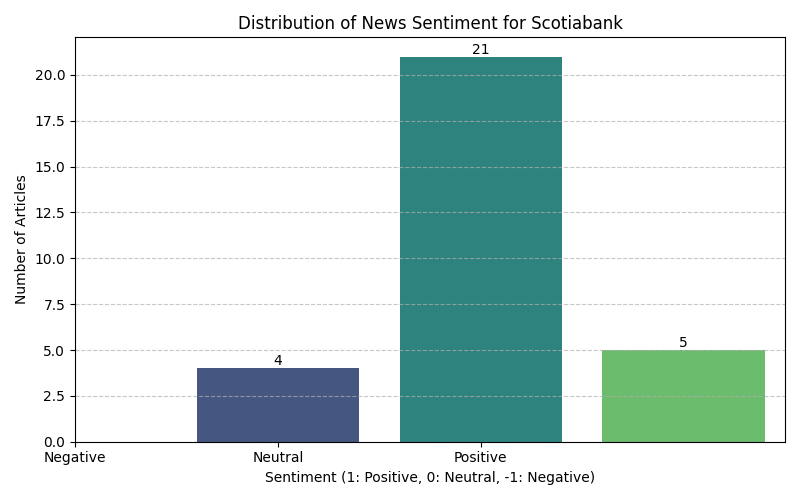
    


#**CIBC**


```python
cibc_ticker = Ticker("CM")
cibc_ticker.price()
```


<div>
<style scoped>
    .dataframe tbody tr th:only-of-type {
        vertical-align: middle;
    }

    .dataframe tbody tr th {
        vertical-align: top;
    }

    .dataframe thead th {
        text-align: right;
    }
</style>
<table border="1" class="dataframe">
  <thead>
    <tr style="text-align: right;">
      <th></th>
      <th>symbol</th>
      <th>report_date</th>
      <th>open</th>
      <th>close</th>
      <th>high</th>
      <th>low</th>
      <th>volume</th>
    </tr>
  </thead>
  <tbody>
    <tr>
      <th>0</th>
      <td>CM</td>
      <td>1997-11-13</td>
      <td>15.7500</td>
      <td>15.2500</td>
      <td>15.7812</td>
      <td>14.8750</td>
      <td>260000</td>
    </tr>
    <tr>
      <th>1</th>
      <td>CM</td>
      <td>1997-11-14</td>
      <td>15.3750</td>
      <td>15.3125</td>
      <td>15.4375</td>
      <td>15.1875</td>
      <td>45000</td>
    </tr>
    <tr>
      <th>2</th>
      <td>CM</td>
      <td>1997-11-17</td>
      <td>15.6250</td>
      <td>15.5938</td>
      <td>15.7500</td>
      <td>15.5000</td>
      <td>49400</td>
    </tr>
    <tr>
      <th>3</th>
      <td>CM</td>
      <td>1997-11-18</td>
      <td>15.6562</td>
      <td>15.5312</td>
      <td>15.6562</td>
      <td>15.5312</td>
      <td>10600</td>
    </tr>
    <tr>
      <th>4</th>
      <td>CM</td>
      <td>1997-11-19</td>
      <td>15.5000</td>
      <td>15.5938</td>
      <td>15.5938</td>
      <td>15.4688</td>
      <td>6000</td>
    </tr>
    <tr>
      <th>...</th>
      <td>...</td>
      <td>...</td>
      <td>...</td>
      <td>...</td>
      <td>...</td>
      <td>...</td>
      <td>...</td>
    </tr>
    <tr>
      <th>7173</th>
      <td>CM</td>
      <td>2026-05-22</td>
      <td>115.5900</td>
      <td>115.4900</td>
      <td>116.1200</td>
      <td>115.2100</td>
      <td>594000</td>
    </tr>
    <tr>
      <th>7174</th>
      <td>CM</td>
      <td>2026-05-26</td>
      <td>116.6500</td>
      <td>115.7800</td>
      <td>116.8900</td>
      <td>114.9900</td>
      <td>861200</td>
    </tr>
    <tr>
      <th>7175</th>
      <td>CM</td>
      <td>2026-05-27</td>
      <td>117.0500</td>
      <td>115.4300</td>
      <td>117.0500</td>
      <td>114.9800</td>
      <td>1022100</td>
    </tr>
    <tr>
      <th>7176</th>
      <td>CM</td>
      <td>2026-05-28</td>
      <td>115.8000</td>
      <td>109.5000</td>
      <td>115.8000</td>
      <td>109.0500</td>
      <td>2280300</td>
    </tr>
    <tr>
      <th>7177</th>
      <td>CM</td>
      <td>2026-05-29</td>
      <td>109.5100</td>
      <td>108.7400</td>
      <td>110.0050</td>
      <td>106.4900</td>
      <td>1653326</td>
    </tr>
  </tbody>
</table>
<p>7178 rows × 7 columns</p>
</div>


```python
statement5 = cibc_ticker.quarterly_income_statement()
print(statement5.print_pretty_table())
```

    |-----------------------------------------------------------------------------------------------+------------+------------+------------+------------+------------+------------+------------+------------+------------+------------+------------+------------+------------+------------+------------+------------+------------+------------|
    |                                           Breakdown                                           |    TTM     | 2026-04-30 | 2026-01-31 | 2025-10-31 | 2025-07-31 | 2025-04-30 | 2025-01-31 | 2024-10-31 | 2024-07-31 | 2024-04-30 | 2024-01-31 | 2023-10-31 | 2023-07-31 | 2023-04-30 | 2023-01-31 | 2022-10-31 | 2022-07-31 | 2022-04-30 |
    |-----------------------------------------------------------------------------------------------+------------+------------+------------+------------+------------+------------+------------+------------+------------+------------+------------+------------+------------+------------+------------+------------+------------+------------|
    | +Total Revenue                                                                                | 31,062,000 | 7,965,000  | 8,321,000  | 7,550,000  | 7,225,000  | 6,986,000  | 7,252,000  | 6,598,000  | 6,584,000  | 6,139,000  | 6,205,000  | 5,849,000  | 5,849,000  | *          | *          | *          | 5,554,000  | 5,358,000  |
    |  +Net Interest Income                                                                         | 16,833,000 | 4,345,000  | 4,308,000  | 4,132,000  | 4,048,000  | 3,788,000  | 3,801,000  | 3,633,000  | 3,532,000  | 3,281,000  | 3,249,000  | 3,197,000  | 3,236,000  | *          | *          | *          | 3,236,000  | 3,088,000  |
    |   +Interest Income                                                                            | 47,590,000 | 11,605,000 | 11,802,000 | 12,094,000 | 12,089,000 | 11,859,000 | 12,719,000 | 13,231,000 | 13,447,000 | 12,773,000 | 12,734,000 | 12,457,000 | 11,619,000 | *          | *          | *          | 5,800,000  | 4,246,000  |
    |    +Interest Income from Loans And Lease                                                      | 31,759,000 | 7,719,000  | 7,947,000  | 8,117,000  | 7,976,000  | 7,685,000  | 8,296,000  | 8,668,000  | 8,726,000  | 8,250,000  | 8,281,000  | 8,215,000  | 7,830,000  | *          | *          | *          | *          | *          |
    |     Interest Income from Loans                                                                | 31,759,000 | 7,719,000  | 7,947,000  | 8,117,000  | 7,976,000  | 7,685,000  | 8,296,000  | 8,668,000  | 8,726,000  | 8,250,000  | 8,281,000  | 8,215,000  | 7,830,000  | *          | *          | *          | *          | *          |
    |    Interest Income from Securities                                                            | 8,808,000  | 2,230,000  | 2,103,000  | 2,215,000  | 2,260,000  | 2,230,000  | 2,340,000  | 2,393,000  | 2,482,000  | 2,379,000  | 2,306,000  | 2,165,000  | 1,870,000  | *          | *          | *          | *          | *          |
    |    Interest Income from Deposits                                                              | 2,027,000  | 453,000    | 488,000    | 540,000    | 546,000    | 603,000    | 693,000    | 729,000    | 711,000    | 692,000    | *          | *          | *          | *          | *          | *          | *          | *          |
    |    Interest Income from Federal Funds Sold And Securities Purchase Under Agreements To Resell | 4,996,000  | 1,203,000  | 1,264,000  | 1,222,000  | 1,307,000  | 1,341,000  | 1,390,000  | 1,441,000  | 1,528,000  | 1,452,000  | 1,390,000  | 1,357,000  | 1,186,000  | *          | *          | *          | *          | *          |
    |   +Interest Expense                                                                           | 30,757,000 | 7,260,000  | 7,494,000  | 7,962,000  | 8,041,000  | 8,071,000  | 8,918,000  | 9,598,000  | 9,915,000  | 9,492,000  | 9,485,000  | 9,260,000  | 8,383,000  | *          | *          | *          | 2,564,000  | 1,158,000  |
    |    Interest Expense for Deposit                                                               | 23,000,000 | 5,337,000  | 5,569,000  | 6,004,000  | 6,090,000  | 6,110,000  | 6,906,000  | 7,476,000  | 7,713,000  | 7,576,000  | 7,711,000  | 7,569,000  | 6,966,000  | *          | *          | *          | *          | *          |
    |    Interest Expense for Long Term Debt And Capital Securities                                 | 374,000    | 87,000     | 88,000     | 93,000     | 106,000    | 101,000    | 107,000    | 120,000    | 134,000    | 136,000    | 120,000    | 120,000    | 117,000    | *          | *          | *          | *          | *          |
    |    Interest Expense for Federal Funds Sold And Securities Purchase Under Agreements To Resell | 6,415,000  | 1,559,000  | 1,613,000  | 1,624,000  | 1,619,000  | 1,608,000  | 1,670,000  | 1,719,000  | 1,769,000  | 1,492,000  | 1,354,000  | 1,299,000  | 1,107,000  | *          | *          | *          | *          | *          |
    |    Other Interest Expense                                                                     | 968,000    | 277,000    | 224,000    | 241,000    | 226,000    | 252,000    | 235,000    | 283,000    | 299,000    | 288,000    | 300,000    | 272,000    | 193,000    | *          | *          | *          | *          | *          |
    |  +Non Interest Income                                                                         | 14,229,000 | 3,620,000  | 4,013,000  | 3,418,000  | 3,177,000  | 3,198,000  | 3,451,000  | 2,965,000  | 3,052,000  | 2,858,000  | 2,956,000  | 2,652,000  | 2,613,000  | *          | *          | *          | *          | *          |
    |   Total Premiums Earned                                                                       | 319,000    | 82,000     | 85,000     | 81,000     | 71,000     | 81,000     | 84,000     | 85,000     | 87,000     | 87,000     | 97,000     | 82,000     | 86,000     | *          | *          | *          | *          | *          |
    |   +Fees And Commissions                                                                       | 7,540,000  | 1,879,000  | 1,975,000  | 1,891,000  | 1,795,000  | 1,715,000  | 1,826,000  | 1,692,000  | 1,718,000  | 1,700,000  | 1,687,000  | 1,654,000  | 1,644,000  | *          | *          | *          | *          | *          |
    |    +Fees & Commission Income                                                                  | 7,540,000  | 1,879,000  | 1,975,000  | 1,891,000  | 1,795,000  | 1,715,000  | 1,826,000  | 1,692,000  | 1,718,000  | 1,700,000  | 1,687,000  | 1,654,000  | 1,644,000  | *          | *          | *          | *          | *          |
    |     Service Charge on Depositor Accounts                                                      | 2,061,000  | 496,000    | 534,000    | 521,000    | 510,000    | 489,000    | 491,000    | 467,000    | 552,000    | 560,000    | 597,000    | 598,000    | 616,000    | *          | *          | *          | *          | *          |
    |     Trust Fees by Commissions                                                                 | 4,469,000  | 1,137,000  | 1,169,000  | 1,115,000  | 1,048,000  | 1,013,000  | 1,084,000  | 991,000    | 960,000    | 922,000    | 903,000    | 875,000    | 879,000    | *          | *          | *          | *          | *          |
    |     Securities Activities                                                                     | 615,000    | 163,000    | 160,000    | 160,000    | 132,000    | 125,000    | 137,000    | 129,000    | 109,000    | 106,000    | 87,000     | 81,000     | 82,000     | *          | *          | *          | *          | *          |
    |     Credit Card                                                                               | 395,000    | 83,000     | 112,000    | 95,000     | 105,000    | 88,000     | 114,000    | 105,000    | 97,000     | 112,000    | 100,000    | 100,000    | 67,000     | *          | *          | *          | *          | *          |
    |   Investment Banking Profit                                                                   | 1,106,000  | 273,000    | 297,000    | 245,000    | 291,000    | 198,000    | 181,000    | 182,000    | 165,000    | 191,000    | 169,000    | 137,000    | 143,000    | *          | *          | *          | *          | *          |
    |   Foreign Exchange Trading Gains                                                              | 381,000    | 82,000     | 114,000    | 86,000     | 99,000     | 87,000     | 97,000     | 93,000     | 99,000     | 102,000    | 92,000     | 74,000     | 82,000     | *          | *          | *          | *          | *          |
    |   +Gain Losson Saleof Assets                                                                  | 4,455,000  | 1,203,000  | 1,424,000  | 994,000    | 834,000    | 1,006,000  | 1,174,000  | 821,000    | 872,000    | 716,000    | 860,000    | 626,000    | 589,000    | *          | *          | *          | *          | *          |
    |    Gain on Sale of Security                                                                   | 4,455,000  | 1,203,000  | 1,424,000  | 994,000    | 834,000    | 1,006,000  | 1,174,000  | 821,000    | 872,000    | 716,000    | 860,000    | 626,000    | 589,000    | *          | *          | *          | 324,000    | 302,000    |
    |   Other Non Interest Income                                                                   | 428,000    | 101,000    | 118,000    | 121,000    | 87,000     | 111,000    | 89,000     | 92,000     | 111,000    | 62,000     | 51,000     | 79,000     | 69,000     | *          | *          | *          | *          | *          |
    | Credit Losses Provision                                                                       | -2,337,000 | -605,000   | -568,000   | -605,000   | -559,000   | -605,000   | -573,000   | -419,000   | -483,000   | -514,000   | -585,000   | -541,000   | -736,000   | *          | *          | *          | *          | *          |
    | +Non Interest Expense                                                                         | 16,683,000 | 4,199,000  | 4,328,000  | 4,179,000  | 3,976,000  | 3,818,000  | 3,878,000  | 3,794,000  | 3,680,000  | 3,488,000  | 3,374,000  | 3,440,000  | 3,307,000  | *          | *          | *          | *          | *          |
    |  +Occupancy And Equipment                                                                     | 3,922,000  | 973,000    | 946,000    | 1,067,000  | 936,000    | 893,000    | 897,000    | 931,000    | 919,000    | 861,000    | 838,000    | 874,000    | 812,000    | *          | *          | *          | *          | *          |
    |   Net Occupancy Expense                                                                       | 862,000    | 206,000    | 212,000    | 240,000    | 204,000    | 202,000    | 201,000    | 208,000    | 197,000    | 208,000    | 217,000    | 216,000    | 199,000    | *          | *          | *          | *          | *          |
    |   Equipment                                                                                   | 3,060,000  | 767,000    | 734,000    | 827,000    | 732,000    | 691,000    | 696,000    | 723,000    | 722,000    | 653,000    | 621,000    | 658,000    | 613,000    | *          | *          | *          | *          | *          |
    |  Professional Expense And Contract Services Expense                                           | 324,000    | 80,000     | 88,000     | 88,000     | 68,000     | 63,000     | 65,000     | 74,000     | 67,000     | 64,000     | 52,000     | 77,000     | 51,000     | *          | *          | *          | *          | *          |
    |  +Selling General and Administrative                                                          | 10,341,000 | 2,658,000  | 2,731,000  | 2,478,000  | 2,474,000  | 2,347,000  | 2,365,000  | 2,310,000  | 2,173,000  | 2,095,000  | 2,027,000  | 1,977,000  | 1,964,000  | *          | *          | *          | 1,857,000  | 1,826,000  |
    |   +General & Administrative Expense                                                           | 9,922,000  | 2,551,000  | 2,637,000  | 2,357,000  | 2,377,000  | 2,255,000  | 2,277,000  | 2,207,000  | 2,095,000  | 2,009,000  | 1,950,000  | 1,890,000  | 1,888,000  | *          | *          | *          | 1,767,000  | 1,746,000  |
    |    Salaries and Wages                                                                         | 9,922,000  | 2,551,000  | 2,637,000  | 2,357,000  | 2,377,000  | 2,255,000  | 2,277,000  | 2,207,000  | 2,095,000  | 2,009,000  | 1,950,000  | 1,890,000  | 1,888,000  | *          | *          | *          | 1,767,000  | 1,746,000  |
    |   Selling & Marketing Expense                                                                 | 419,000    | 107,000    | 94,000     | 121,000    | 97,000     | 92,000     | 88,000     | 103,000    | 78,000     | 86,000     | 77,000     | 87,000     | 76,000     | *          | *          | *          | 90,000     | 80,000     |
    |  Other Non Interest Expense                                                                   | 2,096,000  | 488,000    | 563,000    | 546,000    | 498,000    | 515,000    | 551,000    | 479,000    | 521,000    | 468,000    | 457,000    | 512,000    | 480,000    | *          | *          | *          | *          | *          |
    | Income from Associates & Other Participating Interests                                        | 171,000    | 39,000     | 77,000     | 26,000     | 29,000     | 36,000     | 26,000     | 18,000     | 20,000     | 25,000     | 16,000     | *          | *          | *          | *          | *          | *          | *          |
    | +Special Income Charges                                                                       | 1,000      | 2,000      | -1,000     | 0.0        | 0.0        | -1,000     | 3,000      | 4,000      | -2,000     | -13,000    | -91,000    | 0.0        | 0.0        | *          | *          | *          | -50,000    | -151,000   |
    |  Restructuring & Mergers Acquisition                                                          | *          | *          | *          | *          | *          | *          | *          | *          | *          | *          | *          | *          | *          | *          | *          | 12,000     | 50,000     | 106,000    |
    |  Other Special Charges                                                                        | -1,000     | -2,000     | 1,000      | 0.0        | *          | 1,000      | -3,000     | -4,000     | 2,000      | 13,000     | 91,000     | 0.0        | *          | -117,000   | 1,169,000  | *          | *          | 45,000     |
    | Pretax Income                                                                                 | 12,214,000 | 3,202,000  | 3,501,000  | 2,792,000  | 2,719,000  | 2,598,000  | 2,830,000  | 2,407,000  | 2,439,000  | 2,149,000  | 2,171,000  | 1,863,000  | 1,809,000  | *          | *          | *          | 2,145,000  | 1,959,000  |
    | Tax Provision                                                                                 | 2,373,000  | 737,000    | 401,000    | 612,000    | 623,000    | 591,000    | 659,000    | 525,000    | 644,000    | 400,000    | 443,000    | 380,000    | 377,000    | *          | *          | *          | 479,000    | 436,000    |
    | +Net Income Common Stockholders                                                               | 9,400,000  | 2,343,000  | 2,987,000  | 2,058,000  | 2,012,000  | 1,920,000  | 2,075,000  | 1,802,000  | 1,723,000  | 1,678,000  | 1,649,000  | 1,413,000  | 1,356,000  | *          | *          | *          | 1,614,000  | 1,471,000  |
    |  +Net Income(Attributable to Parent Company Shareholders)                                     | 9,818,000  | 2,457,000  | 3,093,000  | 2,174,000  | 2,094,000  | 1,998,000  | 2,163,000  | 1,874,000  | 1,786,000  | 1,739,000  | 1,716,000  | 1,475,000  | 1,422,000  | *          | *          | *          | 1,660,000  | 1,518,000  |
    |   +Net Income Including Non-Controlling Interests                                             | 9,841,000  | 2,465,000  | 3,100,000  | 2,180,000  | 2,096,000  | 2,007,000  | 2,171,000  | 1,882,000  | 1,795,000  | 1,749,000  | 1,728,000  | 1,483,000  | 1,432,000  | *          | *          | *          | 1,666,000  | 1,523,000  |
    |    Net Income Continuous Operations                                                           | 9,841,000  | 2,465,000  | 3,100,000  | 2,180,000  | 2,096,000  | 2,007,000  | 2,171,000  | 1,882,000  | 1,795,000  | 1,749,000  | 1,728,000  | 1,483,000  | 1,432,000  | *          | *          | *          | 1,666,000  | 1,523,000  |
    |   Minority Interests                                                                          | -23,000    | -8,000     | -7,000     | -6,000     | -2,000     | -9,000     | -8,000     | -8,000     | -9,000     | -10,000    | -12,000    | -8,000     | -10,000    | *          | *          | *          | -6,000     | -5,000     |
    |  Preferred Stock Dividends                                                                    | 418,000    | 114,000    | 106,000    | 116,000    | 82,000     | 78,000     | 88,000     | 72,000     | 63,000     | 61,000     | 67,000     | 62,000     | 66,000     | *          | *          | *          | 46,000     | 47,000     |
    | Diluted NI Available to Com Stockholders                                                      | 9,400,000  | 2,343,000  | 2,987,000  | 2,058,000  | 2,012,000  | 1,920,000  | 2,075,000  | 1,802,000  | 1,723,000  | 1,678,000  | 1,649,000  | 1,413,000  | 1,356,000  | *          | *          | *          | 1,614,000  | 1,471,000  |
    | Basic EPS                                                                                     | 10.16      | 2.55       | 3.23       | *          | 2.16       | 2.05       | 2.2        | *          | 1.83       | 1.79       | 1.77       | *          | 1.48       | 1.77       | 0.39       | *          | 1.79       | 1.63       |
    | Diluted EPS                                                                                   | 10.08      | 2.53       | 3.21       | *          | 2.15       | 2.04       | 2.19       | *          | 1.82       | 1.79       | 1.77       | *          | 1.47       | 1.76       | 0.39       | *          | 1.78       | 1.62       |
    | Basic Average Shares                                                                          | 925,771    | 917,401    | 924,661    | *          | 932,258    | 938,495    | 942,039    | *          | 943,467    | 937,849    | 931,775    | *          | 918,551    | 912,297    | 906,770    | *          | 903,742    | 902,489    |
    | Diluted Average Shares                                                                        | 932,080    | 924,297    | 931,401    | *          | 937,518    | 942,748    | 947,345    | *          | 945,784    | 939,813    | 932,330    | *          | 919,063    | 913,219    | 907,725    | *          | 905,618    | 905,739    |
    | Interest Income after Provision for Loan Loss                                                 | 14,496,000 | 3,740,000  | 3,740,000  | 3,527,000  | 3,489,000  | 3,183,000  | 3,228,000  | 3,214,000  | 3,049,000  | 2,767,000  | 2,664,000  | 2,656,000  | 2,500,000  | *          | *          | *          | *          | *          |
    | Net Income from Continuing & Discontinued Operation                                           | 9,818,000  | 2,457,000  | 3,093,000  | 2,174,000  | 2,094,000  | 1,998,000  | 2,163,000  | 1,874,000  | 1,786,000  | 1,739,000  | 1,716,000  | 1,475,000  | 1,422,000  | *          | *          | *          | 1,660,000  | 1,518,000  |
    | Normalized Income                                                                             | 9,817,194  | 2,455,460  | 3,093,886  | 2,174,000  | 2,094,000  | 1,998,772  | 2,160,699  | 1,870,872  | 1,787,546  | 1,749,580  | 1,788,436  | 1,475,000  | 1,422,000  | *          | *          | *          | 1,698,850  | 1,635,327  |
    | Total Money Market Investments                                                                | 7,023,000  | 1,656,000  | 1,752,000  | 1,762,000  | 1,853,000  | 1,944,000  | 2,083,000  | 2,170,000  | 2,239,000  | 2,144,000  | 2,147,000  | 2,077,000  | 1,919,000  | *          | *          | *          | *          | *          |
    | Reconciled Depreciation                                                                       | 1,214,000  | 302,000    | 301,000    | 324,000    | 287,000    | 281,000    | 286,000    | 289,000    | 317,000    | 288,000    | 276,000    | 310,000    | 274,000    | *          | *          | *          | 260,000    | 256,000    |
    | Net Income from Continuing Operation Net Minority Interest                                    | 9,818,000  | 2,457,000  | 3,093,000  | 2,174,000  | 2,094,000  | 1,998,000  | 2,163,000  | 1,874,000  | 1,786,000  | 1,739,000  | 1,716,000  | 1,475,000  | 1,422,000  | *          | *          | *          | 1,660,000  | 1,518,000  |
    | Total Unusual Items Excluding Goodwill                                                        | 1,000      | 2,000      | -1,000     | 0.0        | 0.0        | -1,000     | 3,000      | 4,000      | -2,000     | -13,000    | -91,000    | 0.0        | 0.0        | *          | *          | *          | -50,000    | -151,000   |
    | Total Unusual Items                                                                           | 1,000      | 2,000      | -1,000     | 0.0        | 0.0        | -1,000     | 3,000      | 4,000      | -2,000     | -13,000    | -91,000    | 0.0        | 0.0        | *          | *          | *          | -50,000    | -151,000   |
    | Tax Rate for Calcs                                                                            | 0.19       | 0.23       | 0.11       | 0.22       | 0.23       | 0.23       | 0.23       | 0.22       | 0.23       | 0.19       | 0.2        | 0.2        | 0.21       | *          | *          | *          | 0.22       | 0.22       |
    | Tax Effect of Unusual Items                                                                   | 194        | 460        | -114       | 0.0        | 0.0        | -227       | 699        | 872        | -454       | -2,419     | -18,564    | 0.0        | 0.0        | *          | *          | *          | -11,150    | -33,673    |
    | Operating Revenue                                                                             | 31,062,000 | 7,965,000  | 8,321,000  | 7,550,000  | 7,225,000  | 6,986,000  | 7,252,000  | 6,598,000  | 6,584,000  | 6,139,000  | 6,205,000  | 5,849,000  | 5,849,000  | *          | *          | *          | 5,554,000  | 5,358,000  |
    |-----------------------------------------------------------------------------------------------+------------+------------+------------+------------+------------+------------+------------+------------+------------+------------+------------+------------+------------+------------+------------+------------+------------+------------|
    None
    


```python
transcripts5 = cibc_ticker.earning_call_transcripts()
transcripts5.get_transcripts_list()
```


<div>
<style scoped>
    .dataframe tbody tr th:only-of-type {
        vertical-align: middle;
    }

    .dataframe tbody tr th {
        vertical-align: top;
    }

    .dataframe thead th {
        text-align: right;
    }
</style>
<table border="1" class="dataframe">
  <thead>
    <tr style="text-align: right;">
      <th></th>
      <th>symbol</th>
      <th>fiscal_year</th>
      <th>fiscal_quarter</th>
      <th>report_date</th>
    </tr>
  </thead>
  <tbody>
    <tr>
      <th>0</th>
      <td>CM</td>
      <td>2007</td>
      <td>4</td>
      <td>2007-12-09</td>
    </tr>
    <tr>
      <th>1</th>
      <td>CM</td>
      <td>2008</td>
      <td>3</td>
      <td>2008-08-27</td>
    </tr>
    <tr>
      <th>2</th>
      <td>CM</td>
      <td>2009</td>
      <td>3</td>
      <td>2009-08-26</td>
    </tr>
    <tr>
      <th>3</th>
      <td>CM</td>
      <td>2012</td>
      <td>1</td>
      <td>2012-03-08</td>
    </tr>
    <tr>
      <th>4</th>
      <td>CM</td>
      <td>2012</td>
      <td>2</td>
      <td>2012-05-31</td>
    </tr>
    <tr>
      <th>...</th>
      <td>...</td>
      <td>...</td>
      <td>...</td>
      <td>...</td>
    </tr>
    <tr>
      <th>56</th>
      <td>CM</td>
      <td>2025</td>
      <td>2</td>
      <td>2025-05-29</td>
    </tr>
    <tr>
      <th>57</th>
      <td>CM</td>
      <td>2025</td>
      <td>3</td>
      <td>2025-08-28</td>
    </tr>
    <tr>
      <th>58</th>
      <td>CM</td>
      <td>2025</td>
      <td>4</td>
      <td>2025-12-04</td>
    </tr>
    <tr>
      <th>59</th>
      <td>CM</td>
      <td>2026</td>
      <td>1</td>
      <td>2026-02-26</td>
    </tr>
    <tr>
      <th>60</th>
      <td>CM</td>
      <td>2026</td>
      <td>2</td>
      <td>2026-05-28</td>
    </tr>
  </tbody>
</table>
<p>61 rows × 4 columns</p>
</div>


```python
transcripts5 = cibc_ticker.earning_call_transcripts()
transcripts5.get_transcript(2025, 4)
```


<div>
<style scoped>
    .dataframe tbody tr th:only-of-type {
        vertical-align: middle;
    }

    .dataframe tbody tr th {
        vertical-align: top;
    }

    .dataframe thead th {
        text-align: right;
    }
</style>
<table border="1" class="dataframe">
  <thead>
    <tr style="text-align: right;">
      <th></th>
      <th>paragraph_number</th>
      <th>speaker</th>
      <th>content</th>
    </tr>
  </thead>
  <tbody>
    <tr>
      <th>0</th>
      <td>1</td>
      <td>Operator</td>
      <td>Good morning. Welcome to the CIBC Q4 Quarterly...</td>
    </tr>
    <tr>
      <th>1</th>
      <td>2</td>
      <td>Geoffrey Weiss</td>
      <td>Thank you, and good morning. We will begin thi...</td>
    </tr>
    <tr>
      <th>2</th>
      <td>3</td>
      <td>Harry Culham</td>
      <td>Thank you, Geoff, and good morning, everyone. ...</td>
    </tr>
    <tr>
      <th>3</th>
      <td>4</td>
      <td>Robert Sedran</td>
      <td>Thank you, Harry, and good morning, everyone. ...</td>
    </tr>
    <tr>
      <th>4</th>
      <td>5</td>
      <td>Frank Guse</td>
      <td>Thank you, Rob, and good morning, everyone. De...</td>
    </tr>
    <tr>
      <th>5</th>
      <td>6</td>
      <td>Operator</td>
      <td>[Operator Instructions] Our first question com...</td>
    </tr>
    <tr>
      <th>6</th>
      <td>7</td>
      <td>Ebrahim Poonawala</td>
      <td>I guess Rob's prepared remarks set this up, bu...</td>
    </tr>
    <tr>
      <th>7</th>
      <td>8</td>
      <td>Harry Culham</td>
      <td>Thank you, Ebrahim, I'll take it first, and I'...</td>
    </tr>
    <tr>
      <th>8</th>
      <td>9</td>
      <td>Robert Sedran</td>
      <td>Yes. Thanks, Harry. I mean, Ebrahim, we can al...</td>
    </tr>
    <tr>
      <th>9</th>
      <td>10</td>
      <td>Operator</td>
      <td>Our next question comes from the line of Matth...</td>
    </tr>
    <tr>
      <th>10</th>
      <td>11</td>
      <td>Matthew Lee</td>
      <td>NIM continues to be a big story for you. I kno...</td>
    </tr>
    <tr>
      <th>11</th>
      <td>12</td>
      <td>Robert Sedran</td>
      <td>Matthew, it's Rob. I'm going to get started an...</td>
    </tr>
    <tr>
      <th>12</th>
      <td>13</td>
      <td>Hratch Panossian</td>
      <td>Yes. Thanks, Rob. Matthew, thanks for the ques...</td>
    </tr>
    <tr>
      <th>13</th>
      <td>14</td>
      <td>Operator</td>
      <td>Our next question comes from John Aiken from J...</td>
    </tr>
    <tr>
      <th>14</th>
      <td>15</td>
      <td>John Aiken</td>
      <td>Rob, we just drilled down NIM. I'd like to tak...</td>
    </tr>
    <tr>
      <th>15</th>
      <td>16</td>
      <td>Robert Sedran</td>
      <td>John, it's Rob. So good question. And we tend ...</td>
    </tr>
    <tr>
      <th>16</th>
      <td>17</td>
      <td>John Aiken</td>
      <td>And just as a follow-on, when we look at techn...</td>
    </tr>
    <tr>
      <th>17</th>
      <td>18</td>
      <td>Robert Sedran</td>
      <td>No, I think we need to assume that technology ...</td>
    </tr>
    <tr>
      <th>18</th>
      <td>19</td>
      <td>Operator</td>
      <td>Our next question comes from Doug Young from D...</td>
    </tr>
    <tr>
      <th>19</th>
      <td>20</td>
      <td>Doug Young</td>
      <td>Just a few things on capital, Rob. First, you ...</td>
    </tr>
    <tr>
      <th>20</th>
      <td>21</td>
      <td>Robert Sedran</td>
      <td>Okay. Thanks, Doug. It's Rob. So it was 25 bas...</td>
    </tr>
    <tr>
      <th>21</th>
      <td>22</td>
      <td>Operator</td>
      <td>Our next question comes from Mario Mendonca fr...</td>
    </tr>
    <tr>
      <th>22</th>
      <td>23</td>
      <td>Mario Mendonca</td>
      <td>I think Rob and Harry, when you were referring...</td>
    </tr>
    <tr>
      <th>23</th>
      <td>24</td>
      <td>Robert Sedran</td>
      <td>Maybe I'll start -- it's Rob. Maybe I'll start...</td>
    </tr>
    <tr>
      <th>24</th>
      <td>25</td>
      <td>Kevin Lee</td>
      <td>Right. Thanks, Rob, and Mario, thanks for the ...</td>
    </tr>
    <tr>
      <th>25</th>
      <td>26</td>
      <td>Mario Mendonca</td>
      <td>Okay. That's helpful. Let's drill down somethi...</td>
    </tr>
    <tr>
      <th>26</th>
      <td>27</td>
      <td>Christian Exshaw</td>
      <td>Thanks for the question, Mario. This is Christ...</td>
    </tr>
    <tr>
      <th>27</th>
      <td>28</td>
      <td>Mario Mendonca</td>
      <td>So would I be correct in suggesting that the g...</td>
    </tr>
    <tr>
      <th>28</th>
      <td>29</td>
      <td>Christian Exshaw</td>
      <td>Yes, that's correct.</td>
    </tr>
    <tr>
      <th>29</th>
      <td>30</td>
      <td>Operator</td>
      <td>Our next question comes from the line of Sohra...</td>
    </tr>
    <tr>
      <th>30</th>
      <td>31</td>
      <td>Sohrab Movahedi</td>
      <td>Rob, just looking at your Slide 13, you've giv...</td>
    </tr>
    <tr>
      <th>31</th>
      <td>32</td>
      <td>Robert Sedran</td>
      <td>Sohrab, it's Rob. Thanks. It's a good question...</td>
    </tr>
    <tr>
      <th>32</th>
      <td>33</td>
      <td>Operator</td>
      <td>Our next question comes from Gabriel Dechaine ...</td>
    </tr>
    <tr>
      <th>33</th>
      <td>34</td>
      <td>Gabriel Dechaine</td>
      <td>First for Frank. Your outlook for impaired pro...</td>
    </tr>
    <tr>
      <th>34</th>
      <td>35</td>
      <td>Frank Guse</td>
      <td>Thanks For the question. So as I said, enterin...</td>
    </tr>
    <tr>
      <th>35</th>
      <td>36</td>
      <td>Gabriel Dechaine</td>
      <td>Probably not -- you wouldn't get the back half...</td>
    </tr>
    <tr>
      <th>36</th>
      <td>37</td>
      <td>Frank Guse</td>
      <td>I think that's a fair assumption, yes.</td>
    </tr>
    <tr>
      <th>37</th>
      <td>38</td>
      <td>Harry Culham</td>
      <td>And Gabriel, it's Harry here. Thank you for th...</td>
    </tr>
    <tr>
      <th>38</th>
      <td>39</td>
      <td>Operator</td>
      <td>And our last question comes from Darko Mihelic...</td>
    </tr>
    <tr>
      <th>39</th>
      <td>40</td>
      <td>Darko Mihelic</td>
      <td>Just wanted to follow on the question that Mar...</td>
    </tr>
    <tr>
      <th>40</th>
      <td>41</td>
      <td>Harry Culham</td>
      <td>It's Harry, Darko. I'm just going to jump in q...</td>
    </tr>
    <tr>
      <th>41</th>
      <td>42</td>
      <td>Christian Exshaw</td>
      <td>I think, Harry, you're right. Thank you for th...</td>
    </tr>
    <tr>
      <th>42</th>
      <td>43</td>
      <td>Operator</td>
      <td>I will now turn the call back over to Harry fo...</td>
    </tr>
    <tr>
      <th>43</th>
      <td>44</td>
      <td>Harry Culham</td>
      <td>Great. Thank you, operator, and thank you all ...</td>
    </tr>
    <tr>
      <th>44</th>
      <td>45</td>
      <td>Operator</td>
      <td>This concludes today's conference call. You ma...</td>
    </tr>
  </tbody>
</table>
</div>


```python
news_object5 = cibc_ticker.news()
print(news_object5)
```

                                         uuid                                                                                                                                                                                         title                     publisher report_date   type                                                                                                                             link
    0    f919469d-9bcf-366c-90a1-fa1e345ad0ef                                                                                                                                             Junkiest Junk Is Offering a Warning Sign for Debt                     Bloomberg  2025-05-25  STORY                                                https://finance.yahoo.com/news/junkiest-junk-offering-warning-sign-190000986.html
    1    a19f6e0a-3d2a-3689-be39-9551ef0d74b1                                                                                                                       CIBC Up 0.85% In US Premarket On Q2 Adjusted Earnings and Revenues Beat                  MT Newswires  2025-05-29  STORY                                                             https://finance.yahoo.com/news/cibc-0-85-us-premarket-102433706.html
    2    806c0999-0319-3183-b5e2-69f333f8597a                                                                                                                  Canadian Imperial Bank of Commerce Fiscal Q2 Adjusted Earnings, Revenue Rise                  MT Newswires  2025-05-29  STORY                                             https://finance.yahoo.com/news/canadian-imperial-bank-commerce-fiscal-094358931.html
    3    b2c1bbcc-abff-33b0-93ee-690f35e6e356                                                                                                                                   Canadian Imperial Bank (CM) Surpasses Q2 Earnings Estimates                         Zacks  2025-05-29  STORY                                                https://finance.yahoo.com/news/canadian-imperial-bank-cm-surpasses-110502153.html
    4    6ad375e2-58fb-3999-a10d-1e346206b114                                                                                                                      Morning Movers: Stocks jump as court blocks tariffs, Nvidia strong again                      TipRanks  2025-05-30  STORY                                                   https://finance.yahoo.com/news/morning-movers-stocks-jump-court-130545872.html
    5    b53fce7c-a798-34ad-a5fb-75481d293ef5                                                                                                Canadian Imperial Bank of Commerce (CM) Q2 2025 Earnings Call Highlights: Strong Financial ...                 GuruFocus.com  2025-05-30  STORY                                                 https://finance.yahoo.com/news/canadian-imperial-bank-commerce-cm-070310800.html
    6    3a1c0356-bff2-3d78-84dd-8c97c1c5f7a0                                                                                                           Canadian Imperial Bank of Commerce Second Quarter 2025 Earnings: Beats Expectations               Simply Wall St.  2025-05-30  STORY                                             https://finance.yahoo.com/news/canadian-imperial-bank-commerce-second-110923031.html
    7    0dc937f2-2465-3a35-b60e-44b5a1e99660                                                                                      CIBC donates $150,000 to support communities impacted by wildfires in Alberta, Manitoba and Saskatchewan                     CNW Group  2025-05-31  STORY                                                       https://finance.yahoo.com/news/cibc-donates-150-000-support-194400191.html
    8    cf234d02-ed58-367e-b3ab-191026e6c529                                                                                                                        Canadian Imperial's Q2 Earnings Rise on Higher Revenues, Provisions Up                         Zacks  2025-06-02  STORY                                                https://finance.yahoo.com/news/canadian-imperials-q2-earnings-rise-131500545.html
    9    6a37804c-2033-335e-a78e-a42abe4d8261                                                                                                                                             Are You Looking for a High-Growth Dividend Stock?                         Zacks  2025-06-04  STORY                                                 https://finance.yahoo.com/news/looking-high-growth-dividend-stock-154510862.html
    10   1b5713a4-27a8-35d6-bcbb-04c6050ff117                                                                                                                     CIBC expands support for skilled trades with new business banking program                     CNW Group  2025-06-04  STORY                                                https://finance.yahoo.com/news/cibc-expands-support-skilled-trades-110000902.html
    11   7d8c79ca-865f-3a0b-be3f-bc92c15f0309                                                                                                    CIBC Online and Mobile Banking ranked #1 by J.D. Power for customer satisfaction in Canada                     CNW Group  2025-06-05  STORY                                                  https://finance.yahoo.com/news/cibc-online-mobile-banking-ranked-110000643.html
    12   0ab2696f-a160-332a-a58f-33998938785d                                                                                                                                           CIBC Innovation Banking Provides Funding to CyberQP                 Business Wire  2025-06-05  STORY                                           https://finance.yahoo.com/news/cibc-innovation-banking-provides-funding-110000928.html
    13   53083c23-433a-38a0-b287-fe63baa27453                                                                                                                                   Oil Falls as Saudi Arabia Seeks More Major Production Hikes                     Bloomberg  2025-06-05  STORY                                                           https://finance.yahoo.com/news/oil-holds-gains-focus-us-232622210.html
    14   316a4f57-171f-341b-9f5d-953146a3500e                                                                                                                                CIBC to Redeem All $1 Billion of its 2.01% Debentures due 2030                  MT Newswires  2025-06-06  STORY                                                            https://finance.yahoo.com/news/cibc-redeem-1-billion-2-144017055.html
    15   270df29e-205e-3a31-be48-a80392054321                                                                                                                                      CIBC to Redeem 2.01% Debentures due July 21, 2030 (NVCC)                     CNW Group  2025-06-06  STORY                                                        https://finance.yahoo.com/news/cibc-redeem-2-01-debentures-120000467.html
    16   e5aedc64-671b-3093-9bcb-901501b68eb6                                                                                                                                                      CIBC's Week Ahead Market Call For Canada                  MT Newswires  2025-06-07  STORY                                                        https://finance.yahoo.com/news/cibc-apos-week-ahead-market-181024843.html
    17   1c563b55-fff8-3ec2-aa4c-6d55a270bbb5                                                                                                                  Canadian Imperial Bank of Commerce (TSX:CM) To Redeem C$1 Billion Debentures               Simply Wall St.  2025-06-07  STORY                                                https://finance.yahoo.com/news/canadian-imperial-bank-commerce-tsx-172441965.html
    18   16e443b0-85e2-35bb-b7b3-e4ff53ebf145                                                                                                                               Oil Rises as Solid US Jobs Data Pushes Algos to Drop Short Bets                     Bloomberg  2025-06-07  STORY                                                           https://finance.yahoo.com/news/oil-holds-gains-trump-xi-015011115.html
    19   8c9d479f-0a7d-3b17-9289-7595d332bcdd                                                                                                                                 Oil Edges Up as Traders Await Outcome of US-China Trade Talks                     Bloomberg  2025-06-09  STORY                                                       https://finance.yahoo.com/news/oil-holds-ground-ahead-fresh-091145652.html
    20   8c38c1a0-df56-3186-b7b6-3f73bac8360f                                                                                                            CIBC's AI-powered voice assistant recognized with an award from The Digital Banker                     CNW Group  2025-06-09  STORY                                                   https://finance.yahoo.com/news/cibcs-ai-powered-voice-assistant-110000953.html
    21   f9b9e26a-7be2-302d-9928-ca8b569f2e85                                                                                                                     Canadian Imperial Bank (CM) Is Up 1.31% in One Week: What You Should Know                         Zacks  2025-06-10  STORY                                                        https://finance.yahoo.com/news/canadian-imperial-bank-cm-1-160008972.html
    22   6e10c89b-dedc-3137-b1f7-0cd59fa300a7                                                                                                Frugal Fun in the Sun: CIBC poll finds Canadians prioritizing saving over spending this summer                     CNW Group  2025-06-10  STORY                                                           https://finance.yahoo.com/news/frugal-fun-sun-cibc-poll-110000008.html
    23   298dfc88-8683-3ea7-95d0-39bc29da1ccf                                                                                                                                   Oil Surges as US Orders Partial Evacuation of Iraqi Embassy                     Bloomberg  2025-06-12  STORY                                                      https://finance.yahoo.com/news/oil-rallies-trump-doubts-iran-125549499.html
    24   4637aa13-626d-3af3-9c3a-df624be5df50                                                                                                                                   Tariff-Hit Factory, Wholesale Sales in Canada Fell in April                     Bloomberg  2025-06-13  STORY                                                 https://finance.yahoo.com/news/tariff-hit-factory-wholesale-sales-130737200.html
    25   49fe5de5-815c-3beb-82b0-32e81d11cfc7                                                                                                                                                      CIBC's Week Ahead Market Call For Canada                  MT Newswires  2025-06-14  STORY                                                        https://finance.yahoo.com/news/cibc-apos-week-ahead-market-182103225.html
    26   da0edcd8-38d4-3229-8ff9-acbe4dc45d24                                                                                                             CIBC Innovation Banking Provides Growth Capital Financing to Work Truck Solutions                 Business Wire  2025-06-17  STORY                                            https://finance.yahoo.com/news/cibc-innovation-banking-provides-growth-110000569.html
    27   5950c2a1-cc2e-3529-9325-116118f2ebbf                                                                                                                                Oil Drops on Signs Conflict May Spare Iranian Crude Production                     Bloomberg  2025-06-17  STORY                                                       https://finance.yahoo.com/news/oil-extends-gain-israel-iran-040151257.html
    28   5f8b3098-ff9f-3c0c-a4a3-7cd1132d77b4                                                                                                                                CIBC Asks If More Borrowing Is Required for Canada's Provinces                  MT Newswires  2025-06-17  STORY                                                  https://finance.yahoo.com/news/cibc-asks-more-borrowing-required-132540915.html
    29   a3a505e5-9a0e-3026-869c-79722e93408f                                                                                                         CIBC Innovation Banking Provides Growth Financing to Carefull to Accelerate Expansion                 Business Wire  2025-06-18  STORY                                            https://finance.yahoo.com/news/cibc-innovation-banking-provides-growth-110000911.html
    30   2fabf421-c982-3bec-b3e4-3af8f0c02a32                                                                                                                                      NICE or VRRM: Which Is the Better Value Stock Right Now?                         Zacks  2025-06-19  STORY                                                       https://finance.yahoo.com/news/nice-vrrm-better-value-stock-154002029.html
    31   4a035c48-d718-3df0-92b2-10803c28395c                                                                                                                                       SHG vs. CM: Which Stock Should Value Investors Buy Now?                         Zacks  2025-06-19  STORY                                                              https://finance.yahoo.com/news/shg-vs-cm-stock-value-154001967.html
    32   2f5171de-d281-3e90-8d43-8228b8da2faf                                                                                                                                  Oil Edges Up in Turbulent Trade Amid Fears of War Escalation                     Bloomberg  2025-06-19  STORY                                                      https://finance.yahoo.com/news/oil-extends-gains-trump-spurs-235758584.html
    33   715583a4-231a-3570-9257-2772854fef32                                                                                                                                           Canadian Imperial Bank (CM) Could Be a Great Choice                         Zacks  2025-06-20  STORY                                                    https://finance.yahoo.com/news/canadian-imperial-bank-cm-could-154512313.html
    34   fb1d793e-8edb-330c-bd39-45dc0b8c0f1f                                                                                                            CIBC to redeem Non-cumulative Rate Reset Class A Preferred Shares Series 43 (NVCC)                     CNW Group  2025-06-24  STORY                                                    https://finance.yahoo.com/news/cibc-redeem-non-cumulative-rate-120000654.html
    35   99995fea-a6d3-3c7c-85ec-7da986c9ca29                                                                                                                               Oil Plunges as Iran Response to US Strikes Spares Energy Assets                     Bloomberg  2025-06-24  STORY                                                    https://finance.yahoo.com/news/oil-spike-unwinds-traders-await-054410333.html
    36   2d0b4580-5c36-3c47-b304-368504d56118                                                                                                                     CIBC Asset Management announces CIBC ETF cash distributions for June 2025                     CNW Group  2025-06-25  STORY                                               https://finance.yahoo.com/news/cibc-asset-management-announces-cibc-160000493.html
    37   aa5fd3d9-db5d-35f1-8e91-27c3d369d852                                                                                                                                Oil Drops as Trump Cheers Slide with Iran-Israel Truce Back On                     Bloomberg  2025-06-25  STORY                                                    https://finance.yahoo.com/news/oil-wavers-plunge-trump-mideast-090231742.html
    38   b2b3f8ff-4283-3642-9894-ad61b86c986e                                                                                                    TSX Dividend Stocks Including Canadian Imperial Bank of Commerce Lead Income Opportunities               Simply Wall St.  2025-06-26  STORY                                             https://finance.yahoo.com/news/tsx-dividend-stocks-including-canadian-123145160.html
    39   8f1ed7aa-4806-36fc-b01e-f8d9a9b6f4a9                                                                                           Canadian Imperial Bank of Commerce (TSX:CM) Announces $25 Redemption for Series 43 Preferred Shares               Simply Wall St.  2025-06-26  STORY                                                https://finance.yahoo.com/news/canadian-imperial-bank-commerce-tsx-175243194.html
    40   052c6f04-0bc4-33d2-9bc5-2aa8282ea79e                                                                                                                                Oil Gains as US Stockpiles Drop, Trump Sticks to Iran Pressure                     Bloomberg  2025-06-26  STORY                                                           https://finance.yahoo.com/news/oil-ticks-higher-two-day-052212355.html
    41   3770d5fe-e405-3dbb-a5d8-aee32ac64fad                                                                                                                           Why Canadian Imperial Bank (CM) is a Great Dividend Stock Right Now                         Zacks  2025-07-07  STORY                                                      https://finance.yahoo.com/news/why-canadian-imperial-bank-cm-154502972.html
    42   f6a49217-7d74-363a-a0dd-9725547c6b17                                                                                           CIBC Asset Management now offers CIBC Education Portfolios: A simple solution for education savings                     CNW Group  2025-07-07  STORY                                                   https://finance.yahoo.com/news/cibc-asset-management-now-offers-120000683.html
    43   588f6ed7-b0e4-3b75-bd57-b446a8fd9269                                                                                                                                      3 Top Dividend Stocks to Maximize Your Retirement Income                         Zacks  2025-07-08  STORY                                                     https://finance.yahoo.com/news/3-top-dividend-stocks-maximize-131002368.html
    44   0293dd8e-8c7c-396f-96bb-51823c9be0da                                                                                                                                            WF vs. CM: Which Stock Is the Better Value Option?                         Zacks  2025-07-09  STORY                                                              https://finance.yahoo.com/news/wf-vs-cm-stock-better-154001324.html
    45   c4f292f8-e0c1-3bbc-970b-1020c8cc72eb                                                                                                                               Oil Gains as Red Sea Attacks Spur Push Past Key Technical Level                     Bloomberg  2025-07-09  STORY                                                          https://finance.yahoo.com/news/oil-dips-traders-stock-us-044603810.html
    46   70f41835-d480-3d24-beb7-c860062a86cc                                                                                                                                  CIBC to Issue 7.000% NVCC AT1 Limited Recourse Capital Notes                     CNW Group  2025-07-10  STORY                                                              https://finance.yahoo.com/news/cibc-issue-7-000-nvcc-164200055.html
    47   2886386e-686a-3be0-96a6-898c49459ce2                                                                                                                               Oil Steadies as Traders Weigh Bearish US Data Against Sanctions                     Bloomberg  2025-07-10  STORY                                                https://finance.yahoo.com/news/oil-steadies-industry-report-points-045524803.html
    48   47e38c90-b742-3dc9-91e0-f33436e09ae8                                                                                                                                Oil Rises on Speculation Trump Plans to Sanction Russian Crude                     Bloomberg  2025-07-12  STORY                                                   https://finance.yahoo.com/news/oil-steadies-traders-weigh-trump-040122541.html
    49   5bcaabb0-5b49-303f-a08b-3cb68b9fe996                                                                                                                      What Makes Canadian Imperial Bank (CM) a Strong Momentum Stock: Buy Now?                         Zacks  2025-07-12  STORY                                                    https://finance.yahoo.com/news/makes-canadian-imperial-bank-cm-160003663.html
    50   19554464-140d-3949-9ada-a52c743291c7                                                                                                                                      3 Top Dividend Stocks to Maximize Your Retirement Income                         Zacks  2025-07-14  STORY                                                     https://finance.yahoo.com/news/3-top-dividend-stocks-maximize-131002977.html
    51   a3ffb3f5-96c5-33fa-aa67-31d5232e3c4b                                                                                                                                  Oil Falls on Doubts Trump’s Russia Plan Will Reduce Supplies                     Bloomberg  2025-07-16  STORY                                                   https://finance.yahoo.com/news/oil-holds-decline-traders-assess-232807420.html
    52   6bb953d7-eabe-370a-acd5-6ffa66a711cf                                                                                                                                   Harvard Bonds Draw Buyers as Clash With Trump Fuels Selloff                     Bloomberg  2025-07-18  STORY                                                    https://finance.yahoo.com/news/harvard-bonds-draw-buyers-clash-160021594.html
    53   3e0a2a9e-cbdb-3890-9dd7-15912b602266                                                                                                                              Oil Trades Steady as Market Parses Impact on Russia Energy Curbs                     Bloomberg  2025-07-19  STORY                                                       https://finance.yahoo.com/news/oil-holds-gain-traders-weigh-233116168.html
    54   3e340664-4f17-3ca8-8924-9dce0881c18b                                                                                                                   3 Top-Ranked Dividend Stocks: A Smarter Way to Boost Your Retirement Income                         Zacks  2025-07-21  STORY                                                       https://finance.yahoo.com/news/3-top-ranked-dividend-stocks-131003792.html
    55   805bd7f1-a476-3ecb-b9c8-26c2ae0ce8c5                                                                                                                                     Deutsche Bank Q2 Earnings Coming Up: What's in the Cards?                         Zacks  2025-07-21  STORY                                                   https://finance.yahoo.com/news/deutsche-bank-q2-earnings-coming-135500416.html
    56   85d9154c-04d1-3d56-9192-6fb6b4e5df0d                                                                                                                                             Are You Looking for a High-Growth Dividend Stock?                         Zacks  2025-07-23  STORY                                                 https://finance.yahoo.com/news/looking-high-growth-dividend-stock-154502563.html
    57   7776f29f-7d45-3796-918c-a178353dda79                                                                 Canadian Imperial Bank of Commerce's (TSE:CM) investors will be pleased with their solid 182% return over the last five years               Simply Wall St.  2025-07-23  STORY                                               https://finance.yahoo.com/news/canadian-imperial-bank-commerces-tse-135021544.html
    58   4279519a-84d9-3bee-a75b-f31f612c477b                                                                                                                                          WF or CM: Which Is the Better Value Stock Right Now?                         Zacks  2025-07-25  STORY                                                           https://finance.yahoo.com/news/wf-cm-better-value-stock-154001833.html
    59   9edf2313-4a40-3438-a70a-fc4bc5adf0c2                                                                                                                     CIBC Asset Management announces CIBC ETF cash distributions for July 2025                     CNW Group  2025-07-25  STORY                                               https://finance.yahoo.com/news/cibc-asset-management-announces-cibc-130000288.html
    60   8340bc92-0b37-335e-b62a-f7bc1f4999c8                                                                                                                               CIBC Recognized as a Leading Workplace for Disability Inclusion                     CNW Group  2025-07-25  STORY                                       https://finance.yahoo.com/news/cibc-recognized-leading-workplace-disability-133000731.html
    61   72cfb6a8-ad8f-3c6e-a089-8b81d4a0ac36                                                                                                                                                  Dividend Stocks On TSX To Watch In July 2025               Simply Wall St.  2025-07-25  STORY                                                     https://finance.yahoo.com/news/dividend-stocks-tsx-watch-july-123152709.html
    62   995ed342-12bd-3b4f-8bdc-a90c830e6f9c                                                                                                                 Canadian small businesses show resilience amid economic challenges: CIBC Poll                     CNW Group  2025-07-29  STORY                                          https://finance.yahoo.com/news/canadian-small-businesses-show-resilience-110000585.html
    63   a4a63f01-c641-30db-9399-07de0c39bd5b                                                                                                                          CIBC Innovation Banking Provides Growth Capital to Ripple Operations                 Business Wire  2025-07-29  STORY                                            https://finance.yahoo.com/news/cibc-innovation-banking-provides-growth-110000838.html
    64   1313cae4-0dd6-3ee9-945d-b4a01de45985                                                                                                                                Oil Rises as Trump’s Russia Comments Boost Concerns Over Flows                     Bloomberg  2025-07-29  STORY                                                         https://finance.yahoo.com/news/oil-edges-higher-eu-agrees-030101186.html
    65   c6cdcf70-00b2-3d60-ad38-83aa3d212ad8                                                                                                                          Why Oil Traders Are Facing Fading Volatility Thanks to Trump Tariffs                     Bloomberg  2025-07-31  STORY                                                      https://finance.yahoo.com/news/why-oil-traders-facing-fading-143657001.html
    66   5f814448-35ee-3b64-86f4-c03358dafce4                                                                                                                               Oil Sinks as Slew of Weak US Economic Data Revives Demand Fears                     Bloomberg  2025-08-02  STORY                                                      https://finance.yahoo.com/news/oil-heads-weekly-gain-traders-045420462.html
    67   c3b789b5-afc5-3e3d-903e-3a3c0f99bae6                                                                                                       CIBC Innovation Banking Provides $7.5M of Growth Capital to SmartSkin Technologies Inc.                 Business Wire  2025-08-06  STORY                                                 https://finance.yahoo.com/news/cibc-innovation-banking-provides-7-110000010.html
    68   72610b7e-1885-3bee-8ccf-36037c6b045c                                                                                                            Will Canadian Imperial Bank (CM) Beat Estimates Again in Its Next Earnings Report?                         Zacks  2025-08-06  STORY                                                     https://finance.yahoo.com/news/canadian-imperial-bank-cm-beat-161002795.html
    69   7c7ebb10-df04-3f0c-83cb-4520ba99edb6                                                                                                                                             Horace Mann (HMN) Surpasses Q2 Earnings Estimates                         Zacks  2025-08-07  STORY                                                       https://finance.yahoo.com/news/horace-mann-hmn-surpasses-q2-230001520.html
    70   5a5a1759-89d6-35f8-8c50-d464c4a2afbd                                                                                                          CIBC wins The Digital Banker's Best Gen-AI Initiative award for second year in a row                     CNW Group  2025-08-07  STORY                                                     https://finance.yahoo.com/news/cibc-wins-digital-bankers-best-110000570.html
    71   0a879723-7220-3f65-85fd-7d6556bc98d7                                                                                                                    Are Options Traders Betting on a Big Move in Canadian Imperial Bank Stock?                         Zacks  2025-08-07  STORY                                                   https://finance.yahoo.com/news/options-traders-betting-big-move-124800989.html
    72   abdf7798-4ff3-3f7c-a80f-2947f1b87468                                                                                                               Media Advisory - CIBC to Announce Third Quarter 2025 Results on August 28, 2025                     CNW Group  2025-08-07  STORY                                                 https://finance.yahoo.com/news/media-advisory-cibc-announce-third-130000796.html
    73   72f90428-0142-38e2-86ae-a78b7d89f799                                                                                                                                           Canadian Imperial Bank (CM) Could Be a Great Choice                         Zacks  2025-08-08  STORY                                                    https://finance.yahoo.com/news/canadian-imperial-bank-cm-could-154502074.html
    74   9bc4d0fe-25f2-3547-bc93-df69513cd2ad                                                                                                                            Abacus Life, Inc. (ABL) Q2 Earnings and Revenues Surpass Estimates                         Zacks  2025-08-08  STORY                                                             https://finance.yahoo.com/news/abacus-life-inc-abl-q2-221001993.html
    75   22bc5bab-560a-36c9-92c8-4d4f915864fb                                                                                                                                        WF vs. CM: Which Stock Should Value Investors Buy Now?                         Zacks  2025-08-11  STORY                                                               https://finance.yahoo.com/news/wf-vs-cm-stock-value-154002204.html
    76   7a6a4988-c248-3b4c-965a-8556afd31162                                                                                                                                            CIBC Announces Senior Executive Leadership Changes                   PR Newswire  2025-08-12  STORY                                         https://finance.yahoo.com/news/cibc-announces-senior-executive-leadership-112700840.html
    77   80f8aa62-e27f-38a7-b691-32b518819737                                                                                                 CIBC Asset Management Inc. announces termination of the CIBC 2025 Investment Grade Bond Funds                     CNW Group  2025-08-13  STORY                                                https://finance.yahoo.com/news/cibc-asset-management-inc-announces-113100647.html
    78   9fffda57-ffe2-3a2c-a80c-3ed2de83f1b6                                                                                                                 CIBC Asset Management Inc. announces risk rating change and fund terminations                     CNW Group  2025-08-13  STORY                                                https://finance.yahoo.com/news/cibc-asset-management-inc-announces-113000777.html
    79   8cad233a-43e4-388a-a0c8-209b65c674b3                                                                                                                                  Nu Holdings Ltd. (NU) Q2 Earnings and Revenues Top Estimates                         Zacks  2025-08-15  STORY                                                              https://finance.yahoo.com/news/nu-holdings-ltd-nu-q2-232002453.html
    80   7aa7cd27-64c1-3d50-be9c-37d7ebcb9f3b                                                                                                                                                      CIBC's Week Ahead Market Call For Canada                  MT Newswires  2025-08-16  STORY                                                        https://finance.yahoo.com/news/cibc-apos-week-ahead-market-180435841.html
    81   147442db-ec05-3ec7-a6b2-dd222dbd100d                                                                                                                                           Oil Entering Seasonally Softer Period: CIBC's Babin                     Bloomberg  2025-08-19  VIDEO                                             https://finance.yahoo.com/video/oil-entering-seasonally-softer-period-225350696.html
    82   ba288a15-259b-3012-bcf1-af5ea098ef89                                                                                                                             CIBC on Economic Forecast, Markets' Reaction to Canada's July CPI                  MT Newswires  2025-08-19  STORY                                                https://finance.yahoo.com/news/cibc-economic-forecast-markets-apos-152003910.html
    83   90f4c21b-c2a9-3d34-8586-959874ef3ce9                                                                                                                     CIBC Innovation Banking Provides Growth Capital Financing to MedMe Health                 Business Wire  2025-08-20  STORY                                            https://finance.yahoo.com/news/cibc-innovation-banking-provides-growth-110000356.html
    84   7b829cc1-b53c-340c-93ae-58559720dba9                                                                                              Canadian Imperial Bank (CM) Earnings Expected to Grow: What to Know Ahead of Next Week's Release                         Zacks  2025-08-21  STORY                                                 https://finance.yahoo.com/news/canadian-imperial-bank-cm-earnings-140003666.html
    85   9908d89d-38c0-3cd0-8f52-db1aa7931d35                                                                                                                           CIBC Innovation Banking Provides Senior Credit Facilities to Vector                 Business Wire  2025-08-21  STORY                                            https://finance.yahoo.com/news/cibc-innovation-banking-provides-senior-110000613.html
    86   ca02d4bf-4912-30a7-9c6f-0876c115ded7                                                                                                      CIBC (TSX:CM) Valuation: Assessing the Quiet Stock Climb and What It Means for Investors               Simply Wall St.  2025-08-21  STORY                                                    https://finance.yahoo.com/news/cibc-tsx-cm-valuation-assessing-101638934.html
    87   67c55c9b-3b03-373b-811e-136b8a8ab88f                                                                                                                               Post-secondary students feeling the financial crunch: CIBC poll                     CNW Group  2025-08-21  STORY                                          https://finance.yahoo.com/news/post-secondary-students-feeling-financial-100000648.html
    88   5c38e846-b9ad-3af4-9fd4-2c0fc9737b5d                                                                                                                             Bank of Montreal Q3 Earnings Rise on Higher NII, Lower Provisions                         Zacks  2025-08-28  STORY                                                     https://finance.yahoo.com/news/bank-montreal-q3-earnings-rise-154800385.html
    89   0ead37d3-9a33-3733-ae53-e8bc9c3f155e                                                                                                                            Canadian Imperial Bank (CM) Tops Q3 Earnings and Revenue Estimates                         Zacks  2025-08-28  STORY                                                     https://finance.yahoo.com/news/canadian-imperial-bank-cm-tops-120003860.html
    90   142bffbc-6b10-3953-9e3b-c25d437be2e9                                                                                                                                  CIBC to redeem Limited Recourse Capital Note Series 1 (NVCC)                     CNW Group  2025-08-28  STORY                                               https://finance.yahoo.com/news/cibc-redeem-limited-recourse-capital-120000522.html
    91   bcd6e1f9-60c8-3f06-b780-4c9338978779                                                                                            Canadian Imperial Bank of Commerce (CM) Q3 2025 Earnings Call Highlights: Strong Growth in Net ...                 GuruFocus.com  2025-08-29  STORY                                                 https://finance.yahoo.com/news/canadian-imperial-bank-commerce-cm-070509993.html
    92   d3beccaa-ab6f-3292-a583-6422d173b295                                                                              Media Advisory - CIBC Chief Financial Officer to speak at the 2025 Barclays Global Financial Services Conference                     CNW Group  2025-08-29  STORY                                                https://finance.yahoo.com/news/media-advisory-cibc-chief-financial-130000948.html
    93   bf2192d4-c27f-32cf-937e-aa704c231478                                                                                                                                           NWG vs. CM: Which Stock Is the Better Value Option?                         Zacks  2025-08-29  STORY                                                             https://finance.yahoo.com/news/nwg-vs-cm-stock-better-154002045.html
    94   d991010e-6971-3421-8bff-b2ad1b521828                                                                                                            Canadian Imperial Bank of Commerce Third Quarter 2025 Earnings: Beats Expectations               Simply Wall St.  2025-08-29  STORY                                              https://finance.yahoo.com/news/canadian-imperial-bank-commerce-third-105320006.html
    95   5f53f7df-d908-3a30-ac01-33f155aa8e29                                                                                                                       TD Bank, CIBC Results Echo Peers Buoyed by Lower Credit-Loss Provisions       The Wall Street Journal  2025-08-29  STORY                               https://finance.yahoo.com/m/5f53f7df-d908-3a30-ac01-33f155aa8e29/td-bank%2C-cibc-results-echo.html
    96   c53a9ae4-fb91-3d08-b1b5-f77d8ae7d02c                                                                                                                                      3 Top Dividend Stocks to Maximize Your Retirement Income                         Zacks  2025-08-29  STORY                                                     https://finance.yahoo.com/news/3-top-dividend-stocks-maximize-131001598.html
    97   8c560fc7-7201-389c-bd78-a08f2f021360                                                                                                                                                   3 TSX Dividend Stocks With Up To 5.4% Yield               Simply Wall St.  2025-08-29  STORY                                                            https://finance.yahoo.com/news/3-tsx-dividend-stocks-5-123144792.html
    98   214a5731-3504-3b9f-aa76-d7118f37d1e5                                                                                                          Fed's Powell Sparks Bullish Shift For This Dow Jones Leader; Stock Races To New High     Investor's Business Daily  2025-08-30  STORY                              https://finance.yahoo.com/m/214a5731-3504-3b9f-aa76-d7118f37d1e5/fed%27s-powell-sparks-bullish.html
    99   75cffbe3-2851-37cc-95f9-ebb394d65ba3                                                                                                                                     CIBC price target raised to C$111 from C$102 at Canaccord                      TipRanks  2025-08-30  STORY                                                         https://finance.yahoo.com/news/cibc-price-target-raised-c-125525969.html
    100  15f41e0c-0dfe-3b4c-af4b-e7ab55e0b992                                                                                                                                      Marianne Harrison Appointed to CIBC's Board of Directors                     CNW Group  2025-09-02  STORY                                            https://finance.yahoo.com/news/marianne-harrison-appointed-cibcs-board-123500799.html
    101  8ce06422-af0e-39cc-bdfe-ec3eeea9986c                                                                                                             Canadian Imperial Bank of Commerce (CM) Hit a 52 Week High, Can the Run Continue?                         Zacks  2025-09-09  STORY                                                 https://finance.yahoo.com/news/canadian-imperial-bank-commerce-cm-203403288.html
    102  793ca8f1-2d5b-3e73-b28a-5d5dacd2ff27                                                                                                                           BanColombia S.A. (CIB) Hits Fresh High: Is There Still Room to Run?                         Zacks  2025-09-10  STORY                                                    https://finance.yahoo.com/news/bancolombia-cib-hits-fresh-high-134501331.html
    103  3ed92ccd-7c86-32af-9e10-5ff1d0330c0d                                                                                                                        BMO Capital Boosts Canadian Imperial Bank of Commerce (CM) PT to C$112                Insider Monkey  2025-09-11  STORY                                               https://finance.yahoo.com/news/bmo-capital-boosts-canadian-imperial-153328363.html
    104  dd991fd7-0c12-3700-9afa-c2f7a0987591                                                                                                                                         LYG or CM: Which Is the Better Value Stock Right Now?                         Zacks  2025-09-15  STORY                                                          https://finance.yahoo.com/news/lyg-cm-better-value-stock-154002135.html
    105  f97fd202-5987-37de-acd7-54ae00c5ab91                                                                                                                                 Canada’s annual inflation rate edges higher to 1.9% in August                 Investing.com  2025-09-16  STORY                                                 https://finance.yahoo.com/news/canada-annual-inflation-rate-edges-131406254.html
    106  1516a481-7b21-3d6d-aa35-5273eba4328d                                                                                                                                                                CIBC lowers prime lending rate                     CNW Group  2025-09-18  STORY                                                     https://finance.yahoo.com/news/cibc-lowers-prime-lending-rate-191400076.html
    107  7833e43b-4c1a-36ee-88c8-a6581e778bb4                                                                                                                CIBC Asset Management announces CIBC ETF cash distributions for September 2025                     CNW Group  2025-09-23  STORY                                               https://finance.yahoo.com/news/cibc-asset-management-announces-cibc-120000419.html
    108  7043ddf1-f78c-3a03-bef5-b8cef1be39d0                                                                                                                                  CIBC to Issue 5.898% NVCC AT1 Limited Recourse Capital Notes                     CNW Group  2025-09-23  STORY                                                              https://finance.yahoo.com/news/cibc-issue-5-898-nvcc-210600365.html
    109  df41a818-d4f5-3b8b-bc91-1e78d1187af8                                                                                                       Looking for a Growth Stock? 3 Reasons Why Canadian Imperial Bank (CM) is a Solid Choice                         Zacks  2025-09-23  STORY                                                     https://finance.yahoo.com/news/looking-growth-stock-3-reasons-164501756.html
    110  aa0c2201-0919-3484-bafd-909cb1c32b95                                                                                                                    Is CIBC’s 11% Rally in 2025 Sustainable After Positive Quarterly Earnings?               Simply Wall St.  2025-09-23  STORY                                                     https://finance.yahoo.com/news/cibc-11-rally-2025-sustainable-111016927.html
    111  b16f0995-319f-3d15-8f17-b8ad9d3b0bf3                                                                                       Nearly Half of Young Canadians Invest on Instinct Over Information, New CIBC Investor's Edge Poll Finds                     CNW Group  2025-09-29  STORY                                                 https://finance.yahoo.com/news/nearly-half-young-canadians-invest-100000399.html
    112  51714547-e1ae-3995-b592-935400c7227e                                                                                                                                           Top 3 TSX Dividend Stocks To Enhance Your Portfolio               Simply Wall St.  2025-09-29  STORY                                                          https://finance.yahoo.com/news/top-3-tsx-dividend-stocks-123151816.html
    113  f70d3aac-d2fb-35cc-9c0b-d4418476391e                                                                                                                                         CM vs. DBSDY: Which Stock Is the Better Value Option?                         Zacks  2025-10-01  STORY                                                           https://finance.yahoo.com/news/cm-vs-dbsdy-stock-better-154002179.html
    114  639fcbb5-d807-3d52-a6b6-01387e1c7d7a                                                                                                                        A Fresh Look at CIBC (TSX:CM) Valuation After Recent Share Price Gains               Simply Wall St.  2025-10-07  STORY                                                             https://finance.yahoo.com/news/fresh-look-cibc-tsx-cm-131639091.html
    115  e71432cf-a25f-3509-b2bb-e9f4318e6ad2                                                                                                       Is Grupo Cibest S.A. - Sponsored ADR (CIB) Stock Outpacing Its Finance Peers This Year?                         Zacks  2025-10-08  STORY                                                     https://finance.yahoo.com/news/grupo-cibest-sponsored-adr-cib-134002059.html
    116  1326791f-9d79-34ec-a25a-ce57ff1013ce                                                                                                                         What Makes Canadian Imperial Bank of Commerce (CM) a Good Investment?                Insider Monkey  2025-10-08  STORY                                              https://finance.yahoo.com/news/makes-canadian-imperial-bank-commerce-132939057.html
    117  bdd23776-ce91-3482-9a38-2e5b96a512a5                                                                                                                                     CIBC Asset Management Inc. announces changes to CIBC ETFs                     CNW Group  2025-10-10  STORY                                                https://finance.yahoo.com/news/cibc-asset-management-inc-announces-190000883.html
    118  29df82a8-e0a1-3bde-bc49-faed33bb4985                                                                                                                      Does CIBC’s Recent 39% Rally Still Leave Room for Further Gains in 2025?               Simply Wall St.  2025-10-13  STORY                                                          https://finance.yahoo.com/news/does-cibc-recent-39-rally-010529623.html
    119  ff50d288-8b48-3e13-b81b-134d0b1205c0                                                                                                                            CIBC Ranks #1 in the 2025 Mobile Banking Award from Surviscor Inc.                     CNW Group  2025-10-14  STORY                                                           https://finance.yahoo.com/news/cibc-ranks-1-2025-mobile-143000717.html
    120  601a87a3-8294-3a6c-a49a-70322f4f8769                                                                                                                           CIBC launches additional U.S. Canadian Depositary Receipts ("CDRs")                     CNW Group  2025-10-15  STORY                                                https://finance.yahoo.com/news/cibc-launches-additional-u-canadian-110000348.html
    121  028ca5f9-dcf0-3adc-b33f-4e836d6910ee                       CIBC launches CIBC CRTeX™, an AI-enabled client personalization & engagement engine to further its industry-leading digital capabilities and enhance client experiences                     CNW Group  2025-10-16  STORY                                                        https://finance.yahoo.com/news/cibc-launches-cibc-crtex-ai-140000904.html
    122  227c6742-e162-3e3a-ae89-994b9883167c                                                                                                                      CIBC Innovation Banking Provides $1.5 Million in Growth Capital to FLiiP                 Business Wire  2025-10-16  STORY                                                 https://finance.yahoo.com/news/cibc-innovation-banking-provides-1-170000920.html
    123  e0336c77-3ac5-3f17-bf10-8a444e383308                                                                                                                     CIBC Innovation Banking Provides $1.5 Million in Growth Capital to Vessel                 Business Wire  2025-10-16  STORY                                                 https://finance.yahoo.com/news/cibc-innovation-banking-provides-1-170000076.html
    124  86950db2-1e4f-373d-8bbf-00e350fb88c1                                                                                                                                          DB or CM: Which Is the Better Value Stock Right Now?                         Zacks  2025-10-17  STORY                                                           https://finance.yahoo.com/news/db-cm-better-value-stock-154004052.html
    125  6d68abb6-d6d5-38e1-83b8-39a6b578e12e                                                                                                       Will CIBC’s Digital Banking Wins and New Offerings Shift Its Investment Story (TSX:CM)?               Simply Wall St.  2025-10-17  STORY                                                https://finance.yahoo.com/news/cibc-digital-banking-wins-offerings-161333303.html
    126  d5614eb3-7cc8-3056-b481-b2cfc08d25f3                                                                                                         Why Analysts See the CIBC Story Changing After Strong Results and Upgraded Valuations               Simply Wall St.  2025-10-22  STORY                                                        https://finance.yahoo.com/news/why-analysts-see-cibc-story-090928064.html
    127  ef7ed038-3f2d-3efe-b4c6-f941e159f074                                                                                                                      Canadian Imperial Bank (CM) Upgraded to Buy: Here's What You Should Know                         Zacks  2025-10-23  STORY                                                 https://finance.yahoo.com/news/canadian-imperial-bank-cm-upgraded-160002080.html
    128  97f224ca-1a6c-357a-b4c5-5bf813c32ffb                                                                         CIBC achieves top rating by advisors for the 10th year in a row on the 2025 Investment Executive Report Card on Banks                     CNW Group  2025-10-28  STORY                                                  https://finance.yahoo.com/news/cibc-achieves-top-rating-advisors-110000618.html
    129  40a96c50-d986-36e7-8223-bc290e7ee118                                                                                                                                      CIBC Innovation Banking Provides Growth Capital to zLinq                 Business Wire  2025-10-28  STORY                                            https://finance.yahoo.com/news/cibc-innovation-banking-provides-growth-110000969.html
    130  03c17eaf-5cbf-3070-a813-98cc29ae7c24                                                                                                                                                    3 TSX Dividend Stocks Yielding Up To 14.1%               Simply Wall St.  2025-10-29  STORY                                                     https://finance.yahoo.com/news/3-tsx-dividend-stocks-yielding-123208956.html
    131  0d66c59d-c2ea-33c9-a489-c2f968a1c778                                                                                                                                                                CIBC lowers prime lending rate                     CNW Group  2025-10-30  STORY                                                     https://finance.yahoo.com/news/cibc-lowers-prime-lending-rate-182500699.html
    132  ee5ec3c3-b5d7-37ce-9d14-88dd8095d3ef                                                                                           The Chair of CIBC's Board and an Emerging Leader Recognized Among WXN's Top 100 Most Powerful Women                     CNW Group  2025-10-31  STORY                                                  https://finance.yahoo.com/news/chair-cibcs-board-emerging-leader-201500207.html
    133  fe7450de-e737-3e4f-84a6-c208ad885aac                                                                                                                                     CIBC donates $100,000 to Hurricane Melissa relief efforts                     CNW Group  2025-11-01  STORY                                                     https://finance.yahoo.com/news/cibc-donates-100-000-hurricane-191800592.html
    134  d3cc7167-6d06-3b2b-8770-a2692dec68b6                                                                                                 How CIBC’s Prime Rate Cut After Bank of Canada Move Has Changed Its Investment Story (TSX:CM)               Simply Wall St.  2025-11-02  STORY                                                           https://finance.yahoo.com/news/cibc-prime-rate-cut-bank-151051582.html
    135  80019769-2a21-37dd-8fb8-591b697b4483                                                                                                                                          SMFG vs. CM: Which Stock Is the Better Value Option?                         Zacks  2025-11-05  STORY                                                            https://finance.yahoo.com/news/smfg-vs-cm-stock-better-164003314.html
    136  f68dcde8-18b1-30b5-a29d-10411b1f6ff4                                                                        CIBC Asset Management Inc. announces the launch of three asset allocation ETFs to expand our all-in-one solution suite                     CNW Group  2025-11-06  STORY                                                https://finance.yahoo.com/news/cibc-asset-management-inc-announces-120000041.html
    137  4dea9644-74b7-3e63-b2c6-f27f8a6b50be                                                                                                             Media Advisory - CIBC to Announce Fourth Quarter 2025 Results on December 4, 2025                     CNW Group  2025-11-06  STORY                                                https://finance.yahoo.com/news/media-advisory-cibc-announce-fourth-140000770.html
    138  fdfdde30-7712-3a9b-a150-f7fb820ba11d                                                                                                                               CIBC Asset Management awarded four 2025 LSEG Lipper Fund Awards                     CNW Group  2025-11-06  STORY                                                 https://finance.yahoo.com/news/cibc-asset-management-awarded-four-143800821.html
    139  f6b92fb0-f617-3e5f-8563-386c019fcdf1                                                                                                                          Goldman Sachs BDC (GSBD) Surpasses Q3 Earnings and Revenue Estimates                         Zacks  2025-11-07  STORY                                                   https://finance.yahoo.com/news/goldman-sachs-bdc-gsbd-surpasses-010007877.html
    140  d2acc1fa-c9e2-3084-9936-5e59342684d5                                                                                                  Why The Narrative Around CIBC Is Shifting After Recent Analyst Upgrades and Business Updates               Simply Wall St.  2025-11-08  STORY                                                 https://finance.yahoo.com/news/why-narrative-around-cibc-shifting-222211968.html
    141  c357cc37-1d38-3b74-a965-020624a52077                                                                                                          Canadian Imperial Bank of Commerce (CM) Hits Fresh High: Is There Still Room to Run?                         Zacks  2025-11-14  STORY                                                 https://finance.yahoo.com/news/canadian-imperial-bank-commerce-cm-141501134.html
    142  78376a25-ef7a-31ac-b313-8d4bba7960d0                                                                                                                              CIBC Asset Management Inc. announces portfolio management change                     CNW Group  2025-11-14  STORY                                                https://finance.yahoo.com/news/cibc-asset-management-inc-announces-120000200.html
    143  c3725e5a-0576-316e-b31b-87feea012dff                                                                                                            Will Canadian Imperial Bank (CM) Beat Estimates Again in Its Next Earnings Report?                         Zacks  2025-11-14  STORY                                                     https://finance.yahoo.com/news/canadian-imperial-bank-cm-beat-171002000.html
    144  1a897040-2631-31b9-a5a4-c8f9390e72ca                                                                                                         A Look at CIBC (TSX:CM) Valuation as Investor Interest Rises Ahead of Earnings Report               Simply Wall St.  2025-11-16  STORY                                                         https://finance.yahoo.com/news/look-cibc-tsx-cm-valuation-091540793.html
    145  1b3eab21-56e9-3dfe-84f1-ef7b904453ce                                                        CIBC Asset Management Inc. launches new CIBC Target Retirement Date Portfolios, a retirement solution designed for long-term ambitions                     CNW Group  2025-11-17  STORY                                                 https://finance.yahoo.com/news/cibc-asset-management-inc-launches-130000976.html
    146  1269c819-b984-376d-8cc7-7991c6f779a2                                                                                                             CIBC Sees Bank Of Canada Holding Rates Through 2026 As October CPI Eases Slightly                  MT Newswires  2025-11-17  STORY                                                https://finance.yahoo.com/news/cibc-economic-forecast-markets-apos-153912804.html
    147  9eff3166-6eda-3600-b695-3496495a97b0                                                                                        CIBC Innovation Banking and Information Venture Partners Provide $20 Million in Financing to DealMaker                 Business Wire  2025-11-18  STORY                                        https://finance.yahoo.com/news/cibc-innovation-banking-information-venture-120000236.html
    148  6df0cf08-4f63-3864-8fe1-fae051883ba5                                                                                                                           CIBC Named One of Canada's Top 100 Employers for 14th Straight Year                     CNW Group  2025-11-18  STORY                                                         https://finance.yahoo.com/news/cibc-named-one-canadas-top-142800575.html
    149  25c796ba-4774-3829-a1bb-644347e0a1e0                                                                                                                 CIBC Asset Management announces CIBC ETF cash distributions for November 2025                     CNW Group  2025-11-20  STORY                                               https://finance.yahoo.com/news/cibc-asset-management-announces-cibc-130000537.html
    150  1957d725-3200-3f9c-b37e-8ba9eacc54d6                                                                                                                      CIBC Private Banking named Best Private Bank in Canada by Global Finance                     CNW Group  2025-11-20  STORY                                                    https://finance.yahoo.com/news/cibc-private-banking-named-best-120000573.html
    151  9b6287d1-d371-39f1-9838-30bdc223a4b3                                                                                                                       CIBC launches additional European Canadian Depositary Receipts ("CDRs")                     CNW Group  2025-11-20  STORY                                         https://finance.yahoo.com/news/cibc-launches-additional-european-canadian-120000997.html
    152  5312ab0c-72d8-317f-9ebf-cba9e0b3a132                                                                                 Did CIBC’s New Retirement Portfolios and Fintech Financing Push Just Shift Its (TSX:CM) Investment Narrative?               Simply Wall St.  2025-11-20  STORY                                             https://finance.yahoo.com/news/did-cibc-retirement-portfolios-fintech-171706986.html
    153  de49afe4-2203-3635-bc63-b66d39bd6633                                                                                                                                         CM or IBN: Which Is the Better Value Stock Right Now?                         Zacks  2025-11-21  STORY                                                          https://finance.yahoo.com/news/cm-ibn-better-value-stock-164002292.html
    154  13476fe2-e527-3d69-87c9-4612cb74b4b3                                                                                                  Why The Narrative Around CIBC Is Shifting Following Fresh Analyst Updates and Market Signals               Simply Wall St.  2025-11-24  STORY                                                 https://finance.yahoo.com/news/why-narrative-around-cibc-shifting-180429814.html
    155  b0d57ff1-eba7-3b77-beb8-8f6306664f04                                                                          CIBC Asset Management Inc. announces a new strategic alliance with Avantis Investors by American Century Investments                     CNW Group  2025-11-26  STORY                                                https://finance.yahoo.com/news/cibc-asset-management-inc-announces-120000109.html
    156  d2e13dd4-23c6-3c76-9b73-98157f4eafc4                                                                     CIBC Asset Management announces estimated 2025 annual reinvested capital gains distributions for CIBC ETFs and ETF Series                     CNW Group  2025-11-26  STORY                                          https://finance.yahoo.com/news/cibc-asset-management-announces-estimated-140000310.html
    157  7b0fcaaf-0dcb-37d5-8b04-262b1f133b26                                                                                                 TSX Dividend Stocks Including Canadian Imperial Bank of Commerce And 2 More Income Generators               Simply Wall St.  2025-11-28  STORY                                             https://finance.yahoo.com/news/tsx-dividend-stocks-including-canadian-123153626.html
    158  405a11b0-2fab-3721-a412-ac970040f2e5                                                                                                                                         CIBC Notes "Very Noisy" GDP Data From Trade in Canada                  MT Newswires  2025-11-28  STORY                                                          https://finance.yahoo.com/news/cibc-notes-very-noisy-gdp-135652701.html
    159  b0b3cd02-8894-3642-85e4-17fde61f104c                      CIBC Asset Management announces final valuation for maturing CIBC 2025 Investment Grade Bond Fund- ETF Series and CIBC 2025 U.S. Investment Grade Bond Fund - ETF Series                     CNW Group  2025-11-28  STORY                                              https://finance.yahoo.com/news/cibc-asset-management-announces-final-140000225.html
    160  151a5750-57df-35b0-b0bf-ec253ea854f0                                                                                                                                                      CIBC's Week Ahead Market Call For Canada                  MT Newswires  2025-11-29  STORY                                                        https://finance.yahoo.com/news/cibc-apos-week-ahead-market-184634106.html
    161  75d54ffc-86cf-383d-8fb3-f14147b9638c                                                                                                              CIBC Hikes Gildan Activewear Price Target to US$71 After Hanesbrands Acquisition                  MT Newswires  2025-12-03  STORY                                                 https://finance.yahoo.com/news/cibc-hikes-gildan-activewear-price-164904217.html
    162  330186fa-42a7-356b-a8a7-bcd0d695e7d5                                                                                                                            Netflix in lead for WBD bid, Canadian banks top earnings estimates           Yahoo Finance Video  2025-12-04  VIDEO                                                     https://finance.yahoo.com/video/netflix-lead-wbd-bid-canadian-153413033.html
    163  c58e372d-b0bf-3744-aeb1-5f59a73fe942                                                              Update: CIBC Turns Negative in Premarket As Investors Digest Q4 Details; Bank Also Announced Senior Executive Leadership Changes                  MT Newswires  2025-12-04  STORY                                                         https://finance.yahoo.com/news/cibc-us-premarket-trade-q4-111409859.html
    164  38c0d1fd-8b60-3654-8293-2d77f5aee371                                                                                                                           Canadian Imperial Bank (CM) Beats Q4 Earnings and Revenue Estimates                         Zacks  2025-12-04  STORY                                                    https://finance.yahoo.com/news/canadian-imperial-bank-cm-beats-120502405.html
    165  1eb6de0d-50ab-38a5-94da-26872c316c61                                                                                                                                                                  Company News for Dec 5, 2025                         Zacks  2025-12-05  STORY                                                            https://finance.yahoo.com/news/company-news-dec-5-2025-125800583.html
    166  c686c0bc-4d5b-31bc-9477-6edb80efa114                                                                                           Is CIBC (TSX:CM) Now Overvalued? Revisiting the Bank’s Valuation After Its Recent Share Price Surge               Simply Wall St.  2025-12-05  STORY                                                         https://finance.yahoo.com/news/cibc-tsx-cm-now-overvalued-231052265.html
    167  62f4f816-c1de-305a-bb84-31236e8bfeb0                                                                                           Canadian Imperial Bank of Commerce (CM) Q4 2025 Earnings Call Highlights: Strong Revenue Growth ...                 GuruFocus.com  2025-12-05  STORY                                                 https://finance.yahoo.com/news/canadian-imperial-bank-commerce-cm-010039176.html
    168  8aab0b1b-cf44-3c16-b331-494b84f63e2c                                                                                                            Mortgage Rate Reset in 2026 Is The Real Test in Canada's Housing Market, Says CIBC                  MT Newswires  2025-12-05  STORY                                                      https://finance.yahoo.com/news/mortgage-rate-reset-2026-real-123509405.html
    169  164397ae-475d-3922-a16d-420bdacf58c7                                                                                                               How to Maximize Your Retirement Portfolio with These Top-Ranked Dividend Stocks                         Zacks  2025-12-05  STORY                                           https://finance.yahoo.com/news/maximize-retirement-portfolio-top-ranked-141002694.html
    170  0364e6f5-c28a-3515-aee2-d6fe46bd92e0                                                                                                                           Why Canadian Imperial Bank (CM) is a Great Dividend Stock Right Now                         Zacks  2025-12-06  STORY                                                      https://finance.yahoo.com/news/why-canadian-imperial-bank-cm-164501043.html
    171  d6e31307-5b84-35d8-b93a-a678bdaf884c                                                                                                                   What The Latest Target Cut Means For West Fraser Timber Valuation And Story               Simply Wall St.  2025-12-10  STORY                                                       https://finance.yahoo.com/news/latest-target-cut-means-west-180957456.html
    172  5b68120a-3b2e-3557-baff-9f8590dd3b6b                                                                                                                                                     CIBC's Top Picks For 2026 Software Sector                  MT Newswires  2025-12-16  STORY                                                           https://finance.yahoo.com/news/cibc-apos-top-picks-2026-194138657.html
    173  3093c7d1-686f-3815-89a1-389ff10f78aa                                                                                                                                         Correction: CIBC's Top Picks For 2026 Software Sector                  MT Newswires  2025-12-16  STORY                                                     https://finance.yahoo.com/news/correction-cibc-apos-top-picks-194624188.html
    174  165c4050-5954-3832-a1f3-84fdb5fc117f                                                                                                                           CIBC wins two Global Banking and Finance Awards for student banking                     CNW Group  2025-12-18  STORY                                                       https://finance.yahoo.com/news/cibc-wins-two-global-banking-154100170.html
    175  b2e57ca1-83b2-3e80-b838-5842bf87fa56                                                                                                                   CIBC Innovation Banking Provides $25 Million in Growth Capital to BinSentry                 Business Wire  2025-12-18  STORY                                                https://finance.yahoo.com/news/cibc-innovation-banking-provides-25-120000610.html
    176  ab0d3ced-27e7-32d2-a9e1-24646b121ff5                                                                                                                                       Desjardins Raises Price Targets on Seven Canadian Banks                  MT Newswires  2025-12-18  STORY                                              https://finance.yahoo.com/news/desjardins-raises-price-targets-seven-132250670.html
    177  69f3b7d7-b343-3043-b695-821f1f117d43                                                                                                                                3 Top TSX Dividend Stocks To Consider With At Least 3.3% Yield               Simply Wall St.  2025-12-19  STORY                                                          https://finance.yahoo.com/news/3-top-tsx-dividend-stocks-123152302.html
    178  5df9a28b-f54f-389b-9833-25dd8cf94e97                                                                                               CIBC Says Canada Retail Sales Signal Slowdown From Strong 2025 Start, Easing Inflation Concerns                  MT Newswires  2025-12-19  STORY                                                      https://finance.yahoo.com/news/cibc-says-canada-retail-sales-135632699.html
    179  f0b0d272-911e-38ec-93e3-fa178808b57e                                                                                                                        CIBC Sees Spending Growth Staying "Fairly Muted" In First Half of 2026                  MT Newswires  2025-12-19  STORY                                                  https://finance.yahoo.com/news/cibc-sees-spending-growth-staying-143135714.html
    180  46bfa2f5-c9f7-3c59-ab38-04b8e1476560                                                                                                        CIBC Hikes Aritzia Price Target to $132, Keeps Outperformer Rating Ahead of Q3 Results                  MT Newswires  2025-12-19  STORY                                                    https://finance.yahoo.com/news/cibc-hikes-aritzia-price-target-165526492.html
    181  32bacf14-f2d5-3554-8e32-0b13f423ed5d                                                                                                                 BlackBerry Keeps Outperformer Rating and Target of US$6 at CIBC on Q3 Results                  MT Newswires  2025-12-20  STORY                                        https://finance.yahoo.com/news/blackberry-keeps-outperformer-rating-target-174918988.html
    182  49c1bd28-6cb6-3d3e-bbcc-a622790bc1f9                                                                                                                                                                        CIBC on the Week Ahead                  MT Newswires  2025-12-20  STORY                                                                    https://finance.yahoo.com/news/cibc-week-ahead-181616162.html
    183  6b7c54e7-837b-324d-9207-211d1c6952ad                                                                                                                        CIBC Maintains Transat's Underperformer Rating and C$2.40 Price Target                  MT Newswires  2025-12-20  STORY                                         https://finance.yahoo.com/news/cibc-maintains-transat-apos-underperformer-182702552.html
    184  4ff1211e-6c9b-302b-9825-7ff20277bef2                                                                                                  Is CIBC (TSX:CM) Still Undervalued After Its 44% Rally? A Fresh Look at the Bank’s Valuation               Simply Wall St.  2025-12-21  STORY                                                      https://finance.yahoo.com/news/cibc-tsx-cm-still-undervalued-191045198.html
    185  0c6e92b3-1265-3973-a140-3558e92bc9ed                                                                               Update: Desjardins, Like CIBC, Notes "Material Contraction" In October and "Only a Partial Rebound" In November                  MT Newswires  2025-12-23  STORY                                         https://finance.yahoo.com/news/desjardins-cibc-notes-material-contraction-142741408.html
    186  bc98d2b4-b15f-3bd8-9122-7ccb27725c00                                                                                                                                             Are You Looking for a High-Growth Dividend Stock?                         Zacks  2025-12-23  STORY                                                 https://finance.yahoo.com/news/looking-high-growth-dividend-stock-164502081.html
    187  81308730-39a9-39c9-86cb-a709b6df36bd                                                                                                                     Update: CIBC and TD Both See Bank of Canada On Hold After Latest GDP Data                  MT Newswires  2025-12-23  STORY                                                              https://finance.yahoo.com/news/cibc-td-both-see-bank-150754140.html
    188  a61b4034-22f1-3278-9192-9d1cf77afd2b                                                                         CIBC Asset Management announces final 2025 annual reinvested capital gains distributions for CIBC ETFs and ETF Series                     CNW Group  2025-12-23  STORY                                              https://finance.yahoo.com/news/cibc-asset-management-announces-final-130000314.html
    189  684fc54d-6b66-3871-ac6d-026adb3f9abb                                                                                                                                      3 Top Dividend Stocks to Maximize Your Retirement Income                         Zacks  2025-12-23  STORY                                                     https://finance.yahoo.com/news/3-top-dividend-stocks-maximize-141002565.html
    190  61839d10-c948-31fb-9329-7f22617d0b43                                                                                                                 CIBC Asset Management announces CIBC ETF cash distributions for December 2025                     CNW Group  2025-12-23  STORY                                               https://finance.yahoo.com/news/cibc-asset-management-announces-cibc-130000072.html
    191  61c4a29c-feb2-340e-a380-987777faa52b                                                                                                          Has Canadian Imperial Bank of Commerce (CM) Outpaced Other Finance Stocks This Year?                         Zacks  2025-12-23  STORY                                                 https://finance.yahoo.com/news/canadian-imperial-bank-commerce-cm-144003453.html
    192  4c80bb11-dc5d-3375-a9b6-46b97875cd3e                                                                                                      Media Advisory - CIBC's Harry Culham to Speak at RBC's 2026 Canadian Bank CEO Conference                     CNW Group  2025-12-23  STORY                                                  https://finance.yahoo.com/news/media-advisory-cibcs-harry-culham-140000296.html
    193  e9239172-79bb-3b5f-ba33-9eb689f26a91                                                                     CIBC Notes Canadian Economy Was "Starting To Struggle Again" In October, and November Points To "Only a Partial Recovery"                  MT Newswires  2025-12-23  STORY                                               https://finance.yahoo.com/news/cibc-notes-canadian-economy-starting-140201561.html
    194  6d346fb3-4a3f-3ecd-a78e-e0f8f5ea7506                                                                                                                                         TSX Little Changed at Midday, With Most Sectors Lower                  MT Newswires  2025-12-24  STORY                                                     https://finance.yahoo.com/news/tsx-little-changed-midday-most-171820703.html
    195  ab69c5a4-76c0-3036-8529-a4bebe11c6b8                                                                                                            Canadians double down on financial discipline amid economic uncertainty: CIBC Poll                     CNW Group  2025-12-29  STORY                                         https://finance.yahoo.com/news/canadians-double-down-financial-discipline-110000967.html
    196  557d7574-a018-3e16-949e-5515ca5f3ca1                                                                                                      TSX Dividend Stocks Canadian Imperial Bank of Commerce Plus 2 Reliable Income Generators               Simply Wall St.  2025-12-29  STORY                                              https://finance.yahoo.com/news/tsx-dividend-stocks-canadian-imperial-123152897.html
    197  13918816-e57c-35b9-be30-f36d8aa77001                                                                                                         CIBC Asset Management announces revised CIBC ETF cash distributions for December 2025                     CNW Group  2025-12-31  STORY                                            https://finance.yahoo.com/news/cibc-asset-management-announces-revised-212200952.html
    198  de259e21-755f-361b-a03d-ac5ef102cb17                                                                 CIBC Asset Management announces revised final 2025 annual reinvested capital gains distributions for CIBC ETFs and ETF Series                     CNW Group  2025-12-31  STORY                                            https://finance.yahoo.com/news/cibc-asset-management-announces-revised-212300605.html
    199  6eed7618-8d43-3eb5-b645-aed2bc7db82c                                                                                                                                                  CIBC and TD Bank Price Targets Raised at RBC                  MT Newswires  2026-01-05  STORY                                                         https://finance.yahoo.com/news/cibc-td-bank-price-targets-114222708.html
    200  06d13b9f-d8a8-30e5-b8a2-8882713fc901                                                                                                                         TSX Dividend Stocks Transcontinental And 2 Others For Reliable Income               Simply Wall St.  2026-01-06  STORY                                             https://finance.yahoo.com/news/tsx-dividend-stocks-transcontinental-2-123157506.html
    201  d03b8382-8fda-328d-9c69-3718459c6461                                                                                                                                                   Best Momentum Stocks to Buy for January 6th                         Zacks  2026-01-06  STORY                                                   https://finance.yahoo.com/news/best-momentum-stocks-buy-january-150000617.html
    202  05919ae8-6ee8-30e8-85c6-d029f6ae08f6                                                                                                                                              Top TSX Dividend Stocks To Watch In January 2026               Simply Wall St.  2026-01-07  STORY                                                      https://finance.yahoo.com/news/top-tsx-dividend-stocks-watch-123159511.html
    203  7013c1ca-83fa-39ca-89f3-d091d3141cfd                                                                                                        CIBC Says Bond Yields Rise Slightly After Canada's Merchandise Trade Swings to Deficit                  MT Newswires  2026-01-08  STORY                                                         https://finance.yahoo.com/news/cibc-says-bond-yields-rise-154414998.html
    204  7d87e192-0ca1-35f9-9511-74bd9d0c9f4a                                                                                                                                    3 Canadian Dividend Stocks On The TSX Yielding Up To 13.8%               Simply Wall St.  2026-01-08  STORY                                                     https://finance.yahoo.com/news/3-canadian-dividend-stocks-tsx-123213603.html
    205  3496216f-f948-34b6-84b1-4cc684991a5a                                                                                                                    How Recent Analyst Revisions Are Shaping The Story For Kneat.com (TSX:KSI)               Simply Wall St.  2026-01-09  STORY                                             https://finance.yahoo.com/news/recent-analyst-revisions-shaping-story-020920846.html
    206  a3028031-49ce-3415-b41b-0c374fb60015                                                                                       CIBC Confirms Outperformer Rating and US$6.00 Target on BlackBerry After 2026 Consumer Electronics Show                  MT Newswires  2026-01-09  STORY                                               https://finance.yahoo.com/news/cibc-confirms-outperformer-rating-us-182628697.html
    207  2eb65fe1-2b6c-32d7-8736-137161ddc152                                                                                                                                  CIBC to Issue 6.500% NVCC AT1 Limited Recourse Capital Notes                  MT Newswires  2026-01-09  STORY                                                              https://finance.yahoo.com/news/cibc-issue-6-500-nvcc-145308964.html
    208  3ab6b3f2-0318-3012-ad0f-64f421db883f                                                                                       GreenPower Announces US$10 Million Financing and US$2.95 Million in Standby Letter of Credit Facilities                   PR Newswire  2026-01-09  STORY                                                 https://finance.yahoo.com/news/greenpower-announces-us-10-million-002500678.html
    209  d410f8df-c8f8-3766-9a3b-58b209f8d958                                                                                             CIBC Still Sees Bank of Canada on Hold This Year Despite Labor Market Signaling "Plenty" of Slack                  MT Newswires  2026-01-09  STORY                                                        https://finance.yahoo.com/news/cibc-still-sees-bank-canada-135423641.html
    210  b94b3553-be22-339b-89d3-ad9963cb4aeb                                                                                                                                           Canadian Imperial Bank (CM) Could Be a Great Choice                         Zacks  2026-01-09  STORY                                                    https://finance.yahoo.com/news/canadian-imperial-bank-cm-could-164502192.html
    211  3d90d88b-d288-3378-80bb-c4a0e5d0c64b                                                                                                       CIBC Sees the Telecom Industry's Q4 to be a "Continuation" of Trends in Recent Quarters                  MT Newswires  2026-01-10  STORY                                                    https://finance.yahoo.com/news/cibc-sees-telecom-industry-apos-181631848.html
    212  afa78c76-825f-3d51-8172-49439996ed1f                                                                                                                                                    CIBC On the Week Ahead In Canada Economics                  MT Newswires  2026-01-10  STORY                                                   https://finance.yahoo.com/news/cibc-week-ahead-canada-economics-190407278.html
    213  34e289ac-1499-3b88-a605-60b4a8625e19                                                                                                                     CIBC Lifts Ag Growth International's Price Target to C$34.00 from C$33.00                  MT Newswires  2026-01-13  STORY                                                 https://finance.yahoo.com/news/cibc-lifts-ag-growth-international-165418509.html
    214  bdc36754-8daf-3ed7-a181-2ef8159bee51                                                                                                              CIBC Confirms Outperformer Rating on Groupe Dynamite and Raises Target to $96.00                  MT Newswires  2026-01-14  STORY                                           https://finance.yahoo.com/news/cibc-confirms-outperformer-rating-groupe-164708430.html
    215  6fbeb900-9cc5-38da-84e4-83020551a91f                                                                                                                                     GreenPower Announces Closing of CIBC Financing Facilities                   PR Newswire  2026-01-14  STORY                                        https://finance.yahoo.com/news/greenpower-announces-closing-cibc-financing-140000495.html
    216  f499a306-62d2-380e-8c4c-af917dedcd9f                                                                                                                                     GreenPower Announces Closing of CIBC Financing Facilities                     CNW Group  2026-01-14  STORY                                        https://finance.yahoo.com/news/greenpower-announces-closing-cibc-financing-140000561.html
    217  8f97498c-6898-3997-8d2d-1b0160bf990d                                                                                                                            CIBC Maintains Equinox Gold's C$21.50 Price Target, Neutral Rating                  MT Newswires  2026-01-16  STORY                                                   https://finance.yahoo.com/news/cibc-maintains-equinox-gold-apos-170012132.html
    218  2c50808e-b4b7-3b96-b4da-7516befa1317                                                                                                                                  Canadian Banc Completes Overnight Offering of $103.2 Million                  MT Newswires  2026-01-16  STORY                                         https://finance.yahoo.com/news/canadian-banc-completes-overnight-offering-144949248.html
    219  6eb4f4e6-d107-3bf5-b615-2708c32b7fe2                                                                                                                             CIBC Boosts Hudbay Minerals' Price Target to C$35.00 from C$16.00                  MT Newswires  2026-01-16  STORY                                                   https://finance.yahoo.com/news/cibc-boosts-hudbay-minerals-apos-165556412.html
    220  a35f8af3-1b75-3584-93df-2dee1e6cfa69                                                                                                                         Dividend 15 Split Raises C$142.6 Million in Preferred Shares Offering                  MT Newswires  2026-01-16  STORY                                                         https://finance.yahoo.com/news/dividend-15-split-raises-c-145129754.html
    221  2f85f877-b020-35e8-9168-d36f31b1637e                                                                                                                             CIBC Raises Cogeco Communications' Price Target to C$71 from C$68                  MT Newswires  2026-01-17  STORY                                             https://finance.yahoo.com/news/cibc-raises-cogeco-communications-apos-165341102.html
    222  906d22fb-c962-3c3f-906f-1654db4f75bc                                                                                                                                                    CIBC On the Week Ahead In Canada Economics                  MT Newswires  2026-01-17  STORY                                                   https://finance.yahoo.com/news/cibc-week-ahead-canada-economics-192312500.html
    223  35452c73-7624-32c2-a3eb-2102b9ef2e0e                                                                                                                             CIBC Reduces the Firm’s PT on Waste Connections, Inc. (WCN) Stock                Insider Monkey  2026-01-17  STORY                                                         https://finance.yahoo.com/news/cibc-reduces-firm-pt-waste-200438536.html
    224  254c65d6-8be6-3ea0-b10a-5020b6e8a7d4                                                                                                                                                  TSX Dividend Stocks To Watch In January 2026               Simply Wall St.  2026-01-19  STORY                                                  https://finance.yahoo.com/news/tsx-dividend-stocks-watch-january-123214050.html
    225  1798c1a9-0d82-373b-af09-b0c3e8731b85                                                                                                                        CIBC Asset Management launches CIBC Diversified Private Credit Fund LP                     CNW Group  2026-01-20  STORY                                                https://finance.yahoo.com/news/cibc-asset-management-launches-cibc-120000116.html
    226  a6d1f59f-4390-3b02-9180-c3c6c7fac350                                                                                                   CIBC recognized as one of Canada's Top Employers for Young People for 14th consecutive year                     CNW Group  2026-01-20  STORY                                                    https://finance.yahoo.com/news/cibc-recognized-one-canadas-top-150000234.html
    227  5e07bf93-6de6-3afa-8d5a-10ab2bad476b                                                                                                                                    CIBC Raises IGM Financial's Price Target to C$68 From C$61                  MT Newswires  2026-01-22  STORY                                                     https://finance.yahoo.com/news/cibc-raises-igm-financial-apos-191749326.html
    228  4ce84894-bc7c-3239-8708-fc8151d8af30                                                                                                                   CIBC Maintained Its Outperformer Rating on Docebo As It Acquires 365Talents                  MT Newswires  2026-01-22  STORY                                         https://finance.yahoo.com/news/cibc-maintained-outperformer-rating-docebo-183557429.html
    229  4cd36b72-67f3-31b6-a237-6939f1aba5bf                                                                                     Klir announces $17.5M growth financing as an Independently Controlled Operational Hub for Water Utilities                   PR Newswire  2026-01-22  STORY                                                        https://finance.yahoo.com/news/klir-announces-17-5m-growth-150000068.html
    230  aa83177f-a990-3daa-95a0-37f7d002d3f3                                                                                                        How The Story On Canadian Imperial Bank of Commerce (TSX:CM) Is Shifting For Investors               Simply Wall St.  2026-01-22  STORY                                              https://finance.yahoo.com/news/story-canadian-imperial-bank-commerce-002242363.html
    231  a1b64763-0827-3bd5-8888-0b42be8a7fc7                                                                                       CIBC Reaffirms Orla Mining's Outperformer Rating, C$27.00 Price Target, Following Q4 Production Results                  MT Newswires  2026-01-22  STORY                                                    https://finance.yahoo.com/news/cibc-reaffirms-orla-mining-apos-165927674.html
    232  c3aab232-e021-3487-93c3-d6ed0f4e9a7e                                                                                                                CIBC Says November Gain in Canada's Retail Sales Doesn't Change Sideways Trend                  MT Newswires  2026-01-23  STORY                                                     https://finance.yahoo.com/news/cibc-says-november-gain-canada-135522775.html
    233  67588a37-d0d3-306b-8fff-3bb795b8b1ea                                                                                                                    CIBC Maintains Wesdome Gold Mines' Neutral Rating and C$27.00 Price Target                  MT Newswires  2026-01-23  STORY                                                  https://finance.yahoo.com/news/cibc-maintains-wesdome-gold-mines-190142541.html
    234  6ab2525a-14c4-332a-93b1-00011e9a0081                                                                                                                                                    CIBC On the Week Ahead In Canada Economics                  MT Newswires  2026-01-24  STORY                                                   https://finance.yahoo.com/news/cibc-week-ahead-canada-economics-185519745.html
    235  dc1f0844-ca04-37de-8619-68f0a0d7c8a5                                                                                                                                                     3 TSX Dividend Stocks Yielding Up To 5.4%               Simply Wall St.  2026-01-27  STORY                                                     https://finance.yahoo.com/news/3-tsx-dividend-stocks-yielding-123159422.html
    236  cf401d77-6065-339d-a5be-1f2a4fc0f43b                                                                                                                                                    CIBC on Rogers Communications' Q4 Earnings                  MT Newswires  2026-01-31  STORY                                                 https://finance.yahoo.com/news/cibc-rogers-communications-apos-q4-184949143.html
    237  4e172f74-73ec-347d-8d6d-8fed623a1aaf                                                                                                                                             Don't Go 'Bottom-Fishing' for Stocks, Harvey Says                     Bloomberg  2026-02-03  VIDEO                                                 https://finance.yahoo.com/video/dont-bottom-fishing-stocks-harvey-152735280.html
    238  4fc8dd85-bcd1-35fa-bd39-b84bfa67e86b                                                                                                                                       3 TSX Dividend Stocks To Consider With Up To 4.7% Yield               Simply Wall St.  2026-02-04  STORY                                                     https://finance.yahoo.com/news/3-tsx-dividend-stocks-consider-123209867.html
    239  2f60dc0b-5911-3a0a-861a-52e049e4c538                                                                                                             Media Advisory - CIBC to Announce First Quarter 2026 Results on February 26, 2026                     CNW Group  2026-02-05  STORY                                                 https://finance.yahoo.com/news/media-advisory-cibc-announce-first-140000439.html
    240  da8fa329-9771-398e-a440-7f797cb9ed1b                                                                                                                                           3 TSX Dividend Stocks To Consider In Your Portfolio               Simply Wall St.  2026-02-05  STORY                                                     https://finance.yahoo.com/news/3-tsx-dividend-stocks-consider-123159734.html
    241  9d5ea058-1324-3dfb-8b49-a56672f0ea1f                                                                                                                               CIBC Asset Management Inc. wins seven 2025 FundGrade A+® Awards                     CNW Group  2026-02-06  STORY                                                     https://finance.yahoo.com/news/cibc-asset-management-inc-wins-150000944.html
    242  28032a6b-0f63-3fba-91f7-470c7a870f43                                                                                                                                                 TSX Dividend Stocks To Watch In February 2026               Simply Wall St.  2026-02-06  STORY                                                 https://finance.yahoo.com/news/tsx-dividend-stocks-watch-february-123146232.html
    243  1827ad20-7369-3990-93de-de591be3a7e2                                                                                                                                     CIBC Sees USD/CAD Rangebound Near Term, Lower Toward 1.34                  MT Newswires  2026-02-07  STORY                                                       https://finance.yahoo.com/news/cibc-sees-usd-cad-rangebound-205117434.html
    244  1df8c6be-49c1-3ad5-9960-468f298d969b                                                                                                                                                    CIBC On the Week Ahead In Canada Economics                  MT Newswires  2026-02-07  STORY                                                   https://finance.yahoo.com/news/cibc-week-ahead-canada-economics-191017327.html
    245  6892ca57-63b6-35fe-9f46-e73354540b7e                                                                                                                                      CIBC Expects Canadian dollar To Face Near-Term Headwinds                  MT Newswires  2026-02-07  STORY                                                  https://finance.yahoo.com/news/cibc-expects-canadian-dollar-face-205656424.html
    246  421b58b1-ff1e-3fcf-805e-c07e29ebcaa0                                                                                                                    CIBC Confirms Outperformer Rating on Lightspeed Commerce and Target of $30                  MT Newswires  2026-02-07  STORY                                       https://finance.yahoo.com/news/cibc-confirms-outperformer-rating-lightspeed-164840450.html
    247  65d23df8-90a6-3b40-afe0-a24df150a3aa                                                                                                                             CIBC Lifts PrairieSky Royalty's Price Target to C$31.50 from C$28                  MT Newswires  2026-02-10  STORY                                                 https://finance.yahoo.com/news/cibc-lifts-prairiesky-royalty-apos-154034507.html
    248  57e2cbb2-c601-35e3-a9e6-35689706e356                                                                                                                                          CIBC on Computer Modelling Group's Fiscal Q3 Results                  MT Newswires  2026-02-12  STORY                                                 https://finance.yahoo.com/news/cibc-computer-modelling-group-apos-185520214.html
    249  a78e65ff-0196-35c2-ba6d-dae408a3e635                                                                                                                     CIBC Cuts Shopify's Price Target to US$185, Maintains Outperformer Rating                  MT Newswires  2026-02-13  STORY                                                       https://finance.yahoo.com/news/cibc-cuts-shopify-apos-price-162037666.html
    250  975d261f-5134-368e-9fe1-2bdf58011ef4                                                                                             CIBC Retains Stingray Group's Outperformer Rating and Raises Price Target to C$20.00 from C$17.00                  MT Newswires  2026-02-13  STORY                                                   https://finance.yahoo.com/news/cibc-retains-stingray-group-apos-183505352.html
    251  832daa4e-69b0-3614-b9bb-369564f344ab                                                                                                                           CIBC Trims GFL Environmental's Price Target to C$75.00 from C$79.00                  MT Newswires  2026-02-13  STORY                                                  https://finance.yahoo.com/news/cibc-trims-gfl-environmental-apos-163605659.html
    252  cd6472aa-6c55-3d23-b921-a51c2cd9b53c                                                                                                                                              TSX Down Near 710 Points With Most Sectors Lower                  MT Newswires  2026-02-13  STORY                                                           https://finance.yahoo.com/news/tsx-down-near-710-points-172343793.html
    253  ac507935-5a8b-3a73-8bab-a40b14095c42                                                                                                                  CIBC Community Support And Spending Insights Add Context To TSX CM Valuation               Simply Wall St.  2026-02-13  STORY                                           https://finance.yahoo.com/news/cibc-community-support-spending-insights-100936811.html
    254  35149f67-572f-3e14-af33-ad9dcade5ead                                                                                                                                                  3 Top TSX Dividend Stocks Yielding Over 3.8%               Simply Wall St.  2026-02-13  STORY                                                          https://finance.yahoo.com/news/3-top-tsx-dividend-stocks-123218101.html
    255  4ce53931-6dba-311c-b110-01a0bd7f7e58                                                                                                                 CIBC Confirms Neutral Rating on Toromont Industries and Raises Target to $200                  MT Newswires  2026-02-13  STORY                                              https://finance.yahoo.com/news/cibc-confirms-neutral-rating-toromont-163852256.html
    256  1934c1df-6d51-3965-b2ba-d84e2addeac9                                                                                                                             CIBC Confirms Outperformer Rating on TELUS and Cuts Target to $24                  MT Newswires  2026-02-14  STORY                                            https://finance.yahoo.com/news/cibc-confirms-outperformer-rating-telus-171422578.html
    257  1b7d48fe-14db-3869-a0c2-e9704177be9f                                                                                                                                              CIBC on Manulife Financial's "Solid" Q4 Earnings                  MT Newswires  2026-02-14  STORY                                                 https://finance.yahoo.com/news/cibc-manulife-financial-apos-solid-162437443.html
    258  5d4ed2d8-13c6-33f9-a165-64781e00cfbb                                                                                                                                                      CIBC on Sun Life Financial's Q4 Earnings                  MT Newswires  2026-02-14  STORY                                                       https://finance.yahoo.com/news/cibc-sun-life-financial-apos-160457031.html
    259  46e1433f-b912-384a-9240-e44ffa023b36                                                                                                                                            Top Dividend Stocks On The TSX For Reliable Income               Simply Wall St.  2026-02-17  STORY                                                   https://finance.yahoo.com/news/top-dividend-stocks-tsx-reliable-123149597.html
    260  f0b50904-2a28-39e3-a4e0-7e693e913019                                                                                                                                     CIBC Increases Hydro One's Price Target to C$57 from C$54                  MT Newswires  2026-02-18  STORY                                                      https://finance.yahoo.com/news/cibc-increases-hydro-one-apos-164430409.html
    261  b11af239-b11a-3614-80d9-afdc55e4673c                                                                                               CIBC Trims Colliers' Price Target to US$173.00, Keeps Outperformer Rating, After Slight Q4 Miss                  MT Newswires  2026-02-18  STORY                                                     https://finance.yahoo.com/news/cibc-trims-colliers-apos-price-163737955.html
    262  2157880d-6b58-35ae-893e-b5ff96c6bfbb                                                                                              Are CIBC’s Housing Warnings and Funding Moves Reframing Its Risk Profile for Investors (TSX:CM)?               Simply Wall St.  2026-02-20  STORY                                                https://finance.yahoo.com/news/cibc-housing-warnings-funding-moves-210948311.html
    263  93aa7bb7-0545-3521-b142-7c465715eba8                                                                                                                         Canadian Imperial Bank of Commerce Shares Rise After Barclays Upgrade                  MT Newswires  2026-02-20  STORY                                             https://finance.yahoo.com/news/canadian-imperial-bank-commerce-shares-200818027.html
    264  7d389f58-c99b-3f46-9b45-6f283c31138d                                                                                    CIBC Notes It's too Early to Say if Canada's Preliminary January Retail Sales Gain Is The Start of A Trend                  MT Newswires  2026-02-20  STORY                                                          https://finance.yahoo.com/news/cibc-notes-apos-too-early-135611204.html
    265  ef6d37da-495f-3921-b27f-9fff9f4270ae                                                                                             CIBC Maintains TFI International's Outperformer Rating, Raises Price Target to US$134 From US$121                  MT Newswires  2026-02-20  STORY                                              https://finance.yahoo.com/news/cibc-maintains-tfi-international-apos-182643852.html
    266  49c78f04-6472-37dc-8ff2-8008b30bd834                                                                  CIBC Asset Management Inc. announces launch of Canadian and U.S. ETFs with Avantis Investors by American Century Investments                     CNW Group  2026-02-20  STORY                                                https://finance.yahoo.com/news/cibc-asset-management-inc-announces-120000638.html
    267  0f90b4b0-b0da-3dcf-b410-394ba0e4df32                                                                                           CIBC Confirms Outperformer Rating on Dream Industrial REIT and Raises Target to $14.5 on Q4 Results                  MT Newswires  2026-02-20  STORY                                            https://finance.yahoo.com/news/cibc-confirms-outperformer-rating-dream-174706222.html
    268  4512aeed-b254-3b34-89ce-4fd2eee2ce64                                                                                                                                                        CIBC Lowers Altus Group's Price Target                  MT Newswires  2026-02-21  STORY                                                       https://finance.yahoo.com/news/cibc-lowers-altus-group-apos-194347895.html
    269  9d167bf9-0ed9-34c7-b264-5eeab6cafe9b                                                                                                                                TSX up 60 Points at Midday With Tech Stocks The Best Performer                  MT Newswires  2026-02-21  STORY                                                          https://finance.yahoo.com/news/tsx-60-points-midday-tech-173312520.html
    270  f2743113-0942-3ac1-b7d8-5dbd7b945497                                                                                                                                                    CIBC On The Week Ahead In Canada Economics                  MT Newswires  2026-02-21  STORY                                                   https://finance.yahoo.com/news/cibc-week-ahead-canada-economics-185044306.html
    271  9cb3a961-9247-3779-b27f-45b9520a8a37                                                                                         CIBC Confirms Outperformer Rating on Loblaw Companies and Raises Target to $75.00 Ahead of Q4 Results                  MT Newswires  2026-02-21  STORY                                           https://finance.yahoo.com/news/cibc-confirms-outperformer-rating-loblaw-165103371.html
    272  153f39a6-1270-3a89-9a39-e649042be261                                                                                                                                           SHG vs. CM: Which Stock Is the Better Value Option?                         Zacks  2026-02-24  STORY                                                             https://finance.yahoo.com/news/shg-vs-cm-stock-better-164003901.html
    273  e5dc3be1-7f62-37d1-ae2c-63482893bd9c                                                                                                                         After the Gold Rush: This Investment Manager Bets Even Bigger on Gold                   Motley Fool  2026-02-24  STORY                                https://finance.yahoo.com/m/e5dc3be1-7f62-37d1-ae2c-63482893bd9c/after-the-gold-rush%3A-this.html
    274  73be763f-c4d9-36b6-b1be-29f0c65769b2                                                                                                                                         CIBC Ups Emera's Price Target to C$72.00 from C$71.00                  MT Newswires  2026-02-25  STORY                                                          https://finance.yahoo.com/news/cibc-ups-emera-apos-price-163912142.html
    275  dd400f8c-e882-346f-aea4-d403382fddf5                                                                                                                                                        CIBC Price Target Raised to $153 at TD                  MT Newswires  2026-02-27  STORY                                                       https://finance.yahoo.com/news/cibc-price-target-raised-153-130754626.html
    276  011b7932-5759-3567-85c8-6396cf8fbcc0                                                                                                                                      CIBC Sees Bank of Canada on Hold After Friday's GDP Data                  MT Newswires  2026-02-27  STORY                                                         https://finance.yahoo.com/news/cibc-sees-bank-canada-hold-140424718.html
    277  c96723ac-3b67-3010-baa5-8ee65df6662c                                                                                  RBC Raises Price Target on Canadian Imperial Bank of Commerce to CA$158 From CA$134, Keeps Outperform Rating                  MT Newswires  2026-02-27  STORY                                                   https://finance.yahoo.com/news/rbc-raises-price-target-canadian-131001634.html
    278  39a4f7d0-89d5-3e7e-8a55-20a68c3b0de4                                                                                                                                      RBC Hikes CIBC Price Target to $158.00, Keeps Outperform                  MT Newswires  2026-02-28  STORY                                                        https://finance.yahoo.com/news/rbc-hikes-cibc-price-target-170218357.html
    279  df9634b4-4298-39fc-b7aa-ca22d350391a                                                                                                  CIBC Maintains kneat.com's Outperformer Rating and Lowers Price Target to C$5.50 From C$6.50                  MT Newswires  2026-02-28  STORY                                                      https://finance.yahoo.com/news/cibc-maintains-kneat-com-apos-184415337.html
    280  9a62e52e-9a2a-3e38-b87a-139ee989ea42                                                                                                                                                    CIBC On The Week Ahead In Canada Economics                  MT Newswires  2026-02-28  STORY                                                   https://finance.yahoo.com/news/cibc-week-ahead-canada-economics-184507715.html
    281  81f4c9b4-4b78-3657-a2bb-05f56799e492                                                                                                      How The CCL Industries (TSX:CCL.B) Investment Story Is Shifting With New Analyst Targets               Simply Wall St.  2026-02-28  STORY                                                           https://finance.yahoo.com/news/ccl-industries-tsx-ccl-b-111318071.html
    282  fd174d85-722e-3f3f-8b72-4a03ac1c7102                                                                                                                                Canadian Imperial Bank of Commerce Q1 Earnings Call Highlights                    MarketBeat  2026-02-28  STORY                                  https://finance.yahoo.com/m/fd174d85-722e-3f3f-8b72-4a03ac1c7102/canadian-imperial-bank-of.html
    283  990041aa-23d2-389a-94b2-cf8ee0bf0742                                                                                                         CIBC Confirms Neutral Rating on Leon's Furniture and Cuts Target to $31 on Q4 Results                  MT Newswires  2026-02-28  STORY                                                  https://finance.yahoo.com/news/cibc-confirms-neutral-rating-leon-164007984.html
    284  c46a4afe-f34f-30ee-963a-e2695d65f1ef                                                                                                                           Why Canadian Imperial Bank (CM) is a Great Dividend Stock Right Now                         Zacks  2026-02-28  STORY                                                      https://finance.yahoo.com/news/why-canadian-imperial-bank-cm-164501646.html
    285  94f6b0c9-164f-340d-9545-447578056e20                                                                                                                        Stifel Raises Triple Flag Precious Metals (TFPM) Target, Maintains Buy                Insider Monkey  2026-03-01  STORY                                                 https://finance.yahoo.com/news/stifel-raises-triple-flag-precious-150427508.html
    286  f428b5ac-966a-3118-9fed-ed32dbe95e7a                                                                                                                  Waste Management (WM) Gets Higher CIBC Target as Operational Momentum Builds                Insider Monkey  2026-03-01  STORY                                                    https://finance.yahoo.com/news/waste-management-wm-gets-higher-021655246.html
    287  829ec811-4748-34a6-a098-2ee257881a30                                                                                                              Elemental Royalty Announces Amended and Upsized Credit Facility to up to US$200M                  TMX Newsfile  2026-03-02  STORY                                        https://finance.yahoo.com/news/elemental-royalty-announces-amended-upsized-123000838.html
    288  cc0e0204-86b2-3e49-8ebb-59a2c7795425                                                                                                                                     CIBC to redeem 1.96% Debentures due April 21, 2031 (NVCC)                     CNW Group  2026-03-05  STORY                                                        https://finance.yahoo.com/news/cibc-redeem-1-96-debentures-130000893.html
    289  ec445d40-1ba2-35f2-bfb2-644d506c1ccf                                                                                                                                            /C O R R E C T I O N -- CIBC - Investor Relations/                     CNW Group  2026-03-05  STORY                                                                          https://finance.yahoo.com/news/c-o-r-r-e-163900010.html
    290  ec090c03-a05c-3914-a08b-7ed4d40426ce                                                                                           Canadian Imperial Bank of Commerce (CM) Q1 2026 Earnings Call Highlights: Strong Revenue Growth ...                 GuruFocus.com  2026-03-05  STORY                                                 https://finance.yahoo.com/news/canadian-imperial-bank-commerce-cm-010116682.html
    291  41a082e8-9981-38f5-976d-5f0c09ec502e                                                                                                                         CIBC Raises Paramount Resources' Price Target to C$30.50 From C$25.50                  MT Newswires  2026-03-05  STORY                                               https://finance.yahoo.com/news/cibc-raises-paramount-resources-apos-183952781.html
    292  03e1e6fe-7b0f-3b2b-ac27-8e8f1fbbaf73                                                                                           The Madawaska Wind Project in Quebec Reaches Financial Close, Paving the Way for Construction Start                 Business Wire  2026-03-06  STORY                                              https://finance.yahoo.com/news/madawaska-wind-project-quebec-reaches-165100602.html
    293  f2956773-903f-36cc-ba9f-21488ee2c922                                                                                    Canadian Imperial Bank of Commerce (CM) Delivers Record Q1 Earnings on Margin Expansion and Revenue Growth                Insider Monkey  2026-03-06  STORY                                                 https://finance.yahoo.com/news/canadian-imperial-bank-commerce-cm-211326457.html
    294  53fe7f95-e23f-3257-a429-e5c9d44711ae                                                                                                           Global opportunities for Canada's nuclear energy sector in spotlight at CIBC summit                     CNW Group  2026-03-06  STORY                                        https://finance.yahoo.com/news/global-opportunities-canadas-nuclear-energy-210000301.html
    295  cd2e14d6-728c-38e0-92d9-568f07ba34c6                                                                                                       Canadian Imperial Bank of Commerce to Redeem 1.96% Debentures due April 21, 2031 (NVCC)                  MT Newswires  2026-03-06  STORY                                             https://finance.yahoo.com/news/canadian-imperial-bank-commerce-redeem-180519547.html
    296  34396c32-6493-3f67-8d29-987ba32681e2                                                                                                         Is It Too Late To Consider CIBC (TSX:CM) After Its Strong Multi‑Year Share Price Run?               Simply Wall St.  2026-03-07  STORY                                                           https://finance.yahoo.com/news/too-consider-cibc-tsx-cm-201101199.html
    297  2d790291-9bc3-334d-a58e-967b0c32c590                                                                                                     How The Kneat.com (TSX:KSI) Investment Narrative Is Resetting As Growth Expectations Cool               Simply Wall St.  2026-03-07  STORY                                                       https://finance.yahoo.com/news/kneat-com-tsx-ksi-investment-100838240.html
    298  13b205ca-d0cf-3070-8658-7d989f6b8210                                                                                                                 CIBC Lowers Algonquin Power & Utilities' Price Target to US$6.25 From US$6.50                  MT Newswires  2026-03-11  STORY                                              https://finance.yahoo.com/news/cibc-lowers-algonquin-power-utilities-162351296.html
    299  13525164-aeb3-37cb-944c-e323bda6fed1                                                                                                                                                  CIBC releases its 2025 Sustainability Report                     CNW Group  2026-03-13  STORY                                           https://finance.yahoo.com/news/cibc-releases-2025-sustainability-report-110000588.html
    300  1dc6214f-540d-392b-aa7a-01c3e35ec948                                                                                                              CIBC Reaffirms Wheaton Precious Metals' Outperformer Rating, US$215 Price Target                  MT Newswires  2026-03-13  STORY                                             https://finance.yahoo.com/news/cibc-reaffirms-wheaton-precious-metals-150657771.html
    301  67fe89c8-2526-3657-aabb-1e31279c4aa9                                                                                                        CIBC Retains The Descartes Systems Group's Outperformer rating and US$126 Price Target                  MT Newswires  2026-03-13  STORY                                               https://finance.yahoo.com/news/cibc-retains-descartes-systems-group-180236951.html
    302  85863ebc-9c9b-3845-a54f-b62a1fcb80e1                                          CIBC Asset Management Inc. announces launch of International and Asset Allocation Equity ETFs with Avantis Investors by American Century Investments                     CNW Group  2026-03-13  STORY                                                https://finance.yahoo.com/news/cibc-asset-management-inc-announces-113000998.html
    303  a626c391-b338-3577-b6e1-d96566ca9303                                                                                         Employment Data For February Will "Throw Cold Water On Market Hawks" Who Had Price In a BoC Rate Hike                  MT Newswires  2026-03-13  STORY                                                https://finance.yahoo.com/news/employment-data-february-throw-cold-141835070.html
    304  f137ff5c-f228-3236-86a3-d8067b499bc1                                                                                                                      How The D2L (TSX:DTOL) Narrative Is Shifting Around A Reset CA$15 Target               Simply Wall St.  2026-03-14  STORY                                                    https://finance.yahoo.com/news/d2l-tsx-dtol-narrative-shifting-001955331.html
    305  f3bfd7ed-6c8d-36dd-b66e-174d39c4ca27                                                                                                                How The Suncor Energy (TSX:SU) Story Is Shifting With New Targets And Buybacks               Simply Wall St.  2026-03-14  STORY                                                         https://finance.yahoo.com/news/suncor-energy-tsx-su-story-140733074.html
    306  43242839-0876-3e6b-89cd-d5ec8f5f859f                                                                                                                                                    CIBC On The Week Ahead In Canada Economics                  MT Newswires  2026-03-14  STORY                                                   https://finance.yahoo.com/news/cibc-week-ahead-canada-economics-180538811.html
    307  e5ffa335-cd5c-3e6f-b604-225cd7e40276                                                                                                                                        Correction: CIBC On The Week Ahead In Canada Economics                  MT Newswires  2026-03-14  STORY                                                  https://finance.yahoo.com/news/correction-cibc-week-ahead-canada-000748141.html
    308  aa01832c-804a-3b90-ad02-0def9c0e475d                                                                        CANADA ECONOMICS FEATURE: CIBC's Shenfeld Doesn't Expect BoC To Offer Much Guidance On the Inflation Outlook Next Week                  MT Newswires  2026-03-14  STORY                                                 https://finance.yahoo.com/news/canada-economics-feature-cibc-apos-202949696.html
    309  50f1a6d2-ad72-3413-a0e3-47e7d2bb438d                                                                                                                                                              New Strong Buy Stocks March 16th                         Zacks  2026-03-16  STORY                                                       https://finance.yahoo.com/news/strong-buy-stocks-march-16th-095800089.html
    310  a7f44e11-01df-3dde-b9d8-c6670f061de0                                                                                                                                                      Best Income Stocks to Buy for March 16th                         Zacks  2026-03-16  STORY                                                       https://finance.yahoo.com/news/best-income-stocks-buy-march-093100160.html
    311  d4273c41-d610-3c0d-a9c5-700283441f0f                                                                                   CIBC Says New Brunswick's Provincial Budget Deficit Forecast Advances on Higher Health Spending, Debt Costs                  MT Newswires  2026-03-18  STORY                                                https://finance.yahoo.com/news/cibc-says-brunswick-apos-provincial-100544125.html
    312  6de5427a-b5cd-3746-af3e-14ac3a71bc1f                                                                                        Correction: CIBC Confirms Outperformer Rating and Target of $25 on TransAlta Ahead of Its Investor Day                  MT Newswires  2026-03-20  STORY                    https://finance.yahoo.com/markets/stocks/articles/correction-cibc-confirms-outperformer-rating-160635547.html
    313  6edff330-94fe-35c2-bcd5-c9b1f1c0cf17                                                                           CIBC Says Canada's Retail Sales Start Year on "Solid" Footing But Higher Prices Likely to Restrict Future Purchases                  MT Newswires  2026-03-20  STORY                                    https://finance.yahoo.com/markets/stocks/articles/cibc-says-canada-apos-retail-124943897.html
    314  5aa09bc4-623d-3790-8b1f-8ebbac378079                                                                                                     CIBC Confirms Outperformer Rating on Premium Brands and Cuts Target to $110 on Q4 Results                  MT Newswires  2026-03-20  STORY                       https://finance.yahoo.com/markets/stocks/articles/cibc-confirms-outperformer-rating-premium-151753359.html
    315  d5a8c84c-5b67-3910-a537-66f9aed15dd3                                                                                                                           CIBC Private Banking named Best Private Bank in Canada by Euromoney                     CNW Group  2026-03-20  STORY                                 https://finance.yahoo.com/markets/stocks/articles/cibc-private-banking-named-best-131500188.html
    316  f133a6ad-362a-3d52-8d16-dd2705691fa7                                                                                                                                                           CIBC On the Week Ahead In Economics                  MT Newswires  2026-03-21  STORY                                       https://finance.yahoo.com/economy/policy/articles/cibc-week-ahead-economics-181527543.html
    317  b1dacff1-64fc-31d6-aa2f-d2866c840374                                                                                              Is It Too Late To Consider Canadian Imperial Bank of Commerce (TSX:CM) After 65% One-Year Surge?               Simply Wall St.  2026-03-21  STORY                             https://finance.yahoo.com/markets/stocks/articles/too-consider-canadian-imperial-bank-041501592.html
    318  e83a9623-f46a-3cab-8fbb-adfc4bed286a                                                                                                                                CIBC Changes Estimates for Some North American Energy Equities                  MT Newswires  2026-03-23  STORY                           https://finance.yahoo.com/sectors/energy/articles/cibc-changes-estimates-north-american-153859646.html
    319  778495b8-1edf-3837-a650-0d887a9a646c                                                                                                                        UBS Group to Expand U.S. Wealth Operations After Securing OCC Approval                         Zacks  2026-03-24  STORY                                       https://finance.yahoo.com/markets/stocks/articles/ubs-group-expand-u-wealth-164700471.html
    320  9b4f2664-cb5a-3397-99d4-2f779fa65120                                                                                                                CIBC Raises Precision Drilling's Price Target By C$10, Keeps Outperform Rating                  MT Newswires  2026-03-25  STORY                             https://finance.yahoo.com/markets/stocks/articles/cibc-raises-precision-drilling-apos-183008414.html
    321  571b7b0b-17fc-30a5-94b7-592b91a3fbb3                                                                                                     EQB Announces Appointment of Daniel Rethazy as Executive Vice President, Personal Banking                  MT Newswires  2026-03-25  STORY                        https://finance.yahoo.com/markets/stocks/articles/eqb-announces-appointment-daniel-rethazy-141413567.html
    322  ecfb6966-e2e1-302f-9071-2107aded5737                                                                                                                                                     3 TSX Dividend Stocks Yielding Up To 5.9%               Simply Wall St.  2026-03-25  STORY                                  https://finance.yahoo.com/markets/stocks/articles/3-tsx-dividend-stocks-yielding-123202229.html
    323  fd02fede-f5f4-39fa-a7f7-b43d06fe1396                                                                                                                                               RBC Lowers Price Targets on Five Canadian Banks                  MT Newswires  2026-03-25  STORY                                   https://finance.yahoo.com/markets/stocks/articles/rbc-lowers-price-targets-five-120620014.html
    324  748e0ea8-70d5-3943-a43e-75b12926521c                                                                                                                              CIBC (CM) Stock Upgraded to Overweight on Strong Earnings Growth                Insider Monkey  2026-03-26  STORY                               https://finance.yahoo.com/markets/stocks/articles/cibc-cm-stock-upgraded-overweight-072753523.html
    325  7444e528-02fa-3e03-9d7f-77f339531a1b                                                                                            Elemental Royalty Corp (ELE) Q4 2025 Earnings Call Highlights: Record Revenue and Strategic Growth                 GuruFocus.com  2026-03-26  STORY                                   https://finance.yahoo.com/markets/stocks/articles/elemental-royalty-corp-ele-q4-210036594.html
    326  13d4d012-6db8-3891-8cec-166019556afe                                                                                                                                                  Top Dividend Stocks On The TSX In March 2026               Simply Wall St.  2026-03-26  STORY                                   https://finance.yahoo.com/markets/stocks/articles/top-dividend-stocks-tsx-march-123215248.html
    327  33c42824-91b3-3761-a634-1b3611ae352c                                                                                              How The Great-West Lifeco (TSX:GWO) Story Is Shifting As Capital Strength Meets Sector Pressures               Simply Wall St.  2026-03-26  STORY                                       https://finance.yahoo.com/markets/stocks/articles/great-west-lifeco-tsx-gwo-180603824.html
    328  7a519a9e-b89f-3b7e-bb3b-3a72f0c91183                                                                                          How The Torex Gold Resources (TSX:TXG) Narrative Is Shifting With Mixed Analyst Targets And Guidance               Simply Wall St.  2026-03-26  STORY                                    https://finance.yahoo.com/markets/stocks/articles/torex-gold-resources-tsx-txg-030926212.html
    329  850e0be2-5d46-307d-ac6b-e0f80331c402                                                                                                                                     CIBC Notes A "Modest" Pulse in Canada's Weak Labor Market                  MT Newswires  2026-03-26  STORY                                         https://finance.yahoo.com/economy/articles/cibc-notes-modest-pulse-canada-135445654.html
    330  85c4c952-b603-39ac-90de-6b2680bebf2e                                                                                                                                 CIBC Maintains Outperformer on Celestica (CLS) Amid AI Growth                Insider Monkey  2026-03-26  STORY                       https://finance.yahoo.com/markets/stocks/articles/cibc-maintains-outperformer-celestica-cls-072755435.html
    331  a311af5f-e804-3684-9c19-88d0fec6f2ec                                                                                                                                   Oil Rallies on Mixed Signals Over Ceasefire Talks With Iran                     Bloomberg  2026-03-27  STORY                                                         https://finance.yahoo.com/news/oil-advances-us-iran-offer-071457742.html
    332  46d259b1-743e-3112-99f9-96d3ef0f2dfc                                                                                                                               Wall Street Says Stocks Are Too Cheap to Ignore as War Rages On                     Bloomberg  2026-03-27  STORY                                     https://finance.yahoo.com/markets/stocks/articles/wall-street-says-stocks-too-113200464.html
    333  fe3437e6-31e9-31b6-b010-82b4fe3323c5                                                                                                                                                          New Strong Buy Stocks for March 27th                         Zacks  2026-03-27  STORY                                    https://finance.yahoo.com/markets/stocks/articles/strong-buy-stocks-march-27th-083500312.html
    334  99c00495-7dbb-3c2f-969b-df066c913647                                                                                                                                                      Best Income Stocks to Buy for March 27th                         Zacks  2026-03-27  STORY                                    https://finance.yahoo.com/markets/stocks/articles/best-income-stocks-buy-march-075900218.html
    335  e9a06c96-7b0c-32c8-9c1a-90bccd6412ed                                                                                                                                          Ag Growth International Price Target Slashed at CIBC                  MT Newswires  2026-03-27  STORY                            https://finance.yahoo.com/markets/stocks/articles/ag-growth-international-price-target-184755037.html
    336  3fe5c668-bf90-3759-9b76-7f25584d8341                                                                                                                                  TSX Dividend Stocks Spotlight Featuring Three Canadian Picks               Simply Wall St.  2026-03-27  STORY                         https://finance.yahoo.com/markets/stocks/articles/tsx-dividend-stocks-spotlight-featuring-123204419.html
    337  514d6116-23de-36d6-b829-e534fe172c95                                                                                                                                Canadian Imperial Bank (CM) Upgraded to Strong Buy: Here's Why                         Zacks  2026-03-28  STORY                              https://finance.yahoo.com/markets/stocks/articles/canadian-imperial-bank-cm-upgraded-160003757.html
    338  110c30e3-dbdf-3512-8b36-75127e06aa21                                                                                                                                                           CIBC On the Week Ahead In Economics                  MT Newswires  2026-03-28  STORY                                       https://finance.yahoo.com/economy/policy/articles/cibc-week-ahead-economics-182945694.html
    339  35cb6d36-5f85-3acd-8cc4-5a6d00ae4d3a                                                                                                                                                 3 Top TSX Dividend Stocks Yielding Up To 7.4%               Simply Wall St.  2026-03-30  STORY                                       https://finance.yahoo.com/markets/stocks/articles/3-top-tsx-dividend-stocks-123231834.html
    340  c55708fe-dbcc-36ca-8454-353b4761a26d                                                                                                                           CIBC Innovation Banking Provides Growth Capital to REG Technologies                 Business Wire  2026-04-01  STORY                     https://finance.yahoo.com/sectors/technology/articles/cibc-innovation-banking-provides-growth-110000687.html
    341  0a239ec3-5e42-3876-9e5b-3540ab3de37a                                                                                                                                           Canadian Imperial Bank (CM) Could Be a Great Choice                         Zacks  2026-04-01  STORY                                 https://finance.yahoo.com/markets/stocks/articles/canadian-imperial-bank-cm-could-154502069.html
    342  27e372d7-31b1-3d56-9b45-b6ff785a3c23                                                                                                                                 Dollar Wraps Up Best Month Since July Amid War in Middle East                     Bloomberg  2026-04-01  STORY                               https://finance.yahoo.com/markets/currencies/articles/dollar-wraps-best-month-since-083153059.html
    343  7b7cc454-564a-3185-b977-bc769af92042                                                         Quantum BioPharma Up 1.8% In US Premarket As Says NY Court Denies CIBC World Markets, RBC Dominion Securities Move to Dismiss Lawsuit                  MT Newswires  2026-04-02  STORY                                    https://finance.yahoo.com/sectors/healthcare/articles/quantum-biopharma-1-8-us-130503329.html
    344  9b80efd3-b8d1-3d75-9ebc-adbd925f9b1e                                                                                                            A Look At CIBC (TSX:CM) Valuation After New ETF Launch And Fintech Financing Moves               Simply Wall St.  2026-04-02  STORY                                      https://finance.yahoo.com/markets/stocks/articles/look-cibc-tsx-cm-valuation-050534505.html
    345  b0b30975-03d4-3590-8f6f-cd587bb60122                                                                                                                                   CIBC Retains Allied Gold's Tender Rating, C$44 Price Target                  MT Newswires  2026-04-02  STORY                                   https://finance.yahoo.com/markets/stocks/articles/cibc-retains-allied-gold-apos-155229403.html
    346  f09e8b47-ec15-39a6-93a9-f19cac9e10e5                                                                                                                         UBS Stock Rallies 6.5% on Signal of Softer Swiss Capital Requirements                         Zacks  2026-04-02  STORY                                           https://finance.yahoo.com/markets/stocks/articles/ubs-stock-rallies-6-5-163500474.html
    347  2641b6e8-46b0-376b-bfa9-774c3635112d                                                                                                                       CIBC Confirms Outperformer Rating on Cargojet and Raises Target to $122                  MT Newswires  2026-04-02  STORY                      https://finance.yahoo.com/markets/stocks/articles/cibc-confirms-outperformer-rating-cargojet-155857232.html
    348  925c4427-1eac-306a-9b08-95e5cfd8d962                                                                                                                                      CIBC Provides Q1 Freight Transportation Earnings Preview                  MT Newswires  2026-04-03  STORY                         https://finance.yahoo.com/markets/stocks/articles/cibc-provides-q1-freight-transportation-174252331.html
    349  77fca9c9-a1ff-3b2e-bef3-9de8a264ceaa                                                                                                                                                    CIBC On the Week Ahead In Canada Economics                  MT Newswires  2026-04-03  STORY                                       https://finance.yahoo.com/economy/articles/cibc-week-ahead-canada-economics-182527555.html
    350  53bf7ba2-8e97-3b5d-bc27-840fe6c163f6                                                                                                                              CIBC Raises Suncor Energy's Price Target to C$94.00 from C$92.00                  MT Newswires  2026-04-06  STORY                                  https://finance.yahoo.com/sectors/energy/articles/cibc-raises-suncor-energy-apos-155607470.html
    351  02b149dc-81c5-393f-990b-fc038d1eea00                                                                                                         CIBC Lowers Price Target On Boyd Group Services By C$5, But Keeps Outperformer Rating                  MT Newswires  2026-04-08  STORY                                   https://finance.yahoo.com/markets/stocks/articles/cibc-lowers-price-target-boyd-183240019.html
    352  ca0ddf09-58cc-374f-8402-6d17fb72be3e                                                                                                                        CIBC (CM) Just Made A Quiet Move Into A Fast-Growing Corner Of Finance                Insider Monkey  2026-04-09  STORY                                         https://finance.yahoo.com/markets/stocks/articles/cibc-cm-just-made-quiet-194512520.html
    353  63dc25af-549b-3975-8565-d7718af5a760                                                                                                                                                  CIBC on Highlander Silver's Portfolio Update                  MT Newswires  2026-04-09  STORY                           https://finance.yahoo.com/markets/stocks/articles/cibc-highlander-silver-apos-portfolio-181110641.html
    354  1227ff2e-519e-3ef8-9ac9-742a2c3ea3b9                                                                                                          Media Advisory - CIBC to hold Annual and Special Meeting of Shareholders on April 16                     CNW Group  2026-04-09  STORY                                 https://finance.yahoo.com/markets/stocks/articles/media-advisory-cibc-hold-annual-130000617.html
    355  e77bccc7-711b-3dcb-b5c6-6f78fbb7a8b1                                                                                                                   CIBC Previews Aviation Sector's Q1, Trims Air Canada Price Target to $22.00                  MT Newswires  2026-04-09  STORY                          https://finance.yahoo.com/sectors/technology/articles/cibc-previews-aviation-sector-apos-170208688.html
    356  5624ebb8-dd44-3df2-85f4-0068476d3e4b                                                                                                   How CIBC’s New US$1.25 Billion Covered Bond Issue (TSX:CM) Has Changed Its Investment Story               Simply Wall St.  2026-04-09  STORY                                            https://finance.yahoo.com/markets/stocks/articles/cibc-us-1-25-billion-111044762.html
    357  107535d4-23e6-3853-9834-be0ddbd98fc9                                                                                                             CIBC introduces more choice and convenience for Canadians renewing their mortgage                     CNW Group  2026-04-10  STORY                        https://finance.yahoo.com/markets/options/articles/cibc-introduces-more-choice-convenience-100000262.html
    358  3896df8d-2b23-3261-bfd8-2935350aaecf                                                                                                                                  Oil Rises in Choppy Session as Saudi Supplies Hit By Attacks                     Bloomberg  2026-04-10  STORY                                                       https://finance.yahoo.com/news/oil-rises-biggest-drop-since-001648111.html
    359  c8243f3f-65cb-3400-9462-3b1628a0b2a3                                                                                                                                                           CIBC On the Week Ahead In Economics                  MT Newswires  2026-04-11  STORY                                       https://finance.yahoo.com/economy/policy/articles/cibc-week-ahead-economics-175600821.html
    360  d16bfc06-232e-33be-b15c-c895caef473c                                                                                                                               Oil Posts Biggest Weekly Loss Since 2020 Ahead of Iran-US Talks                     Bloomberg  2026-04-11  STORY                                                     https://finance.yahoo.com/news/oil-extends-gain-attacks-lower-010624319.html
    361  2a2d3528-16cb-3759-a404-ba41ff017207                                                                                                CIBC Confirms Outperformer Rating on Celestica and Raises Target to US$425 Ahead of Q1 Results                  MT Newswires  2026-04-14  STORY                     https://finance.yahoo.com/markets/stocks/articles/cibc-confirms-outperformer-rating-celestica-155655864.html
    362  08d790a6-6f66-3fe4-961d-627a384407e3                                                  CIBC Innovation Banking Serves as Lead Arranger for Vena Solutions’ Expanded Credit Facility and Syndicate to Support Acquisition of Acterys                 Business Wire  2026-04-15  STORY                             https://finance.yahoo.com/markets/stocks/articles/cibc-innovation-banking-serves-lead-110000484.html
    363  3fb03bf7-5481-3fdf-a533-43287ade747e                            CIBC Global Asset Management announces the capping of certain Series of the CIBC 2026 Investment Grade Bond Fund and the CIBC 2026 U.S. Investment Grade Bond Fund                     CNW Group  2026-04-15  STORY                         https://finance.yahoo.com/markets/options/articles/cibc-global-asset-management-announces-110000677.html
    364  d42b7e48-ddd0-30cd-830b-8fe09535f450                                                                                       Is Canadian Imperial Bank of Commerce (TSX:CM) Still Attractively Priced After Its Strong 1‑Year Rally?               Simply Wall St.  2026-04-16  STORY                             https://finance.yahoo.com/markets/stocks/articles/canadian-imperial-bank-commerce-tsx-230848398.html
    365  e8629f18-c8e8-3177-bcc2-6007e5043935                                                                                                                       CIBC Announces Election of Directors at 2026 Annual and Special Meeting                     CNW Group  2026-04-17  STORY                          https://finance.yahoo.com/markets/stocks/articles/cibc-announces-election-directors-2026-221000685.html
    366  f0707646-f623-3dc6-96e6-1bef99468c62                                                                                                                                             Are You Looking for a High-Growth Dividend Stock?                         Zacks  2026-04-17  STORY                              https://finance.yahoo.com/markets/stocks/articles/looking-high-growth-dividend-stock-154502179.html
    367  b9a49b3a-7ac9-38ca-ae66-a13e28798a84                                                                                                                CIBC Global Asset Management reopens Renaissance U.S. Equity Fund to investors                     CNW Group  2026-04-17  STORY                            https://finance.yahoo.com/markets/stocks/articles/cibc-global-asset-management-reopens-110000191.html
    368  70fb495f-d0e8-389e-8773-9cba353cd0fd                                                                                                           CIBC Provides Q1 Preview for Shopify; Says Strong Quarter And 2026 Outlook Expected                  MT Newswires  2026-04-17  STORY                                https://finance.yahoo.com/markets/stocks/articles/cibc-provides-q1-preview-shopify-161735799.html
    369  e63da4ac-8a63-371a-b1a4-114b954e2ffc                                                                                                               CIBC Confirms Neutral Rating on Allied Properties REIT and Raises Target to $11                  MT Newswires  2026-04-17  STORY                             https://finance.yahoo.com/markets/stocks/articles/cibc-confirms-neutral-rating-allied-162047494.html
    370  18dbe453-3432-36b3-8d2a-511525294e8e                                                                                                                                                    CIBC On the Week Ahead In Canada Economics                  MT Newswires  2026-04-18  STORY                                https://finance.yahoo.com/economy/policy/articles/cibc-week-ahead-canada-economics-180553961.html
    371  c37bd919-faff-38eb-b897-1e4c99b30ccf                                                                                                                                     Oil and Gas Plunge on Hormuz Opening, Hope for End of War                     Bloomberg  2026-04-18  STORY                                  https://finance.yahoo.com/sectors/energy/articles/oil-drops-trump-strikes-upbeat-013624974.html
    372  7679c67a-8fc9-3785-b75e-676b5892e053                                                                                                                                    Canada Inflation Jumps to 2.4% as War Drives Up Gas Prices                     Bloomberg  2026-04-20  STORY                                                         https://finance.yahoo.com/news/canada-inflation-jumps-2-4-145911254.html
    373  47a701db-48ab-3c30-b0bb-4c7c559e2a89                                                                                                       CIBC Confirms Neutral Rating and Target of $288 on Intact Financial Ahead of Q1 Results                  MT Newswires  2026-04-21  STORY                             https://finance.yahoo.com/markets/stocks/articles/cibc-confirms-neutral-rating-target-155436800.html
    374  1252e608-d710-34c5-9b63-40929dc59a8d                                                                                                             Hon. Lisa Raitt appointed to Advisory Committee on Canada-U.S. Economic Relations                     CNW Group  2026-04-22  STORY                               https://finance.yahoo.com/economy/policy/articles/hon-lisa-raitt-appointed-advisory-171000627.html
    375  41acb3c6-1b06-3681-80b1-32bf0010c8c4                                                                                                   How The Story Is Shifting For Kneat.com (TSX:KSI) After Target Resets And New Contract Wins               Simply Wall St.  2026-04-23  STORY                                    https://finance.yahoo.com/markets/stocks/articles/story-shifting-kneat-com-tsx-100551039.html
    376  92a6565e-3594-31d4-8ad5-18c4a9abbfaa                                                                                                  Why The Narrative Around WSP Global (TSX:WSP) Is Shifting With New Targets And 2026 Guidance               Simply Wall St.  2026-04-24  STORY                                 https://finance.yahoo.com/markets/stocks/articles/why-narrative-around-wsp-global-210603280.html
    377  fda8a7a4-5cdb-3f02-971f-18d53aa0fdbe                                                                                                                                                          CIBC Provides its Q1/26 Auto Preview                  MT Newswires  2026-04-24  STORY                                        https://finance.yahoo.com/markets/stocks/articles/cibc-provides-q1-26-auto-173555634.html
    378  430f4c8a-acb8-39b8-991d-24ce3b4c5a98                                                                                                                    CIBC Asset Management announces CIBC ETF cash distributions for April 2026                     CNW Group  2026-04-24  STORY                            https://finance.yahoo.com/markets/stocks/articles/cibc-asset-management-announces-cibc-123000314.html
    379  cf725383-98e0-3df4-ba7d-0e56777d08b9                                                                                                                                                    CIBC On the Week Ahead In Canada Economics                  MT Newswires  2026-04-25  STORY                                https://finance.yahoo.com/economy/policy/articles/cibc-week-ahead-canada-economics-175607517.html
    380  93188006-0ce6-3547-9c5f-6abe06e6293e                                                                                                     CIBC Sees Canadian Consumer Spending Slowing or Even Stalling In Near Term, Rates On Hold                  MT Newswires  2026-04-25  STORY                            https://finance.yahoo.com/economy/policy/articles/cibc-sees-canadian-consumer-spending-181644998.html
    381  86b75eaf-e138-3a42-a5b4-5c40d267d375                                                                                                                              CIBC Lifts BEP Target, Highlights Valuation Opportunity in Power                Insider Monkey  2026-04-27  STORY                                https://finance.yahoo.com/markets/stocks/articles/cibc-lifts-bep-target-highlights-161348016.html
    382  9f01809f-5967-30d5-92ec-c8fe06409c2b                                                                                                                            CIBC Raises TFI International's Price Target to US$162 From US$134                  MT Newswires  2026-04-29  STORY                              https://finance.yahoo.com/markets/stocks/articles/cibc-raises-tfi-international-apos-163755718.html
    383  7dd54b7e-600e-391a-b322-2ba5161d2685                                                                                                CIBC Innovation Banking Provides €10m in Growth Financing to Embedded Insurance Platform Qover                 Business Wire  2026-04-30  STORY                        https://finance.yahoo.com/sectors/technology/articles/cibc-innovation-banking-provides-10m-110000278.html
    384  db01e9ed-0249-3b18-843e-661a4f12472e                                                                                                     CIBC Sees No Reason to Change Its View of Bank of Canada on Hold for The Rest of The Year                  MT Newswires  2026-04-30  STORY                                      https://finance.yahoo.com/economy/policy/articles/cibc-sees-no-reason-change-160403847.html
    385  830a8126-d804-34d4-a510-e06acb8f376d                                                                                                                                              Aecon Group Price Target Raised at RBC, CIBC, TD                  MT Newswires  2026-04-30  STORY                                 https://finance.yahoo.com/markets/stocks/articles/aecon-group-price-target-raised-120827805.html
    386  ccf25fef-6848-3201-a6f5-ac0baf53f98b                                                                                                                          Canada Bond Yields Fall After GDP Data, Wednesday's Surge, Says CIBC                  MT Newswires  2026-04-30  STORY                                     https://finance.yahoo.com/economy/policy/articles/canada-bond-yields-fall-gdp-145055181.html
    387  3bb54822-59fc-3766-a6f9-a3803b131055                                                                                               Canada's Q1 GDP Reignites in Q1, But Not Enough to Push Central Bank to Change Rates, Says CIBC                  MT Newswires  2026-04-30  STORY                                           https://finance.yahoo.com/economy/articles/canada-apos-q1-gdp-reignites-131032165.html
    388  4d3a2a38-89e7-361c-a9ac-0db32b276dfe                                                                                         CIBC Reiterates Outperform Rating on Equinox Gold (EQX), Sees Current Gold Prices As Good Entry Point                Insider Monkey  2026-04-30  STORY                  https://finance.yahoo.com/markets/commodities/articles/cibc-reiterates-outperform-rating-equinox-160339794.html
    389  8bcb6e54-f0f0-346b-93f8-dafca31993d9                                                                                            CIBC Confirms Neutral Rating and Raises Target to $215 on Toromont Industries Following Q1 Results                  MT Newswires  2026-04-30  STORY                             https://finance.yahoo.com/markets/stocks/articles/cibc-confirms-neutral-rating-raises-151618182.html
    390  f94ea474-0107-33e3-8ba5-55d81e43dd54                                                                                                                                                                         FRN Variable Rate Fix                 Business Wire  2026-05-01  STORY                                          https://finance.yahoo.com/markets/options/articles/frn-variable-rate-fix-060000211.html
    391  d4da07ef-5e4c-361f-82d7-e080b82aabff                                                                                                                                                    CIBC On The Week Ahead In Canada Economics                  MT Newswires  2026-05-02  STORY                                       https://finance.yahoo.com/economy/articles/cibc-week-ahead-canada-economics-180517977.html
    392  0ce9c5c2-3737-3b24-9b63-50f7a134ed5b                                                                                      CIBC Raises Ag Growth International's Price Target to C$23.00 From C$19.00, Maintains its Neutral Rating                  MT Newswires  2026-05-02  STORY                             https://finance.yahoo.com/markets/stocks/articles/cibc-raises-ag-growth-international-164022176.html
    393  763bb07e-39fe-3023-ba5c-1160f5104ef4                                                                                                                                 TSX Down 11 Points at Midday, With Energy The Worst Performer                  MT Newswires  2026-05-02  STORY                                       https://finance.yahoo.com/markets/stocks/articles/tsx-down-11-points-midday-162224822.html
    394  6040dace-a6db-38e6-9208-af9549a39995                                                                                                       How The Coeur Mining (CDE) Story Is Shifting With New Gold Deal And Mixed Analyst Views               Simply Wall St.  2026-05-02  STORY                                 https://finance.yahoo.com/markets/stocks/articles/coeur-mining-cde-story-shifting-120951477.html
    395  e096807c-d1dd-3212-8fc2-31ee6b47eb6e                                                                                                            CIBC Resumes Coverage of Gibson Energy with Outperformer Rating, C$32 Price Target                  MT Newswires  2026-05-04  STORY                             https://finance.yahoo.com/markets/stocks/articles/cibc-resumes-coverage-gibson-energy-152510443.html
    396  515933f4-7aa9-38ba-af48-8b2772396f2c                                                                                                                                  Magna International Price Target Trimmed to US$74.00 at CIBC                  MT Newswires  2026-05-04  STORY                        https://finance.yahoo.com/markets/stocks/articles/magna-international-price-target-trimmed-155241012.html
    397  85281e32-4925-3799-af70-b48cb07568d6                                                                                                                                           Canadian Imperial Bank (CM) Could Be a Great Choice                         Zacks  2026-05-04  STORY                                 https://finance.yahoo.com/markets/stocks/articles/canadian-imperial-bank-cm-could-154507203.html
    398  3355bc1b-f779-396e-9e20-a71a6fe8cf3a                                                                                                                               Oil Surges After Iran Strikes Energy Facility in UAE’s Fujairah                     Bloomberg  2026-05-05  STORY                    https://finance.yahoo.com/news/oil-steadies-with-trumps-hormuz-plan-and-tanker-attack-in-focus-004922081.html
    399  719a3628-ce47-3542-9d99-4e5e6c4ef59a                                                                                                         Markets Reacting More to Oil Prices Than The Surprise Canada Trade Surplus, Says CIBC                  MT Newswires  2026-05-05  STORY                                https://finance.yahoo.com/sectors/energy/articles/markets-reacting-more-oil-prices-140950507.html
    400  24574049-5b25-3007-a628-159aa7c1de70                                                                                                      CIBC Confirms Outperformer Rating on RB Global and Raises Target to US$134 On Q1 Results                  MT Newswires  2026-05-05  STORY                            https://finance.yahoo.com/markets/stocks/articles/cibc-confirms-outperformer-rating-rb-152040320.html
    401  4387035c-5888-3f3b-9793-7ef466baf1b5                                                                                                                                      Canada Swings to Trade Surplus as Oil, Gold Exports Jump                     Bloomberg  2026-05-05  STORY                                        https://finance.yahoo.com/economy/articles/canada-swings-trade-surplus-oil-125418024.html
    402  87fa4fc3-1863-3c5e-a4a2-2f5a5506863b                                                                                                                                      CIBC Cuts First Quantum's Price Target to C$44 from C$46                  MT Newswires  2026-05-06  STORY                                    https://finance.yahoo.com/markets/stocks/articles/cibc-cuts-first-quantum-apos-160322145.html
    403  15929f12-4b1b-3a49-bc14-f109e252ed90                                                                                                                                      Bri-Chem Renews Extension on its Senior Banking Facility                  TMX Newsfile  2026-05-06  STORY                                https://finance.yahoo.com/markets/stocks/articles/bri-chem-renews-extension-senior-220500292.html
    404  8d6644c9-265a-3802-ab99-23dad05215e1                                                                                                                    TSX Edges up 16 Points at Midday With Most Sectors Higher, Info Tech Falls                  MT Newswires  2026-05-06  STORY                                      https://finance.yahoo.com/markets/stocks/articles/tsx-edges-16-points-midday-161419810.html
    405  d1e09085-638e-3e17-880b-e746c09768ff                                                                                                                                     CIBC Trims Lundin Gold's Price Target to C$137 from C$141                  MT Newswires  2026-05-08  STORY                                     https://finance.yahoo.com/markets/stocks/articles/cibc-trims-lundin-gold-apos-155645448.html
    406  39947b5d-2685-337e-82b1-4ba512cdbb9f                                                                                                                                    CIBC Boosts Enerflex's Price Target to US$28 from US$25.50                  MT Newswires  2026-05-08  STORY                                 https://finance.yahoo.com/sectors/energy/articles/cibc-boosts-enerflex-apos-price-153206791.html
    407  367bab5c-ccda-300f-98c1-578e5813e4e7                                                                                                                     Canadian Imperial Bank of Commerce Launches Disney+ Streaming Partnership                  MT Newswires  2026-05-08  STORY                        https://finance.yahoo.com/markets/stocks/articles/canadian-imperial-bank-commerce-launches-132228420.html
    408  c371de46-05ea-3086-9d92-72971d6e8d80                                                                                                                          CIBC delivers added value for clients with new Disney+ collaboration                     CNW Group  2026-05-08  STORY                               https://finance.yahoo.com/markets/stocks/articles/cibc-delivers-added-value-clients-110000593.html
    409  9bfc1ad2-306a-31cc-82e9-7b7833ef0304                                                                                                                CIBC Confirms Outperformer Rating on Maple Leaf Foods and Raises Target to $39                  MT Newswires  2026-05-08  STORY                         https://finance.yahoo.com/markets/stocks/articles/cibc-confirms-outperformer-rating-maple-145512761.html
    410  967ef047-1ebc-3624-9bb3-8d382f95341d                                                                                                             How The CIBC (TSX:CM) Story Is Shifting With Higher Targets And Earnings Progress               Simply Wall St.  2026-05-09  STORY                                      https://finance.yahoo.com/markets/stocks/articles/cibc-tsx-cm-story-shifting-220844975.html
    411  1b0270b8-cc8f-3d00-941f-22125c4f3c0a                                                                                                                                                    CIBC On the Week Ahead In Canada Economics                  MT Newswires  2026-05-09  STORY                                https://finance.yahoo.com/economy/policy/articles/cibc-week-ahead-canada-economics-171533017.html
    412  def80456-4a96-3a65-a1f4-f0e81b9539d2                                                                                                                       CIBC Raises Premium Brands' Price Target By C$5, Maintains Outperformer                  MT Newswires  2026-05-09  STORY                                 https://finance.yahoo.com/markets/stocks/articles/cibc-raises-premium-brands-apos-165313580.html
    413  753acfc4-c8c0-33ed-a132-84ea070c2f9b                                                                                                                                    CIBC Cuts WSP Global Target By $10, But Keeps Outperformer                  MT Newswires  2026-05-09  STORY                                     https://finance.yahoo.com/markets/stocks/articles/cibc-cuts-wsp-global-target-172642505.html
    414  59c788c3-c9af-3210-8b2a-d282748535e2                                                                                                                                     CIBC Raises Alaris Price Target By $3, Keeps Outperformer                  MT Newswires  2026-05-09  STORY                                 https://finance.yahoo.com/markets/stocks/articles/cibc-raises-alaris-price-target-182708704.html
    415  eec2172d-3a7a-31f7-bfd8-85308cee087a                                                                                                                                   TeraWulf Q1 Loss Wider Than Expected, Revenues Decrease Y/Y                         Zacks  2026-05-11  STORY                                 https://finance.yahoo.com/markets/stocks/articles/terawulf-q1-loss-wider-expected-152400912.html
    416  97743664-613a-3e0b-b43a-ce8b911e2418                                                                                          CIBC Confirms Outperformer Rating and Target of $24.00 on Telus After Q1 Results and CFO Appointment                  MT Newswires  2026-05-11  STORY                        https://finance.yahoo.com/markets/stocks/articles/cibc-confirms-outperformer-rating-target-153921821.html
    417  85ae9e7c-1044-3a18-8393-271f53f82ca5                                                                                                                             Circle Q1 Earnings Beat Estimates, Revenues Miss but Increase Y/Y                         Zacks  2026-05-12  STORY                               https://finance.yahoo.com/markets/stocks/articles/circle-q1-earnings-beat-estimates-144100086.html
    418  fa38aa83-b4ff-3c47-9b57-c2c8604f2dd6                                                                                                                                      TD Bank Upgraded, Royal Bank Downgraded at Raymond James                  MT Newswires  2026-05-13  STORY                                                        https://finance.yahoo.com/news/td-bank-upgraded-royal-bank-114222703.html
    419  ca269b7f-9fca-3cad-a9c4-db22dcef3298                                                                                                                                 Oil Dips Ahead of Trump-Xi Meeting as Mideast Tensions Simmer                     Bloomberg  2026-05-14  STORY  https://finance.yahoo.com/sectors/energy/articles/oil-steadies-after-three-day-gain-with-iran-flows-under-strain-003420794.html
    420  285abc17-f546-336d-868e-7feccf888f6c                                                                                                        CIBC Initiates Coverage of MDA Space with Outperformer Rating and C$57.00 Price Target                  MT Newswires  2026-05-14  STORY                               https://finance.yahoo.com/markets/stocks/articles/cibc-initiates-coverage-mda-space-152631849.html
    421  6b012737-3510-34a0-9a60-78bcf8081b24                                                                                                                        CIBC Confirms Outperformer Rating on Quebecor and Raises Target to $67                  MT Newswires  2026-05-15  STORY                      https://finance.yahoo.com/markets/stocks/articles/cibc-confirms-outperformer-rating-quebecor-152318036.html
    422  16c899aa-d4b5-3ba2-aff9-011d865a1868                                                                                                                                  Oil Steady After Trump-Xi Talks as Iran War Remains in Limbo                     Bloomberg  2026-05-15  STORY                   https://finance.yahoo.com/news/oil-steadies-ahead-of-trump-xi-talks-as-iran-war-tensions-simmer-011040155.html
    423  6d115b41-1569-3230-b89b-03dae65a2757                                                                                                Is It Too Late To Consider Canadian Imperial Bank of Commerce (TSX:CM) After Its 5 Year Surge?               Simply Wall St.  2026-05-15  STORY                             https://finance.yahoo.com/markets/stocks/articles/too-consider-canadian-imperial-bank-101554653.html
    424  edb2b2a3-daf0-342b-b1f6-154345210275                                                                                                      Fitch Upgrade And New Debt Issuance Might Change The Case For Investing In CIBC (TSX:CM)               Simply Wall St.  2026-05-15  STORY                               https://finance.yahoo.com/markets/stocks/articles/fitch-upgrade-debt-issuance-might-020952911.html
    425  b7b3925c-a499-32c2-9455-cbc665d0ad70                                                                                                                       CIBC Lowers Boyd Group Services' Price Target to C$205.00 From C$275.00                  MT Newswires  2026-05-15  STORY                                 https://finance.yahoo.com/markets/stocks/articles/cibc-lowers-boyd-group-services-164923989.html
    426  f86bb930-67f4-31ee-9c96-aada48be8a39                                                                                                                               CIBC Raises Calian Group's Price Target to C$90.00 From C$76.00                  MT Newswires  2026-05-16  STORY                                   https://finance.yahoo.com/markets/stocks/articles/cibc-raises-calian-group-apos-172847828.html
    427  b017085d-ccbd-3e81-9360-d5214bb04515                                                                                                                              Oil Rises as Trump Departs China With Limited Progress on Hormuz                     Bloomberg  2026-05-16  STORY                   https://finance.yahoo.com/news/oil-heads-for-weekly-advance-with-iran-war-resolution-at-impasse-000142254.html
    428  fef0d380-0039-3635-a1c4-2ca43fbbd5e8                                                                                                                              Bond Futures at Risk From Rapid Hedging Overhaul as Yields Climb                     Bloomberg  2026-05-16  STORY                                https://finance.yahoo.com/markets/options/articles/bond-futures-risk-rapid-hedging-160644191.html
    429  fc5feb4a-6093-3125-92e4-faaa1ec8248a                                                                                                                                                    CIBC On the Week Ahead In Canada Economics                  MT Newswires  2026-05-16  STORY                                https://finance.yahoo.com/economy/policy/articles/cibc-week-ahead-canada-economics-181633512.html
    430  42f1dc90-744f-35fb-9924-79179c5d4b9b                                                                                          CIBC Confirms Outperformer Rating on Quarterhill and Raises Its Price Target to C$2.50 on Q1 Results                  MT Newswires  2026-05-16  STORY                   https://finance.yahoo.com/markets/stocks/articles/cibc-confirms-outperformer-rating-quarterhill-163552749.html
    431  3b97c55d-d1c6-3853-8f80-1451ed398434                                                                                                            Will Canadian Imperial Bank (CM) Beat Estimates Again in Its Next Earnings Report?                         Zacks  2026-05-16  STORY                                  https://finance.yahoo.com/markets/stocks/articles/canadian-imperial-bank-cm-beat-161002324.html
    432  863ef2d7-a3c6-3859-baa9-8a9882ec16f0                                                                                              CIBC in its Q1 Canadian Telecom Earnings Recap Says Quebecor Remains its "Top Pick" Post Quarter                  MT Newswires  2026-05-19  STORY                               https://finance.yahoo.com/markets/stocks/articles/cibc-q1-canadian-telecom-earnings-172633753.html
    433  a09d2ea4-6100-34c8-aa06-a132e4cda935                                                                                                       CIBC Capital Markets Raises North American Construction Group's Price Target to C$23.00                  MT Newswires  2026-05-19  STORY                               https://finance.yahoo.com/markets/stocks/articles/cibc-capital-markets-raises-north-152121536.html
    434  f6ad7cce-73ca-35f7-9ef3-4bf056a450ec                                                                                 CIBC Say Aviation Week Data Indicates Business Aviation Utilization Tops Both Prior-Year and Pre-COVID Levels                  MT Newswires  2026-05-20  STORY                               https://finance.yahoo.com/markets/stocks/articles/cibc-aviation-week-data-indicates-172644590.html
    435  8a648acc-d672-37a7-ad8c-a627be86b1cc                                                                                                                      CIBC Revises Earnings Estimate for SSR Mining After Hod Maden Stake Sale                  MT Newswires  2026-05-20  STORY                              https://finance.yahoo.com/markets/stocks/articles/cibc-revises-earnings-estimate-ssr-155529436.html
    436  83fff017-adda-3ed3-915c-12f3f94ff3fa                                                                                                                         CIBC on Intact Financial; Weighs In On A Potential Hiscox Acquisition                  MT Newswires  2026-05-21  STORY                          https://finance.yahoo.com/markets/stocks/articles/cibc-intact-financial-weighs-potential-180809816.html
    437  efa7e24a-dc82-3f89-b0c0-2ca2af657bd9                                                                                                                          McRock Capital Recognizes Winners of their 2026 Industrial AI Awards                  TMX Newsfile  2026-05-21  STORY                      https://finance.yahoo.com/sectors/technology/articles/mcrock-capital-recognizes-winners-2026-140000176.html
    438  19587454-0b8e-3d6a-8ef7-0916b151fbf2                                                                                                                              Oil Falls for Third Day as Traders Parse Status of US-Iran Talks                     Bloomberg  2026-05-21  STORY                                https://finance.yahoo.com/sectors/energy/articles/oil-edges-plunging-optimism-over-001635501.html
    439  745a682b-7f80-369e-a15a-33f2b73bba5b  CIBC Mutual Funds and Renaissance Mutual Funds Class Action Regarding Trailing Commissions Paid to Discount Brokers - Notice of Approved Settlement and Commencement of Claim-Filing Process                     CNW Group  2026-05-22  STORY                            https://finance.yahoo.com/markets/stocks/articles/cibc-mutual-funds-renaissance-mutual-120000827.html
    440  c6cdf58d-0f7d-3d59-a21d-a25c6cae604c                                                                                                                                                    CIBC On the Week Ahead In Canada Economics                  MT Newswires  2026-05-22  STORY                                https://finance.yahoo.com/economy/policy/articles/cibc-week-ahead-canada-economics-180548737.html
    441  92f4063e-a71a-395a-ac58-ca826be072b0                                                                                                                                                      CIBC announces C² Art Program recipients                     CNW Group  2026-05-22  STORY                                https://finance.yahoo.com/sectors/technology/articles/cibc-announces-c-art-program-130000545.html
    442  96911612-26a8-3a0b-897c-f8ce94c1815d                                                                                                                                             Hyperscaler Debt Flood Brings Derivatives Bonanza                     Bloomberg  2026-05-24  STORY                      https://finance.yahoo.com/markets/options/articles/hyperscaler-debt-flood-brings-derivatives-190000196.html
    443  13b65541-1972-3295-b2e0-83f7764aafb8                                                                                                              How The BRP (TSX:DOO) Investment Story Is Shifting With Tariffs And Cut Guidance               Simply Wall St.  2026-05-24  STORY                                    https://finance.yahoo.com/markets/stocks/articles/brp-tsx-doo-investment-story-161337897.html
    444  3b794803-d67d-3802-887c-0ba92a873913                                                                                             Assessing Canadian Imperial Bank of Commerce (TSX:CM) Valuation After Recent Share Price Momentum               Simply Wall St.  2026-05-24  STORY                       https://finance.yahoo.com/markets/stocks/articles/assessing-canadian-imperial-bank-commerce-061053180.html
    445  7174aec2-8148-347f-9764-e06a15324bd6                                                                                                                      CIBC Asset Management announces CIBC ETF cash distributions for May 2026                     CNW Group  2026-05-25  STORY                            https://finance.yahoo.com/markets/stocks/articles/cibc-asset-management-announces-cibc-120000975.html
    446  8448e9e2-98ed-3838-86a5-afd35ededa7b                                                                                 CIBC Reiterates Canadian Net Real Estate Investment Trust's Neutral Rating, Maintains its C$7.00 Price Target                  MT Newswires  2026-05-25  STORY                               https://finance.yahoo.com/markets/stocks/articles/cibc-reiterates-canadian-net-real-181627468.html
    447  170c5554-05b2-3bd5-94ef-8f80d3a37aaa                                                                                                                        CIBC Lowers Lightspeed Commerce's Price Target to C$25.00 From C$30.00                  MT Newswires  2026-05-25  STORY                            https://finance.yahoo.com/markets/stocks/articles/cibc-lowers-lightspeed-commerce-apos-172846664.html
    448  c21aa399-b291-316c-aa6b-4547e3e75d45                                                                                            CIBC Lowers G Mining Ventures' Price Target to C$60.00 From C$62.00, Maintains Outperformer Rating                  MT Newswires  2026-05-26  STORY                              https://finance.yahoo.com/markets/commodities/articles/cibc-lowers-g-mining-ventures-180424437.html
    449  4d9d9207-78f2-3a8a-9b65-ef47ca0ef6f7                                                                                               Canada’s Big Banks Expected to Post Solid Second Quarter, But Outlook in Focus on Soft Backdrop       The Wall Street Journal  2026-05-26  STORY                        https://finance.yahoo.com/m/4d9d9207-78f2-3a8a-9b65-ef47ca0ef6f7/canada%E2%80%99s-big-banks-expected.html
    450  2cf6bf45-9d84-3362-b8b2-8eee992b5d3f                                                                                                                                  Oil Falls as Traders Weigh Signs of Iran Peace Deal Progress                     Bloomberg  2026-05-27  STORY                                                      https://finance.yahoo.com/news/oil-steadies-us-sees-progress-001709556.html
    451  4c0963fb-a2f9-3abf-9ed8-24083d1610c1                                                                                                                           Canadian Imperial Scheduled to Report Q2 Earnings: What's in Store?                         Zacks  2026-05-27  STORY                           https://finance.yahoo.com/markets/stocks/articles/canadian-imperial-scheduled-report-q2-145100642.html
    452  eb13d76a-6232-3869-b3c0-2868c2bc3144                                                        Top Midday Stories: US Reportedly Reaches Deal With Iran, Needs Trump's Approval; Caesars to be Acquired by Fertitta for $17.6 Billion                  MT Newswires  2026-05-28  STORY                                https://finance.yahoo.com/markets/stocks/articles/top-midday-stories-us-reportedly-155111763.html
    453  2c583617-5759-3852-9d07-1d1e3ea1d758                                                                                                                                  CIBC to Sell Caribbean Arm for $1.6 Billion, Buy Back Shares       The Wall Street Journal  2026-05-28  STORY                                 https://finance.yahoo.com/m/2c583617-5759-3852-9d07-1d1e3ea1d758/cibc-to-sell-caribbean-arm.html
    454  210c3284-81bb-36de-8909-b9aace8b28fd                                                                             CIBC Global Asset Management announces four ETFs with Counterpoint Global by Morgan Stanley Investment Management                     CNW Group  2026-05-28  STORY                          https://finance.yahoo.com/markets/stocks/articles/cibc-global-asset-management-announces-131500122.html
    455  deace9ca-c263-377b-be8e-5c1c775f4b47                                                                                                 CIBC Global Asset Management expands active fixed income lineup with two new active bond ETFs                     CNW Group  2026-05-28  STORY                           https://finance.yahoo.com/markets/options/articles/cibc-global-asset-management-expands-131500873.html
    456  79071a63-0d6a-3660-ad72-77091f787722                                           -- CIBC Keeps Sector Perform, Target of C$152 at National Bk Which Notes CIBC's Canadian Consumer Credit & NIM Performance In Q2 Weigh On the Stock                  MT Newswires  2026-05-28  STORY                                https://finance.yahoo.com/markets/stocks/articles/cibc-keeps-sector-perform-target-181749360.html
    457  1a25f7bf-e08c-38fa-96a0-ec34937caa9f                                                                                                                                Canadian Imperial Bank of Commerce Q2 Earnings Call Highlights                    MarketBeat  2026-05-28  STORY                                  https://finance.yahoo.com/m/1a25f7bf-e08c-38fa-96a0-ec34937caa9f/canadian-imperial-bank-of.html
    458  3056f917-6a10-3cfe-a45c-df54be6233c8                                                                                                                       Canada's big banks post broad-based earnings beats as credit fears ease                     Proactive  2026-05-28  STORY                                  https://finance.yahoo.com/m/3056f917-6a10-3cfe-a45c-df54be6233c8/canada%27s-big-banks-post.html
    459  6b66f20e-ca07-37e3-a747-7cb0e365ebb2                                                                                            Canadian Imperial Bank of Commerce (CM) Q2 2026 Earnings Call Highlights: Strong Growth Amidst ...                 GuruFocus.com  2026-05-28  STORY                              https://finance.yahoo.com/markets/stocks/articles/canadian-imperial-bank-commerce-cm-230320934.html
    460  36c98130-ffea-3222-ad60-2ef61cde7e59                                                                                                                                     Oil Prices Steady as Traders Assess US-Iran Truce Reports                     Bloomberg  2026-05-28  STORY                     https://finance.yahoo.com/news/oil-rises-on-report-of-fresh-us-strikes-with-hormuz-still-shut-000313795.html
    461  618ff8a1-5c86-3ecc-a444-e7ccc5007d79                                                                                                                                            CIBC announces Senior Executive Leadership Changes                     CNW Group  2026-05-28  STORY                      https://finance.yahoo.com/markets/stocks/articles/cibc-announces-senior-executive-leadership-103000606.html
    462  778dc184-a9ea-391d-98ab-c295c9435384                                                                                                                     Butterfield seals $1.8bn deal to acquire majority stake in CIBC Caribbean  Private Banker International  2026-05-29  STORY                  https://finance.yahoo.com/m/778dc184-a9ea-391d-98ab-c295c9435384/butterfield%C2%A0seals%C2%A0%241.8bn-deal.html
    463  f6c6bfca-7dac-3e9a-b03d-6167d73e9f1b                                                                                                         Canada's Economy Continues to Struggle in Q1 But Q2 Points to Better Start, Says CIBC                  MT Newswires  2026-05-29  STORY                                 https://finance.yahoo.com/economy/articles/canada-apos-economy-continues-struggle-125953852.html
    464  4a834326-ccc7-34ee-9fd9-7074e846f63a                                                                                                                                       TD Price Target Raised $13 at CIBC, But Kept at Neutral                  MT Newswires  2026-05-29  STORY                                       https://finance.yahoo.com/markets/stocks/articles/td-price-target-raised-13-135025431.html
    465  2c5f49fe-776d-3409-b35d-6b98fbc94840                                                                                                   CIBC Increases Rockpoint's Price Target to C$34.00 from C$33.00 Following Fiscal Q4 Results                  MT Newswires  2026-05-29  STORY                             https://finance.yahoo.com/markets/stocks/articles/cibc-increases-rockpoint-apos-price-152423019.html
    466  5b759e02-7470-32b2-9668-d6ccba8c32a3                                                                                                                Canadian Banks Extend Earnings Beat Streak As Capital Markets Profit Jumps 27%                 GuruFocus.com  2026-05-29  STORY                             https://finance.yahoo.com/markets/stocks/articles/canadian-banks-extend-earnings-beat-142213045.html
    467  c4e8819c-2559-34d9-9034-26d536858fdd                                                                                                                                                           CIBC On the Week Ahead In Economics                  MT Newswires  2026-05-29  STORY                                              https://finance.yahoo.com/economy/articles/cibc-week-ahead-economics-181542139.html
    468  7d247d98-966b-3edd-a50d-713baa19cc69                                                                                                                                         RBC Target Lifted $21 at CIBC, But Neutral Reiterated                  MT Newswires  2026-05-29  STORY                                       https://finance.yahoo.com/markets/stocks/articles/rbc-target-lifted-21-cibc-141100787.html
    


```python
# Inspect quarterly_financials for CM.TO
cm_ticker = yf.Ticker("CM.TO")
cm_quarterly_financials = cm_ticker.quarterly_financials

print("--- CM.TO Quarterly Financials Index ---")
print(cm_quarterly_financials.index)

print("\n--- CM.TO Quarterly Financials Head ---")
print(cm_quarterly_financials.head())
```

    --- CM.TO Quarterly Financials Index ---
    Index(['Tax Effect Of Unusual Items', 'Tax Rate For Calcs',
           'Total Unusual Items', 'Total Unusual Items Excluding Goodwill',
           'Net Income From Continuing Operation Net Minority Interest',
           'Reconciled Depreciation', 'Net Interest Income', 'Interest Expense',
           'Interest Income', 'Normalized Income',
           'Net Income From Continuing And Discontinued Operation',
           'Diluted Average Shares', 'Basic Average Shares', 'Diluted EPS',
           'Basic EPS', 'Diluted NI Availto Com Stockholders',
           'Net Income Common Stockholders', 'Preferred Stock Dividends',
           'Net Income', 'Minority Interests',
           'Net Income Including Noncontrolling Interests',
           'Net Income Continuous Operations', 'Tax Provision', 'Pretax Income',
           'Special Income Charges', 'Other Special Charges',
           'Gain On Sale Of Security', 'Selling General And Administration',
           'Selling And Marketing Expense', 'General And Administrative Expense',
           'Salaries And Wages', 'Total Revenue', 'Operating Revenue',
           'Occupancy And Equipment',
           'Professional Expense And Contract Services Expense',
           'Other Non Interest Expense'],
          dtype='str')
    
    --- CM.TO Quarterly Financials Head ---
                                                          2026-04-30  \
    Tax Effect Of Unusual Items                         4.600000e+05   
    Tax Rate For Calcs                                  2.300000e-01   
    Total Unusual Items                                 2.000000e+06   
    Total Unusual Items Excluding Goodwill              2.000000e+06   
    Net Income From Continuing Operation Net Minori...  2.457000e+09   
    
                                                          2026-01-31  \
    Tax Effect Of Unusual Items                        -1.140000e+05   
    Tax Rate For Calcs                                  1.140000e-01   
    Total Unusual Items                                -1.000000e+06   
    Total Unusual Items Excluding Goodwill             -1.000000e+06   
    Net Income From Continuing Operation Net Minori...  3.093000e+09   
    
                                                          2025-10-31  \
    Tax Effect Of Unusual Items                         0.000000e+00   
    Tax Rate For Calcs                                  2.191980e-01   
    Total Unusual Items                                 0.000000e+00   
    Total Unusual Items Excluding Goodwill              0.000000e+00   
    Net Income From Continuing Operation Net Minori...  2.174000e+09   
    
                                                          2025-07-31  \
    Tax Effect Of Unusual Items                         0.000000e+00   
    Tax Rate For Calcs                                  2.290000e-01   
    Total Unusual Items                                 0.000000e+00   
    Total Unusual Items Excluding Goodwill              0.000000e+00   
    Net Income From Continuing Operation Net Minori...  2.094000e+09   
    
                                                          2025-04-30  2025-01-31  
    Tax Effect Of Unusual Items                        -2.274827e+05         NaN  
    Tax Rate For Calcs                                  2.274830e-01         NaN  
    Total Unusual Items                                -1.000000e+06         NaN  
    Total Unusual Items Excluding Goodwill             -1.000000e+06         NaN  
    Net Income From Continuing Operation Net Minori...  1.998000e+09         NaN  
    


```python
#CIBC Sentiment Analysis
news_object5 = cibc_ticker.news()
news_items5 = news_object5.get_news_list()
# Guardrail: Limit to a maximum of 30 financial news citations for processing
news_df5 = pd.DataFrame(news_items5[:30])

def classify_sentiment(title: str) -> int:
    """Classifies a news title based on sentiment: 1 for positive, 0 for neutral, -1 for negative."""
    title_lower = title.lower()
    positive_keywords = ['gain', 'rise', 'growth', 'strong', 'bullish', 'increase', 'profit', 'expansion', 'good', 'success', 'outperform', 'up', 'boost']
    negative_keywords = ['loss', 'fall', 'decline', 'weak', 'bearish', 'drop', 'cut', 'down', 'miss', 'slump', 'underperform', 'slow', 'crisis']

    for keyword in negative_keywords:
        if re.search(r'\b' + re.escape(keyword) + r'\b', title_lower):
            return -1

    for keyword in positive_keywords:
        if re.search(r'\b' + re.escape(keyword) + r'\b', title_lower):
            return 1
    return 0

news_df5['sentiment'] = news_df5['title'].apply(classify_sentiment)
print("News Data with Sentiment Scores:")
print(news_df4[['title', 'sentiment']].head())

plt.figure(figsize=(8, 5))
ax = sns.countplot(x='sentiment', data=news_df5, palette='viridis')
plt.title('Distribution of News Sentiment for CIBC')
plt.xlabel('Sentiment (1: Positive, 0: Neutral, -1: Negative)')
plt.ylabel('Number of Articles')
plt.xticks(ticks=[-1, 0, 1], labels=['Negative', 'Neutral', 'Positive'])
plt.grid(axis='y', linestyle='--', alpha=0.7)

for container in ax.containers:
    ax.bar_label(container, fmt='%d')

plt.tight_layout()
plot_filename = 'cibc_news_sentiment_distribution.png'
plt.savefig(plot_filename)
plt.close()
print(f"\nA sentiment distribution chart has been generated and saved as '{plot_filename}'.")
display(Image(plot_filename))
```

    News Data with Sentiment Scores:
                                                   title  sentiment
    0  Scotia Wealth Management enters into an arrang...          0
    1  Scotia Wealth Management Enters Into Arrangeme...          0
    2  Scotiabank Increases Dividend on Outstanding S...          0
    3          Scotiabank reports second quarter results          0
    4  Scotiabank Announces Intention to Repurchase U...          1
    
    A sentiment distribution chart has been generated and saved as 'cibc_news_sentiment_distribution.png'.
    


    
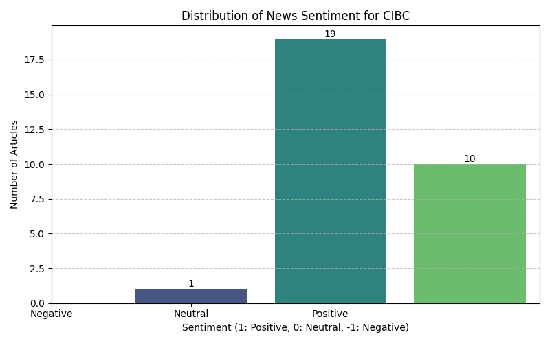
    


```python
all_sentiment_dfs = []

news_df['Bank'] = 'RBC'
news_df2['Bank'] = 'TD'
news_df3['Bank'] = 'BMO'
news_df4['Bank'] = 'Scotiabank'
news_df5['Bank'] = 'CIBC'

all_sentiment_dfs.append(news_df[['Bank', 'sentiment']])
all_sentiment_dfs.append(news_df2[['Bank', 'sentiment']])
all_sentiment_dfs.append(news_df3[['Bank', 'sentiment']])
all_sentiment_dfs.append(news_df4[['Bank', 'sentiment']])
all_sentiment_dfs.append(news_df5[['Bank', 'sentiment']])

combined_sentiment_df = pd.concat(all_sentiment_dfs)


sentiment_labels = {1: 'Positive', 0: 'Neutral', -1: 'Negative'}
combined_sentiment_df['sentiment_label'] = combined_sentiment_df['sentiment'].map(sentiment_labels)


sentiment_summary = combined_sentiment_df.groupby(['Bank', 'sentiment_label']).size().unstack(fill_value=0)

for label in sentiment_labels.values():
    if label not in sentiment_summary.columns:
        sentiment_summary[label] = 0

sentiment_summary = sentiment_summary[['Negative', 'Neutral', 'Positive']]

print("\n--- Sentiment Count Summary for All Banks ---")
display(sentiment_summary)
```

    
    --- Sentiment Count Summary for All Banks ---
    


<div>
<style scoped>
    .dataframe tbody tr th:only-of-type {
        vertical-align: middle;
    }

    .dataframe tbody tr th {
        vertical-align: top;
    }

    .dataframe thead th {
        text-align: right;
    }
</style>
<table border="1" class="dataframe">
  <thead>
    <tr style="text-align: right;">
      <th>sentiment_label</th>
      <th>Negative</th>
      <th>Neutral</th>
      <th>Positive</th>
    </tr>
    <tr>
      <th>Bank</th>
      <th></th>
      <th></th>
      <th></th>
    </tr>
  </thead>
  <tbody>
    <tr>
      <th>BMO</th>
      <td>1</td>
      <td>22</td>
      <td>7</td>
    </tr>
    <tr>
      <th>CIBC</th>
      <td>1</td>
      <td>19</td>
      <td>10</td>
    </tr>
    <tr>
      <th>RBC</th>
      <td>3</td>
      <td>21</td>
      <td>6</td>
    </tr>
    <tr>
      <th>Scotiabank</th>
      <td>4</td>
      <td>21</td>
      <td>5</td>
    </tr>
    <tr>
      <th>TD</th>
      <td>1</td>
      <td>23</td>
      <td>6</td>
    </tr>
  </tbody>
</table>
</div>


```python
top_canadian_bank_tickers = {
    "Royal Bank of Canada (RBC)": "RY.TO",
    "Canadian Imperial Bank of Commerce (CIBC)": "CM.TO",
    "Toronto-Dominion Bank (TD)": "TD.TO",
    "Bank of Nova Scotia (Scotiabank)": "BNS.TO",
    "Bank of Montreal (BMO)": "BMO.TO"
}

for bank_name, ticker_symbol in top_canadian_bank_tickers.items():
    print(f"\n--- Information for {bank_name} ({ticker_symbol}) ---\n")
    try:
        ticker_info = yf.Ticker(ticker_symbol).info
        print(ticker_info)
        print("\n" + "="*80 + "\n")
    except Exception as e:
        print(f"Could not retrieve information for {bank_name} ({ticker_symbol}): {e}")
```

    
    --- Information for Royal Bank of Canada (RBC) (RY.TO) ---
    
    {'address1': 'Royal Bank Plaza', 'address2': '200 Bay Street', 'city': 'Toronto', 'state': 'ON', 'zip': 'M5J 2J5', 'country': 'Canada', 'phone': '888 212 5533', 'website': 'https://www.rbc.com', 'industry': 'Banks - Diversified', 'industryKey': 'banks-diversified', 'industryDisp': 'Banks - Diversified', 'sector': 'Financial Services', 'sectorKey': 'financial-services', 'sectorDisp': 'Financial Services', 'longBusinessSummary': "Royal Bank of Canada operates as a diversified financial service company worldwide. Its Personal Banking segment offers home equity financing, personal lending, chequing and savings accounts, private banking, auto financing, mutual funds, GICs, credit cards, and payment products and solutions. The company's Commercial Banking segments provides lending, deposit and transaction banking products and services. Its Wealth Management segment provides a suite of wealth, investment, trust, banking, credit, and other solutions to clients; asset management products to institutional and individual clients; and asset and investor services to financial institutions, asset managers, and asset owners. The company's Insurance segment offers life, health, travel, wealth, annuities, property and casualty, and reinsurance advice and solutions; digital platforms; and independent brokers and partners, as well as client-led advice and solutions. The company's Capital Markets segment offers advisory and origination, sales and trading, lending and financing, and transaction banking services to corporations, institutional clients, asset managers, private equity firms, and governments. The company was founded in 1864 and is based in Toronto, Canada.", 'fullTimeEmployees': 96628, 'companyOfficers': [{'maxAge': 1, 'name': 'Mr. David I. McKay', 'age': 62, 'title': 'President, CEO & Director', 'yearBorn': 1963, 'fiscalYear': 2025, 'totalPay': 9499836, 'exercisedValue': 0, 'unexercisedValue': 0}, {'maxAge': 1, 'name': 'Ms. Katherine  Gibson', 'title': 'Chief Financial Officer', 'fiscalYear': 2025, 'totalPay': 2070147, 'exercisedValue': 0, 'unexercisedValue': 0}, {'maxAge': 1, 'name': 'Ms. Maria  Douvas', 'title': 'Chief Legal & Administrative Officer', 'fiscalYear': 2025, 'totalPay': 3158369, 'exercisedValue': 0, 'unexercisedValue': 0}, {'maxAge': 1, 'name': 'Mr. Neil  McLaughlin', 'title': 'Group Head of RBC Wealth Management', 'fiscalYear': 2025, 'totalPay': 2206813, 'exercisedValue': 0, 'unexercisedValue': 0}, {'maxAge': 1, 'name': 'Mr. Derek  Neldner CFA', 'title': 'Group Head & CEO of RBC Capital Markets', 'fiscalYear': 2025, 'totalPay': 5009500, 'exercisedValue': 0, 'unexercisedValue': 0}, {'maxAge': 1, 'name': 'Mr. Naim  Kazmi', 'title': 'Group Head of Technology & Operations', 'fiscalYear': 2025, 'exercisedValue': 0, 'unexercisedValue': 0}, {'maxAge': 1, 'name': 'Mr. Matthew R. Stopnik', 'title': 'Head of Investment Banking', 'fiscalYear': 2025, 'exercisedValue': 0, 'unexercisedValue': 0}, {'maxAge': 1, 'name': 'Mr. Asim  Imran', 'title': 'Senior VP & Head of Investor Relations', 'fiscalYear': 2025, 'exercisedValue': 0, 'unexercisedValue': 0}, {'maxAge': 1, 'name': 'Ms. Kelly Michelle Bradley', 'age': 50, 'title': 'Chief Human Resources Officer', 'yearBorn': 1975, 'fiscalYear': 2025, 'exercisedValue': 0, 'unexercisedValue': 0}, {'maxAge': 1, 'name': 'Mr. Wayne  Bossert', 'title': 'Deputy Chairman & Head of Ultra High Net Worth Clients-RBC Wealth Management', 'fiscalYear': 2025, 'exercisedValue': 0, 'unexercisedValue': 0}], 'auditRisk': 6, 'boardRisk': 1, 'compensationRisk': 5, 'shareHolderRightsRisk': 4, 'overallRisk': 3, 'governanceEpochDate': 1777593600, 'compensationAsOfEpochDate': 1767139200, 'irWebsite': 'http://www.rbc.com/investorrelations/index.html', 'executiveTeam': [], 'maxAge': 86400, 'priceHint': 2, 'previousClose': 260.54, 'open': 261.35, 'dayLow': 257.96, 'dayHigh': 264.44, 'regularMarketPreviousClose': 260.54, 'regularMarketOpen': 261.35, 'regularMarketDayLow': 257.96, 'regularMarketDayHigh': 264.44, 'dividendRate': 7.04, 'dividendYield': 2.66, 'exDividendDate': 1785110400, 'payoutRatio': 0.41349998, 'fiveYearAvgDividendYield': 3.51, 'trailingPE': 17.182587, 'forwardPE': 15.07669, 'volume': 5271802, 'regularMarketVolume': 5271802, 'averageVolume': 3713598, 'averageVolume10days': 3663370, 'averageDailyVolume10Day': 3663370, 'bid': 261.51, 'ask': 261.76, 'bidSize': 0, 'askSize': 0, 'marketCap': 367492464640, 'nonDilutedMarketCap': 362072633926, 'fiftyTwoWeekLow': 172.98, 'fiftyTwoWeekHigh': 265.1, 'allTimeHigh': 265.1, 'allTimeLow': 6.47, 'priceToSalesTrailing12Months': 5.592046, 'fiftyDayAverage': 241.373, 'twoHundredDayAverage': 222.59296, 'trailingAnnualDividendRate': 3.08, 'trailingAnnualDividendYield': 0.011821601, 'currency': 'CAD', 'tradeable': False, 'profitMargins': 0.33682, 'floatShares': 1398909790, 'sharesOutstanding': 1389700752, 'sharesShort': 6911386, 'sharesShortPriorMonth': 7907124, 'sharesShortPreviousMonthDate': 1776211200, 'dateShortInterest': 1778803200, 'sharesPercentSharesOut': 0.0063, 'heldPercentInsiders': 0.00027000002, 'heldPercentInstitutions': 0.49362, 'shortRatio': 1.99, 'impliedSharesOutstanding': 1389700752, 'bookValue': 92.119, 'priceToBook': 2.8706346, 'lastFiscalYearEnd': 1761868800, 'nextFiscalYearEnd': 1793404800, 'mostRecentQuarter': 1777507200, 'earningsQuarterlyGrowth': 0.256, 'netIncomeToCommon': 21641000960, 'trailingEps': 15.39, 'forwardEps': 17.53966, 'pegRatio': 2.56, 'lastSplitFactor': '2:1', 'lastSplitDate': 1143072000, '52WeekChange': 0.5097054, 'SandP52WeekChange': 0.27697718, 'lastDividendValue': 1.64, 'lastDividendDate': 1776902400, 'quoteType': 'EQUITY', 'currentPrice': 264.44, 'targetHighPrice': 280.0, 'targetLowPrice': 196.0, 'targetMeanPrice': 256.4643, 'targetMedianPrice': 262.75, 'recommendationMean': 1.86667, 'recommendationKey': 'buy', 'numberOfAnalystOpinions': 14, 'totalRevenue': 65716998144, 'revenuePerShare': 46.916, 'grossProfits': 65716998144, 'earningsGrowth': 0.275, 'revenueGrowth': 0.161, 'grossMargins': 0.0, 'ebitdaMargins': 0.0, 'operatingMargins': 0.42948002, 'financialCurrency': 'CAD', 'symbol': 'RY.TO', 'language': 'en-US', 'region': 'US', 'typeDisp': 'Equity', 'quoteSourceName': 'Delayed Quote', 'triggerable': True, 'customPriceAlertConfidence': 'HIGH', 'fiftyDayAverageChange': 23.067001, 'fiftyDayAverageChangePercent': 0.09556579, 'twoHundredDayAverageChange': 41.847046, 'twoHundredDayAverageChangePercent': 0.18799807, 'sourceInterval': 15, 'exchangeDataDelayedBy': 15, 'averageAnalystRating': '1.9 - Buy', 'cryptoTradeable': False, 'marketState': 'CLOSED', 'regularMarketChange': 3.899994, 'regularMarketDayRange': '257.96 - 264.44', 'fullExchangeName': 'Toronto', 'averageDailyVolume3Month': 3713598, 'fiftyTwoWeekLowChange': 91.46001, 'fiftyTwoWeekLowChangePercent': 0.5287317, 'fiftyTwoWeekRange': '172.98 - 265.1', 'fiftyTwoWeekHighChange': -0.66000366, 'fiftyTwoWeekHighChangePercent': -0.0024896404, 'fiftyTwoWeekChangePercent': 50.970543, 'dividendDate': 1779408000, 'earningsTimestamp': 1787833800, 'earningsTimestampStart': 1787833800, 'earningsTimestampEnd': 1787833800, 'earningsCallTimestampStart': 1787824800, 'earningsCallTimestampEnd': 1787824800, 'isEarningsDateEstimate': False, 'epsTrailingTwelveMonths': 15.39, 'epsForward': 17.53966, 'epsCurrentYear': 15.948, 'priceEpsCurrentYear': 16.58139, 'hasPrePostMarketData': False, 'firstTradeDateMilliseconds': 789921000000, 'shortName': 'ROYAL BANK OF CANADA', 'longName': 'Royal Bank of Canada', 'corporateActions': [], 'regularMarketTime': 1780084801, 'exchange': 'TOR', 'messageBoardId': 'finmb_109809', 'exchangeTimezoneName': 'America/Toronto', 'exchangeTimezoneShortName': 'EDT', 'gmtOffSetMilliseconds': -14400000, 'market': 'ca_market', 'esgPopulated': False, 'regularMarketChangePercent': 1.4968886, 'regularMarketPrice': 264.44, 'trailingPegRatio': 2.5563}
    
    ================================================================================
    
    
    --- Information for Canadian Imperial Bank of Commerce (CIBC) (CM.TO) ---
    
    {'address1': 'CIBC Square', 'address2': '81 Bay Street', 'city': 'Toronto', 'state': 'ON', 'zip': 'M5J 0E7', 'country': 'Canada', 'website': 'https://www.cibc.com', 'industry': 'Banks - Diversified', 'industryKey': 'banks-diversified', 'industryDisp': 'Banks - Diversified', 'sector': 'Financial Services', 'sectorKey': 'financial-services', 'sectorDisp': 'Financial Services', 'longBusinessSummary': 'Canadian Imperial Bank of Commerce, a diversified financial institution, provides various financial products and services to personal, business, public sector, and institutional clients in Canada, the United States, and internationally. The company operates through Canadian Personal and Business Banking; Canadian Commercial Banking and Wealth Management; U.S. Commercial Banking and Wealth Management; Capital Markets and Direct Financial Services; and Corporate and Other segments. It offers checking, savings, agriculture, and business accounts; mortgages; business, car, education, home, and other loans; lines of credit and agriculture loans; and cash management, small business financing, and overdraft protection services. The company also provides investment and insurance services; healthcare banking; credit cards; private banking, wealth planning, investment management, and estate planning and trust; and ATMs, as well as mobile, online, and global money and wire transfer services. Canadian Imperial Bank of Commerce was founded in 1867 and is headquartered in Toronto, Canada.', 'fullTimeEmployees': 49824, 'companyOfficers': [{'maxAge': 1, 'name': 'Mr. Harry K. Culham', 'age': 57, 'title': 'President, CEO & Director', 'yearBorn': 1968, 'fiscalYear': 2025, 'totalPay': 4138358, 'exercisedValue': 0, 'unexercisedValue': 0}, {'maxAge': 1, 'name': 'Mr. Robert  Sedran C.F.A.', 'age': 53, 'title': 'Senior EVP, CFO & Enterprise Strategy', 'yearBorn': 1972, 'fiscalYear': 2025, 'totalPay': 1718987, 'exercisedValue': 0, 'unexercisedValue': 0}, {'maxAge': 1, 'name': 'Mr. Hratch  Panossian', 'title': 'Senior EVP and Group Head of Canadian Personal & Business Banking', 'fiscalYear': 2025, 'totalPay': 2152034, 'exercisedValue': 0, 'unexercisedValue': 0}, {'maxAge': 1, 'name': 'Mr. Shawn  Beber', 'title': 'Special Advisor', 'fiscalYear': 2025, 'totalPay': 3154657, 'exercisedValue': 0, 'unexercisedValue': 0}, {'maxAge': 1, 'name': 'Mr. Stephen  Scholtz', 'title': 'Executive VP & Global Chief Legal Officer', 'fiscalYear': 2025, 'exercisedValue': 0, 'unexercisedValue': 0}, {'maxAge': 1, 'name': 'Ms. Yvonne  Dimitroff', 'title': 'Executive VP and Chief Human Resources Officer of People, Culture & Talent', 'fiscalYear': 2025, 'exercisedValue': 0, 'unexercisedValue': 0}, {'maxAge': 1, 'name': 'Mr. Michael G. Capatides', 'title': 'Vice-Chair of CIBC Bank USA', 'fiscalYear': 2025, 'totalPay': 2914752, 'exercisedValue': 1258135, 'unexercisedValue': 0}, {'maxAge': 1, 'name': 'Mr. John P. Ferren', 'title': 'Senior Vice President of Deposit Products & Analytics', 'fiscalYear': 2025, 'exercisedValue': 0, 'unexercisedValue': 0}, {'maxAge': 1, 'name': 'Mr. Michael J. Boluch', 'title': 'Executive Vice President of Technology & Enterprise Innovation', 'fiscalYear': 2025, 'exercisedValue': 0, 'unexercisedValue': 0}, {'maxAge': 1, 'name': 'Mr. Stephen J. Forbes', 'title': 'Chief Commercial Officer & Executive VP', 'fiscalYear': 2025, 'exercisedValue': 0, 'unexercisedValue': 0}], 'auditRisk': 1, 'boardRisk': 3, 'compensationRisk': 6, 'shareHolderRightsRisk': 1, 'overallRisk': 3, 'governanceEpochDate': 1777593600, 'compensationAsOfEpochDate': 1767139200, 'irWebsite': 'https://www.cibc.com/ca/investor-relations/welcome.html', 'executiveTeam': [], 'maxAge': 86400, 'priceHint': 2, 'previousClose': 150.96, 'open': 151.12, 'dayLow': 146.9, 'dayHigh': 152.0, 'regularMarketPreviousClose': 150.96, 'regularMarketOpen': 151.12, 'regularMarketDayLow': 146.9, 'regularMarketDayHigh': 152.0, 'dividendRate': 4.28, 'dividendYield': 2.84, 'exDividendDate': 1782691200, 'payoutRatio': 0.4048, 'fiveYearAvgDividendYield': 4.61, 'trailingPE': 14.929564, 'forwardPE': 13.566213, 'volume': 5548413, 'regularMarketVolume': 5548413, 'averageVolume': 2556838, 'averageVolume10days': 2163740, 'averageDailyVolume10Day': 2163740, 'bid': 150.18, 'ask': 150.2, 'bidSize': 0, 'askSize': 0, 'marketCap': 137664151552, 'nonDilutedMarketCap': 138094088905, 'fiftyTwoWeekLow': 91.94, 'fiftyTwoWeekHigh': 162.12, 'allTimeHigh': 162.12, 'allTimeLow': 0.0, 'priceToSalesTrailing12Months': 4.76396, 'fiftyDayAverage': 146.0766, 'twoHundredDayAverage': 127.1666, 'trailingAnnualDividendRate': 4.08, 'trailingAnnualDividendYield': 0.027027026, 'currency': 'CAD', 'tradeable': False, 'profitMargins': 0.33976, 'floatShares': 919282431, 'sharesOutstanding': 914772714, 'sharesShort': 20879862, 'sharesShortPriorMonth': 22241446, 'sharesShortPreviousMonthDate': 1776211200, 'dateShortInterest': 1778803200, 'sharesPercentSharesOut': 0.0238, 'heldPercentInsiders': 0.00022, 'heldPercentInstitutions': 0.53766996, 'shortRatio': 10.39, 'impliedSharesOutstanding': 914772714, 'bookValue': 69.131, 'priceToBook': 2.1768818, 'lastFiscalYearEnd': 1761868800, 'nextFiscalYearEnd': 1793404800, 'mostRecentQuarter': 1777507200, 'earningsQuarterlyGrowth': 0.23, 'netIncomeToCommon': 9400000512, 'trailingEps': 10.08, 'forwardEps': 11.093, 'pegRatio': 2.04, 'lastSplitFactor': '2:1', 'lastSplitDate': 1652659200, '52WeekChange': 0.62096083, 'SandP52WeekChange': 0.27697718, 'lastDividendValue': 1.07, 'lastDividendDate': 1774569600, 'quoteType': 'EQUITY', 'currentPrice': 150.49, 'targetHighPrice': 167.0, 'targetLowPrice': 104.0, 'targetMeanPrice': 148.32143, 'targetMedianPrice': 153.75, 'recommendationMean': 2.21429, 'recommendationKey': 'buy', 'numberOfAnalystOpinions': 14, 'totalRevenue': 28896999424, 'revenuePerShare': 31.214, 'grossProfits': 28896999424, 'earningsGrowth': 0.24, 'revenueGrowth': 0.153, 'grossMargins': 0.0, 'ebitdaMargins': 0.0, 'operatingMargins': 0.43264, 'financialCurrency': 'CAD', 'symbol': 'CM.TO', 'language': 'en-US', 'region': 'US', 'typeDisp': 'Equity', 'quoteSourceName': 'Delayed Quote', 'triggerable': True, 'customPriceAlertConfidence': 'HIGH', 'fiftyDayAverageChange': 4.4134064, 'fiftyDayAverageChangePercent': 0.03021296, 'twoHundredDayAverageChange': 23.323402, 'twoHundredDayAverageChangePercent': 0.18340823, 'sourceInterval': 15, 'exchangeDataDelayedBy': 15, 'averageAnalystRating': '2.2 - Buy', 'cryptoTradeable': False, 'marketState': 'CLOSED', 'regularMarketChange': -0.47000122, 'regularMarketDayRange': '146.9 - 152.0', 'fullExchangeName': 'Toronto', 'averageDailyVolume3Month': 2556838, 'fiftyTwoWeekLowChange': 58.550003, 'fiftyTwoWeekLowChangePercent': 0.63682836, 'fiftyTwoWeekRange': '91.94 - 162.12', 'fiftyTwoWeekHighChange': -11.62999, 'fiftyTwoWeekHighChangePercent': -0.071736924, 'fiftyTwoWeekChangePercent': 62.096085, 'dividendDate': 1777334400, 'earningsTimestamp': 1787833800, 'earningsTimestampStart': 1787833800, 'earningsTimestampEnd': 1787833800, 'earningsCallTimestampStart': 1787830200, 'earningsCallTimestampEnd': 1787830200, 'isEarningsDateEstimate': False, 'epsTrailingTwelveMonths': 10.08, 'epsForward': 11.093, 'epsCurrentYear': 10.27523, 'priceEpsCurrentYear': 14.645901, 'hasPrePostMarketData': False, 'firstTradeDateMilliseconds': 789921000000, 'shortName': 'CANADIAN IMPERIAL BANK OF COMME', 'longName': 'Canadian Imperial Bank of Commerce', 'corporateActions': [], 'regularMarketTime': 1780084800, 'exchange': 'TOR', 'messageBoardId': 'finmb_386873', 'exchangeTimezoneName': 'America/Toronto', 'exchangeTimezoneShortName': 'EDT', 'gmtOffSetMilliseconds': -14400000, 'market': 'ca_market', 'esgPopulated': False, 'regularMarketChangePercent': -0.31134155, 'regularMarketPrice': 150.49, 'trailingPegRatio': 2.0434}
    
    ================================================================================
    
    
    --- Information for Toronto-Dominion Bank (TD) (TD.TO) ---
    
    {'address1': '66 Wellington Street West', 'city': 'Toronto', 'state': 'ON', 'zip': 'M5K 1A2', 'country': 'Canada', 'website': 'https://www.td.com', 'industry': 'Banks - Diversified', 'industryKey': 'banks-diversified', 'industryDisp': 'Banks - Diversified', 'sector': 'Financial Services', 'sectorKey': 'financial-services', 'sectorDisp': 'Financial Services', 'longBusinessSummary': 'The Toronto-Dominion Bank, together with its subsidiaries, provides various financial products and services in Canada, the United States, and internationally. It operates through four segments: Canadian Personal and Commercial Banking; U.S. Retail; Wealth Management and Insurance; and Wholesale Banking. The company offers personal deposits, such as chequing, savings, and investment products; financing, investment, cash management, international trade, and banking services to businesses; and financing options to customers at point of sale for automotive and recreational vehicle purchases. It also provides credit cards and payments; real estate secured lending, auto finance, and consumer lending services; point-of-sale payment solutions for large and small businesses; wealth and asset management products, and advice to retail and institutional clients through direct investing, advice-based, and asset management businesses; and property and casualty insurance, as well as life and health insurance products. The company also provides capital markets, and corporate and investment banking products and services, including underwriting and distribution of new debt and equity issues; advice on strategic acquisitions and divestitures; and trading, funding, and investment services to corporations, governments, and institutions. The Toronto-Dominion Bank was founded in 1855 and is headquartered in Toronto, Canada.', 'fullTimeEmployees': 100000, 'companyOfficers': [{'maxAge': 1, 'name': 'Mr. Raymond  Chun', 'age': 55, 'title': 'Group President, CEO & Director', 'yearBorn': 1970, 'fiscalYear': 2025, 'totalPay': 3867149, 'exercisedValue': 0, 'unexercisedValue': 0}, {'maxAge': 1, 'name': 'Mr. Kelvin Vi Luan Tran C.F.A.', 'title': 'Group Head & CFO', 'fiscalYear': 2025, 'totalPay': 2228180, 'exercisedValue': 0, 'unexercisedValue': 0}, {'maxAge': 1, 'name': 'Mr. Ajai K. Bambawale', 'title': 'Group Head & Chief Risk Officer', 'fiscalYear': 2025, 'totalPay': 2865637, 'exercisedValue': 0, 'unexercisedValue': 0}, {'maxAge': 1, 'name': 'Mr. Leovigildo  Salom Jr.', 'title': 'Group Head of U.S. Banking', 'fiscalYear': 2025, 'totalPay': 4930045, 'exercisedValue': 0, 'unexercisedValue': 0}, {'maxAge': 1, 'name': 'Mr. Tim Guest Wiggan CFA', 'title': 'Group Head of Wholesale Banking', 'fiscalYear': 2025, 'totalPay': 3691207, 'exercisedValue': 0, 'unexercisedValue': 0}, {'maxAge': 1, 'name': 'Mr. Taylan  Turan', 'title': 'Group Head & COO', 'fiscalYear': 2025, 'exercisedValue': 0, 'unexercisedValue': 0}, {'maxAge': 1, 'name': 'Mr. Vladimir  Shpilsky', 'title': 'Senior Executive Vice President of Global Technology & Solutions', 'fiscalYear': 2025, 'exercisedValue': 0, 'unexercisedValue': 0}, {'maxAge': 1, 'name': 'Ms. Brooke  Hales', 'title': 'Head of Investor Relations', 'fiscalYear': 2025, 'exercisedValue': 0, 'unexercisedValue': 0}, {'maxAge': 1, 'name': 'Ms. Erin  Morrow', 'title': 'Chief Compliance Officer', 'fiscalYear': 2025, 'exercisedValue': 0, 'unexercisedValue': 0}, {'maxAge': 1, 'name': 'Mr. Simon A. Fish', 'age': 64, 'title': 'Senior EVP & Chief Legal Officer', 'yearBorn': 1961, 'fiscalYear': 2025, 'exercisedValue': 0, 'unexercisedValue': 0}], 'auditRisk': 10, 'boardRisk': 1, 'compensationRisk': 2, 'shareHolderRightsRisk': 1, 'overallRisk': 2, 'governanceEpochDate': 1777593600, 'compensationAsOfEpochDate': 1767139200, 'irWebsite': 'http://www.td.com/investor-relations/ir-homepage/ir-homepage/investor-index.jsp', 'executiveTeam': [], 'maxAge': 86400, 'priceHint': 2, 'previousClose': 156.18, 'open': 156.29, 'dayLow': 153.77, 'dayHigh': 157.75, 'regularMarketPreviousClose': 156.18, 'regularMarketOpen': 156.29, 'regularMarketDayLow': 153.77, 'regularMarketDayHigh': 157.75, 'dividendRate': 4.48, 'dividendYield': 2.84, 'exDividendDate': 1783641600, 'payoutRatio': 0.5, 'fiveYearAvgDividendYield': 4.17, 'trailingPE': 18.515257, 'forwardPE': 14.945623, 'volume': 6998634, 'regularMarketVolume': 6998634, 'averageVolume': 5439668, 'averageVolume10days': 3919550, 'averageDailyVolume10Day': 3919550, 'bid': 156.69, 'ask': 156.74, 'bidSize': 0, 'askSize': 0, 'marketCap': 260611031040, 'nonDilutedMarketCap': 258017325180, 'fiftyTwoWeekLow': 94.5, 'fiftyTwoWeekHigh': 157.75, 'allTimeHigh': 157.75, 'allTimeLow': 4.875, 'priceToSalesTrailing12Months': 4.4037013, 'fiftyDayAverage': 142.2562, 'twoHundredDayAverage': 125.1754, 'trailingAnnualDividendRate': 2.1, 'trailingAnnualDividendYield': 0.013446024, 'currency': 'CAD', 'tradeable': False, 'profitMargins': 0.25194, 'floatShares': 1631344573, 'sharesOutstanding': 1652051000, 'sharesShort': 30896806, 'sharesShortPriorMonth': 30863270, 'sharesShortPreviousMonthDate': 1776211200, 'dateShortInterest': 1778803200, 'sharesPercentSharesOut': 0.0191, 'heldPercentInsiders': 0.00044, 'heldPercentInstitutions': 0.55085, 'shortRatio': 6.7, 'impliedSharesOutstanding': 1652051000, 'bookValue': 73.266, 'priceToBook': 2.1531134, 'lastFiscalYearEnd': 1761868800, 'nextFiscalYearEnd': 1793404800, 'mostRecentQuarter': 1777507200, 'earningsQuarterlyGrowth': -0.618, 'netIncomeToCommon': 14328000512, 'trailingEps': 8.52, 'forwardEps': 10.55493, 'pegRatio': 0.91, 'lastSplitFactor': '2:1', 'lastSplitDate': 1391385600, '52WeekChange': 0.6612258, 'SandP52WeekChange': 0.27697718, 'lastDividendValue': 1.08, 'lastDividendDate': 1775692800, 'quoteType': 'EQUITY', 'currentPrice': 157.75, 'targetHighPrice': 168.0, 'targetLowPrice': 115.0, 'targetMeanPrice': 149.64285, 'targetMedianPrice': 150.5, 'recommendationMean': 2.07143, 'recommendationKey': 'buy', 'numberOfAnalystOpinions': 14, 'totalRevenue': 59179999232, 'revenuePerShare': 35.411, 'grossProfits': 59179999232, 'earningsGrowth': -0.614, 'revenueGrowth': -0.315, 'grossMargins': 0.0, 'ebitdaMargins': 0.0, 'operatingMargins': 0.33969003, 'financialCurrency': 'CAD', 'symbol': 'TD.TO', 'language': 'en-US', 'region': 'US', 'typeDisp': 'Equity', 'quoteSourceName': 'Delayed Quote', 'triggerable': True, 'customPriceAlertConfidence': 'HIGH', 'shortName': 'TORONTO-DOMINION BANK', 'longName': 'The Toronto-Dominion Bank', 'cryptoTradeable': False, 'corporateActions': [], 'regularMarketTime': 1780085400, 'exchange': 'TOR', 'messageBoardId': 'finmb_23515', 'exchangeTimezoneName': 'America/Toronto', 'exchangeTimezoneShortName': 'EDT', 'gmtOffSetMilliseconds': -14400000, 'market': 'ca_market', 'esgPopulated': False, 'regularMarketChangePercent': 1.0052551, 'regularMarketPrice': 157.75, 'hasPrePostMarketData': False, 'firstTradeDateMilliseconds': 789921000000, 'regularMarketChange': 1.5700073, 'regularMarketDayRange': '153.77 - 157.75', 'fullExchangeName': 'Toronto', 'averageDailyVolume3Month': 5439668, 'fiftyTwoWeekLowChange': 63.25, 'fiftyTwoWeekLowChangePercent': 0.6693122, 'fiftyTwoWeekRange': '94.5 - 157.75', 'fiftyTwoWeekHighChange': 0.0, 'fiftyTwoWeekHighChangePercent': 0.0, 'fiftyTwoWeekChangePercent': 66.12258, 'dividendDate': 1777507200, 'earningsTimestamp': 1787833800, 'earningsTimestampStart': 1787833800, 'earningsTimestampEnd': 1787833800, 'earningsCallTimestampStart': 1787837400, 'earningsCallTimestampEnd': 1787837400, 'isEarningsDateEstimate': False, 'epsTrailingTwelveMonths': 8.52, 'epsForward': 10.55493, 'epsCurrentYear': 9.46714, 'priceEpsCurrentYear': 16.662899, 'fiftyDayAverageChange': 15.493805, 'fiftyDayAverageChangePercent': 0.1089148, 'twoHundredDayAverageChange': 32.5746, 'twoHundredDayAverageChangePercent': 0.26023164, 'sourceInterval': 15, 'exchangeDataDelayedBy': 15, 'prevName': 'DAVOS', 'nameChangeDate': '2026-05-29', 'averageAnalystRating': '2.1 - Buy', 'marketState': 'CLOSED', 'trailingPegRatio': None}
    
    ================================================================================
    
    
    --- Information for Bank of Nova Scotia (Scotiabank) (BNS.TO) ---
    
    {'address1': '40 Temperance Street', 'address2': 'Scotia plaza', 'city': 'Toronto', 'state': 'ON', 'zip': 'M5H 0B4', 'country': 'Canada', 'phone': '416 866 6161', 'website': 'https://www.scotiabank.com', 'industry': 'Banks - Diversified', 'industryKey': 'banks-diversified', 'industryDisp': 'Banks - Diversified', 'sector': 'Financial Services', 'sectorKey': 'financial-services', 'sectorDisp': 'Financial Services', 'longBusinessSummary': 'The Bank of Nova Scotia provides various banking products and services in Canada, the United States, Mexico, Peru, Chile, Colombia, the Caribbean and Central America, and internationally. It operates through Canadian Banking, International Banking, Global Wealth Management, and Global Banking and Markets segments. The company offers financial advice and solutions, and banking products, including debit and credit cards, chequing and saving accounts, investments, mortgages, loans, and insurance to individuals; and retail automotive financing solutions. It also provides business banking solutions comprising lending, deposit, cash management, and trade finance solutions to small, medium, and large businesses. In addition, it provides wealth management advice and solutions, including online brokerage, mobile investment, full-service brokerage, trust, private banking, and private investment counsel services; and retail mutual funds, exchange traded funds, liquid alternatives, and institutional funds. The company was founded in 1832 and is headquartered in Toronto, Canada.', 'fullTimeEmployees': 80415, 'companyOfficers': [{'maxAge': 1, 'name': 'Mr. L. Scott Thomson', 'age': 55, 'title': 'President, CEO & Director', 'yearBorn': 1970, 'fiscalYear': 2025, 'totalPay': 3973600, 'exercisedValue': 0, 'unexercisedValue': 0}, {'maxAge': 1, 'name': 'Mr. Rajagopal  Viswanathan', 'title': 'Group Head & CFO', 'fiscalYear': 2025, 'totalPay': 1853600, 'exercisedValue': 58173, 'unexercisedValue': 0}, {'maxAge': 1, 'name': 'Mr. Tim  Clarke', 'title': 'Group Head & Chief Information Officer', 'fiscalYear': 2025, 'totalPay': 3167205, 'exercisedValue': 0, 'unexercisedValue': 0}, {'maxAge': 1, 'name': 'Mr. Francisco Alberto Aristeguieta Silva', 'age': 60, 'title': 'Group Head of International & Global Transaction Banking', 'yearBorn': 1965, 'fiscalYear': 2025, 'totalPay': 3758162, 'exercisedValue': 0, 'unexercisedValue': 0}, {'maxAge': 1, 'name': 'Mr. Travis J. Machen', 'title': 'CEO and Group Head of Global Banking & Markets Business', 'fiscalYear': 2025, 'totalPay': 4483813, 'exercisedValue': 0, 'unexercisedValue': 0}, {'maxAge': 1, 'name': 'Mr. Philip M. Thomas B.A.', 'title': 'Group Head and Chief Strategy & Operating Officer', 'fiscalYear': 2025, 'totalPay': 235000, 'exercisedValue': 0, 'unexercisedValue': 0}, {'maxAge': 1, 'name': 'Mr. Meny  Grauman C.F.A., M.A.', 'title': 'Head of Investor Relations', 'fiscalYear': 2025, 'exercisedValue': 0, 'unexercisedValue': 0}, {'maxAge': 1, 'name': 'Ms. Julie A. Walsh', 'title': 'Executive VP & Chief Compliance Officer', 'fiscalYear': 2025, 'exercisedValue': 0, 'unexercisedValue': 0}, {'maxAge': 1, 'name': 'Mr. Ian  Arellano Esq.', 'title': 'Executive VP & General Counsel', 'fiscalYear': 2025, 'exercisedValue': 0, 'unexercisedValue': 0}, {'maxAge': 1, 'name': 'Ms. Meigan  Terry', 'title': 'Executive VP and Chief Global Corporate & Public Affairs Officer', 'fiscalYear': 2025, 'exercisedValue': 0, 'unexercisedValue': 0}], 'auditRisk': 1, 'boardRisk': 4, 'compensationRisk': 4, 'shareHolderRightsRisk': 1, 'overallRisk': 1, 'governanceEpochDate': 1777593600, 'compensationAsOfEpochDate': 1767139200, 'irWebsite': 'http://www.scotiabank.com/ca/en/0,,915,00.html', 'executiveTeam': [], 'maxAge': 86400, 'priceHint': 2, 'previousClose': 110.07, 'open': 110.12, 'dayLow': 108.61, 'dayHigh': 110.8, 'regularMarketPreviousClose': 110.07, 'regularMarketOpen': 110.12, 'regularMarketDayLow': 108.61, 'regularMarketDayHigh': 110.8, 'dividendRate': 4.56, 'dividendYield': 4.12, 'exDividendDate': 1783382400, 'payoutRatio': 0.6069, 'fiveYearAvgDividendYield': 5.48, 'beta': 1.215, 'trailingPE': 15.257932, 'forwardPE': 11.949037, 'volume': 5662410, 'regularMarketVolume': 5662410, 'averageVolume': 4268550, 'averageVolume10days': 3403170, 'averageDailyVolume10Day': 3403170, 'bid': 110.38, 'ask': 110.41, 'bidSize': 0, 'askSize': 0, 'marketCap': 135628537856, 'nonDilutedMarketCap': 134954185320, 'fiftyTwoWeekLow': 72.86, 'fiftyTwoWeekHigh': 113.57, 'allTimeHigh': 113.57, 'allTimeLow': 6.0625, 'priceToSalesTrailing12Months': 3.9638922, 'fiftyDayAverage': 102.9468, 'twoHundredDayAverage': 97.0716, 'trailingAnnualDividendRate': 4.4, 'trailingAnnualDividendYield': 0.039974563, 'currency': 'CAD', 'tradeable': False, 'enterpriseValue': -44194471936, 'profitMargins': 0.27905, 'floatShares': 1211044308, 'sharesOutstanding': 1226076000, 'sharesShort': 20614011, 'sharesShortPriorMonth': 21201984, 'sharesShortPreviousMonthDate': 1776211200, 'dateShortInterest': 1778803200, 'sharesPercentSharesOut': 0.0196, 'heldPercentInsiders': 0.00021, 'heldPercentInstitutions': 0.50923, 'shortRatio': 6.65, 'impliedSharesOutstanding': 1226076000, 'bookValue': 70.263, 'priceToBook': 1.5743706, 'lastFiscalYearEnd': 1761868800, 'nextFiscalYearEnd': 1793404800, 'mostRecentQuarter': 1777507200, 'earningsQuarterlyGrowth': 0.313, 'netIncomeToCommon': 9018000384, 'trailingEps': 7.25, 'forwardEps': 9.25765, 'pegRatio': 1.22, 'lastSplitFactor': '2:1', 'lastSplitDate': 1080864000, 'enterpriseToRevenue': -1.292, '52WeekChange': 0.5093465, 'SandP52WeekChange': 0.27697718, 'lastDividendValue': 1.1, 'lastDividendDate': 1775520000, 'quoteType': 'EQUITY', 'currentPrice': 110.62, 'targetHighPrice': 122.0, 'targetLowPrice': 92.0, 'targetMeanPrice': 112.07143, 'targetMedianPrice': 113.5, 'recommendationMean': 2.92857, 'recommendationKey': 'hold', 'numberOfAnalystOpinions': 14, 'totalCash': 531156008960, 'totalCashPerShare': 433.216, 'totalDebt': 349912006656, 'totalRevenue': 34215999488, 'revenuePerShare': 27.638, 'returnOnAssets': 0.00658, 'returnOnEquity': 0.11038999, 'grossProfits': 34215999488, 'operatingCashflow': -33443000320, 'earningsGrowth': 0.354, 'revenueGrowth': 0.126, 'grossMargins': 0.0, 'ebitdaMargins': 0.0, 'operatingMargins': 0.39803, 'financialCurrency': 'CAD', 'symbol': 'BNS.TO', 'language': 'en-US', 'region': 'US', 'typeDisp': 'Equity', 'quoteSourceName': 'Delayed Quote', 'triggerable': True, 'customPriceAlertConfidence': 'HIGH', 'marketState': 'CLOSED', 'shortName': 'BANK OF NOVA SCOTIA', 'longName': 'The Bank of Nova Scotia', 'hasPrePostMarketData': False, 'firstTradeDateMilliseconds': 789921000000, 'regularMarketChange': 0.55000305, 'regularMarketDayRange': '108.61 - 110.8', 'fullExchangeName': 'Toronto', 'averageDailyVolume3Month': 4268550, 'fiftyTwoWeekLowChange': 37.760002, 'fiftyTwoWeekLowChangePercent': 0.5182542, 'fiftyTwoWeekRange': '72.86 - 113.57', 'fiftyTwoWeekHighChange': -2.949997, 'fiftyTwoWeekHighChangePercent': -0.025975144, 'fiftyTwoWeekChangePercent': 50.934647, 'dividendDate': 1777334400, 'earningsTimestamp': 1787661000, 'regularMarketChangePercent': 0.49968478, 'regularMarketPrice': 110.62, 'earningsTimestampStart': 1787661000, 'earningsTimestampEnd': 1787661000, 'earningsCallTimestampStart': 1779880500, 'earningsCallTimestampEnd': 1779880500, 'isEarningsDateEstimate': False, 'epsTrailingTwelveMonths': 7.25, 'epsForward': 9.25765, 'epsCurrentYear': 8.28456, 'priceEpsCurrentYear': 13.35255, 'fiftyDayAverageChange': 7.6732025, 'fiftyDayAverageChangePercent': 0.07453561, 'twoHundredDayAverageChange': 13.548401, 'twoHundredDayAverageChangePercent': 0.1395712, 'sourceInterval': 15, 'exchangeDataDelayedBy': 15, 'averageAnalystRating': '2.9 - Hold', 'cryptoTradeable': False, 'corporateActions': [], 'regularMarketTime': 1780084800, 'exchange': 'TOR', 'messageBoardId': 'finmb_873647', 'exchangeTimezoneName': 'America/Toronto', 'exchangeTimezoneShortName': 'EDT', 'gmtOffSetMilliseconds': -14400000, 'market': 'ca_market', 'esgPopulated': False, 'trailingPegRatio': 1.2192}
    
    ================================================================================
    
    
    --- Information for Bank of Montreal (BMO) (BMO.TO) ---
    
    {'address1': '129 rue Saint-Jacques', 'city': 'Montreal', 'state': 'QC', 'zip': 'H2Y 1L6', 'country': 'Canada', 'phone': '877 262 5907', 'website': 'https://www.bmo.com', 'industry': 'Banks - Diversified', 'industryKey': 'banks-diversified', 'industryDisp': 'Banks - Diversified', 'sector': 'Financial Services', 'sectorKey': 'financial-services', 'sectorDisp': 'Financial Services', 'longBusinessSummary': "Bank of Montreal engages in the provision of diversified financial services primarily in North America. The company operates through Canadian P&C, U.S P&C, BMO Wealth Management, and BMO Capital Markets segments. It's personal banking products and services include deposits, home lending, consumer credit, small business lending, credit cards, cash management, financial and investment advice, and other banking services; and commercial banking products and services comprise various of financing options and treasury and payment solutions, as well as risk management products. It also offers investing, banking, and wealth management advisory; digital investing services; financial solutions for individuals, families, and businesses; offers investment management services to institutional, retail, and high net worth investors; and diversified insurance, and wealth and pension de-risking solutions. In addition, the company provides individual life, critical illness and annuity products, as well as segregated funds, and group creditor and travel insurance to customers; debt and equity capital-raising, loan origination and syndication, balance sheet management, treasury management, mergers and acquisitions advice, restructurings and recapitalizations, trade finance, and risk mitigation services, as well as a range of banking and other operating services. Further, the company offers research and access to financial markets for institutional, corporate and retail clients through an integrated suite of sales and trading solutions related to debt, foreign exchange, interest rates, credit, equities, securitization, and commodities; provides new product development and origination services, as well as risk management and advisory services for hedging strategies, including in interest rates, foreign exchange rates and commodities prices; and funding and liquidity management services. Bank of Montreal was founded in 1817 and is headquartered in Montreal, Canada.", 'fullTimeEmployees': 53234, 'companyOfficers': [{'maxAge': 1, 'name': 'Mr. William Darryl White', 'age': 53, 'title': 'CEO & Director', 'yearBorn': 1972, 'fiscalYear': 2025, 'totalPay': 4792992, 'exercisedValue': 0, 'unexercisedValue': 0}, {'maxAge': 1, 'name': 'Mr. Darrel Harris Hackett', 'age': 53, 'title': 'U.S. CEO of BMO Financial Corp., President & CEO of BMO Bank N.A.', 'yearBorn': 1972, 'fiscalYear': 2025, 'totalPay': 2726770, 'exercisedValue': 0, 'unexercisedValue': 0}, {'maxAge': 1, 'name': 'Mr. Alan  Tannenbaum', 'age': 57, 'title': 'CEO & Group Head of BMO Capital Markets', 'yearBorn': 1968, 'fiscalYear': 2025, 'totalPay': 4452423, 'exercisedValue': 0, 'unexercisedValue': 0}, {'maxAge': 1, 'name': 'Mr. Aron D. Levine', 'title': 'Group Head & President of BMO U.S.', 'fiscalYear': 2025, 'totalPay': 23416194, 'exercisedValue': 0, 'unexercisedValue': 0}, {'maxAge': 1, 'name': 'Mr. Rahul  Nalgirkar', 'title': 'Chief Financial Officer', 'fiscalYear': 2025, 'exercisedValue': 0, 'unexercisedValue': 0}, {'maxAge': 1, 'name': 'Mr. Steve  Tennyson C.F.A.', 'title': 'Chief Technology & Operations Officer', 'fiscalYear': 2025, 'totalPay': 1598250, 'exercisedValue': 0, 'unexercisedValue': 0}, {'maxAge': 1, 'name': 'Ms. Mona  Malone', 'title': 'Chief Administrative Officer, Chief Human Resources Officer and Head of People, Culture & Brand', 'fiscalYear': 2025, 'exercisedValue': 0, 'unexercisedValue': 0}, {'maxAge': 1, 'name': 'Ms. Christine  Viau', 'title': 'Head of Investor Relations', 'fiscalYear': 2025, 'exercisedValue': 0, 'unexercisedValue': 0}, {'maxAge': 1, 'name': 'Pascale  Elharrar', 'title': 'Chief Legal Officer of Enterprise Legal & Corporate Secretary', 'fiscalYear': 2025, 'exercisedValue': 0, 'unexercisedValue': 0}, {'maxAge': 1, 'name': 'Ms. Catherine Margaret Roche', 'title': 'Chief Marketing Officer', 'fiscalYear': 2025, 'exercisedValue': 0, 'unexercisedValue': 0}], 'auditRisk': 1, 'boardRisk': 3, 'compensationRisk': 8, 'shareHolderRightsRisk': 1, 'overallRisk': 5, 'governanceEpochDate': 1777593600, 'compensationAsOfEpochDate': 1767139200, 'irWebsite': 'http://www.bmo.com/home/about/banking/investor-relations/home', 'executiveTeam': [], 'maxAge': 86400, 'priceHint': 2, 'previousClose': 223.12, 'open': 224.5, 'dayLow': 221.47, 'dayHigh': 226.19, 'regularMarketPreviousClose': 223.12, 'regularMarketOpen': 224.5, 'regularMarketDayLow': 221.47, 'regularMarketDayHigh': 226.19, 'dividendRate': 6.84, 'dividendYield': 3.05, 'exDividendDate': 1785369600, 'payoutRatio': 0.5069, 'fiveYearAvgDividendYield': 4.14, 'beta': 1.168, 'trailingPE': 17.212143, 'forwardPE': 13.786322, 'volume': 2499711, 'regularMarketVolume': 2499711, 'averageVolume': 2460503, 'averageVolume10days': 2602230, 'averageDailyVolume10Day': 2602230, 'bid': 223.39, 'ask': 223.46, 'bidSize': 0, 'askSize': 0, 'marketCap': 156844294144, 'nonDilutedMarketCap': 156276956031, 'fiftyTwoWeekLow': 143.35, 'fiftyTwoWeekHigh': 226.19, 'allTimeHigh': 226.19, 'allTimeLow': 12.19, 'priceToSalesTrailing12Months': 4.522224, 'fiftyDayAverage': 204.0114, 'twoHundredDayAverage': 186.2461, 'trailingAnnualDividendRate': 6.6, 'trailingAnnualDividendYield': 0.029580494, 'currency': 'CAD', 'tradeable': False, 'enterpriseValue': 33797294080, 'profitMargins': 0.28057, 'floatShares': 699625148, 'sharesOutstanding': 700416619, 'sharesShort': 7337144, 'sharesShortPriorMonth': 8212695, 'sharesShortPreviousMonthDate': 1776211200, 'dateShortInterest': 1778803200, 'sharesPercentSharesOut': 0.0089, 'heldPercentInsiders': 0.00031, 'heldPercentInstitutions': 0.53887004, 'shortRatio': 2.04, 'impliedSharesOutstanding': 700416619, 'bookValue': 122.02, 'priceToBook': 1.8351909, 'lastFiscalYearEnd': 1761868800, 'nextFiscalYearEnd': 1793404800, 'mostRecentQuarter': 1777507200, 'earningsQuarterlyGrowth': 0.34, 'netIncomeToCommon': 9281999872, 'trailingEps': 13.01, 'forwardEps': 16.24291, 'pegRatio': 1.75, 'lastSplitFactor': '2:1', 'lastSplitDate': 983404800, 'enterpriseToRevenue': 0.974, '52WeekChange': 0.5147805, 'SandP52WeekChange': 0.27697718, 'lastDividendValue': 1.67, 'lastDividendDate': 1777420800, 'quoteType': 'EQUITY', 'currentPrice': 223.93, 'targetHighPrice': 244.0, 'targetLowPrice': 175.0, 'targetMeanPrice': 223.32143, 'targetMedianPrice': 230.0, 'recommendationMean': 2.71429, 'recommendationKey': 'hold', 'numberOfAnalystOpinions': 14, 'totalCash': 454605996032, 'totalCashPerShare': 649.051, 'totalDebt': 329961996288, 'totalRevenue': 34682998784, 'revenuePerShare': 48.783, 'returnOnAssets': 0.0066299997, 'returnOnEquity': 0.11367, 'grossProfits': 34682998784, 'operatingCashflow': 3604000000, 'earningsGrowth': 0.412, 'revenueGrowth': 0.158, 'grossMargins': 0.0, 'ebitdaMargins': 0.0, 'operatingMargins': 0.42977002, 'financialCurrency': 'CAD', 'symbol': 'BMO.TO', 'language': 'en-US', 'region': 'US', 'typeDisp': 'Equity', 'quoteSourceName': 'Delayed Quote', 'triggerable': True, 'customPriceAlertConfidence': 'HIGH', 'sourceInterval': 15, 'exchangeDataDelayedBy': 15, 'averageAnalystRating': '2.7 - Hold', 'cryptoTradeable': False, 'marketState': 'CLOSED', 'regularMarketChangePercent': 0.36303225, 'regularMarketPrice': 223.93, 'shortName': 'BANK OF MONTREAL', 'longName': 'Bank of Montreal', 'regularMarketChange': 0.80999756, 'regularMarketDayRange': '221.47 - 226.19', 'fullExchangeName': 'Toronto', 'averageDailyVolume3Month': 2460503, 'fiftyTwoWeekLowChange': 80.57999, 'fiftyTwoWeekLowChangePercent': 0.56212056, 'fiftyTwoWeekRange': '143.35 - 226.19', 'fiftyTwoWeekHighChange': -2.2600098, 'fiftyTwoWeekHighChangePercent': -0.009991643, 'fiftyTwoWeekChangePercent': 51.47805, 'dividendDate': 1779753600, 'earningsTimestamp': 1787661000, 'earningsTimestampStart': 1787661000, 'earningsTimestampEnd': 1787661000, 'earningsCallTimestampStart': 1779884100, 'earningsCallTimestampEnd': 1779884100, 'isEarningsDateEstimate': False, 'epsTrailingTwelveMonths': 13.01, 'epsForward': 16.24291, 'epsCurrentYear': 14.46782, 'priceEpsCurrentYear': 15.4777975, 'fiftyDayAverageChange': 19.918594, 'fiftyDayAverageChangePercent': 0.09763471, 'twoHundredDayAverageChange': 37.6839, 'twoHundredDayAverageChangePercent': 0.2023339, 'corporateActions': [], 'regularMarketTime': 1780084800, 'exchange': 'TOR', 'messageBoardId': 'finmb_19053', 'exchangeTimezoneName': 'America/Toronto', 'exchangeTimezoneShortName': 'EDT', 'gmtOffSetMilliseconds': -14400000, 'market': 'ca_market', 'esgPopulated': False, 'hasPrePostMarketData': False, 'firstTradeDateMilliseconds': 789921000000, 'trailingPegRatio': 1.7501}
    
    ================================================================================
    
    

###**Stock Price**


```python
#define function
def get_stock_price(symbol):
  ticker = yf.Ticker(symbol)
  # Use period='1d' to get the latest day's data
  current_data = ticker.history(period='1d')
  if not current_data.empty:
    return f"The current stock price of {symbol} is ${current_data['Close'].iloc[-1]:.2f}"
  else:
    return f"Could not retrieve stock price for {symbol}. It might be an incorrect symbol or data is unavailable."

tools = [
    Tool(
        name = "StockPrice",
        func = get_stock_price,
        description = "You are a stock price agent that is useful. The input should be the stock symbol of the company, preferably a TSX symbol (e.g., RY.TO for RBC)."
    )
]

prompt = ChatPromptTemplate.from_messages([
    ("system", "You are a helpful assistant that retrieves current stock prices using the StockPrice tool. You have access to the following tools: {tools}\n\nUse the following format:\n\nQuestion: the input question you must answer\nThought: you should always think about what to do\nAction: the action to take, should be one of [{tool_names}]\nAction Input: the input to the action\nObservation: the result of the action\n... (this Thought/Action/Action Input/Observation can repeat N times)\nThought: I now know the final answer\nFinal Answer: the final answer to the original input question\n\n{agent_scratchpad}"),
    ("human", "{input}"),
])

llm = ChatOpenAI(model = "gpt-3.5-turbo")

agent = create_react_agent(llm, tools, prompt)

agent_executor = AgentExecutor(agent=agent, tools=tools, verbose=True, handle_parsing_errors=True)

query = "What are the current stock prices of RY.TO, TD.TO, BMO.TO, BNS.TO, CM.TO?"
response = agent_executor.invoke({"input": query})
print(response)

```

    
    
    > Entering new AgentExecutor chain...
    Question: What are the current stock prices of RY.TO, TD.TO, BMO.TO, BNS.TO, CM.TO?
    Thought: I should use the StockPrice tool to retrieve the current stock prices of each company.
    Action: StockPrice
    Action Input: RY.TOThe current stock price of RY.TO is $264.44Question: What are the current stock prices of RY.TO, TD.TO, BMO.TO, BNS.TO, CM.TO?
    Thought: I should use the StockPrice tool to retrieve the current stock prices of each company.
    Action: StockPrice
    Action Input: RY.TOThe current stock price of RY.TO is $264.44I should use the StockPrice tool to retrieve the current stock prices of each company. 
    
    Action: StockPrice
    Action Input: RY.TOThe current stock price of RY.TO is $264.44I should use the StockPrice tool to retrieve the current stock prices of each company.
    
    Action: StockPrice
    Action Input: RY.TOThe current stock price of RY.TO is $264.44I should use the StockPrice tool to retrieve the current stock prices of each company. 
    
    Action: StockPrice
    Action Input: RY.TOThe current stock price of RY.TO is $264.44Final Answer: The current stock prices are as follows:
    - RY.TO: $264.44
    - TD.TO: Not available 
    - BMO.TO: Not available
    - BNS.TO: Not available
    - CM.TO: Not available
    
    > Finished chain.
    {'input': 'What are the current stock prices of RY.TO, TD.TO, BMO.TO, BNS.TO, CM.TO?', 'output': 'The current stock prices are as follows:\n- RY.TO: $264.44\n- TD.TO: Not available \n- BMO.TO: Not available\n- BNS.TO: Not available\n- CM.TO: Not available'}
    


```python
tools = [
    Tool(
        name = "StockPrice",
        func = get_stock_price,
        description = "You are a stock price agent that is useful. The input should be the stock symbol of the company, preferably a TSX symbol (e.g., RY.TO for RBC)."
    )
]
prompt= ChatPromptTemplate.from_messages(
    [
        ("system", "You are a helpful assistant that retrieves current stock prices using the StockPrice tool."),
        MessagesPlaceholder(variable_name="messages"),
        MessagesPlaceholder(variable_name="agent_scratchpad"),
    ],
)

llm = ChatOpenAI(model = "gpt-3.5-turbo")
finance_agent = create_tool_calling_agent(llm, tools, prompt)
finance_executor = AgentExecutor(agent=finance_agent, tools=tools, verbose=True)
```


```python
response = finance_executor.invoke({"messages": [HumanMessage(content="What are the stock prices of RBC, TD, Scotiabank, BMO, and CIBC")]})
```

    
    
    > Entering new AgentExecutor chain...
    
    Invoking: `StockPrice` with `RY.TO`
    
    
    The current stock price of RY.TO is $262.33
    Invoking: `StockPrice` with `TD.TO`
    
    
    The current stock price of TD.TO is $155.44
    Invoking: `StockPrice` with `BNS.TO`
    
    
    The current stock price of BNS.TO is $111.00
    Invoking: `StockPrice` with `BMO.TO`
    
    
    The current stock price of BMO.TO is $223.64
    Invoking: `StockPrice` with `CM.TO`
    
    
    The current stock price of CM.TO is $159.87The current stock prices are as follows:
    - RBC (RY.TO): $262.33
    - TD (TD.TO): $155.44
    - Scotiabank (BNS.TO): $111.00
    - BMO (BMO.TO): $223.64
    - CIBC (CM.TO): $159.87
    
    > Finished chain.
    

###**Normalized Key Financial Ratios**


```python
def get_market_data(symbol: str) -> str:
  """Use this tool to retrieve various market and financial data points for a given stock symbol,
  such as Market Cap, Trailing P/E, Dividend Yield, Profit Margins, and Revenue Growth."""
  ticker = yf.Ticker(symbol)
  info = ticker.info

  data_points = {}

  # Market Capitalization
  if 'marketCap' in info and info['marketCap'] is not None:
    data_points['Market Cap'] = f"{info['marketCap']:,}"

  # Trailing P/E Ratio
  if 'trailingPE' in info and info['trailingPE'] is not None:
    data_points['Trailing P/E'] = f"{info['trailingPE']:.2f}"

  # Dividend Yield
  if 'dividendYield' in info and info['dividendYield'] is not None:
    data_points['Dividend Yield'] = f"{info['dividendYield'] * 100:.2f}%"

  # Profit Margins
  if 'profitMargins' in info and info['profitMargins'] is not None:
    data_points['Profit Margins'] = f"{info['profitMargins'] * 100:.2f}%"

  # Revenue Growth (yfinance typically has 'revenueGrowth' for quarterly, if available)
  if 'revenueGrowth' in info and info['revenueGrowth'] is not None:
    data_points['Revenue Growth'] = f"{info['revenueGrowth'] * 100:.2f}%"
  elif 'quarterlyRevenueGrowth' in info and info['quarterlyRevenueGrowth'] is not None:
    data_points['Quarterly Revenue Growth'] = f"{info['quarterlyRevenueGrowth'] * 100:.2f}%"

  if data_points:
    result_str = f"Market data for {symbol}:\n"
    for key, value in data_points.items():
      result_str += f"- {key}: {value}\n"
    return result_str
  else:
    return f"Could not retrieve significant market data for {symbol}. Data might be unavailable or the symbol is incorrect."

tools = [
    Tool(
        name = "market_data",
        func = get_market_data,
        description = "Use this tool to retrieve key market and financial data for a specific stock symbol. For Canadian banks, use their respective '.TO' ticker symbols (e.g., 'RY.TO' for Royal Bank of Canada, 'TD.TO' for TD Bank, 'BNS.TO' for Scotiabank, 'BMO.TO' for BMO, and 'CM.TO' for CIBC)."
    )
]
prompt= ChatPromptTemplate.from_messages(
    [
        ("system", "You are a helpful assistant that retrieves current market data from the top 5 banks of Canada. Use the 'market_data' tool to get detailed financial metrics for each bank by providing their specific '.TO' ticker symbol (e.g., RY.TO, TD.TO)."),
        MessagesPlaceholder(variable_name="messages"),
        MessagesPlaceholder(variable_name="agent_scratchpad"),
    ],
)

llm = ChatOpenAI(model = "gpt-3.5-turbo")
finance_agent = create_tool_calling_agent(llm, tools, prompt)
finance_executor = AgentExecutor(agent=finance_agent, tools=tools, verbose=True)
```


```python
print('--- Invoking Finance Agent Executor for Market Data ---')
response = finance_executor.invoke({"messages": [HumanMessage(content="What is the market data of the finance industry which is useful for RBC, TD, Scotiabank, BMO, and CIBC?")]})
print(response)

print("\n--- Extracted Financial Ratios ---")
print(response["output"])

def plot_financial_ratios_comparison(raw_output: str):
    """Parses the raw output string and plots selected financial ratios for comparison."""
    data = {}
    current_bank_name = None


    for line in raw_output.split('\n'):
        line = line.strip()
        bank_header_match = re.match(r'^\d+\.\s+\*\*(.*?)\s*\((.*?)\):\*\*', line)
        if bank_header_match:
            bank_full_name = bank_header_match.group(1).strip()
            ticker_in_header = bank_header_match.group(2).strip()
            current_bank_name = f"{bank_full_name} ({ticker_in_header})"
            data[current_bank_name] = {}
        elif current_bank_name and line.startswith('-'):
            parts = line.replace('-', '').strip().split(':')
            if len(parts) == 2:
                key = parts[0].strip()
                value_str = parts[1].strip().replace(',', '')
                try:
                    if '%' in value_str:
                        num_value = float(value_str.replace('%', ''))

                        if key in ['Dividend Yield', 'Profit Margins', 'Revenue Growth', 'Quarterly Revenue Growth']:
                            data[current_bank_name][key] = num_value / 100.0
                        else:
                            data[current_bank_name][key] = num_value
                    else:
                        data[current_bank_name][key] = float(value_str)
                except ValueError:
                    data[current_bank_name][key] = value_str
    if not data:
        print("Could not extract financial data for plotting.")
        return

    df = pd.DataFrame.from_dict(data, orient='index')

    ratios_to_plot = ['Trailing P/E', 'Dividend Yield', 'Profit Margins', 'Revenue Growth']

    plot_df = df[ratios_to_plot].apply(pd.to_numeric, errors='coerce').dropna(axis=1, how='all')

    if plot_df.empty:
        print("No numerical financial ratios found for plotting from the selected ratios.")
        return

    normalized_plot_df = plot_df.apply(lambda x: (x - x.min()) / (x.max() - x.min()) if (x.max() - x.min()) != 0 else 0)

    plt.figure(figsize=(14, 7))

    num_ratios = len(ratios_to_plot)
    bar_width = 0.15
    index = np.arange(len(normalized_plot_df.index))

    for i, column in enumerate(normalized_plot_df.columns):
        x_positions = index + i * bar_width
        bars = plt.bar(x_positions, normalized_plot_df[column], bar_width, label=column)


        for bar in bars:
            yval = bar.get_height()
            if yval > 0.01:
                plt.text(bar.get_x() + bar.get_width()/2, yval + 0.01, round(yval, 2), ha='center', va='bottom', fontsize=8)

    plt.title('Normalized Comparison of Key Financial Ratios Across Top 5 Canadian Banks (Bar Graph)')
    plt.xlabel('Bank')
    plt.ylabel('Normalized Ratio Value')

    plt.xticks(index + bar_width * (num_ratios - 1) / 2, normalized_plot_df.index, rotation=45, ha='right')
    plt.legend(title='Ratio')
    plt.grid(axis='y', linestyle='--', alpha=0.7)
    plt.tight_layout()
    plot_filename = 'financial_ratios_comparison_bar.png'
    plt.savefig(plot_filename)
    plt.close()
    print(f"A bar graph comparing normalized financial ratios has been generated and saved as '{plot_filename}'.")

    display(Image(plot_filename))

plot_financial_ratios_comparison(response["output"])

```

    --- Invoking Finance Agent Executor for Market Data ---
    
    
    > Entering new AgentExecutor chain...
    
    Invoking: `get_company_information` with `{'company_name': 'RBC'}`
    
    
    Company information for RBC (RY.TO):
    Business Summary: Royal Bank of Canada operates as a diversified financial service company worldwide. Its Personal Banking segment offers home equity financing, personal lending, chequing and savings accounts, private banking, auto financing, mutual funds, GICs, credit cards, and payment products and solutions. The company's Commercial Banking segments provides lending, deposit and transaction banking products and services. Its Wealth Management segment provides a suite of wealth, investment, trust, banking, credit, and other solutions to clients; asset management products to institutional and individual clients; and asset and investor services to financial institutions, asset managers, and asset owners. The company's Insurance segment offers life, health, travel, wealth, annuities, property and casualty, and reinsurance advice and solutions; digital platforms; and independent brokers and partners, as well as client-led advice and solutions. The company's Capital Markets segment offers advisory and origination, sales and trading, lending and financing, and transaction banking services to corporations, institutional clients, asset managers, private equity firms, and governments. The company was founded in 1864 and is based in Toronto, Canada.
    Industry: Banks - Diversified
    Sector: Financial Services
    Website: https://www.rbc.com
    Invoking: `get_company_information` with `{'company_name': 'TD'}`
    
    
    Company information for TD (TD.TO):
    Business Summary: The Toronto-Dominion Bank, together with its subsidiaries, provides various financial products and services in Canada, the United States, and internationally. It operates through four segments: Canadian Personal and Commercial Banking; U.S. Retail; Wealth Management and Insurance; and Wholesale Banking. The company offers personal deposits, such as chequing, savings, and investment products; financing, investment, cash management, international trade, and banking services to businesses; and financing options to customers at point of sale for automotive and recreational vehicle purchases. It also provides credit cards and payments; real estate secured lending, auto finance, and consumer lending services; point-of-sale payment solutions for large and small businesses; wealth and asset management products, and advice to retail and institutional clients through direct investing, advice-based, and asset management businesses; and property and casualty insurance, as well as life and health insurance products. The company also provides capital markets, and corporate and investment banking products and services, including underwriting and distribution of new debt and equity issues; advice on strategic acquisitions and divestitures; and trading, funding, and investment services to corporations, governments, and institutions. The Toronto-Dominion Bank was founded in 1855 and is headquartered in Toronto, Canada.
    Industry: Banks - Diversified
    Sector: Financial Services
    Website: https://www.td.com
    Invoking: `get_company_information` with `{'company_name': 'Scotiabank'}`
    
    
    Company information for Scotiabank (BNS.TO):
    Business Summary: The Bank of Nova Scotia provides various banking products and services in Canada, the United States, Mexico, Peru, Chile, Colombia, the Caribbean and Central America, and internationally. It operates through Canadian Banking, International Banking, Global Wealth Management, and Global Banking and Markets segments. The company offers financial advice and solutions, and banking products, including debit and credit cards, chequing and saving accounts, investments, mortgages, loans, and insurance to individuals; and retail automotive financing solutions. It also provides business banking solutions comprising lending, deposit, cash management, and trade finance solutions to small, medium, and large businesses. In addition, it provides wealth management advice and solutions, including online brokerage, mobile investment, full-service brokerage, trust, private banking, and private investment counsel services; and retail mutual funds, exchange traded funds, liquid alternatives, and institutional funds. The company was founded in 1832 and is headquartered in Toronto, Canada.
    Industry: Banks - Diversified
    Sector: Financial Services
    Website: https://www.scotiabank.com
    Invoking: `get_company_information` with `{'company_name': 'BMO'}`
    
    
    Company information for BMO (BMO.TO):
    Business Summary: Bank of Montreal engages in the provision of diversified financial services primarily in North America. The company operates through Canadian P&C, U.S P&C, BMO Wealth Management, and BMO Capital Markets segments. It's personal banking products and services include deposits, home lending, consumer credit, small business lending, credit cards, cash management, financial and investment advice, and other banking services; and commercial banking products and services comprise various of financing options and treasury and payment solutions, as well as risk management products. It also offers investing, banking, and wealth management advisory; digital investing services; financial solutions for individuals, families, and businesses; offers investment management services to institutional, retail, and high net worth investors; and diversified insurance, and wealth and pension de-risking solutions. In addition, the company provides individual life, critical illness and annuity products, as well as segregated funds, and group creditor and travel insurance to customers; debt and equity capital-raising, loan origination and syndication, balance sheet management, treasury management, mergers and acquisitions advice, restructurings and recapitalizations, trade finance, and risk mitigation services, as well as a range of banking and other operating services. Further, the company offers research and access to financial markets for institutional, corporate and retail clients through an integrated suite of sales and trading solutions related to debt, foreign exchange, interest rates, credit, equities, securitization, and commodities; provides new product development and origination services, as well as risk management and advisory services for hedging strategies, including in interest rates, foreign exchange rates and commodities prices; and funding and liquidity management services. Bank of Montreal was founded in 1817 and is headquartered in Montreal, Canada.
    Industry: Banks - Diversified
    Sector: Financial Services
    Website: https://www.bmo.com
    Invoking: `get_company_information` with `{'company_name': 'CIBC'}`
    
    
    Company information for CIBC (CM.TO):
    Business Summary: Canadian Imperial Bank of Commerce, a diversified financial institution, provides various financial products and services to personal, business, public sector, and institutional clients in Canada, the United States, and internationally. The company operates through Canadian Personal and Business Banking; Canadian Commercial Banking and Wealth Management; U.S. Commercial Banking and Wealth Management; Capital Markets and Direct Financial Services; and Corporate and Other segments. It offers checking, savings, agriculture, and business accounts; mortgages; business, car, education, home, and other loans; lines of credit and agriculture loans; and cash management, small business financing, and overdraft protection services. The company also provides investment and insurance services; healthcare banking; credit cards; private banking, wealth planning, investment management, and estate planning and trust; and ATMs, as well as mobile, online, and global money and wire transfer services. Canadian Imperial Bank of Commerce was founded in 1867 and is headquartered in Toronto, Canada.
    Industry: Banks - Diversified
    Sector: Financial Services
    Website: https://www.cibc.comHere is the market data for the top 5 banks in Canada:
    
    1. **RBC (Royal Bank of Canada)**:
       - **Business Summary**: Royal Bank of Canada operates as a diversified financial service company worldwide, offering a wide range of banking products and services.
       - **Industry**: Banks - Diversified
       - **Sector**: Financial Services
       - **Website**: [RBC Website](https://www.rbc.com)
    
    2. **TD (Toronto-Dominion Bank)**:
       - **Business Summary**: The Toronto-Dominion Bank provides various financial products and services in Canada, the United States, and internationally through its different segments.
       - **Industry**: Banks - Diversified
       - **Sector**: Financial Services
       - **Website**: [TD Website](https://www.td.com)
    
    3. **Scotiabank (Bank of Nova Scotia)**:
       - **Business Summary**: The Bank of Nova Scotia provides banking products and services across various countries, offering financial advice, banking products, and solutions.
       - **Industry**: Banks - Diversified
       - **Sector**: Financial Services
       - **Website**: [Scotiabank Website](https://www.scotiabank.com)
    
    4. **BMO (Bank of Montreal)**:
       - **Business Summary**: Bank of Montreal engages in providing diversified financial services in North America through its segments including Canadian P&C, U.S P&C, BMO Wealth Management, and BMO Capital Markets.
       - **Industry**: Banks - Diversified
       - **Sector**: Financial Services
       - **Website**: [BMO Website](https://www.bmo.com)
    
    5. **CIBC (Canadian Imperial Bank of Commerce)**:
       - **Business Summary**: Canadian Imperial Bank of Commerce provides various financial products and services to clients in Canada, the United States, and internationally.
       - **Industry**: Banks - Diversified
       - **Sector**: Financial Services
       - **Website**: [CIBC Website](https://www.cibc.com)
    
    > Finished chain.
    {'messages': [HumanMessage(content='What is the market data of the finance industry which is useful for RBC, TD, Scotiabank, BMO, and CIBC?', additional_kwargs={}, response_metadata={})], 'output': 'Here is the market data for the top 5 banks in Canada:\n\n1. **RBC (Royal Bank of Canada)**:\n   - **Business Summary**: Royal Bank of Canada operates as a diversified financial service company worldwide, offering a wide range of banking products and services.\n   - **Industry**: Banks - Diversified\n   - **Sector**: Financial Services\n   - **Website**: [RBC Website](https://www.rbc.com)\n\n2. **TD (Toronto-Dominion Bank)**:\n   - **Business Summary**: The Toronto-Dominion Bank provides various financial products and services in Canada, the United States, and internationally through its different segments.\n   - **Industry**: Banks - Diversified\n   - **Sector**: Financial Services\n   - **Website**: [TD Website](https://www.td.com)\n\n3. **Scotiabank (Bank of Nova Scotia)**:\n   - **Business Summary**: The Bank of Nova Scotia provides banking products and services across various countries, offering financial advice, banking products, and solutions.\n   - **Industry**: Banks - Diversified\n   - **Sector**: Financial Services\n   - **Website**: [Scotiabank Website](https://www.scotiabank.com)\n\n4. **BMO (Bank of Montreal)**:\n   - **Business Summary**: Bank of Montreal engages in providing diversified financial services in North America through its segments including Canadian P&C, U.S P&C, BMO Wealth Management, and BMO Capital Markets.\n   - **Industry**: Banks - Diversified\n   - **Sector**: Financial Services\n   - **Website**: [BMO Website](https://www.bmo.com)\n\n5. **CIBC (Canadian Imperial Bank of Commerce)**:\n   - **Business Summary**: Canadian Imperial Bank of Commerce provides various financial products and services to clients in Canada, the United States, and internationally.\n   - **Industry**: Banks - Diversified\n   - **Sector**: Financial Services\n   - **Website**: [CIBC Website](https://www.cibc.com)'}
    
    --- Extracted Financial Ratios ---
    Here is the market data for the top 5 banks in Canada:
    
    1. **RBC (Royal Bank of Canada)**:
       - **Business Summary**: Royal Bank of Canada operates as a diversified financial service company worldwide, offering a wide range of banking products and services.
       - **Industry**: Banks - Diversified
       - **Sector**: Financial Services
       - **Website**: [RBC Website](https://www.rbc.com)
    
    2. **TD (Toronto-Dominion Bank)**:
       - **Business Summary**: The Toronto-Dominion Bank provides various financial products and services in Canada, the United States, and internationally through its different segments.
       - **Industry**: Banks - Diversified
       - **Sector**: Financial Services
       - **Website**: [TD Website](https://www.td.com)
    
    3. **Scotiabank (Bank of Nova Scotia)**:
       - **Business Summary**: The Bank of Nova Scotia provides banking products and services across various countries, offering financial advice, banking products, and solutions.
       - **Industry**: Banks - Diversified
       - **Sector**: Financial Services
       - **Website**: [Scotiabank Website](https://www.scotiabank.com)
    
    4. **BMO (Bank of Montreal)**:
       - **Business Summary**: Bank of Montreal engages in providing diversified financial services in North America through its segments including Canadian P&C, U.S P&C, BMO Wealth Management, and BMO Capital Markets.
       - **Industry**: Banks - Diversified
       - **Sector**: Financial Services
       - **Website**: [BMO Website](https://www.bmo.com)
    
    5. **CIBC (Canadian Imperial Bank of Commerce)**:
       - **Business Summary**: Canadian Imperial Bank of Commerce provides various financial products and services to clients in Canada, the United States, and internationally.
       - **Industry**: Banks - Diversified
       - **Sector**: Financial Services
       - **Website**: [CIBC Website](https://www.cibc.com)
    Could not extract financial data for plotting.
    

###**Company Information**


```python
_company_name_to_ticker = {
    "Royal Bank of Canada": "RY.TO",
    "RBC": "RY.TO",
    "Canadian Imperial Bank of Commerce": "CM.TO",
    "CIBC": "CM.TO",
    "Toronto-Dominion Bank": "TD.TO",
    "TD": "TD.TO",
    "Bank of Nova Scotia": "BNS.TO",
    "Scotiabank": "BNS.TO",
    "Bank of Montreal": "BMO.TO",
    "BMO": "BMO.TO"
}

@tool
def get_company_information(company_name: str) -> str:
  """Use this tool to retrieve detailed company information including its business summary,
  industry, and sector for a given Canadian bank by its common name (e.g., 'RBC', 'TD', 'Royal Bank of Canada')."""

  ticker_symbol = _company_name_to_ticker.get(company_name.strip(), None)

  if not ticker_symbol:
      return f"Could not find ticker symbol for company '{company_name}'. Please provide one of the top 5 Canadian bank names: RBC, TD, Scotiabank, BMO, CIBC (or their full names)."

  ticker = yf.Ticker(ticker_symbol)
  info = ticker.info

  summary = []
  if 'longBusinessSummary' in info and info['longBusinessSummary']:
      summary.append(f"Business Summary: {info['longBusinessSummary']}")
  if 'industry' in info and info['industry']:
      summary.append(f"Industry: {info['industry']}")
  if 'sector' in info and info['sector']:
      summary.append(f"Sector: {info['sector']}")
  if 'website' in info and info['website']:
      summary.append(f"Website: {info['website']}")

  if summary:
      return f"Company information for {company_name} ({ticker_symbol}):\n" + "\n".join(summary)
  else:
      return f"Could not retrieve detailed information for {company_name} ({ticker_symbol}). Data might be unavailable."

tools = [
    get_company_information
]
prompt= ChatPromptTemplate.from_messages(
    [
        ("system", "You are a helpful assistant that retrieves company information for the top 5 banks in Canada. Use the 'Company_Information' tool by providing the bank's common name (e.g., 'RBC', 'TD')."),
        MessagesPlaceholder(variable_name="messages"),
        MessagesPlaceholder(variable_name="agent_scratchpad"),
    ],
)

finance_agent = create_tool_calling_agent(llm, tools, prompt)
finance_executor = AgentExecutor(agent=finance_agent, tools=tools, verbose=True)
```


```python
response = finance_executor.invoke({"messages": [HumanMessage(content="What is the company information of RBC, TD, Scotiabank, BMO, and CIBC")]})
```

    
    
    > Entering new AgentExecutor chain...
    
    Invoking: `get_company_information` with `{'company_name': 'RBC'}`
    
    
    Company information for RBC (RY.TO):
    Business Summary: Royal Bank of Canada operates as a diversified financial service company worldwide. Its Personal Banking segment offers home equity financing, personal lending, chequing and savings accounts, private banking, auto financing, mutual funds, GICs, credit cards, and payment products and solutions. The company's Commercial Banking segments provides lending, deposit and transaction banking products and services. Its Wealth Management segment provides a suite of wealth, investment, trust, banking, credit, and other solutions to clients; asset management products to institutional and individual clients; and asset and investor services to financial institutions, asset managers, and asset owners. The company's Insurance segment offers life, health, travel, wealth, annuities, property and casualty, and reinsurance advice and solutions; digital platforms; and independent brokers and partners, as well as client-led advice and solutions. The company's Capital Markets segment offers advisory and origination, sales and trading, lending and financing, and transaction banking services to corporations, institutional clients, asset managers, private equity firms, and governments. The company was founded in 1864 and is based in Toronto, Canada.
    Industry: Banks - Diversified
    Sector: Financial Services
    Website: https://www.rbc.com
    Invoking: `get_company_information` with `{'company_name': 'TD'}`
    
    
    Company information for TD (TD.TO):
    Business Summary: The Toronto-Dominion Bank, together with its subsidiaries, provides various financial products and services in Canada, the United States, and internationally. It operates through four segments: Canadian Personal and Commercial Banking; U.S. Retail; Wealth Management and Insurance; and Wholesale Banking. The company offers personal deposits, such as chequing, savings, and investment products; financing, investment, cash management, international trade, and banking services to businesses; and financing options to customers at point of sale for automotive and recreational vehicle purchases. It also provides credit cards and payments; real estate secured lending, auto finance, and consumer lending services; point-of-sale payment solutions for large and small businesses; wealth and asset management products, and advice to retail and institutional clients through direct investing, advice-based, and asset management businesses; and property and casualty insurance, as well as life and health insurance products. The company also provides capital markets, and corporate and investment banking products and services, including underwriting and distribution of new debt and equity issues; advice on strategic acquisitions and divestitures; and trading, funding, and investment services to corporations, governments, and institutions. The Toronto-Dominion Bank was founded in 1855 and is headquartered in Toronto, Canada.
    Industry: Banks - Diversified
    Sector: Financial Services
    Website: https://www.td.com
    Invoking: `get_company_information` with `{'company_name': 'Scotiabank'}`
    
    
    Company information for Scotiabank (BNS.TO):
    Business Summary: The Bank of Nova Scotia provides various banking products and services in Canada, the United States, Mexico, Peru, Chile, Colombia, the Caribbean and Central America, and internationally. It operates through Canadian Banking, International Banking, Global Wealth Management, and Global Banking and Markets segments. The company offers financial advice and solutions, and banking products, including debit and credit cards, chequing and saving accounts, investments, mortgages, loans, and insurance to individuals; and retail automotive financing solutions. It also provides business banking solutions comprising lending, deposit, cash management, and trade finance solutions to small, medium, and large businesses. In addition, it provides wealth management advice and solutions, including online brokerage, mobile investment, full-service brokerage, trust, private banking, and private investment counsel services; and retail mutual funds, exchange traded funds, liquid alternatives, and institutional funds. The company was founded in 1832 and is headquartered in Toronto, Canada.
    Industry: Banks - Diversified
    Sector: Financial Services
    Website: https://www.scotiabank.com
    Invoking: `get_company_information` with `{'company_name': 'BMO'}`
    
    
    Company information for BMO (BMO.TO):
    Business Summary: Bank of Montreal engages in the provision of diversified financial services primarily in North America. The company operates through Canadian P&C, U.S P&C, BMO Wealth Management, and BMO Capital Markets segments. It's personal banking products and services include deposits, home lending, consumer credit, small business lending, credit cards, cash management, financial and investment advice, and other banking services; and commercial banking products and services comprise various of financing options and treasury and payment solutions, as well as risk management products. It also offers investing, banking, and wealth management advisory; digital investing services; financial solutions for individuals, families, and businesses; offers investment management services to institutional, retail, and high net worth investors; and diversified insurance, and wealth and pension de-risking solutions. In addition, the company provides individual life, critical illness and annuity products, as well as segregated funds, and group creditor and travel insurance to customers; debt and equity capital-raising, loan origination and syndication, balance sheet management, treasury management, mergers and acquisitions advice, restructurings and recapitalizations, trade finance, and risk mitigation services, as well as a range of banking and other operating services. Further, the company offers research and access to financial markets for institutional, corporate and retail clients through an integrated suite of sales and trading solutions related to debt, foreign exchange, interest rates, credit, equities, securitization, and commodities; provides new product development and origination services, as well as risk management and advisory services for hedging strategies, including in interest rates, foreign exchange rates and commodities prices; and funding and liquidity management services. Bank of Montreal was founded in 1817 and is headquartered in Montreal, Canada.
    Industry: Banks - Diversified
    Sector: Financial Services
    Website: https://www.bmo.com
    Invoking: `get_company_information` with `{'company_name': 'CIBC'}`
    
    
    Company information for CIBC (CM.TO):
    Business Summary: Canadian Imperial Bank of Commerce, a diversified financial institution, provides various financial products and services to personal, business, public sector, and institutional clients in Canada, the United States, and internationally. The company operates through Canadian Personal and Business Banking; Canadian Commercial Banking and Wealth Management; U.S. Commercial Banking and Wealth Management; Capital Markets and Direct Financial Services; and Corporate and Other segments. It offers checking, savings, agriculture, and business accounts; mortgages; business, car, education, home, and other loans; lines of credit and agriculture loans; and cash management, small business financing, and overdraft protection services. The company also provides investment and insurance services; healthcare banking; credit cards; private banking, wealth planning, investment management, and estate planning and trust; and ATMs, as well as mobile, online, and global money and wire transfer services. Canadian Imperial Bank of Commerce was founded in 1867 and is headquartered in Toronto, Canada.
    Industry: Banks - Diversified
    Sector: Financial Services
    Website: https://www.cibc.comHere is the company information for the top 5 banks in Canada:
    
    1. **RBC (Royal Bank of Canada):**
       - **Business Summary:** Royal Bank of Canada operates as a diversified financial service company worldwide. It offers personal banking, commercial banking, wealth management, insurance, and capital markets services.
       - **Industry:** Banks - Diversified
       - **Sector:** Financial Services
       - **Website:** [RBC Website](https://www.rbc.com)
    
    2. **TD (Toronto-Dominion Bank):**
       - **Business Summary:** The Toronto-Dominion Bank provides various financial products and services in Canada, the United States, and internationally. It operates in segments including Canadian Personal and Commercial Banking, U.S. Retail, Wealth Management and Insurance, and Wholesale Banking.
       - **Industry:** Banks - Diversified
       - **Sector:** Financial Services
       - **Website:** [TD Website](https://www.td.com)
    
    3. **Scotiabank (Bank of Nova Scotia):**
       - **Business Summary:** The Bank of Nova Scotia provides banking products and services in multiple countries, including Canada, the United States, and various international locations. Its segments include Canadian Banking, International Banking, Global Wealth Management, and Global Banking and Markets.
       - **Industry:** Banks - Diversified
       - **Sector:** Financial Services
       - **Website:** [Scotiabank Website](https://www.scotiabank.com)
    
    4. **BMO (Bank of Montreal):**
       - **Business Summary:** Bank of Montreal engages in providing diversified financial services primarily in North America. It operates through segments such as Canadian P&C, U.S P&C, BMO Wealth Management, and BMO Capital Markets.
       - **Industry:** Banks - Diversified
       - **Sector:** Financial Services
       - **Website:** [BMO Website](https://www.bmo.com)
    
    5. **CIBC (Canadian Imperial Bank of Commerce):**
       - **Business Summary:** Canadian Imperial Bank of Commerce provides financial products and services to personal, business, public sector, and institutional clients in Canada, the United States, and internationally. It operates through various segments catering to different banking and financial needs.
       - **Industry:** Banks - Diversified
       - **Sector:** Financial Services
       - **Website:** [CIBC Website](https://www.cibc.com)
    
    > Finished chain.
    

###**5-Year Stock Performance (Closing Price)**


```python
def stock_analysis_5yr_period (symbol: str) -> str:
  """Use this tool to retrieve a 5-year stock analysis, including start price, end price, min, and max close prices for a given stock symbol."""
  ticker = yf.Ticker(symbol)
  current_data = ticker.history(period='5y')
  if not current_data.empty:
    start_price = current_data['Close'].iloc[0]
    end_price = current_data['Close'].iloc[-1]
    min_price = current_data['Close'].min()
    max_price = current_data['Close'].max()
    return (
        f"5-year stock analysis for {symbol}:\n"
        f"- Start Price (5 years ago): ${start_price:.2f}\n"
        f"- End Price (current): ${end_price:.2f}\n"
        f"- Minimum Close Price (over 5 years): ${min_price:.2f}\n"
        f"- Maximum Close Price (over 5 years): ${max_price:.2f}"
    )
  else:
    return f"Could not retrieve 5 year stock analysis for {symbol}. It might be an incorrect symbol or data is unavailable."

@tool
def plot_stock_data(symbols: str) -> str:
    """Use this tool to generate a 5-year line plot of historical closing prices for given stock symbols.
    Input should be a comma-separated string of stock ticker symbols (e.g., 'RY.TO,TD.TO').
    The plot will be saved as 'stock_performance.png'."""
    symbol_list = [s.strip() for s in symbols.split(',')]

    all_data = pd.DataFrame()
    for symbol in symbol_list:
        ticker = yf.Ticker(symbol)
        hist = ticker.history(period='5y')
        if not hist.empty:
            all_data[symbol] = hist['Close']
        else:
            print(f"Warning: Could not retrieve data for {symbol}")

    if all_data.empty:
        return f"Could not retrieve any historical data for the provided symbols: {symbols}. Cannot generate plot."

    plt.figure(figsize=(12, 6))
    for column in all_data.columns:
        plt.plot(all_data.index, all_data[column], label=column)

    plt.title('5-Year Stock Performance (Closing Price)')
    plt.xlabel('Date')
    plt.ylabel('Closing Price')
    plt.legend()
    plt.grid(True)
    plt.tight_layout()
    plot_filename = 'stock_performance.png'
    plt.savefig(plot_filename)
    plt.close()
    return f"A 5-year stock performance plot has been generated and saved as '{plot_filename}'."

tools = [
    Tool(
        name="stock_analysis_5yr_period",
        func=stock_analysis_5yr_period,
        description="Use this tool to retrieve a 5-year stock analysis, including start price, end price, min, and max close prices for a given stock symbol."
    ),
    plot_stock_data
]

prompt = ChatPromptTemplate.from_messages([
    ("system", "You are a helpful assistant that can retrieve 5 years of stock data or generate a visual representation of 5-year stock performance. Use the 'stock_analysis_5yr_period' tool for text summaries and 'plot_stock_data' tool for generating charts. For 'stock_analysis_5yr_period', provide a single stock symbol (e.g., RY.TO). For 'plot_stock_data', provide a comma-separated list of stock symbols (e.g., 'RY.TO,TD.TO'). Always prioritize visual representation if requested."),
    MessagesPlaceholder(variable_name="messages"),
    MessagesPlaceholder(variable_name="agent_scratchpad"),
])

agent = create_tool_calling_agent(llm, tools, prompt)

agent_executor = AgentExecutor(agent=agent, tools=tools, verbose=True, handle_parsing_errors=True)

query = "Generate a visual representation of the 5-year stock performance for RY.TO, TD.TO, BMO.TO, BNS.TO, CM.TO."
response = agent_executor.invoke({"messages": [HumanMessage(content=query)]})
print(response)
```

    
    
    > Entering new AgentExecutor chain...
    
    Invoking: `plot_stock_data` with `{'symbols': 'RY.TO,TD.TO,BMO.TO,BNS.TO,CM.TO'}`
    
    
    A 5-year stock performance plot has been generated and saved as 'stock_performance.png'.I have generated a visual representation of the 5-year stock performance for RY.TO, TD.TO, BMO.TO, BNS.TO, and CM.TO. You can view the plot image named 'stock_performance.png'. If you need any further analysis or information, feel free to ask!
    
    > Finished chain.
    {'messages': [HumanMessage(content='Generate a visual representation of the 5-year stock performance for RY.TO, TD.TO, BMO.TO, BNS.TO, CM.TO.', additional_kwargs={}, response_metadata={})], 'output': "I have generated a visual representation of the 5-year stock performance for RY.TO, TD.TO, BMO.TO, BNS.TO, and CM.TO. You can view the plot image named 'stock_performance.png'. If you need any further analysis or information, feel free to ask!"}
    


```python
response = agent_executor.invoke({"messages": [HumanMessage(content="Perform a visual representation of a 5 year period of stock analysis of RBC, TD, Scotiabank, BMO, and CIBC")]})

display(Image('stock_performance.png'))
```

    
    
    > Entering new AgentExecutor chain...
    
    Invoking: `plot_stock_data` with `{'symbols': 'RY.TO,TD.TO,BNS.TO,BMO.TO,CM.TO'}`
    
    
    A 5-year stock performance plot has been generated and saved as 'stock_performance.png'.I have generated a visual representation of the 5-year stock performance of RBC (RY.TO), TD (TD.TO), Scotiabank (BNS.TO), BMO (BMO.TO), and CIBC (CM.TO). You can view the plot named 'stock_performance.png'.
    
    > Finished chain.
    


    
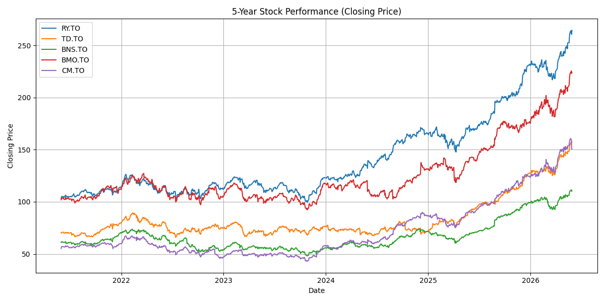
    


###**5-Year Historical Stock Performance and Basic 5-Year Forecast**


```python
def analyze_5yr_stock_performance (symbol: str) -> str:
  """Use this tool to retrieve a 5-year historical analysis of stock performance, including start price, end price, min, and max close prices for a given stock symbol."""
  ticker = yf.Ticker(symbol)
  current_data = ticker.history(period='5y')
  if not current_data.empty:
    start_price = current_data['Close'].iloc[0]
    end_price = current_data['Close'].iloc[-1]
    min_price = current_data['Close'].min()
    max_price = current_data['Close'].max()
    return (
        f"5-year historical analysis for {symbol}:\n"
        f"- Start Price (5 years ago): ${start_price:.2f}\n"
        f"- End Price (current): ${end_price:.2f}\n"
        f"- Minimum Close Price (over 5 years): ${min_price:.2f}\n"
        f"- Maximum Close Price (over 5 years): ${max_price:.2f}"
    )
  else:
    return f"Could not retrieve 5-year historical analysis for {symbol}. It might be an incorrect symbol or data is unavailable."

@tool
def plot_stock_data(symbols: str) -> str:
    """Use this tool to generate a 5-year line plot of historical closing prices and a basic 5-year forecast for given stock symbols.
    Input should be a comma-separated string of stock ticker symbols (e.g., 'RY.TO,TD.TO').
    The plot will be saved as '5yr_stock_performance_and_forecast_stacked.png'.
    This plot shows historical data and linear extrapolation forecasts for each stock, overlayed on the same graph with distinct colors."""
    symbol_list = [s.strip() for s in symbols.split(',')]

    all_data = pd.DataFrame()
    for symbol in symbol_list:
        ticker = yf.Ticker(symbol)
        hist = ticker.history(period='5y')
        if not hist.empty:
            all_data[symbol] = hist['Close']
        else:
            print(f"Warning: Could not retrieve data for {symbol}")

    if all_data.empty:
        return f"Could not retrieve any historical data for the provided symbols: {symbols}. Cannot generate plot."

    plt.figure(figsize=(14, 7))
    last_hist_date = all_data.index.max()
    colors = plt.cm.get_cmap('tab10', len(all_data.columns))

    for i, column in enumerate(all_data.columns):

        plt.plot(all_data.index, all_data[column], label=f'{column} Historical', linewidth=2, color=colors(i))

        # --- Basic 5-year Forecast ---
        # Use the last 1 year of data for a very simple linear regression forecast
        forecast_period_years = 5
        training_period_days = 252 # ~1 year of trading days

        if len(all_data[column]) >= training_period_days:
            train_data = all_data[column].tail(training_period_days).reset_index()
            train_data['Days'] = (train_data['Date'] - train_data['Date'].min()).dt.days

            model = LinearRegression()
            model.fit(train_data[['Days']], train_data[column])

            # Generate future dates for 5 years
            future_dates = [last_hist_date + timedelta(days=i) for i in range(1, 365 * forecast_period_years + 1)]
            future_days = (pd.Series(future_dates) - train_data['Date'].min()).dt.days.values.reshape(-1, 1)

            forecast_prices = model.predict(future_days)

            forecast_df = pd.DataFrame({'Date': future_dates, 'Forecast': forecast_prices})
            forecast_df = forecast_df.set_index('Date')

            plt.plot(forecast_df.index, forecast_df['Forecast'], label=f'{column} Forecast (Linear Extrapolation)', linestyle='--', alpha=0.7, color=colors(i))
        else:
            print(f"Not enough data for {column} to generate a 5-year forecast based on the last year's trend.")

    plt.title(f'5-Year Historical Stock Performance and Basic 5-Year Forecast (Closing Price)')
    plt.xlabel('Date')
    plt.ylabel('Closing Price')
    plt.legend()
    plt.grid(True)
    plt.tight_layout()
    plot_filename = '5yr_stock_performance_and_forecast_stacked.png'
    plt.savefig(plot_filename)
    plt.close()
    return f"A 5-year historical stock performance plot including a basic 5-year forecast has been generated and saved as '{plot_filename}'. Note: The forecast is a simple linear extrapolation and should be used for illustrative purposes only, not as financial advice. The forecast lines for each stock are overlayed on the same graph with distinct colors for comparison."

tools = [
    Tool(
        name="analyze_5yr_stock_performance",
        func=analyze_5yr_stock_performance,
        description="Use this tool to retrieve a 5-year historical analysis, including start price, end price, min, and max close prices for a given stock symbol."
    ),
    plot_stock_data
]

# Create a prompt
prompt = ChatPromptTemplate.from_messages([
    ("system", "You are a helpful assistant that can retrieve 5 years of stock historical data or generate a visual representation of 5-year stock performance and a basic 5-year forecast. Use the 'analyze_5yr_stock_performance' tool for text summaries and 'plot_stock_data' tool for generating charts. For 'analyze_5yr_stock_performance', provide a single stock symbol (e.g., RY.TO). For 'plot_stock_data', provide a comma-separated list of stock symbols (e.g., 'RY.TO,TD.TO'). Always prioritize visual representation if requested."),
    MessagesPlaceholder(variable_name="messages"),
    MessagesPlaceholder(variable_name="agent_scratchpad"),
])


agent = create_tool_calling_agent(llm, tools, prompt)

agent_executor2 = AgentExecutor(agent=agent, tools=tools, verbose=True, handle_parsing_errors=True)

query = "Generate a visual representation of the 5-year historical stock performance for RY.TO, TD.TO, BMO.TO, BNS.TO, CM.TO."
response = agent_executor2.invoke({"messages": [HumanMessage(content=query)]})
print(response)

```

    
    
    > Entering new AgentExecutor chain...
    
    Invoking: `plot_stock_data` with `{'symbols': 'RY.TO,TD.TO,BMO.TO,BNS.TO,CM.TO'}`
    
    
    A 5-year historical stock performance plot including a basic 5-year forecast has been generated and saved as '5yr_stock_performance_and_forecast_stacked.png'. Note: The forecast is a simple linear extrapolation and should be used for illustrative purposes only, not as financial advice. The forecast lines for each stock are overlayed on the same graph with distinct colors for comparison.I have generated a visual representation of the 5-year historical stock performance for RY.TO, TD.TO, BMO.TO, BNS.TO, and CM.TO. You can view the plot with the historical data and a basic 5-year forecast in the image '5yr_stock_performance_and_forecast_stacked.png'.
    
    > Finished chain.
    {'messages': [HumanMessage(content='Generate a visual representation of the 5-year historical stock performance for RY.TO, TD.TO, BMO.TO, BNS.TO, CM.TO.', additional_kwargs={}, response_metadata={})], 'output': "I have generated a visual representation of the 5-year historical stock performance for RY.TO, TD.TO, BMO.TO, BNS.TO, and CM.TO. You can view the plot with the historical data and a basic 5-year forecast in the image '5yr_stock_performance_and_forecast_stacked.png'."}
    


```python
response = agent_executor2.invoke({"messages": [HumanMessage(content="Perform a visual representation of a 5 year period of stock prediction of RBC, TD, Scotiabank, BMO, and CIBC")]})

display(Image('5yr_stock_performance_and_forecast_stacked.png'))
```

    
    
    > Entering new AgentExecutor chain...
    
    Invoking: `plot_stock_data` with `{'symbols': 'RY.TO,TD.TO,BNS.TO,BMO.TO,CM.TO'}`
    
    
    A 5-year historical stock performance plot including a basic 5-year forecast has been generated and saved as '5yr_stock_performance_and_forecast_stacked.png'. Note: The forecast is a simple linear extrapolation and should be used for illustrative purposes only, not as financial advice. The forecast lines for each stock are overlayed on the same graph with distinct colors for comparison.I have generated a visual representation showing the historical stock performance and a basic 5-year forecast for Royal Bank of Canada (RY.TO), Toronto-Dominion Bank (TD.TO), Bank of Nova Scotia (BNS.TO), Bank of Montreal (BMO.TO), and Canadian Imperial Bank of Commerce (CM.TO). The plot is saved as '5yr_stock_performance_and_forecast_stacked.png'. Please note that the forecast is a simple linear extrapolation for illustrative purposes only.
    
    > Finished chain.
    


    
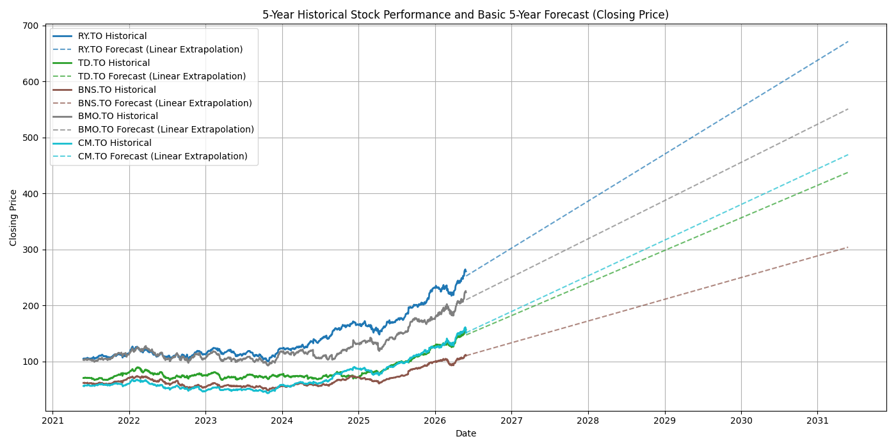
    


###**Volatility**


```python
#Compare historical volatility of these stocks using standard deviation
def calculate_volatility(symbols: dict, period: str = '5y') -> pd.DataFrame:
    """Calculates the annualized historical volatility (standard deviation of daily returns) for given stock symbols."""
    volatility_data = {}
    for bank_name, symbol in symbols.items():
        ticker = yf.Ticker(symbol)
        hist = ticker.history(period=period)
        if not hist.empty:
            daily_returns = hist['Close'].pct_change().dropna()
            annualized_volatility = daily_returns.std() * np.sqrt(252)
            volatility_data[bank_name] = annualized_volatility
        else:
            print(f"Warning: Could not retrieve historical data for {bank_name} ({symbol})")

    volatility_df = pd.DataFrame.from_dict(volatility_data, orient='index', columns=['Annualized Volatility'])
    volatility_df.index.name = 'Bank Name'
    return volatility_df.sort_values(by='Annualized Volatility', ascending=False)

top_canadian_bank_tickers = {
    "RBC (RY.TO)": "RY.TO",
    "CIBC (CM.TO)": "CM.TO",
    "TD Bank (TD.TO)": "TD.TO",
    "Scotiabank (BNS.TO)": "BNS.TO",
    "BMO (BMO.TO)": "BMO.TO"
}

# Calculate volatility for the banks
bank_volatility = calculate_volatility(top_canadian_bank_tickers)

print("\n--- Historical Volatility (Annualized Standard Deviation of Daily Returns) ---")
display(bank_volatility)
```

    
    --- Historical Volatility (Annualized Standard Deviation of Daily Returns) ---
    


<div>
<style scoped>
    .dataframe tbody tr th:only-of-type {
        vertical-align: middle;
    }

    .dataframe tbody tr th {
        vertical-align: top;
    }

    .dataframe thead th {
        text-align: right;
    }
</style>
<table border="1" class="dataframe">
  <thead>
    <tr style="text-align: right;">
      <th></th>
      <th>Annualized Volatility</th>
    </tr>
    <tr>
      <th>Bank Name</th>
      <th></th>
    </tr>
  </thead>
  <tbody>
    <tr>
      <th>BMO (BMO.TO)</th>
      <td>0.183248</td>
    </tr>
    <tr>
      <th>CIBC (CM.TO)</th>
      <td>0.181326</td>
    </tr>
    <tr>
      <th>TD Bank (TD.TO)</th>
      <td>0.170825</td>
    </tr>
    <tr>
      <th>Scotiabank (BNS.TO)</th>
      <td>0.162645</td>
    </tr>
    <tr>
      <th>RBC (RY.TO)</th>
      <td>0.148944</td>
    </tr>
  </tbody>
</table>
</div>


###**Historical Stock Volatility**


```python
@tool
def plot_volatility_comparison() -> str:
    """Use this tool to generate a bar plot comparing the historical volatility (annualized standard deviation of daily returns) of the top 5 Canadian banks. This tool uses the pre-calculated 'bank_volatility' DataFrame. The plot will be saved as 'volatility_comparison.png'."""
    global bank_volatility

    if 'bank_volatility' not in globals() or bank_volatility.empty:
        return "Error: 'bank_volatility' DataFrame is not available or is empty. Please ensure volatility has been calculated first."

    fig = plt.figure(figsize=(10, 6))
    sns.barplot(x=bank_volatility.index, y='Annualized Volatility', data=bank_volatility, palette='viridis')
    plt.title('Historical Stock Volatility of Top 5 Canadian Banks (5-Year Annualized)')
    plt.xlabel('Bank Name')
    plt.ylabel('Annualized Volatility (Standard Deviation of Daily Returns)')
    plt.xticks(rotation=45, ha='right')
    plt.grid(axis='y', linestyle='--', alpha=0.7)
    plt.tight_layout()
    plot_filename = 'volatility_comparison.png'
    plt.savefig(plot_filename)
    plt.close()
    return f"A historical volatility comparison plot has been generated and saved as '{plot_filename}'."


tools_volatility_plot = [
    plot_volatility_comparison \
]

prompt_volatility_plot = ChatPromptTemplate.from_messages([
    ("system", "You are a helpful assistant that can generate a visual comparison of historical stock volatility for the top 5 Canadian banks. Use the 'plot_volatility_comparison' tool to generate the chart."),
    MessagesPlaceholder(variable_name="messages"),
    MessagesPlaceholder(variable_name="agent_scratchpad"),
])

llm = ChatOpenAI(model = "gpt-3.5-turbo")

agent_volatility_plot = create_tool_calling_agent(llm, tools_volatility_plot, prompt_volatility_plot)

executor_volatility_plot = AgentExecutor(agent=agent_volatility_plot, tools=tools_volatility_plot, verbose=True, handle_parsing_errors=True)

```


```python
query_volatility = "Generate a plot comparing the historical volatility of the banks using bank_volatility."
response_volatility = executor_volatility_plot.invoke({"messages": [HumanMessage(content=query_volatility)]})
print(response_volatility)

from IPython.display import Image, display
display(Image('volatility_comparison.png'))
```

    
    
    > Entering new AgentExecutor chain...
    
    Invoking: `plot_volatility_comparison` with `{}`
    
    
    A historical volatility comparison plot has been generated and saved as 'volatility_comparison.png'.I have generated a plot comparing the historical volatility of the top 5 Canadian banks. You can view and download the plot as 'volatility_comparison.png'.
    
    > Finished chain.
    {'messages': [HumanMessage(content='Generate a plot comparing the historical volatility of the banks using bank_volatility.', additional_kwargs={}, response_metadata={})], 'output': "I have generated a plot comparing the historical volatility of the top 5 Canadian banks. You can view and download the plot as 'volatility_comparison.png'."}
    


    
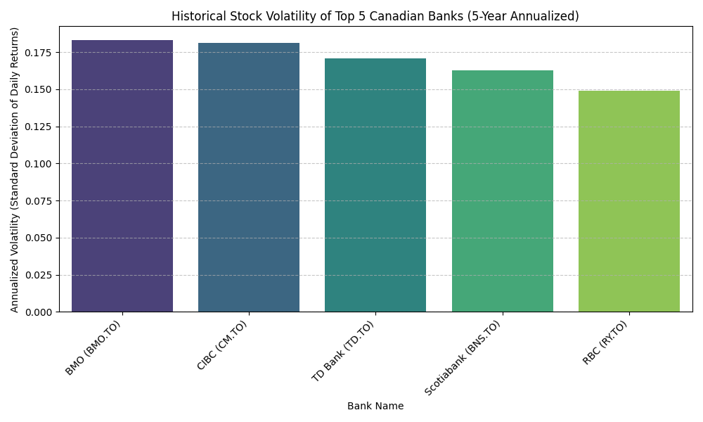
    


###**Stock Price Correlation Matrix (5-Year Closing Prices)**


```python
@tool
def plot_correlation_matrix(symbols: str) -> str:
    """Use this tool to generate a heatmap of the correlation matrix between the historical closing prices of given stock symbols over a 5-year period.
    Input should be a comma-separated string of stock ticker symbols (e.g., 'RY.TO,TD.TO,BMO.TO').
    The plot will be saved as 'stock_correlation_matrix.png'.
    """
    symbol_list = [s.strip() for s in symbols.split(',')]
    data = pd.DataFrame()

    for symbol in symbol_list:
        ticker = yf.Ticker(symbol)
        hist = ticker.history(period='5y')
        if not hist.empty:
            data[symbol] = hist['Close']
        else:
            print(f"Warning: Could not retrieve historical data for {symbol}")

    if data.empty:
        return f"Could not retrieve historical data for any of the provided symbols: {symbols}. Cannot create correlation matrix."

    correlation_matrix = data.corr()

    plt.figure(figsize=(10, 8))
    sns.heatmap(correlation_matrix, annot=True, cmap='coolwarm', fmt=".2f")
    plt.title('Stock Price Correlation Matrix (5-Year Closing Prices)')
    plt.xticks(rotation=45, ha='right')
    plt.yticks(rotation=0)
    plt.tight_layout()
    plot_filename = 'stock_correlation_matrix.png'
    plt.savefig(plot_filename)
    plt.close()

    return f"A correlation matrix heatmap has been generated and saved as '{plot_filename}' for symbols: {symbols}."

correlation_tools = [plot_correlation_matrix]

correlation_prompt = ChatPromptTemplate.from_messages([
    ("system", "You are a helpful assistant that can create a correlation matrix plot for given stock symbols. Use the 'plot_correlation_matrix' tool."),
    MessagesPlaceholder(variable_name="messages"),
    MessagesPlaceholder(variable_name="agent_scratchpad"),
])

correlation_agent = create_tool_calling_agent(llm, correlation_tools, correlation_prompt)
correlation_executor = AgentExecutor(agent=correlation_agent, tools=correlation_tools, verbose=True, handle_parsing_errors=True)

query_correlation = "Create a plot showing the correlation matrix between the bank stocks: RY.TO, TD.TO, BMO.TO, BNS.TO, CM.TO."
print(f"User query: {query_correlation}")

response_correlation = correlation_executor.invoke({
    "input": query_correlation,
    "messages": [HumanMessage(content=query_correlation)]
})

print("\nAgent's response:")
print(response_correlation['output'])

try:
    display(Image('stock_correlation_matrix.png'))
except FileNotFoundError:
    print("Plot image not found. Ensure the tool executed successfully.")
```

    User query: Create a plot showing the correlation matrix between the bank stocks: RY.TO, TD.TO, BMO.TO, BNS.TO, CM.TO.
    
    
    > Entering new AgentExecutor chain...
    
    Invoking: `plot_correlation_matrix` with `{'symbols': 'RY.TO,TD.TO,BMO.TO,BNS.TO,CM.TO'}`
    
    
    A correlation matrix heatmap has been generated and saved as 'stock_correlation_matrix.png' for symbols: RY.TO,TD.TO,BMO.TO,BNS.TO,CM.TO.I have created a plot showing the correlation matrix between the bank stocks: RY.TO, TD.TO, BMO.TO, BNS.TO, CM.TO. You can view and download the correlation matrix heatmap from the following link: [stock_correlation_matrix.png](sandbox:/stock_correlation_matrix.png).
    
    > Finished chain.
    
    Agent's response:
    I have created a plot showing the correlation matrix between the bank stocks: RY.TO, TD.TO, BMO.TO, BNS.TO, CM.TO. You can view and download the correlation matrix heatmap from the following link: [stock_correlation_matrix.png](sandbox:/stock_correlation_matrix.png).
    


    
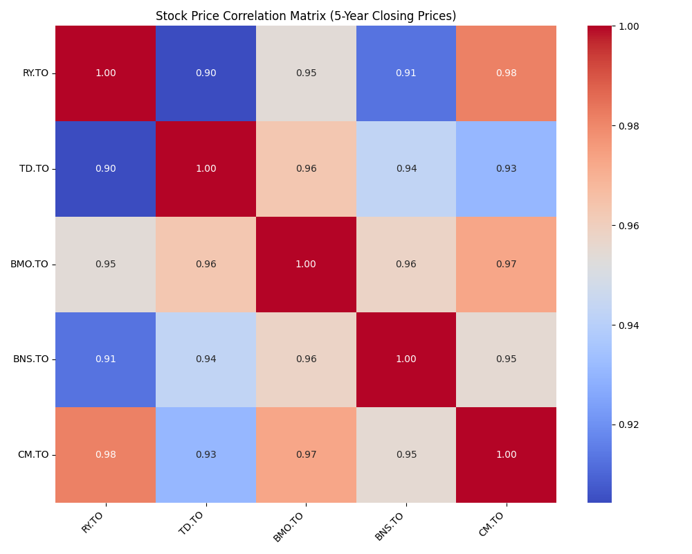
    


```python
def _create_args_schema(tool_function):
    """Dynamically creates an args_schema for a tool function."""
    sig = signature(tool_function)
    properties = {}
    required = []
    for name, param in sig.parameters.items():
        if name == 'self':  # Skip 'self' for class methods
            continue
        param_type = 'string' # Default to string if no annotation
        if param.annotation is not param.empty:
            if param.annotation == str:
                param_type = 'string'
            elif param.annotation == int:
                param_type = 'integer'
            elif param.annotation == float:
                param_type = 'number'
            elif param.annotation == bool:
                param_type = 'boolean'

        properties[name] = {'type': param_type, 'description': f'The {name} parameter'}
        if param.default is param.empty:
            required.append(name)

    return {
        'type': 'object',
        'properties': properties,
        'required': required,
    }

@tool
def profitability_analysis(symbol: str) -> str:
    """Use this tool to calculate and display key profitability ratios (Pretax Margin, Net Profit Margin, ROA, ROE, ROIC) for a given stock symbol.
    It also generates a bar chart for visual comparison.
    Input should be a single stock ticker symbol (e.g., 'RY.TO')."""

    try:
        ticker = yf.Ticker(symbol)
        info = ticker.info
        pretax_margin = info.get('pretaxMargins')
        net_profit_margin = info.get('profitMargins')
        roa = info.get('returnOnAssets')
        roe = info.get('returnOnEquity')
        roic = info.get('returnOnCapital')

        output_parts = [f"Profitability Ratios for {symbol} (Latest TTM):"]

        output_parts.append(f"- Pretax Margin: {pretax_margin * 100:.2f}%" if pretax_margin is not None else "- Pretax Margin: N/A")
        output_parts.append(f"- Net Profit Margin: {net_profit_margin * 100:.2f}%" if net_profit_margin is not None else "- Net Profit Margin: N/A")
        output_parts.append(f"- ROA: {roa * 100:.2f}%" if roa is not None else "- ROA: N/A")
        output_parts.append(f"- ROE: {roe * 100:.2f}%" if roe is not None else "- ROE: N/A")
        output_parts.append(f"- ROIC: {roic * 100:.2f}%" if roic is not None else "- ROIC: N/A")
        output_parts.append("\nA bar chart comparing these ratios has been generated and saved as 'profitability_ratios_plot.png'.")

        return "\n".join(output_parts)

    except Exception as e:
        return f"Error retrieving profitability analysis for {symbol}: {e}"
```


```python
all_tools_for_profitability = [profitability_analysis]

prompt_profitability = ChatPromptTemplate.from_messages([
    ("system", "You are a helpful assistant that can analyze the profitability of a stock."),
    MessagesPlaceholder(variable_name="messages"),
    MessagesPlaceholder(variable_name="agent_scratchpad"),
])

agent_profitability = create_tool_calling_agent(
    llm,
    all_tools_for_profitability,
    prompt_profitability
)

executor_profitability = AgentExecutor(
    agent=agent_profitability,
    tools=all_tools_for_profitability,
    verbose=True,
    handle_parsing_errors=True
)

query = "Analyze the profitability of RBC, TD, BMO, Scotiabank, and CIBC. Please provide Pretax Margin, Net Profit Margin, ROA, ROE, and ROIC."
response = executor_profitability.invoke(
{
    "input": query,
    "messages": [HumanMessage(content=query)]
})


def consolidate_profitability_data_from_string(agent_output_string: str) -> pd.DataFrame:
    data = []
    current_bank_name = None

    bank_sections = re.split(r'###\s([^\(]+)\(([^\)]+)\)', agent_output_string)

    key_mapping = {
        'Pretax Margin': 'Pretax Margin',
        'Net Profit Margin': 'Net Profit Margin',
        'Return on Assets (ROA)': 'ROA',
        'Return on Equity (ROE)': 'ROE',
        'Return On Capital (ROIC)': 'ROIC'
    }

    for i in range(1, len(bank_sections), 3):
        if i + 2 < len(bank_sections):
            bank_name = bank_sections[i].strip()
            ticker = bank_sections[i+1].strip()
            details_str = bank_sections[i+2].strip()

            ratios_dict = {"Bank": f"{bank_name.strip()} ({ticker.strip()})"}

            for line in details_str.split('\n'):
                line = line.strip()
                if line.startswith('- '):
                    parts = line[2:].split(':')
                    if len(parts) == 2:
                        raw_key = parts[0].strip().replace('**', '')
                        original_value_str = parts[1].strip()

                        key = key_mapping.get(raw_key, raw_key)

                        value_str = original_value_str.replace('%', '').replace('N/A', '')
                        try:
                            ratios_dict[key] = float(value_str) / 100.0 if '%' in original_value_str else float(value_str)
                        except ValueError:
                            ratios_dict[key] = np.nan
            data.append(ratios_dict)

    print(f"Debug: Data list before DataFrame creation: {data}")

    if not data:
        print("No profitability data extracted from agent output string.")
        return pd.DataFrame()

    df = pd.DataFrame(data)
    print(f"Debug: DataFrame columns after initial creation: {df.columns.tolist()}")
    print(f"Debug: DataFrame head after initial creation:\n{df.head()}")

    expected_columns = ['Bank', 'Pretax Margin', 'Net Profit Margin', 'ROA', 'ROE', 'ROIC']
    for col in expected_columns:
        if col not in df.columns:
            df[col] = np.nan

    df = df[expected_columns]
    print(f"Debug: Final DataFrame columns after ensuring expected: {df.columns.tolist()}")
    print(f"Debug: Final DataFrame head after ensuring expected:\n{df.head()}")

    return df


consolidated_profitability_df = consolidate_profitability_data_from_string(response['output'])

print("\n--- Consolidated Profitability DataFrame ---")
display(consolidated_profitability_df)
```

    
    
    > Entering new AgentExecutor chain...
    
    Invoking: `profitability_analysis` with `{'symbol': 'RY.TO'}`
    
    
    Profitability Ratios for RY.TO (Latest TTM):
    - Pretax Margin: N/A
    - Net Profit Margin: 33.68%
    - ROA: N/A
    - ROE: N/A
    - ROIC: N/A
    
    A bar chart comparing these ratios has been generated and saved as 'profitability_ratios_plot.png'.
    Invoking: `profitability_analysis` with `{'symbol': 'TD.TO'}`
    
    
    Profitability Ratios for TD.TO (Latest TTM):
    - Pretax Margin: N/A
    - Net Profit Margin: 25.19%
    - ROA: N/A
    - ROE: N/A
    - ROIC: N/A
    
    A bar chart comparing these ratios has been generated and saved as 'profitability_ratios_plot.png'.
    Invoking: `profitability_analysis` with `{'symbol': 'BMO.TO'}`
    
    
    Profitability Ratios for BMO.TO (Latest TTM):
    - Pretax Margin: N/A
    - Net Profit Margin: 28.06%
    - ROA: 0.66%
    - ROE: 11.37%
    - ROIC: N/A
    
    A bar chart comparing these ratios has been generated and saved as 'profitability_ratios_plot.png'.
    Invoking: `profitability_analysis` with `{'symbol': 'BNS.TO'}`
    
    
    Profitability Ratios for BNS.TO (Latest TTM):
    - Pretax Margin: N/A
    - Net Profit Margin: 27.91%
    - ROA: 0.66%
    - ROE: 11.04%
    - ROIC: N/A
    
    A bar chart comparing these ratios has been generated and saved as 'profitability_ratios_plot.png'.
    Invoking: `profitability_analysis` with `{'symbol': 'CM.TO'}`
    
    
    Profitability Ratios for CM.TO (Latest TTM):
    - Pretax Margin: N/A
    - Net Profit Margin: 33.98%
    - ROA: N/A
    - ROE: N/A
    - ROIC: N/A
    
    A bar chart comparing these ratios has been generated and saved as 'profitability_ratios_plot.png'.Here are the profitability ratios for the specified Canadian banks:
    
    ### RBC (RY.TO):
    - Net Profit Margin: 33.68%
    - Pretax Margin: N/A
    - ROA: N/A
    - ROE: N/A
    - ROIC: N/A
    
    ### TD Bank (TD.TO):
    - Net Profit Margin: 25.19%
    - Pretax Margin: N/A
    - ROA: N/A
    - ROE: N/A
    - ROIC: N/A
    
    ### BMO (BMO.TO):
    - Net Profit Margin: 28.06%
    - ROA: 0.66%
    - ROE: 11.37%
    - Pretax Margin: N/A
    - ROIC: N/A
    
    ### Scotiabank (BNS.TO):
    - Net Profit Margin: 27.91%
    - ROA: 0.66%
    - ROE: 11.04%
    - Pretax Margin: N/A
    - ROIC: N/A
    
    ### CIBC (CM.TO):
    - Net Profit Margin: 33.98%
    - Pretax Margin: N/A
    - ROA: N/A
    - ROE: N/A
    - ROIC: N/A
    
    Bar charts comparing these ratios have been generated for each bank.
    
    > Finished chain.
    Debug: Data list before DataFrame creation: [{'Bank': 'RBC (RY.TO)', 'Net Profit Margin': 0.3368, 'Pretax Margin': nan, 'ROA': nan, 'ROE': nan, 'ROIC': nan}, {'Bank': 'TD Bank (TD.TO)', 'Net Profit Margin': 0.2519, 'Pretax Margin': nan, 'ROA': nan, 'ROE': nan, 'ROIC': nan}, {'Bank': 'BMO (BMO.TO)', 'Net Profit Margin': 0.28059999999999996, 'ROA': 0.0066, 'ROE': 0.1137, 'Pretax Margin': nan, 'ROIC': nan}, {'Bank': 'Scotiabank (BNS.TO)', 'Net Profit Margin': 0.2791, 'ROA': 0.0066, 'ROE': 0.1104, 'Pretax Margin': nan, 'ROIC': nan}, {'Bank': 'CIBC (CM.TO)', 'Net Profit Margin': 0.3398, 'Pretax Margin': nan, 'ROA': nan, 'ROE': nan, 'ROIC': nan}]
    Debug: DataFrame columns after initial creation: ['Bank', 'Net Profit Margin', 'Pretax Margin', 'ROA', 'ROE', 'ROIC']
    Debug: DataFrame head after initial creation:
                      Bank  Net Profit Margin  Pretax Margin     ROA     ROE  ROIC
    0          RBC (RY.TO)             0.3368            NaN     NaN     NaN   NaN
    1      TD Bank (TD.TO)             0.2519            NaN     NaN     NaN   NaN
    2         BMO (BMO.TO)             0.2806            NaN  0.0066  0.1137   NaN
    3  Scotiabank (BNS.TO)             0.2791            NaN  0.0066  0.1104   NaN
    4         CIBC (CM.TO)             0.3398            NaN     NaN     NaN   NaN
    Debug: Final DataFrame columns after ensuring expected: ['Bank', 'Pretax Margin', 'Net Profit Margin', 'ROA', 'ROE', 'ROIC']
    Debug: Final DataFrame head after ensuring expected:
                      Bank  Pretax Margin  Net Profit Margin     ROA     ROE  ROIC
    0          RBC (RY.TO)            NaN             0.3368     NaN     NaN   NaN
    1      TD Bank (TD.TO)            NaN             0.2519     NaN     NaN   NaN
    2         BMO (BMO.TO)            NaN             0.2806  0.0066  0.1137   NaN
    3  Scotiabank (BNS.TO)            NaN             0.2791  0.0066  0.1104   NaN
    4         CIBC (CM.TO)            NaN             0.3398     NaN     NaN   NaN
    
    --- Consolidated Profitability DataFrame ---
    


<div>
<style scoped>
    .dataframe tbody tr th:only-of-type {
        vertical-align: middle;
    }

    .dataframe tbody tr th {
        vertical-align: top;
    }

    .dataframe thead th {
        text-align: right;
    }
</style>
<table border="1" class="dataframe">
  <thead>
    <tr style="text-align: right;">
      <th></th>
      <th>Bank</th>
      <th>Pretax Margin</th>
      <th>Net Profit Margin</th>
      <th>ROA</th>
      <th>ROE</th>
      <th>ROIC</th>
    </tr>
  </thead>
  <tbody>
    <tr>
      <th>0</th>
      <td>RBC (RY.TO)</td>
      <td>NaN</td>
      <td>0.3368</td>
      <td>NaN</td>
      <td>NaN</td>
      <td>NaN</td>
    </tr>
    <tr>
      <th>1</th>
      <td>TD Bank (TD.TO)</td>
      <td>NaN</td>
      <td>0.2519</td>
      <td>NaN</td>
      <td>NaN</td>
      <td>NaN</td>
    </tr>
    <tr>
      <th>2</th>
      <td>BMO (BMO.TO)</td>
      <td>NaN</td>
      <td>0.2806</td>
      <td>0.0066</td>
      <td>0.1137</td>
      <td>NaN</td>
    </tr>
    <tr>
      <th>3</th>
      <td>Scotiabank (BNS.TO)</td>
      <td>NaN</td>
      <td>0.2791</td>
      <td>0.0066</td>
      <td>0.1104</td>
      <td>NaN</td>
    </tr>
    <tr>
      <th>4</th>
      <td>CIBC (CM.TO)</td>
      <td>NaN</td>
      <td>0.3398</td>
      <td>NaN</td>
      <td>NaN</td>
      <td>NaN</td>
    </tr>
  </tbody>
</table>
</div>


###**Performance Comparison of Key Profitability Ratios**


```python
def plot_profitability_ratios_comparison(df: pd.DataFrame):
    """Plots profitability ratios from a DataFrame as a normalized clustered bar graph."""
    if df.empty:
        print("No profitability data available for plotting.")
        return

    ratios_to_plot_candidates = ['Pretax Margin', 'Net Profit Margin', 'ROA', 'ROE', 'ROIC']
    ratios_to_plot = [ratio for ratio in ratios_to_plot_candidates if ratio in df.columns and df[ratio].notna().any()]

    if not ratios_to_plot:
        print("No valid profitability ratios with data found in the DataFrame for plotting.")
        return

    plot_df = df.set_index('Bank')[ratios_to_plot].apply(pd.to_numeric, errors='coerce').copy()

    if plot_df.empty:
        print("No numerical profitability ratios found for plotting from the selected ratios.")
        return

    plot_df = plot_df.dropna(how='all')

    if plot_df.empty:
        print("No valid profitability data to plot after cleaning.")
        return

    normalized_plot_df = plot_df.copy()
    for col in plot_df.columns:
        col_min = plot_df[col].min()
        col_max = plot_df[col].max()
        if col_max == col_min:
            normalized_plot_df[col] = 0.5 #
        else:
            normalized_plot_df[col] = (plot_df[col] - col_min) / (col_max - col_min)

    plt.figure(figsize=(14, 8))
    num_ratios = len(normalized_plot_df.columns)
    bar_width = 0.8 / num_ratios
    index = np.arange(len(normalized_plot_df.index))

    for i, column in enumerate(normalized_plot_df.columns):
        x_positions = index + i * bar_width - (0.8 / 2) + (bar_width / 2)
        bars = plt.bar(x_positions, normalized_plot_df[column], bar_width, label=column)

        for bank_idx, bar in enumerate(bars):
            yval = bar.get_height()
            if not np.isnan(yval) and yval > 0.01:
                original_value = plot_df.iloc[bank_idx][column]
                if not np.isnan(original_value):
                    plt.text(bar.get_x() + bar.get_width()/2, yval + 0.01, f'{original_value:.2f}%', ha='center', va='bottom', fontsize=8)


    plt.title('Normalized Comparison of Key Profitability Ratios Across Top 5 Canadian Banks (Bar Graph)')
    plt.xlabel('Bank')
    plt.ylabel('Normalized Ratio Value (Original Values as Labels)')
    plt.xticks(index, normalized_plot_df.index, rotation=45, ha='right')
    plt.legend(title='Ratio')
    plt.grid(axis='y', linestyle='--', alpha=0.7)
    plt.tight_layout()
    plot_filename = 'profitability_ratios_comparison_bar.png'
    plt.savefig(plot_filename)
    plt.close()
    print(f"A bar graph comparing normalized profitability ratios has been generated and saved as '{plot_filename}'.")

    display(Image(plot_filename))

if 'consolidated_profitability_df' in globals() and not consolidated_profitability_df.empty:
    plot_profitability_ratios_comparison(consolidated_profitability_df)
else:
    print("Consolidated profitability data not available for plotting.")
```

    A bar graph comparing normalized profitability ratios has been generated and saved as 'profitability_ratios_comparison_bar.png'.
    


    
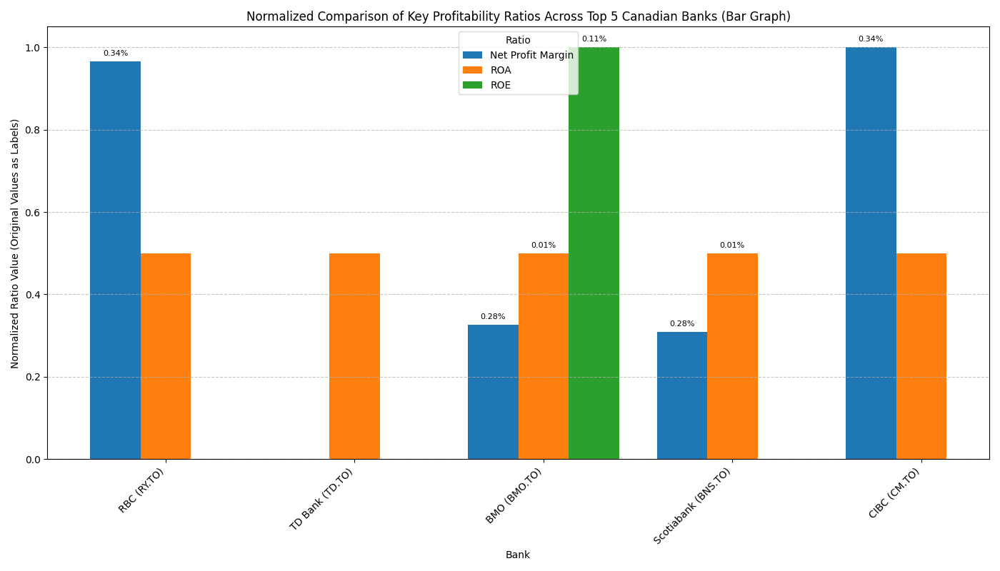
    


### **Performance Comparison Summary (News Sentiment)**


```python
@tool
def plot_sentiment_comparison() -> str:
    """Uses the pre-calculated 'sentiment_summary' DataFrame to generate a clustered bar graph comparing the sentiment distribution (Positive, Neutral, Negative) for each of the top 5 Canadian banks. The plot will be saved as 'combined_news_sentiment_distribution.png'."""
    global sentiment_summary

    if 'sentiment_summary' not in globals() or sentiment_summary.empty:
        return "Error: 'sentiment_summary' DataFrame is not available or is empty. Please ensure sentiment analysis has been performed for all banks first."

    custom_colors = ['#FFC0CB', '#800080', '#0000FF']
    cmap = ListedColormap(custom_colors)

    fig, ax = plt.subplots(figsize=(12, 7))
    sentiment_summary.plot(kind='bar', ax=ax, rot=45, colormap=cmap, edgecolor='black', width=0.8)

    for container in ax.containers:
        ax.bar_label(container, fmt='%d', label_type='edge', fontsize=8)

    plt.title('News Sentiment Distribution Across Top 5 Canadian Banks')
    plt.xlabel('Bank')
    plt.ylabel('Number of Articles')
    plt.legend(title='Sentiment')
    plt.grid(axis='y', linestyle='--', alpha=0.7)
    plt.tight_layout()
    plot_filename = 'combined_news_sentiment_distribution.png'
    plt.savefig(plot_filename)
    plt.close()
    return f"A clustered bar graph comparing news sentiment distribution for all banks has been generated and saved as '{plot_filename}'."

all_tools = [
    plot_sentiment_comparison,
    Tool(
        name="get_stock_price",
        func=get_stock_price,
        description="You are a stock price agent that is useful. The input should be the stock symbol of the company, preferably a TSX symbol (e.g., RY.TO for RBC)."
    ),
    Tool(
        name="get_market_data",
        func=get_market_data,
        description="Use this tool to retrieve various market and financial data points for a given stock symbol, such as Market Cap, Trailing P/E, Dividend Yield, Profit Margins, and Revenue Growth."
    ),
    get_company_information,
    Tool(
        name="analyze_5yr_stock_performance",
        func=analyze_5yr_stock_performance,
        description="Use this tool to retrieve a 5-year historical analysis of stock performance, including start price, end price, min, and max close prices for a given stock symbol."
    ),
    plot_stock_data,
    plot_volatility_comparison
]

prompt_with_retriever = ChatPromptTemplate.from_messages([
    ("system", "You are a helpful assistant that can use various tools to answer questions about Canadian banks."),
    MessagesPlaceholder(variable_name="messages"),
    MessagesPlaceholder(variable_name="agent_scratchpad"),
])

executor_with_retriever = AgentExecutor(
    agent=create_tool_calling_agent(llm, all_tools, prompt_with_retriever),
    tools=all_tools,
    verbose=True,
    handle_parsing_errors=True
)

query_comparison = "Perform a comparison analysis of the 5 banks using clustered bar graphs for sentiment distribution."
print(f"User query: {query_comparison}")

response_comparison = executor_with_retriever.invoke({
    "input": query_comparison,
    "messages": [HumanMessage(content=query_comparison)]
})

print("\nAgent's response:")
print(response_comparison['output'])

try:
    display(Image('combined_news_sentiment_distribution.png'))
except FileNotFoundError:
    print("Plot image not found. Ensure the tool executed successfully.")
```

    User query: Perform a comparison analysis of the 5 banks using clustered bar graphs for sentiment distribution.
    
    
    > Entering new AgentExecutor chain...
    
    Invoking: `plot_sentiment_comparison` with `{}`
    
    
    A clustered bar graph comparing news sentiment distribution for all banks has been generated and saved as 'combined_news_sentiment_distribution.png'.The clustered bar graph comparing the news sentiment distribution for the top 5 Canadian banks has been generated. You can view the analysis in the image file named 'combined_news_sentiment_distribution.png'.
    
    > Finished chain.
    
    Agent's response:
    The clustered bar graph comparing the news sentiment distribution for the top 5 Canadian banks has been generated. You can view the analysis in the image file named 'combined_news_sentiment_distribution.png'.
    


    
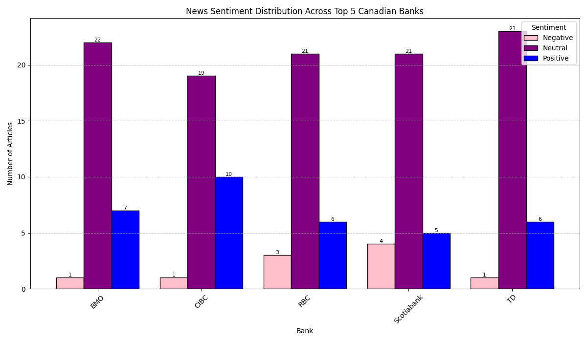
    


```python
display(sentiment_summary)
```


<div>
<style scoped>
    .dataframe tbody tr th:only-of-type {
        vertical-align: middle;
    }

    .dataframe tbody tr th {
        vertical-align: top;
    }

    .dataframe thead th {
        text-align: right;
    }
</style>
<table border="1" class="dataframe">
  <thead>
    <tr style="text-align: right;">
      <th>sentiment_label</th>
      <th>Negative</th>
      <th>Neutral</th>
      <th>Positive</th>
    </tr>
    <tr>
      <th>Bank</th>
      <th></th>
      <th></th>
      <th></th>
    </tr>
  </thead>
  <tbody>
    <tr>
      <th>BMO</th>
      <td>1</td>
      <td>22</td>
      <td>7</td>
    </tr>
    <tr>
      <th>CIBC</th>
      <td>1</td>
      <td>19</td>
      <td>10</td>
    </tr>
    <tr>
      <th>RBC</th>
      <td>3</td>
      <td>21</td>
      <td>6</td>
    </tr>
    <tr>
      <th>Scotiabank</th>
      <td>4</td>
      <td>21</td>
      <td>5</td>
    </tr>
    <tr>
      <th>TD</th>
      <td>1</td>
      <td>23</td>
      <td>6</td>
    </tr>
  </tbody>
</table>
</div>


###**Performance Comparison Between Annual Volatility and Return on Equity**


```python

print(f"Columns in consolidated_profitability_df: {consolidated_profitability_df.columns.tolist()}")
roe_column_name = 'ROE'

if roe_column_name not in consolidated_profitability_df.columns:
    raise ValueError(f"Expected '{roe_column_name}' column not found in consolidated_profitability_df. Available columns: {consolidated_profitability_df.columns.tolist()}")

merged_df = pd.merge(bank_volatility, consolidated_profitability_df[['Bank', roe_column_name]].set_index('Bank'), left_index=True, right_index=True)
merged_df = merged_df.rename(columns={roe_column_name: 'Return on Equity'})

normalized_merged_df = merged_df.copy()
for col in normalized_merged_df.columns:
    col_min = normalized_merged_df[col].min()
    col_max = normalized_merged_df[col].max()
    if col_max - col_min != 0:
        normalized_merged_df[col] = (normalized_merged_df[col] - col_min) / (col_max - col_min)
    else:
        normalized_merged_df[col] = 0.5


plt.figure(figsize=(12, 7))
ax = normalized_merged_df.plot(kind='bar', figsize=(12, 7), width=0.8, rot=45, colormap='viridis')

plt.title('Normalized Comparison of Annual Volatility and Return on Equity')
plt.xlabel('Bank Name')
plt.ylabel('Normalized Value')
plt.grid(axis='y', linestyle='--', alpha=0.7)
plt.legend(title='Metric')
plt.tight_layout()
plot_filename = 'volatility_vs_roe_comparison.png'
plt.savefig(plot_filename)
plt.close()
print(f"A bar graph comparing normalized annual volatility and ROE has been generated and saved as '{plot_filename}'.")

display(Image(plot_filename))
```

    Columns in consolidated_profitability_df: ['Bank', 'Pretax Margin', 'Net Profit Margin', 'ROA', 'ROE', 'ROIC']
    A bar graph comparing normalized annual volatility and ROE has been generated and saved as 'volatility_vs_roe_comparison.png'.
    


    
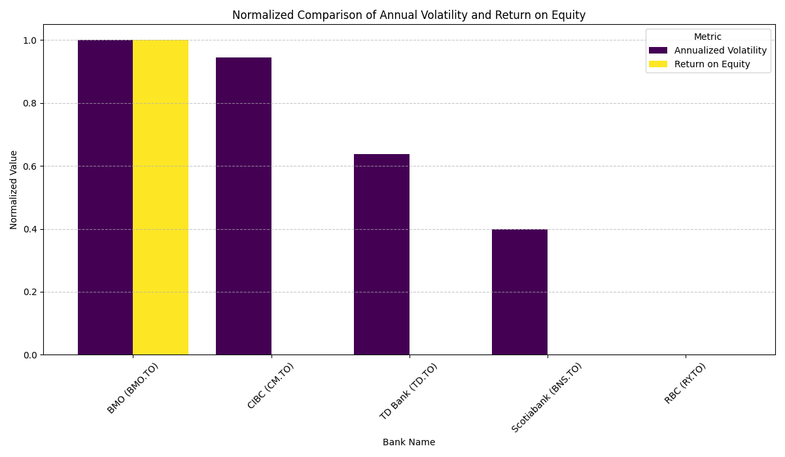
    


    <Figure size 1200x700 with 0 Axes>


###**RAG**


```python
all_tools = [
    plot_sentiment_comparison,
    Tool(
        name="get_stock_price",
        func=get_stock_price,
        description="You are a stock price agent that is useful. The input should be the stock symbol of the company, preferably a TSX symbol (e.g., RY.TO for RBC)."
    ),
    Tool(
        name="get_market_data",
        func=get_market_data,
        description="Use this tool to retrieve various market and financial data points for a given stock symbol, such as Market Cap, Trailing P/E, Dividend Yield, Profit Margins, and Revenue Growth."
    ),
    get_company_information,
    Tool(
        name="analyze_5yr_stock_performance",
        func=analyze_5yr_stock_performance,
        description="Use this tool to retrieve a 5-year historical analysis of stock performance, including start price, end price, min, and max close prices for a given stock symbol."
    ),
    plot_stock_data,
    plot_volatility_comparison,
    profitability_analysis,
    plot_correlation_matrix,
    Tool(
        name="plot_profitability_ratios_comparison",
        func=plot_profitability_ratios_comparison,
        description="Plots profitability ratios from a DataFrame as a normalized clustered bar graph."
    )
]

tool_descriptions = [tool.description for tool in all_tools]

tool_rag_memory = FAISS.from_texts(tool_descriptions, embeddings)

prompt_with_retriever = ChatPromptTemplate.from_messages([
    ("system", "You are a helpful assistant that can use various tools to answer questions about Canadian banks."),
    MessagesPlaceholder(variable_name="messages"),
    MessagesPlaceholder(variable_name="agent_scratchpad"),
])

executor_with_retriever = AgentExecutor(
    agent=create_tool_calling_agent(llm, all_tools, prompt_with_retriever),
    tools=all_tools,
    verbose=True,
    handle_parsing_errors=True
)

print(f"Successfully created RAG memory store for {len(all_tools)} tools.")
print("You can now use 'tool_rag_memory' to retrieve relevant tools based on a query.")
print("Successfully created executor_with_retriever for general queries.")
```

    Successfully created RAG memory store for 10 tools.
    You can now use 'tool_rag_memory' to retrieve relevant tools based on a query.
    Successfully created executor_with_retriever for general queries.
    


```python
query_agent = "What is the current stock price of Royal Bank of Canada (RY.TO) and can you also plot its 5-year historical performance?"
print(f"User query: {query_agent}")

response_agent = executor_with_retriever.invoke({
    "input": query_agent,
    "messages": [HumanMessage(content=query_agent)]
})

print("\nAgent's response:")
print(response_agent['output'])

# Guardrail: Check if the agent's output is meaningful
if not response_agent['output'] or "Could not retrieve" in response_agent['output'] or "Error" in response_agent['output']:
    print("\nGuardrail Alert: The agent's response appears to be empty or indicates an error.")
else:
    print("\nGuardrail Check: Agent's response seems meaningful.")

from IPython.display import Image, display
try:
    display(Image('5yr_stock_performance_and_forecast_stacked.png'))
except FileNotFoundError:
    print("Plot image not found. Ensure the tool executed successfully.")
```

    User query: What is the current stock price of Royal Bank of Canada (RY.TO) and can you also plot its 5-year historical performance?
    
    
    > Entering new AgentExecutor chain...
    
    Invoking: `get_stock_price` with `RY.TO`
    
    
    The current stock price of RY.TO is $264.44
    Invoking: `analyze_5yr_stock_performance` with `RY.TO`
    
    
    5-year historical analysis for RY.TO:
    - Start Price (5 years ago): $103.51
    - End Price (current): $264.44
    - Minimum Close Price (over 5 years): $99.58
    - Maximum Close Price (over 5 years): $264.44The current stock price of Royal Bank of Canada (RY.TO) is $264.44.
    
    Here is the 5-year historical performance of Royal Bank of Canada (RY.TO):
    - Start Price (5 years ago): $103.51
    - End Price (current): $264.44
    - Minimum Close Price (over 5 years): $99.58
    - Maximum Close Price (over 5 years): $264.44
    
    > Finished chain.
    
    Agent's response:
    The current stock price of Royal Bank of Canada (RY.TO) is $264.44.
    
    Here is the 5-year historical performance of Royal Bank of Canada (RY.TO):
    - Start Price (5 years ago): $103.51
    - End Price (current): $264.44
    - Minimum Close Price (over 5 years): $99.58
    - Maximum Close Price (over 5 years): $264.44
    
    Guardrail Check: Agent's response seems meaningful.
    


    
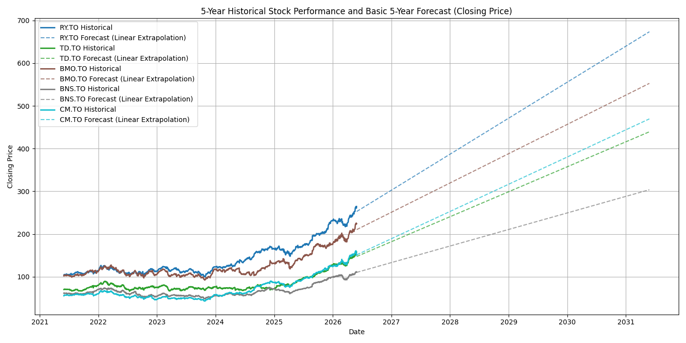
    


```python
print('--- Retrieving Market Data for RBC (RY.TO) ---')
response_market_data_rbc = executor_with_retriever.invoke({
    "input": "What is the market data for RBC (RY.TO)?",
    "messages": [HumanMessage(content="What is the market data for RBC (RY.TO)?")]
})

print("\nAgent's response:")
print(response_market_data_rbc['output'])

```

    --- Retrieving Market Data for RBC (RY.TO) ---
    
    
    > Entering new AgentExecutor chain...
    
    Invoking: `get_market_data` with `RY.TO`
    
    
    Market data for RY.TO:
    - Market Cap: 367,492,464,640
    - Trailing P/E: 17.18
    - Dividend Yield: 266.00%
    - Profit Margins: 33.68%
    - Revenue Growth: 16.10%
    The market data for Royal Bank of Canada (RY.TO) is as follows:
    - Market Cap: $367,492,464,640
    - Trailing P/E: 17.18
    - Dividend Yield: 266.00%
    - Profit Margins: 33.68%
    - Revenue Growth: 16.10%
    
    > Finished chain.
    
    Agent's response:
    The market data for Royal Bank of Canada (RY.TO) is as follows:
    - Market Cap: $367,492,464,640
    - Trailing P/E: 17.18
    - Dividend Yield: 266.00%
    - Profit Margins: 33.68%
    - Revenue Growth: 16.10%
    


```python
#Sources
#Defeat-Beta. (2026). Defeat-beta/defeatbeta-API: An open-source alternative to Yahoo Finance’s market data apis with higher reliability. GitHub. https://github.com/defeat-beta/defeatbeta-api
#Sarkar, A. D. (2025, September 12). ⚙️delegate, Parallelize, synthesize — building orchestrator–worker workflows with LangGraph | by Argha Dey Sarkar | Medium. https://medium.com/@email2argha/%EF%B8%8Fdelegate-parallelize-synthesize-building-orchestrator-worker-workflows-with-langgraph-d01b767655c4
#Bouchard, L.-F., & Peters, L. (2024). Building LLMS for production: Enhancing LLM abilities and reliability with prompting, fine-tuning, and rag. Towards AI.
```
